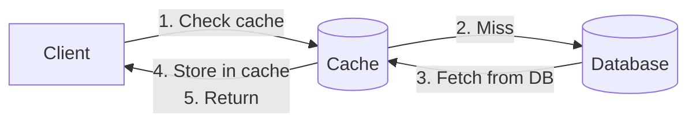
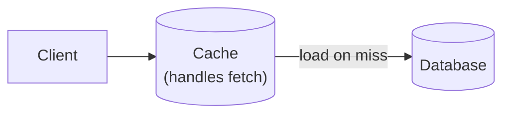
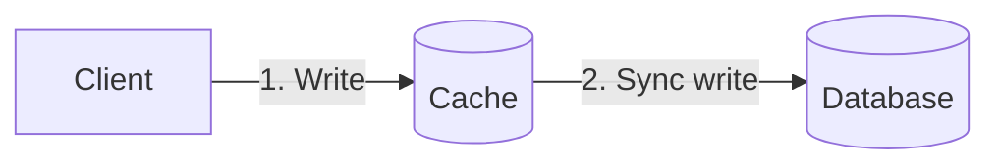
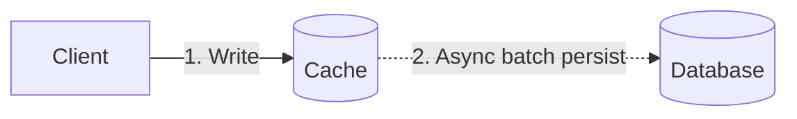

# キャッシュ戦略

> **注:** この記事は英語版からの翻訳です。コードブロックおよびMermaidダイアグラムは原文のまま維持しています。

## TL;DR

キャッシュは、頻繁にアクセスされるデータを高速ストレージに保存することで、レイテンシとデータベース負荷を削減します。主要な戦略には、Cache-aside（遅延読み込み）、Read-through、Write-through、Write-behind、Write-aroundがあります。読み取り/書き込み比率、一貫性要件、障害耐性に基づいて選択してください。キャッシュヒット率が最も重要な指標であり、アクセスパターンに合わせて最適化することが重要です。

---

## なぜキャッシュが必要か？

### レイテンシの問題

```
Access times:
  L1 cache:         1 ns
  L2 cache:         4 ns
  RAM:              100 ns
  SSD:              100 μs
  Network (DC):     500 μs
  Disk:             10 ms

Database query: 1-100 ms (with network)
Cache hit: 1-10 ms (in-memory)

10-100x improvement possible
```

### メリット

```
1. Reduced latency
   Cache hit: 1ms vs DB query: 50ms

2. Reduced database load
   1000 QPS → 100 QPS to DB (90% hit rate)

3. Cost reduction
   Cache memory cheaper than DB scaling

4. Improved availability
   Can serve from cache during DB issues
```

---

## Cache-Aside（遅延読み込み）

### 動作の仕組み



```
Application manages cache explicitly
```

### 実装

```python
def get_user(user_id):
    # Check cache first
    cached = cache.get(f"user:{user_id}")
    if cached:
        return cached

    # Cache miss - fetch from database
    user = db.query("SELECT * FROM users WHERE id = ?", user_id)

    # Store in cache for next time
    cache.set(f"user:{user_id}", user, ttl=3600)

    return user
```

### メリットとデメリット

```
Pros:
  + Only requested data is cached
  + Cache failures don't break reads
  + Simple to implement
  + Works with any data store

Cons:
  - First request always misses (cold start)
  - Data can become stale
  - Application must handle cache logic
  - "Cache stampede" on cold cache
```

---

## Read-Through

### 動作の仕組み



```
Cache transparently loads from DB on miss
Application only talks to cache
```

### 実装

```python
class ReadThroughCache:
    def __init__(self, cache, db):
        self.cache = cache
        self.db = db

    def get(self, key):
        value = self.cache.get(key)
        if value is None:
            # Cache handles the fetch
            value = self.db.query_by_key(key)
            self.cache.set(key, value)
        return value

# Application code is simpler
user = cache.get(f"user:{user_id}")
```

### メリットとデメリット

```
Pros:
  + Simpler application code
  + Cache logic centralized
  + Consistent caching behavior

Cons:
  - Cache must understand data schema
  - Harder to customize per-query
  - Cache failure = read failure
```

---

## Write-Through

### 動作の仕組み



```
1. Write to cache
2. Cache synchronously writes to DB
3. Return success after both complete
```

### 実装

```python
class WriteThroughCache:
    def set(self, key, value):
        # Write to database first (must succeed)
        self.db.write(key, value)

        # Then update cache
        self.cache.set(key, value)

        return True

# Every write goes to both
cache.set(f"user:{user_id}", user_data)
```

### メリットとデメリット

```
Pros:
  + Cache always consistent with DB
  + No stale reads
  + Simple mental model

Cons:
  - Write latency increased (cache + DB)
  - Every write hits cache (may cache unused data)
  - Cache failure blocks writes
```

---

## Write-Behind（Write-Back）

### 動作の仕組み



```
1. Write to cache immediately
2. Return success
3. Asynchronously persist to DB (batched)
```

### 実装

```python
class WriteBehindCache:
    def __init__(self):
        self.dirty_keys = set()
        self.flush_interval = 1000  # ms

    def set(self, key, value):
        self.cache.set(key, value)
        self.dirty_keys.add(key)
        # Return immediately

    async def flush_loop(self):
        while True:
            await sleep(self.flush_interval)
            if self.dirty_keys:
                batch = list(self.dirty_keys)
                self.dirty_keys.clear()
                # Batch write to DB
                for key in batch:
                    self.db.write(key, self.cache.get(key))
```

### メリットとデメリット

```
Pros:
  + Very fast writes (only cache)
  + Batch DB writes (efficient)
  + Absorbs write spikes

Cons:
  - Data loss risk (cache crash before flush)
  - Complex failure handling
  - Inconsistency window
  - Hard to debug
```

---

## Write-Around

### 動作の仕組み

```mermaid
graph LR
    Client["Client"] -->|Write directly| DB[("Database")]
    Client -.->|Read (cache-aside)| Cache[("Cache")]
    Cache -.->|Miss| DB
```

```
Writes go directly to DB, skip cache
Cache populated only on read
```

### 実装

```python
def write_user(user_id, data):
    # Write directly to database
    db.write(f"user:{user_id}", data)
    # Optionally invalidate cache
    cache.delete(f"user:{user_id}")

def read_user(user_id):
    # Cache-aside for reads
    cached = cache.get(f"user:{user_id}")
    if cached:
        return cached
    user = db.query(user_id)
    cache.set(f"user:{user_id}", user)
    return user
```

### メリットとデメリット

```
Pros:
  + Avoids caching infrequently read data
  + No cache pollution from writes
  + Simple write path

Cons:
  - Recent writes not in cache
  - Higher read latency after writes
  - Need cache invalidation strategy
```

---

## エビクションポリシー

### LRU（最も最近使われていないものから削除）

```
Access pattern: A, B, C, D, A, E (capacity: 4)

[A]           → A accessed
[A, B]        → B accessed
[A, B, C]     → C accessed
[A, B, C, D]  → D accessed (full)
[B, C, D, A]  → A accessed (move to end)
[C, D, A, E]  → E accessed, B evicted (least recent)
```

### LFU（最も使用頻度が低いものから削除）

```
Track access count per item
Evict item with lowest count

Better for skewed access patterns
More memory overhead (counters)
```

### TTL（生存時間）

```
Each entry has expiration time
Evict when expired

set("key", value, ttl=3600)  # Expires in 1 hour

Good for:
  - Data that changes periodically
  - Bounding staleness
```

### ランダムエビクション

```
Randomly select items to evict
Surprisingly effective for uniform access
Very simple to implement
Redis uses approximated LRU (random sampling)
```

---

## キャッシュサイズの設計

### ヒット率の計算式

```
Hit rate = Hits / (Hits + Misses)

Working set: Frequently accessed data
If cache > working set → high hit rate

Diminishing returns:
  10% cache: 80% hit rate
  20% cache: 90% hit rate
  50% cache: 95% hit rate
```

### メモリ計算

```
Per-item overhead:
  Key: ~50 bytes avg
  Value: varies
  Metadata: ~50 bytes (pointers, TTL, etc.)

Example:
  1 million items
  100 bytes avg value
  Total: 1M × (50 + 100 + 50) = 200 MB
```

### 監視

```
Key metrics:
  - Hit rate (target: >90%)
  - Eviction rate
  - Memory usage
  - Latency percentiles

Alert on:
  - Hit rate drop
  - Memory pressure
  - High eviction rate
```

---

## 比較表

| 戦略 | 読み取りレイテンシ | 書き込みレイテンシ | 一貫性 | 複雑さ |
|----------|--------------|---------------|-------------|------------|
| Cache-aside | 低（ヒット時） | N/A | 結果整合性 | 低 |
| Read-through | 低 | N/A | 結果整合性 | 中 |
| Write-through | 低 | 高 | 強い一貫性 | 中 |
| Write-behind | 低 | 非常に低 | 弱い一貫性 | 高 |
| Write-around | 中 | 低 | 結果整合性 | 低 |

---

## 戦略の選び方

### 判断フロー

```
Is write latency critical?
  Yes → Write-behind (if data loss acceptable)
      → Write-around (if not)
  No  → Write-through (if consistency critical)
      → Cache-aside (otherwise)

Is read latency critical?
  Yes → Any caching helps
  No  → May not need cache

Is consistency critical?
  Yes → Write-through or no cache
  No  → Cache-aside or write-behind
```

### 一般的なパターン

```
User profiles: Cache-aside + TTL
  - Read-heavy
  - Staleness OK for seconds

Session data: Write-through
  - Consistency important
  - Lost sessions = bad UX

Analytics: Write-behind
  - High write volume
  - Batch aggregation OK

Inventory: Write-around + invalidation
  - Writes change rarely-read data
  - Fresh data on read
```

---

## ヒット率の経済学

ヒット率は見栄えの指標ではありません。データベースが吸収する負荷を直接的に決定します。

### 基本計算式

```
DB_QPS = total_QPS × (1 - hit_rate)
```

一見小さなヒット率の改善でも、大規模ではDB負荷の劇的な削減をもたらします。

| 合計QPS | ヒット率 | DB QPS | 80%比でのDB負荷削減 |
|-----------|----------|--------|--------------------------|
| 10,000    | 80%      | 2,000  | --                        |
| 10,000    | 90%      | 1,000  | 50%                      |
| 10,000    | 95%      | 500    | 75%                      |
| 10,000    | 99%      | 100    | 95%                      |

95%から99%に上げるとDB QPSが5分の1になります。これが最後の数%のヒット率改善にエンジニアリング投資する価値がある理由です。ミスの各パーセントポイントの削除は、大きな効果をもたらします。

### 損益分岐点分析

キャッシュインフラが正当化されるのは以下の場合です。

```
cost_of_cache_infra < cost_of_DB_scaling_to_handle_misses
```

実際には、3ノードのRedisクラスタ（クラウドで約$1,500/月）で数百万の読み取りを吸収でき、プライマリデータベースをdb.r6g.xlarge（$1,200/月）からdb.r6g.4xlarge（$4,800/月）にスケールする必要がなくなります。キャッシュはDBの1段階のスケールアップを防ぐだけで元が取れます。

### キャッシュの80/20の法則

ほとんどの本番ワークロードはべき乗則分布に従います。最もアクセス頻度の高い上位20%のキーをキャッシュするだけで、全読み取りトラフィックの80%以上をカバーできます。つまり、データセット全体をキャッシュする必要はほとんどありません。アクセス頻度分析を行い、ホットなサブセットを特定してそこを積極的にキャッシュしてください。

### キャッシュが逆効果になる場合

ワークロードが均一なランダムアクセスパターン（すべてのキーが等しい確率）の場合、キャッシュヒット率はキャッシュサイズに比例してしか伸びず、近道はありません。このような場合、キャッシュは節約よりもコストがかかる可能性があります。スキャン集中型の分析ワークロードも、一回限りのデータでキャッシュを汚染します。

---

## 本番環境でのキャッシュサイジング

上記のサイジングセクションの基本的なメモリ計算は出発点です。本番環境のサイジングにはより深い分析が必要です。

### ワーキングセットの推定

ワーキングセットとは、指定された時間枠内でアクティブにアクセスされるデータのサブセットです。推定するには以下の手順を行います。

1. **アクセスログをサンプリング**して、1回の完全なTTLウィンドウ分を分析します（例：TTL = 1時間なら、1時間分のログを分析）
2. そのウィンドウ内でアクセスされた**ユニークキー数をカウント**します
3. トラフィックの変動を考慮して、複数のウィンドウの**90パーセンタイルを使用**します
4. バーストトラフィックと成長のために20-30%の余裕を追加します

```bash
# Quick Redis working set estimate from slowlog + keyspace analysis
redis-cli INFO keyspace
# db0:keys=2450000,expires=2100000,avg_ttl=3580000
# 2.45M keys in use, most with TTL ~ 1 hour
```

### Redisのメモリオーバーヘッド

Redisは単純なキーバリューのバイトストアではありません。すべてのキーにはメタデータが付随します。

```
String type:
  key overhead:    ~56 bytes (dictEntry + SDS header + redisObject)
  value overhead:  ~16 bytes (redisObject) + SDS header
  total per entry: key_bytes + value_bytes + ~90 bytes fixed overhead

Hash type (ziplist encoding, < 64 entries by default):
  Stores fields compactly in a contiguous block
  ~2x more memory-efficient than equivalent string keys
  Threshold controlled by: hash-max-ziplist-entries (default 128)
                           hash-max-ziplist-value   (default 64 bytes)
  Exceeding thresholds → hashtable encoding (more memory, faster O(1) access)
```

本番環境での実際のキーあたりコストを測定するには、`redis-cli MEMORY USAGE <key>` を使用してください。

### Memcachedのスラブアロケータ

Memcachedは固定チャンクサイズのスラブクラスにメモリを事前確保します（64B、128B、256B、...）。

```
Slab class 1: 96-byte chunks
Slab class 2: 120-byte chunks
...
Slab class 42: 1 MB chunks

A 65-byte item → stored in a 96-byte chunk → 31 bytes wasted (slab waste)
```

主要なフラグ：
- `-I 2m` -- 最大アイテムサイズ（デフォルト1 MB、最大128 MB）。これを増やすと大きなスラブクラスが作成されます。
- フラグメンテーションは固有のものです。アイテムがチャンク境界にぴったり収まることはまれです。`stats slabs` で `mem_wasted` を監視してください。
- メモリの30%以上が無駄になっている場合は、`-f`（成長係数）を調整して、より細かいスラブクラスを作成することを検討してください。

### 本番環境のサイジング計算式

```
memory_required = avg_item_size × estimated_unique_keys × overhead_factor

where:
  avg_item_size   = key_bytes + value_bytes (measure from production samples)
  unique_keys     = working set estimate from access log analysis
  overhead_factor = 1.2 (Redis, well-tuned) to 1.5 (Memcached, high fragmentation)
```

インスタンスサイズを確定する前に、必ずシャドウデプロイまたはカナリアで見積もりを検証してください。

---

## 本番環境の設定

### Redis設定の詳細解説

```
maxmemory 4gb
# Hard memory ceiling. When hit, eviction policy kicks in.
# Set to ~75% of instance RAM to leave room for fork (BGSAVE) overhead.

maxmemory-policy allkeys-lru
# Evict any key using approximated LRU when memory is full.
# Use 'volatile-lru'  → only evict keys WITH a TTL set (safe for mixed workloads)
# Use 'allkeys-lru'   → evict any key (best for pure cache, no persistent data)
# Use 'allkeys-lfu'   → evict least-frequently-used (better for skewed access patterns)
# Use 'noeviction'    → return errors on writes when full (use for session stores)

lazyfree-lazy-eviction yes
# Evict keys in a background thread instead of blocking the main thread.
# Critical at high eviction rates — prevents latency spikes during memory pressure.

lazyfree-lazy-expire yes
# Delete expired keys in a background thread.
# Same rationale: large keys expiring can block the event loop for milliseconds.

tcp-keepalive 300
# Send TCP keepalive probes every 300 seconds to detect dead connections.
# Cloud load balancers often drop idle connections at 350-400s.
# Set this lower than your LB idle timeout.
```

### エビクションポリシーの使い分け

```
allkeys-lru    → Pure cache. Every key is expendable.
                  Most common in production.

volatile-lru   → Mixed use: some keys are cache, some are persistent.
                  Only keys with TTL are eviction candidates.
                  Risk: if you forget to set TTL, those keys are never evicted.

allkeys-lfu    → Access frequency matters more than recency.
                  Better for CDN-style workloads where popular items
                  should stay cached even if not accessed in the last minute.
                  Redis 4.0+ only.

volatile-ttl   → Evict keys with shortest remaining TTL first.
                  Useful when TTL encodes priority (shorter TTL = lower value).
```

### Memcachedの本番環境フラグ

```bash
memcached -m 4096 -I 2m -c 10000 -t 4
#   -m 4096   → 4 GB memory limit
#   -I 2m     → max item size 2 MB (default 1 MB)
#   -c 10000  → max concurrent connections (default 1024)
#   -t 4      → worker threads (match to available cores, not more)
```

追加の本番環境フラグ：
- `-o modern` -- より新しい最適化を有効にします（スラブリバランシング、LRUクローラー）
- `-v` / `-vv` -- 詳細ログ（ステージングで使用、本番では使用しないこと）
- `-R 200` -- イベントあたりの最大リクエスト数（高負荷時のスタベーションを防止）

---

## キャッシュキーの設計

良いキー設計はコリジョンを防ぎ、デバッグを簡素化し、一括無効化を可能にします。

### 名前空間の規約

階層的な `service:entity:id` パターンを使用します。

```
user-svc:profile:12345
order-svc:order:abc-789
catalog-svc:product:SKU-001
```

メリット：
- どのサービスがキーを所有しているか即座に特定できます（インシデント時に重要）
- パターンベースの監視が可能：`redis-cli --scan --pattern "user-svc:*"` で1つのサービスのフットプリントを監査
- サービス間の調整なしにキーコリジョンを防止

### バージョンベースの無効化

キーにバージョン番号を付与して、即時の一括無効化を可能にします。

```
v3:user:12345
v3:user:67890
```

スキーマ変更やデータ移行が発生した場合、`v4:` にインクリメントします。すべての `v3:` キーは到達不可能になり、TTLで自然に期限切れになります。個別に何千ものキーを列挙・削除する必要はありません。

これは、クラスタ化されたRedisでキーがシャード間に分散している場合、大規模での `SCAN` + `DEL` よりも安価です。

### ホットキーの検出と対策

ホットキーとは、不均衡なトラフィックを受ける単一のキーで、1つのキャッシュシャードにボトルネックを作ります。

検出：
```bash
redis-cli --hotkeys
# Requires maxmemory-policy to be LFU-based for accurate results.

# Alternative: sample commands in real time
redis-cli MONITOR | head -10000 | sort | uniq -c | sort -rn | head -20
# WARNING: MONITOR is expensive. Run briefly and only in emergencies.
```

対策戦略：
- **ローカルL1キャッシュ**: アプリケーションレベルのインプロセスキャッシュ（例：Caffeine、Guava）をRedisの前に配置し、1-5秒のTTLを設定
- **キーレプリケーション**: ランダムサフィックスを追加（`hot-key:{rand(1..8)}`）し、ランダムなレプリカから読み取り。更新時は8つのコピーすべてに書き込み。

### キーサイズのガイドライン

- キーは**200バイト以下**に保ちます。Redisはメモリにキーを保存するため、大規模で肥大化したキーはRAMを浪費します。
- 長い複合キー（例：複数フィールドのルックアップ）の場合、コンポーネントをハッシュします：
  ```
  Instead of: user-svc:profile:region=us-east-1:plan=enterprise:cohort=2024Q1:id=12345
  Use:        user-svc:profile:sha256(region=us-east-1:plan=enterprise:cohort=2024Q1):12345
  ```
- キースキーマを共有Wikiに文書化してください。チームはインシデント時にキーをデコードする必要が必ず出てきます。

---

## ネガティブキャッシュ

### パターン

存在しないエンティティに対する繰り返しのデータベースクエリを防ぐために、「見つからない」結果をキャッシュします。

```python
def get_user(user_id):
    cached = cache.get(f"user:{user_id}")
    if cached == SENTINEL_NOT_FOUND:
        return None              # Known miss — skip DB entirely
    if cached is not None:
        return cached

    user = db.query(user_id)
    if user is None:
        cache.set(f"user:{user_id}", SENTINEL_NOT_FOUND, ttl=60)  # Short TTL
        return None

    cache.set(f"user:{user_id}", user, ttl=3600)
    return user
```

### なぜ重要なのか

ネガティブキャッシュがないと、存在しないエンティティの検索のたびにデータベースにアクセスします。一般的なシナリオ：
- 未登録メールアドレスでの**メールによるユーザー検索**（ログイン試行、招待チェック）
- 古いURLにまだリンクされている廃止SKUの**商品カタログ**検索
- 削除されたリソースの**権限チェック**

1つのボットやスクレイパーが、存在しないキーに対して毎秒数千のQPSを生成し、常にゼロ行を返すクエリでDBを叩く可能性があります。

### リスクと対策

**競合状態**: ネガティブキャッシュエントリが書き込まれた後、エンティティが作成される場合（例：ユーザーが登録する）。短いTTLウィンドウ中に古い「見つからない」結果が返されます。

対策：
- **短いTTL**（30-60秒）-- 古さのウィンドウを限定
- **作成時に無効化** -- 新しいエンティティを挿入する際に、ネガティブキャッシュエントリを明示的に削除
- **別個のセンチネル値を使用**（`None`や空文字列ではなく）-- 「キャッシュされたミス」と「キャッシュにない」を区別

---

## 本番環境の障害モード

キャッシュは予測可能な方法で障害を起こします。これらのパターンを早期に認識することで、カスケード障害を防ぐことができます。

### メモリフラグメンテーション

```bash
redis-cli INFO memory | grep mem_fragmentation_ratio
# mem_fragmentation_ratio: 1.12    → healthy
# mem_fragmentation_ratio: 1.8     → 80% overhead, wasting RAM
# mem_fragmentation_ratio: 0.8     → swapping to disk, critical
```

- **比率 > 1.5**: Redisの割り当てメモリが大きくフラグメント化しています。可変サイズのキーのチャーン（異なるサイズの値の頻繁な作成/削除）が原因です。
- 修正: `MEMORY PURGE`（Redis 4+）、またはローリングリスタートをスケジュール。オンラインデフラグには `activedefrag yes` を使用してください。
- 予防: 均一な値サイズを推奨し、同じインスタンスで小さなキーと大きなキーを混在させないようにしてください。

### エビクションストーム

`maxmemory` に高い書き込みレートで到達すると、Redisは連続的なエビクションサイクルに入ります。

```
write → evict to make room → write → evict → ...
```

エントリが再度読み取られる前にエビクションされるため、ヒット率が崩壊します。エビクションが読み取り処理と競合するためレイテンシスパイクが発生します。症状：`evicted_keys` カウンタの急速な上昇、ヒット率の急落。

修正: `maxmemory` を増やす、TTLを短くしてエビクション前にデータを期限切れにする、またはシャーディングしてキースペースを分散してください。

### キャッシュポイズニング

古いまたは不正な値がキャッシュに書き込まれ、修正されない状態です。

```
1. Request A reads DB (value = 100)
2. Request B updates DB (value = 200) and invalidates cache
3. Request A (slow, still running) writes its stale read (value = 100) to cache
4. Cache now holds value = 100 with no TTL → permanently wrong
```

予防: Write-throughエントリであっても必ずTTLを設定してください。24時間のTTLは競合状態からのダメージを限定するセーフティネットです。重要なデータにはバージョン付き書き込み（CAS / `SET ... NX`）を使用してください。

### 参考資料

→ サンダリングハードおよびキャッシュスタンピードの解決策については `04-cache-stampede.md` を参照してください

---

## 重要なポイント

1. **Cache-asideが最も一般的** - シンプル、レジリエント、柔軟
2. **一貫性にはWrite-through** - 書き込みレイテンシの犠牲を伴う
3. **書き込み速度にはWrite-behind** - データ損失リスクを許容
4. **ヒット率が最重要** - アクセスパターンに合わせて最適化
5. **ワーキングセットに合わせてサイジング** - データセット全体ではなく
6. **TTLは鮮度の保証** - 結果整合性の保証を提供
7. **すべてを監視** - ヒット率、レイテンシ、エビクション
8. **障害モードが重要** - キャッシュダウンでアプリダウンにしない
