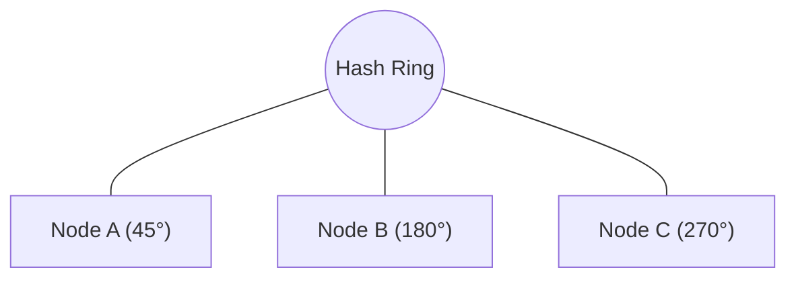
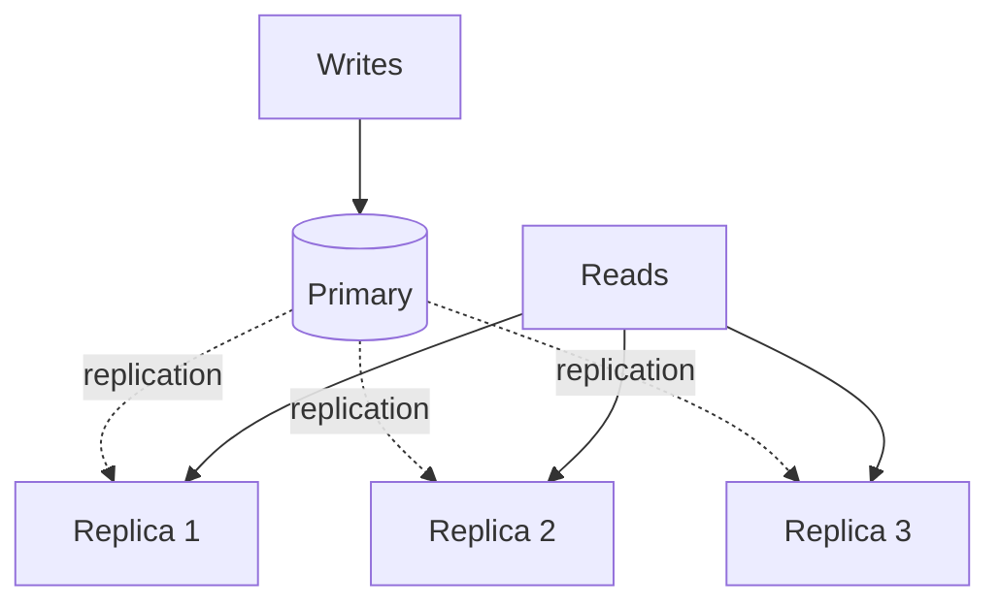
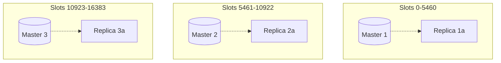

# 分散キャッシュ

> **注:** この記事は英語版からの翻訳です。コードブロックおよびMermaidダイアグラムは原文のまま維持しています。

## TL;DR

分散キャッシュは、スケールと可用性のためにキャッシュデータを複数のノードに分散します。主要な課題は、データのパーティショニング、一貫性の維持、ノード障害の処理です。Redis ClusterとMemcachedが一般的な選択肢です。リバランシングを最小化するためにコンシステントハッシュを使用してください。部分的な可用性のために設計し、キャッシュ障害でアプリケーションがクラッシュしないようにしてください。

---

## なぜ分散キャッシュが必要か？

### 単一ノードの限界

```
Single Redis instance:
  Memory: ~100 GB practical limit
  Throughput: ~100K ops/sec
  Availability: Single point of failure

When you need:
  - More memory (TB of cached data)
  - More throughput (millions ops/sec)
  - High availability (no single point of failure)

→ Distributed cache
```

### スケーリングオプション

```
Vertical: Bigger machine
  - Simple
  - Has limits
  - Still single point of failure

Horizontal: More machines
  - Partition data across nodes
  - Replicate for availability
  - More complex
  - Unlimited scale
```

---

## パーティショニング

### ハッシュベースのパーティショニング

```python
# Simple hash mod
node_id = hash(key) % num_nodes

key = "user:123"
hash("user:123") = 7429
7429 % 3 = 1
→ Node 1

Problem: Adding/removing node reshuffles most keys
```

### コンシステントハッシュ



```
Key hash = 100° → next node clockwise = Node B

Add Node D at 135°:
  Only keys between 90° and 135° move to D
  Other nodes unaffected
```

### 仮想ノード

```
Without vnodes:
  Node A: 1 position on ring
  Uneven distribution likely

With vnodes (e.g., 150 per node):
  Node A: 150 positions on ring
  Better distribution
  Smoother rebalancing

  Also handles heterogeneous hardware:
    Powerful node: 200 vnodes
    Smaller node: 100 vnodes
```

---

## レプリケーション

### プライマリ-レプリカ



### レプリケーションのトレードオフ

```
Synchronous:
  + No data loss on primary failure
  - Higher write latency
  - Replica failure blocks writes

Asynchronous:
  + Fast writes
  - Data loss window
  - Stale reads possible

Common: 1 sync replica + N async replicas
```

---

## Redis Cluster

### アーキテクチャ



```
16384 hash slots distributed across masters
Each master has replicas for failover
```

### スロット割り当て

```python
def key_slot(key):
    # If key contains {}, hash only that part
    # Allows co-locating related keys
    if "{" in key and "}" in key:
        hash_part = key[key.index("{")+1:key.index("}")]
    else:
        hash_part = key

    return crc16(hash_part) % 16384

# Examples:
key_slot("user:123")         # Based on "user:123"
key_slot("{user:123}:profile") # Based on "user:123"
key_slot("{user:123}:orders")  # Same slot as above
```

### フェイルオーバー

```
1. Replica detects master failure (no heartbeat)
2. Replica promotes itself to master
3. Cluster updates routing
4. Old master rejoins as replica (if recovers)

Automatic failover: No manual intervention
Typical failover time: 1-2 seconds
```

### クライアント設定

```python
from redis.cluster import RedisCluster

rc = RedisCluster(
    host="redis-cluster.example.com",
    port=7000,
    # Client maintains slot mapping
    # Automatically routes to correct node
)

rc.set("user:123", "Alice")  # Routes to correct slot
```

---

## Memcached

### アーキテクチャ

```
No replication (by design)
Clients partition data using consistent hashing

Client ─────► [Memcached 1]
       └────► [Memcached 2]
       └────► [Memcached 3]

Client is responsible for:
  - Deciding which node to query
  - Handling node failures
```

### クライアントサイドシャーディング

```python
import pylibmc

servers = ["10.0.0.1", "10.0.0.2", "10.0.0.3"]
client = pylibmc.Client(
    servers,
    behaviors={
        "ketama": True,  # Consistent hashing
        "dead_timeout": 60,  # Mark dead for 60s
    }
)

client.set("user:123", "Alice")
# Client hashes key, picks server
```

### 比較：Redis Cluster vs Memcached

| 項目 | Redis Cluster | Memcached |
|--------|--------------|-----------|
| レプリケーション | 内蔵 | なし |
| データ型 | リッチ（リスト、セット等） | 文字列のみ |
| 永続化 | オプション | なし |
| シャーディング | サーバーサイド | クライアントサイド |
| フェイルオーバー | 自動 | 手動/クライアント |
| メモリ効率 | 低い | 高い |

---

## 一貫性の課題

### Read-After-Write

```
Client writes to Node A (primary)
Client reads from Node B (replica)
Replica hasn't received update yet

Solutions:
  - Read from primary after write
  - Read-your-writes guarantee (sticky sessions)
  - Wait for replication before ack
```

### スプリットブレイン

```
Network partition:
  Partition 1: Master A, Replica B
  Partition 2: Replica C, Replica D

C or D might be promoted to master
Two masters accepting writes

Prevention:
  - Require quorum for writes
  - Fencing tokens
  - Redis: min-replicas-to-write
```

### キャッシュコヒーレンス

```
Multiple app servers, each with local + distributed cache

App Server 1: Local cache: user:123 = v1
App Server 2: Local cache: user:123 = v1
Distributed:  Redis: user:123 = v2

Local caches are stale!

Solutions:
  - No local cache (always distributed)
  - Short TTL on local cache
  - Publish invalidation events
```

---

## ノード障害の処理

### グレースフルデグラデーション

```python
def get_with_fallback(key):
    try:
        value = distributed_cache.get(key)
        if value:
            return value
    except CacheConnectionError:
        log.warn("Cache unavailable, falling back to DB")

    # Fallback to database
    return database.get(key)
```

### ノード除去時のリハッシュ

```
With consistent hashing:
  Node B removed
  Only keys that were on B need to move
  ~1/N of keys affected

Without consistent hashing:
  Almost all keys rehash to different nodes
  Cache becomes effectively empty
```

### ホットスタンバイ

```
For critical caches:
  Active: Redis Cluster (3 masters, 3 replicas)
  Standby: Cold replica in another DC

  On cluster failure:
    Promote standby
    Redirect traffic
```

---

## パフォーマンス最適化

### コネクションプーリング

```python
# Bad: New connection per request
def get_user(user_id):
    conn = redis.Redis()  # New connection
    return conn.get(f"user:{user_id}")

# Good: Reuse connections
pool = redis.ConnectionPool(max_connections=50)

def get_user(user_id):
    conn = redis.Redis(connection_pool=pool)
    return conn.get(f"user:{user_id}")
```

### パイプライニング

```python
# Bad: Round-trip per command
for id in user_ids:
    users.append(redis.get(f"user:{id}"))  # 100 round-trips

# Good: Batch commands
pipe = redis.pipeline()
for id in user_ids:
    pipe.get(f"user:{id}")
users = pipe.execute()  # 1 round-trip
```

### ローカルキャッシュ

```
Two-tier:
  L1: Local in-memory (per-process)
  L2: Distributed cache (Redis)

Read path:
  1. Check L1 (microseconds)
  2. Check L2 (milliseconds)
  3. Check database (tens of milliseconds)

Write path:
  1. Update database
  2. Invalidate L2
  3. Broadcast invalidation to L1s
```

---

## 監視

### 主要メトリクス

```
Hit rate:
  hits / (hits + misses)
  Target: >90%

Latency:
  p50, p95, p99
  Watch for outliers

Memory usage:
  Used vs max
  Eviction rate

Connections:
  Current vs max
  Connection errors

Replication lag:
  Seconds behind master
```

### アラート設定

```yaml
alerts:
  - name: CacheHitRateLow
    condition: hit_rate < 80%
    for: 5m

  - name: CacheLatencyHigh
    condition: p99_latency > 100ms
    for: 1m

  - name: CacheMemoryHigh
    condition: memory_usage > 90%
    for: 5m

  - name: ReplicationLag
    condition: lag_seconds > 10
    for: 1m
```

---

## 一般的なパターン

### フォールバック付きキャッシュ

```python
def get_user(user_id):
    # Try cache
    user = cache.get(f"user:{user_id}")
    if user:
        return deserialize(user)

    # Cache miss or error
    user = db.get_user(user_id)

    # Populate cache (best effort)
    try:
        cache.set(f"user:{user_id}", serialize(user), ex=3600)
    except:
        pass  # Don't fail the request

    return user
```

### キャッシュ用サーキットブレーカー

```python
class CacheCircuitBreaker:
    def __init__(self, threshold=5, reset_time=60):
        self.failures = 0
        self.threshold = threshold
        self.reset_time = reset_time
        self.last_failure = 0

    def call(self, func):
        if self.is_open():
            raise CacheBypassException()

        try:
            result = func()
            self.failures = 0
            return result
        except:
            self.failures += 1
            self.last_failure = time.time()
            raise

    def is_open(self):
        if self.failures >= self.threshold:
            if time.time() - self.last_failure < self.reset_time:
                return True
            self.failures = 0
        return False
```

---

## コンシステントハッシュの詳細

### モジュラーハッシュが破綻する理由

```
3 nodes: hash(key) % 3
  key "session:abc" → hash=14 → 14 % 3 = 2 → Node 2
Add a 4th node: hash(key) % 4
  key "session:abc" → hash=14 → 14 % 4 = 2 → Node 2 (lucky)
  key "user:456"    → hash=19 → 19 % 3 = 1, but 19 % 4 = 3 (remapped!)

On average: (N-1)/N keys remap when adding 1 node
  3→4 nodes: ~75% keys remap | 9→10 nodes: ~90% keys remap
  → Massive cache miss storm
```

### コンシステントハッシュリングの仕組み

```
1. Hash both keys AND nodes onto the same ring (0 to 2^32 - 1)
2. Walk clockwise from key's position to find the first node
3. Adding a node only steals keys from its clockwise neighbor

Adding Node D between A and B:
  Before: keys in (A, B] → served by B
  After:  keys in (A, D] → served by D, keys in (D, B] → served by B
  Only keys in (A, D] move. Expected key movement: 1/N of total keys.
```

### 仮想ノード（Vnodes）

```
Problem: 3 physical nodes = 3 points on ring → unbalanced segments
Solution: map each physical node to many virtual nodes
  Node A → vnode_A_0, vnode_A_1, ... vnode_A_149

Typical vnode count: 100-200 per physical node
  Too few (<50):  uneven distribution | Too many (>500): memory overhead

Heterogeneous hardware: 32 GB node → 100 vnodes, 64 GB node → 200 vnodes
```

### ジャンプコンシステントハッシュ

```
Google's alternative (2014):
  - No ring structure, O(1) memory, O(ln n) time
  - Deterministic: jump_hash(key, num_buckets) → bucket
  - Perfect balance, minimal code (~10 lines), no vnodes needed

Limitations:
  - Only sequential bucket IDs (0 to N-1)
  - Can only add/remove the LAST bucket
  - Not suitable when arbitrary nodes join/leave
```

### ランデブーハッシュ（最高ランダム重み）

```
For each key, compute score for every node: score = hash(key + node)
Route to the node with the highest score.

Adding/removing a node: only keys where that node scored highest move.
  → Same 1/N redistribution as consistent hashing, no vnodes needed.
```

### 比較

| 項目 | モジュラー | コンシステント（リング） | ジャンプ | ランデブー |
|---|---|---|---|---|
| リサイズ時のキー移動 | ~(N-1)/N | ~1/N | ~1/N | ~1/N |
| メモリ | O(1) | O(N * vnodes) | O(1) | O(N) |
| ルックアップ | O(1) | O(log N) | O(log N) | O(N) |
| 任意の追加/削除 | 可 | 可 | 不可（最後のみ） | 可 |
| vnodeなしのバランス | 完全 | 不良 | 完全 | 良好 |
| 使用例 | シンプルな構成 | Dynamo、Cassandra | Google | Microsoft Cuckoo |

---

## Redis Clusterアーキテクチャ

### ハッシュスロットの分散

```
Redis Cluster uses 16384 hash slots: Slot = CRC16(key) % 16384
Slot assignment via redis-cli --cluster create or manual:
  Master A: slots 0-5460 | Master B: slots 5461-10922 | Master C: slots 10923-16383

Why 16384? Gossip heartbeats carry a slot bitmap.
  16384 bits = 2 KB — small enough for every heartbeat message.
```

### MOVEDとASKリダイレクション

```
Client sends GET user:123 to wrong node:
  Node A → Client: MOVED 3999 10.0.0.2:7001
  Client updates local slot map, retries directly to Node B

During resharding (slot migration in progress):
  Node A → Client: ASK 7865 10.0.0.3:7002
  Client sends ASKING + GET user:456 → Node C
  ASK is temporary — client does NOT update its slot map
```

### ライブリシャーディング

```
Moving slot 7865 from Node A → Node C (zero downtime):
  1. Node C: CLUSTER SETSLOT 7865 IMPORTING <A-id>
  2. Node A: CLUSTER SETSLOT 7865 MIGRATING <C-id>
  3. Per key: MIGRATE <C-host> <C-port> <key> 0 5000
  4. Both nodes: CLUSTER SETSLOT 7865 NODE <C-id>
Keys already migrated served by C; remaining by A (with ASK redirect).
```

### マスター障害時のレプリカプロモーション

```
Detection via gossip: nodes ping randomly every second
  No PONG within cluster-node-timeout (default 15s) → PFAIL
  Majority of masters agree PFAIL → FAIL

Promotion: replica with least lag initiates election,
  majority of masters vote, replica becomes new master.
  Typical total failover time: 15-30 seconds.
```

### クライアントサイドスロットキャッシュ

```
Smart clients (Jedis, redis-py, Lettuce):
  1. On startup: CLUSTER SLOTS → full slot-to-node mapping
  2. Cache locally → direct routing, zero redirects
  3. On MOVED → refresh slot map | Periodic refresh for topology changes

Dumb clients: send to any node, follow redirects (2x latency on miss).
```

### Redis Clusterの制約

```
Multi-key ops require same slot:
  MGET user:1 user:2       → CROSSSLOT error
  MGET {user}:1 {user}:2   → OK (hash tag "user" → same slot)

Co-locate related keys: {order:789}:items, {order:789}:total → same slot
No SELECT (single DB only) | No cross-slot MULTI/EXEC or Lua scripts
```

---

## 分散キャッシュでのMemcached vs Redis

### スレッディングモデル

```
Memcached: multi-threaded
  - Worker threads handle requests in parallel, scales with CPU cores
  - At 24+ threads, saturates memory bandwidth before CPU

Redis: single-threaded event loop (per shard)
  - No lock contention, simpler code
  - Redis 6+: io-threads for network I/O (not command execution)
  - Scale out via sharding, not threading
```

### データ構造の機能

```
Memcached: key → binary string (up to 1 MB). No other data types.

Redis: Strings, Lists, Sets, Sorted Sets, Hashes,
  Streams, Bitmaps, HyperLogLog, Geospatial indexes

  Where Redis wins:
    Leaderboard: ZADD + ZRANGE | Rate limiter: INCR + EXPIRE atomically
    Pub/sub: built-in broadcasting | HyperLogLog: 0.81% error, 12 KB
```

### メモリアロケーション

```
Memcached slab allocator:
  Pre-allocates slab classes (64B, 128B, 256B ...)
  100B item → 128B slab → 28B wasted (internal fragmentation)
  Predictable memory, no external fragmentation

Redis jemalloc:
  General-purpose, better fit for variable-size structures
  Can fragment over time: check mem_fragmentation_ratio in INFO memory
  MEMORY PURGE to release freed pages back to OS
```

### パフォーマンス比較

```
Pure GET/SET at high concurrency (benchmarks vary):
  Memcached: ~200K-600K ops/sec per node (multi-threaded)
  Redis:     ~100K-200K ops/sec per node (single-threaded)
Memcached wins 1.5-2x for simple key-value. Network is often the real bottleneck.
Both deliver sub-millisecond latency for typical payloads.
```

### 使い分け

```
Memcached: pure key-value cache, max throughput per node,
  ephemeral data only, simplicity (no persistence/replication)

Redis: data structures (sorted sets, streams, pub/sub),
  persistence (RDB/AOF), built-in replication + failover,
  Lua scripting, transactions
```

---

## 分散キャッシュの障害モード

### ノード障害とサンダリングハード

```
Node B dies → consistent hashing redirects B's keys to Node C
  → All of B's keys are cache misses on C → DB query storm

Mitigation:
  - Request coalescing (singleflight): 1 thread fetches, others wait
  - Staggered TTLs: random jitter so keys don't expire together
  - Warm-up: proactively populate new node before decommission
```

### Redis Clusterのスプリットブレイン

```
Partition A: Master 1, Master 2, Replica 3a
Partition B: Master 3, Replica 1a, Replica 2a
  → Replica 1a promoted → TWO Master 1s for slots 0-5460
  → On heal: original Master 1 demotes, DISCARDS its writes → data loss

Prevention:
  min-replicas-to-write 1  → refuse writes without reachable replicas
  min-replicas-max-lag 10  → replica must be <10s behind
```

### メモリフラグメンテーション

```
Redis INFO memory:
  used_memory: 10 GB (logical) | used_memory_rss: 16 GB (physical)
  mem_fragmentation_ratio: 1.6 (rss / used)

  < 1.0: swapping to disk (critical) | 1.0-1.5: healthy | > 1.5: wasted RAM
  Fix: activedefrag yes (Redis 4+) or restart via replica failover
```

### ホットキー問題

```
"trending:homepage" → 500K reads/sec → one shard saturated

Detection: redis-cli --hotkeys (LFU approximation)

Mitigation:
  1. Local L1 cache: hot keys in-process with 1-5s TTL
  2. Key replication: trending:homepage:{1..8}, client picks random suffix
  3. Read replicas: route hot key reads to replicas
  4. Redis 6 server-assisted client cache (RESP3 push invalidation)
```

---

## 重要なポイント

1. **コンシステントハッシュはリシャッフルを最小化** - ノード追加/削除時に使用
2. **リッチな機能にはRedis Cluster** - レプリケーション、データ型、永続化
3. **シンプルさにはMemcached** - 純粋なキャッシュ、高いメモリ効率
4. **ノード障害に備える** - データベースへのグレースフルデグラデーション
5. **コネクションプーリングは必須** - リクエストごとにコネクションを作成しない
6. **バッチにはパイプライン** - ラウンドトリップを大幅に削減
7. **ヒット率とレイテンシを監視** - 主要な健全性指標
8. **キャッシュはクリティカルパスではない** - 障害でアプリをクラッシュさせない
