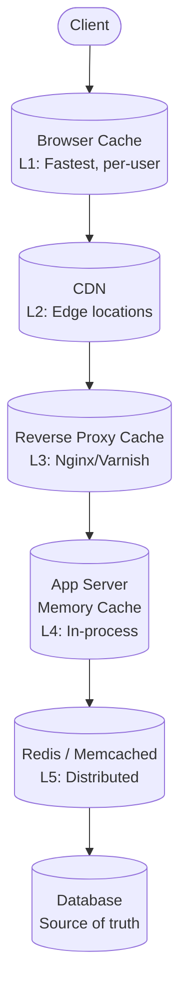
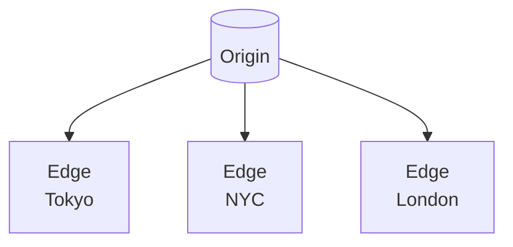

# マルチティアキャッシング

> この記事は英語版から翻訳されました。最新版は[英語版](/04-caching/05-multi-tier-caching.md)をご覧ください。

## TL;DR

マルチティアキャッシングは、高速で小容量（L1）からより低速で大容量（L2、L3）まで複数のキャッシュを階層化します。一般的なティア：ブラウザ、CDN、リバースプロキシ、アプリケーションメモリ、分散キャッシュ、データベースキャッシュ。各ティアは異なる特性を持ちます。上位ではレイテンシを、下位では容量を最適化します。無効化はすべてのティアに伝播する必要があります。

---

## キャッシュ階層

### レイテンシティア

```
Tier            Latency     Capacity    Scope
────────────────────────────────────────────────
Browser cache   0.1 ms      50 MB       Per user
CDN edge        1-50 ms     TB          Per region
Reverse proxy   1-10 ms     GB          Per DC
App memory      0.01 ms     GB          Per process
Distributed     1-10 ms     TB          Cluster
Database cache  0.1 ms      GB          Per DB
Database disk   10-100 ms   PB          Per DB
```

### 視覚的表現



---

## ブラウザキャッシュ

### HTTPキャッシュヘッダー

```
Cache-Control: max-age=3600, public

max-age=3600       → Cache for 1 hour
public             → CDN can cache
private            → Only browser caches
no-cache           → Revalidate before use
no-store           → Don't cache at all
immutable          → Never revalidate (versioned URLs)
```

### キャッシュの再検証

```
First request:
  Response: 200 OK
  ETag: "abc123"
  Cache-Control: max-age=60

After 60 seconds:
  Request: If-None-Match: "abc123"
  Response: 304 Not Modified (if unchanged)
           200 OK with new ETag (if changed)
```

### バージョニングされたアセット

```
app.js?v=1.2.3
app-abc123.js  (content hash in filename)

Cache-Control: max-age=31536000, immutable

Benefits:
  - Cache forever (1 year)
  - New version = new URL = cache miss
  - No stale assets
```

---

## CDN層

### エッジキャッシング



```
User in Tokyo → CDN Edge Tokyo → Cache Hit
User in NYC   → CDN Edge NYC   → Cache Miss → Origin → Cache
```

### キャッシュキーの設定

```
Vary: Accept-Encoding, Accept-Language

CDN caches separate versions:
  /page + Accept-Encoding: gzip    → Version 1
  /page + Accept-Encoding: br      → Version 2
  /page + Accept-Language: en      → Version 3
  /page + Accept-Language: ja      → Version 4
```

### CDNの無効化

```python
# Purge specific URL
cdn.purge("https://example.com/api/product/123")

# Purge by pattern
cdn.purge_by_tag("product-123")

# Soft purge (serve stale while revalidating)
cdn.soft_purge("https://example.com/api/product/123")
```

---

## リバースプロキシキャッシュ

### Nginxキャッシング

```nginx
proxy_cache_path /var/cache/nginx levels=1:2
                 keys_zone=my_cache:10m max_size=10g
                 inactive=60m use_temp_path=off;

server {
    location /api/ {
        proxy_cache my_cache;
        proxy_cache_valid 200 1h;
        proxy_cache_valid 404 1m;
        proxy_cache_use_stale error timeout updating;
        proxy_pass http://backend;
    }
}
```

### Varnish VCL

```vcl
sub vcl_recv {
    if (req.url ~ "^/api/") {
        return (hash);  // Check cache
    }
}

sub vcl_backend_response {
    if (beresp.status == 200) {
        set beresp.ttl = 1h;
        set beresp.grace = 24h;  // Serve stale if backend down
    }
}
```

---

## アプリケーションメモリキャッシュ

### インプロセスキャッシュ

```python
from functools import lru_cache
from cachetools import TTLCache

# Simple LRU
@lru_cache(maxsize=1000)
def get_config(key):
    return database.get_config(key)

# With TTL
app_cache = TTLCache(maxsize=10000, ttl=300)

def get_user(user_id):
    if user_id in app_cache:
        return app_cache[user_id]

    user = database.get_user(user_id)
    app_cache[user_id] = user
    return user
```

### キャッシュコヒーレンスの問題

```
Multiple app server instances:
  Server A: Local cache: user:123 = v1
  Server B: Local cache: user:123 = v1

User updates profile → Server A
  Server A: Clears local cache ✓
  Server B: Still has stale data ✗

Solutions:
  1. Pub/sub invalidation
  2. Very short TTL
  3. No local cache for mutable data
```

### Pub/Sub無効化

```python
import redis

# On cache invalidation
def invalidate_user(user_id):
    local_cache.delete(f"user:{user_id}")
    redis_client.publish("cache:invalidate", f"user:{user_id}")

# Subscriber thread on each server
def cache_invalidation_listener():
    pubsub = redis_client.pubsub()
    pubsub.subscribe("cache:invalidate")

    for message in pubsub.listen():
        key = message["data"]
        local_cache.delete(key)
```

---

## 分散キャッシュ

### L1 + L2 パターン

```python
class TwoTierCache:
    def __init__(self):
        self.l1 = TTLCache(maxsize=10000, ttl=60)  # Local
        self.l2 = redis.Redis()  # Distributed

    def get(self, key):
        # Check L1 first (fastest)
        if key in self.l1:
            return self.l1[key]

        # Check L2
        value = self.l2.get(key)
        if value:
            self.l1[key] = value  # Populate L1
            return value

        return None

    def set(self, key, value, ttl=3600):
        self.l1[key] = value
        self.l2.set(key, value, ex=ttl)

    def delete(self, key):
        self.l1.pop(key, None)
        self.l2.delete(key)
        # Broadcast to other servers
        self.l2.publish("invalidate", key)
```

### L1/L2によるリードスルー

```python
def get_user(user_id):
    key = f"user:{user_id}"

    # L1: In-process (microseconds)
    if key in local_cache:
        return local_cache[key]

    # L2: Redis (milliseconds)
    cached = redis_cache.get(key)
    if cached:
        local_cache[key] = cached
        return cached

    # L3: Database (tens of milliseconds)
    user = database.get_user(user_id)

    # Populate caches
    redis_cache.set(key, user, ex=3600)
    local_cache[key] = user

    return user
```

---

## データベースキャッシング

### クエリキャッシュ

```sql
-- MySQL query cache (deprecated in 8.0)
-- PostgreSQL: Prepared statement caching
-- Application level: Cache query results

-- Example pattern:
-- Cache key: hash of query + parameters
-- Value: Result set
```

### バッファプール

```
Database keeps frequently accessed pages in memory

PostgreSQL: shared_buffers (25% of RAM typical)
MySQL: innodb_buffer_pool_size (70-80% of RAM)

Not directly controllable by application
But affects overall performance
```

---

## ティア間の無効化

### カスケード無効化

```
User updates profile:

1. Update database
2. Invalidate Redis (L5)
   → Publish invalidation event
3. L4 listeners clear local cache
4. Purge reverse proxy cache
5. Purge CDN
6. Browser invalidated on next request (revalidation)

Order matters: Inside-out (DB first, browser last)
```

### 実装

```python
def update_user_profile(user_id, new_data):
    # 1. Update database
    database.update_user(user_id, new_data)

    # 2. Invalidate distributed cache
    redis_cache.delete(f"user:{user_id}")

    # 3. Broadcast to local caches
    redis_cache.publish("invalidate", f"user:{user_id}")

    # 4. Purge reverse proxy (if applicable)
    reverse_proxy.purge(f"/api/users/{user_id}")

    # 5. Purge CDN
    cdn.purge(f"/api/users/{user_id}")
    cdn.purge_by_tag(f"user-{user_id}")

    # 6. Browser - return new Cache-Control or ETag
    return new_data
```

---

## ティア別TTL戦略

### ティアごとの異なるTTL

```
Browser:  max-age=60      (1 minute)
CDN:      max-age=300     (5 minutes)
Proxy:    ttl=600         (10 minutes)
L1:       ttl=60          (1 minute)
L2:       ttl=3600        (1 hour)

Rationale:
  - Browser: Frequent revalidation, fresh data
  - CDN: Balance freshness and performance
  - L2: Long-lived, invalidated explicitly
```

### Stale-While-Revalidate

```
Cache-Control: max-age=60, stale-while-revalidate=3600

0-60s:    Serve from cache, no revalidation
60s-1h:   Serve stale, revalidate in background
>1h:      Must revalidate

User sees instant response
Content refreshed asynchronously
```

---

## マルチティアの監視

### ティアごとの主要メトリクス

```
Browser:
  - Resource timing API
  - Cache hit ratio (from headers)

CDN:
  - Hit ratio
  - Origin requests
  - Latency by region

Reverse Proxy:
  - Hit ratio
  - Response times

Application:
  - L1 hit ratio
  - L2 hit ratio
  - Cache size
  - Eviction rate
```

### 総合ヒット率

```
Overall hit rate = 1 - (DB queries / Total requests)

If 95% hit at L1, 95% of remaining hit at L2:
  L1 hit: 95%
  L2 hit: 95% × 5% = 4.75%
  Miss: 5% × 5% = 0.25%

  Overall: 99.75% hit rate
```

---

## 設計上の考慮事項

### どのデータをどこにキャッシュするか

| データタイプ | ブラウザ | CDN | L1 | L2 |
|-----------|---------|-----|----|----|
| 静的アセット | ✓ | ✓ | - | - |
| API（パブリック） | △ | ✓ | ✓ | ✓ |
| API（プライベート） | △ | - | ✓ | ✓ |
| ユーザーセッション | - | - | ✓ | ✓ |
| 設定 | - | - | ✓ | ✓ |
| ホットデータ | - | - | ✓ | ✓ |

### ティアごとのキャッシュサイズ

```
L1 (per-process): 100 MB - 1 GB
  Working set that fits in memory

L2 (distributed): 10 GB - 1 TB
  Hot data across all users

CDN (edge): Multi-TB per edge
  All cacheable content
```

---

## L1/L2/L3 キャッシュアーキテクチャ

### ティアの定義

```
Tier   Technology                  Latency    Scope
─────────────────────────────────────────────────────
L1     In-process (HashMap,        <1 ms      Per instance
       Caffeine, Guava Cache)
L2     Distributed (Redis,         1-5 ms     Cluster-wide
       Memcached, KeyDB)
L3     CDN edge (CloudFront,       10-50 ms   Per region/PoP
       Fastly, Akamai)
```

### 各ティアが有利な場面

- **L1が有利** — 同じキーが単一インスタンスで繰り返し読まれる場合（例：フィーチャーフラグ、設定、ホットな商品カタログエントリ）。サブマイクロ秒の読み取りはネットワークホップに勝ります。
- **L2が有利** — データが多数のインスタンス間で共有され、クラスタ全体で一貫性を保つ必要がある場合（例：ユーザーセッション、ショッピングカート）。1回の書き込みがすべての読み手に届きます。
- **L3が有利** — コンテンツが読み取り中心で、地理的にレイテンシに敏感で、古さを許容できる場合（例：静的アセット、パブリックAPIレスポンス、画像）。

### ティア間の書き込みポリシー

```
Write-through:
  Write DB → Write L2 → Write L1
  + Strong consistency across tiers
  - Higher write latency (every write touches all tiers)
  Best for: Data that is read immediately after write

Write-around:
  Write DB → Invalidate L2 → Invalidate L1
  + Lower write latency
  - First read after write is a cache miss
  Best for: Data written often but read infrequently
```

### インスタンス間の一貫性の課題

```
Timeline:
  t0  Instance A reads user:42 → DB → populates L1(A) and L2
  t1  Instance B updates user:42 → writes DB → invalidates L2
  t2  Instance A reads user:42 → L1(A) still has stale v1 ✗

Problem: L1 on instance A has no visibility into L2 invalidation
         triggered by instance B.

Solutions:
  1. Redis Pub/Sub invalidation (see "Pub/Sub Invalidation" above)
     - Every L2 invalidation publishes to a channel
     - All instances subscribe, evict from their L1
     - Latency: typically <5 ms propagation

  2. Short L1 TTL (30-60 seconds)
     - Bounded staleness window, no coordination needed
     - Trade-off: more L2 lookups after TTL expires

  3. Hybrid: Pub/Sub + short TTL as safety net
     - Pub/Sub handles the common case
     - Short TTL catches missed messages (network partition, crash)
```

---

## ティアリングを伴うキャッシュアサイド

### 読み取りパス

```
check L1 (in-process)
  → HIT: return immediately (<1 ms)
  → MISS: check L2 (Redis)
      → HIT: populate L1, return (1-5 ms)
      → MISS: query DB (10-100 ms)
          → populate L2 (with TTL)
          → populate L1 (with shorter TTL)
          → return
```

### 書き込みパス

```
1. Write to database (source of truth)
2. Delete key from L2 (Redis)
3. Broadcast L1 invalidation via pub/sub
4. All instances evict from their local L1

Why delete instead of update?
  - Avoids race conditions with concurrent writes
  - Next read triggers fresh population from DB
  - Simpler to reason about correctness
```

### Python例：ティア化ルックアップ

```python
class TieredCacheAside:
    """Cache-aside pattern with L1 (in-process) and L2 (Redis)."""

    def __init__(self, l1_cache, redis_client, db):
        self.l1 = l1_cache        # TTLCache(maxsize=5000, ttl=60)
        self.l2 = redis_client    # redis.Redis(...)
        self.db = db

    def get(self, key: str):
        # L1: in-process, sub-millisecond
        value = self.l1.get(key)
        if value is not None:
            return value

        # L2: distributed, single-digit milliseconds
        value = self.l2.get(key)
        if value is not None:
            value = deserialize(value)
            self.l1[key] = value  # backfill L1
            return value

        # DB: source of truth
        value = self.db.query(key)
        if value is not None:
            self.l2.set(key, serialize(value), ex=3600)  # L2 TTL: 1h
            self.l1[key] = value                          # L1 TTL: 60s
        return value

    def invalidate(self, key: str):
        self.l1.pop(key, None)
        self.l2.delete(key)
        self.l2.publish("cache:invalidate", key)  # notify other instances
```

> **境界に関する注記：** キャッシュアサイド vs リードスルー vs ライトビハインド戦略の詳細は [`01-cache-strategies.md`](01-cache-strategies.md) をご覧ください。

---

## 各ティアのサイジング

### L1: インプロセスキャッシュ

```
Capacity:   100 MB - 1 GB per instance
Constraint: Bounded by JVM heap / process memory
Cost:       Free (uses existing heap allocation)
Eviction:   LRU or LFU, sized to hold top-N hottest keys
Rule:       L1 should hold ≤1% of total dataset
            If your dataset is 50 GB, L1 holds ~500 MB of hot keys
```

### L2: 分散キャッシュ

```
Capacity:   10 GB - 100 GB (single cluster), up to TB with sharding
Constraint: Network I/O and memory cost per node
Cost:       ~$0.017/GB/hour (ElastiCache on-demand, r7g.large)
            ~$120/month for a 10 GB Redis node
            Scales linearly: 100 GB ≈ $1,200/month
Eviction:   allkeys-lru or volatile-ttl (Redis maxmemory-policy)
```

### L3: CDNエッジ

```
Capacity:   Effectively unbounded (distributed across PoPs)
Cost:       Per-request + per-GB egress
            CloudFront: ~$0.085/GB (first 10 TB), $0.01/10K requests
            Fastly: ~$0.12/GB, $0.0075/10K requests
Eviction:   TTL-based, varies by PoP population
```

### ティアを追加するタイミング

```
Symptom                              Action
───────────────────────────────────────────────────────────
L2 hit rate >95% but P99 still       Add L1 for top-100 hottest
too high (e.g., >10 ms)              keys. Eliminates network hop.

L1+L2 effective but origin           Add L3 (CDN) for public,
bandwidth costs growing               cacheable content.

L2 memory cost exceeding budget,     Move cold keys to L3 or
most keys have <1 read/hour          DB-level cache; shrink L2.

Single hot key causing L2 node       Replicate to L1 across all
saturation                            instances (local copy per node).
```

### コスト判断フレームワーク

```
Cost per read:
  L1: ~0 (CPU cycles only, no I/O)
  L2: ~$0.000001 per GET (amortized infra cost)
  L3: ~$0.000001 per request (CDN pricing)
  DB: ~$0.00001 per query (RDS cost amortized)

Add a tier when: (reads/sec × per-read cost saved) > tier operating cost
```

---

## 本番環境での落とし穴

### ティアの不整合

```
Problem: L1 returns v1, L2 already has v2.
         User sees different data depending on which instance handles
         the request. Load balancer rotation makes behavior non-deterministic.

Solution: Embed a version or timestamp in the cached value.
  {
    "data": { ... },
    "version": 42,
    "cached_at": 1710489600
  }
  On L1 hit, compare version against a lightweight L2 version check
  (or accept bounded staleness via TTL).
```

### メモリ圧迫とGC起因の負荷スパイク

```
Problem: Under GC pressure (JVM full GC, Python memory reclaim),
         L1 evicts aggressively → sudden flood of L2 reads.
         If multiple instances GC simultaneously, L2 load spikes 10-50x.

Mitigations:
  - Cap L1 size well below heap limit (e.g., 20% of max heap)
  - Use off-heap caches (Caffeine with soft references, OHC) to
    avoid GC scanning large caches
  - Monitor L2 request rate; alert on sudden spikes correlated with
    GC pause metrics
```

### ティア間のサンダリングハード

```
Problem: A popular key expires in L2. Hundreds of instances simultaneously
         miss L1, miss L2, and all query the DB at once.
         This is the classic stampede but amplified by multi-tier topology.

Impact:  DB connection pool saturation, cascading timeouts, partial outage.

Cross-reference: See 04-cache-stampede.md for detailed solutions including
                 lock-based recomputation, probabilistic early expiry,
                 and request coalescing.
```

### その他の注意すべき落とし穴

- **シリアライゼーションの不一致**: L1はネイティブオブジェクト、L2はバイト列を格納します。スキーマ変更でL2エントリがデシリアライズ不可になることがあります。クラッシュではなくキャッシュミスとして扱ってください。
- **デプロイ後のコールドスタート**: 新しいインスタンスは空のL1で起動します。フリートが一斉にロールすると、L2が一時的にすべての読み取り負荷を吸収します。デプロイを段階的に行うか、起動時にL1をプリウォームしてください（[`06-cache-warming.md`](06-cache-warming.md) 参照）。
- **TTLのクロックスキュー**: インスタンスのシステムクロックにずれがあると、L1のTTL期限切れにばらつきが出ます。TTL計算にはウォールタイムではなくモノトニッククロックを使用してください。

---

## まとめ

1. **各ティアには目的がある** - レイテンシ、容量、スコープが異なる
2. **最上位ティアでヒットさせる** - ラウンドトリップを最小化
3. **無効化はカスケードが必要** - すべてのティアを更新する
4. **L1 + L2は一般的なパターン** - ローカル + 分散
5. **コヒーレンスは難しい** - Pub/Subまたは短いTTLを使用
6. **ティアごとに異なるTTL** - ティアの特性に合わせる
7. **stale-while-revalidateはUXを向上させる** - 即時レスポンス + 鮮度
8. **各ティアを監視する** - ヒットがどこで発生しているか把握する
