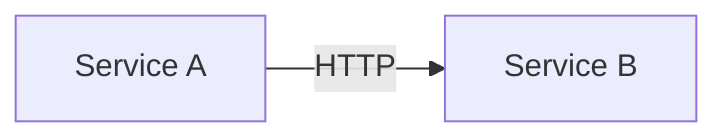
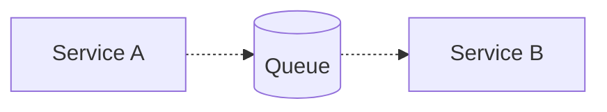
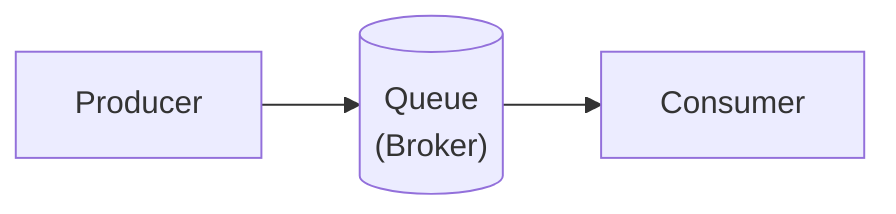
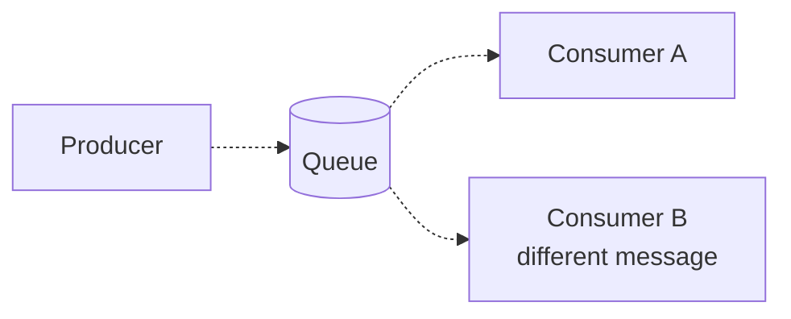
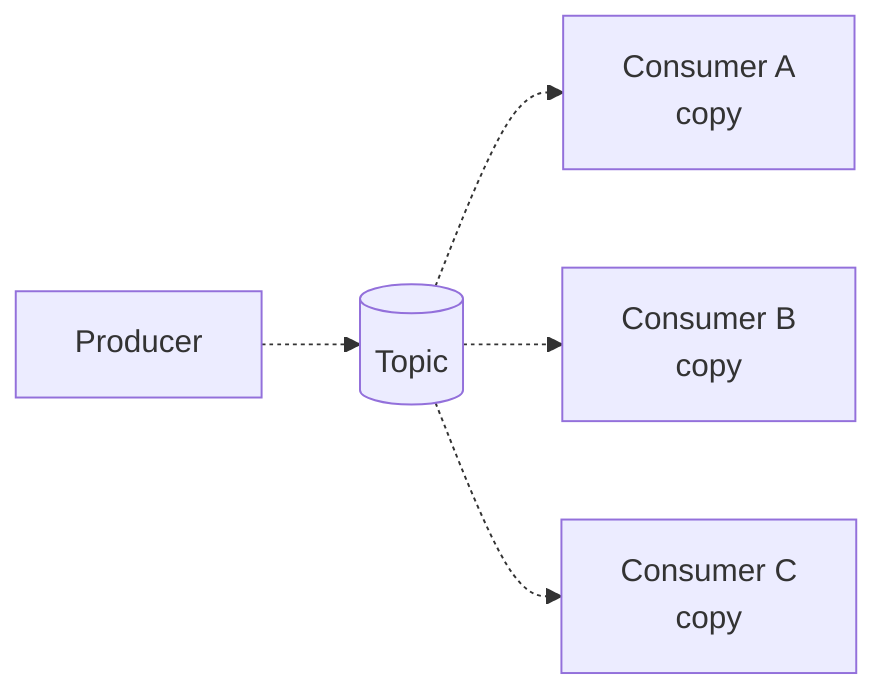
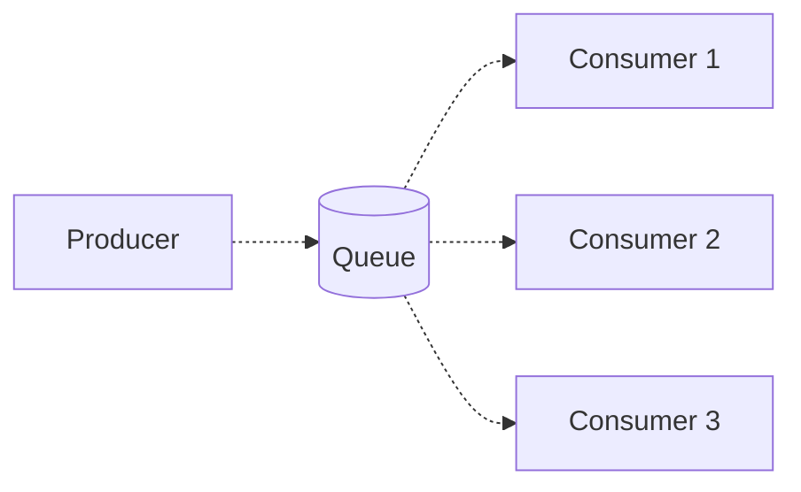
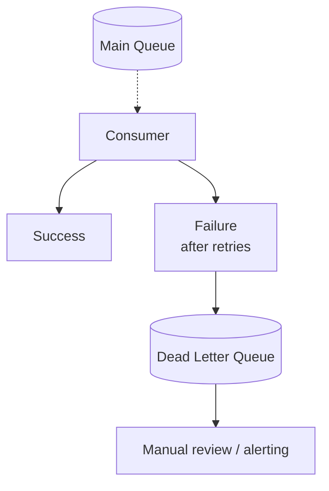

# メッセージキュー

> **注記**: この記事は英語版 `/05-messaging/01-message-queues.md` の日本語翻訳です。

## TL;DR

メッセージキューはプロデューサーとコンシューマーを分離し、非同期通信、負荷平準化、耐障害性を実現します。主要概念として、プロデューサー、コンシューマー、ブローカー、アクノリッジメントがあります。順序保証、スループット、永続性、Exactly-Onceの要件に基づいて選択してください。代表的な選択肢としてRabbitMQ、Amazon SQS、Apache Kafka（ログベース）があります。

---

## なぜメッセージキューが必要か？

### 同期通信の問題



```
問題点:
  - AがBを待つ（レイテンシ）
  - Bがダウンするとき、Aも失敗する
  - Aのスパイクがぶに過負荷をかける
  - 密結合
```

### キューの利点



```
利点:
  - Aは待たない（非同期）
  - Bがダウンしても、メッセージはキューで待機する
  - キューがトラフィックスパイクを吸収する
  - AとBはお互いを知らない
```

---

## 基本概念

### コンポーネント



```
プロデューサー: メッセージを作成・送信する
キュー/ブローカー: メッセージを永続的に保存する
コンシューマー: メッセージを受信・処理する
```

### メッセージのライフサイクル

```
1. プロデューサーがメッセージを送信する
2. ブローカーが受信を確認する（プロデューサー側）
3. ブローカーがメッセージを永続的に保存する
4. コンシューマーがメッセージを取得する
5. コンシューマーがメッセージを処理する
6. コンシューマーがアクノリッジする（コンシューマー側）
7. ブローカーがメッセージを削除する
```

### メッセージ構造

```json
{
  "id": "msg-12345",
  "timestamp": "2024-01-15T10:30:00Z",
  "headers": {
    "content-type": "application/json",
    "correlation-id": "req-67890"
  },
  "body": {
    "user_id": 123,
    "action": "signup",
    "email": "user@example.com"
  }
}
```

---

## キューの種類

### ポイント・ツー・ポイント



```
各メッセージは正確に1つのコンシューマーに配信されます
用途: タスク分配、ワークキュー
```

### パブリッシュ・サブスクライブ



```
各メッセージはすべてのサブスクライバーに配信されます
用途: イベントブロードキャスト、通知
```

### 競合コンシューマー



```
各メッセージは1つのコンシューマーに配信されます
コンシューマーは並列に処理します
用途: 負荷分散、スケーリング
```

---

## 配信セマンティクス

### At-Most-Once（最大1回）

```
プロデューサー: メッセージを送信し、ackを待たない
コンシューマー: 処理するが、ackしない

起こり得る結果:
  - メッセージが配信・処理される ✓
  - メッセージが失われる（配信されない） ✗

用途: 損失が許容されるメトリクス、ログ
```

### At-Least-Once（最低1回）

```
プロデューサー: 送信し、ackされるまでリトライする
コンシューマー: 処理してからackする

起こり得る結果:
  - メッセージが1回配信される ✓
  - メッセージが複数回配信される（タイムアウト後のリトライ）

コンシューマーは冪等でなければなりません！
用途: ほとんどのアプリケーション
```

### Exactly-Once（正確に1回）

```
真に実現するのは非常に困難です
通常は At-least-once + 冪等なコンシューマーで実現します

技法:
  - メッセージIDによる重複排除
  - トランザクショナルアウトボックス
  - Kafkaトランザクション

用途: 金融取引
```

---

## アクノリッジメント

### プロデューサーのアクノリッジメント

```python
# Fire and forget (at-most-once)
producer.send(message)

# Wait for broker ack (at-least-once)
producer.send(message).get()  # Blocks until acked

# Wait for replication (stronger durability)
producer.send(message, acks='all').get()
```

### コンシューマーのアクノリッジメント

```python
# Auto-ack (dangerous - message may be lost)
message = queue.get(auto_ack=True)
process(message)  # If this fails, message lost

# Manual ack (safer)
message = queue.get(auto_ack=False)
try:
    process(message)
    queue.ack(message)
except Exception:
    queue.nack(message)  # Requeue or dead letter
```

### Ackタイムアウト

```
コンシューマーがT=0でメッセージを取得
タイムアウト = 30秒

T=30までにackがない場合:
  ブローカーはコンシューマーが死んだと判断する
  メッセージは別のコンシューマーに再配信される

タイムアウト > 最大処理時間 に設定してください
```

---

## キューパターン

### ワークキュー

```python
# Producer: Distribute tasks
for task in tasks:
    queue.send(task)

# Consumers: Process in parallel
while True:
    task = queue.get()
    result = process(task)
    queue.ack(task)
```

### リクエスト・リプライ

```
リクエストキュー: クライアント → サービス
リプライキュー: サービス → クライアント

クライアント:
  1. 一時的なリプライキューを作成する
  2. reply_to = 一時キュー としてリクエストを送信する
  3. 一時キューで待機する

サービス:
  1. リクエストキューからリクエストを取得する
  2. 処理する
  3. reply_toキューにレスポンスを送信する
```

### 優先度キュー

```python
# High priority messages processed first
queue.send(critical_task, priority=10)
queue.send(normal_task, priority=5)
queue.send(low_task, priority=1)

# Consumer always gets highest priority first
```

---

## 代表的なメッセージキュー

### RabbitMQ

```
プロトコル: AMQP
モデル: ブローカー中心、エクスチェンジ + キュー

特徴:
  - 柔軟なルーティング（direct、topic、fanout）
  - メッセージTTL
  - デッドレターエクスチェンジ
  - プラグインエコシステム

最適な用途: 複雑なルーティング、エンタープライズメッセージング
```

### Amazon SQS

```
モデル: マネージドキューサービス

Standard Queue:
  - At-least-once配信
  - ベストエフォートの順序保証
  - 無制限のスループット

FIFO Queue:
  - Exactly-once処理
  - 厳密な順序保証（グループ内）
  - 3,000 msg/sec制限

最適な用途: AWSネイティブ、マネージドのシンプルさ
```

### Apache Kafka

```
モデル: 分散ログ

特徴:
  - 永続的なストレージ（リプレイ可能）
  - パーティションによる並列処理
  - コンシューマーグループ
  - 高スループット

最適な用途: イベントストリーミング、大規模システム
```

### Redis Streams

```
モデル: Redisでの追記専用ログ

特徴:
  - コンシューマーグループ
  - メッセージID
  - サイズ/時間によるトリミング
  - 高速（インメモリ）

最適な用途: シンプルなストリーミング、すでにRedisを使用している場合
```

---

## サイジングとキャパシティ

### スループット計画

```
想定負荷:
  ピークメッセージ: 10,000/sec
  平均メッセージサイズ: 1 KB
  保持期間: 7日

計算:
  スループット: 10,000 × 1 KB = 10 MB/sec
  日次ストレージ: 10 MB/sec × 86,400 = 864 GB/day
  総ストレージ: 864 × 7 = 6 TB
```

### コンシューマーのスケーリング

```
メッセージあたりの処理時間: 100ms
必要スループット: 1,000 msg/sec

必要コンシューマー数:
  1000 msg/sec × 0.1 sec = 100 並列
  10コンシューマーの場合: 各10並列

スループットが満たされるまでコンシューマーを追加してください
```

---

## モニタリング

### 主要メトリクス

```
キュー深度:
  待機中のメッセージ数
  増加中 = コンシューマーが遅すぎる

コンシューマーラグ:
  プロデューサーからの遅延（時間/メッセージ数）
  増加中 = 追いつけていない

メッセージ経過時間:
  最も古い未処理メッセージ
  高い = SLA違反の可能性

スループット:
  入出力のメッセージ/秒
  キャパシティと比較する

エラー率:
  処理失敗 / 合計
  閾値を超えたらアラートを発報する
```

### アラートルール

```yaml
alerts:
  - name: QueueDepthHigh
    condition: queue_depth > 10000
    for: 5m

  - name: ConsumerLagHigh
    condition: consumer_lag > 1h
    for: 10m

  - name: MessageAgeOld
    condition: oldest_message_age > 30m
    for: 5m

  - name: ProcessingErrors
    condition: error_rate > 1%
    for: 5m
```

---

## エラーハンドリング

### リトライ戦略

```python
def process_with_retry(message, max_retries=3):
    for attempt in range(max_retries):
        try:
            process(message)
            return True
        except TransientError:
            delay = exponential_backoff(attempt)
            time.sleep(delay)
        except PermanentError:
            send_to_dead_letter(message)
            return False

    # Max retries exceeded
    send_to_dead_letter(message)
    return False
```

### デッドレターキュー



---

## ベストプラクティス

### メッセージ設計

```
1. トレーシング用にコリレーションIDを含める
2. デバッグ用にタイムスタンプを追加する
3. メッセージは小さく保つ（通常 < 256 KB）
4. スキーマバージョニングを使用する
5. ルーティング用にメッセージタイプを含める
```

### 冪等なコンシューマー

```python
def process_message(message):
    # Check if already processed
    if is_processed(message.id):
        return  # Skip duplicate

    # Process
    result = do_work(message)

    # Mark as processed (atomically with work if possible)
    mark_processed(message.id)
```

### グレースフルシャットダウン

```python
def shutdown_handler(signal, frame):
    # Stop accepting new messages
    consumer.stop_consuming()

    # Wait for in-flight messages
    consumer.wait_for_current()

    # Cleanup
    consumer.close()
    sys.exit(0)

signal.signal(signal.SIGTERM, shutdown_handler)
```

---

## キューの内部構造

### ストレージエンジン

```
RabbitMQ:
  - メタデータ（エクスチェンジ、キュー、バインディング）にErlang Mnesiaデータベース
  - メッセージはキューごとのメッセージストアにディスク保存
  - Lazy queues: メッセージは直接ディスクに書き込まれ、RAM使用量を削減
  - Classic queues: メッセージはRAMに保持され、メモリ圧迫時にディスクへページング
  - Quorum queues（推奨）: Raftベースのレプリケートされたログをディスクに保存

Kafka:
  - 追記専用のログセグメントをディスク上のファイルとして保存
  - 各パーティション = セグメントファイルの順序付きシーケンス
  - セグメントは設定可能なサイズ（デフォルト1 GB）または時間でロールオーバー
  - インデックスファイルがオフセット→セグメント内位置をマッピングし高速検索を実現
  - Zero-copy sendfile()によりページキャッシュから直接コンシューマー読み取りを効率化

SQS:
  - 複数AZにまたがる分散冗長ストレージ
  - 送信が返る前に複数ホストにメッセージをレプリケート
  - ユーザーに見えるストレージエンジンはない — 完全マネージドのブラックボックス
  - Standard queues: ハッシュベースのシャードにメッセージを保存
  - FIFO queues: MessageGroupIdでメッセージをパーティション

Redis Streams:
  - メモリ内のlistpackエンコードエントリのRadixツリー
  - AOF / RDBによるディスク永続化（通常のRedisデータと同様）
  - XTRIMでストリーム長を制限しメモリ使用量を抑制
```

### メッセージライフサイクルの詳細

```
produced → stored → delivered → processing → acknowledged → deleted

タイミングの内訳（典型的なat-least-once）:
  1. プロデューサーがメッセージをシリアライズ              ~1 ms
  2. ブローカーへのネットワークラウンドトリップ            ~1-5 ms
  3. ブローカーがディスクに永続化 / レプリケート           ~1-10 ms
  4. ブローカーがプロデューサーackを返す                   ~0 ms（3に含まれる）
  5. コンシューマーがポーリングまたはプッシュ受信           ~1-50 ms（ポーリング間隔による）
  6. コンシューマーがビジネスロジックを処理                 ~10-1000 ms（アプリケーション依存）
  7. コンシューマーがブローカーにackを送信                  ~1-5 ms
  8. ブローカーがメッセージを消費済みマーク / 削除          ~1 ms
```

### Visibility Timeout（SQS）

```
コンシューマーAがT=0でメッセージを受信
  → メッセージは他のコンシューマーに対してINVISIBLEになる
  → Visibility timeout = 30s（デフォルト）

コンシューマーAがT=30までにack（DeleteMessage）した場合:
  → メッセージは完全に削除される ✓

コンシューマーAがクラッシュまたは処理に時間がかかった場合:
  → T=30で、メッセージは再びVISIBLEになる
  → コンシューマーBがそれを受信できる
  → 結果: メッセージが2回処理される — コンシューマーは冪等でなければならない

チューニング:
  - 短すぎる: 処理中にメッセージが再表示される → 重複
  - 長すぎる: 失敗したメッセージのリトライに時間がかかる
  - 長時間タスクにはChangeMessageVisibilityで処理中に延長する
```

### PrefetchとQoS（RabbitMQ）

```python
# basic_qos controls how many unacked messages a consumer can hold in buffer
channel.basic_qos(prefetch_count=10)

# prefetch_count too HIGH (e.g., 1000):
#   - Consumer buffers 1000 messages in memory → OOM risk
#   - Other consumers starved (all messages sitting in one consumer's buffer)
#   - If consumer crashes, 1000 messages need redelivery

# prefetch_count too LOW (e.g., 1):
#   - Consumer processes one, round-trips for next → network-bound
#   - Throughput tanks due to idle time between messages

# Rule of thumb:
#   prefetch = consumer_throughput × network_round_trip_time
#   Example: 100 msg/sec × 0.05 sec RTT = 5
#   Start with 10-20, benchmark, adjust
```

---

## キュー選定ガイド

### 比較表

```
┌──────────────────┬──────────┬────────────┬──────────┬───────────────┐
│ 基準             │ Kafka    │ RabbitMQ   │ SQS      │ Redis Streams │
├──────────────────┼──────────┼────────────┼──────────┼───────────────┤
│ 順序保証         │ パーティ │ キューごと │ FIFO:    │ ストリーム    │
│                  │ ションごと│ (FIFO)    │ グループ │ ごと（全体）  │
│                  │          │            │ ごと     │               │
├──────────────────┼──────────┼────────────┼──────────┼───────────────┤
│ 配信保証         │ At-least │ At-least   │ At-least │ At-least once │
│                  │ -once*   │ -once      │ -once    │               │
├──────────────────┼──────────┼────────────┼──────────┼───────────────┤
│ スループット     │ 数百万   │ ~50K       │ 無制限   │ ~100K msg/s   │
│ (msg/sec)        │ msg/s    │ msg/s      │ (std)    │ (単一ノード)  │
├──────────────────┼──────────┼────────────┼──────────┼───────────────┤
│ リプレイ /       │ あり     │ なし       │ なし     │ あり（保持    │
│ 巻き戻し         │ (ネイティブ)│          │          │ 期間中）      │
├──────────────────┼──────────┼────────────┼──────────┼───────────────┤
│ 運用の複雑さ     │ 高       │ 中         │ なし     │ 低（Redisが   │
│                  │          │            │ (マネージド)│ 既に稼働中の場合)│
├──────────────────┼──────────┼────────────┼──────────┼───────────────┤
│ コストモデル     │ インフラ/│ インフラ/  │ リクエスト│ インフラ/     │
│                  │ マネージド│ マネージド │ 課金     │ マネージド    │
├──────────────────┼──────────┼────────────┼──────────┼───────────────┤
│ メッセージTTL    │ 保持期間 │ メッセージ/│ 最大14   │ XTRIMまたは   │
│                  │ による   │ キューごと │ 日       │ MAXLEN        │
└──────────────────┴──────────┴────────────┴──────────┴───────────────┘

* Kafkaは冪等プロデューサー + トランザクションでexactly-onceをサポート
```

### どれを選ぶべきか

```
Kafkaを選ぶ場合:
  - スループットが100K msg/secを超える
  - コンシューマーが過去のイベントをリプレイする必要がある
  - イベントストリーミング / イベントソーシングアーキテクチャ
  - 複数の独立したコンシューマーグループが同じデータを読む

RabbitMQを選ぶ場合:
  - 複雑なルーティングロジック（topic、headers、fanoutエクスチェンジ）
  - 優先度キューが必要
  - 低いメッセージ単位レイテンシが重要（サブミリ秒が可能）
  - リクエスト・リプライメッセージングパターンが中心

SQSを選ぶ場合:
  - AWSで運用し、運用負荷ゼロを求める
  - サーバーレスアーキテクチャ（SQSからのLambdaトリガー）
  - シンプルなポイント・ツー・ポイントワークキュー
  - リクエスト課金（使用した分だけ支払う）

Redis Streamsを選ぶ場合:
  - Redisが既にスタックに存在する（新しいインフラ不要）
  - ユースケースがシンプルで中程度のスループット
  - Kafkaの複雑さなしにコンシューマーグループが必要
  - 永続化なしでRedisが再起動した場合のデータ損失が許容できる
```

---

## バックプレッシャーとフロー制御

### 根本的な問題

```
プロデューサーレート: 10,000 msg/sec
コンシューマーレート:  2,000 msg/sec
キュー増加:           8,000 msg/sec 蓄積

無制限キュー:
  1時間後: 2,880万メッセージが滞留
  1 KBずつ: 28.8 GBのメモリ/ディスク消費
  最終的に: OOMクラッシュ、ディスク満杯、カスケード障害

制限付きキュー:
  キューが最大サイズに到達 → プロデューサーは選択する必要がある:
    a) ブロック（空きを待つ）           — 上流にバックプレッシャーを加える
    b) 新しいメッセージをドロップ       — データ損失、一部のケースでは許容可能
    c) 最も古いメッセージをドロップ     — リングバッファ方式、最新優先
```

### キュー技術別のバックプレッシャー

```
RabbitMQのフロー制御:
  - メモリアラームが設定可能な閾値（デフォルトRAMの40%）でトリガー
  - トリガー時: すべてのパブリッシング接続がBLOCKED
  - ディスクアラーム: 空きディスクが制限未満（デフォルト50 MB）でトリガー
  - 接続レベルのクレジットフロー: チャネルが自動的にプロデューサーをスロットル
  - 管理UIで"blocking" / "blocked"接続状態として確認可能

Kafka（設計上バックプレッシャーなし）:
  - ログベース: プロデューサーは常に追記し、コンシューマー速度でブロックされない
  - コンシューマーラグが静かに増大 — パーティションログがメッセージを保持
  - リテンション + ラグがキャパシティを超えるとブローカーディスクが満杯
  - ブローカークォータ（クライアントごとのbytes/sec）でプロデューサーをスロットル可能
  - max.block.ms: ブローカーバッファが満杯の場合プロデューサーがブロック（ネットワークレベルのみ）

SQS（バックプレッシャーなし）:
  - メッセージは無制限に蓄積（Standard queues）
  - プロデューサーを遅くするフィードバック機構がない
  - メッセージは保持期間後に失効（デフォルト4日、最大14日）
  - 蓄積メッセージに比例してコストが増加

Redis Streams:
  - MAXLEN / MINIDでストリームサイズを制限、最古のエントリを排除
  - 組み込みのプロデューサーブロッキングなし — アプリケーションで実装が必要
  - メモリ圧迫はRedis maxmemory-policy（エビクション）で処理
```

### コンシューマーラグの監視

```
コンシューマーラグ = 最新の生成オフセット − 最後に消費されたオフセット

健全性の閾値（ユースケースに応じて調整）:
  ┌───────────┬───────────────┬──────────────┬──────────────┐
  │ 深刻度    │ Kafkaラグ     │ RabbitMQ     │ SQS          │
  │           │ (オフセット)  │ (キュー深度) │ (おおよそ)   │
  ├───────────┼───────────────┼──────────────┼──────────────┤
  │ 正常      │ < 1,000       │ < 1,000      │ < 1,000      │
  │ 警告      │ 1K - 100K     │ 1K - 10K     │ 1K - 50K     │
  │ 重大      │ > 100K        │ > 10K        │ > 50K        │
  └───────────┴───────────────┴──────────────┴──────────────┘

ラグが安定的に増加している場合:
  1. コンシューマーを水平にスケール（インスタンスを追加）
  2. メッセージあたりの処理時間を最適化
  3. プリフェッチ / バッチサイズを増やす
  4. どれも効果がない場合: プロデューサーをスロットルまたは負荷を削減
```

---

## 本番運用

### キュー深度とメッセージ経過時間の監視

```
キュー深度（消費待ちのメッセージ数）:
  - 安定した深度: コンシューマーが追いついている — 正常
  - 持続的な増加: コンシューマーが遅れている — 対処が必要
  - 鋸歯状パターン: バッチプロデューサー + コンシューマー — 通常は問題なし

最古メッセージ経過時間:
  - 最悪ケースの処理遅延を測定
  - 経過時間 > SLA目標の場合: 既にコミットメント違反
  - Kafka: consumer_lag_offsets × avg_time_between_messages
  - SQS: ApproximateAgeOfOldestMessage CloudWatchメトリクス
  - RabbitMQ: 管理APIによるhead_message_timestamp
```

### コンシューマーグループ管理

```bash
# Kafka: check consumer group lag
kafka-consumer-groups.sh --bootstrap-server localhost:9092 \
  --describe --group my-consumer-group

# Kafka: reset offsets (careful — reprocesses messages)
kafka-consumer-groups.sh --bootstrap-server localhost:9092 \
  --group my-consumer-group --topic my-topic \
  --reset-offsets --to-earliest --execute

# RabbitMQ management UI (default port 15672):
#   Connections tab: client IPs, state, channels per connection
#   Channels tab: prefetch, unacked count, message rates
#   Queues tab: depth, incoming/deliver rates, consumer count

# SQS: check queue attributes
aws sqs get-queue-attributes --queue-url <url> \
  --attribute-names ApproximateNumberOfMessages \
                    ApproximateNumberOfMessagesNotVisible \
                    ApproximateAgeOfOldestMessage
```

### キャパシティ計画

```
計算式:
  storage_needed = message_rate × avg_message_size × retention_period

例:
  5,000 msg/sec × 2 KB × 7日
  = 5,000 × 2,048 × 604,800
  = 6.2 TB（レプリケーション前）

  レプリケーションファクター3の場合: 18.6 TB

予算に含めるもの:
  - ピークレート（平均ではない）でヘッドルームを確保
  - レプリケーションオーバーヘッド
  - インデックス / メタデータオーバーヘッド（Kafkaで ~10-15%）
  - 成長マージン（現在のボリュームの2倍を計画）
```

---

## 重要なポイント

1. **キューはシステムを分離する** - 非同期、耐障害性、スケーラブル
2. **At-least-onceが一般的** - 冪等なコンシューマーが必要
3. **処理後にackする** - 処理前ではない
4. **キュー深度を監視する** - 問題の早期警告
5. **デッドレターキューを使う** - 永続的な障害を処理する
6. **ピーク負荷に合わせてサイジングする** - キューがスパイクを吸収する
7. **メッセージスキーマを計画する** - ID、タイムスタンプ、タイプを含める
8. **グレースフルシャットダウン** - 処理中のメッセージを失わない
