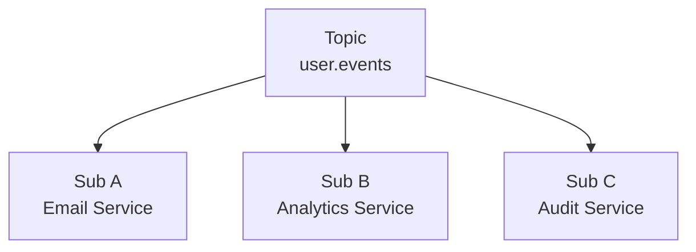
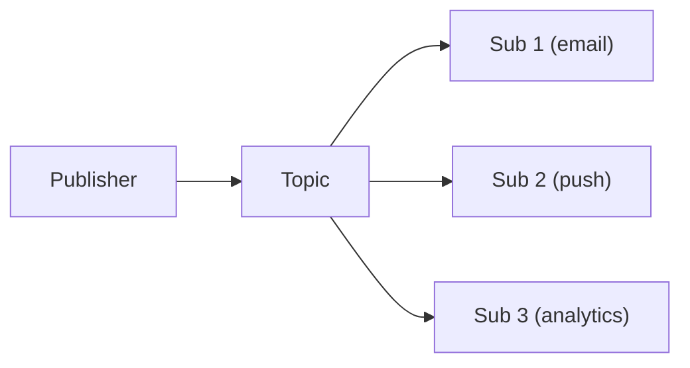
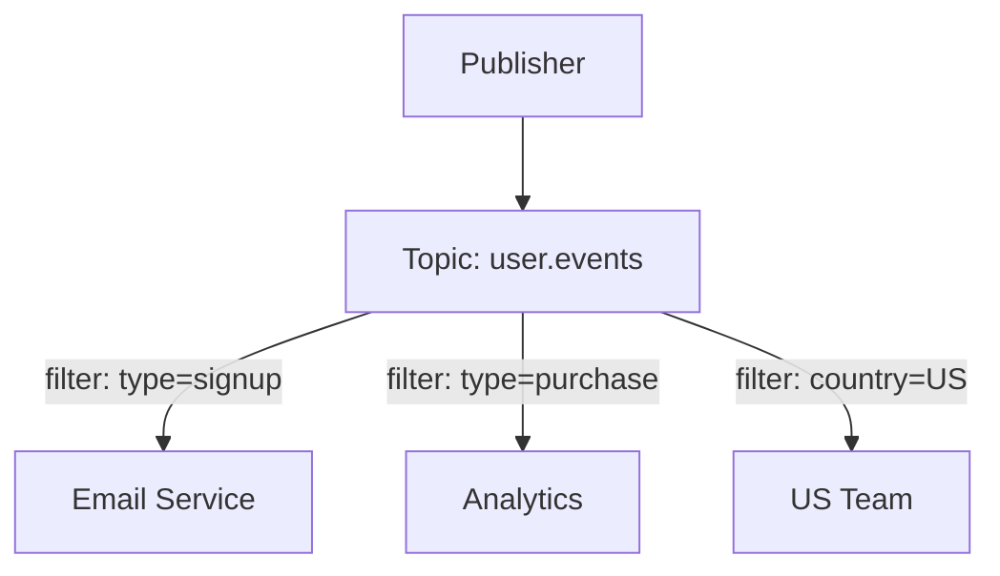
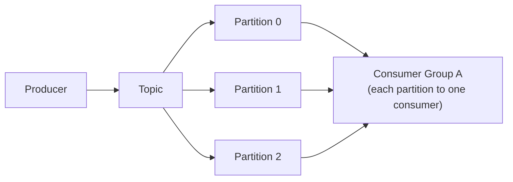
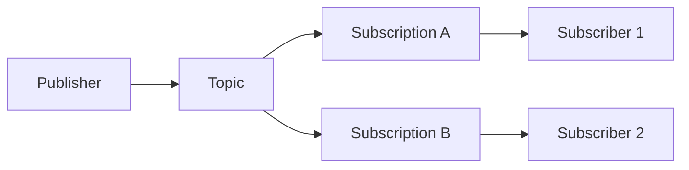
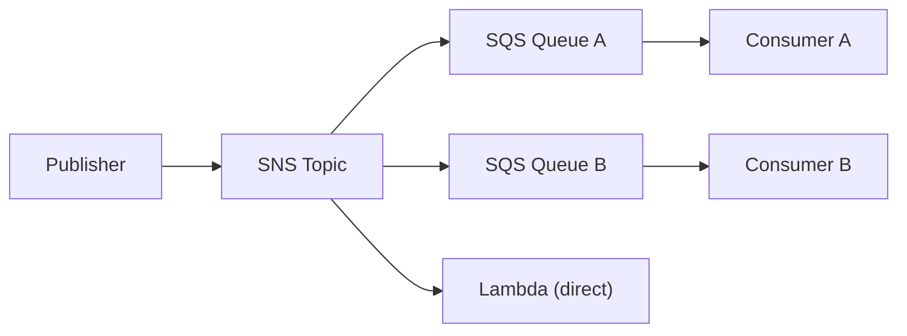
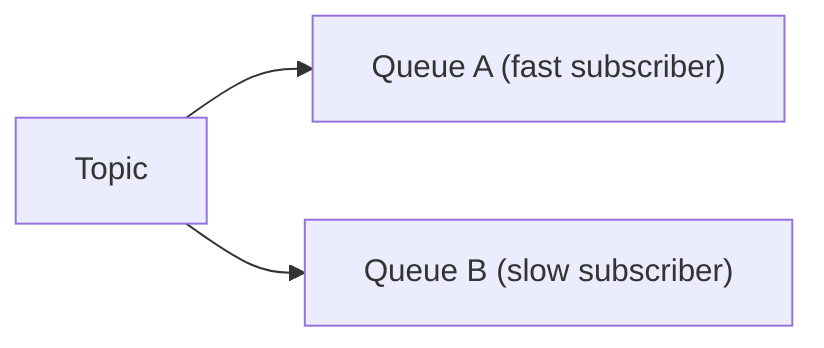
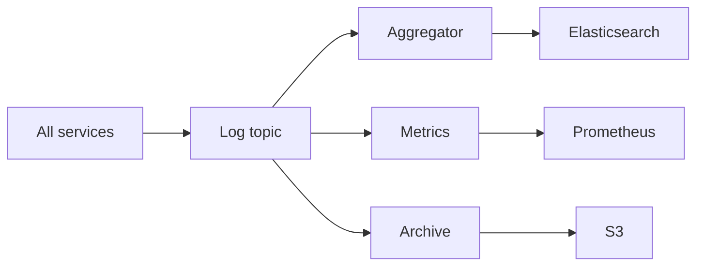
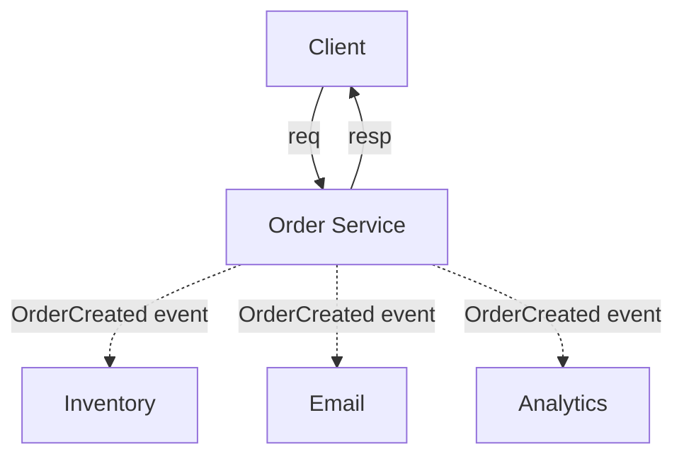

# パブリッシュ・サブスクライブ（Pub/Sub）

> **注記**: この記事は英語版 `/05-messaging/02-pub-sub.md` の日本語翻訳です。

## TL;DR

Pub/Subはトピックを介してメッセージプロデューサーとコンシューマーを分離します。パブリッシャーはサブスクライバーを知らずにトピックにメッセージを送信します。サブスクライバーは購読しているトピックのすべてのメッセージのコピーを受信します。イベント駆動アーキテクチャ、リアルタイム更新、疎結合を実現します。主要な考慮事項としてファンアウトコスト、順序保証、フィルタリング、バックプレッシャーがあります。

---

## 基本概念

### アーキテクチャ



パブリッシャーはサブスクライバーについて知りません。
各サブスクライバーはすべてのメッセージのコピーを受け取ります。

### ポイント・ツー・ポイントとの比較

```
ポイント・ツー・ポイント（キュー）:
  Message ──► [Queue] ──► 1つのコンシューマー
  タスク分配

Pub/Sub（トピック）:
  Message ──► [Topic] ──► すべてのサブスクライバー
  イベントブロードキャスト
```

### メッセージフロー

```
1. パブリッシャーがトピックにイベントを送信する
2. ブローカーがメッセージを保存する
3. ブローカーがすべてのサブスクライバーにファンアウトする
4. 各サブスクライバーが独立して処理する
5. サブスクライバーは個別にアクノリッジする
```

---

## サブスクリプションモデル

### PushとPull

**Push（ブローカーがサブスクライバーにプッシュ）:**
```
Broker ──push──► Subscriber endpoint

利点:
  - 低レイテンシ
  - シンプルなサブスクライバー

欠点:
  - サブスクライバーが負荷を処理しなければならない
  - Webhookエンドポイントが必要

例: Google Pub/Sub pushサブスクリプション
```

**Pull（サブスクライバーがブローカーからプル）:**
```
Subscriber ──pull──► Broker

利点:
  - サブスクライバーがレートを制御する
  - ファイアウォールの内側でも動作する

欠点:
  - ポーリングのオーバーヘッド
  - レイテンシが高くなる可能性がある

例: Kafkaコンシューマーグループ
```

### 永続型とエフェメラル型

**永続サブスクリプション:**
```
サブスクライバーがT=0で切断
T=1、T=2、T=3でメッセージが到着
サブスクライバーがT=4で再接続

すべてのメッセージ（T=1、T=2、T=3）を受け取る
ブローカーが切断中にメッセージを保存していた
```

**エフェメラルサブスクリプション:**
```
接続中のみメッセージを受信する
切断中に逃したメッセージは失われる

用途: リアルタイム表示、ライブ更新
```

---

## トピック設計

### 階層型トピック

```
events.user.created
events.user.updated
events.user.deleted
events.order.placed
events.order.shipped

ワイルドカード:
  events.user.*     → すべてのユーザーイベント
  events.*.created  → すべての作成イベント
  events.#          → events配下のすべて
```

### トピック命名規則

```
パターン: <ドメイン>.<エンティティ>.<アクション>

例:
  payment.transaction.completed
  inventory.stock.low
  user.profile.updated

利点:
  - 明確なオーナーシップ
  - 簡単なフィルタリング
  - 論理的なグルーピング
```

### 単一トピック vs 複数トピック

```
単一トピック（events）:
  すべてのイベントが1か所に
  コンシューマーがタイプでフィルタリング
  シンプルなインフラ

複数トピック（events.user, events.order）:
  自然なパーティショニング
  関連するトピックのみ購読
  より良いアクセス制御

推奨: 少ないトピックから始め、必要に応じて分割する
```

---

## ファンアウトパターン

### シンプルファンアウト

1つのメッセージ → N個のコピー。



それぞれが同じメッセージを受け取ります。独立して処理します。

### フィルタリング付きファンアウト

すべてのサブスクライバーがすべてのメッセージを必要とするわけではありません。



### 実装

```python
# Google Cloud Pub/Sub with filter
subscriber.create_subscription(
    name="email-signups",
    topic="user-events",
    filter='attributes.type = "signup"'
)

# Kafka: Consumer reads all, filters in code
for message in consumer:
    if message.value['type'] == 'signup':
        process_signup(message)
```

---

## 順序保証

### 順序保証なし（デフォルト）

```
パブリッシュ: A, B, C
サブスクライバー1が受信: B, A, C
サブスクライバー2が受信: A, C, B

サブスクライバー間でも、単一のサブスクライバー内でも保証なし
```

### パブリッシャーごとの順序保証

```
パブリッシャー1: A1, B1, C1 → サブスクライバーはA1, B1, C1の順で受信
パブリッシャー2: A2, B2, C2 → サブスクライバーはA2, B2, C2の順で受信

ただしA1とA2は任意に入り混じる可能性がある
```

### パーティションベースの順序保証

```
同じキーのメッセージ → 同じパーティション → 順序保証あり

user_123のイベント: login, view, purchase
  すべてパーティション3に送られる
  サブスクライバーは順序通りに受信する

異なるユーザーは入り混じる可能性がある
```

### 全体順序保証

```
すべてのメッセージが厳密なグローバル順序
非常にコストが高い（単一のボトルネック）
めったに必要ない
```

---

## 実装

### Apache Kafka



特徴:
- ログベース（リプレイ可能）
- スケーリング用のコンシューマーグループ
- パーティション内で順序保証
- 高スループット

### Google Cloud Pub/Sub



特徴:
- マネージドサービス
- PushとPull
- メッセージフィルタリング
- At-least-once（exactly-onceプレビュー）

### Amazon SNS + SQS



特徴:
- ファンアウト用のSNS
- 永続性と処理用のSQS
- 複数プロトコル（HTTP、メール、SMS）

### Redis Pub/Sub

```
シンプルなインメモリPub/Sub

PUBLISH user-events '{"type":"login"}'
SUBSCRIBE user-events

特徴:
  - 非常に高速
  - 永続化なし（エフェメラル）
  - コンシューマーグループなし
  - リアルタイムに適している
```

---

## バックプレッシャーの処理

### 問題

```
パブリッシャー: 10,000 msg/sec
サブスクライバーA: 10,000 msg/secを処理可能 ✓
サブスクライバーB: 1,000 msg/secを処理可能 ✗

サブスクライバーBが遅れる
キューが無制限に増加する
最終的に: OOMまたはメッセージドロップ
```

### 解決策

**サブスクライバーごとのキュー:**


各キューが独立してバッファリングします。遅いサブスクライバーが速いサブスクライバーに影響しません。

**バックプレッシャーシグナル:**
```
サブスクライバーが「速度を落として」と信号を送る
ブローカーが送信レートを下げる
または: サブスクライバーが自分のペースでプルする
```

**タイムアウト後のデッドレター:**
```
1時間以上ackされないメッセージ
デッドレターキューに移動
アラートと手動対応
```

---

## Exactly-Onceの課題

### 重複配信

```
シナリオ:
  1. ブローカーがサブスクライバーにメッセージを送信する
  2. サブスクライバーが処理する
  3. ackがネットワーク上で失われる
  4. ブローカーが再送する（失敗したと判断）
  5. サブスクライバーが再び処理する

結果: 2回処理される
```

### 解決策

```
1. 冪等なサブスクライバー
   処理済みメッセージIDを追跡する
   既に見たものはスキップする

2. トランザクショナル処理
   処理 + ackを同一トランザクションで行う
   （常に可能なわけではない）

3. ブローカーでの重複排除
   ブローカーが配信済みメッセージIDを追跡する
   （限定された時間ウィンドウ）
```

---

## イベントスキーマの進化

### 課題

```
バージョン1:
  {user_id: 123, name: "Alice"}

バージョン2（フィールド追加）:
  {user_id: 123, name: "Alice", email: "..."}

古いサブスクライバーは新しいフィールドを処理できなければならない
新しいサブスクライバーはフィールドの欠落を処理できなければならない
```

### ベストプラクティス

```
1. オプショナルフィールドのみ追加する
2. フィールドの削除やリネームは行わない
3. スキーマレジストリを使用する
4. メッセージにバージョンを含める（またはスキーマIDを使用）

{
  "schema_version": 2,
  "user_id": 123,
  "name": "Alice",
  "email": "alice@example.com"  // Optional
}
```

### スキーマレジストリ

```
パブリッシャー:
  1. レジストリにスキーマを登録する
  2. スキーマIDを取得する
  3. メッセージにスキーマIDを含める

サブスクライバー:
  1. メッセージからスキーマIDを取得する
  2. レジストリからスキーマを取得する
  3. 正しいスキーマでデシリアライズする
```

---

## ユースケース

### イベント駆動アーキテクチャ

```
ユーザーがサインアップ
  → UserCreatedイベントをパブリッシュ

購読サービス:
  - メールサービス: ウェルカムメールを送信
  - アナリティクス: サインアップを追跡
  - 課金: アカウントを作成
  - レコメンデーション: プロフィールを初期化

サービスは独立して進化する
パブリッシャーを変更せずに新しいサブスクライバーを追加できる
```

### リアルタイム更新

```
株価が変動
  → PriceUpdatedイベント

サブスクライバー:
  - トレーディングダッシュボード（WebSocketプッシュ）
  - アラートサービス（閾値チェック）
  - 履歴データベース（記録）
```

### ログ集約



---

## モニタリング

### 主要メトリクス

```
パブリケーションレート:
  1秒あたりのパブリッシュメッセージ数

ファンアウトレイテンシ:
  パブリッシュからサブスクライバー受信までの時間

サブスクライバーラグ:
  サブスクリプションごとの保留メッセージ数

アクノリッジメントレート:
  1秒あたりのack数（サブスクライバーの健全性）

デッドレターレート:
  時間あたりの失敗メッセージ数
```

### ヘルスチェック

```python
def check_pubsub_health():
    # Check broker connectivity
    assert can_connect_to_broker()

    # Check subscription lag
    for sub in subscriptions:
        lag = get_subscription_lag(sub)
        if lag > threshold:
            alert(f"Subscription {sub} lagging: {lag}")

    # Check dead letter queue
    dlq_size = get_dlq_size()
    if dlq_size > 0:
        alert(f"Dead letter queue has {dlq_size} messages")
```

---

## 大規模Pub/Sub

### ファンアウト問題

```
1 msg × 10Kサブスクライバー = 10K配信
1K msg/sec × 10Kサブスクライバー = 10M配信/sec

単一ブローカーでは処理できません。ファンアウトコストはサブスクライバー数に比例して増加します。
```

### 階層型Pub/Sub

```
Publisher → [Root Broker] → [US] [EU] [APAC] → ローカルサブスクライバー

リージョン間トラフィックがリージョンあたり1コピーに削減されます。
リージョンブローカーがローカルにファンアウトします。リージョンごとの障害分離。
```

### トピックシャーディング

```
トピック"user.events"をパーティション分割: サブスクライバーをブローカーインスタンスに分散。
  Shard 0 (subs 0-2499) → Broker A    Shard 2 (subs 5000-7499) → Broker C
  Shard 1 (subs 2500-4999) → Broker B  Shard 3 (subs 7500-9999) → Broker D

コーディネーターがシャードに分配します。各ブローカーは自分のサブセットにのみファンアウトします。
```

### クラウドプロバイダーのアプローチ

```
Google Cloud Pub/Sub:
  - Push（ブローカーがHTTPSにPOST）またはPull（サブスクライバーがポーリング）
  - メッセージ重複排除によるExactly-once（ウィンドウ ~10分）
  - Seek: サブスクリプションをタイムスタンプに巻き戻してリプレイ

AWS SNSファンアウト:
  - SNS → SQSキュー、Lambda、HTTP/Sエンドポイント、メール、SMS
  - SNS + SQSで永続性確保（SNS単体はfire-and-forget）
```

### スループットリファレンス

```
Kafka:    100パーティション → 1M+ msg/sec（パーティション数に比例してスケール）
RabbitMQ: Fanoutエクスチェンジ → 50K-100K msg/sec（サブスクライバー数で劣化）
Redis:    インメモリPub/Sub → 500K+ msg/sec（永続性なし、fire and forget）
```

---

## トピック設計パターン

### 細粒度 vs 粗粒度トピック

```
細粒度（イベントタイプごとに1トピック）:
  orders.created, orders.updated, orders.cancelled, orders.refunded
  ✓ 必要なものだけ購読でき、コンシューマーロジックがシンプル
  ✗ トピックの増殖、パブリッシャーが正しいトピックを選ぶ必要がある

粗粒度（ドメインごとに1トピック）:
  orders → { "event_type": "created", ... }
  ✓ トピック数が少なく、すべてのオーダーイベントを単一サブスクリプションで
  ✗ コンシューマーが不要なイベントを受信、フィルタリングがサブスクライバー側に
```

### イベントエンベロープパターン

```json
{
  "event_id": "evt_a1b2c3d4",
  "event_type": "order.created",
  "timestamp": "2026-03-15T10:30:00Z",
  "correlation_id": "req_x9y8z7",
  "source": "order-service",
  "schema_version": 2,
  "payload": { "order_id": "ord_123", "customer_id": "cust_456", "total": 99.99 }
}
```

```
標準的なラッパーにより以下が可能になります:
  - ペイロードをデシリアライズせずにルーティング
  - correlation_idによる分散トレーシング
  - event_idによる重複排除
```

### ワイルドカードサブスクリプション

```
RabbitMQ topicエクスチェンジ:
  order.*.created  → order.us.created, order.eu.created にマッチ
  order.#          → order.us.created, order.eu.shipped.delayed にマッチ
  (* = 正確に1語, # = 0語以上)

Kafka: トピックに対するネイティブワイルドカードなし。コンシューマーは
  トピック名のみに対する正規表現で購読: consumer.subscribe(Pattern.compile("orders\\..*"))
```

---

## Pub/Subの障害処理

### 遅いサブスクライバーの影響

```
遅いサブスクライバーは他をブロックするか？

Kafka:   いいえ。グループごとに独立したコンシューマーオフセット。
         遅いコンシューマーは遅れますが、速いコンシューマーは影響を受けません。

RabbitMQ: 各サブスクライバーが独自のキューを持つ（遅いキューは独立して増加）。
         Classic queues: キューが満杯の場合、ブローカーがパブリッシャーにバックプレッシャーをかける可能性。
         Quorum queues: より良い分離だが、大きくなるとメモリ圧迫。
```

### ポイズンメッセージ

```
すべての試行でサブスクライバーをクラッシュさせるメッセージ → 無限再配信ループ。

解決策: バックオフ付きの制限付きリトライ、その後DLQにルーティング。

  if retry_count >= max_retries:
      publish_to_dlq(message)   # 08-dead-letter-queues.md を参照
  else:
      redelivery_with_backoff(message)

検出: 各失敗時にメッセージIDをログ、繰り返されるIDにアラート、DLQメタデータにエラーを含める。
```

### 処理中のサブスクライバークラッシュ

```
1. ブローカーがメッセージを配信 → 2. サブスクライバーが処理 → 3. ack前にクラッシュ
4. ブローカーが再配信 → 5. メッセージが2回処理される

At-least-once配信では、これは避けられません。
サブスクライバーは冪等でなければなりません。04-delivery-guarantees.md を参照。

冪等性: 重複排除テーブル（既に見たIDをスキップ）、INSERTの代わりにUPSERT、
  または外部APIコールの冪等性キーとしてevent_idを使用。
```

---

## Pub/Sub vs リクエスト・レスポンス

### どちらを使うべきか

```
Pub/Subを使う場合:
  ✓ イベント通知（「何かが起きた」）— N個の下流コンシューマー
  ✓ 分離されたサービス — パブリッシャーは誰がリッスンしているか知らない
  ✓ 時間的分離 — コンシューマーが準備できたときに処理する

リクエスト・レスポンスを使う場合:
  ✓ 即座の回答が必要 — 「アイテムXの価格は？」→ $29.99
  ✓ 同期ワークフロー — 各ステップが前の結果を必要とする
  ✓ 単一のコンシューマー — リクエストのハンドラーが1つだけ
  ✓ 呼び出し元が操作が失敗したかどうかを知る必要がある
```

### ハイブリッド: コマンド + イベント



同期パスにはリクエスト・レスポンス。非同期の副次効果にはPub/Sub。

### アンチパターン: メッセージング上のRPC

```
やってはいけない: Client → [request.topic] → Service → [reply.topic + correlation_id] → Client

問題点:
  - Correlation ID管理の複雑さ
  - クライアントごとのリプライトピック、またはフィルタリング付き共有リプライトピック
  - タイムアウト処理がぎこちない（いつ待つのを止めるか？）
  - 直接呼び出しのトレーシングより デバッグが難しい

リクエスト・レスポンスが必要なら、gRPCまたはHTTPを使ってください。
Pub/Subはfire-and-forgetまたはfire-and-observe用です。
```

---

## 重要なポイント

1. **Pub/Subはプロデューサーとコンシューマーを分離する** - どちらも相手を知らない
2. **各サブスクライバーがすべてのメッセージを受け取る** - ファンアウトパターン
3. **永続サブスクリプションは切断しても存続する** - メッセージがキューイングされる
4. **順序保証はコストが高い** - 必要に応じてパーティションキーを使用する
5. **バックプレッシャーは重要** - 遅いサブスクライバーが問題を引き起こす可能性がある
6. **冪等性が重複を処理する** - At-least-onceが一般的
7. **スキーマ進化には計画が必要** - レジストリを使用し、追加のみの変更
8. **サブスクライバーラグを監視する** - 処理問題の早期警告
