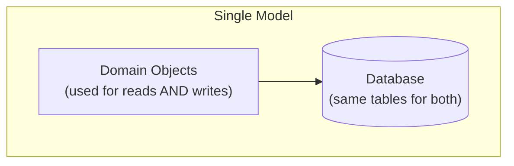
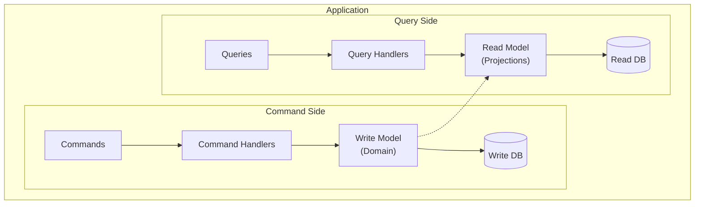
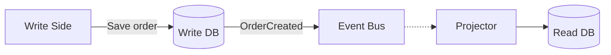
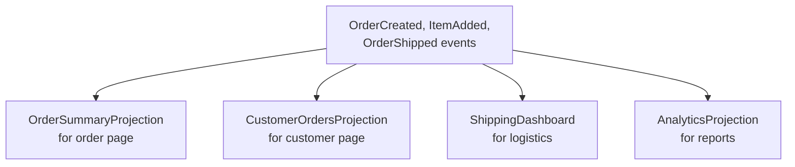
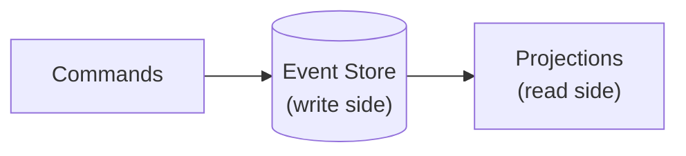

# CQRS（コマンドクエリ責務分離）

> **注記**: この記事は英語版 `/05-messaging/06-cqrs.md` の日本語翻訳です。

## TL;DR

CQRSは読み取りと書き込みの操作を異なるモデルに分離します。コマンドが状態を変更し、クエリが状態を読み取ります。各モデルはその目的に最適化できます。書き込みモデルは不変条件を保証し、読み取りモデルはクエリに最適化されます。イベントソーシングとよく組み合わされます。利点として、独立したスケーリングと最適化されたモデルがあります。コストとして、複雑さと結果整合性があります。

---

## 問題

### 従来のアーキテクチャ



```
問題点:
  - 読み取りと書き込みのパターンが異なる
  - 単一モデルが両方を妥協させる
  - スケーリングの課題
```

### 読み取り vs 書き込みの特性

```
書き込み:
  - 低ボリューム（相対的に）
  - 複雑なバリデーション
  - トランザクショナル
  - 強い整合性が必要

読み取り:
  - 高ボリューム（通常、書き込みの10-100倍）
  - バリデーション不要
  - 多くの場合、非正規化
  - 結果整合性で十分な場合が多い
```

---

## CQRSアーキテクチャ

### 基本構造



### コマンド側

```python
# Command: Intent to change state
@dataclass
class CreateOrderCommand:
    customer_id: str
    items: List[OrderItem]

# Handler: Validates and executes
class CreateOrderHandler:
    def handle(self, cmd: CreateOrderCommand):
        # Load domain object
        customer = self.customer_repo.get(cmd.customer_id)

        # Business logic and validation
        order = customer.create_order(cmd.items)

        # Persist
        self.order_repo.save(order)

        # Publish event for read side
        self.events.publish(OrderCreated(order))
```

### クエリ側

```python
# Query: Request for data
@dataclass
class GetOrderSummaryQuery:
    order_id: str

# Handler: Retrieves from read model
class GetOrderSummaryHandler:
    def handle(self, query: GetOrderSummaryQuery):
        # Simple read from optimized store
        return self.read_db.get(
            f"order_summary:{query.order_id}"
        )
```

---

## 同期

### イベントベースの同期



### プロジェクターの実装

```python
class OrderProjector:
    def handle(self, event):
        if isinstance(event, OrderCreated):
            summary = OrderSummary(
                id=event.order_id,
                customer_name=event.customer_name,
                total=event.total,
                status="created"
            )
            self.read_db.save(f"order_summary:{event.order_id}", summary)

        elif isinstance(event, OrderShipped):
            summary = self.read_db.get(f"order_summary:{event.order_id}")
            summary.status = "shipped"
            summary.shipped_at = event.timestamp
            self.read_db.save(f"order_summary:{event.order_id}", summary)
```

---

## リードモデルの最適化

### 非正規化

```
書き込みモデル（正規化）:
  Orders:     id, customer_id, total
  Customers:  id, name, email
  Items:      id, order_id, product_id, qty

リードモデル（非正規化）:
  OrderSummary:
    order_id
    customer_name      ← Customersからコピー
    customer_email     ← Customersからコピー
    total
    item_count         ← 計算済み
    product_names[]    ← Productsからコピー
```

### 複数のリードモデル



### リードストアの選択肢

```
異なるニーズに異なるストア:

注文サマリー:       Redis（高速なキーバリュー）
全文検索:           Elasticsearch
アナリティクス:     ClickHouse（カラムナー）
カスタマーダッシュボード: PostgreSQL（リレーショナル）

各々がユースケースに最適化
```

---

## 結果整合性

### トレードオフ

```
コマンドがT=0で完了
T=100msでイベント処理 → リードモデル更新
T=50msでのクエリ: 古いデータが見える！「書き込みは成功したが変更が見えない」
```

### 対処戦略

**楽観的UI:** 送信時にサーバーの確認前にクライアントを即座に更新します。プロジェクションが追いつく間、UIは既に期待される状態を表示します。

**書き込みモデルからの読み取り:** 整合性が重要な読み取りでは、書き込みデータベースにフォールバックします。以下の「リードモデルとライトモデル間の整合性」で、詳細なパターン（read-your-writes、バージョン付き読み取り、同期プロジェクション）を参照してください。

---

## CQRS + イベントソーシング

### 自然な組み合わせ

```
イベントソーシング:
  イベントが信頼できる情報源

CQRS:
  書き込み: イベントを追記
  読み取り: イベントをリードモデルにプロジェクト
```



### 実装

```python
# Write side: Event sourcing
def handle_withdraw(cmd):
    account = event_store.load(cmd.account_id)

    # Validate using events
    if account.balance < cmd.amount:
        raise InsufficientFunds()

    # Append event
    event_store.append(
        cmd.account_id,
        MoneyWithdrawn(amount=cmd.amount)
    )

# Read side: Projection
class BalanceProjection:
    def project(self, event):
        if isinstance(event, MoneyWithdrawn):
            current = redis.get(f"balance:{event.account_id}")
            redis.set(f"balance:{event.account_id}", current - event.amount)
```

---

## イベントソーシングなしのCQRS

### よりシンプルなCQRS

```python
# Write side: Traditional ORM
def create_order(cmd):
    order = Order(
        customer_id=cmd.customer_id,
        items=cmd.items
    )
    db.session.add(order)
    db.session.commit()

    # Publish event for read side
    publish(OrderCreated(order.id, order.total))

# Read side: Separate database
@event_handler(OrderCreated)
def project_order(event):
    summary = {
        "id": event.order_id,
        "total": event.total,
        "status": "created"
    }
    read_db.orders.insert(summary)
```

### 共有データベース

```
最もシンプルなCQRS: 同じデータベース、異なるアクセスパターン

書き込み:
  ORM使用、複雑なオブジェクト
  トランザクショナルな書き込み

読み取り:
  生SQLまたはシンプルなクエリ
  リードレプリカ
  キャッシュされた結果
```

---

## CQRSを使うべき時

### 適している場合

```
✓ 読み取りと書き込みの比率が高い
✓ ビジネスルールを持つ複雑なドメイン
✓ 異なるリードモデルの必要性
✓ 読み取りと書き込みでパフォーマンス要件が異なる
✓ チームが複雑さに慣れている
```

### 適していない場合

```
✗ シンプルなCRUDアプリケーション
✗ 低トラフィックシステム
✗ 即時整合性の必要性
✗ 小さなチーム、厳しいデッドライン
✗ 読み取りと書き込みが同じパターン
```

### 進化のパス

```
シンプルに始める:
  1. 単一モデル、単一データベース

リードレプリカを追加:
  2. プライマリに書き込み、レプリカから読み取り

プロジェクションを導入:
  3. 別々のリードモデル、イベント駆動の同期

完全なCQRS:
  4. 異なるデータベース、完全な分離

イベントソーシングを追加:
  5. イベントストアを書き込みモデルとして
```

---

## 一般的なパターン

### タスクベースUI

```
従来型: すべてのフィールドを持つCRUDフォーム

CQRS: 特定のコマンド

以下の代わりに:
  UpdateUser(id, name, email, phone, address, ...)

以下を使用:
  ChangeUserEmail(id, email)
  UpdateUserAddress(id, address)
  ChangePhoneNumber(id, phone)

利点:
  - 明確な意図
  - 特定のバリデーション
  - より良い監査証跡
```

### ビューごとのリードモデル

```
各UIビューが独自のプロジェクションを持つ

ダッシュボード:     DashboardProjection
注文一覧:          OrderListProjection
注文詳細:          OrderDetailProjection

クエリ時にJOINなし
各プロジェクションがそのビュー用に非正規化
```

### 同期的な書き込み後読み取り

```python
def create_and_return_order(cmd):
    # Create order (write side)
    order_id = command_handler.create_order(cmd)

    # Wait for read model to sync
    summary = poll_until_exists(
        f"order_summary:{order_id}",
        timeout=5s
    )

    return summary
```

---

## CQRSのテスト

### コマンドのテスト

```python
def test_withdraw_insufficient_funds():
    # Given account with balance 100
    account = Account(balance=100)

    # When withdrawing 200
    cmd = WithdrawCommand(account_id=account.id, amount=200)

    # Then should raise error
    with pytest.raises(InsufficientFundsError):
        handler.handle(cmd)
```

### プロジェクションのテスト

```python
def test_order_projection():
    # Given events
    events = [
        OrderCreated(order_id="1", total=100),
        ItemAdded(order_id="1", item="Widget"),
        OrderShipped(order_id="1")
    ]

    # When projected
    projection = OrderProjection()
    for event in events:
        projection.handle(event)

    # Then summary correct
    summary = projection.get("1")
    assert summary.status == "shipped"
    assert summary.total == 100
```

---

## リードモデルプロジェクションパターン

### フラットな非正規化テーブル

特定のクエリに必要なすべてのデータを単一のテーブルに事前JOINします。クエリ時にJOINなし。

```
書き込みモデル（正規化）:              リードモデル（フラット）:
  orders(id, customer_id, status)        order_summary:
  customers(id, name, email)               order_id, customer_name, customer_email,
  order_items(id, order_id, product_id)    product_names[], item_count, total, status

1つのSELECT、0 JOIN。プロジェクションが書き込み時に非正規化を処理。
```

### ユースケースごとのマテリアライズドビュー

異なる画面が同じデータの異なる形状を必要とします。それぞれに別々のプロジェクションを構築します。

```
同じイベントストリーム → 複数のプロジェクション:
  モバイルリストビュー:   { order_id, status, total, created_at }
  Webデタイルビュー:     { order_id, status, total, items[], customer, shipping_address }
  管理ダッシュボード:     { order_id, customer_name, total, status, fraud_score, region }
各々がコンシューマーに必要なものだけを格納 — それ以上でも以下でもなく。
```

### リードモデルとしてのElasticsearch

全文検索とフィルタリングのためにイベントを非正規化されたElasticsearchドキュメントにプロジェクト。

```python
@event_handler(ProductUpdated)
def project_product(event):
    es.index(index="products", id=event.product_id, body={
        "name": event.name, "description": event.description,
        "category": event.category, "price": event.price, "tags": event.tags
    })

# Query: full-text search + filter in one call
results = es.search(index="products", body={
    "query": {"bool": {
        "must": {"match": {"description": "wireless"}},
        "filter": {"range": {"price": {"lte": 50}}}
    }}
})
```

### リードモデルとしてのRedis

リーダーボード用のSorted set、プロフィールカード用のHash。サブミリ秒の読み取り。

```python
@event_handler(ScoreUpdated)
def project_leaderboard(event):
    redis.zadd("leaderboard:global", {event.user_id: event.score})
    redis.hset(f"profile:{event.user_id}", mapping={
        "name": event.user_name, "score": event.score
    })

# Top 10 in <1ms
top_10 = redis.zrevrange("leaderboard:global", 0, 9, withscores=True)
```

### GraphQLリードモデル

GraphQLスキーマに直接一致するようにプロジェクションを設計します。ネストされたドキュメントを格納し、各クエリが単一の読み取りで解決されるようにします。リゾルバーチェーンなし、N+1なし。

```
プロジェクションドキュメントがGraphQL型をミラーリング:
  { "id": "order-1",
    "customer": { "id": "c-1", "name": "Alice" },
    "items": [{ "product": "Widget", "qty": 2, "price": 10 }] }
```

### プロジェクションのリビルド

プロジェクションロジックが変更された場合、すべてのイベントをリプレイしてゼロからリビルドします。これがCQRS+ESの最大の特徴です。新しいコードをデプロイし、新しいリードストアを作成し、イベントをリプレイし、トラフィックを切り替え、古いストアを破棄します。ダウンタイムゼロ、マイグレーションスクリプト不要。イベントストリームが信頼できる情報源です。

---

## リードモデルとライトモデル間の整合性

### 結果整合性がデフォルト

書き込みモデルが更新され、イベントがパブリッシュされ、リードモデルが非同期で更新されます。このギャップが**プロジェクションラグ**です。

```
T=0ms   コマンド受理、イベント保存    T=15ms  コンシューマーがイベントをピックアップ
T=5ms   イベントをバスにパブリッシュ    T=20ms  リードモデル更新
→ T=0からT=20の間のクエリは古いデータが見える。
```

### プロジェクションラグの測定

イベントタイムスタンプとプロジェクション更新タイムスタンプの差を追跡します。ラグがSLAを超えたらアラート。

```python
class MonitoredProjector:
    def project(self, event):
        self.do_project(event)
        lag_ms = (datetime.utcnow() - event.timestamp).total_seconds() * 1000
        metrics.histogram("projection.lag_ms", lag_ms,
                          tags=[f"projection:{self.__class__.__name__}"])
        if lag_ms > 500:
            metrics.increment("projection.lag_sla_breach")
```

### Read-Your-Writesパターン

書き込み後、プロジェクションが追いつくまで、そのユーザーのセッションでは書き込みモデルから読み取ります。セッションに最新の書き込みバージョンを保存し、読み取り時にプロジェクションバージョンがそれを満たすか確認します。満たさない場合は書き込みモデルにフォールバック。

```python
def get_order(order_id, user_session):
    min_version = session_store.get(f"last_write:{user_session}")
    summary = read_db.get(order_id)
    if min_version and (not summary or summary.version < min_version):
        return write_db.get_order(order_id)  # fallback
    return summary
```

### 同期プロジェクション

書き込みと同じトランザクションでリードモデルを更新します。ラグを排除しますがモデルを結合します。単一DBデプロイメントでのみ実用的。

```python
def create_order(cmd):
    with db.transaction():
        order = Order(customer_id=cmd.customer_id, items=cmd.items)
        db.session.add(order)
        summary = OrderSummary.from_order(order)  # same transaction
        db.session.add(summary)
```

独立したスケーラビリティを強い整合性と引き換えます。データベースを共有し、プロジェクションラグを許容できない場合に適切。

### バージョン付き読み取り

リードモデルにバージョン番号を含めます。クライアントがバージョンが最新の書き込みを反映しているか確認します。

```
POST /orders → 201 Created { "id": "o-1", "version": 7 }

GET /orders/o-1?min_version=7
  → リードモデルのversion >= 7の場合: 200を返す
  → リードモデルのversion < 7の場合:  202 Accepted を返す（後でリトライ）
```

---

## CQRSが不要な複雑さを追加する場合

### シンプルなCRUDアプリケーション

読み取りと書き込みが同じ形状の場合 — 同じフィールドを保存・表示するフォーム — CQRSは利点なく同期レイヤーを追加します。RESTエンドポイントを持つ単一モデルの方がシンプルで十分。

### 小さなチームのオーバーヘッド

別々の読み取りと書き込みモデルの維持はコード面を倍増させます。すべてのスキーマ変更が両側に影響します。チームの規律、明確なオーナーシップ、結果整合性デバッグの経験が必要です。

### 単一データベース、スケーリング圧力なし

読み取りを書き込みから独立してスケールしていない場合、ORM背後の適切にインデックス付けされたテーブルが両方のパスを処理します。プロジェクションとイベントバスの追加は、スケーリングのメリットなしにオーバーヘッドとなります。

### 低い読み取り/書き込み非対称性

CQRSは読み取りが書き込みを大幅に上回る場合（100:1以上）に輝きます。読み取りと書き込みがほぼ同等の場合、別々のモデル維持の複雑さを正当化しにくくなります。

### アンチパターン: あらゆる場所でCQRS

明確な読み取り/書き込みの非対称性を持つ境界付きコンテキストにCQRSを適用 — 商品カタログ、アナリティクスダッシュボード、検索。システム全体に均一に適用しないでください。ほとんどのサービスはシンプルなCRUDで問題ありません。

### 決定チェックリスト

```
CQRS採用前の5つの質問（3つ以上「いいえ」→ 時期尚早の可能性）:

1. 読み取りと書き込みは根本的に異なる形状か？
2. 読み取り対書き込み比率は > 50:1か？
3. 複数のリードモデル表現が必要か？
4. ユーザーは結果整合性を許容できるか？
5. チームはイベント駆動システムの経験があるか？
```

---

## 本番CQRSアーキテクチャ

### イベントバスの選択

```
Kafka:     永続的、パーティション内で順序保証、オフセットからリプレイ。
           高スループット、マルチコンシューマーアーキテクチャに最適。
RabbitMQ:  よりシンプルな運用、柔軟なルーティング（fanout、topic）。
           低スループット、シンプルなトポロジーに最適。
```

### プロジェクションサービスの設計

イベントを読み取りリードストアを更新するステートレスコンシューマーです。冪等でなければなりません — 同じイベントを2回処理しても同じ結果になる（`04-delivery-guarantees.md`を相互参照）。イベントIDを重複排除キーとして使用: プロジェクション前に確認、プロジェクション後にマーク。

```python
class ProjectionConsumer:
    def process(self, event):
        if self.read_db.has_processed(event.event_id):
            return
        self.projector.project(event)
        self.read_db.mark_processed(event.event_id)
```

### モニタリング

```
プロジェクションラグ:      event_timestamp - projection_timestamp（> 500msでアラート）
失敗したプロジェクション:   デッドレターキューにルーティングされたイベント（アラート: DLQエントリあり）
リードモデルの古さ:        last_projection_update_timestamp（> 30s更新なしでアラート）
コンシューマーグループラグ: Kafkaコンシューマーオフセット - 最新オフセット（バックプレッシャーシグナル）
```

### デプロイメントの独立性

リードモデルとライトモデルは独立してデプロイされます。リードモデルは書き込みに影響なくリビルドできます — 新しいプロジェクションロジックをデプロイ、イベントをリプレイ、トラフィックを切り替え。書き込みサービスのドメインロジック変更はリードサービスのリリースを必要とせず、逆もまた然り。

### スケーリング

リードモデルレプリカを書き込みモデルから独立してスケールします。書き込み側: 単一プライマリ（書き込みはアグリゲートごとに順次）。読み取り側: 検索用のElasticsearchノード、キャッシュ用のRedisレプリカ、リレーショナルクエリ用のPostgreSQLリードレプリカを追加 — 各々が独自のトラフィックパターンに合わせてスケール。

---

## 重要なポイント

1. **読み取りと書き込みを分離する** - 異なるニーズに異なるモデル
2. **各側を最適化する** - 書き込みは不変条件のため、読み取りはクエリのため
3. **イベントで同期する** - 書き込み時にパブリッシュ、読み取り時にプロジェクト
4. **結果整合性を受け入れる** - または即時整合性のコストを支払う
5. **複数のリードモデルはOK** - 同じイベントから異なるビュー
6. **イベントソーシングと相性が良い** - 自然な組み合わせ
7. **常に必要ではない** - 複雑さが増す
8. **シンプルに始め、進化させる** - 最初から過剰設計しない
