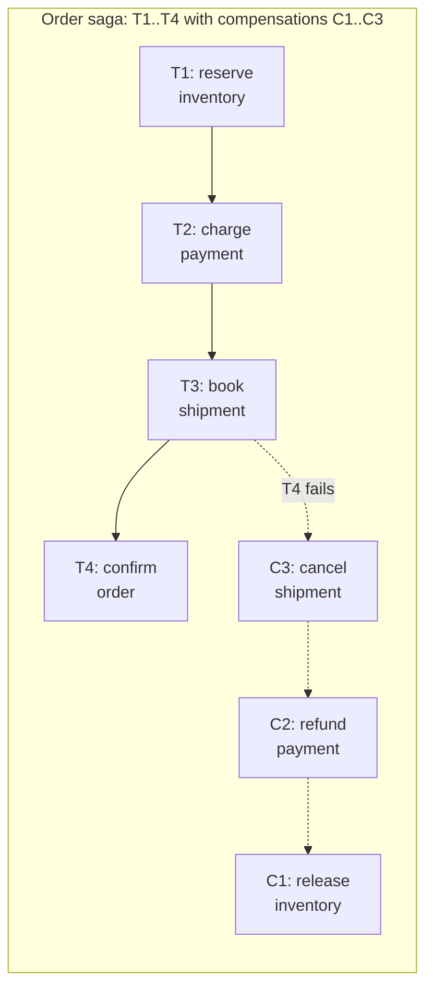
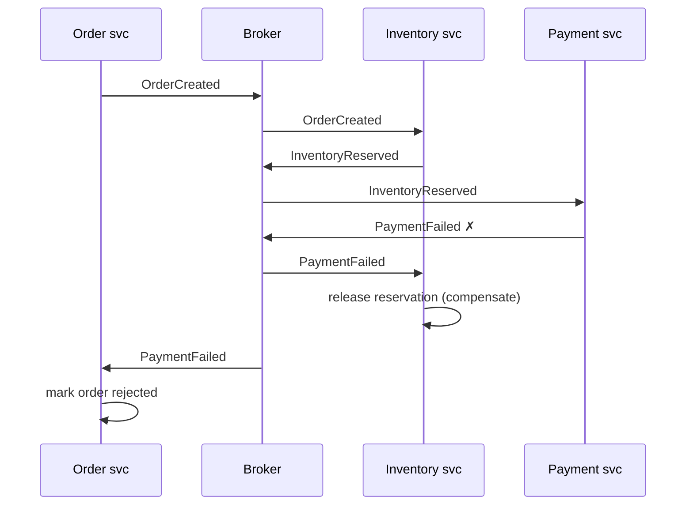

# Sagaパターンと耐久実行

> **翻訳についての注記:** 本ドキュメントは英語原文 `05-messaging/09-saga-pattern.md` を日本語に翻訳したものです。コードブロックおよびMermaidダイアグラムは原文のまま維持しています。

## TL;DR

Sagaは、サービスをまたぐビジネストランザクションを、それぞれが**補償アクション**(意味的な取り消し)と対になったローカルトランザクションの列として実行します。分散コミットはなく、分離性もありません — 他のトランザクションは中間状態を見ます — つまりSagaはACIDの「AとI」を可用性と疎結合のために手放します。調整方式は、単純で短いフローには**コレオグラフィ**(サービスが互いのイベントに反応)、分岐・タイムアウト・4ステップ以上を含むものには**オーケストレーション**(コーディネータが状態機械を所有)。**耐久実行**(durable execution)エンジン(Temporal型のworkflow-as-code)はオーケストレーションを産業化しました: コーディネータの状態はイベントソーシングとリプレイでクラッシュを生き延び、リトライとタイマーは組み込みで、Sagaは普通のコードになります。補償を先に設計してください — 補償できないステップは最後に置くしかありません。

---

## なぜ分散トランザクションではないのか

サービスをまたぐ2相コミットは、全参加者の可用性を結合し、ネットワーク往復の間ロックを保持します — コーディネータはブロッキングする単一障害点で、遅い参加者は全員を止めます([分散トランザクション](../02-distributed-databases/07-distributed-transactions.md))。チームとサービスの境界を越えると、2PCは*デプロイ*まで結合します: 全参加者が永遠に同じトランザクションプロトコルを話す必要があります。Sagaはより弱い保証 — **結果的な原子性**: 全ステップが完了するか、完了済みステップが補償されるか — を受け入れる代わりに、各サービスは自分のローカルACIDトランザクションだけを使います。



実行ルール: T1…Tnを前進し、Tkで失敗したら補償Ck-1…C1を逆順に実行する。補償は**意味的な**取り消しであり、ロールバックではありません — 返金は新しい金融イベントであって、課金の消去ではありません。補償が不要なアクションもあれば(期限切れする予約)、補償が不可能なアクションもあります(送信済みメール、払い出された現金) — それらは最後に置くか、キャンセル可能な2段階アクション(予約→確定)に変換してください。

---

## コレオグラフィ: コーディネータなしのイベント連鎖

各サービスは前のステップのイベントを購読し、自分のイベントを発行します。中央の頭脳はありません — イベントフローそのものがSagaです。



```python
# Inventory service: forward step and compensation are just event handlers
@handles("OrderCreated")
def reserve(event, tx):
    tx.execute("UPDATE stock SET reserved = reserved + %s WHERE sku = %s AND available >= %s",
               event.qty, event.sku, event.qty)
    outbox.emit(tx, "InventoryReserved", order_id=event.order_id)   # outbox: state + event atomically

@handles("PaymentFailed")
def compensate(event, tx):
    tx.execute("UPDATE stock SET reserved = reserved - %s WHERE sku = %s",
               event.qty, event.sku)
    outbox.emit(tx, "InventoryReleased", order_id=event.order_id)
```

各ステップはローカル状態の更新とイベント発行を**アトミックに**行わなければなりません — それがまさに[アウトボックスパターン](./07-outbox-pattern.md)であり、これを欠いたSagaはいずれステップを失うか捏造します。配信はat-least-onceなので、コンシューマは冪等でなければなりません([配信保証](./04-delivery-guarantees.md))。

コレオグラフィの強みは疎結合、弱みは**「注文4711は今どこにいて、次に何が起きるのか?」に誰も答えられない**ことです — イベントグラフを頭の中でシミュレートしない限り。循環購読が忍び込み、ステップ追加は複数サービスの変更になります。およそ3ステップを超えるか分岐が入った時点で、暗黙の状態機械は明示化を求めています。

## オーケストレーション: 明示的な状態機械

コーディネータ(いずれかのサービス、または専用サービス)がコマンドを送り、応答を待ち、Sagaの状態を所有します:

```python
class OrderSaga:
    """Explicit state machine; state persisted on every transition."""

    STEPS = [
        Step(cmd=ReserveInventory, compensation=ReleaseInventory),
        Step(cmd=ChargePayment,    compensation=RefundPayment),
        Step(cmd=BookShipment,     compensation=CancelShipment),
        Step(cmd=ConfirmOrder,     compensation=None),  # pivot: no undo past here
    ]

    def on_reply(self, saga_state, reply):
        if reply.ok:
            saga_state.completed.append(reply.step)
            return self.next_command(saga_state)
        # failure → run completed steps' compensations in reverse
        return [s.compensation(saga_state) for s in reversed(saga_state.completed)
                if s.compensation]
```

| | コレオグラフィ | オーケストレーション |
|---|---|---|
| 結合 | サービスはイベント契約のみ知る | サービスはオーケストレータのコマンドを知る |
| 可視性 | ログからの再構築 | 1レコード見れば状態が分かる |
| ステップ追加 | 複数サービスを編集 | オーケストレータを編集 |
| 失敗処理 | ハンドラに分散 | 集中・テスト可能 |
| リスク | 暗黙のスパゲッティ状態機械 | オーケストレータの神オブジェクト化 |
| 適性 | 2–3の直線ステップ、安定したフロー | 分岐、タイムアウト、SLA、監査 |

オーケストレータは*コーディネータ*に留め、*実行者*にしないこと: 順序の決定だけを持ち、ビジネスロジックはサービスに残します。

---

## 欠けている「I」: Sagaの分離性

Sagaは中間状態を露出します — 決済が通る前に予約が存在し、並行するSagaがそれを観測したり干渉したりできます。Garcia-Molinaの原論文はステップの意味的独立を仮定していました。現実のシステムには対策が要ります:

- **セマンティックロック:** Sagaが所有するレコードを `PENDING` とマークし、他のSagaはpendingをビジー扱い(リトライか迂回)します。これはアプリケーションレベルのロックです — 短く保ち、期限で防御を([分散ロック](../01-foundations/09-distributed-locks.md))。
- **可換な更新:** ステップを絶対値の書き込みではなく `+= / -=` のデルタとして設計し、交互実行の順序を無意味にします。
- **悲観的順序付け:** 最も失敗しやすいリスクの高いステップを先頭に(希少な在庫を予約する前に検証+課金)、補償が見える窓を縮めます。
- **ピボット前の再読:** それ以降は取り消し不能なステップ(**ピボットトランザクション**)の直前に、重要な前提(「価格が変わっていない、商品がまだ予約済み」)を再検証します。
- Sagaが触れるレコードに**バージョンカウンタ/フェンシング**を付け、古いSagaの遅延書き込みを適用せず拒否します。

同じレコードを並行更新する2つのSagaが破壊を起こし、どの対策も合わないなら、そのワークフローは本当にシングルライター設計か、1つのサービス境界内の本物のトランザクションを必要としているのかもしれません — 境界の引き直しが正直な解決のこともあります。

---

## 耐久実行: 普通のコードとしてのSaga

手作りのオーケストレータはすべて同じ基盤に収斂します: 遷移ごとの状態永続化、クラッシュ後の回復、バックオフ付きリトライ、タイマー処理、ワークフローロジックのバージョニング。**耐久実行**エンジン(Temporal、およびAWS Step Functions・Restate・Azure Durable Functionsの背後にある同型のパターン)はその基盤を提供し、Sagaを直線的なコードとして書かせてくれます:

```python
@workflow.defn
class OrderWorkflow:
    @workflow.run
    async def run(self, order: Order) -> str:
        compensations = []
        try:
            await workflow.execute_activity(reserve_inventory, order,
                start_to_close_timeout=timedelta(seconds=30),
                retry_policy=RetryPolicy(maximum_attempts=5, backoff_coefficient=2.0))
            compensations.append(release_inventory)

            await workflow.execute_activity(charge_payment, order,
                start_to_close_timeout=timedelta(seconds=30))
            compensations.append(refund_payment)

            await workflow.execute_activity(book_shipment, order,
                start_to_close_timeout=timedelta(minutes=5))
            return "confirmed"
        except ActivityError:
            for undo in reversed(compensations):
                await workflow.execute_activity(undo, order,
                    start_to_close_timeout=timedelta(minutes=10))
            return "compensated"
```

クラッシュを生き延びる仕組み: すべての `execute_activity` の結果は**イベント履歴**に追記されます。ワーカーが死ぬと、別のワーカーがワークフロー関数を履歴に対して**リプレイ**します — 完了済みアクティビティは記録された結果を即座に返し、実行は止まった場所から正確に再開します。Saga状態機械は依然として存在します。エンジンがあなたのコードからそれを導出するのです。

この規律が買ってくれるものにはルールが伴います:

- **ワークフローコードは決定的でなければならない。** ワークフロー関数内では壁時計の読み取り、乱数、直接I/O、順序不定なマップの反復は禁止 — それらはアクティビティに置きます。リプレイはワークフローコードを再実行し、同一の判断に到達しなければなりません。
- **アクティビティはat-least-once。** exactly-onceはエンジンが*売っていない*幻想です。すべてのアクティビティには冪等性キーが必要です。あらゆるコンシューマと同じです([冪等性](../01-foundations/08-idempotency.md))。
- **ワークフローをバージョニングする。** 実行中のインスタンスは*今ある*コードに対してリプレイされます。ステップ順序の変更はリプレイを壊します。エンジンはパッチ/バージョニングAPIを提供します — 使ってください。ワークフロー定義はデータベーススキーマのように扱うこと: マイグレートする、書き換えない。
- **タイマーと人間のステップが自明になる** — `await workflow.sleep(days=7)` や承認シグナルの待機は、待機中コストゼロです。だからこそ耐久実行は、cron+状態テーブル設計が苦手とする「ユーザーの確認を待つ」フローも吸収します。(同じ機構がいまや長時間実行のLLMエージェントループも支えています — [オーケストレーションパターン](../17-llm-systems/02-orchestration-patterns.md)参照。)

エンジンが過剰なのはいつか? 1チームのサービス内に閉じた、補償1つの2ステップSagaなら、アウトボックス+ハンドラのパターンで十分です。`workflow_state`、`step`、`retry_count` という名前の手作り状態テーブルを見かけたら、耐久実行を導入するときです — それは下手に実装されたエンジンだからです。

---

## 運用チェックリスト

- [ ] 各ステップの状態変更+イベント発行がアトミック(アウトボックス)
- [ ] 各ステップと各補償が冪等で、バックオフ付きリトライされる
- [ ] 補償は機能の出荷*前*に存在する。補償不能なステップは最後(または予約型に変換)
- [ ] ピボットトランザクションを特定済み。ピボットで前提を再検証する
- [ ] Sagaの状態が一箇所で照会できる(オーケストレータのレコード/ワークフロー履歴) — サポートと監査のため
- [ ] スタックしたSagaのアラート: 種別ごとの最古の実行中Sagaの経過時間、補償率、毒ステップのデッドレターキュー([デッドレターキュー](./08-dead-letter-queues.md))
- [ ] 並行干渉を分析済み: レコードを共有するSagaにはセマンティックロック/可換更新/バージョニング
- [ ] ワークフローロジックはバージョニングされ、リプレイ互換性をCIでテスト(耐久実行の場合)

---

## 参考文献

- [Sagas](https://www.cs.cornell.edu/andru/cs711/2002fa/reading/sagas.pdf) — Garcia-Molina & Salem, 1987; 原論文
- [Saga pattern](https://microservices.io/patterns/data/saga.html) — Richardson; コレオグラフィ vs オーケストレーションのカタログ
- *Microservices Patterns* (Richardson), ch. 4 — Saga分離性の対策
- [Temporal documentation](https://docs.temporal.io/) — 耐久実行のセマンティクス、決定性ルール、バージョニング
- [AWS Step Functions](https://docs.aws.amazon.com/step-functions/latest/dg/welcome.html) — マネージド状態機械オーケストレーション
- [Life Beyond Distributed Transactions](https://queue.acm.org/detail.cfm?id=3025012) — Helland; Sagaの底にあるアーキテクチャ論
