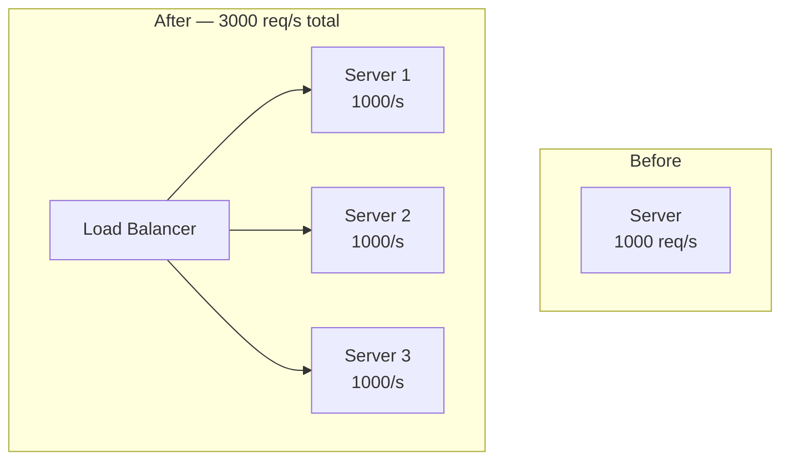
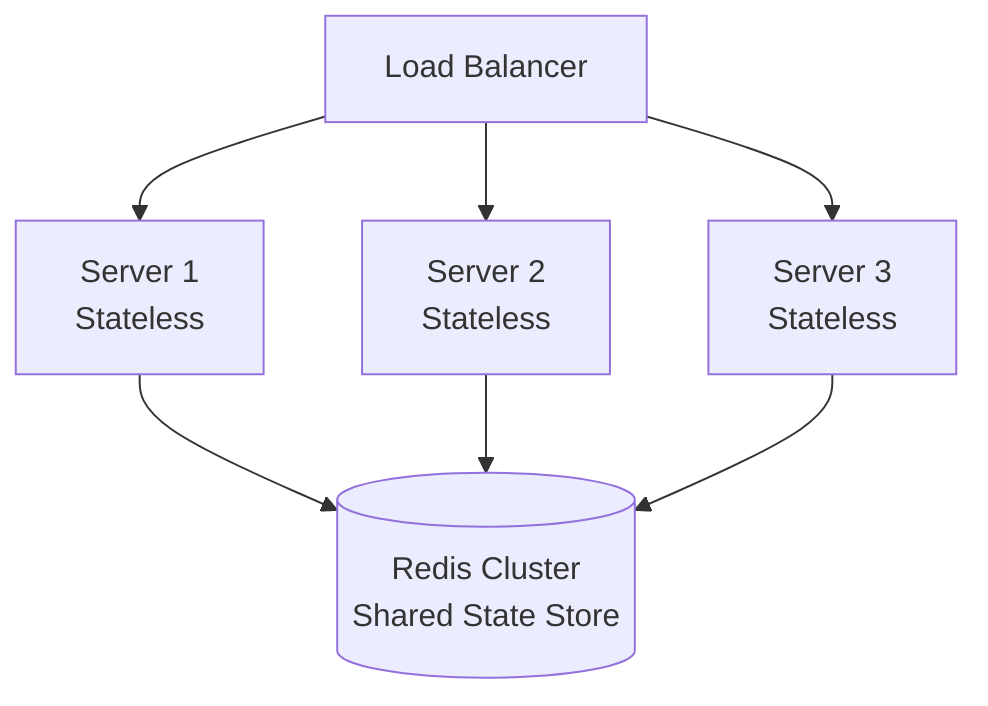
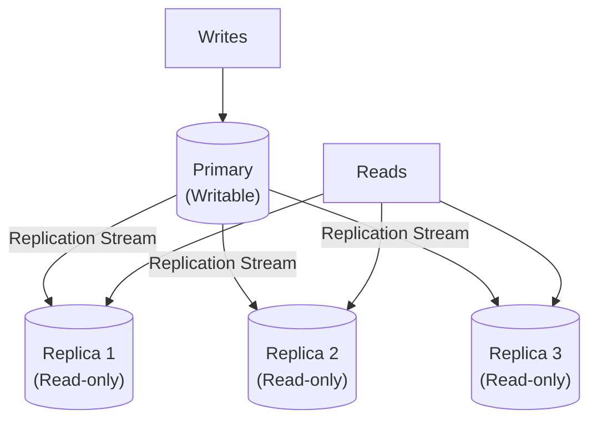
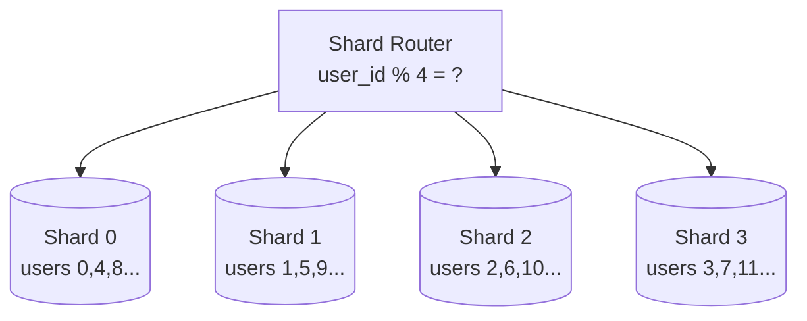
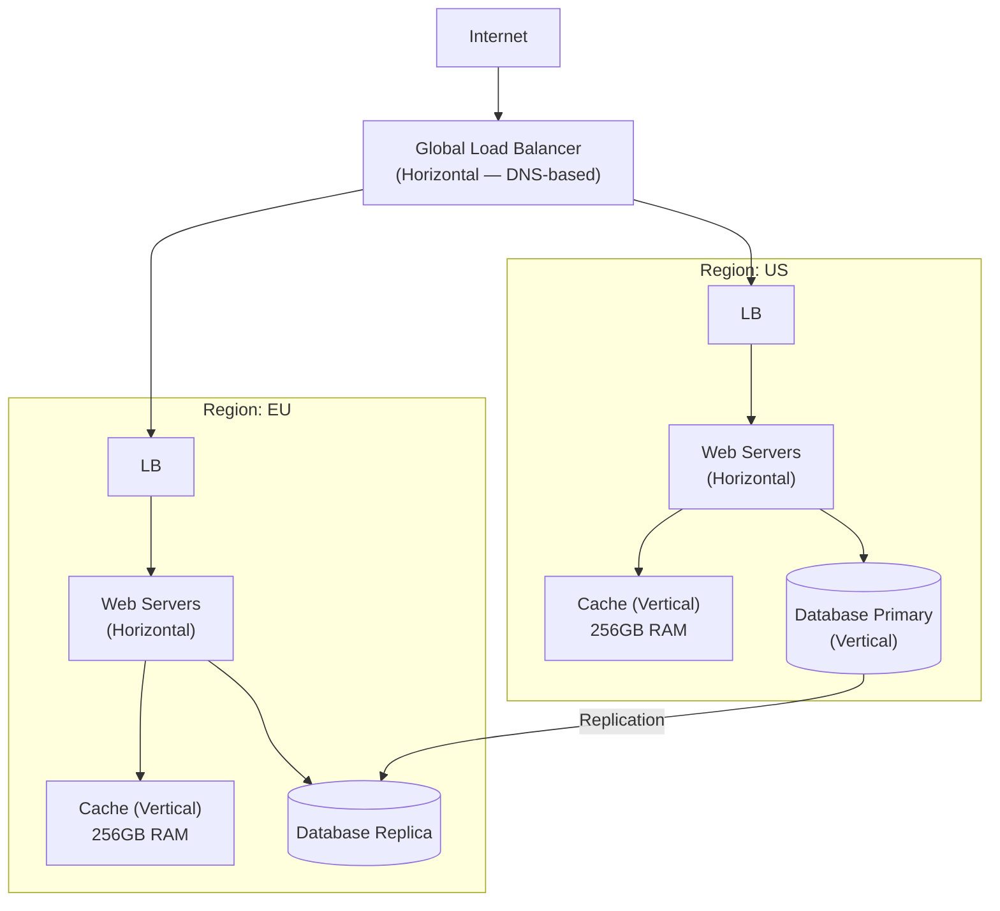
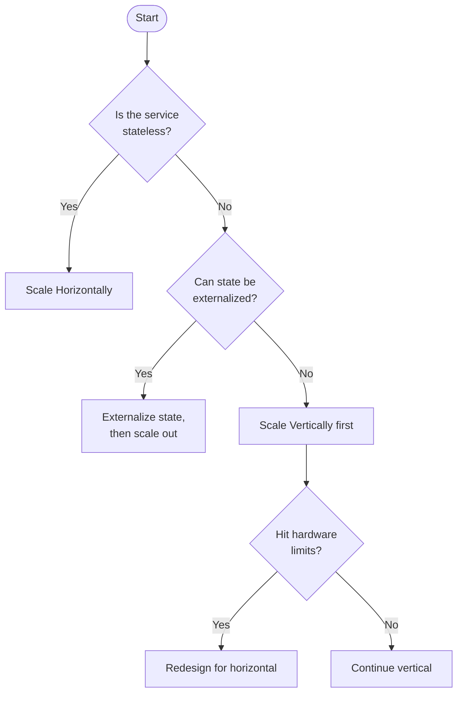

# 水平スケーリング vs 垂直スケーリング

> **注**: この文書は英語版からの翻訳です。コードブロックおよびMermaidダイアグラムは原文のまま保持しています。

## TL;DR

垂直スケーリング（スケールアップ）は、既存のマシンにCPU、RAM、ストレージなどのリソースを追加します。水平スケーリング（スケールアウト）は、マシンを追加して負荷を分散します。現代のほとんどの分散システムは、耐障害性とコスト効率の観点から水平スケーリングを採用していますが、垂直スケーリングはよりシンプルで、特定のワークロードに適しています。

---

## スケーリングの課題

```
Traffic Growth Over Time:

     Requests/sec
          │
     100k │                              ╱
          │                           ╱
      50k │                        ╱
          │                     ╱
      10k │              ╱─────╱
          │         ╱───╱
       1k │    ╱───╱
          │╱──╱
          └──────────────────────────────►
                                        Time

Question: How do we handle 100x traffic growth?
```

---

## 垂直スケーリング（スケールアップ）

```
Before:                        After:
┌──────────────────┐          ┌──────────────────┐
│     Server       │          │     Server       │
│                  │          │                  │
│  CPU: 4 cores    │    ───►  │  CPU: 64 cores   │
│  RAM: 16 GB      │          │  RAM: 512 GB     │
│  SSD: 500 GB     │          │  SSD: 10 TB NVMe │
│                  │          │                  │
└──────────────────┘          └──────────────────┘
```

### 垂直スケーリングが効果的なケース

```python
# Single-threaded workloads benefit from faster CPUs
class SingleThreadedProcessor:
    """
    Vertical scaling helps: Faster CPU = faster processing
    Examples:
    - Complex calculations
    - Sequential data processing
    - Legacy applications
    """
    def process(self, data):
        result = complex_computation(data)  # CPU-bound
        return result

# Memory-intensive workloads
class InMemoryDatabase:
    """
    Vertical scaling helps: More RAM = more data in memory
    Examples:
    - Redis with large datasets
    - In-memory analytics
    - Caching layers
    """
    def __init__(self):
        self.data = {}  # All data in memory

    def get(self, key):
        return self.data.get(key)  # O(1) access
```

### 垂直スケーリングの限界

```
AWS EC2 Instance Sizes (example):

Instance Type      vCPUs    Memory    Cost/hr
─────────────────────────────────────────────
t3.micro              2      1 GB     $0.01
t3.large              2      8 GB     $0.08
m5.xlarge             4     16 GB     $0.19
m5.4xlarge           16     64 GB     $0.77
m5.24xlarge          96    384 GB     $4.61
u-24tb1.metal       448   24,576 GB   $218.40  ← Maximum!

                    ┌─────────────────────────────────┐
                    │  CEILING: Physical limits        │
                    │  - Max CPU cores per socket      │
                    │  - Max RAM per motherboard       │
                    │  - Max I/O bandwidth             │
                    └─────────────────────────────────┘
```

---

## 水平スケーリング（スケールアウト）



### ステートレスサービスは水平スケーリングに適している

```python
from flask import Flask, request
import os

app = Flask(__name__)

# Stateless service - easy to scale horizontally
@app.route('/api/calculate', methods=['POST'])
def calculate():
    data = request.json

    # No local state - any instance can handle this
    result = perform_calculation(data)

    return {"result": result, "server": os.getenv("HOSTNAME")}

# Each instance is identical and interchangeable
# ┌─────────┐  ┌─────────┐  ┌─────────┐
# │Instance1│  │Instance2│  │Instance3│
# │  Code   │  │  Code   │  │  Code   │
# │  (same) │  │  (same) │  │  (same) │
# └─────────┘  └─────────┘  └─────────┘
```

### ステートフルサービスはより困難

```python
# BAD: Stateful service - hard to scale
class SessionStore:
    def __init__(self):
        self.sessions = {}  # Local state!

    def set_session(self, session_id, data):
        self.sessions[session_id] = data

    def get_session(self, session_id):
        return self.sessions.get(session_id)

# Problem: User might hit different server each request
# Request 1 → Server1 (session created here)
# Request 2 → Server2 (session not found!)

# SOLUTION: Externalize state
import redis

class ExternalSessionStore:
    def __init__(self):
        self.redis = redis.Redis(host='redis-cluster')

    def set_session(self, session_id, data):
        self.redis.setex(session_id, 3600, json.dumps(data))

    def get_session(self, session_id):
        data = self.redis.get(session_id)
        return json.loads(data) if data else None
```



---

## データベーススケーリング戦略

### 垂直スケーリング（シンプル）

```sql
-- Single powerful database server
-- Handles all reads and writes

CREATE TABLE orders (
    id BIGINT PRIMARY KEY,
    user_id INT,
    amount DECIMAL(10,2),
    created_at TIMESTAMP
);

-- Indexes for performance
CREATE INDEX idx_user_orders ON orders(user_id);
CREATE INDEX idx_created ON orders(created_at);

-- Upgrade server hardware when needed:
-- More RAM → larger buffer pool
-- Faster SSD → faster I/O
-- More cores → more parallel queries
```

### 水平スケーリング（リードレプリカ）



```python
from sqlalchemy import create_engine
from sqlalchemy.orm import sessionmaker
import random

class DatabaseRouter:
    def __init__(self):
        self.primary = create_engine('postgresql://primary:5432/db')
        self.replicas = [
            create_engine('postgresql://replica1:5432/db'),
            create_engine('postgresql://replica2:5432/db'),
            create_engine('postgresql://replica3:5432/db'),
        ]

    def get_write_session(self):
        """All writes go to primary"""
        Session = sessionmaker(bind=self.primary)
        return Session()

    def get_read_session(self):
        """Reads distributed across replicas"""
        replica = random.choice(self.replicas)
        Session = sessionmaker(bind=replica)
        return Session()

# Usage
router = DatabaseRouter()

# Write operation
with router.get_write_session() as session:
    order = Order(user_id=123, amount=99.99)
    session.add(order)
    session.commit()

# Read operation (can hit any replica)
with router.get_read_session() as session:
    orders = session.query(Order).filter_by(user_id=123).all()
```

### 水平スケーリング（シャーディング）



---

## 比較表

| 観点 | 垂直スケーリング | 水平スケーリング |
|--------|-----------------|-------------------|
| **複雑さ** | シンプル | 複雑 |
| **ダウンタイム** | アップグレードに必要 | ゼロダウンタイム可能 |
| **コストカーブ** | 指数関数的 | 線形 |
| **障害の影響** | 単一障害点 | 耐障害性あり |
| **最大容量** | ハードウェアの限界 | 理論上は無制限 |
| **データ一貫性** | 容易（単一ノード） | 複雑（分散） |
| **アプリケーション変更** | 最小限 | 再設計が必要な場合あり |
| **運用オーバーヘッド** | 低い | 高い |

---

## コスト分析

```
Vertical Scaling Cost Curve:

Cost ($)
    │
    │                                    ╱
    │                                 ╱──
    │                              ╱──
    │                           ╱──
    │                        ╱──
    │                    ╱───
    │               ╱────
    │         ╱─────
    │    ╱────
    │╱───
    └────────────────────────────────────►
                                   Capacity

Cost grows exponentially!
2x performance ≠ 2x cost (often 3-4x cost)


Horizontal Scaling Cost Curve:

Cost ($)
    │
    │                              ╱
    │                          ╱
    │                      ╱
    │                  ╱
    │              ╱
    │          ╱
    │      ╱
    │  ╱
    │╱
    └────────────────────────────────────►
                                   Capacity

Cost grows linearly (with some overhead)
2x servers ≈ 2x cost (+ coordination overhead)
```

```python
def calculate_scaling_cost():
    """Compare costs for 10x capacity increase"""

    # Vertical: Upgrade from m5.xlarge to m5.24xlarge
    vertical_before = 0.192 * 24 * 30  # $138/month
    vertical_after = 4.608 * 24 * 30   # $3,318/month
    vertical_ratio = vertical_after / vertical_before  # 24x cost!

    # Horizontal: Add more m5.xlarge instances
    horizontal_before = 0.192 * 24 * 30        # $138/month (1 instance)
    horizontal_after = 0.192 * 24 * 30 * 10    # $1,382/month (10 instances)
    horizontal_overhead = 0.10  # 10% for load balancer, coordination
    horizontal_total = horizontal_after * (1 + horizontal_overhead)
    horizontal_ratio = horizontal_total / horizontal_before  # 11x cost

    return {
        "vertical_cost_ratio": vertical_ratio,    # 24x
        "horizontal_cost_ratio": horizontal_ratio  # 11x
    }
```

---

## ハイブリッドアプローチ

ほとんどの本番システムでは、両方の戦略を使用します:



```python
class HybridScalingStrategy:
    """
    Decision framework for when to scale vertically vs horizontally
    """

    def recommend_scaling(self, service_type: str, bottleneck: str) -> str:
        recommendations = {
            # Stateless services: Scale horizontally
            ("api", "cpu"): "horizontal",
            ("api", "memory"): "horizontal",
            ("worker", "cpu"): "horizontal",

            # Caches: Often vertical first, then horizontal
            ("cache", "memory"): "vertical_then_horizontal",
            ("cache", "cpu"): "horizontal",

            # Databases: Depends on workload
            ("database", "reads"): "horizontal_replicas",
            ("database", "writes"): "vertical_then_shard",
            ("database", "storage"): "horizontal_sharding",

            # Message queues: Horizontal by design
            ("queue", "throughput"): "horizontal_partitions",
        }

        return recommendations.get(
            (service_type, bottleneck),
            "evaluate_case_by_case"
        )

    def scale_decision(self, metrics: dict) -> dict:
        """Make scaling decision based on current metrics"""

        if metrics['cpu_usage'] > 80:
            if metrics['service_type'] == 'stateless':
                return {
                    "action": "scale_out",
                    "add_instances": self._calculate_instances_needed(
                        metrics['cpu_usage'],
                        target=60
                    )
                }
            else:
                return {
                    "action": "scale_up",
                    "new_instance_type": self._next_instance_type(
                        metrics['current_type']
                    )
                }

        if metrics['memory_usage'] > 85:
            return {
                "action": "scale_up",
                "reason": "Memory-bound workloads often benefit from vertical scaling"
            }

        return {"action": "no_scaling_needed"}
```

---

## Kubernetes スケーリング例

```yaml
# Horizontal Pod Autoscaler (Horizontal Scaling)
apiVersion: autoscaling/v2
kind: HorizontalPodAutoscaler
metadata:
  name: api-server-hpa
spec:
  scaleTargetRef:
    apiVersion: apps/v1
    kind: Deployment
    name: api-server
  minReplicas: 3
  maxReplicas: 100
  metrics:
  - type: Resource
    resource:
      name: cpu
      target:
        type: Utilization
        averageUtilization: 70
  - type: Resource
    resource:
      name: memory
      target:
        type: Utilization
        averageUtilization: 80
  behavior:
    scaleDown:
      stabilizationWindowSeconds: 300
    scaleUp:
      stabilizationWindowSeconds: 0
      policies:
      - type: Percent
        value: 100
        periodSeconds: 15
---
# Vertical Pod Autoscaler (Vertical Scaling)
apiVersion: autoscaling.k8s.io/v1
kind: VerticalPodAutoscaler
metadata:
  name: cache-server-vpa
spec:
  targetRef:
    apiVersion: apps/v1
    kind: Deployment
    name: cache-server
  updatePolicy:
    updateMode: "Auto"
  resourcePolicy:
    containerPolicies:
    - containerName: cache
      minAllowed:
        memory: "1Gi"
        cpu: "500m"
      maxAllowed:
        memory: "32Gi"
        cpu: "8"
      controlledResources: ["memory"]
```

---

## 判断フレームワーク



---

## 重要なポイント

1. **まずは垂直スケーリングから**: 新しいシステムでは、垂直スケーリングがシンプルで、初期段階では十分な場合が多いです

2. **水平スケーリングを計画する**: 後で容易に水平スケーリングできるよう、最初からステートレスサービスとして設計してください

3. **状態を外部化する**: セッションデータ、キャッシュ、共有状態を外部ストア（Redis、データベース）に移動し、水平スケーリングを可能にしてください

4. **両方の戦略を使用する**: 本番システムでは通常、データベース/キャッシュに垂直スケーリング、アプリケーションサーバーに水平スケーリングを使用します

5. **運用の複雑さを考慮する**: 水平スケーリングはロードバランシング、サービスディスカバリ、分散協調などの複雑さを追加します

6. **コストカーブを監視する**: 垂直スケーリングのコストは指数関数的に増加します。コスト効率が悪くなったら水平スケーリングに切り替えてください

7. **耐障害性**: 水平スケーリングは自然な冗長性を提供します。垂直スケーリングは単一障害点を生み出します
