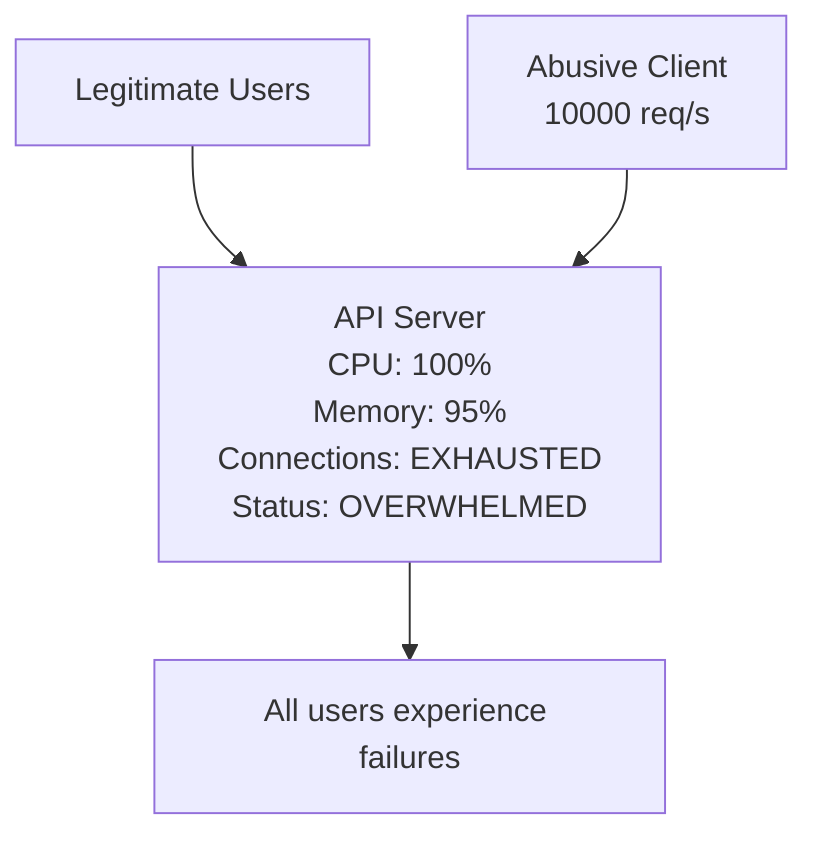
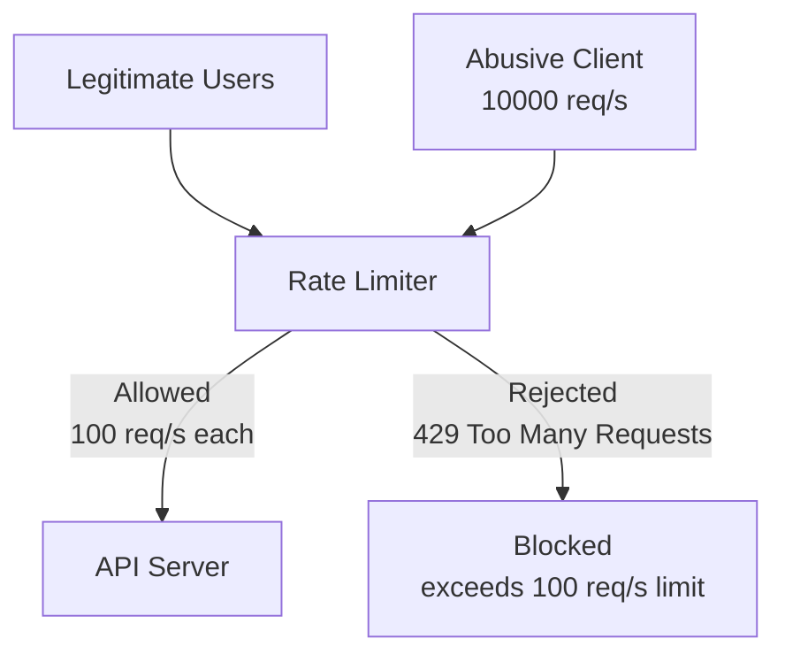
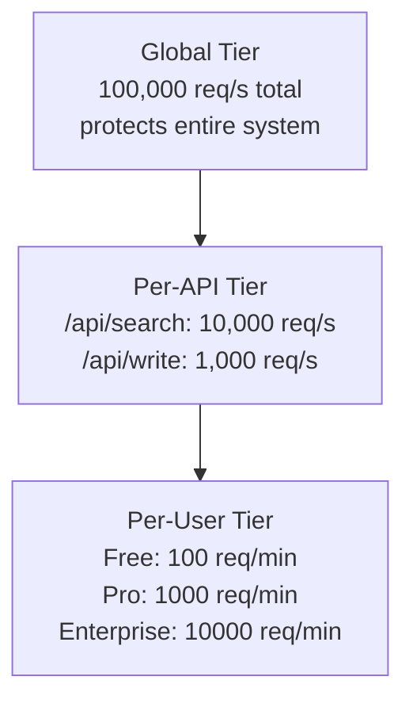
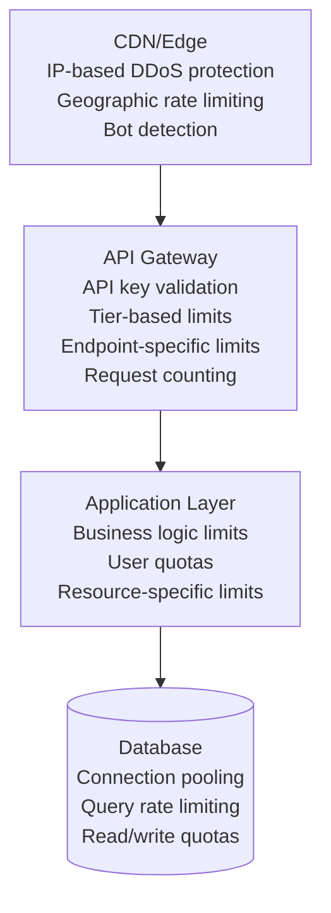

# レート制限

> **注**: この文書は英語版からの翻訳です。コードブロックおよびMermaidダイアグラムは原文のまま保持しています。

## TL;DR

レート制限は、クライアントが一定の時間枠内に行えるリクエスト数を制御し、サービスを不正利用から保護し、公平な使用を確保し、リソースの枯渇を防止します。一般的なアルゴリズムには、トークンバケット、リーキーバケット、固定ウィンドウ、スライディングウィンドウがあります。実装はAPIゲートウェイ、アプリケーション層、またはRedisなどの分散ストアを使用して行えます。

---

## なぜレート制限が必要なのか？

レート制限なしの場合:



レート制限ありの場合:



---

## レート制限アルゴリズム

### 1. トークンバケット

```
Token Bucket Visualization:

    ┌─────────────────────────────────────┐
    │              BUCKET                  │
    │  ┌─────────────────────────────────┐│
    │  │ 🪙 🪙 🪙 🪙 🪙 🪙 🪙 🪙          ││  Capacity: 10 tokens
    │  │       (8 tokens)                ││
    │  └─────────────────────────────────┘│
    │                 ▲                    │
    │                 │                    │
    │    Refill: 2 tokens/second          │
    └─────────────────────────────────────┘
              │
              ▼
    ┌─────────────────────────────────────┐
    │           REQUEST                    │
    │   Takes 1 token (if available)      │
    │   Rejected if no tokens             │
    └─────────────────────────────────────┘
```

```go
package main

import (
	"sync"
	"time"
)

type TokenBucket struct {
	capacity   float64
	refillRate float64 // tokens per second
	tokens     float64
	lastRefill time.Time
	mu         sync.Mutex
}

func NewTokenBucket(capacity int, refillRate float64) *TokenBucket {
	return &TokenBucket{
		capacity:   float64(capacity),
		refillRate: refillRate,
		tokens:     float64(capacity),
		lastRefill: time.Now(),
	}
}

func (tb *TokenBucket) refill() {
	now := time.Now()
	elapsed := now.Sub(tb.lastRefill).Seconds()
	tb.tokens += elapsed * tb.refillRate
	if tb.tokens > tb.capacity {
		tb.tokens = tb.capacity
	}
	tb.lastRefill = now
}

func (tb *TokenBucket) Allow(tokens int) bool {
	tb.mu.Lock()
	defer tb.mu.Unlock()

	tb.refill()
	need := float64(tokens)
	if tb.tokens >= need {
		tb.tokens -= need
		return true
	}
	return false
}

func (tb *TokenBucket) WaitTime(tokens int) time.Duration {
	tb.mu.Lock()
	defer tb.mu.Unlock()

	tb.refill()
	need := float64(tokens)
	if tb.tokens >= need {
		return 0
	}
	deficit := need - tb.tokens
	return time.Duration(deficit / tb.refillRate * float64(time.Second))
}

// Usage
func main() {
	limiter := NewTokenBucket(
		100,  // Burst up to 100 requests
		10,   // 10 requests per second sustained
	)

	if limiter.Allow(1) {
		processRequest()
	} else {
		retryAfter := limiter.WaitTime(1)
		rateLimitExceeded(retryAfter)
	}
}
```

### 2. リーキーバケット

```
Leaky Bucket Visualization:

         Incoming Requests
              │ │ │
              ▼ ▼ ▼
    ┌─────────────────────────────────────┐
    │              BUCKET                  │
    │  ┌─────────────────────────────────┐│
    │  │ ● ● ● ● ●                       ││  Queue: 5 requests
    │  │ ● ● ● ●                         ││  Capacity: 10
    │  └─────────────────────────────────┘│
    └────────────────┬────────────────────┘
                     │
                     ▼ Constant leak rate
              (process 2 req/sec)
                     │
                     ▼
              ┌──────────┐
              │ Process  │
              └──────────┘

Overflow → Request rejected (queue full)
```

```go
package main

import (
	"sync"
	"time"
)

type LeakyBucket struct {
	capacity int
	leakRate float64 // requests per second
	queue    []time.Time
	lastLeak time.Time
	mu       sync.Mutex
}

func NewLeakyBucket(capacity int, leakRate float64) *LeakyBucket {
	return &LeakyBucket{
		capacity: capacity,
		leakRate: leakRate,
		lastLeak: time.Now(),
	}
}

func (lb *LeakyBucket) leak() {
	now := time.Now()
	elapsed := now.Sub(lb.lastLeak).Seconds()
	leaked := int(elapsed * lb.leakRate)

	if leaked > len(lb.queue) {
		leaked = len(lb.queue)
	}
	lb.queue = lb.queue[leaked:]
	lb.lastLeak = now
}

func (lb *LeakyBucket) Allow() bool {
	lb.mu.Lock()
	defer lb.mu.Unlock()

	lb.leak()
	if len(lb.queue) < lb.capacity {
		lb.queue = append(lb.queue, time.Now())
		return true
	}
	return false
}

func (lb *LeakyBucket) QueuePosition() int {
	lb.mu.Lock()
	defer lb.mu.Unlock()

	lb.leak()
	return len(lb.queue)
}

// Leaky bucket smooths out traffic
// Even if 100 requests arrive at once,
// they're processed at constant rate (e.g., 10/sec)
```

### 3. 固定ウィンドウ

```
Fixed Window Visualization:

Window 1 (12:00:00 - 12:01:00)    Window 2 (12:01:00 - 12:02:00)
┌─────────────────────────────┐  ┌─────────────────────────────┐
│  ████████████████░░░░░░░░░░ │  │  ████░░░░░░░░░░░░░░░░░░░░░░ │
│  80 requests (limit: 100)   │  │  20 requests                │
└─────────────────────────────┘  └─────────────────────────────┘

Problem: Boundary burst
       12:00:30              12:01:30
          │                     │
Window 1: │█████████████████████│
          │   80 requests       │
                                │
Window 2:                       │█████████████████████
                                │   80 requests

Within 1 minute (12:00:30 - 12:01:30): 160 requests! (exceeds 100 limit)
```

```go
package main

import (
	"sync"
	"time"
)

type FixedWindowLimiter struct {
	limit         int
	windowSeconds int64
	counters      map[string]int
	windows       map[string]int64
	mu            sync.Mutex
}

func NewFixedWindowLimiter(limit int, windowSeconds int64) *FixedWindowLimiter {
	return &FixedWindowLimiter{
		limit:         limit,
		windowSeconds: windowSeconds,
		counters:      make(map[string]int),
		windows:       make(map[string]int64),
	}
}

func (fw *FixedWindowLimiter) getWindow() int64 {
	return time.Now().Unix() / fw.windowSeconds
}

func (fw *FixedWindowLimiter) Allow(key string) bool {
	fw.mu.Lock()
	defer fw.mu.Unlock()

	window := fw.getWindow()

	// Reset counter if new window
	if fw.windows[key] != window {
		fw.counters[key] = 0
		fw.windows[key] = window
	}

	if fw.counters[key] < fw.limit {
		fw.counters[key]++
		return true
	}
	return false
}

func (fw *FixedWindowLimiter) Remaining(key string) int {
	fw.mu.Lock()
	defer fw.mu.Unlock()

	window := fw.getWindow()
	if fw.windows[key] != window {
		return fw.limit
	}
	rem := fw.limit - fw.counters[key]
	if rem < 0 {
		return 0
	}
	return rem
}

func (fw *FixedWindowLimiter) ResetTime() int64 {
	return fw.windowSeconds - (time.Now().Unix() % fw.windowSeconds)
}

// Simple but has burst issue at window boundaries
// limiter := NewFixedWindowLimiter(100, 60)
```

### 4. スライディングウィンドウログ

```
Sliding Window Log:

Current Time: 12:01:30
Window: Last 60 seconds (12:00:30 - 12:01:30)

Request Log:
┌──────────────────────────────────────────────────────────────┐
│  12:00:25  ✗ (outside window)                                │
│  12:00:35  ✓ (inside window)  ────┐                          │
│  12:00:45  ✓ (inside window)      │                          │
│  12:01:00  ✓ (inside window)      │  Count these            │
│  12:01:15  ✓ (inside window)      │                          │
│  12:01:28  ✓ (inside window)  ────┘                          │
└──────────────────────────────────────────────────────────────┘

Count in window: 5
Limit: 100
→ Allow request
```

```go
package main

import (
	"sort"
	"sync"
	"time"
)

type SlidingWindowLogLimiter struct {
	limit         int
	windowSeconds float64
	logs          map[string][]float64 // key -> sorted timestamps
	mu            sync.Mutex
}

func NewSlidingWindowLogLimiter(limit int, windowSeconds int) *SlidingWindowLogLimiter {
	return &SlidingWindowLogLimiter{
		limit:         limit,
		windowSeconds: float64(windowSeconds),
		logs:          make(map[string][]float64),
	}
}

func (sw *SlidingWindowLogLimiter) cleanup(key string, now float64) {
	cutoff := now - sw.windowSeconds
	logs := sw.logs[key]

	// Find first timestamp in window (binary search)
	idx := sort.SearchFloat64s(logs, cutoff)
	sw.logs[key] = logs[idx:]
}

func (sw *SlidingWindowLogLimiter) Allow(key string) bool {
	sw.mu.Lock()
	defer sw.mu.Unlock()

	now := float64(time.Now().UnixNano()) / 1e9
	sw.cleanup(key, now)

	if len(sw.logs[key]) < sw.limit {
		// Insert in sorted order
		logs := sw.logs[key]
		idx := sort.SearchFloat64s(logs, now)
		logs = append(logs, 0)
		copy(logs[idx+1:], logs[idx:])
		logs[idx] = now
		sw.logs[key] = logs
		return true
	}
	return false
}

func (sw *SlidingWindowLogLimiter) GetCount(key string) int {
	sw.mu.Lock()
	defer sw.mu.Unlock()

	now := float64(time.Now().UnixNano()) / 1e9
	sw.cleanup(key, now)
	return len(sw.logs[key])
}

// Accurate but memory-intensive (stores every timestamp)
// O(n) space where n = requests in window
```

### 5. スライディングウィンドウカウンター

```
Sliding Window Counter:

Current Time: 12:01:30 (30 seconds into window 2)

Window 1 (12:00:00 - 12:01:00): 70 requests
Window 2 (12:01:00 - 12:02:00): 20 requests (so far)

Weighted count =
    (Window 1 count × overlap %) + Window 2 count
    = 70 × 50% + 20
    = 35 + 20
    = 55 requests

┌─────────────────────────────────────────────────────────────┐
│                                                             │
│  Window 1        │         Window 2                         │
│  ████████████████│█████████░░░░░░░░░░░░░░░░░░░░░           │
│        70        │   20                                     │
│           │◄────────────────────────────────►│              │
│           │     Sliding Window (60 sec)      │              │
│           │                                  │              │
│           12:00:30                    12:01:30              │
│                                                             │
└─────────────────────────────────────────────────────────────┘
```

```go
package main

import (
	"math"
	"sync"
	"time"
)

type windowData struct {
	count     int
	startTime float64
}

type SlidingWindowCounterLimiter struct {
	limit         int
	windowSeconds float64
	windows       map[string]*[2]windowData // [0]=current, [1]=previous
	mu            sync.Mutex
}

func NewSlidingWindowCounterLimiter(limit int, windowSeconds int) *SlidingWindowCounterLimiter {
	return &SlidingWindowCounterLimiter{
		limit:         limit,
		windowSeconds: float64(windowSeconds),
		windows:       make(map[string]*[2]windowData),
	}
}

func (sw *SlidingWindowCounterLimiter) getWindowStart(now float64) float64 {
	return math.Floor(now/sw.windowSeconds) * sw.windowSeconds
}

func (sw *SlidingWindowCounterLimiter) Allow(key string) bool {
	sw.mu.Lock()
	defer sw.mu.Unlock()

	now := float64(time.Now().UnixNano()) / 1e9
	windowStart := sw.getWindowStart(now)

	data, exists := sw.windows[key]
	if !exists {
		data = &[2]windowData{
			{count: 0, startTime: windowStart},
			{count: 0, startTime: windowStart - sw.windowSeconds},
		}
		sw.windows[key] = data
	}

	// Slide windows if needed
	if data[0].startTime < windowStart {
		data[1] = data[0]
		data[0] = windowData{count: 0, startTime: windowStart}
	}

	// Calculate weighted count
	elapsedRatio := (now - windowStart) / sw.windowSeconds
	previousWeight := 1.0 - elapsedRatio
	weightedCount := float64(data[1].count)*previousWeight + float64(data[0].count)

	if weightedCount < float64(sw.limit) {
		data[0].count++
		return true
	}
	return false
}

// Best of both worlds: accurate + memory efficient
// O(1) space per key
```

---

## Redisを使った分散レート制限

```python
import redis
import time
from typing import Tuple

class RedisRateLimiter:
    def __init__(self, redis_client: redis.Redis):
        self.redis = redis_client

    def token_bucket(self, key: str, capacity: int,
                     refill_rate: float, tokens: int = 1) -> Tuple[bool, dict]:
        """
        Distributed token bucket using Redis
        """
        now = time.time()
        bucket_key = f"ratelimit:bucket:{key}"

        # Lua script for atomic operation
        lua_script = """
        local bucket_key = KEYS[1]
        local capacity = tonumber(ARGV[1])
        local refill_rate = tonumber(ARGV[2])
        local tokens_requested = tonumber(ARGV[3])
        local now = tonumber(ARGV[4])

        -- Get current state
        local bucket = redis.call('HMGET', bucket_key, 'tokens', 'last_refill')
        local current_tokens = tonumber(bucket[1]) or capacity
        local last_refill = tonumber(bucket[2]) or now

        -- Calculate tokens to add
        local elapsed = now - last_refill
        local new_tokens = math.min(capacity, current_tokens + (elapsed * refill_rate))

        -- Check if we can consume tokens
        if new_tokens >= tokens_requested then
            new_tokens = new_tokens - tokens_requested
            redis.call('HMSET', bucket_key, 'tokens', new_tokens, 'last_refill', now)
            redis.call('EXPIRE', bucket_key, math.ceil(capacity / refill_rate) * 2)
            return {1, new_tokens, capacity}
        else
            redis.call('HMSET', bucket_key, 'tokens', new_tokens, 'last_refill', now)
            return {0, new_tokens, capacity}
        end
        """

        result = self.redis.eval(
            lua_script, 1, bucket_key,
            capacity, refill_rate, tokens, now
        )

        allowed, remaining, limit = result
        return bool(allowed), {
            'remaining': remaining,
            'limit': limit,
            'reset_after': (tokens - remaining) / refill_rate if not allowed else 0
        }

    def sliding_window(self, key: str, limit: int,
                       window_seconds: int) -> Tuple[bool, dict]:
        """
        Distributed sliding window counter using Redis
        """
        now = time.time()
        window_start = int(now // window_seconds) * window_seconds
        current_key = f"ratelimit:window:{key}:{window_start}"
        previous_key = f"ratelimit:window:{key}:{window_start - window_seconds}"

        pipe = self.redis.pipeline()
        pipe.get(current_key)
        pipe.get(previous_key)
        results = pipe.execute()

        current_count = int(results[0] or 0)
        previous_count = int(results[1] or 0)

        # Calculate weighted count
        elapsed_ratio = (now - window_start) / window_seconds
        previous_weight = 1 - elapsed_ratio
        weighted_count = previous_count * previous_weight + current_count

        if weighted_count < limit:
            # Increment and set expiry
            pipe = self.redis.pipeline()
            pipe.incr(current_key)
            pipe.expire(current_key, window_seconds * 2)
            pipe.execute()

            return True, {
                'remaining': int(limit - weighted_count - 1),
                'limit': limit,
                'reset': window_start + window_seconds
            }

        return False, {
            'remaining': 0,
            'limit': limit,
            'reset': window_start + window_seconds
        }
```

---

## レート制限レスポンスヘッダー

```nginx
# nginx rate limiting with limit_req

http {
    # Define rate limit zones
    # $binary_remote_addr uses client IP; zone=api stores state; rate=100r/m
    limit_req_zone $binary_remote_addr zone=api:10m rate=100r/m;

    # Optional: rate limit by API key header
    map $http_x_api_key $limit_key {
        default         $binary_remote_addr;
        "~.+"           $http_x_api_key;
    }
    limit_req_zone $limit_key zone=api_by_key:10m rate=100r/m;

    server {
        listen 80;

        location /api/resource {
            # Allow small bursts (up to 10 excess), delay after 5
            limit_req zone=api_by_key burst=10 delay=5;

            # Custom 429 error response
            limit_req_status 429;
            error_page 429 = @rate_limited;

            proxy_pass http://upstream_backend;

            # Forward rate limit headers from upstream
            add_header X-RateLimit-Limit    100;
            add_header X-RateLimit-Reset    $upstream_http_x_ratelimit_reset;
        }

        location @rate_limited {
            default_type application/json;
            return 429 '{"error":"Rate limit exceeded","retry_after":45}';
        }
    }
}
```

```
HTTP Response Headers:

HTTP/1.1 200 OK
X-RateLimit-Limit: 100
X-RateLimit-Remaining: 42
X-RateLimit-Reset: 1609459200

HTTP/1.1 429 Too Many Requests
X-RateLimit-Limit: 100
X-RateLimit-Remaining: 0
X-RateLimit-Reset: 1609459200
Retry-After: 45

{
  "error": "Rate limit exceeded",
  "retry_after": 45
}
```

---

## 多層レート制限



```go
package main

import "fmt"

type Tier int

const (
	TierFree Tier = iota
	TierPro
	TierEnterprise
)

type RateLimitRule struct {
	Name          string
	KeyTemplate   string // e.g., "user:{user_id}" or "global"
	Limit         int
	WindowSeconds int
}

type EndpointLimit struct {
	Limit  int
	Window int
}

type TierLimits struct {
	PerMinute int
	PerHour   int
	PerDay    int
}

type CheckResult struct {
	Allowed       bool
	Reason        string
	LimitsChecked int
}

type TieredRateLimiter struct {
	limiter        *RedisRateLimiter // assumes RedisRateLimiter from earlier section
	tierLimits     map[Tier]TierLimits
	endpointLimits map[string]EndpointLimit
}

func NewTieredRateLimiter(limiter *RedisRateLimiter) *TieredRateLimiter {
	return &TieredRateLimiter{
		limiter: limiter,
		tierLimits: map[Tier]TierLimits{
			TierFree:       {PerMinute: 60, PerHour: 1000, PerDay: 10000},
			TierPro:        {PerMinute: 600, PerHour: 10000, PerDay: 100000},
			TierEnterprise: {PerMinute: 6000, PerHour: 100000, PerDay: 1000000},
		},
		endpointLimits: map[string]EndpointLimit{
			"/api/search": {Limit: 10, Window: 1},  // 10/sec
			"/api/export": {Limit: 5, Window: 60},   // 5/min
			"/api/batch":  {Limit: 1, Window: 10},   // 1/10sec
		},
	}
}

func (t *TieredRateLimiter) Check(userID string, tier Tier, endpoint string) CheckResult {
	checked := 0

	// 1. Global rate limit
	if allowed, _ := t.limiter.SlidingWindow("global", 100000, 1); !allowed {
		return CheckResult{Allowed: false, Reason: "global_limit"}
	}
	checked++

	// 2. Endpoint-specific limit
	if ep, ok := t.endpointLimits[endpoint]; ok {
		key := fmt.Sprintf("endpoint:%s:%s", endpoint, userID)
		if allowed, _ := t.limiter.SlidingWindow(key, ep.Limit, ep.Window); !allowed {
			return CheckResult{Allowed: false, Reason: fmt.Sprintf("endpoint_limit:%s", endpoint)}
		}
		checked++
	}

	// 3. User tier limits (check multiple windows)
	limits := t.tierLimits[tier]
	windows := []struct {
		name    string
		limit   int
		seconds int
	}{
		{"per_minute", limits.PerMinute, 60},
		{"per_hour", limits.PerHour, 3600},
		{"per_day", limits.PerDay, 86400},
	}

	for _, w := range windows {
		key := fmt.Sprintf("user:%s:%s", userID, w.name)
		if allowed, _ := t.limiter.SlidingWindow(key, w.limit, w.seconds); !allowed {
			return CheckResult{Allowed: false, Reason: fmt.Sprintf("user_limit:%s", w.name)}
		}
		checked++
	}

	// All limits passed
	return CheckResult{Allowed: true, LimitsChecked: checked}
}
```

---

## レート制限戦略

### IPアドレスによる制限

```go
package main

import (
	"net"
	"net/http"
	"strings"
)

func GetClientIP(r *http.Request) string {
	// Check forwarded headers
	if forwarded := r.Header.Get("X-Forwarded-For"); forwarded != "" {
		// First IP is the original client
		if ip := strings.TrimSpace(strings.Split(forwarded, ",")[0]); ip != "" {
			return ip
		}
	}

	if realIP := r.Header.Get("X-Real-IP"); realIP != "" {
		return realIP
	}

	host, _, err := net.SplitHostPort(r.RemoteAddr)
	if err != nil {
		return r.RemoteAddr
	}
	return host
}

// Problem: Shared IPs (NAT, proxies)
// Solution: Combine with other identifiers
```

### APIキーによる制限

```go
package main

import (
	"fmt"
	"net/http"
)

func RateLimitByAPIKey(r *http.Request) (bool, string) {
	apiKey := r.Header.Get("X-API-Key")

	if apiKey == "" {
		// Anonymous requests get stricter limits
		return RateLimitByIP(r)
	}

	// Get tier from API key
	keyInfo := GetAPIKeyInfo(apiKey)

	return CheckRateLimit(
		fmt.Sprintf("api_key:%s", apiKey),
		keyInfo.Tier,
	)
}
```

### ユーザークォータによる制限

```go
package main

import "time"

type UserQuota struct {
	RequestsRemaining int
	RequestsTotal     int
	ResetAt           time.Time
	OverageAllowed    bool
	OverageRate       float64 // cost per request over quota
}

type QuotaResult struct {
	Allowed     bool
	Remaining   int
	Total       int
	ResetAt     time.Time
	Overage     bool
	OverageRate float64
}

type QuotaRateLimiter struct {
	// storage fields omitted for brevity
}

func (q *QuotaRateLimiter) CheckQuota(userID string) QuotaResult {
	quota := q.getUserQuota(userID)

	if quota.RequestsRemaining > 0 {
		q.decrementQuota(userID)
		return QuotaResult{
			Allowed:   true,
			Remaining: quota.RequestsRemaining - 1,
			Total:     quota.RequestsTotal,
			ResetAt:   quota.ResetAt,
		}
	}

	if quota.OverageAllowed {
		// Allow but charge overage
		q.recordOverage(userID)
		return QuotaResult{
			Allowed:     true,
			Remaining:   0,
			Overage:     true,
			OverageRate: quota.OverageRate,
		}
	}

	return QuotaResult{
		Allowed:   false,
		Remaining: 0,
		ResetAt:   quota.ResetAt,
	}
}
```

---

## アルゴリズム比較

| アルゴリズム | メリット | デメリット | 適した用途 |
|-----------|------|------|----------|
| トークンバケット | バースト許容、滑らかな平均レート | 状態管理がやや複雑 | バーストトラフィックのあるAPI |
| リーキーバケット | 滑らかな出力レート、バースト防止 | リクエストが待機する可能性 | バックエンド保護 |
| 固定ウィンドウ | シンプル、低メモリ | 境界バースト問題 | シンプルなユースケース |
| スライディングログ | 正確 | 高メモリ使用量 | 精度が重要な場合 |
| スライディングウィンドウ | 正確、低メモリ | やや複雑 | 本番レート制限 |

---

## 異なるレイヤーでのレート制限



---

## 重要なポイント

1. **適切なアルゴリズムを選択する**: APIにはトークンバケット（バースト許容）、正確な制限にはスライディングウィンドウ、平滑化にはリーキーバケットを使用してください

2. **分散ストレージを使用する**: 複数のアプリケーションインスタンスにまたがるレート制限にはRedisなどを使用してください

3. **多層制限を実装する**: グローバル → API → ユーザー制限で多層防御を提供してください

4. **適切なヘッダーを返す**: `X-RateLimit-*` ヘッダーはクライアントがバックオフ戦略を実装するのに役立ちます

5. **正当なユースケースを考慮する**: 正当な利用を許可しつつ、不正利用を防止する制限値を設定してください

6. **監視と調整**: レート制限のヒット数、誤検知を追跡し、実際の使用パターンに基づいて制限値を調整してください

7. **グレースフルデグラデーション**: ハードブロックの代わりに、品質低下したサービスの提供を検討してください（例: 応答速度の低下、機能の制限）
