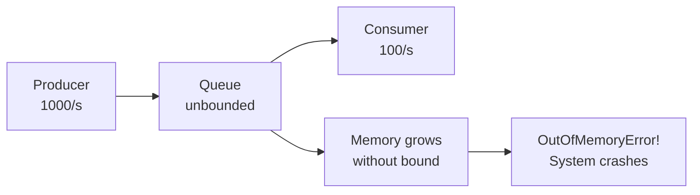
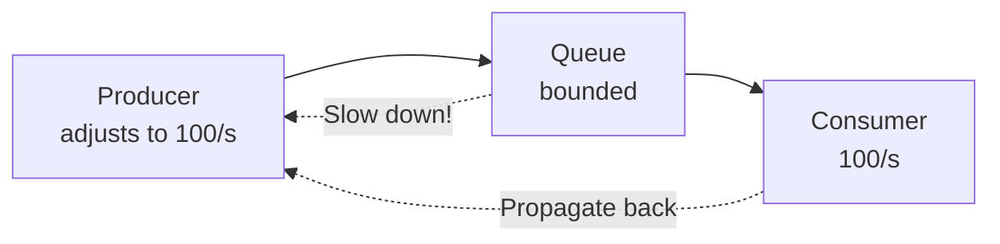
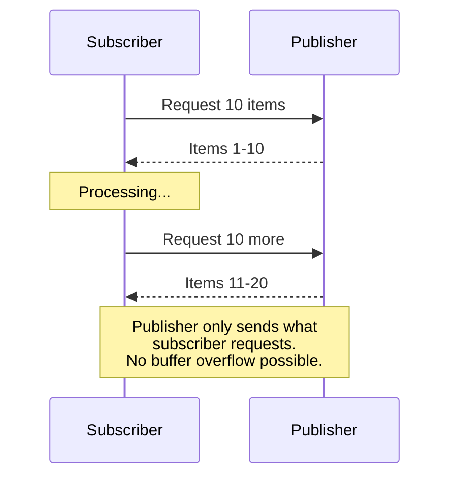

# バックプレッシャー

> **注**: この文書は英語版からの翻訳です。コードブロックおよびMermaidダイアグラムは原文のまま保持しています。

## TL;DR

バックプレッシャーは、ダウンストリームコンポーネントが受信データに追いつけない場合に、アップストリームコンポーネントに速度を落とすよう信号を送るフロー制御メカニズムです。無制限にバッファリングする（メモリ枯渇につながる）代わりに、またはデータを暗黙的にドロップする代わりに、バックプレッシャーはシステム全体に負荷情報を伝播するフィードバックループを作成し、プロデューサーがレートを調整できるようにします。

---

## なぜバックプレッシャーが必要なのか？

バックプレッシャーなしの場合:



バックプレッシャーありの場合:



メモリは制限内に収まり、システムは安定を維持します。

---

## バックプレッシャー戦略

### 1. ブロッキング（同期）

```python
import queue
import threading
from typing import TypeVar, Generic

T = TypeVar('T')

class BlockingQueue(Generic[T]):
    """
    Bounded queue that blocks producers when full.
    Simplest form of backpressure.
    """
    def __init__(self, max_size: int):
        self.queue = queue.Queue(maxsize=max_size)

    def put(self, item: T, timeout: float = None) -> bool:
        """
        Block until space available.
        Returns False if timeout expires.
        """
        try:
            self.queue.put(item, block=True, timeout=timeout)
            return True
        except queue.Full:
            return False

    def get(self, timeout: float = None) -> T:
        """Block until item available."""
        return self.queue.get(block=True, timeout=timeout)

    @property
    def size(self) -> int:
        return self.queue.qsize()

    @property
    def is_full(self) -> bool:
        return self.queue.full()

# Usage
buffer = BlockingQueue[dict](max_size=1000)

def producer():
    while True:
        data = fetch_data()
        # Producer blocks here when queue is full
        # This is backpressure in action
        buffer.put(data)

def consumer():
    while True:
        data = buffer.get()
        process_slowly(data)  # Takes time
```

```
Blocking Backpressure Timeline:

Time ─────────────────────────────────────────────────────────►

Producer: [produce][produce][produce][BLOCKED........][produce]
                                          ▲
                                          │
Queue:    [--][███][█████████████████████████][████████]
                                          │
                                          Queue full!
                                          │
Consumer: [---][consume][consume][consume][consume][consume]
```

### 2. ドロッピング（損失許容）

```python
from enum import Enum
from typing import Optional
from collections import deque

class DropPolicy(Enum):
    DROP_OLDEST = "drop_oldest"   # Drop front of queue
    DROP_NEWEST = "drop_newest"   # Drop incoming item
    DROP_RANDOM = "drop_random"   # Drop random item

class DroppingQueue(Generic[T]):
    """
    Bounded queue that drops items when full.
    Good when recent data is more important.
    """
    def __init__(self, max_size: int, policy: DropPolicy = DropPolicy.DROP_OLDEST):
        self.max_size = max_size
        self.policy = policy
        self.queue = deque(maxlen=max_size if policy == DropPolicy.DROP_OLDEST else None)
        self.dropped_count = 0
        self.lock = threading.Lock()

    def put(self, item: T) -> Optional[T]:
        """
        Add item to queue.
        Returns dropped item if any.
        """
        with self.lock:
            if self.policy == DropPolicy.DROP_OLDEST:
                if len(self.queue) >= self.max_size:
                    dropped = self.queue.popleft()
                    self.dropped_count += 1
                    self.queue.append(item)
                    return dropped
                self.queue.append(item)
                return None

            elif self.policy == DropPolicy.DROP_NEWEST:
                if len(self.queue) >= self.max_size:
                    self.dropped_count += 1
                    return item  # Drop incoming
                self.queue.append(item)
                return None

    def get(self) -> Optional[T]:
        with self.lock:
            if self.queue:
                return self.queue.popleft()
            return None

# Example: Live metrics - old data less valuable
metrics_queue = DroppingQueue[dict](
    max_size=10000,
    policy=DropPolicy.DROP_OLDEST
)

def emit_metric(metric: dict):
    dropped = metrics_queue.put(metric)
    if dropped:
        # Optionally log dropped data
        logger.debug(f"Dropped old metric: {dropped['timestamp']}")
```

### 3. サンプリング

```python
import random
import time
from dataclasses import dataclass
from typing import Callable

@dataclass
class SamplingConfig:
    base_rate: float = 1.0        # 100% at low load
    min_rate: float = 0.01        # Never below 1%
    load_threshold: float = 0.8   # Start sampling above 80% load

class AdaptiveSampler:
    """
    Reduce sampling rate based on load.
    Good for metrics, logs, or analytics.
    """
    def __init__(self, config: SamplingConfig):
        self.config = config
        self.current_rate = config.base_rate
        self.queue_size = 0
        self.max_queue_size = 10000

    def update_load(self, queue_size: int, max_size: int):
        """Adjust sampling rate based on queue fill level"""
        self.queue_size = queue_size
        self.max_queue_size = max_size

        load = queue_size / max_size

        if load < self.config.load_threshold:
            self.current_rate = self.config.base_rate
        else:
            # Linear reduction from base_rate to min_rate
            excess_load = (load - self.config.load_threshold) / (1 - self.config.load_threshold)
            self.current_rate = max(
                self.config.min_rate,
                self.config.base_rate * (1 - excess_load)
            )

    def should_sample(self) -> bool:
        """Probabilistically decide whether to sample this item"""
        return random.random() < self.current_rate

    def sample(self, item: T, process: Callable[[T], None]):
        if self.should_sample():
            process(item)

# Usage: Trace sampling under load
sampler = AdaptiveSampler(SamplingConfig(
    base_rate=1.0,    # Sample 100% normally
    min_rate=0.001,   # Sample 0.1% under extreme load
    load_threshold=0.7
))

def process_trace(trace: dict):
    if sampler.should_sample():
        send_to_tracing_backend(trace)
```

```
Adaptive Sampling:

Queue Load:    0%      50%      70%      90%      100%
               │        │        │        │        │
Sample Rate: 100%     100%      50%      10%       1%
               │        │        │        │        │
               └────────┴────────┴────────┴────────┘
                   Normal     │  Degraded Operation
                  Operation   │
```

### 4. リアクティブストリーム（プルベース）

```python
from abc import ABC, abstractmethod
from typing import TypeVar, Generic
import asyncio

T = TypeVar('T')

class Publisher(ABC, Generic[T]):
    """Reactive streams publisher"""
    @abstractmethod
    def subscribe(self, subscriber: 'Subscriber[T]'):
        pass

class Subscriber(ABC, Generic[T]):
    """Reactive streams subscriber"""
    @abstractmethod
    def on_subscribe(self, subscription: 'Subscription'):
        pass

    @abstractmethod
    def on_next(self, item: T):
        pass

    @abstractmethod
    def on_error(self, error: Exception):
        pass

    @abstractmethod
    def on_complete(self):
        pass

class Subscription(ABC):
    """Reactive streams subscription"""
    @abstractmethod
    def request(self, n: int):
        """Request n more items (pull-based backpressure)"""
        pass

    @abstractmethod
    def cancel(self):
        pass

# Implementation
class BufferedPublisher(Publisher[T]):
    def __init__(self, source: asyncio.Queue):
        self.source = source
        self.subscribers = []

    def subscribe(self, subscriber: Subscriber[T]):
        subscription = BufferedSubscription(self.source, subscriber)
        self.subscribers.append(subscription)
        subscriber.on_subscribe(subscription)

class BufferedSubscription(Subscription):
    def __init__(self, source: asyncio.Queue, subscriber: Subscriber):
        self.source = source
        self.subscriber = subscriber
        self.requested = 0
        self.cancelled = False
        self._task = None

    def request(self, n: int):
        """Subscriber requests n more items"""
        self.requested += n
        if self._task is None:
            self._task = asyncio.create_task(self._emit_loop())

    async def _emit_loop(self):
        while not self.cancelled and self.requested > 0:
            try:
                # Only fetch when there's demand
                item = await asyncio.wait_for(
                    self.source.get(),
                    timeout=1.0
                )
                self.requested -= 1
                self.subscriber.on_next(item)
            except asyncio.TimeoutError:
                continue
            except Exception as e:
                self.subscriber.on_error(e)
                break

        self._task = None

    def cancel(self):
        self.cancelled = True

# Usage
class ProcessingSubscriber(Subscriber[dict]):
    def __init__(self, batch_size: int = 10):
        self.batch_size = batch_size
        self.subscription = None
        self.buffer = []

    def on_subscribe(self, subscription: Subscription):
        self.subscription = subscription
        # Request initial batch
        subscription.request(self.batch_size)

    def on_next(self, item: dict):
        self.buffer.append(item)

        if len(self.buffer) >= self.batch_size:
            self._process_batch()
            # Request more only after processing
            self.subscription.request(self.batch_size)

    def _process_batch(self):
        # Process items
        for item in self.buffer:
            process(item)
        self.buffer.clear()
```



---

## メッセージキューにおけるバックプレッシャー

### Kafka コンシューマーのバックプレッシャー

```python
from kafka import KafkaConsumer
from kafka.structs import TopicPartition
import time

class BackpressuredKafkaConsumer:
    """
    Kafka consumer with backpressure handling.
    """
    def __init__(
        self,
        topic: str,
        group_id: str,
        max_poll_records: int = 500,
        max_poll_interval_ms: int = 300000,
        processing_threshold: float = 0.8
    ):
        self.consumer = KafkaConsumer(
            topic,
            group_id=group_id,
            # Limit records per poll (built-in backpressure)
            max_poll_records=max_poll_records,
            # Allow time for slow processing
            max_poll_interval_ms=max_poll_interval_ms,
            enable_auto_commit=False
        )
        self.processing_threshold = processing_threshold
        self.current_batch_size = max_poll_records
        self.min_batch_size = 10

    def consume_with_backpressure(self, process_batch: callable):
        while True:
            start_time = time.time()

            # Poll with current batch size
            records = self.consumer.poll(
                timeout_ms=1000,
                max_records=self.current_batch_size
            )

            if not records:
                continue

            # Process records
            for tp, messages in records.items():
                for message in messages:
                    process_batch(message)

            # Commit after processing
            self.consumer.commit()

            # Adjust batch size based on processing time
            processing_time = time.time() - start_time
            self._adjust_batch_size(processing_time, len(records))

    def _adjust_batch_size(self, processing_time: float, record_count: int):
        """Adaptive batch sizing based on processing speed"""
        # Target: process within 80% of max_poll_interval
        target_time = (self.consumer.config['max_poll_interval_ms'] / 1000) * self.processing_threshold

        if processing_time > target_time:
            # Too slow - reduce batch size
            self.current_batch_size = max(
                self.min_batch_size,
                int(self.current_batch_size * 0.8)
            )
            print(f"Reducing batch size to {self.current_batch_size}")
        elif processing_time < target_time * 0.5 and record_count == self.current_batch_size:
            # Fast processing - can increase batch size
            self.current_batch_size = min(
                self.consumer.config['max_poll_records'],
                int(self.current_batch_size * 1.2)
            )
```

### RabbitMQ プリフェッチ

```python
import pika
from typing import Callable

class BackpressuredRabbitConsumer:
    """
    RabbitMQ consumer using prefetch for backpressure.
    """
    def __init__(
        self,
        queue_name: str,
        prefetch_count: int = 10
    ):
        self.connection = pika.BlockingConnection(
            pika.ConnectionParameters('localhost')
        )
        self.channel = self.connection.channel()
        self.queue_name = queue_name

        # Prefetch limits unacked messages
        # This is RabbitMQ's backpressure mechanism
        self.channel.basic_qos(prefetch_count=prefetch_count)

    def consume(self, callback: Callable):
        """
        Consume with backpressure.
        Only receives prefetch_count messages at a time.
        Must ack before receiving more.
        """
        def on_message(channel, method, properties, body):
            try:
                callback(body)
                # Ack releases slot for next message
                channel.basic_ack(delivery_tag=method.delivery_tag)
            except Exception as e:
                # Nack and requeue on failure
                channel.basic_nack(
                    delivery_tag=method.delivery_tag,
                    requeue=True
                )

        self.channel.basic_consume(
            queue=self.queue_name,
            on_message_callback=on_message
        )

        self.channel.start_consuming()

# Visualization
"""
Prefetch = 3:

RabbitMQ Queue: [1][2][3][4][5][6][7][8][9][10]...
                 │  │  │
                 └──┴──┴──► Consumer (processing 1,2,3)

Consumer acks message 1:

RabbitMQ Queue: [4][5][6][7][8][9][10]...
                 │  │  │
                 └──┴──┴──► Consumer (now has 2,3,4)

Always exactly prefetch_count in-flight
"""
```

---

## HTTPバックプレッシャー

### サーバーサイドスロットリング

```python
from flask import Flask, request, jsonify
from functools import wraps
import time
import threading

app = Flask(__name__)

class LoadBasedThrottler:
    """Throttle requests based on server load"""

    def __init__(
        self,
        max_concurrent: int = 100,
        queue_size: int = 500,
        load_shed_threshold: float = 0.9
    ):
        self.max_concurrent = max_concurrent
        self.queue_size = queue_size
        self.load_shed_threshold = load_shed_threshold

        self.active_requests = 0
        self.queued_requests = 0
        self.lock = threading.Lock()

    def acquire(self, timeout: float = 30.0) -> bool:
        """Try to acquire a request slot"""
        deadline = time.time() + timeout

        while time.time() < deadline:
            with self.lock:
                # Check if we should shed load
                load = self.active_requests / self.max_concurrent
                if load >= self.load_shed_threshold and self.queued_requests > 0:
                    return False  # Shed load

                if self.active_requests < self.max_concurrent:
                    self.active_requests += 1
                    return True

                if self.queued_requests < self.queue_size:
                    self.queued_requests += 1
                else:
                    return False  # Queue full

            time.sleep(0.01)  # Wait for slot

            with self.lock:
                self.queued_requests -= 1

        return False

    def release(self):
        """Release a request slot"""
        with self.lock:
            self.active_requests -= 1

    def get_stats(self) -> dict:
        with self.lock:
            return {
                'active': self.active_requests,
                'queued': self.queued_requests,
                'max_concurrent': self.max_concurrent,
                'load': self.active_requests / self.max_concurrent
            }

throttler = LoadBasedThrottler()

def with_backpressure(f):
    @wraps(f)
    def wrapper(*args, **kwargs):
        if not throttler.acquire(timeout=30.0):
            return jsonify({
                'error': 'Service overloaded',
                'retry_after': 5
            }), 503, {'Retry-After': '5'}

        try:
            return f(*args, **kwargs)
        finally:
            throttler.release()

    return wrapper

@app.route('/api/heavy-operation', methods=['POST'])
@with_backpressure
def heavy_operation():
    # Simulate heavy processing
    time.sleep(2)
    return jsonify({'status': 'success'})

@app.route('/health/load')
def load_health():
    stats = throttler.get_stats()
    status_code = 200 if stats['load'] < 0.8 else 503
    return jsonify(stats), status_code
```

### クライアントサイドレスポンス

```python
import requests
import time
from typing import Optional, Callable
import random

class BackpressureAwareClient:
    """HTTP client that respects server backpressure signals"""

    def __init__(
        self,
        base_url: str,
        max_retries: int = 5,
        base_delay: float = 1.0,
        max_delay: float = 60.0
    ):
        self.base_url = base_url
        self.max_retries = max_retries
        self.base_delay = base_delay
        self.max_delay = max_delay
        self.session = requests.Session()

    def request(
        self,
        method: str,
        path: str,
        **kwargs
    ) -> requests.Response:
        """Make request with exponential backoff on 429/503"""

        for attempt in range(self.max_retries):
            try:
                response = self.session.request(
                    method,
                    f"{self.base_url}{path}",
                    **kwargs
                )

                if response.status_code == 429 or response.status_code == 503:
                    # Server is telling us to back off
                    retry_after = self._get_retry_after(response)
                    delay = retry_after or self._calculate_backoff(attempt)

                    print(f"Server backpressure: waiting {delay:.1f}s (attempt {attempt + 1})")
                    time.sleep(delay)
                    continue

                return response

            except requests.exceptions.ConnectionError:
                # Server might be overloaded
                delay = self._calculate_backoff(attempt)
                time.sleep(delay)

        raise MaxRetriesExceeded(f"Failed after {self.max_retries} attempts")

    def _get_retry_after(self, response: requests.Response) -> Optional[float]:
        """Parse Retry-After header"""
        retry_after = response.headers.get('Retry-After')
        if retry_after:
            try:
                return float(retry_after)
            except ValueError:
                pass
        return None

    def _calculate_backoff(self, attempt: int) -> float:
        """Exponential backoff with jitter"""
        delay = self.base_delay * (2 ** attempt)
        delay = min(delay, self.max_delay)
        # Add jitter to prevent thundering herd
        jitter = random.uniform(0, delay * 0.1)
        return delay + jitter

# Usage
client = BackpressureAwareClient("https://api.example.com")
response = client.request("POST", "/api/heavy-operation", json={"data": "..."})
```

---

## ストリーミングバックプレッシャー

### gRPC ストリーミング

```python
import grpc
from concurrent import futures
import queue
import threading

class BackpressuredStreamService(StreamServiceServicer):
    """gRPC service with streaming backpressure"""

    def BidirectionalStream(self, request_iterator, context):
        """
        gRPC streaming with flow control.
        Client controls consumption rate.
        """
        buffer = queue.Queue(maxsize=100)
        producer_done = threading.Event()

        def produce():
            try:
                for request in request_iterator:
                    # Block if buffer is full (backpressure)
                    buffer.put(process_request(request), block=True)
            finally:
                producer_done.set()

        # Start producer thread
        producer = threading.Thread(target=produce)
        producer.start()

        # Yield responses as buffer has items
        while not (producer_done.is_set() and buffer.empty()):
            try:
                response = buffer.get(timeout=0.1)
                yield response
            except queue.Empty:
                continue

        producer.join()

# Client-side flow control
def streaming_client_with_backpressure(stub):
    """Client that controls its consumption rate"""

    def request_generator():
        for i in range(1000):
            yield Request(id=i)
            # Client-side rate limiting
            time.sleep(0.1)  # Don't overwhelm server

    # Process responses at our own pace
    for response in stub.BidirectionalStream(request_generator()):
        process_slowly(response)  # Taking time is OK
        # gRPC handles backpressure via HTTP/2 flow control
```

### 非同期ジェネレーター

```python
import asyncio
from typing import AsyncIterator, TypeVar

T = TypeVar('T')

class BackpressuredPipeline:
    """Async pipeline with built-in backpressure"""

    def __init__(self, buffer_size: int = 10):
        self.buffer_size = buffer_size

    async def produce(self) -> AsyncIterator[dict]:
        """Producer yields items, respecting consumer pace"""
        for i in range(1000):
            data = await fetch_data(i)
            yield data
            # Yielding allows consumer to control pace

    async def transform(
        self,
        source: AsyncIterator[T],
        buffer_size: int = None
    ) -> AsyncIterator[T]:
        """Transform stage with bounded buffer"""
        buffer_size = buffer_size or self.buffer_size
        buffer = asyncio.Queue(maxsize=buffer_size)

        async def fill_buffer():
            async for item in source:
                # Blocks when buffer full (backpressure)
                await buffer.put(item)
            await buffer.put(None)  # Sentinel

        # Start filling buffer
        filler = asyncio.create_task(fill_buffer())

        while True:
            item = await buffer.get()
            if item is None:
                break

            transformed = await process(item)
            yield transformed

        await filler

    async def consume(self, source: AsyncIterator[dict]):
        """Consumer pulls at its own pace"""
        async for item in source:
            await slow_operation(item)

# Usage
async def main():
    pipeline = BackpressuredPipeline(buffer_size=10)

    # Compose pipeline
    source = pipeline.produce()
    transformed = pipeline.transform(source)

    # Consumer controls the pace
    await pipeline.consume(transformed)
```

---

## バックプレッシャーメトリクス

```python
from dataclasses import dataclass
from prometheus_client import Gauge, Counter, Histogram
import time

@dataclass
class BackpressureMetrics:
    queue_size: Gauge
    queue_capacity: Gauge
    items_dropped: Counter
    wait_time: Histogram
    throughput: Gauge

class MonitoredQueue:
    """Queue with backpressure monitoring"""

    def __init__(self, name: str, capacity: int):
        self.name = name
        self.capacity = capacity
        self.queue = asyncio.Queue(maxsize=capacity)

        # Metrics
        self.metrics = BackpressureMetrics(
            queue_size=Gauge(
                f'{name}_queue_size',
                'Current queue size'
            ),
            queue_capacity=Gauge(
                f'{name}_queue_capacity',
                'Queue capacity'
            ),
            items_dropped=Counter(
                f'{name}_items_dropped_total',
                'Items dropped due to backpressure'
            ),
            wait_time=Histogram(
                f'{name}_put_wait_seconds',
                'Time waiting to put items',
                buckets=[0.001, 0.01, 0.1, 1, 10, 60]
            ),
            throughput=Gauge(
                f'{name}_throughput_per_second',
                'Current throughput'
            )
        )

        self.metrics.queue_capacity.set(capacity)
        self._last_count = 0
        self._last_time = time.time()

    async def put(self, item, timeout: float = None) -> bool:
        start = time.time()

        try:
            if timeout:
                await asyncio.wait_for(
                    self.queue.put(item),
                    timeout=timeout
                )
            else:
                await self.queue.put(item)

            wait_time = time.time() - start
            self.metrics.wait_time.observe(wait_time)
            self.metrics.queue_size.set(self.queue.qsize())
            return True

        except asyncio.TimeoutError:
            self.metrics.items_dropped.inc()
            return False

    async def get(self):
        item = await self.queue.get()
        self.metrics.queue_size.set(self.queue.qsize())
        self._update_throughput()
        return item

    def _update_throughput(self):
        now = time.time()
        elapsed = now - self._last_time
        if elapsed >= 1.0:
            throughput = (self.queue.qsize() - self._last_count) / elapsed
            self.metrics.throughput.set(throughput)
            self._last_count = self.queue.qsize()
            self._last_time = now
```

---

## 重要なポイント

1. **制限付きキューは不可欠**: 無制限キューはOOMまで問題を隠蔽します。制限付きキューはバックプレッシャーを明示的にします

2. **適切な戦略を選択する**: 正確性にはブロッキング、可用性にはドロッピング、可観測性にはサンプリングを使用してください

3. **バックプレッシャーを伝播する**: 一つのレイヤーで圧力を吸収するのではなく、ソースまで伝播してください

4. **キューの深さを監視する**: キューサイズはキャパシティの問題に対する早期警告信号です

5. **プッシュよりプルを優先する**: プルベースシステム（リアクティブストリーム）はバックプレッシャーを自然なものにします

6. **クライアントの協力**: クライアントは429/503レスポンスを尊重し、指数バックオフを実装すべきです

7. **適応的な動作**: 観測された負荷に基づいて、バッチサイズ、サンプリングレート、並行性を調整してください
