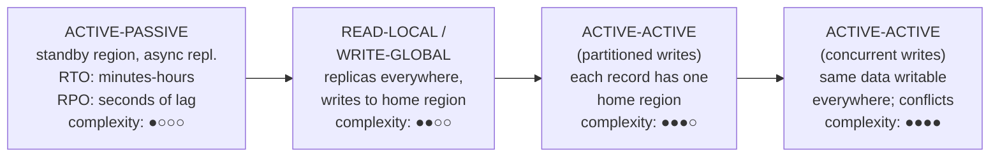
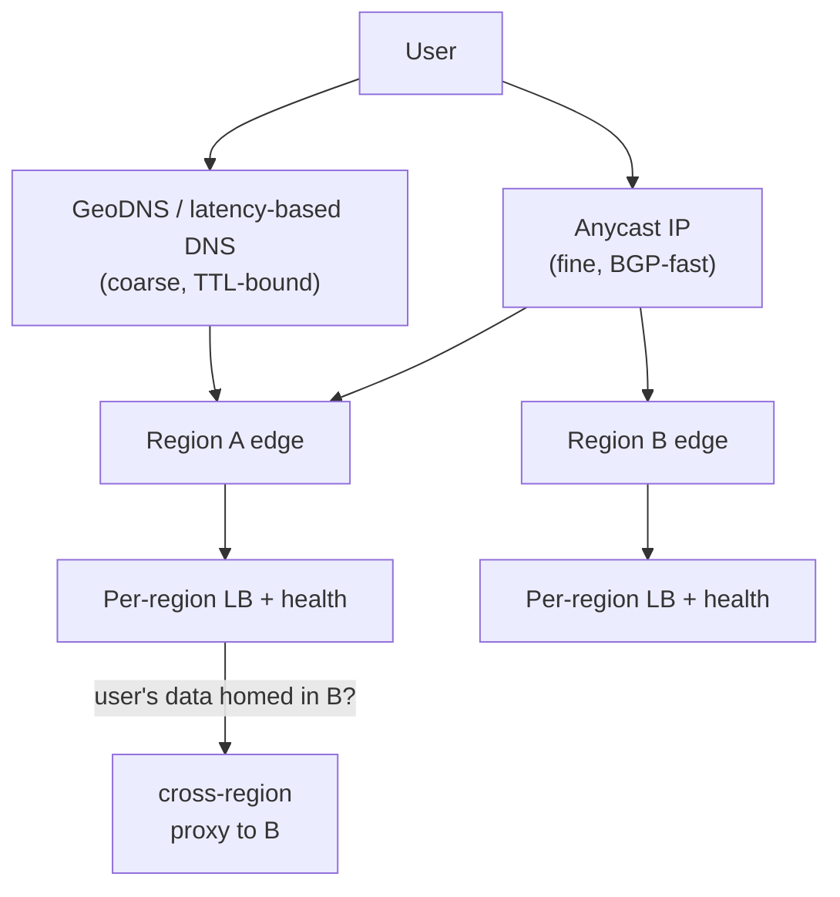

# マルチリージョンアーキテクチャ

> **翻訳についての注記:** 本ドキュメントは英語原文 `06-scaling/09-multi-region-architecture.md` を日本語に翻訳したものです。コードブロックおよびMermaidダイアグラムは原文のまま維持しています。

## TL;DR

マルチリージョンが買うものは3つ — レイテンシの近接性、リージョン規模の障害からの生存、データレジデンシ(所在地)コンプライアンス — そして支払いは物理学が受け取る唯一の通貨で行われます: 大陸間の同期レプリケーションと低レイテンシ書き込みは両立しません(US東↔EUで往復約80ms、US↔APACで150ms以上)。システムごとに姿勢を選びます: **アクティブ-パッシブ**(一方が処理、他方が待機)、**読み取りローカル/書き込みグローバル**(読み取りは各地、書き込みはホームリージョン)、**アクティブ-アクティブ**(各地で書き込み、競合を管理)。コンピュート層は簡単な方で、データ層がすべてを決めます。フェイルオーバーはプロダクト機能として設計してください — 静的安定性、キャパシティの余裕、訓練済みのRunbook。テストされていないフェイルオーバー計画は、ダッシュボード付きのフィクションです。

---

## なぜマルチリージョンか(そして、なぜやらないか)

| 動機 | 実際に必要になるもの |
|---|---|
| **レイテンシ** — 3大陸のユーザー | ユーザー近傍のリードレプリカか完全なアクティブ-アクティブ。CDNが既に8割を解決していることも([CDNアーキテクチャ](./04-cdn-architecture.md)) |
| **生存性** — リージョン障害 ≠ プロダクト停止 | *キャパシティ・データ・テスト済みの昇格手順*を備えた第2リージョン |
| **レジデンシ** — EUデータはEU内に | 司法管轄によるデータ分割 — レプリケーションというより*シャーディング*の問題 |

正直なカウンターウェイト: マルチリージョンはインフラコストを倍増させ(1.8〜2.5倍が典型)、すべてのデータ設計を整合性の意思決定に変え、シングルリージョンでは決して見ない障害モード(スプリットブレイン、フェイルオーバー中のレプリケーション遅延、リージョン間の設定ドリフト)を追加します。マルチAZの冗長化を持つ単一リージョンは、すでにマシン障害とデータセンター障害を生き延びます。多くのビジネスの実際の可用性ニーズはそこで止まります。名前を言える理由のためにマルチリージョン化し、その理由が当てはまるシステムだけに適用してください — 典型的な最終形は、ステートレスなエッジはアクティブ-アクティブ、プロダクトのデータベースは読み取りローカル、1時間消えても誰も困らない管理ツールはシングルリージョン、です。

### 物理の表

往復時間が同期の選択肢を縛ります:

| 経路 | RTT (典型値) | 同期書き込みのコスト |
|---|---|---|
| 同一AZ | < 1 ms | 無料 — 常にやる |
| 同一リージョン内クロスAZ | 1–2 ms | 安い — 標準のHA |
| US東 ↔ US西 | ~60–70 ms | すべての書き込みで体感 |
| US東 ↔ 欧州 | ~80–90 ms | ユーザーに見える |
| US ↔ アジア太平洋 | 150–250 ms | 対話的な書き込みには禁止的 |

3大陸にまたがるクォーラムは、すべてのコミットに大陸間RTTを入れます。これをやるシステム(Spanner型 — [Spanner](../09-whitepapers/04-spanner.md)参照)は意図的にそれを受け入れ、可能な限りクォーラムが地域内で閉じるようレプリカを配置します。それ以外の全員は非同期レプリケーションを選び、その帰結に向き合います: **RPO > 0** — 飛行中に失われたリージョンは、未レプリケートの末尾を失います。

---

## 姿勢のスペクトラム

**アクティブ-パッシブ。** 全トラフィックをプライマリリージョンへ。セカンダリは非同期レプリケーションを受けて待機します(またはバッチ/BC作業のみ)。メンタルモデルは最も安価ですが、罠はパッシブリージョンの腐敗です — テストされないキャパシティ、古い設定、期限切れの資格情報。これを選ぶなら、スタンバイは定期的に実トラフィックを受けなければなりません(ゲームデーか、恒常的な小さいトラフィックスライス)。さもなければ、昇格されたまさにその瞬間に壊れます。

**読み取りローカル/書き込みグローバル。** 各リージョンのレプリカが読み取りを処理し、書き込みはホームリージョンへルーティング。読み取り過多のプロダクトでは読み取りレイテンシの勝利。書き込みは1回のクロスリージョンホップを払います。罠は**read-your-writes**: 書いた(ホームリージョン)直後に読む(ローカルレプリカ)ユーザーには時間が逆行して見えます。対策: 書き込み後一定時間ホームリージョンへのセッション固定、レプリカ遅延を考慮したルーティング、因果トークン([整合性モデル](../01-foundations/04-consistency-models.md))。

**アクティブ-アクティブ(パーティション書き込み)。** すべてのリージョンが書き込みを受けます — ただし各*レコード*のホームリージョンは1つ(EUユーザーのデータはEUにホーム、等)。キーごとのシングルライター所有により、構造上書き込み競合がありません([パーティショニング戦略](../02-distributed-databases/05-partitioning-strategies.md))。グローバルなコンシューマ向けプロダクトの主力姿勢で、レジデンシを一級の性質にします: パーティションキーに司法管轄が含まれます。コスト: クロスパーティション操作は分散ワークフローになり([Saga](../05-messaging/09-saga-pattern.md))、レコードの*ホーム移動*(ユーザーの大陸移住)はUPDATEではなくマイグレーションです。

**アクティブ-アクティブ(同時書き込み)。** 同一レコードが複数リージョンで同時に書き込み可能 — 競合解決を伴うマルチリーダーレプリケーションです: last-writer-wins(クロックスキュー下で静かなデータ喪失)、CRDT(集合/カウンタ/レジスタ型のデータ向け)、アプリケーションのマージロジック([マルチリーダーレプリケーション](../02-distributed-databases/02-multi-leader-replication.md)、[競合解決](../02-distributed-databases/04-conflict-resolution.md))。競合が稀か、マージが自然なデータ(カート、いいね、プレゼンス)に限定してください。台帳と在庫はここに属しません。

---

## ユーザーのルーティング

- **GeoDNS / レイテンシベースDNS**はシンプルですが、リゾルバのTTL遵守に縛られます — TTL=60でも数分の古いルーティングを想定してください。リゾルバもデバイスもTTLを超えてキャッシュします。
- **Anycast**(全リージョンから同一IPを広告)はBGP経由で数秒で収束し、CDNとモダンなエッジの誘導方法です。*どの*リージョンに着くかの精密な制御は手放すので、エッジは「間違ったリージョン」への到着を処理できなければなりません。
- **エッジはプロキシし、データはホームに留まる:** データがリージョンBにホームされているリクエストがリージョンAに着いたら、TLSを終端し、静的/キャッシュ可能な部分はローカルで返し、データ操作はBへプロキシします。サーバー側のクリーンな1ホップは、ユーザーのブラウザが大陸間TLSハンドシェイクをするより優れています。
- **セッション状態をリージョンから出す**(サーバーセッションではなく署名付きトークン)ことで、どのリージョンも即座に任意のユーザーを認証できます — フェイルオーバーの前提条件です。

---

## フェイルオーバーエンジニアリング

フェイルオーバーは、マルチリージョン投資の勝敗が決まる場所です。図面と動く設計を分ける原則:

**静的安定性。** 生き残ったリージョンは、フェイルオーバー時に*新しい*キャパシティも、設定プッシュも、コントロールプレーン操作も必要としてはなりません — リージョン障害の瞬間こそ、プロビジョニングAPIが劣化し、人間がパニックしている時間だからです。余裕を事前確保する: 2リージョン設計では各リージョンの稼働率を50%以下に(さもなくばフェイルオーバー時のブラウンアウト/負荷削減を受け入れる)。3リージョンなら66%以下。予約していないキャパシティは、午前3時には存在しないキャパシティです。

**誰が決めるかを決める。** スプリットブレイン — 両リージョンが自分をプライマリと信じる状態 — はダウンタイムより速くデータを破壊します。昇格は直列化ポイントを通らなければなりません: 3つ以上の障害ドメインにまたがるコンセンサス裏付けのコントロールプレーンか、明示的な人間の2人ルール。降格された旧プライマリはフェンスする(書き込み資格情報の失効、ストレージ層のフェンシングトークン — [分散ロック](../01-foundations/09-distributed-locks.md))ことで、フェイルオーバー中に蘇った「死んだ」リージョンが書き込み続けられないようにします。

**RPOにアプリケーション層で向き合う。** 非同期レプリケーションでは昇格は末尾(数秒分の書き込み)を失います。それらがどうなるかを*事前に*決めてください: ログから照合? イベントストアからリプレイ? 謝罪? 金銭に近いデータでは、リージョン非同期レプリケーションに加えて、耐久性のあるクロスリージョンの意図ログ([アウトボックス](../05-messaging/07-outbox-pattern.md))を併用し、データベースの末尾が失われても末尾を回復可能にします。

**フェイルバックは意図的に。** 元のリージョンは分岐したデータと冷えたキャッシュとともに戻ってきます。フェイルバックは第二のフェイルオーバーです — スケジュールして実施し、DNSの偶然に起こさせないこと。

**訓練する。** 実トラフィックでの四半期ごとのリージョン避難が、計画が機能する唯一の証拠です。time-to-healthyを*プロセスの*SLOとして追跡します([SLOとエラーバジェット](../11-observability/05-slos-error-budgets.md))。訓練するチームは期限切れ証明書、ハードコードされたリージョン名、スタンバイ内のシングルトンcronを発見します。訓練しないチームはそれらを本番障害の最中に発見します。

### フェイルオーバー判断表

| 障害の範囲 | アクション | 典型的RTO |
|---|---|---|
| 1 AZ | 何もしない — マルチAZが吸収 | 0 |
| リージョン劣化(エラー率上昇) | トラフィックを徐々に退避。ストレージはまだ昇格しない | 数分 |
| リージョン完全停止 | ストレージ昇格、全トラフィック切替、旧プライマリをフェンス | 数分〜1時間(訓練済み) |
| RPO許容を超える停止 | 昇格 + 失われた末尾の照合プレイブック実行 | 数時間 |

---

## アーキテクチャとしてのデータレジデンシ

レジデンシ(GDPR系の規制、業種規制)は通常の目標を反転させます: データは自由にレプリケートされては**ならない**。司法管轄をシャード次元として扱います:

- ユーザーデータをホーム司法管轄でパーティションし、パーティションマップ自体(小さく、非個人情報)はグローバルにレプリケートして、どのリージョンでも*ルーティング*できるようにします。
- 派生データフロー(分析、検索インデックス、ML訓練、バックアップ、PIIを含むログ)は制約を継承します — 漏れるのはプライマリデータベースではなく、ロギングパイプラインとウェアハウスです。すべての下流コピーを棚卸ししてください([チェンジデータキャプチャ](../13-data-pipelines/04-change-data-capture.md)のパイプラインを含む)。
- 司法管轄をまたぐ機能(EUユーザーがUSユーザーにメッセージ)には、境界を越えるものについての明示的なデータ契約が必要です — 通常は完全なレコードではなく、参照と最小限のプロジェクションです。

---

## チェックリスト

- [ ] 姿勢はデータクラスごとに選択(全社で1つの姿勢ではない)、理由を文書化
- [ ] RPO/RTOをシステムごとに明記。RPO > 0の箇所は失われた末尾の照合手順を定義
- [ ] read-your-writesに対処(固定、遅延考慮ルーティング、因果トークン)
- [ ] 静的安定性: 生存リージョンが事前確保した余裕でフェイルオーバー負荷を吸収
- [ ] 昇格は直列化(コンセンサスか2人ルール)。旧プライマリはフェンス
- [ ] セッションはリージョン非依存。シークレット/設定はレプリケートされドリフト検査される
- [ ] シングルトンワークロード(cron、スケジューラ、キューコンシューマ)にクロスリージョンのリーダーシップ設計がある
- [ ] レジデンシ対象データは*すべての*下流コピーまで棚卸し済み
- [ ] リージョン避難をカレンダーで訓練し、time-to-healthyを追跡
- [ ] コストをレビュー: クロスリージョンegressと待機余裕は経常費目であり、驚きではない

---

## 参考文献

- [AWS Multi-Region Fundamentals](https://docs.aws.amazon.com/whitepapers/latest/aws-multi-region-fundamentals/aws-multi-region-fundamentals.html) — 姿勢、静的安定性、コントロールプレーン依存
- [Static stability using Availability Zones](https://aws.amazon.com/builders-library/static-stability-using-availability-zones/) — Amazon Builders' Library; 概念はリージョンに一般化する
- [Spanner: Google's Globally-Distributed Database](https://research.google/pubs/pub39966/) — スペクトラムの同期グローバルコンセンサス側
- [DynamoDB Global Tables](https://docs.aws.amazon.com/amazondynamodb/latest/developerguide/GlobalTables.html) — LWW競合解決のマネージドマルチリーダー; 注意書きを読むこと
- [Challenges with distributed systems](https://aws.amazon.com/builders-library/challenges-with-distributed-systems/) — Amazon Builders' Library
- *Designing Data-Intensive Applications*, ch. 5 — レプリケーショントポロジとその異常
