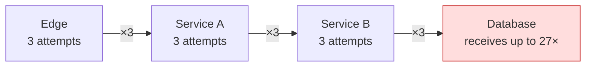
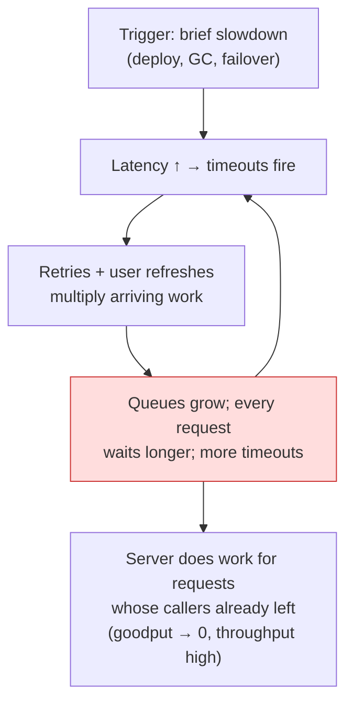

# リトライ・タイムアウト・ヘッジング

> **翻訳についての注記:** 本ドキュメントは英語原文 `06-scaling/10-retries-timeouts-hedging.md` を日本語に翻訳したものです。コードブロックおよびMermaidダイアグラムは原文のまま維持しています。

## TL;DR

タイムアウト、リトライ、ヘッジングは分散システムで最も多くデプロイされる信頼性パターンです — そして設定を誤ったリトライは、システムが自滅する最も一般的な方法でもあります。タイムアウトは実測レイテンシのパーセンタイルから設定し、**デッドライン**をエンドツーエンドで伝播させます。リトライは冪等な操作に限り、**指数バックオフ+フルジッター**、**試行回数の上限**、そしてシステムが不調なときにリトライを自動停止する**リトライバジェット**とともに行います — さもなければ、キャパシティが最も乏しいまさにそのときにリトライが負荷を増幅し、リトライストームと、トリガーが消えた後も持続する**メタステーブル障害**を生みます。ヘッジング(約p95経過後にバックアップリクエストを送る)は、数%の追加負荷で冪等な読み取りのテールレイテンシを削ります。防御は層で重ねます: デッドラインが待ち時間を、バジェットが増幅を抑え、サーキットブレーカーが出血を止め、ロードシェディングがグッドプットを守ります。

---

## タイムアウト: 待ち時間に上限を

すべてのリモート呼び出しにはタイムアウトが必要です。問題はそれを自分で選んだか、デフォルト(しばしば無限か30秒 — どちらも間違い)を継承したかだけです。タイムアウトのない呼び出しは、スタックしたスレッドと満杯のコネクションプールとして蓄積し、1つの遅い依存先をあなたの障害に変換します。

**タイムアウトは雰囲気ではなくデータから。** 依存先の実測p99.9+マージンから始めます。p99未満のタイムアウトは1%の失敗をあなたが*作り出し*、p99の10倍のタイムアウトは無意味に待ちます。フェーズを分けること — 接続タイムアウト(短く: 約1秒。失敗は速く明瞭)とリクエストタイムアウト(ワークロード形状に従う)。

**タイムアウトを積み上げず、デッドラインを伝播させる。** ホップごとの独立したタイムアウトは支離滅裂に合成されます: 各サービスが10秒ずつ許す構成で10秒のエッジタイムアウトを置けば、下流で作業が続く間にエッジが諦めることが保証されます — 誰も読まないレスポンスのためにキャパシティを燃やしながら。単一の**デッドライン**(絶対時刻または残り予算)を呼び出し連鎖に渡し、各ホップは自分のコストを差し引いて残りを転送し、予算が不足したホップは*即座に*失敗します:

```python
def handle(request, deadline: float):
    remaining = deadline - time.monotonic()
    if remaining < 0.05:                      # not enough budget to do useful work
        raise DeadlineExceeded("gave up before doing work, not after")

    rows = db.query(sql, timeout=min(remaining * 0.6, DB_MAX))
    return enrich(rows, timeout=(deadline - time.monotonic()) * 0.9)
```

gRPCはデッドラインをネイティブに伝播します(`grpc-timeout` ヘッダ)。HTTPでは `x-request-deadline` ヘッダを転送し、尊重します。負荷のかかったシステムができる最も安価な仕事は、早期に断る仕事です。

---

## リトライ: 他人のキャパシティで信頼性を買う

リトライは一時的な失敗を成功に変換します — 追加の負荷を投入することによって。この取引は、失敗が稀でランダムなときには素晴らしく、失敗が過負荷に起因するときには破滅的です。そのときリトライはガソリンだからです。

### 増幅の問題

リトライは**層ごとに**掛け算されます:



3つの無害に見えるリトライポリシーが積み重なって、最下層に27倍の負荷をかけます — それがすでに故障しているまさにそのときに。ここから導かれるルール:

- **リトライは1つの層で**、理想的にはユーザーから失敗を見えなくできる層(通常はクライアントに最も近い層)で行う。内側の層はリトライせず、エラーを速く伝播する。
- **試行回数に上限を**(合計2〜3回。10回ではない)。2回のリトライで直らなかったなら、その失敗は一時的ではありません。
- **コネクションプール枯渇、キュー満杯、429、デッドライン超過ではリトライしない** — それはシステムが過負荷だと伝えています。リトライはそれと口論することです。`Retry-After` があれば尊重します。

### フルジッター付きバックオフ

同期したクライアントが固定スケジュールでリトライすると、波として再来します。指数バックオフは試行を時間方向に、**ジッター**はクライアント間に分散させます。AWSの分析では、*フルジッター*(ウィンドウ全体での一様乱数)が最小の競合でほぼ最良の完了時間に達します:

```python
def backoff_full_jitter(attempt: int, base=0.1, cap=20.0) -> float:
    return random.uniform(0, min(cap, base * 2 ** attempt))
```

### リトライバジェット: リトライのためのサーキットブレーカー

リクエスト単位の上限は*総量*の増幅を抑えません — 全リクエストが2回ずつリトライすれば3倍の負荷です。**リトライバジェット**はそれを抑えます: リトライが総トラフィックの小さな割合(標準的には10〜20%。gRPC/Finagleの方式)である間だけリトライを許可します:

```python
class RetryBudget:
    """Token bucket: deposits on requests, withdrawals on retries."""

    def __init__(self, ratio=0.1, min_per_sec=10):
        self.ratio, self.min_rate = ratio, min_per_sec
        self.tokens = 0.0

    def on_request(self):
        self.tokens = min(self.tokens + self.ratio, 100)

    def can_retry(self) -> bool:
        if self.tokens >= 1:
            self.tokens -= 1
            return True
        return False          # budget exhausted: fail fast, system is sick
```

健全時はすべての一時的なつまずきがリトライされ、インシデント時はシステム全体でリトライが自動停止し、依存先は3倍ではなく約1.1倍の負荷を受けます。この単一の機構が、ほとんどのリトライストームを防ぎます。

### 冪等性は入場券

非冪等な操作のリトライは、顧客が二重課金される方法そのものです。読み取りは自由にリトライ。書き込みは、サーバーが重複排除する冪等性キーがある場合のみリトライします([冪等性](../01-foundations/08-idempotency.md))。「リクエストがタイムアウトした」は実行されなかったことを意味**しません** — あなたが知らないことを意味します。

---

## リトライストームとメタステーブル障害

この記事を必須にする障害モード: システムが過負荷に入り、リトライ(+ユーザーのリロード+ヘルスチェックの追放)が負荷を増幅し、その増幅が**元のトリガーが消えた後も過負荷を持続させる**。システムは悪い均衡にはまります — *メタステーブル障害*です。データベースの短い遅延が数時間の障害になり、誰かが負荷を削るかリトライを切るまで終わりません。



ダッシュボード上の特徴: **スループットは正常か高め、グッドプットはほぼゼロ** — 全員がタイムアウトする仕事で忙しいのです。防御をレバレッジ順に:

1. **リトライバジェット**(上述) — 増幅ループを発生源で断つ。
2. **ロードシェディング/アドミッション制御** — 圧力下では超過分を*入口で*安価な429で拒否し、受け入れたリクエストをきちんと処理する([レートリミット](./05-rate-limiting.md)、[バックプレッシャー](./07-backpressure.md))。キューのLIFO処理も効きます: 最新のリクエストこそ、呼び出し元がまだ待っている可能性が高い。
3. **作業前のデッドライン確認** — 予算が尽きたリクエストは虚空に向けて実行せず破棄する。
4. 溺れる依存先を高速な失敗に変換するバックストップとしての**サーキットブレーカー**([サーキットブレーカー](./06-circuit-breakers.md))。
5. **リトライのオペレーター用キルスイッチ** — 全リトライポリシーをゼロにするランタイムフラグは、それを必要とするインシデントの前に出荷できる最も価値の高い20行の機能のひとつです。

メタステーブル性は明示的にテストしてください: 負荷試験で飽和を超えて押し込み、追加負荷を*取り除き*、システムが自力で回復することを確認する。負荷が下がっても劣化したままのシステムは、本番にもメタステーブル領域を持っています。

---

## ヘッジドリクエスト: 負荷を払ってテールレイテンシを買う

テールレイテンシは稀な遅いレプリカ(GC、キャッシュミス、不良ディスク)に支配されます。リクエストが多数のシャードにファンアウトするとき、最も遅い脚が応答時間を決めます — ファンアウト100では、サーバーのp99レイテンシが*ユーザーの中央値*になります(「The Tail at Scale」)。ヘッジングはこれを攻撃します: リクエストを送り、約p95までに応答がなければ別レプリカに複製を送り、先に来た答えを採用して敗者をキャンセルします。

```python
async def hedged(call, replicas, hedge_after_s):       # hedge_after ≈ live p95
    first = asyncio.create_task(call(replicas[0]))
    done, _ = await asyncio.wait({first}, timeout=hedge_after_s)
    if done:
        return first.result()

    backup = asyncio.create_task(call(replicas[1]))
    done, pending = await asyncio.wait({first, backup},
                                       return_when=asyncio.FIRST_COMPLETED)
    for p in pending:
        p.cancel()                                      # cancellation must propagate!
    return done.pop().result()
```

p95でチューニングすると、ヘッジングは約5%の追加負荷で、読み取りパスのp99レイテンシを日常的に2〜10倍削減します。ルール:

- **冪等で読み取り主体の操作のみ。** ヘッジされた書き込みは重複した書き込みです。
- **遅延後にヘッジする**(p95〜p99)。即時の複製は2倍の負荷でわずかな利得です。
- **キャンセルはエンドツーエンドで機能しなければならない**。さもなければヘッジングは静かにバックエンド負荷を倍にします。
- **過負荷時はヘッジングを無効化**(同じバジェット機構に紐付ける) — 追加負荷は飽和したシステムへの間違った薬です。バリエーション: gRPCは宣言的なヘッジングポリシーをサポートし、「クロスサーバーキャンセル付きバックアップリクエスト」は敗者にキャンセルを送って無駄な仕事をさらに回収します。

---

## まとめて組み立てる

| 防御の層 | 抑えるもの | 機構 |
|---|---|---|
| タイムアウト/デッドライン | 1試行の待ち時間 | パーセンタイル由来、予算の伝播 |
| リトライポリシー | ユーザーが見る失敗 | ≤3試行、バックオフ+フルジッター、冪等のみ |
| リトライバジェット | 総増幅 | 約10%のトークンバケット、システム全体 |
| ヘッジング | テールレイテンシ | p95後のバックアップ、読み取りのみ、キャンセル可能 |
| サーキットブレーカー | 死んだ依存先に費やす時間 | エラー率でトリップ、プローブで回復 |
| ロードシェディング | 過負荷時の被害 | アドミッション制御、LIFO、安価な拒否 |

宣言的な例(Envoy型メッシュ設定)。2026年において、この大半はアプリケーションコードではなくプラットフォーム層に属するからです:

```yaml
route:
  timeout: 2s                      # request deadline at the edge
  retry_policy:
    retry_on: "5xx,reset,connect-failure"
    num_retries: 2
    per_try_timeout: 0.8s
    retry_back_off: { base_interval: 0.1s, max_interval: 2s }
    retry_budget: { budget_percent: 10, min_retry_concurrency: 3 }
  hedge_policy:
    initial_requests: 1
    additional_request_chance: { numerator: 0 }   # enable per-route for hot reads
```

可観測で中央調整可能なプラットフォーム全体の1つのポリシーは、40個の手作りリトライループに勝ります — そしてキルスイッチが無償で付いてきます。

---

## 参考文献

- [The Tail at Scale](https://research.google/pubs/pub40801/) — Dean & Barroso; ヘッジド/タイドリクエスト
- [Exponential Backoff and Jitter](https://aws.amazon.com/blogs/architecture/exponential-backoff-and-jitter/) — AWS; フルジッターの分析
- [Timeouts, retries, and backoff with jitter](https://aws.amazon.com/builders-library/timeouts-retries-and-backoff-with-jitter/) — Amazon Builders' Library
- [Metastable Failures in Distributed Systems](https://sigops.org/s/conferences/hotos/2021/papers/hotos21-s11-bronson.pdf) — Bronson et al., HotOS '21
- [gRPC retry design](https://github.com/grpc/proposal/blob/master/A6-client-retries.md) — 実践のリトライバジェット
- [SRE Book, ch. 21–22](https://sre.google/sre-book/handling-overload/) — 過負荷とカスケード障害への対処
