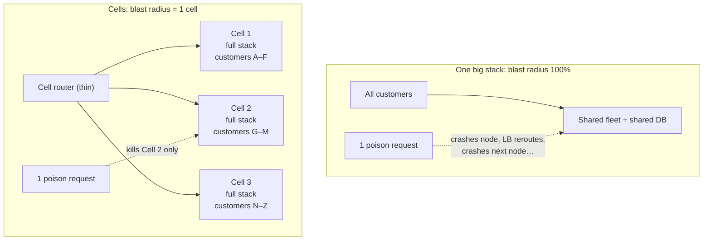
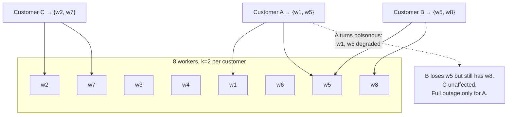

# セルベースアーキテクチャとシャッフルシャーディング

> **翻訳についての注記:** 本ドキュメントは英語原文 `06-scaling/11-cell-based-architecture.md` を日本語に翻訳したものです。コードブロックおよびMermaidダイアグラムは原文のまま維持しています。

## TL;DR

セルベースアーキテクチャは、サービスを**セル** — フルスタックの完全に独立したコピーで、それぞれが固定された顧客のスライスを担当する — に分割することで爆発半径に上限を設けます。障害、ポイズンピルなリクエスト、不正なデータ状態は、全員ではなく1セル分の顧客だけを巻き込みます。残るグローバルなコンポーネントは、薄くて退屈な**セルルーター**と配置サービスだけで、これらは保護対象のすべてより単純に作られなければなりません。**シャッフルシャーディング**は同種の分離を組合せ論で達成します: 各顧客に共有ワーカーのランダムな*部分集合*を割り当てると、2顧客が部分集合全体を共有する確率は消失的に小さくなります — 悪質なテナント1つが劣化させるのは、重なった少数だけです。セルはスケーリングの天井問題も解決します: 1セルを負荷試験して真の限界を知り、テストされたことのない巨大な塊を育てる代わりにセルを追加します。代償はコストのオーバーヘッド、困難なクロスセル機能、本格的なツーリング投資 — だからセルはスケールのパターンであって、出発点ではありません。

---

## 問題: 運命の共有

従来型アーキテクチャ — 1つのフリート、1つのデータベース層、全顧客が混在 — の爆発半径は100%です。あらゆる相関障害が全員を直撃します:

- **ポイズンピル**(ある顧客の病的なリクエストパターンがサーバーをクラッシュさせる)はフリート全体を巡回し、全ノードを順に倒します。
- **騒がしいクジラ**が全テナントの共有キューとコネクションプールを飽和させます。
- **悪いデプロイやデータ移行**は、被害が見える前にすべての場所に存在します。
- そしてシステムは**誰もテストしたことのない規模**で動いています: 負荷試験は2年前に5万RPSを検証しました。本番は今40万で、次の創発的なボトルネック(コネクションテーブル、パーティションマップのサイズ、GCの挙動)は実地で発見されます。



セルは「サービスが落ちている」を「顧客の4%が劣化していて、それが誰かを正確に把握している」に変えます。その一文がビジネスケースのすべてです。

---

## セルの解剖学

セルは**完全な垂直スライス**です: ロードバランサ、アプリケーションサービス、キャッシュ、キュー、そして — 決定的に — 自前のデータベース。セルはリクエストパス上で*何も*共有しません。2つのセルがデータベースクラスタを共有しているなら、それは手間の増えた1つのセルです。

セルを機能させる設計上の性質:

- **固定された最大サイズ。** セルの上限は*実際にテストした*負荷です — セルは負荷試験、キャパシティプランニング、スケーリングの単位です。容量が必要? セルを追加する。検証済みの天井を超えて育てない。これはスケーリングを外挿から複製へ変換します。
- **セル独立のインフラ。** クォータ、上限、依存はセル単位 — あるセルがアカウント上限や依存先のブラウンアウトに当たっても、他を飢えさせません。
- **デプロイはセル境界に乗る。** セルごとに、ウェーブで(カナリアセル1つ → 小さなウェーブ → 残り)、ウェーブ間にベイク時間を置いてロールアウトします。セルは自然なカナリアドメインです: 悪いリリースは1セルの顧客を傷つけて止まります([デプロイ戦略](../15-deployment/01-deployment-strategies.md))。
- **可観測性はセルスコープ。** ダッシュボードとアラートはセル別にスライスし、あるセルのSLO違反はセルIDを添えてページします([SLOとエラーバジェット](../11-observability/05-slos-error-budgets.md))。集計だけのメトリクスは、セルが封じ込めるはずの障害をまさに隠します。

### ルーター: 可能な限り薄い層

何かが顧客→セルの対応を持たねばならず、その何かが新しいグローバル単一障害点です — だからルーティング先よりも根本的に単純で静的でなければなりません:

- **愚直でデータ駆動:** レプリケートされキャッシュされたマッピングテーブル(顧客ID → セルのエンドポイント)の参照。ビジネスロジックなし、リクエスト単位の書き込みなし。
- **静的に安定:** 自身のコントロールプレーンが落ちてもキャッシュ済みデータで動き続ける。その間、新規顧客のオンボーディングは止まるかもしれないが、既存顧客のルーティングは続く([マルチリージョンアーキテクチャ](./09-multi-region-architecture.md) — 同じ原則)。
- **安定した割り当て:** 顧客はhash-mod-Nではなく*配置*される。素朴な `hash(customer) % cell_count` はセル追加で全員をシャッフルします — キャッシュでコンシステントハッシュが解く問題ですが、セルには**明示的な配置マップ**がさらに良い: ピン留め(クジラテナントは専用セルへ)、ドレイン(セルを新規配置に閉じる)、コンプライアンス配置をサポートします。
- 可能ならマッピングをエッジへ押し出し(テナント別サブドメインのDNS、エッジ設定)、リクエスト時にはルーターがほぼ存在しないように。

### セル間の移行

セルの健全性を決める運用: ホットなセルからのテナント再配置、病んだセルの避難、クジラの隔離。あらゆるライブマイグレーションと同じ機構が必要です — テナントのデータをターゲットセルへ二重書き込みまたはレプリケートし、検証し、ルーティングエントリを切り替え、ドレインする — テナント単位の[expand/contract](../15-deployment/03-database-migrations.md)問題です。必要になる*前に*作って訓練すること。テナント移行ツールのないセルアーキテクチャは、デフラグできないディスクのように埋まっていきます。

---

## シャッフルシャーディング: フルセルなしの分離

フルセルは重量級です。シャッフルシャーディングは*共有フリートの内側で*、割り当て関数のコストだけで、爆発半径の利得の大半を得ます。

全顧客が全Nワーカーを共有する(爆発半径: 全員)代わりに、各顧客にランダムな**kワーカーの部分集合** — そのシャッフルシャード — を割り当てます:



数学が要点です。n個からk個を選ぶ組合せはC(n,k)通り。n=100、k=5なら約7,500万通り — 2顧客が5ワーカー*すべて*を共有する(完全な運命共有)確率は約7,500万分の1で、部分的な重なり(1〜2ワーカー)は、クライアントが健全なシャードメンバーへリトライすることで生存可能です([リトライとヘッジング](./10-retries-timeouts-hedging.md))。毒のある顧客が完全に落とすのは自分だけで、他の全員は統計的にクォーラムを保ちます。

実際に機能させるための要件:

1. **粘着的な割り当て** — シャードは顧客ごとに安定(顧客IDのシードハッシュ)、リクエストごとのランダムではない。
2. **クライアント/ルーターはシャード内でフェイルオーバーすること** — 劣化したメンバーを永遠にリトライし続け、健全なシャード仲間を遊ばせてはならない。
3. **ワーカーあたりテナント数の管理** — 各ワーカーは多くの顧客を担当するが、各*顧客*は少数のワーカーにしか触れない。容量計画は重なりのホットスポットを考慮すること。

これはRoute 53が顧客のDNSワークロードを分離する方法であり、セルルーター自身の内側の標準レイヤーでもあります。シャッフルシャーディングはセルと合成できます: セルは*インフラとデプロイ*の爆発半径を、シャッフルシャードはセル内の*個々のテナント*の爆発半径を抑えます([マルチテナンシー](./12-multi-tenancy.md))。

```python
def shuffle_shard(customer_id: str, workers: list[str], k: int = 5) -> list[str]:
    """Stable k-subset per customer; seeded so assignment survives restarts."""
    rng = random.Random(hashlib.sha256(customer_id.encode()).digest())
    return rng.sample(sorted(workers), k)
```

---

## セルが要求する代償

| コスト | 現実 | 緩和策 |
|---|---|---|
| インフラのオーバーヘッド | 各セルは余裕+固定費を抱える。10セル ≠ 1つの1/10価格 | セル数の適正化。下位ティアはプール([マルチテナンシー](./12-multi-tenancy.md)) |
| 顧客横断機能 | 「グローバル検索」、分析、管理画面がセルをまたぐ | 別の読み取り専用グローバルプレーンへの非同期集約([CDC](../13-data-pipelines/04-change-data-capture.md)) — リクエストパス上の同期ファンアウトは決してしない |
| テナントの偏り | 1頭のクジラがどのセルからもはみ出す | クジラには専用セル。プールセルは配置時にテナントサイズの上限 |
| 運用ツーリング | 配置、移行、セル別デプロイウェーブ、フリート全体の設定 | それ*こそ*が投資。プラットフォームチームの成果物として予算化を |
| 可動部品の増加 | 20セル = パッチと監査の対象が20倍 | セルは1つのテンプレートから刻印(IaC + [GitOps](../15-deployment/04-cicd-gitops.md))。手作りのセルは爆発半径つきの雪片 |

**採用すべきとき:** 1顧客の障害が全員を傷つけることが事業の存続リスクになる規模を超えたマルチテナントシステム。爆発半径の数学だけが正直な道である可用性目標 ≥ 99.95%。規制された配置要件。**やめるべきとき:** ほぼシングルテナントなプロダクト、PMF前のシステム、配置/移行ツーリングにまだ投資できない場合 — 半端なセル(共有データベース、移行手段なし)は分離なきコストだけを届けます。

---

## チェックリスト

- [ ] セル = フルスタック。リクエストパス上で何も共有しない(特にデータベース)
- [ ] セルの最大サイズは負荷試験済み。スケーリング = セル追加。天井を超えて育てない
- [ ] ルーターは薄く、キャッシュされ、静的に安定で、明示的配置マップを使う
- [ ] セル間テナント移行を構築し訓練済み(再配置、避難、隔離)
- [ ] デプロイはセルごとのウェーブ+ベイク時間。1セルがカナリアドメイン
- [ ] セル別のダッシュボード・SLO・アラート。あらゆるインシデントの爆発半径が1クエリで答えられる
- [ ] クジラテナントは専用セルにピン留め。プールセルはシャッフルシャーディング+テナント別上限で防御
- [ ] クロスセルのビューはセルの外で非同期に構築。セルをまたぐ同期呼び出しはしない
- [ ] どのセルでも常時避難できるN+1のセル容量

---

## 参考文献

- [Workload isolation using shuffle-sharding](https://aws.amazon.com/builders-library/workload-isolation-using-shuffle-sharding/) — Colm MacCárthaigh, Amazon Builders' Library; 組合せ論の議論
- [AWS Well-Architected: Cell-based architecture whitepaper](https://docs.aws.amazon.com/wellarchitected/latest/reducing-scope-of-impact-with-cell-based-architecture/reducing-scope-of-impact-with-cell-based-architecture.html)
- [Slack's migration to a cellular architecture](https://slack.engineering/slacks-migration-to-a-cellular-architecture/) — 本番のレトロフィット。ルーティングとドレインの詳細
- [Amazon DynamoDB: A Scalable, Predictably Performant, and Fully Managed NoSQL Database Service](https://www.usenix.org/conference/atc22/presentation/elhemali) — USENIX ATC '22; 旗艦サービス内部のセル規律
- [Static stability using Availability Zones](https://aws.amazon.com/builders-library/static-stability-using-availability-zones/) — ルーターの設計哲学
