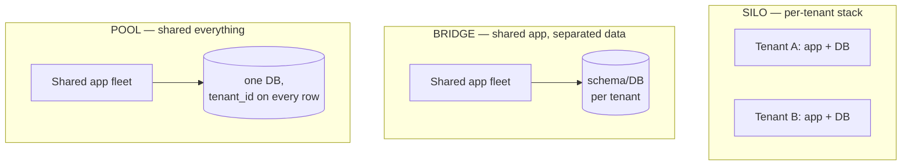

# マルチテナンシーのパターン

> **翻訳についての注記:** 本ドキュメントは英語原文 `06-scaling/12-multi-tenancy.md` を日本語に翻訳したものです。コードブロックおよびMermaidダイアグラムは原文のまま維持しています。

## TL;DR

マルチテナンシーとは、1つのデプロイメントが多数の顧客にサービスしながら、各顧客には自分だけだと思わせることです — その演出には3つの層があります: **データ分離**(サイロ: テナント別リソース。プール: `tenant_id` の規律+行レベルセキュリティ付きの共有リソース。ブリッジ: ハイブリッド)、**性能分離**(テナント別レートリミット、公平なキューイング、シャッフルシャーディング — ノイジーネイバーは容量の問題ではなく*アドミッション*の問題)、**運用分離**(テナント別コスト帰属、ライフサイクル: オンボーディング、エクスポート、削除)。本番の標準解は**ティア型テナンシー**: ロングテールはプールされたインフラ、エンタープライズのクジラと規制対象テナントはサイロまたは専用セル。どのモデルでも、テナントコンテキストは認証から暗号学的に導出されなければならず — クライアント供給のパラメータからは決して — アプリケーション層*と*データ層の両方で冗長に強制します。クロステナント漏えいは、SaaSビジネスにやり直しが許されない唯一のバグクラスだからです。

---

## 3つのモデル



| | サイロ | ブリッジ(テナント別スキーマ/DB) | プール(共有テーブル) |
|---|---|---|---|
| 分離 | 最強(インフラ境界) | 強(共有テーブルなし) | 論理のみ — 規律+RLS |
| テナント単価 | 最高。遊休の無駄 | 中 | 最低。限界テナントはほぼ無料 |
| オンボーディング | スタックのプロビジョニング(分〜時間) | スキーマ/DB作成(秒〜分) | 1行INSERT |
| 天井 | テナントごとに運用負担が増える | スキーママイグレーション × Nテナント。接続数 | 1つの巨大データセット: インデックス肥大、vacuum、ホットパーティション |
| テナント別リストア/エクスポート/削除 | 自明 | 容易 | `WHERE` 句と祈り — 明示的に設計せよ |
| コンプライアンス(「うちのデータは分離して」) | それ自体が売れる | 通常は許容される | 最も難しい会話 |

ブリッジモデルの隠れた税は**マイグレーションの乗算**です: すべてのスキーマ変更がN回走り([データベースマイグレーション](../15-deployment/03-database-migrations.md))、あるテナントの1万行では一瞬の変更が、別のテナントの5億行では何時間もかかります。プールモデルの隠れた税は、*永遠にすべてのクエリ*がテナント述語を運ばなければならないこと — だからそれを規律任せにしません:

```sql
-- Pool model: make the database enforce what code reviews can't.
ALTER TABLE invoices ENABLE ROW LEVEL SECURITY;

CREATE POLICY tenant_isolation ON invoices
    USING (tenant_id = current_setting('app.tenant_id')::uuid);

-- The app sets the tenant once per transaction, from the verified token:
-- SET LOCAL app.tenant_id = '7c0e...';   ← derived from auth, never from input
```

RLS(または同等物: Spanner/CockroachDBの行レベルポリシー、DynamoDBの先頭キー `tenant_id` + IAM `LeadingKeys` 条件)があれば、書き忘れた `WHERE tenant_id = ?` は他社の請求書ではなくゼロ行を返します。多層防御は依然有効です: アプリ層のスコープ*と*データベースの強制*と*、クロステナント読み取りを能動的に試みるテスト([スケールする認可](../10-security/07-authorization-patterns.md) — テナンシーは認可グラフの最外殻の関係です)。

### ティア型テナンシー: 本番のデフォルト

現実のSaaSは1モデルを選びません。勝ちパターンは**ロングテールをプールし、クジラをサイロにする** — 無料/SMBティアは限界費用がゼロに近づく共有インフラへ、エンタープライズと規制対象は専用スキーマ・DB・あるいはフル[セル](./11-cell-based-architecture.md)へ、価格もそれに応じて。ティア配置はプロダクト属性になり(「専用インフラ」は見積もりの行になります)、アーキテクチャは**昇格**をサポートしなければなりません: 成長したテナントのプール→サイロ移動はライブのデータ移行(二重書き込み、検証、ルーティング切替 — セル移行と同じ機構)であり、営業のプレッシャーの下で実施することになるので、先に冷静に作っておくこと。

---

## テナントコンテキスト: アイデンティティが根

下流のすべてが1つのルールに依存します: **テナントのアイデンティティは認証時に確立され、検証済みコンテキストで運ばれる — クライアントが制御するURL・ヘッダ・リクエストボディから推測しては決してならない。** パスのチェックだけの `GET /api/orgs/acme/invoices` はIDOR製造機です。

```python
@app.middleware
def tenant_context(request):
    claims = verify_jwt(request.token)            # cryptographic source of truth
    request.tenant = claims["org_id"]             # ← the only place tenancy enters

    if request.path_org and request.path_org != request.tenant:
        raise Forbidden("token/org mismatch")     # path is a convenience, not an authority

    db.execute("SET LOCAL app.tenant_id = %s", request.tenant)   # arms RLS
    metrics.tag(tenant=request.tenant)            # observability + cost attribution
    queue_headers["x-tenant"] = request.tenant    # propagate to async work
```

伝播は確立と同じくらい重要です: バックグラウンドジョブ、キューコンシューマ、スケジュールタスク、[CDC](../13-data-pipelines/04-change-data-capture.md)由来のパイプラインはすべてリクエストの*外*で実行され、テナントコンテキストを明示的に運ばなければなりません — 古典的な漏れは、テナンシーの存在を忘れたバッチジョブやキャッシュキー(`cache[(tenant, user_id)]` であるべき `cache[user_id]`)です。

---

## 性能分離: ノイジーネイバー

共有インフラとは共有されたキュー、プール、CPUのこと — そしてテナント負荷は残酷に偏っています(1テナントが中央値の100倍は日常)。容量はこれを解決しません。**アドミッション制御**が解決します:

- 入口での**テナント別レートリミットと同時実行上限**を、ティアごとにサイズ設定([レートリミット](./05-rate-limiting.md))。上限の仕事は、あるテナントのスパイクを*そのテナントの*問題にすることです。
- **非同期処理の公平なキューイング:** グローバルFIFOは絶対に1本にしない — クジラの200万ジョブのインポートが全員をその後ろに駐車させます。テナント別キュー(または重み付きラウンドロビンで排出するテナント別サブキュー)が、任意のテナントのワーカースループット占有を抑えます:

```python
def next_job(queues: dict[str, Queue], weights: dict[str, int]):
    """Weighted round-robin across tenant queues — a whale gets its weight, not the fleet."""
    for tenant in weighted_cycle(weights):
        if job := queues[tenant].try_pop():
            return job
```

- 共有ワーカーフリートには**シャッフルシャーディング**を。毒のあるテナントでさえ、劣化させるのは少数のシャード仲間だけです([セルベースアーキテクチャ](./11-cell-based-architecture.md))。
- **テナント別のサーキットブレーク/ロードシェディング:** 過負荷時はランダムではなく*テナントとティアで*削る — 有料ティアの保護は偶然ではなく、エンコードするポリシー判断です([バックプレッシャー](./07-backpressure.md))。
- **データベースレベルのガード:** ロール/ティア別のステートメントタイムアウト、プーラーでのテナント別接続予算、そして1テナントの偏りがホットパーティションになる兆候の監視([データベースシャーディング](./03-database-sharding.md) — 先頭シャードキーとしての `tenant_id` は自然ですが、テナントの偏りを継承します。大きなテナントには専用パーティションが必要かもしれません)。

これら全部の可観測性の前提: テナントでタグ付けされたメトリクス(全カーディナリティではなくtop-N)。「p99が悪い」が「*誰にとって*悪く、*誰が*原因か」に分解できること — そしてコスト帰属は同じタグに乗ります([FinOpsとコスト工学](../11-observability/06-finops-cost-engineering.md))。

---

## テナントのライフサイクル

マルチテナント*プロダクト*とマルチテナント*データベース*を分かつ運用:

- **オンボーディング**はプロビジョニングのワークフローです([Saga](../05-messaging/09-saga-pattern.md)): テナントレコード作成 → ティアのリソース確保(スキーマ? セル配置?) → デフォルトのシード → 資格情報の発行。冪等で再開可能に。営業デモはデプロイの最中にやってくるからです。
- **エクスポート**(「うちのデータを全部ください」) — 契約上の約束であり、GDPR隣接であり、プールモデルでは、すべてのテーブルが `tenant_id` を持ち抽出パイプラインを作っていない限り、自明に困難です。テナント別エクスポートは移行のプリミティブでもあります(プール→サイロ昇格、顧客へのオフボーディング)。
- **削除**は証明可能でなければなりません: テナントデータを保持するすべてのストア — プライマリDB、キャッシュ、検索インデックス、オブジェクトストレージ、ウェアハウス、ログ、バックアップ — を列挙し、削除するか暗号消去します(テナント別暗号鍵があれば、「鍵を消す」が、古いバックアップのように洗えないストアの最後の砦になります)。ここで必要なデータ棚卸しは[レジデンシ](./09-multi-region-architecture.md)が要求するものと同じです。一度作れば二度使えます。
- **テナント別リストア:** 「うっかり全部消しました。*うちだけ*昨日に戻して」 — サイロでは自明、プールでは外科的な抽出とマージ。聞かれる*前に*ティアごとのサポート方針を決めること([ディザスタリカバリ](../15-deployment/05-disaster-recovery.md))。
- **テスト:** 本番に合成テナントの艦隊(ティアごとに1つ)を常時稼働 — 分離リグレッションのカナリアであり、CIでクロステナント*攻撃*テスト(全エンドポイントをテナントAのトークンでテナントBのリソースに対して試行)を回す場でもあります。

---

## チェックリスト

- [ ] テナンシーモデルはティアごとに選択。プール→サイロ昇格はライブマイグレーションとして構築済み
- [ ] テナントIDは検証済み認証からのみ導出。ジョブ・キュー・キャッシュ・パイプラインへ伝播
- [ ] アプリ層スコープの背後にデータベースレベルの強制(RLS / 先頭キー+IAM)。CIにクロステナントアクセステスト
- [ ] テナント別レートリミット・同時実行上限・公平キューイング。過負荷時はティアで削る
- [ ] テナントタグ付きメトリクスとコスト帰属。top-Nノイジーテナントのダッシュボード
- [ ] クジラを特定しピン留め(専用スキーマ/セル)。プールセルは配置時にテナントサイズを制限
- [ ] エクスポート、削除(バックアップ戦略を含む)、テナント別リストアにティアごとの回答がある
- [ ] スキーママイグレーション計画はN倍の実行とテナントサイズの偏りを考慮(ブリッジモデル)
- [ ] 本番の合成テナントが全ティアを継続的に行使

---

## 参考文献

- [AWS Well-Architected SaaS Lens](https://docs.aws.amazon.com/wellarchitected/latest/saas-lens/saas-lens.html) — silo/pool/bridgeの語彙とティアリングのパターン
- [Architecting multitenant solutions on Azure](https://learn.microsoft.com/en-us/azure/architecture/guide/multitenant/overview) — 公開されている中で最も深いテナンシーのトレードオフカタログ
- [PostgreSQL Row Level Security](https://www.postgresql.org/docs/current/ddl-rowsecurity.html) / [DynamoDB: condition keys for fine-grained access](https://docs.aws.amazon.com/amazondynamodb/latest/developerguide/specifying-conditions.html)
- [Citus: sharding Postgres by tenant](https://www.citusdata.com/blog/2017/03/09/multi-tenant-sharding-tutorial/) — テナント先頭キーでのプールモデルのスケール
- [Stripe: online migrations at scale](https://stripe.com/blog/online-migrations) — テナント昇格が依拠する二重書き込みプレイブック
