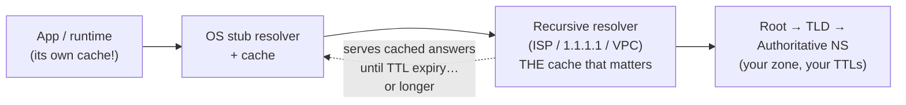
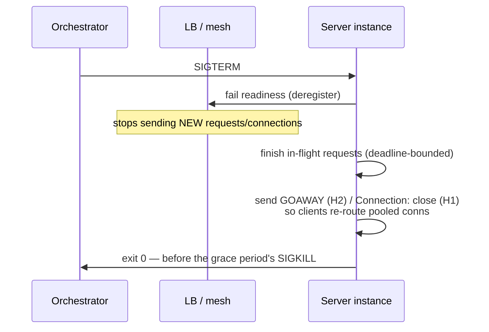

# DNSとコネクション管理

> **翻訳についての注記:** 本ドキュメントは英語原文 `06-scaling/13-dns-and-connection-management.md` を日本語に翻訳したものです。コードブロックおよびMermaidダイアグラムは原文のまま維持しています。

## TL;DR

すべてのリクエストの下に、地味な2つの層が座っており、現実の障害の不釣り合いな割合を引き起こします。**DNS**はグローバルに分散した結果整合の設定データベースで、その整合性のノブはTTLです — そしてそのキャッシュ(再帰リゾルバ、OS、言語ランタイム、コネクションプール)は、あなたが設定したTTLを日常的に生き延びます。だから「レコードを更新した」と「トラフィックが動いた」は数分隔たった別のイベントなのです。DNS変更はデプロイのように扱い、ネガティブキャッシングに気をつけ、ホットパスでブロッキングする名前解決を決してしないこと。**コネクション**はもうひとつの税です: TCP+TLSハンドシェイクは最初の有用なバイトの前に1〜3往復かかるので、本番システムはkeep-aliveとプールで償却します — リトルの法則でサイズし、サーバーを守るために上限を設け、クライアントのアイドルタイムアウトはサーバーより厳密に短く。見えない天井 — エフェメラルポート枯渇、NAT/conntrackテーブルの上限、食い違うアイドルタイムアウト — は、知って探すまでランダムなリセットに見えます。そしてデプロイでは: 殺す前にドレインすること。

---

## DNS: すべてが依存する設定システム



ルックアップはスタブ → 再帰 → (ルート → TLD → 権威)と歩き、**すべてのホップがキャッシュします**。権威の回答はあなたのTTLを運びます。その後はすべて祈りです:

- **TTLは新鮮さの上限であって、変更伝播の保証ではありません。** リゾルバは概ねTTLを尊重しますが、クライアント側の層は独自のものを足します: OSがキャッシュし、ブラウザがキャッシュし — 古典として — **ランタイムが固定します**: 古いJVMはデフォルトで成功したルックアップを*永遠に*キャッシュしました(`networkaddress.cache.ttl`)。長寿命のコネクションプールはそもそも再解決しません — 接続がすでに存在するからです。「TTL 5分」のフェイルオーバー計画は、1時間前にアドレスを解決し、今も幸せに接続しているプールを考慮しなければなりません。
- **フェイルオーバーの算数:** カットオーバーは `TTL + リゾルバの遅延 + クライアント/プールの更新` として計画し、実証的に検証すること。本気のフェイルオーバーでは、TTLを*事前に*下げておきます(TTL引き下げ自体が旧TTL1周期かけて伝播します)。だからこそ[マルチリージョン設計](./09-multi-region-architecture.md)はDNSを*粗い*ステアリング層として扱い、速い層にはanycastやルーティング層を使うのです。
- **低TTLは無料ではない:** 高トラフィックの名前のTTL 30はリゾルバ負荷を掛け算し、DNSルックアップのレイテンシ(と可用性)をより頻繁にユーザーのクリティカルパスに置きます。典型的な妥協: フェイルオーバーに関わる名前は60〜300秒、その他は長め。
- **ネガティブキャッシング(RFC 2308):** NXDOMAINの回答もキャッシュされます — SOAのminimumが支配します。罠: *新しい*レコードを作ったのに、数秒早く尋ねたクライアントはネガティブTTLの窓の間「存在しない」を受け取り続けます。存在する前に名前を引くことは、実質その誕生を遅らせます。
- **トラフィックステアリングとしてのDNS** — 重み付き、レイテンシベース、ジオ、ヘルスチェック付きレコード(+エイペックスのalias/CNAMEフラット化)は、DNSを最も安いグローバルルーターにします。限界はTTL速度の収束と、リゾルバ粒度です(あなたがステアするのは*リゾルバ*であり、ECSはリゾルバが多数のユーザーを集約する問題を部分的にしか直しません)。anycastは代わりにBGP速度でパケット単位にステアします([Cloudflare](../08-case-studies/12-cloudflare.md))。CDNは両方を組み合わせます。
- **DNS経由のサービスディスカバリ**(KubernetesのCoreDNS、`SRV`/headlessサービス、Consul)は、上記すべてをクラスタの*内側*に相続します: TTLに縛られた古さ vs API/xDS経由のプッシュ型ディスカバリ([サービスディスカバリ](../12-service-mesh/01-service-discovery.md))。ゆっくり変わる名前には良し。速いエンドポイントの入れ替わりに対する唯一の機構としては誤り — それこそサイドカーとロードバランサAPIが解くものです。

**設計で備えるべき障害モード:** リゾルバの障害(あなたのアプリの可用性は今やリゾルバの可用性を含みます — 冗長リゾルバを動かし、TTLを尊重するインプロセスキャッシュを)。遅いDNSがスレッドプール枯渇に化けること(タイムアウトなしの同期 `getaddrinfo` がリクエストパス上に — 解決に独自のタイムアウトを与え、ホットパスから外すこと)。人気の名前が失敗したときのリトライ増幅(全リクエストが解決をリトライ — [いつものストームの数学](./10-retries-timeouts-hedging.md))。tier-0の依存先には「DNSが完全に死んだら」の物語を持つこと: キャッシュ済みのlast-known-goodは、ハードな失敗に勝ります。

---

## コネクション: ハンドシェイクの償却

他のすべてを正当化するコストモデル:

```
New HTTPS connection ≈ TCP (1 RTT) + TLS 1.3 (1 RTT; 2 for 1.2) + slow start ramp
At 1ms intra-DC: ~2-3ms overhead per request without reuse — 10x a fast request.
At 80ms cross-region: ~160-240ms before byte one. Reuse is not optional.
```

**keep-alive+プーリング**はそれを一度きりのコストに変えます。エンジニアリングはサイズ設定と縁にあります:

- **プールはリトルの法則でサイズする**([キャパシティプランニング](../01-foundations/10-capacity-planning.md)): ビジー接続数 = QPS × 平均レイテンシ。5msで2,000 QPSなら10本がビジー。プール20〜30がバーストをカバーします。「安全のため大きく」(500)サイズされたプールは、インシデント中に劣化した1サービスが自分のデータベースをDDoSする方法です — プールは*アドミッション制御のバルブ*です。サーバーが実際に並行処理できる量の近くで上限を設け、超過リクエストはクライアントでキューかシェディングを([バックプレッシャー](./07-backpressure.md))。
- **宛先ごとの上限と公平性:** N個のサービスインスタンス × プールサイズ = データベースが見る接続数。200 Pod × 50接続 = バックエンド10,000接続 — ゆえにサーバー側プーラー(PgBouncer型)とクライアント別の上限です([マルチテナンシー](./12-multi-tenancy.md)の論理のコネクション層版)。
- **アイドルタイムアウトの競争:** サーバーが60秒でアイドル接続を閉じ、クライアントが65秒まで再利用可能とみなすなら、クライアントは周期的に、サーバーが閉じたばかりの接続へ書き込みます — 低トラフィック時の散発的な `connection reset`/`broken pipe` として現れます。ルール: **クライアントのアイドルタイムアウト < サーバーのアイドルタイムアウト**(そしてLBのアイドルはその間に。3つ全部を確認)。借用時検証(validate-on-borrow)か低間隔のTCP keepaliveがベルトとサスペンダーです。
- **プールはDNSを固定します:** プールされた接続は再解決しません。プールには有界の接続*寿命*(例: 最大5〜15分)を組み合わせ、DNS/ディスカバリで回されたエンドポイントが実際にドレインされるように — この設定ひとつが「数分でフェイルオーバー」と「全Podが再起動したときにフェイルオーバー」の差です。

### 見えない天井

- **エフェメラルポート枯渇:** 外向き接続は(送信元IP, 宛先IP, 宛先ポート)タプルごとにローカルポートを消費します — 送信元IPあたり約28K〜64Kポート。閉じた接続は `TIME_WAIT`(約60秒)に残ります。1つのバックエンドへ毎秒2,000の*新規*接続を張るプロキシは、数秒でタプル空間を使い果たします。修正は順に: **接続を再利用する**(それが本来の要点)、送信元IPを増やす、それからカーネルチューニング — 逆順ではなく。
- **NAT / conntrackの上限:** クラウドのNATゲートウェイは送信元ごとに有限のSNATポートを割り当てます(LinuxのconntrackテーブルもエントリJ有限)。症状: *1つの*人気の宛先(API、SaaS)への外向き接続だけが規模で断続的にタイムアウトし、他はすべて正常。同じ修正階層: 再利用、次にお喋りな宛先へのプライベート接続/エンドポイント、それからNAT割り当ての増強。
- **プロトコルのヘッドオブライン:** HTTP/1.1 = 接続あたり一度に1リクエスト(ブラウザの6接続の回避策の理由)。HTTP/2は1接続上でストリームを多重化しますが、パケット喪失下で**TCPの**ヘッドオブラインブロッキングを相続します — 1つの喪失セグメントが全ストリームを止める。HTTP/3/QUICは独立ストリームでそれを直します([CDNアーキテクチャのQUICセクション](./04-cdn-architecture.md))。内部では、gRPC-over-H2+メッシュのコネクション管理が標準解です([サイドカーパターン](../12-service-mesh/03-sidecar-pattern.md))。

### 優雅なシャットダウン: ドレイン

デプロイとスケールダウンは、生きた接続を持つプロセスを殺します。素朴にやれば、すべてのデプロイがマイクロ障害です。手順([デプロイ戦略](../15-deployment/01-deployment-strategies.md)):



噛みつく詳細: 登録解除はシャットダウンに*先行*し、伝播しなければなりません(readinessを落とした後、数秒sleepを — LBの更新は瞬時ではありません)。長寿命ストリーム(WebSocket、gRPCストリーム、[SSE](../07-real-time/03-server-sent-events.md))にはアプリケーションレベルの「再接続してください」シグナルが必要です — ドレインは4時間のストリームを待てないからです。そして猶予期間はp99リクエスト*+*ドレインの段取りを超えなければ、SIGKILLが礼儀を台無しにします。レームダックモード — 「私を選ぶのをやめて」と広告しながら処理を続ける — はサービスメッシュにおける同じアイデアです。

---

## チェックリスト

- [ ] フェイルオーバーに関わるDNS名は、計画されたTTL、実測した伝播予算、リハーサル済みの変更手順を持つ(TTL事前引き下げ → 変更 → 複数リゾルバから検証)
- [ ] リクエストパス上にブロッキングでタイムアウトなしのDNS解決がない。インプロセスキャッシュはTTLを尊重。ランタイムの固定設定を監査済み(JVM等)
- [ ] 「作成して即使用」のレコードフローでは、ネガティブキャッシングの窓を把握している
- [ ] プールはλ×Wからサイズし、サーバーを守る上限付き。宛先ごとの接続数をフリート全体で計算済み
- [ ] クライアントのアイドル < LBのアイドル < サーバーのアイドル。エンドポイントが実際にドレインされるよう接続のmax-ageは有界
- [ ] 外向きホットパスはエフェメラルポート/SNATの天井を監査済み(接続/秒 × 宛先の計算を実施)
- [ ] シャットダウン: 登録解除 → ドレイン(デッドライン付き) → GOAWAY → exit。猶予期間 > p99+段取り。長寿命ストリームには再接続プロトコル
- [ ] コネクションのメトリクスを出力: プール使用率/待ち時間、新規対再利用比、リセット、ハンドシェイクレイテンシ — プールの待ち時間は飽和の先行指標([稼働率曲線](../01-foundations/10-capacity-planning.md))

---

## 参考文献

- [RFC 1034/1035](https://www.rfc-editor.org/rfc/rfc1034) / [RFC 2308 (negative caching)](https://www.rfc-editor.org/rfc/rfc2308) — 実際のセマンティクス
- [Cloudflare Learning Center: DNS](https://www.cloudflare.com/learning/dns/what-is-dns/) — 解決経路を読みやすく
- [Kubernetes: DNS for Services and Pods](https://kubernetes.io/docs/concepts/services-networking/dns-pod-service/) / [Debugging DNS Resolution](https://kubernetes.io/docs/tasks/administer-cluster/dns-debugging-resolution/) — クラスタ内の現実(ndotsとその仲間)
- [AWS: NAT gateway port allocation](https://docs.aws.amazon.com/vpc/latest/userguide/nat-gateway-troubleshooting.html) / [Azure SNAT exhaustion guidance](https://learn.microsoft.com/en-us/azure/load-balancer/troubleshoot-outbound-connection) — 所有者自身が文書化した見えない天井
- [Envoy: connection pooling](https://www.envoyproxy.io/docs/envoy/latest/intro/arch_overview/upstream/connection_pooling) — プロトコル別の本番プールセマンティクス
- *High Performance Browser Networking* (Ilya Grigorik) — ハンドシェイクコスト、keep-alive、H2。オンラインで無料、今も最良の単一リファレンス
