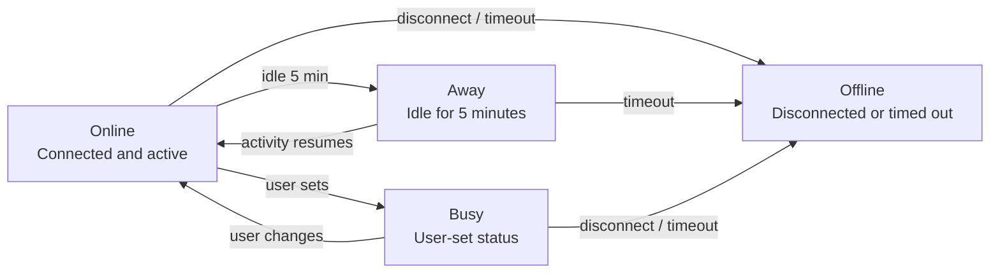
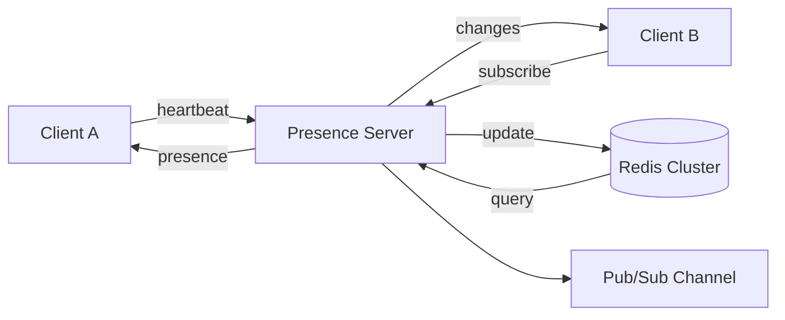

# プレゼンス

> この記事は英語版から翻訳されました。最新版は[英語版](/07-real-time/06-presence.md)をご覧ください。

## TL;DR

プレゼンスシステムは、ユーザーのオンライン状態、アクティビティ状態、および関連メタデータをリアルタイムで追跡・ブロードキャストします。主な課題は、正確な検出（切断とネットワーク障害の区別）、スケーラビリティ（数百万ユーザー）、一貫性（結果整合性が通常は許容される）、およびプライバシー制御です。一般的な実装ではハートビート、TTLベースの有効期限、変更のブロードキャストにPub/Subを使用します。

---

## プレゼンスの状態



---

## 基本アーキテクチャ



---

## 実装

### プレゼンスサービス（Python）

```python
import asyncio
import redis.asyncio as redis
import json
import time
from dataclasses import dataclass, asdict
from typing import Dict, Set, Optional, List
from enum import Enum

class PresenceStatus(Enum):
    ONLINE = "online"
    AWAY = "away"
    BUSY = "busy"
    OFFLINE = "offline"

@dataclass
class PresenceInfo:
    user_id: str
    status: PresenceStatus
    last_seen: float
    device: str
    custom_status: Optional[str] = None
    activity: Optional[str] = None  # e.g., "In a call"

    def to_dict(self) -> dict:
        return {
            'user_id': self.user_id,
            'status': self.status.value,
            'last_seen': self.last_seen,
            'device': self.device,
            'custom_status': self.custom_status,
            'activity': self.activity
        }

    @classmethod
    def from_dict(cls, data: dict) -> 'PresenceInfo':
        return cls(
            user_id=data['user_id'],
            status=PresenceStatus(data['status']),
            last_seen=data['last_seen'],
            device=data['device'],
            custom_status=data.get('custom_status'),
            activity=data.get('activity')
        )

class PresenceService:
    """
    Scalable presence service using Redis.
    """

    def __init__(
        self,
        redis_url: str = 'redis://localhost:6379',
        heartbeat_ttl: int = 30,     # Seconds before considered offline
        away_threshold: int = 300,    # Seconds of inactivity before away
    ):
        self.redis_url = redis_url
        self.redis: redis.Redis = None
        self.heartbeat_ttl = heartbeat_ttl
        self.away_threshold = away_threshold

        # Keys
        self.presence_key = "presence:{user_id}"
        self.heartbeat_key = "presence:heartbeat:{user_id}"
        self.channel_key = "presence:updates"

    async def connect(self):
        """Initialize Redis connection."""
        self.redis = redis.from_url(self.redis_url)

    async def set_online(
        self,
        user_id: str,
        device: str,
        custom_status: str = None
    ) -> PresenceInfo:
        """Mark user as online."""
        presence = PresenceInfo(
            user_id=user_id,
            status=PresenceStatus.ONLINE,
            last_seen=time.time(),
            device=device,
            custom_status=custom_status
        )

        await self._update_presence(presence)
        return presence

    async def heartbeat(self, user_id: str, device: str) -> PresenceInfo:
        """
        Update heartbeat to maintain online status.
        Should be called every 10-15 seconds.
        """
        now = time.time()

        # Get current presence
        current = await self.get_presence(user_id)

        if current:
            current.last_seen = now
            current.device = device

            # Check if should transition to away
            if current.status == PresenceStatus.ONLINE:
                # Activity is tracked separately
                pass
        else:
            current = PresenceInfo(
                user_id=user_id,
                status=PresenceStatus.ONLINE,
                last_seen=now,
                device=device
            )

        await self._update_presence(current)
        return current

    async def set_status(
        self,
        user_id: str,
        status: PresenceStatus,
        custom_status: str = None,
        activity: str = None
    ):
        """Set user status explicitly."""
        current = await self.get_presence(user_id)

        if current:
            old_status = current.status
            current.status = status
            current.custom_status = custom_status
            current.activity = activity
            current.last_seen = time.time()

            await self._update_presence(current, notify=old_status != status)

    async def set_offline(self, user_id: str):
        """Mark user as offline."""
        presence = PresenceInfo(
            user_id=user_id,
            status=PresenceStatus.OFFLINE,
            last_seen=time.time(),
            device=""
        )

        # Remove heartbeat key
        await self.redis.delete(self.heartbeat_key.format(user_id=user_id))

        await self._update_presence(presence)

    async def _update_presence(
        self,
        presence: PresenceInfo,
        notify: bool = True
    ):
        """Update presence in Redis and optionally notify subscribers."""
        user_id = presence.user_id

        pipe = self.redis.pipeline()

        # Store presence data
        pipe.hset(
            self.presence_key.format(user_id=user_id),
            mapping=presence.to_dict()
        )

        # Set heartbeat with TTL
        if presence.status != PresenceStatus.OFFLINE:
            pipe.setex(
                self.heartbeat_key.format(user_id=user_id),
                self.heartbeat_ttl,
                "1"
            )

        await pipe.execute()

        # Publish update
        if notify:
            await self.redis.publish(
                self.channel_key,
                json.dumps(presence.to_dict())
            )

    async def get_presence(self, user_id: str) -> Optional[PresenceInfo]:
        """Get user's current presence."""
        data = await self.redis.hgetall(
            self.presence_key.format(user_id=user_id)
        )

        if not data:
            return None

        # Decode bytes
        decoded = {k.decode(): v.decode() for k, v in data.items()}
        decoded['last_seen'] = float(decoded['last_seen'])

        presence = PresenceInfo.from_dict(decoded)

        # Check if heartbeat expired (actually offline)
        heartbeat_exists = await self.redis.exists(
            self.heartbeat_key.format(user_id=user_id)
        )

        if not heartbeat_exists and presence.status != PresenceStatus.OFFLINE:
            presence.status = PresenceStatus.OFFLINE

        return presence

    async def get_bulk_presence(
        self,
        user_ids: List[str]
    ) -> Dict[str, PresenceInfo]:
        """Get presence for multiple users efficiently."""
        pipe = self.redis.pipeline()

        for user_id in user_ids:
            pipe.hgetall(self.presence_key.format(user_id=user_id))
            pipe.exists(self.heartbeat_key.format(user_id=user_id))

        results = await pipe.execute()

        presences = {}
        for i, user_id in enumerate(user_ids):
            data = results[i * 2]
            heartbeat_exists = results[i * 2 + 1]

            if data:
                decoded = {k.decode(): v.decode() for k, v in data.items()}
                decoded['last_seen'] = float(decoded['last_seen'])
                presence = PresenceInfo.from_dict(decoded)

                if not heartbeat_exists and presence.status != PresenceStatus.OFFLINE:
                    presence.status = PresenceStatus.OFFLINE

                presences[user_id] = presence

        return presences

    async def subscribe_presence_updates(self):
        """Subscribe to presence change events."""
        pubsub = self.redis.pubsub()
        await pubsub.subscribe(self.channel_key)

        async for message in pubsub.listen():
            if message['type'] == 'message':
                data = json.loads(message['data'])
                yield PresenceInfo.from_dict(data)
```

### クライアント統合

```javascript
class PresenceClient {
  constructor(wsUrl, userId, device) {
    this.wsUrl = wsUrl;
    this.userId = userId;
    this.device = device;
    this.ws = null;
    this.heartbeatInterval = null;
    this.activityTimeout = null;
    this.isActive = true;

    this.HEARTBEAT_INTERVAL = 15000;  // 15 seconds
    this.ACTIVITY_TIMEOUT = 300000;   // 5 minutes

    this.callbacks = {
      onPresenceChange: null,
      onStatusChange: null
    };
  }

  async connect() {
    this.ws = new WebSocket(this.wsUrl);

    this.ws.onopen = () => {
      this.setOnline();
      this.startHeartbeat();
      this.setupActivityDetection();
    };

    this.ws.onmessage = (event) => {
      const message = JSON.parse(event.data);
      this.handleMessage(message);
    };

    this.ws.onclose = () => {
      this.stopHeartbeat();
    };
  }

  setOnline() {
    this.ws.send(JSON.stringify({
      type: 'set_online',
      device: this.device
    }));
  }

  setStatus(status, customStatus = null, activity = null) {
    this.ws.send(JSON.stringify({
      type: 'set_status',
      status,
      custom_status: customStatus,
      activity
    }));
  }

  startHeartbeat() {
    this.heartbeatInterval = setInterval(() => {
      if (this.ws.readyState === WebSocket.OPEN) {
        this.ws.send(JSON.stringify({
          type: 'heartbeat',
          device: this.device
        }));
      }
    }, this.HEARTBEAT_INTERVAL);
  }

  stopHeartbeat() {
    if (this.heartbeatInterval) {
      clearInterval(this.heartbeatInterval);
    }
  }

  setupActivityDetection() {
    // Track user activity
    const activityEvents = ['mousedown', 'keydown', 'scroll', 'touchstart'];

    const handleActivity = () => {
      if (!this.isActive) {
        this.isActive = true;
        this.setStatus('online');
      }

      clearTimeout(this.activityTimeout);
      this.activityTimeout = setTimeout(() => {
        this.isActive = false;
        this.setStatus('away');
      }, this.ACTIVITY_TIMEOUT);
    };

    activityEvents.forEach(event => {
      document.addEventListener(event, handleActivity, { passive: true });
    });

    // Handle visibility change
    document.addEventListener('visibilitychange', () => {
      if (document.hidden) {
        // Tab hidden - might go away soon
        this.activityTimeout = setTimeout(() => {
          this.isActive = false;
          this.setStatus('away');
        }, 60000);  // 1 minute when tab hidden
      } else {
        handleActivity();
      }
    });
  }

  subscribeToUsers(userIds) {
    this.ws.send(JSON.stringify({
      type: 'subscribe',
      user_ids: userIds
    }));
  }

  handleMessage(message) {
    switch (message.type) {
      case 'presence_update':
        if (this.callbacks.onPresenceChange) {
          this.callbacks.onPresenceChange(message.presence);
        }
        break;

      case 'initial_presence':
        if (this.callbacks.onPresenceChange) {
          Object.values(message.presences).forEach(presence => {
            this.callbacks.onPresenceChange(presence);
          });
        }
        break;
    }
  }

  on(event, callback) {
    this.callbacks[event] = callback;
  }

  disconnect() {
    this.stopHeartbeat();
    if (this.ws) {
      this.ws.close();
    }
  }
}

// Usage
const presence = new PresenceClient('wss://api.example.com/presence', 'user123', 'web');

presence.on('onPresenceChange', (presenceInfo) => {
  updateUserStatus(presenceInfo.user_id, presenceInfo.status);
});

await presence.connect();
presence.subscribeToUsers(['friend1', 'friend2', 'friend3']);
```

---

## プレゼンスのスケーリング

### Redisクラスターによる分散プレゼンス

```python
import hashlib
from typing import List

class ShardedPresenceService:
    """
    Presence service sharded across Redis nodes.
    Each user's presence is stored on a specific shard.
    """

    def __init__(self, redis_nodes: List[str]):
        self.shards = [
            redis.from_url(node)
            for node in redis_nodes
        ]
        self.shard_count = len(self.shards)

    def _get_shard(self, user_id: str) -> redis.Redis:
        """Consistent hashing to select shard."""
        hash_val = int(hashlib.md5(user_id.encode()).hexdigest(), 16)
        shard_index = hash_val % self.shard_count
        return self.shards[shard_index]

    async def set_presence(self, user_id: str, presence: PresenceInfo):
        shard = self._get_shard(user_id)
        await shard.hset(
            f"presence:{user_id}",
            mapping=presence.to_dict()
        )

    async def get_bulk_presence(
        self,
        user_ids: List[str]
    ) -> Dict[str, PresenceInfo]:
        """Get presence across shards."""
        # Group users by shard
        shard_users: Dict[int, List[str]] = {}

        for user_id in user_ids:
            hash_val = int(hashlib.md5(user_id.encode()).hexdigest(), 16)
            shard_idx = hash_val % self.shard_count

            if shard_idx not in shard_users:
                shard_users[shard_idx] = []
            shard_users[shard_idx].append(user_id)

        # Query each shard in parallel
        async def query_shard(shard_idx: int, users: List[str]):
            shard = self.shards[shard_idx]
            pipe = shard.pipeline()

            for user_id in users:
                pipe.hgetall(f"presence:{user_id}")

            results = await pipe.execute()

            return {
                user_id: self._parse_presence(result)
                for user_id, result in zip(users, results)
                if result
            }

        tasks = [
            query_shard(shard_idx, users)
            for shard_idx, users in shard_users.items()
        ]

        shard_results = await asyncio.gather(*tasks)

        # Merge results
        all_presences = {}
        for result in shard_results:
            all_presences.update(result)

        return all_presences
```

### プレゼンスのファンアウト最適化

```python
class PresenceFanOutService:
    """
    Optimize presence updates for users with many subscribers.
    Instead of publishing to every subscriber, use channels.
    """

    def __init__(self, redis: redis.Redis):
        self.redis = redis
        # Threshold for using channel-based delivery
        self.channel_threshold = 1000

    async def subscribe_to_user(
        self,
        subscriber_id: str,
        target_user_id: str
    ):
        """Subscribe to a user's presence updates."""
        # Track subscription
        await self.redis.sadd(
            f"presence:subscribers:{target_user_id}",
            subscriber_id
        )

        # Also subscribe to user's presence channel
        # (for when they have many subscribers)
        await self.redis.sadd(
            f"presence:subscribed:{subscriber_id}",
            target_user_id
        )

    async def notify_presence_change(self, presence: PresenceInfo):
        """Notify subscribers of presence change."""
        user_id = presence.user_id

        # Check subscriber count
        subscriber_count = await self.redis.scard(
            f"presence:subscribers:{user_id}"
        )

        if subscriber_count > self.channel_threshold:
            # Many subscribers - use pub/sub channel
            await self.redis.publish(
                f"presence:channel:{user_id}",
                json.dumps(presence.to_dict())
            )
        else:
            # Few subscribers - direct notification
            subscribers = await self.redis.smembers(
                f"presence:subscribers:{user_id}"
            )

            for subscriber_id in subscribers:
                await self.redis.lpush(
                    f"presence:updates:{subscriber_id.decode()}",
                    json.dumps(presence.to_dict())
                )
```

---

## グループコンテキストでのプレゼンス

```python
class ChannelPresenceService:
    """
    Track presence in channels/rooms/groups.
    Who is currently viewing a document, in a chat room, etc.
    """

    def __init__(self, redis: redis.Redis):
        self.redis = redis
        self.ttl = 60  # Presence TTL in channel

    async def join_channel(
        self,
        channel_id: str,
        user_id: str,
        metadata: dict = None
    ):
        """User joins a channel."""
        now = time.time()

        member_data = json.dumps({
            'user_id': user_id,
            'joined_at': now,
            'last_seen': now,
            **(metadata or {})
        })

        pipe = self.redis.pipeline()

        # Add to channel members (sorted set by last_seen)
        pipe.zadd(
            f"channel:{channel_id}:members",
            {member_data: now}
        )

        # Set TTL key for cleanup
        pipe.setex(
            f"channel:{channel_id}:member:{user_id}",
            self.ttl,
            "1"
        )

        await pipe.execute()

        # Notify channel
        await self.redis.publish(
            f"channel:{channel_id}:presence",
            json.dumps({
                'type': 'joined',
                'user_id': user_id,
                'metadata': metadata
            })
        )

    async def heartbeat_channel(self, channel_id: str, user_id: str):
        """Update presence in channel."""
        await self.redis.setex(
            f"channel:{channel_id}:member:{user_id}",
            self.ttl,
            "1"
        )

    async def leave_channel(self, channel_id: str, user_id: str):
        """User leaves channel."""
        pipe = self.redis.pipeline()

        pipe.delete(f"channel:{channel_id}:member:{user_id}")

        # Remove from sorted set (need to scan for user_id)
        # In practice, use a hash instead for easier lookup

        await pipe.execute()

        await self.redis.publish(
            f"channel:{channel_id}:presence",
            json.dumps({
                'type': 'left',
                'user_id': user_id
            })
        )

    async def get_channel_members(self, channel_id: str) -> List[dict]:
        """Get active members in channel."""
        # Get all members
        members = await self.redis.zrange(
            f"channel:{channel_id}:members",
            0, -1
        )

        active_members = []
        for member_data in members:
            data = json.loads(member_data)
            user_id = data['user_id']

            # Check if still active (TTL key exists)
            is_active = await self.redis.exists(
                f"channel:{channel_id}:member:{user_id}"
            )

            if is_active:
                active_members.append(data)

        return active_members

    async def get_member_count(self, channel_id: str) -> int:
        """Get active member count (approximate)."""
        # Count TTL keys matching pattern
        cursor = 0
        count = 0

        while True:
            cursor, keys = await self.redis.scan(
                cursor,
                match=f"channel:{channel_id}:member:*",
                count=100
            )
            count += len(keys)

            if cursor == 0:
                break

        return count

# Real-time document collaboration
class DocumentPresence:
    """Track who is viewing/editing a document."""

    def __init__(self, channel_presence: ChannelPresenceService):
        self.presence = channel_presence

    async def start_viewing(self, doc_id: str, user_id: str, cursor: dict = None):
        await self.presence.join_channel(
            f"doc:{doc_id}",
            user_id,
            {'cursor': cursor, 'mode': 'viewing'}
        )

    async def start_editing(self, doc_id: str, user_id: str, cursor: dict):
        await self.presence.join_channel(
            f"doc:{doc_id}",
            user_id,
            {'cursor': cursor, 'mode': 'editing'}
        )

    async def update_cursor(self, doc_id: str, user_id: str, cursor: dict):
        await self.redis.publish(
            f"doc:{doc_id}:cursors",
            json.dumps({
                'user_id': user_id,
                'cursor': cursor
            })
        )
```

---

## プライバシー制御

```python
from enum import Enum
from typing import Optional

class PresenceVisibility(Enum):
    EVERYONE = "everyone"
    CONTACTS_ONLY = "contacts"
    NOBODY = "nobody"

class PrivatePresenceService(PresenceService):
    """Presence with privacy controls."""

    async def get_presence(
        self,
        requester_id: str,
        target_user_id: str
    ) -> Optional[PresenceInfo]:
        """Get presence with privacy check."""

        # Get target's privacy settings
        visibility = await self._get_visibility_setting(target_user_id)

        if visibility == PresenceVisibility.NOBODY:
            return None

        if visibility == PresenceVisibility.CONTACTS_ONLY:
            is_contact = await self._is_contact(target_user_id, requester_id)
            if not is_contact:
                return None

        # Privacy check passed, get presence
        return await super().get_presence(target_user_id)

    async def get_bulk_presence(
        self,
        requester_id: str,
        user_ids: List[str]
    ) -> Dict[str, PresenceInfo]:
        """Bulk presence with privacy filtering."""

        # Get all visibility settings
        settings = await self._get_bulk_visibility(user_ids)

        # Filter based on privacy
        allowed_users = []
        contacts_check_users = []

        for user_id in user_ids:
            visibility = settings.get(user_id, PresenceVisibility.EVERYONE)

            if visibility == PresenceVisibility.EVERYONE:
                allowed_users.append(user_id)
            elif visibility == PresenceVisibility.CONTACTS_ONLY:
                contacts_check_users.append(user_id)

        # Check contacts for those requiring it
        if contacts_check_users:
            contacts = await self._get_mutual_contacts(
                requester_id,
                contacts_check_users
            )
            allowed_users.extend(contacts)

        # Get presence for allowed users only
        return await super().get_bulk_presence(allowed_users)

    async def set_visibility(
        self,
        user_id: str,
        visibility: PresenceVisibility
    ):
        """Set user's presence visibility."""
        await self.redis.hset(
            f"user:{user_id}:settings",
            "presence_visibility",
            visibility.value
        )
```

---

## まとめ

1. **TTL付きハートビート** — 時間制限付きキーを使用して、明示的な切断なしにオフラインユーザーを自動検出します

2. **結果整合性で十分** — プレゼンスには強い一貫性は不要です。数秒の遅延は許容されます

3. **読み取りを最適化する** — プレゼンスは読み取り負荷が高いため、非正規化とキャッシュにより効率的な一括ルックアップを実現します

4. **チャネルベースのファンアウト** — 人気ユーザーの場合は、個別通知ではなくPub/Subチャネルを使用します

5. **アクティビティ検出** — ハートビートと実際のユーザーアクティビティ（マウス、キーボード）を組み合わせて、正確な離席状態を判定します

6. **デフォルトでプライバシーを考慮** — 可視性制御を実装します。全員が全員のステータスを見えるべきではありません

7. **コンテキスト固有のプレゼンス** — グローバルステータスだけでなく、コラボレーション機能のためにチャネル/ルーム内のプレゼンスを追跡します
