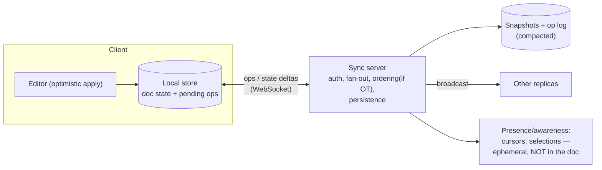

# CRDTと共同編集

> **翻訳についての注記:** 本ドキュメントは英語原文 `07-real-time/07-crdts-collaborative-editing.md` を日本語に翻訳したものです。コードブロックおよびMermaidダイアグラムは原文のまま維持しています。

## TL;DR

共同編集とは、調整する時間のない並行書き込みです: すべてのキーストロークはローカルで即座に適用され(ゼロレイテンシの楽観)、その後、編集が異なる順序で届いてもレプリカは**同じ結果に収束**しなければなりません。解は2系統。**操作変換(OT)**は、中央サーバーが受理済みの並行操作に対して操作を書き換えます — 実績は十分(Google Docs)ですが、正しさは悪魔的に難しい変換関数とサーバーの順序付けに宿ります。**CRDT**(Conflict-free Replicated Data Types)はデータ自体を、マージが可換・結合的・冪等になるよう設計します — レプリカは数学的に収束し、中央の変換者は不要で、それがオフラインファーストとP2P同期を可能にします(Yjs、Automerge)。本番システムは実利的なハイブリッドです: Figmaはプロパティ単位のサーバー裁定last-writer-wins、テキストエディタはシーケンスCRDTを内蔵し、それでもすべては永続化・[プレゼンス](./06-presence.md)・権限のためにサーバーを経由します。CRDTは集合・カウンタ・レジスタ・テキストの形をしたデータに使い、グローバルな不変条件(在庫、残高)はシングルライターに残すこと — 収束は正しさではありません。

---

## 問題: 調整なしの並行性

2人のユーザー、同じドキュメント、同じ瞬間:

```
Start:  "color"
Alice (offline, position 5): insert "s"      → intends "colors"
Bob   (position 0):          insert "the "   → intends "the color"
```

素朴に位置で両方を適用すると、あるレプリカは `"the colosr"` になります — Aliceのインデックス5は*彼女の*ドキュメントの話で、Bobのではありません。ロックは論外です(すべてのキーストロークが往復を払い、オフラインユーザーは永遠に編集できない)。だからシステムは並行操作を受け入れ、**強い結果整合性**を保証しなければなりません: 同じ操作の集合を見た2つのレプリカは、到着順序にかかわらず同じ状態にある([整合性モデル](../01-foundations/04-consistency-models.md))。この保証には産業上ちょうど2つの解があります。

## 道1: 操作変換(OT)

操作はインデックスベースのまま、適用済みの並行操作に対して到着操作を**変換**します:

```mermaid
sequenceDiagram
    participant A as Alice
    participant S as Server (orders ops)
    participant B as Bob

    A->>S: insert("s", pos=5)
    B->>S: insert("the ", pos=0)
    Note over S: accepts Alice first;<br/>transforms Bob's op? no —<br/>transforms Alice's for Bob & vice versa
    S->>B: insert("s", pos=5+4=9)  ← shifted past "the "
    S->>A: insert("the ", pos=0)
    Note over A,B: both converge on "the colors"
```

変換関数 `T(op1, op2)` が答えるのは: *op2が先に起きていたら、op1はどう変わるか?* プレーンテキストのinsert/deleteなら扱えます。リッチテキスト属性、表、ネスト構造が加わるとケースの爆発は悪名高く — 発表された複数のOTアルゴリズムが後に誤りと証明されました — 実務上の解決(Google Docsが採用、Jupiterシステム由来)は、各クライアントが単一の順序付けに対してのみ変換すればよいように操作を直列化する**中央サーバー**です。オンラインでは非常にうまく機能しますが、その代償は: サーバーがなければマージもない — 長時間オフラインの編集とP2Pは不格好で、サーバーは単なる中継ではなく正しさの構成要素です。

## 道2: CRDT

負担を操作から**データ構造の設計**へ反転させます: マージ関数自体を順序非依存にする。状態ベースのCRDTは `merge(a, b)` が可換・結合的・冪等であることを要求します — そうすればレプリカは任意の順序で、重複込みで状態をゴシップしても収束します。

```python
class GCounter:
    """Grow-only counter: one slot per replica; merge = element-wise max."""
    def __init__(self):
        self.slots: dict[str, int] = {}

    def increment(self, replica: str):
        self.slots[replica] = self.slots.get(replica, 0) + 1

    def value(self) -> int:
        return sum(self.slots.values())

    def merge(self, other: "GCounter"):
        for r, n in other.slots.items():
            self.slots[r] = max(self.slots.get(r, 0), n)   # idempotent, commutative


class ORSet:
    """Observed-remove set: add wins over concurrent remove.
    Each add gets a unique tag; remove deletes only the tags it has SEEN."""
    def __init__(self):
        self.adds: dict[str, set[str]] = {}      # element -> live tags

    def add(self, elem: str):
        self.adds.setdefault(elem, set()).add(uuid4().hex)

    def remove(self, elem: str):
        self.adds.get(elem, set()).clear()        # clears observed tags only

    def contains(self, elem: str) -> bool:
        return bool(self.adds.get(elem))

    def merge(self, other: "ORSet"):
        for elem, tags in other.adds.items():
            self.adds.setdefault(elem, set()).update(tags)
```

標準の道具箱: **PN-Counter**(増減を2つのG-Counterで)、**LWW-Register**(タイムスタンプでlast-writer-wins — 収束はするが並行書き込みは*静かにデータを失う*。[競合解決](../02-distributed-databases/04-conflict-resolution.md)参照)、**OR-Set**(意図的に選ばれたadd-wins意味論)、そしてテキスト用の**シーケンスCRDT**。CRDTは競合の意味論を消しません — *前もって選ぶこと*(add-winsかremove-winsか? LWWか多値か?)を強制し、その上で全員が同じ答えを計算することを保証します。

### テキスト: シーケンスCRDT

テキストの技は、壊れやすい整数インデックスを**文字ごとの安定した一意な識別子**で置き換えることです。各文字はID(レプリカ、カウンタ)と挿入時の左隣への参照を持ち、削除は位置をずらさず**トゥームストーン**を残します。Aliceの「ID (a,5) の文字の後ろにsを挿入」は、どのレプリカでも永遠に同じ意味です — 変換不要。初期の設計(Logoot、RGA、そしてYATA/Yjs、Automergeの列指向エンコーディングといった後継)以降のエンジニアリング史は、ほぼコストの馴致です: 文字ごとのメタデータ(連続ランのランレングスブロックで解決)、トゥームストーンの成長(全レプリカが削除を見た後の定期コンパクション)、そして**インターリービング異常** — 同じ場所に同時にタイプした2人の単語が文字単位でシャッフルされる現象 — は素朴な位置方式が示すもので、現代のアルゴリズムは特にこれを避けて順序付けします。実務の結論: *シーケンスCRDTを手作りしないこと*。YjsかAutomergeを使ってください。数百万編集のドキュメントがミリ秒でロードされるのは、それらのデータ構造の仕事です。

### OT vs CRDT

| | OT | CRDT |
|---|---|---|
| 正しさの在処 | 変換関数(難しく、歴史的にバグだらけ) | データ型のマージ法則(証明可能、局所的) |
| サーバー | 必須。正しさの経路上 | 任意の中継/永続化 |
| オフライン / P2P | 不格好 | ネイティブ — マージがモデルそのもの |
| メタデータのオーバーヘッド | 低い(素の操作) | 要素ごとのID+トゥームストーン(工学で削減) |
| リッチテキスト / ツリー | プロダクトで成熟 | 成熟したライブラリ(Yjsの型、Automerge)。JSON CRDT |
| 意味的な意図 | 変換はより豊かな意図を符号化できる | マージは構造的。意図は型の法則に収まる必要 |
| 採用例 | Google Docs、古典的なOffice共同編集 | Figma系ツール、Linear型同期エンジン、Apple Notes、マルチプレイヤーライブラリ |

---

## 同期エンジン: 本番が実際に出荷するもの

マージアルゴリズムは共同編集プロダクトのせいぜい20%です。周囲のアーキテクチャ:



- **ローカルファーストの書き込みパス:** ローカルストアへ即座に適用し、操作をキューに積み、接続時に同期します(ライブチャネルは[WebSocket](./04-websockets.md)。キューはオフライン期間を生き延びます)。UIは決してネットワークを待ちません — それが「マルチプレイヤー」の手触りのすべてです。
- **永続化 = スナップショット+コンパクト化された操作ログ:** 創世記からのリプレイはスケールしません。定期的にスナップショットを実体化し、既知の全レプリカが確認済みのトゥームストーン/操作をガベージコレクトします — これはレプリカの生存追跡を要求し、長寿命ドキュメントの静かな難所です。
- **プレゼンスは別の一時チャネル。** カーソル、選択、「誰がいるか」はドキュメントの10倍の頻度で変わり、ドキュメント履歴を汚してはなりません([プレゼンス](./06-presence.md))。
- **それでもサーバーが支配します。** CRDTがあっても、本番サーバーは認証とドキュメント別権限([認可](../10-security/07-authorization-patterns.md))を強制し、スキーマを検証し、レート制限し、数学が裁定できないものを裁定します: Figmaのマルチプレイヤーは意図的に、フルCRDTではなく**オブジェクトのプロパティ単位のサーバー側last-writer-wins**を使います — デザインツールでは*同じ*プロパティへの同時編集は稀で、サーバーはどのみち全順序を提供し、この単純化がスループットとデバッグ容易性を買うのです。Linear型の同期エンジンも同様に、クライアント側の楽観適用+サーバー順序付けの操作ログを中心に据えます。教訓: 実際の競合パターンが要求する*最も弱い*収束機構を選ぶこと。
- **undoはローカル意図のundo** — グローバルな最後の編集ではなく、*自分の*最後の編集を取り消す — でなければならず、OTもCRDTのライブラリもサポートしますが、アプリケーションが意図的に配線する必要があります。

### CRDTが間違った道具であるとき

収束 ≠ 不変条件。CRDTは、最後のコンサート座席が2回売れた状態へ両レプリカを喜んで収束させます — 過剰販売に*合意*するのです。グローバルな制約(在庫、残高、一意性)を持つものには直列化ポイントが必要です: キーごとのシングルライター、[コンセンサス](../02-distributed-databases/08-consensus-algorithms.md)、または[トランザクション](../01-foundations/01-acid-transactions.md)。CRDTが輝くのは、マージの意味論が*そのまま*ビジネスの意味論である場所です: ドキュメント、ホワイトボード、エッジの集合/フラグ/カウンタ、ショッピングカート(Dynamoの原典のケース)、オフライン耐性のモバイル状態。

---

## 参考文献

- [A comprehensive study of Convergent and Commutative Replicated Data Types](https://inria.hal.science/inria-00555588) — Shapiro et al., 2011; 創設の分類学
- [Interleaving anomalies in collaborative text editors](https://martin.kleppmann.com/papers/interleaving-papoc19.pdf) — Kleppmann et al.; 素朴なシーケンスCRDTが単語をシャッフルする理由
- [Yjs](https://docs.yjs.dev/) / [Automerge](https://automerge.org/) — 本番CRDTライブラリ。ドキュメントは優れたシステム読本
- [How Figma's multiplayer technology works](https://www.figma.com/blog/how-figmas-multiplayer-technology-works/) — 意図的な「CRDTでないもの」の設計
- [High-latency, low-bandwidth windowing in the Jupiter collaboration system](https://dl.acm.org/doi/10.1145/215585.215706) — Docs型エディタの背後のOTアーキテクチャ
- [Local-first software](https://www.inkandswitch.com/local-first/) — Ink & Switch; CRDTが可能にするアーキテクチャ哲学
