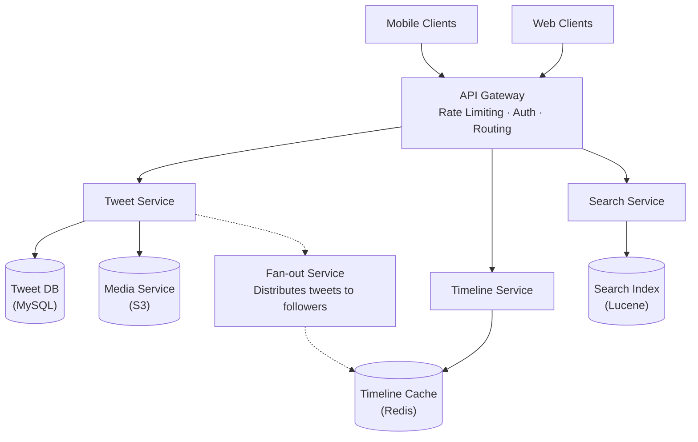
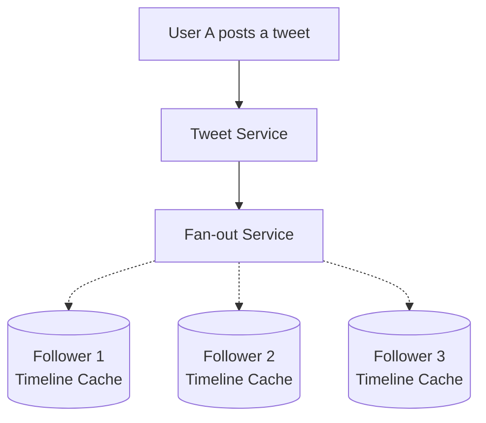
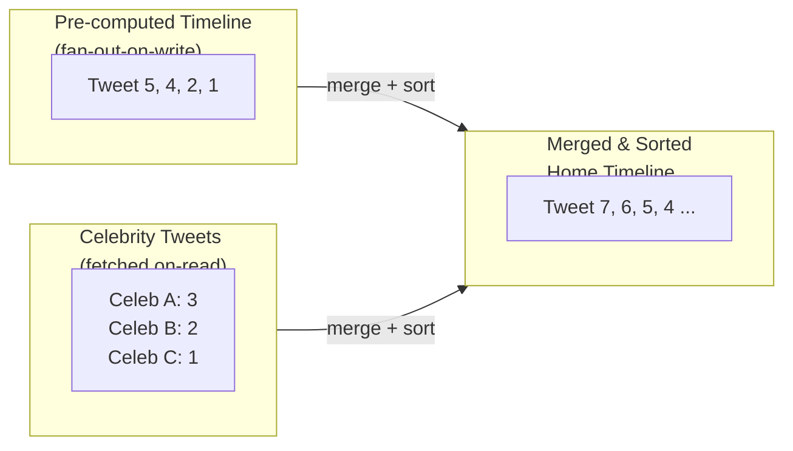
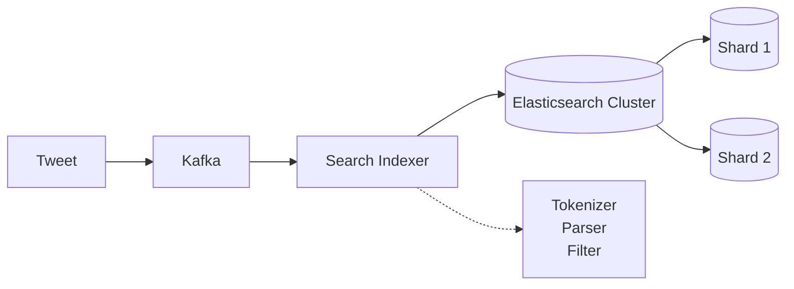

# Twitter システム設計

> **注意:** この記事は英語版からの翻訳です。コードブロック、Mermaidダイアグラム、企業名、技術スタック名は原文のまま記載しています。

## TL;DR

Twitterは、ファンアウトオンライト（fan-out-on-write）アーキテクチャを用いて、1日5億件以上のツイートを処理し、ホームタイムラインを配信しています。主な課題には、数百万人のフォロワーを持つセレブリティアカウント（ファンアウトが高コストになる）、リアルタイム検索インデックス、トレンド検出があります。このシステムはハイブリッドアプローチを採用しています：一般ユーザーにはファンアウトオンライト、セレブリティにはファンアウトオンリード（fan-out-on-read）です。

---

## コア要件

### 機能要件
- ツイートの投稿（280文字、メディア添付）
- ユーザーのフォロー/フォロー解除
- ホームタイムライン（フォローしているユーザーのツイート）
- ユーザータイムライン（ユーザー自身のツイート）
- ツイート検索
- トレンドトピック
- 通知（メンション、いいね、リツイート）

### 非機能要件
- 高可用性（99.99%）
- 低レイテンシのタイムライン読み取り（< 200ms）
- 1日5億件のツイート書き込みを処理
- 5,000万人以上のフォロワーを持つユーザーをサポート
- リアルタイムトレンド検出

---

## ハイレベルアーキテクチャ



---

## タイムラインアーキテクチャ

### ファンアウトオンライト（プッシュモデル）



各フォロワーのタイムラインキャッシュにツイートIDが追加されます。

```java
import com.twitter.finagle.Service;
import redis.clients.jedis.JedisCluster;
import redis.clients.jedis.Pipeline;
import java.util.List;
import java.util.concurrent.CompletableFuture;
import java.util.concurrent.ExecutorService;
import java.util.concurrent.Executors;

public class FanOutService {
    private final JedisCluster redis;
    private final FollowerService followerService;
    private final ExecutorService executor;
    private static final int MAX_TIMELINE_SIZE = 800; // Keep last 800 tweets

    public FanOutService(JedisCluster redis, FollowerService followerService) {
        this.redis = redis;
        this.followerService = followerService;
        this.executor = Executors.newFixedThreadPool(64);
    }

    /**
     * Distribute tweet to all followers' timelines.
     */
    public CompletableFuture<Void> fanOutTweet(Tweet tweet) {
        long userId = tweet.getAuthorId();

        return followerService.getFollowerCount(userId).thenComposeAsync(followerCount -> {
            // Check if user is a celebrity (high follower count)
            if (followerCount > 10_000) {
                // Don't fan out for celebrities - use fan-out-on-read
                return markAsCelebrityTweet(tweet);
            }

            // Get all followers and fan out
            return followerService.getFollowers(userId).thenAcceptAsync(followers -> {
                Pipeline pipe = redis.pipelined();

                for (Long followerId : followers) {
                    String timelineKey = "timeline:" + followerId;

                    // Add tweet ID to timeline (sorted set by timestamp)
                    pipe.zadd(timelineKey, tweet.getCreatedAt().toEpochMilli(), String.valueOf(tweet.getId()));

                    // Trim to max size
                    pipe.zremrangeByRank(timelineKey, 0, -MAX_TIMELINE_SIZE - 1);
                }

                pipe.sync();
            }, executor);
        }, executor);
    }

    /** Store in celebrity tweets index for fan-out-on-read. */
    private CompletableFuture<Void> markAsCelebrityTweet(Tweet tweet) {
        return CompletableFuture.runAsync(() -> {
            redis.zadd(
                "celebrity_tweets:" + tweet.getAuthorId(),
                tweet.getCreatedAt().toEpochMilli(),
                String.valueOf(tweet.getId())
            );
        }, executor);
    }
}
```

### セレブリティ向けファンアウトオンリード

```java
import com.twitter.finagle.Service;
import redis.clients.jedis.JedisCluster;
import java.util.*;
import java.util.concurrent.CompletableFuture;
import java.util.concurrent.ExecutorService;
import java.util.concurrent.Executors;
import java.util.stream.Collectors;

public class TimelineService extends Service<TimelineRequest, TimelineResponse> {
    private final JedisCluster redis;
    private final TweetService tweetService;
    private final FollowService followService;
    private final ExecutorService executor;

    public TimelineService(JedisCluster redis, TweetService tweetService, FollowService followService) {
        this.redis = redis;
        this.tweetService = tweetService;
        this.followService = followService;
        this.executor = Executors.newFixedThreadPool(32);
    }

    /**
     * Get home timeline with hybrid fan-out.
     */
    public CompletableFuture<List<Tweet>> getHomeTimeline(long userId, int count, Long maxId) {
        String timelineKey = "timeline:" + userId;

        // 1. Get pre-computed timeline (fan-out-on-write results)
        CompletableFuture<Set<String>> cachedFuture = CompletableFuture.supplyAsync(() -> {
            if (maxId != null) {
                double maxScore = redis.zscore(timelineKey, String.valueOf(maxId));
                return redis.zrevrangeByScore(timelineKey, maxScore, 0, 0, count);
            }
            return redis.zrevrange(timelineKey, 0, count - 1);
        }, executor);

        // 2. Get tweets from celebrities user follows
        CompletableFuture<List<String>> celebFuture = followService
            .getCelebrityFollowings(userId)
            .thenApplyAsync(celebrityIds -> {
                List<String> celebTweets = new ArrayList<>();
                for (Long celebrityId : celebrityIds) {
                    Set<String> tweets = redis.zrevrange("celebrity_tweets:" + celebrityId, 0, count - 1);
                    celebTweets.addAll(tweets);
                }
                return celebTweets;
            }, executor);

        // 3. Merge and sort
        return cachedFuture.thenCombineAsync(celebFuture, (cached, celeb) -> {
            Set<String> allIds = new LinkedHashSet<>(cached);
            allIds.addAll(celeb);
            return allIds;
        }, executor).thenComposeAsync(allIds -> {
            return tweetService.getTweetsBatch(
                allIds.stream().map(Long::parseLong).collect(Collectors.toList())
            );
        }, executor).thenApplyAsync(tweets -> {
            tweets.sort(Comparator.comparing(Tweet::getCreatedAt).reversed());
            return tweets.subList(0, Math.min(count, tweets.size()));
        }, executor);
    }
}
```



---

## ツイートストレージ

### データベーススキーマ

```sql
-- Tweets table (sharded by tweet_id)
CREATE TABLE tweets (
    id BIGINT PRIMARY KEY,           -- Snowflake ID
    author_id BIGINT NOT NULL,
    content VARCHAR(280) NOT NULL,
    reply_to_id BIGINT,              -- If this is a reply
    retweet_of_id BIGINT,            -- If this is a retweet
    quote_tweet_id BIGINT,           -- If this is a quote tweet
    media_ids JSON,                  -- Array of media IDs
    created_at TIMESTAMP NOT NULL,

    INDEX idx_author_created (author_id, created_at DESC),
    INDEX idx_reply (reply_to_id),
    INDEX idx_retweet (retweet_of_id)
) ENGINE=InnoDB;

-- User timeline (denormalized for fast reads)
CREATE TABLE user_timeline (
    user_id BIGINT NOT NULL,
    tweet_id BIGINT NOT NULL,
    created_at TIMESTAMP NOT NULL,

    PRIMARY KEY (user_id, tweet_id),
    INDEX idx_user_time (user_id, created_at DESC)
) ENGINE=InnoDB;

-- Follows relationship
CREATE TABLE follows (
    follower_id BIGINT NOT NULL,
    followee_id BIGINT NOT NULL,
    created_at TIMESTAMP NOT NULL,

    PRIMARY KEY (follower_id, followee_id),
    INDEX idx_followee (followee_id)
) ENGINE=InnoDB;
```

### ツイートID生成（Snowflake）

```java
import java.util.concurrent.atomic.AtomicLong;

/**
 * Twitter's Snowflake ID generator.
 * 64-bit IDs with embedded timestamp for ordering.
 *
 * Structure:
 * | 1 bit unused | 41 bits timestamp | 10 bits machine | 12 bits sequence |
 */
public class SnowflakeGenerator {
    private static final long TWITTER_EPOCH = 1288834974657L; // Nov 4, 2010
    private static final int MACHINE_ID_BITS = 10;
    private static final int SEQUENCE_BITS = 12;
    private static final long MAX_SEQUENCE = (1L << SEQUENCE_BITS) - 1; // 4095

    private final long machineId;
    private final AtomicLong sequence = new AtomicLong(0);
    private long lastTimestamp = -1L;

    public SnowflakeGenerator(int machineId) {
        this.machineId = machineId & 0x3FF; // 10 bits
    }

    private long currentMillis() {
        return System.currentTimeMillis();
    }

    private long waitNextMillis(long lastTs) {
        long ts = currentMillis();
        while (ts <= lastTs) {
            ts = currentMillis();
        }
        return ts;
    }

    public synchronized long nextId() {
        long timestamp = currentMillis();

        if (timestamp < lastTimestamp) {
            throw new IllegalStateException(
                "Clock moved backwards! Refusing to generate ID for "
                + (lastTimestamp - timestamp) + " milliseconds"
            );
        }

        if (timestamp == lastTimestamp) {
            long seq = sequence.incrementAndGet() & MAX_SEQUENCE;
            if (seq == 0) {
                timestamp = waitNextMillis(lastTimestamp);
            }
        } else {
            sequence.set(0);
        }

        lastTimestamp = timestamp;

        // Compose ID with bit manipulation
        return ((timestamp - TWITTER_EPOCH) << (MACHINE_ID_BITS + SEQUENCE_BITS))
             | (machineId << SEQUENCE_BITS)
             | sequence.get();
    }

    /** Extract creation timestamp from a Snowflake ID. */
    public static long extractTimestamp(long snowflakeId) {
        return (snowflakeId >> (MACHINE_ID_BITS + SEQUENCE_BITS)) + TWITTER_EPOCH;
    }

    // Usage
    public static void main(String[] args) {
        SnowflakeGenerator generator = new SnowflakeGenerator(1);
        long tweetId = generator.nextId(); // e.g., 1234567890123456789
        long createdAt = extractTimestamp(tweetId);
    }
}
```

---

## 検索アーキテクチャ



```java
import com.twitter.finagle.Service;
import org.elasticsearch.action.index.IndexRequest;
import org.elasticsearch.action.search.SearchRequest;
import org.elasticsearch.action.search.SearchResponse;
import org.elasticsearch.client.RestHighLevelClient;
import org.elasticsearch.index.query.BoolQueryBuilder;
import org.elasticsearch.index.query.QueryBuilders;
import org.elasticsearch.search.builder.SearchSourceBuilder;
import org.elasticsearch.search.sort.SortOrder;

import java.util.*;
import java.util.concurrent.CompletableFuture;
import java.util.concurrent.ExecutorService;
import java.util.concurrent.Executors;
import java.util.regex.Matcher;
import java.util.regex.Pattern;
import java.util.stream.Collectors;

public class TweetSearchService extends Service<SearchRequest, SearchResponse> {
    private final RestHighLevelClient esClient;
    private final ExecutorService executor;
    private static final String INDEX_NAME = "tweets";
    private static final Pattern HASHTAG_PATTERN = Pattern.compile("#(\\w+)");
    private static final Pattern MENTION_PATTERN = Pattern.compile("@(\\w+)");

    public TweetSearchService(RestHighLevelClient esClient) {
        this.esClient = esClient;
        this.executor = Executors.newFixedThreadPool(16);
    }

    /** Index tweet for search. */
    public CompletableFuture<Void> indexTweet(Tweet tweet) {
        return CompletableFuture.runAsync(() -> {
            Map<String, Object> doc = new HashMap<>();
            doc.put("id", tweet.getId());
            doc.put("text", tweet.getContent());
            doc.put("author_id", tweet.getAuthorId());
            doc.put("author_username", tweet.getAuthor().getUsername());
            doc.put("created_at", tweet.getCreatedAt().toString());
            doc.put("hashtags", extractHashtags(tweet.getContent()));
            doc.put("mentions", extractMentions(tweet.getContent()));
            doc.put("engagement", Map.of(
                "likes", tweet.getLikeCount(),
                "retweets", tweet.getRetweetCount(),
                "replies", tweet.getReplyCount()
            ));

            IndexRequest request = new IndexRequest(INDEX_NAME)
                .id(String.valueOf(tweet.getId()))
                .source(doc);
            esClient.index(request);
        }, executor);
    }

    /** Search tweets with relevance ranking. */
    public CompletableFuture<List<Map<String, Object>>> search(
            String query, Map<String, String> filters, int size) {
        return CompletableFuture.supplyAsync(() -> {
            BoolQueryBuilder boolQuery = QueryBuilders.boolQuery()
                .must(QueryBuilders.multiMatchQuery(query, "text^2", "author_username")
                    .type("best_fields"));

            // Apply filters
            if (filters != null) {
                if (filters.containsKey("from_user")) {
                    boolQuery.filter(QueryBuilders.termQuery("author_username", filters.get("from_user")));
                }
                if (filters.containsKey("since")) {
                    boolQuery.filter(QueryBuilders.rangeQuery("created_at").gte(filters.get("since")));
                }
            }

            SearchSourceBuilder source = new SearchSourceBuilder()
                .query(boolQuery)
                .sort("_score", SortOrder.DESC)
                .sort("created_at", SortOrder.DESC)
                .size(size);

            SearchRequest searchRequest = new SearchRequest(INDEX_NAME).source(source);
            SearchResponse response = esClient.search(searchRequest);

            return Arrays.stream(response.getHits().getHits())
                .map(hit -> hit.getSourceAsMap())
                .collect(Collectors.toList());
        }, executor);
    }

    private List<String> extractHashtags(String text) {
        Matcher matcher = HASHTAG_PATTERN.matcher(text);
        List<String> tags = new ArrayList<>();
        while (matcher.find()) { tags.add(matcher.group(1)); }
        return tags;
    }

    private List<String> extractMentions(String text) {
        Matcher matcher = MENTION_PATTERN.matcher(text);
        List<String> mentions = new ArrayList<>();
        while (matcher.find()) { mentions.add(matcher.group(1)); }
        return mentions;
    }
}
```

---

## トレンドトピック

```java
import redis.clients.jedis.JedisCluster;
import redis.clients.jedis.ScanParams;
import redis.clients.jedis.ScanResult;

import java.util.*;
import java.util.concurrent.CompletableFuture;
import java.util.concurrent.ExecutorService;
import java.util.concurrent.Executors;
import java.util.stream.Collectors;

/**
 * Detect trending topics using sliding window and velocity.
 * Backed by Redis (Twemcache) with Storm for real-time stream processing.
 */
public class TrendingService {
    private final JedisCluster redis;
    private final ExecutorService executor;
    private static final int WINDOW_SIZE = 3600;  // 1 hour window
    private static final int BUCKET_SIZE = 60;    // 1 minute buckets

    public TrendingService(JedisCluster redis) {
        this.redis = redis;
        this.executor = Executors.newFixedThreadPool(16);
    }

    /** Record hashtag occurrence. */
    public CompletableFuture<Void> recordHashtag(String hashtag, String location) {
        return CompletableFuture.runAsync(() -> {
            long now = System.currentTimeMillis() / 1000;
            long bucket = now / BUCKET_SIZE;

            String key = "trend:" + location + ":" + hashtag;
            redis.hincrBy(key, String.valueOf(bucket), 1);
            redis.expire(key, WINDOW_SIZE * 2);
        }, executor);
    }

    /** Get trending topics with velocity score. */
    public CompletableFuture<List<Map.Entry<String, Double>>> getTrending(String location, int count) {
        return CompletableFuture.supplyAsync(() -> {
            long now = System.currentTimeMillis() / 1000;
            long currentBucket = now / BUCKET_SIZE;

            String pattern = "trend:" + location + ":*";
            Set<String> keys = scanKeys(pattern);
            Map<String, Double> scores = new HashMap<>();

            for (String key : keys) {
                String hashtag = key.substring(key.lastIndexOf(':') + 1);
                Map<String, String> buckets = redis.hgetAll(key);

                long recentCount = 0;
                long olderCount = 0;

                for (Map.Entry<String, String> entry : buckets.entrySet()) {
                    long bucket = Long.parseLong(entry.getKey());
                    long cnt = Long.parseLong(entry.getValue());

                    // Skip expired buckets
                    if ((currentBucket - bucket) * BUCKET_SIZE > WINDOW_SIZE) continue;

                    if (currentBucket - bucket <= 10) { // Last 10 minutes
                        recentCount += cnt;
                    } else {
                        olderCount += cnt;
                    }
                }

                long total = recentCount + olderCount;
                if (total < 10) continue; // Minimum threshold

                double velocity = (recentCount * 2.0 + olderCount) / (WINDOW_SIZE / 60.0);
                scores.put(hashtag, velocity);
            }

            return scores.entrySet().stream()
                .sorted(Map.Entry.<String, Double>comparingByValue().reversed())
                .limit(count)
                .collect(Collectors.toList());
        }, executor);
    }

    /** Get trends personalized to user's interests. */
    public CompletableFuture<List<Map.Entry<String, Double>>> getPersonalizedTrends(
            long userId, String location) {
        return CompletableFuture.supplyAsync(() -> getUserInterests(userId), executor)
            .thenCombine(getTrending(location, 50), (interests, globalTrends) -> {
                Map<String, Double> boosted = new LinkedHashMap<>();
                for (Map.Entry<String, Double> entry : globalTrends) {
                    double boost = interests.contains(entry.getKey().toLowerCase()) ? 1.5 : 1.0;
                    boosted.put(entry.getKey(), entry.getValue() * boost);
                }
                return boosted.entrySet().stream()
                    .sorted(Map.Entry.<String, Double>comparingByValue().reversed())
                    .collect(Collectors.toList());
            });
    }

    private Set<String> scanKeys(String pattern) {
        Set<String> keys = new HashSet<>();
        ScanParams params = new ScanParams().match(pattern).count(100);
        String cursor = "0";
        do {
            ScanResult<String> result = redis.scan(cursor, params);
            keys.addAll(result.getResult());
            cursor = result.getCursor();
        } while (!"0".equals(cursor));
        return keys;
    }

    private Set<String> getUserInterests(long userId) {
        return redis.smembers("user:interests:" + userId);
    }
}
```

---

## 通知

```java
import redis.clients.jedis.JedisCluster;
import java.util.*;
import java.util.concurrent.CompletableFuture;
import java.util.concurrent.ExecutorService;
import java.util.concurrent.Executors;
import java.util.stream.Collectors;

public enum NotificationType {
    LIKE("like"), RETWEET("retweet"), REPLY("reply"),
    MENTION("mention"), FOLLOW("follow"), QUOTE("quote");

    private final String value;
    NotificationType(String value) { this.value = value; }
    public String getValue() { return value; }
}

public class Notification {
    private final long id;
    private final long userId;
    private final NotificationType type;
    private final long actorId;
    private final Long tweetId;       // nullable
    private final double createdAt;

    public Notification(long id, long userId, NotificationType type,
                        long actorId, Long tweetId, double createdAt) {
        this.id = id;
        this.userId = userId;
        this.type = type;
        this.actorId = actorId;
        this.tweetId = tweetId;
        this.createdAt = createdAt;
    }

    // Getters omitted for brevity
    public long getId() { return id; }
    public long getUserId() { return userId; }
    public NotificationType getType() { return type; }
    public long getActorId() { return actorId; }
    public Long getTweetId() { return tweetId; }
    public double getCreatedAt() { return createdAt; }
}

public class NotificationService {
    private final JedisCluster redis;
    private final PushService pushService;
    private final ExecutorService executor;
    private static final int MAX_NOTIFICATIONS = 1000;

    public NotificationService(JedisCluster redis, PushService pushService) {
        this.redis = redis;
        this.pushService = pushService;
        this.executor = Executors.newFixedThreadPool(16);
    }

    /** Create and deliver notification. */
    public CompletableFuture<Void> createNotification(long userId, Notification notification) {
        return CompletableFuture.runAsync(() -> {
            String key = "notifications:" + userId;

            // Store in notification sorted set
            redis.zadd(key, notification.getCreatedAt(), String.valueOf(notification.getId()));

            // Trim old notifications
            redis.zremrangeByRank(key, 0, -MAX_NOTIFICATIONS - 1);

            // Increment unread count
            redis.incr("notifications:unread:" + userId);

            // Check notification preferences and send push
            Map<String, String> prefs = getNotificationPrefs(userId, notification.getType());
            if ("true".equals(prefs.get("push_enabled"))) {
                pushService.send(
                    userId,
                    formatTitle(notification),
                    formatBody(notification)
                );
            }
        }, executor);
    }

    /** Get user's notifications. */
    public CompletableFuture<List<Notification>> getNotifications(long userId, int count, Double cursor) {
        return CompletableFuture.supplyAsync(() -> {
            String key = "notifications:" + userId;
            Set<String> ids;

            if (cursor != null) {
                ids = redis.zrevrangeByScore(key, cursor, 0, 0, count);
            } else {
                ids = redis.zrevrange(key, 0, count - 1);
            }

            List<Notification> notifications = fetchNotifications(ids);

            // Mark as read
            redis.set("notifications:unread:" + userId, "0");
            return notifications;
        }, executor);
    }

    /**
     * Aggregate similar notifications.
     * e.g., "User A and 5 others liked your tweet"
     */
    public CompletableFuture<Void> aggregateNotifications(
            long userId, long tweetId, Notification notification) {
        return CompletableFuture.runAsync(() -> {
            String key = "notification:aggregate:" + tweetId + ":" + notification.getType().getValue();

            redis.sadd(key, String.valueOf(notification.getActorId()));
            redis.expire(key, 86400); // 24 hours

            long aggregatedCount = redis.scard(key);

            if (aggregatedCount == 1) {
                createNotification(userId, notification).join();
            } else {
                updateAggregatedNotification(userId, tweetId, notification.getType(), aggregatedCount);
            }
        }, executor);
    }

    private Map<String, String> getNotificationPrefs(long userId, NotificationType type) {
        return redis.hgetAll("notification:prefs:" + userId + ":" + type.getValue());
    }

    private String formatTitle(Notification n) { /* format based on type */ return ""; }
    private String formatBody(Notification n) { /* format based on type */ return ""; }
    private List<Notification> fetchNotifications(Set<String> ids) { return Collections.emptyList(); }
    private void updateAggregatedNotification(long userId, long tweetId, NotificationType type, long count) {}
}
```

---

## 主要メトリクスとスケール

| メトリクス | 値 |
|--------|-------|
| デイリーアクティブユーザー | 2億人以上 |
| 1日あたりのツイート数 | 5億件以上 |
| タイムライン読み取り/秒 | 30万以上 |
| 検索クエリ/秒 | 5万以上 |
| 平均レイテンシ（タイムライン） | < 100ms |
| ファンアウト時間（非セレブリティ） | < 5秒 |

---

## 本番環境での知見

### セレブリティのファンアウトとサンダリングハード

5,000万人以上のフォロワーを持つセレブリティがツイートを投稿した場合、単純なファンアウトオンライトでは5,000万のRedisソートセットへの書き込みが一度に発生します。これにより、ネットワークリンクの飽和、Twemcacheのメモリ制限の超過、ファンアウトワーカーフリート全体でのGCポーズの急増といったサンダリングハード（thundering herd）が発生します。Twitterの対策はハイブリッドモデルです。フォロワー数が閾値を超えるアカウントは「セレブリティ」としてフラグが立てられ、そのツイートはファンアウトされません。代わりに、Timeline Serviceが読み取り時にセレブリティのツイートをマージします。この閾値は動的であり、高トラフィックイベント（例：Super Bowl）時には書き込み負荷を軽減するために引き下げることができます。追加の安全策として、自動化されたボットアカウントがフォロワーを蓄積しても書き込みストームを引き起こせないよう、著者ごとのファンアウトキューにレートリミットが設けられています。

### Manhattan KVストアの採用理由

Twitterは、以前のMySQLベースのタイムラインストアをManhattanに置き換えました。Manhattanは、社内開発のマルチテナント型・結果整合性キーバリューストアです。動機は運用面にありました。MySQLのシャーディングは手動でのシャード分割、ユーザー移行のためのクロスシャードクエリ、慎重なスキーマ進化が必要でした。Manhattanは、自動パーティションリバランス、チューナブルな一貫性（必要に応じてキーごとのread-your-writes、それ以外は結果整合性）、CRDTライクなマージセマンティクスによるネイティブなマルチデータセンターレプリケーションを提供します。タイムラインデータ、ユーザーメタデータ、ソーシャルグラフの隣接リストを格納します。ストレージエンジンは書き込み負荷の高いワークロードに最適化されたLSMツリーを使用し、逆引き（例：「このユーザーをフォローしているのは誰か？」）のためのセカンダリインデックスをサポートします。APIはレンジスキャンを公開しており、Snowflake IDをキーとしたページネーション付きのタイムライン読み取りに自然にマッピングされます。

### Finagle RPCのサーキットブレーキング

Twitterにおけるすべてのサービス間呼び出しは、Netty上に構築されたプロトコル非依存のRPCフレームワークであるFinagleを通じて行われます。Finagleは、連続失敗ポリシーを使用したサーキットブレーキングを組み込みで提供します。N回連続の失敗（またはスライディングウィンドウにおける失敗率が閾値を超えた場合）の後、サーキットが開き、後続のリクエストは設定可能なクールダウン期間中にフェイルファストされます。これにより、単一の劣化したダウンストリーム（例：遅いElasticsearchシャード）が呼び出し元のプール内のすべてのスレッドを消費し、完全な障害にカスケードすることを防ぎます。Finagleはまた、Thriftコンテキストを介して伝播されるリクエストレベルのデッドラインもサポートしています。タイムライン読み取りがツイート検索サービスに到達する時点で既に200msのバジェットを超過している場合、ダウンストリーム呼び出しは早期に中止されます。ロードバランシングは、レイテンシ対応のスコアリングを備えた「power of two choices」アルゴリズム（p2c）を使用し、サーキットがトリップする前に遅いホストからリクエストをルーティングします。

### SnowflakeのID生成におけるクロックスキュー

Snowflakeの正確性は、単調に増加するクロックに依存しています。本番環境では、NTP補正やVMライブマイグレーションによりシステムクロックが後方にジャンプする可能性があります。`nextId()`が`timestamp < lastTimestamp`を検出した場合、重複や順序外のIDを発行するのではなく例外をスローします。Twitterの運用上の対応は3つあります。(1) NTPを`-x`フラグ付きで実行し、急激なジャンプではなくスルーでクロックを補正し、補正を500ppmのドリフトに制限します。(2) ローカルクロックと複数のNTPソースを比較するサイドカーを介してクロックオフセットを監視し、スキューが10msを超えた場合にアラートを発します。(3) 異なるマシンIDを持つ予備のSnowflakeワーカーをプロビジョニングし、クロック逆行によりIDの発行を拒否するワーカーが発生した場合、影響を受けたホストが再同期する間、正常なワーカーにトラフィックを移行します。41ビットのタイムスタンプフィールドは、Twitterエポック（2010年11月4日）から約69年の余裕を提供するため、IDスペースの枯渇は当面の懸念ではありませんが、マシンIDの割り当て（10ビット = 1024ワーカー）にはデータセンター間の衝突を防ぐためにZooKeeperによる調整が必要です。

---

## 主な学び

1. **ハイブリッドファンアウト**: 一般ユーザーにはファンアウトオンライト（タイムラインの事前計算）、セレブリティにはファンアウトオンリード（読み取り時にマージ）を使用します

2. **Snowflake ID**: 時間順に並ぶ分散ID生成により、効率的な範囲クエリと暗黙的な順序付けが可能です

3. **タイムラインにRedisを使用**: 高速な読み取りのためにRedisでタイムラインキャッシュを行い、MySQLで永続化します

4. **リアルタイム検索**: 別個の検索インデックス（Elasticsearch）を使用し、Kafkaを介したほぼリアルタイムの取り込みを行います

5. **速度ベースのトレンド検出**: 絶対的なカウントではなく、変化率に基づいてトレンドを検出します

6. **通知の集約**: 類似の通知をグループ化（「Aさんと他5人がいいねしました...」）してノイズを削減します
