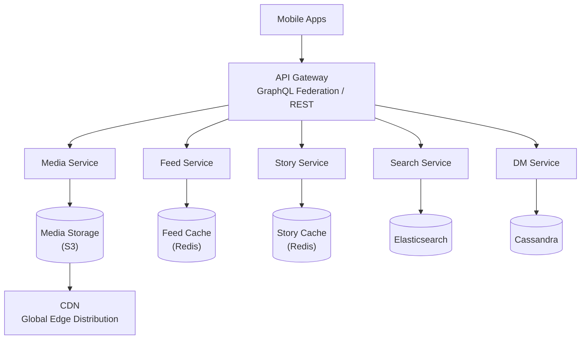
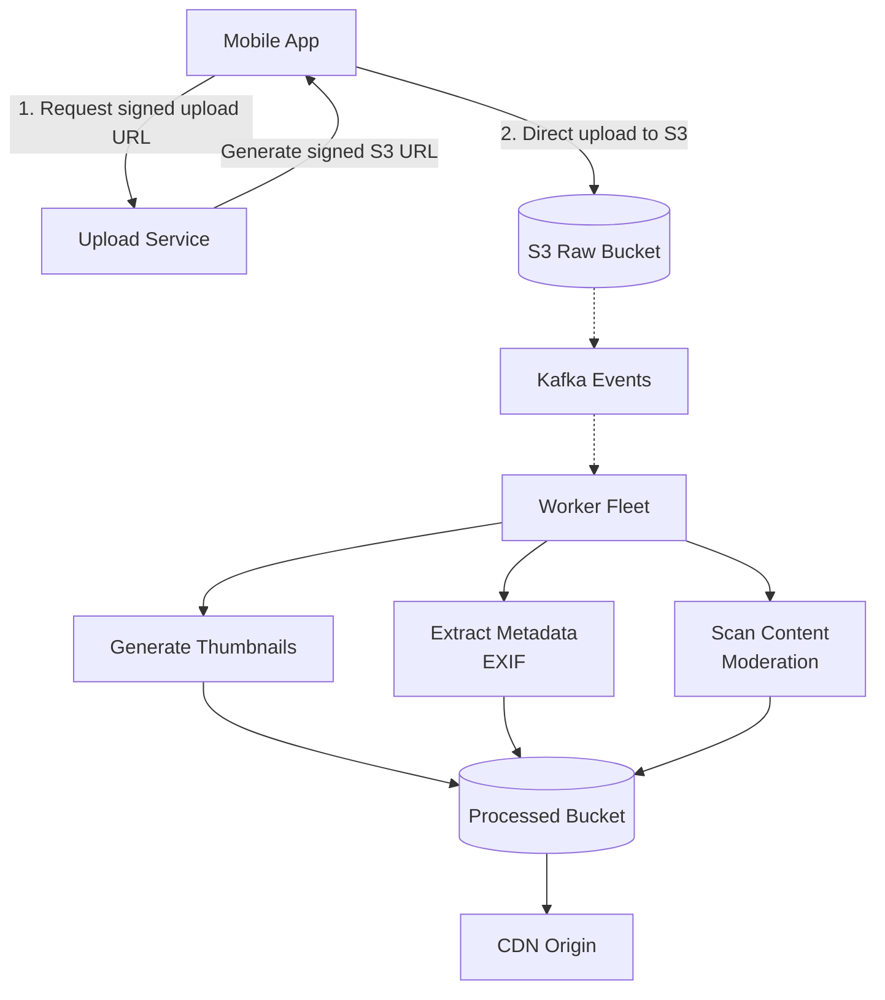

# Instagram システム設計

> **注意:** この記事は英語版からの翻訳です。コードブロック、Mermaidダイアグラム、企業名、技術スタック名は原文のまま記載しています。

## TL;DR

Instagramは月間20億人以上のアクティブユーザーを抱え、メディアリッチなコンテンツ（写真、動画、ストーリーズ）に特化しています。主な課題には、大規模な画像/動画の効率的なストレージと配信、パーソナライズされたフィードランキング（時系列ではない）、バイラルコンテンツの処理があります。アーキテクチャはCDN配信、非同期処理パイプライン、MLベースのランキングを重視しています。

---

## コア要件

### 機能要件
- 写真と動画のアップロード
- ユーザーのフォロー/フォロー解除
- ニュースフィード（アルゴリズムによるランキング）
- ストーリーズ（24時間限定のエフェメラルコンテンツ）
- ダイレクトメッセージ
- 発見/コンテンツの探索
- いいね、コメント、保存
- 検索（ユーザー、ハッシュタグ、位置情報）

### 非機能要件
- 高可用性（99.99%）
- 低レイテンシのフィード読み込み（< 500ms）
- 1日1億枚以上の写真アップロードを処理
- 効率的なメディアストレージと配信
- バイラルコンテンツ（突然のスパイク）をサポート

---

## ハイレベルアーキテクチャ



---

## メディアアップロードパイプライン



```python
import boto3
import hashlib
from dataclasses import dataclass
from typing import List
import asyncio

@dataclass
class MediaVariant:
    name: str
    width: int
    height: int
    quality: int

class MediaProcessingService:
    """Process uploaded media into multiple variants."""

    VARIANTS = [
        MediaVariant("thumbnail", 150, 150, 80),
        MediaVariant("small", 320, 320, 80),
        MediaVariant("medium", 640, 640, 85),
        MediaVariant("large", 1080, 1080, 90),
        MediaVariant("original", 0, 0, 100),  # Keep original
    ]

    def __init__(self, s3_client, sqs_client):
        self.s3 = s3_client
        self.sqs = sqs_client
        self.raw_bucket = "instagram-raw"
        self.processed_bucket = "instagram-processed"

    async def process_upload(self, media_id: str, s3_key: str):
        """Process uploaded media."""

        # Download original
        original = await self._download(self.raw_bucket, s3_key)

        # Generate variants in parallel
        tasks = [
            self._generate_variant(media_id, original, variant)
            for variant in self.VARIANTS
        ]

        variant_keys = await asyncio.gather(*tasks)

        # Store variant metadata
        await self._store_variant_metadata(media_id, variant_keys)

        # Trigger CDN prefetch for popular regions
        await self._prefetch_to_cdn(variant_keys)

        return variant_keys

    async def _generate_variant(
        self,
        media_id: str,
        original: bytes,
        variant: MediaVariant
    ) -> str:
        """Generate a single variant."""
        from PIL import Image
        import io

        img = Image.open(io.BytesIO(original))

        if variant.width > 0:
            # Resize maintaining aspect ratio
            img.thumbnail((variant.width, variant.height), Image.LANCZOS)

        # Save to buffer
        buffer = io.BytesIO()
        img.save(buffer, format='JPEG', quality=variant.quality)
        buffer.seek(0)

        # Upload to S3
        key = f"media/{media_id}/{variant.name}.jpg"
        await self._upload(self.processed_bucket, key, buffer.read())

        return key

    def get_cdn_url(self, media_id: str, variant: str = "medium") -> str:
        """Get CDN URL for media variant."""
        return f"https://cdn.instagram.com/media/{media_id}/{variant}.jpg"
```

---

## ニュースフィードアーキテクチャ

### ランキングベースのフィード（時系列ではない）

```python
from dataclasses import dataclass
from typing import List, Dict
import numpy as np

@dataclass
class FeedCandidate:
    post_id: str
    author_id: str
    created_at: float
    features: Dict[str, float]

class FeedRankingService:
    """
    Rank feed posts using ML model.
    Instagram uses engagement prediction models.
    """

    def __init__(self, model_service, feature_store):
        self.model = model_service
        self.features = feature_store

    async def generate_feed(
        self,
        user_id: str,
        count: int = 20
    ) -> List[str]:
        """Generate ranked feed for user."""

        # 1. Candidate Generation
        candidates = await self._get_candidates(user_id)

        # 2. Feature Extraction
        enriched = await self._extract_features(user_id, candidates)

        # 3. Ranking
        scored = await self._score_candidates(enriched)

        # 4. Diversification
        diversified = self._diversify(scored)

        # 5. Final selection
        return [c.post_id for c in diversified[:count]]

    async def _get_candidates(self, user_id: str) -> List[FeedCandidate]:
        """
        Get candidate posts from followed users.
        Also includes some explore candidates for discovery.
        """
        following = await self._get_following(user_id)

        candidates = []

        # Recent posts from following (last 3 days)
        for followee_id in following:
            posts = await self._get_recent_posts(followee_id, days=3)
            candidates.extend(posts)

        # Add some explore candidates (10%)
        explore_candidates = await self._get_explore_candidates(user_id)
        candidates.extend(explore_candidates[:len(candidates) // 10])

        return candidates

    async def _extract_features(
        self,
        user_id: str,
        candidates: List[FeedCandidate]
    ) -> List[FeedCandidate]:
        """Extract ranking features for candidates."""

        for candidate in candidates:
            # User-author affinity
            candidate.features['affinity'] = await self.features.get_affinity(
                user_id, candidate.author_id
            )

            # Post engagement rate
            candidate.features['engagement_rate'] = await self.features.get_engagement_rate(
                candidate.post_id
            )

            # Recency (time decay)
            age_hours = (time.time() - candidate.created_at) / 3600
            candidate.features['recency'] = 1.0 / (1.0 + age_hours / 24)

            # Content type affinity
            candidate.features['content_affinity'] = await self.features.get_content_affinity(
                user_id, candidate.post_id
            )

            # Author engagement history
            candidate.features['author_engagement'] = await self.features.get_author_engagement(
                user_id, candidate.author_id
            )

        return candidates

    async def _score_candidates(
        self,
        candidates: List[FeedCandidate]
    ) -> List[FeedCandidate]:
        """Score candidates using ML model."""

        # Prepare feature matrix
        feature_names = ['affinity', 'engagement_rate', 'recency',
                        'content_affinity', 'author_engagement']

        X = np.array([
            [c.features[f] for f in feature_names]
            for c in candidates
        ])

        # Get predictions (probability of engagement)
        scores = await self.model.predict(X)

        for candidate, score in zip(candidates, scores):
            candidate.features['score'] = score

        # Sort by score
        candidates.sort(key=lambda c: c.features['score'], reverse=True)

        return candidates

    def _diversify(
        self,
        candidates: List[FeedCandidate]
    ) -> List[FeedCandidate]:
        """
        Diversify feed to avoid showing too many posts
        from same author or same content type.
        """
        result = []
        author_counts = {}
        max_per_author = 3

        for candidate in candidates:
            author_id = candidate.author_id

            if author_counts.get(author_id, 0) < max_per_author:
                result.append(candidate)
                author_counts[author_id] = author_counts.get(author_id, 0) + 1

        return result
```

### フィードキャッシュ戦略

```python
class FeedCacheService:
    """
    Cache pre-computed feeds for fast reads.
    Invalidate on new posts from followed users.
    """

    def __init__(self, redis_client, ranking_service):
        self.redis = redis_client
        self.ranking = ranking_service
        self.cache_ttl = 300  # 5 minutes

    async def get_feed(
        self,
        user_id: str,
        cursor: str = None,
        count: int = 20
    ) -> tuple[List[str], str]:
        """Get feed with pagination."""

        cache_key = f"feed:v2:{user_id}"

        # Try cache first
        cached = await self.redis.get(cache_key)

        if not cached:
            # Generate and cache feed
            post_ids = await self.ranking.generate_feed(user_id, count=100)
            await self.redis.setex(
                cache_key,
                self.cache_ttl,
                json.dumps(post_ids)
            )
        else:
            post_ids = json.loads(cached)

        # Pagination
        start_idx = 0
        if cursor:
            try:
                start_idx = post_ids.index(cursor) + 1
            except ValueError:
                start_idx = 0

        page = post_ids[start_idx:start_idx + count]
        next_cursor = page[-1] if len(page) == count else None

        return page, next_cursor

    async def invalidate_feed(self, user_id: str):
        """Invalidate user's feed cache."""
        await self.redis.delete(f"feed:v2:{user_id}")

    async def handle_new_post(self, author_id: str, post_id: str):
        """
        Handle new post - invalidate followers' feeds.
        Done async to not block post creation.
        """
        followers = await self._get_followers(author_id)

        pipe = self.redis.pipeline()
        for follower_id in followers:
            pipe.delete(f"feed:v2:{follower_id}")
        await pipe.execute()
```

---

## ストーリーズアーキテクチャ

```python
from datetime import datetime, timedelta
from typing import List, Optional
import json

@dataclass
class Story:
    id: str
    author_id: str
    media_url: str
    created_at: datetime
    expires_at: datetime
    view_count: int = 0
    viewers: List[str] = None

class StoryService:
    """
    Stories are ephemeral content (24 hours).
    Stored in Redis with TTL.
    """

    def __init__(self, redis_client, media_service):
        self.redis = redis_client
        self.media = media_service
        self.story_ttl = 86400  # 24 hours

    async def create_story(
        self,
        user_id: str,
        media_id: str
    ) -> Story:
        """Create a new story."""
        story_id = generate_id()
        now = datetime.utcnow()

        story = Story(
            id=story_id,
            author_id=user_id,
            media_url=self.media.get_cdn_url(media_id),
            created_at=now,
            expires_at=now + timedelta(hours=24),
            viewers=[]
        )

        # Store story data
        story_key = f"story:{story_id}"
        await self.redis.setex(
            story_key,
            self.story_ttl,
            json.dumps(story.__dict__, default=str)
        )

        # Add to user's story list
        user_stories_key = f"user_stories:{user_id}"
        await self.redis.zadd(
            user_stories_key,
            {story_id: now.timestamp()}
        )
        await self.redis.expire(user_stories_key, self.story_ttl)

        # Notify followers
        await self._notify_followers(user_id, story_id)

        return story

    async def get_stories_feed(self, user_id: str) -> List[dict]:
        """
        Get story trays for users the viewer follows.
        Returns list of users with active stories.
        """
        following = await self._get_following(user_id)

        story_trays = []

        for followee_id in following:
            stories = await self._get_user_stories(followee_id)

            if stories:
                # Get unseen count
                unseen = await self._count_unseen(user_id, followee_id, stories)

                story_trays.append({
                    'user_id': followee_id,
                    'story_count': len(stories),
                    'unseen_count': unseen,
                    'latest_story_at': stories[0]['created_at'],
                    'preview_url': stories[0]['media_url']
                })

        # Sort by unseen first, then by latest
        story_trays.sort(
            key=lambda x: (x['unseen_count'] == 0, -x['latest_story_at']),
        )

        return story_trays

    async def view_story(self, viewer_id: str, story_id: str):
        """Record story view."""
        view_key = f"story_views:{story_id}"

        # Add to viewers set
        await self.redis.sadd(view_key, viewer_id)

        # Increment view count
        await self.redis.hincrby(f"story:{story_id}", "view_count", 1)

        # Track that user has seen this story
        seen_key = f"stories_seen:{viewer_id}"
        await self.redis.sadd(seen_key, story_id)
        await self.redis.expire(seen_key, self.story_ttl)

    async def _get_user_stories(self, user_id: str) -> List[dict]:
        """Get all active stories for a user."""
        story_ids = await self.redis.zrevrange(
            f"user_stories:{user_id}",
            0, -1
        )

        stories = []
        for story_id in story_ids:
            data = await self.redis.get(f"story:{story_id.decode()}")
            if data:
                stories.append(json.loads(data))

        return stories
```

---

## 発見/ディスカバリー

```python
class ExploreService:
    """
    Personalized content discovery.
    Uses collaborative filtering and content-based recommendations.
    """

    def __init__(self, redis_client, ml_service, feature_store):
        self.redis = redis_client
        self.ml = ml_service
        self.features = feature_store

    async def get_explore_feed(
        self,
        user_id: str,
        count: int = 30
    ) -> List[str]:
        """Generate personalized explore feed."""

        # 1. Get user interests
        interests = await self._get_user_interests(user_id)

        # 2. Get candidate posts
        candidates = await self._get_explore_candidates(interests)

        # 3. Filter already seen
        seen = await self._get_seen_posts(user_id)
        candidates = [c for c in candidates if c.post_id not in seen]

        # 4. Score and rank
        scored = await self._score_explore_candidates(user_id, candidates)

        # 5. Diversify by topic/author
        diversified = self._diversify_explore(scored)

        return [c.post_id for c in diversified[:count]]

    async def _get_user_interests(self, user_id: str) -> List[str]:
        """
        Infer user interests from:
        - Posts they've liked
        - Accounts they follow
        - Time spent viewing content
        - Hashtags they engage with
        """
        # Get recent engagements
        recent_likes = await self.features.get_recent_likes(user_id, days=30)

        # Extract topics/hashtags from liked posts
        topics = []
        for post_id in recent_likes:
            post_topics = await self.features.get_post_topics(post_id)
            topics.extend(post_topics)

        # Get top interests by frequency
        from collections import Counter
        topic_counts = Counter(topics)
        top_interests = [t for t, c in topic_counts.most_common(20)]

        return top_interests

    async def _get_explore_candidates(
        self,
        interests: List[str]
    ) -> List[FeedCandidate]:
        """Get candidate posts for explore."""
        candidates = []

        # Posts trending in user's interest areas
        for interest in interests[:10]:
            trending = await self._get_trending_for_topic(interest)
            candidates.extend(trending)

        # Globally viral posts
        viral = await self._get_viral_posts()
        candidates.extend(viral)

        # Posts from suggested accounts
        suggested_accounts = await self._get_suggested_accounts()
        for account in suggested_accounts[:10]:
            posts = await self._get_top_posts(account)
            candidates.extend(posts)

        return candidates
```

---

## データストレージ

| システム | 種類 | 格納データ |
|--------|------|--------|
| PostgreSQL | リレーショナルDB | ユーザープロフィール、フォロー関係、認証、設定 |
| Cassandra | ワイドカラム | ユーザーフィード、アクティビティログ、コメント、いいね |
| Redis | インメモリキャッシュ | フィードキャッシュ、ストーリーデータ、セッション、レートリミット |
| S3 | オブジェクトストレージ | 写真、動画、サムネイル |
| Elasticsearch | 検索エンジン | ユーザー検索、ハッシュタグ検索、位置情報 |
| Kafka | イベントストリーミング | イベント、通知、アナリティクス |

---

## 主要メトリクスとスケール

| メトリクス | 値 |
|--------|-------|
| 月間アクティブユーザー | 20億人以上 |
| 1日あたりの写真アップロード数 | 1億枚以上 |
| 保存されている写真の総数 | 1,000億枚以上 |
| ストレージサイズ | エクサバイト |
| 平均画像バリアント数 | 1枚あたり5種類 |
| CDN帯域幅 | ペタバイト/日 |
| 1日あたりのフィード読み込み数 | 数十億回 |

---

## 主な学び

1. **S3への直接アップロード**: 署名付きURLを使用してメディアアップロードでアプリサーバーをバイパスし、非同期で処理します

2. **複数の画像バリアント**: サムネイルと各サイズを事前に生成し、デバイスに適したサイズを配信します

3. **MLランキングによるフィード**: エンゲージメント予測モデルがコンテンツをランキングします（時系列ではありません）

4. **ストーリーズにRedisを使用**: TTL付きのエフェメラルコンテンツで、永続化は不要です

5. **CDNが重要**: リクエストの大部分がエッジから配信され、オリジンへのアクセスはごくわずかです

6. **スケールにCassandraを使用**: 高書き込みワークロード（いいね、コメント、アクティビティ）にワイドカラムストアを使用します

7. **発見 = ディスカバリー**: パーソナライズされたレコメンデーションが、フォローだけでなくエンゲージメントを促進します
