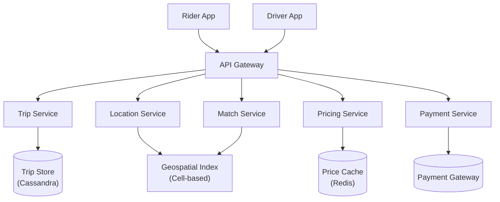
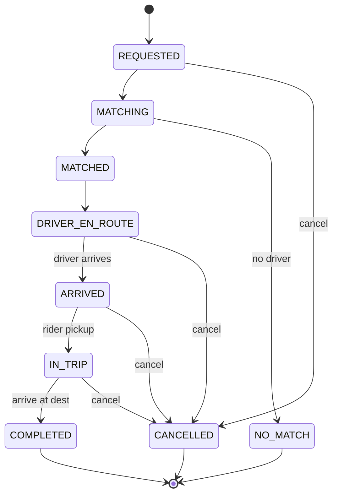

# Uber システム設計

> **注意:** この記事は英語版からの翻訳です。コードブロック、Mermaidダイアグラム、企業名、技術スタック名は原文のまま記載しています。

## TL;DR

Uberは、ライダーと近くのドライバーをリアルタイムでライドマッチングし、1秒あたり数百万の位置情報更新を処理しています。主な課題には、効率的な近接クエリのための地理空間インデックス、ダイナミックプライシング（サージ）、到着予定時刻（ETA）の計算、決済処理があります。アーキテクチャは、セルベースの位置情報サービス、イベント駆動ディスパッチ、堅牢なトリップステートマシンを使用しています。

---

## コア要件

### 機能要件
- 配車リクエスト（乗車地/降車地の指定）
- 近くのドライバーとのマッチング
- リアルタイムドライバー追跡
- 料金見積もりとダイナミックプライシング
- トリップ管理（開始、終了、キャンセル）
- 決済処理
- 評価システム
- ドライバー/ライダーの履歴

### 非機能要件
- 低レイテンシのマッチング（< 1秒）
- 100万人以上の同時接続ドライバーを処理
- 1分あたり1,000万以上の位置情報更新
- 高可用性（99.99%）
- 正確なETA推定
- 強い決済一貫性

---

## ハイレベルアーキテクチャ



---

## 位置情報サービス

### セルベースの地理空間インデックス

```
┌─────────────────────────────────────────────────────────────────────────┐
│                        Cell-Based Geolocation                           │
│                                                                         │
│   The world is divided into cells using Google S2 or Uber H3           │
│                                                                         │
│   ┌─────┬─────┬─────┬─────┬─────┬─────┬─────┬─────┐                    │
│   │     │     │     │     │     │     │     │     │                    │
│   │ C1  │ C2  │ C3  │ C4  │ C5  │ C6  │ C7  │ C8  │                    │
│   │     │     │  🚗 │     │     │     │     │     │                    │
│   ├─────┼─────┼─────┼─────┼─────┼─────┼─────┼─────┤                    │
│   │     │     │     │     │     │     │     │     │                    │
│   │ C9  │ C10 │ C11 │ C12 │ C13 │ C14 │ C15 │ C16 │                    │
│   │     │  🚗 │     │  📍 │  🚗 │     │     │     │                    │
│   ├─────┼─────┼─────┼─────┼─────┼─────┼─────┼─────┤                    │
│   │     │     │     │     │     │     │     │     │                    │
│   │ C17 │ C18 │ C19 │ C20 │ C21 │ C22 │ C23 │ C24 │                    │
│   │     │     │     │     │ 🚗  │     │     │     │                    │
│   └─────┴─────┴─────┴─────┴─────┴─────┴─────┴─────┘                    │
│                                                                         │
│   📍 = Rider requesting ride in cell C12                               │
│   🚗 = Available drivers                                                │
│                                                                         │
│   Search: C12 + neighbors (C3, C11, C13, C21, etc.)                    │
│   Find drivers: C3, C10, C13, C21                                      │
│                                                                         │
└─────────────────────────────────────────────────────────────────────────┘
```

```python
import h3  # Uber's H3 library
from dataclasses import dataclass
from typing import List, Dict, Set
import time

@dataclass
class DriverLocation:
    driver_id: str
    lat: float
    lng: float
    heading: float
    speed: float
    timestamp: float
    status: str  # 'available', 'on_trip', 'offline'

class LocationService:
    """
    Cell-based location service using H3 hexagonal grid.
    """

    def __init__(self, redis_client):
        self.redis = redis_client
        self.resolution = 9  # ~174m hexagon edge
        self.location_ttl = 60  # Location expires after 60s without update

    def _get_cell_id(self, lat: float, lng: float) -> str:
        """Get H3 cell ID for coordinates."""
        return h3.geo_to_h3(lat, lng, self.resolution)

    async def update_location(self, location: DriverLocation):
        """Update driver location."""
        cell_id = self._get_cell_id(location.lat, location.lng)

        # Get previous cell
        prev_cell = await self.redis.hget(f"driver:{location.driver_id}", "cell")

        pipe = self.redis.pipeline()

        # Remove from old cell if changed
        if prev_cell and prev_cell.decode() != cell_id:
            pipe.srem(f"cell:{prev_cell.decode()}", location.driver_id)

        # Add to new cell
        pipe.sadd(f"cell:{cell_id}", location.driver_id)

        # Store driver location data
        pipe.hset(f"driver:{location.driver_id}", mapping={
            'lat': location.lat,
            'lng': location.lng,
            'heading': location.heading,
            'speed': location.speed,
            'status': location.status,
            'cell': cell_id,
            'timestamp': location.timestamp
        })

        # Set TTL (driver offline if no update)
        pipe.expire(f"driver:{location.driver_id}", self.location_ttl)

        await pipe.execute()

    async def find_nearby_drivers(
        self,
        lat: float,
        lng: float,
        radius_km: float = 3.0,
        limit: int = 10
    ) -> List[DriverLocation]:
        """Find available drivers near a location."""
        center_cell = self._get_cell_id(lat, lng)

        # Get neighboring cells within radius
        # H3 provides k-ring function for this
        ring_size = self._calculate_ring_size(radius_km)
        cells = h3.k_ring(center_cell, ring_size)

        # Get drivers from all cells
        driver_ids = set()
        for cell in cells:
            cell_drivers = await self.redis.smembers(f"cell:{cell}")
            driver_ids.update(d.decode() for d in cell_drivers)

        # Get driver details and filter by status
        drivers = []
        for driver_id in driver_ids:
            data = await self.redis.hgetall(f"driver:{driver_id}")
            if data and data.get(b'status', b'').decode() == 'available':
                driver = DriverLocation(
                    driver_id=driver_id,
                    lat=float(data[b'lat']),
                    lng=float(data[b'lng']),
                    heading=float(data.get(b'heading', 0)),
                    speed=float(data.get(b'speed', 0)),
                    timestamp=float(data[b'timestamp']),
                    status='available'
                )

                # Calculate actual distance
                distance = self._haversine(lat, lng, driver.lat, driver.lng)
                if distance <= radius_km:
                    driver.distance = distance
                    drivers.append(driver)

        # Sort by distance
        drivers.sort(key=lambda d: d.distance)

        return drivers[:limit]

    def _calculate_ring_size(self, radius_km: float) -> int:
        """Calculate H3 ring size needed to cover radius."""
        # Average hexagon edge at resolution 9 is ~174m
        hex_edge_km = 0.174
        return max(1, int(radius_km / hex_edge_km / 2))

    def _haversine(self, lat1, lng1, lat2, lng2) -> float:
        """Calculate distance between two points in km."""
        from math import radians, sin, cos, sqrt, atan2

        R = 6371  # Earth's radius in km

        lat1, lng1, lat2, lng2 = map(radians, [lat1, lng1, lat2, lng2])
        dlat = lat2 - lat1
        dlng = lng2 - lng1

        a = sin(dlat/2)**2 + cos(lat1) * cos(lat2) * sin(dlng/2)**2
        c = 2 * atan2(sqrt(a), sqrt(1-a))

        return R * c
```

---

## マッチングサービス

```python
from dataclasses import dataclass
from enum import Enum
from typing import List, Optional
import asyncio

class MatchStrategy(Enum):
    NEAREST = "nearest"
    FASTEST_ETA = "fastest_eta"
    BEST_RATED = "best_rated"

@dataclass
class RideRequest:
    request_id: str
    rider_id: str
    pickup_lat: float
    pickup_lng: float
    dropoff_lat: float
    dropoff_lng: float
    vehicle_type: str  # 'uberx', 'uberxl', 'black'

@dataclass
class MatchResult:
    driver_id: str
    eta_seconds: int
    distance_km: float
    driver_rating: float

class MatchingService:
    """
    Match riders with optimal drivers.
    """

    def __init__(
        self,
        location_service,
        eta_service,
        driver_service,
        dispatch_service
    ):
        self.location = location_service
        self.eta = eta_service
        self.driver = driver_service
        self.dispatch = dispatch_service

        self.match_timeout = 30  # seconds
        self.max_eta_minutes = 15

    async def find_match(
        self,
        request: RideRequest,
        strategy: MatchStrategy = MatchStrategy.FASTEST_ETA
    ) -> Optional[MatchResult]:
        """Find and dispatch matching driver."""

        # 1. Find nearby available drivers
        nearby_drivers = await self.location.find_nearby_drivers(
            lat=request.pickup_lat,
            lng=request.pickup_lng,
            radius_km=5.0,
            limit=20
        )

        if not nearby_drivers:
            return None

        # 2. Filter by vehicle type
        eligible_drivers = await self._filter_by_vehicle(
            nearby_drivers,
            request.vehicle_type
        )

        if not eligible_drivers:
            return None

        # 3. Calculate ETAs for all eligible drivers
        candidates = await self._calculate_etas(
            eligible_drivers,
            request.pickup_lat,
            request.pickup_lng
        )

        # 4. Rank candidates
        ranked = self._rank_candidates(candidates, strategy)

        # 5. Try to dispatch to drivers in order
        for candidate in ranked:
            if candidate.eta_seconds > self.max_eta_minutes * 60:
                continue

            accepted = await self.dispatch.offer_trip(
                driver_id=candidate.driver_id,
                request=request,
                eta_seconds=candidate.eta_seconds,
                timeout=15  # 15 seconds to accept
            )

            if accepted:
                return candidate

        return None

    async def _calculate_etas(
        self,
        drivers: List[DriverLocation],
        dest_lat: float,
        dest_lng: float
    ) -> List[MatchResult]:
        """Calculate ETA for each driver to pickup."""

        # Batch ETA calculation
        tasks = [
            self.eta.get_eta(
                driver.lat, driver.lng,
                dest_lat, dest_lng
            )
            for driver in drivers
        ]

        etas = await asyncio.gather(*tasks)

        results = []
        for driver, eta in zip(drivers, etas):
            if eta:
                rating = await self.driver.get_rating(driver.driver_id)
                results.append(MatchResult(
                    driver_id=driver.driver_id,
                    eta_seconds=eta['duration_seconds'],
                    distance_km=eta['distance_km'],
                    driver_rating=rating
                ))

        return results

    def _rank_candidates(
        self,
        candidates: List[MatchResult],
        strategy: MatchStrategy
    ) -> List[MatchResult]:
        """Rank candidates based on strategy."""

        if strategy == MatchStrategy.NEAREST:
            return sorted(candidates, key=lambda c: c.distance_km)

        elif strategy == MatchStrategy.FASTEST_ETA:
            return sorted(candidates, key=lambda c: c.eta_seconds)

        elif strategy == MatchStrategy.BEST_RATED:
            # Combination of rating and ETA
            return sorted(
                candidates,
                key=lambda c: (-c.driver_rating, c.eta_seconds)
            )

        return candidates
```

---

## トリップステートマシン



```python
from enum import Enum
from dataclasses import dataclass
from typing import Optional
import time

class TripState(Enum):
    REQUESTED = "requested"
    MATCHING = "matching"
    MATCHED = "matched"
    DRIVER_EN_ROUTE = "driver_en_route"
    ARRIVED = "arrived"
    IN_TRIP = "in_trip"
    COMPLETED = "completed"
    CANCELLED = "cancelled"
    NO_MATCH = "no_match"

@dataclass
class Trip:
    trip_id: str
    rider_id: str
    driver_id: Optional[str]
    state: TripState
    pickup_lat: float
    pickup_lng: float
    dropoff_lat: float
    dropoff_lng: float
    vehicle_type: str
    fare_estimate: float
    fare_actual: Optional[float]
    created_at: float
    started_at: Optional[float]
    completed_at: Optional[float]

class TripService:
    """
    Manage trip lifecycle with state machine.
    """

    # Valid state transitions
    TRANSITIONS = {
        TripState.REQUESTED: [TripState.MATCHING, TripState.CANCELLED],
        TripState.MATCHING: [TripState.MATCHED, TripState.NO_MATCH, TripState.CANCELLED],
        TripState.MATCHED: [TripState.DRIVER_EN_ROUTE, TripState.CANCELLED],
        TripState.DRIVER_EN_ROUTE: [TripState.ARRIVED, TripState.CANCELLED],
        TripState.ARRIVED: [TripState.IN_TRIP, TripState.CANCELLED],
        TripState.IN_TRIP: [TripState.COMPLETED],
        TripState.COMPLETED: [],
        TripState.CANCELLED: [],
        TripState.NO_MATCH: [TripState.REQUESTED],  # Retry
    }

    def __init__(self, trip_store, event_bus, payment_service):
        self.store = trip_store
        self.events = event_bus
        self.payment = payment_service

    async def create_trip(self, request: RideRequest, fare: float) -> Trip:
        """Create new trip in REQUESTED state."""
        trip = Trip(
            trip_id=generate_id(),
            rider_id=request.rider_id,
            driver_id=None,
            state=TripState.REQUESTED,
            pickup_lat=request.pickup_lat,
            pickup_lng=request.pickup_lng,
            dropoff_lat=request.dropoff_lat,
            dropoff_lng=request.dropoff_lng,
            vehicle_type=request.vehicle_type,
            fare_estimate=fare,
            fare_actual=None,
            created_at=time.time(),
            started_at=None,
            completed_at=None
        )

        await self.store.save(trip)
        await self.events.publish('trip.created', trip)

        return trip

    async def transition(
        self,
        trip_id: str,
        new_state: TripState,
        **kwargs
    ) -> Trip:
        """Transition trip to new state."""
        trip = await self.store.get(trip_id)

        if not trip:
            raise TripNotFoundError(trip_id)

        # Validate transition
        if new_state not in self.TRANSITIONS[trip.state]:
            raise InvalidTransitionError(
                f"Cannot transition from {trip.state} to {new_state}"
            )

        old_state = trip.state
        trip.state = new_state

        # Handle state-specific logic
        await self._handle_transition(trip, old_state, new_state, kwargs)

        await self.store.save(trip)
        await self.events.publish(f'trip.{new_state.value}', trip)

        return trip

    async def _handle_transition(
        self,
        trip: Trip,
        old_state: TripState,
        new_state: TripState,
        kwargs: dict
    ):
        """Handle state-specific logic."""

        if new_state == TripState.MATCHED:
            trip.driver_id = kwargs['driver_id']

        elif new_state == TripState.IN_TRIP:
            trip.started_at = time.time()
            # Start fare meter
            await self._start_fare_meter(trip)

        elif new_state == TripState.COMPLETED:
            trip.completed_at = time.time()
            # Calculate final fare
            trip.fare_actual = await self._calculate_final_fare(trip)
            # Process payment
            await self.payment.charge(trip.rider_id, trip.fare_actual)

        elif new_state == TripState.CANCELLED:
            # Handle cancellation fee if applicable
            if old_state in [TripState.DRIVER_EN_ROUTE, TripState.ARRIVED]:
                await self.payment.charge_cancellation(trip)
```

---

## ダイナミックプライシング（サージ）

```python
from dataclasses import dataclass
from typing import Dict
import time

@dataclass
class SurgeData:
    multiplier: float
    demand_count: int
    supply_count: int
    calculated_at: float

class SurgePricingService:
    """
    Calculate surge pricing based on supply/demand.
    """

    def __init__(self, redis_client, location_service):
        self.redis = redis_client
        self.location = location_service

        self.min_multiplier = 1.0
        self.max_multiplier = 5.0
        self.surge_threshold = 1.5  # demand/supply ratio to start surge
        self.cache_ttl = 60  # seconds

    async def get_surge_multiplier(
        self,
        lat: float,
        lng: float,
        vehicle_type: str
    ) -> float:
        """Get current surge multiplier for location."""
        cell_id = self.location._get_cell_id(lat, lng)
        cache_key = f"surge:{cell_id}:{vehicle_type}"

        # Check cache
        cached = await self.redis.get(cache_key)
        if cached:
            return float(cached)

        # Calculate surge
        multiplier = await self._calculate_surge(cell_id, vehicle_type)

        # Cache result
        await self.redis.setex(cache_key, self.cache_ttl, str(multiplier))

        return multiplier

    async def _calculate_surge(
        self,
        cell_id: str,
        vehicle_type: str
    ) -> float:
        """Calculate surge based on supply/demand."""

        # Get demand (recent ride requests)
        demand = await self._get_demand(cell_id, vehicle_type)

        # Get supply (available drivers)
        supply = await self._get_supply(cell_id, vehicle_type)

        if supply == 0:
            return self.max_multiplier

        ratio = demand / supply

        if ratio < self.surge_threshold:
            return self.min_multiplier

        # Linear scaling between threshold and max
        multiplier = 1.0 + (ratio - self.surge_threshold) * 0.5

        return min(self.max_multiplier, max(self.min_multiplier, multiplier))

    async def _get_demand(
        self,
        cell_id: str,
        vehicle_type: str
    ) -> int:
        """Get recent ride request count."""
        key = f"demand:{cell_id}:{vehicle_type}"

        # Use sliding window counter
        now = int(time.time())
        window = 300  # 5 minutes

        # Count requests in last 5 minutes
        count = await self.redis.zcount(key, now - window, now)
        return count

    async def _get_supply(
        self,
        cell_id: str,
        vehicle_type: str
    ) -> int:
        """Get available driver count."""
        # Get drivers in cell and neighbors
        cells = h3.k_ring(cell_id, 1)

        total = 0
        for cell in cells:
            drivers = await self.redis.smembers(f"cell:{cell}")

            for driver_id in drivers:
                driver_id = driver_id.decode()
                data = await self.redis.hgetall(f"driver:{driver_id}")

                if data:
                    status = data.get(b'status', b'').decode()
                    v_type = data.get(b'vehicle_type', b'').decode()

                    if status == 'available' and v_type == vehicle_type:
                        total += 1

        return total

    async def record_request(
        self,
        lat: float,
        lng: float,
        vehicle_type: str
    ):
        """Record ride request for demand tracking."""
        cell_id = self.location._get_cell_id(lat, lng)
        key = f"demand:{cell_id}:{vehicle_type}"

        now = int(time.time())

        # Add to sorted set
        await self.redis.zadd(key, {str(now): now})

        # Trim old entries
        await self.redis.zremrangebyscore(key, '-inf', now - 600)
        await self.redis.expire(key, 600)
```

---

## ETAサービス

```python
class ETAService:
    """
    Calculate estimated time of arrival using routing service.
    """

    def __init__(self, routing_client, traffic_service, cache):
        self.routing = routing_client
        self.traffic = traffic_service
        self.cache = cache
        self.cache_ttl = 30  # seconds

    async def get_eta(
        self,
        origin_lat: float,
        origin_lng: float,
        dest_lat: float,
        dest_lng: float
    ) -> dict:
        """Get ETA between two points."""

        # Round coordinates for caching
        cache_key = self._cache_key(
            origin_lat, origin_lng, dest_lat, dest_lng
        )

        cached = await self.cache.get(cache_key)
        if cached:
            return json.loads(cached)

        # Get route from routing service
        route = await self.routing.get_route(
            origin=(origin_lat, origin_lng),
            destination=(dest_lat, dest_lng)
        )

        # Adjust for current traffic
        traffic_factor = await self.traffic.get_factor(
            origin_lat, origin_lng,
            dest_lat, dest_lng
        )

        adjusted_duration = int(route['duration_seconds'] * traffic_factor)

        result = {
            'duration_seconds': adjusted_duration,
            'distance_km': route['distance_km'],
            'route_polyline': route['polyline']
        }

        # Cache result
        await self.cache.setex(cache_key, self.cache_ttl, json.dumps(result))

        return result

    def _cache_key(self, olat, olng, dlat, dlng) -> str:
        # Round to ~100m precision for cache efficiency
        return f"eta:{olat:.3f},{olng:.3f}:{dlat:.3f},{dlng:.3f}"
```

---

## 主要メトリクスとスケール

| メトリクス | 値 |
|--------|-------|
| アクティブライダー | 月間1億人以上 |
| アクティブドライバー | 500万人以上 |
| 1日あたりのトリップ数 | 1,500万以上 |
| 位置情報更新/秒 | 100万以上 |
| マッチングレイテンシ | < 1秒 |
| 展開都市数 | 10,000以上 |

---

## 主な学び

1. **セルベースの地理空間処理**: H3/S2の六角形グリッドにより、O(1)のセル検索とO(neighbors)の近接検索が可能です

2. **Redisでのドライバー位置管理**: 高速化のためにインメモリで管理し、TTLによりオフライン検出を自動的に処理します

3. **需要/供給ベースのダイナミックプライシング**: ローカルな需要/供給比に基づくリアルタイムサージ計算を行います

4. **トリップのステートマシン**: 明示的な状態遷移により一貫性を確保し、イベント駆動アーキテクチャを実現します

5. **丸め処理によるETAキャッシュ**: キャッシュ効率のために座標を丸め、読み取り時に交通状況の調整を適用します

6. **タイムアウト付きディスパッチ**: 受諾タイムアウト付きでドライバーに順次トリップを提案し、タイムアウト時は次のドライバーに移行します
