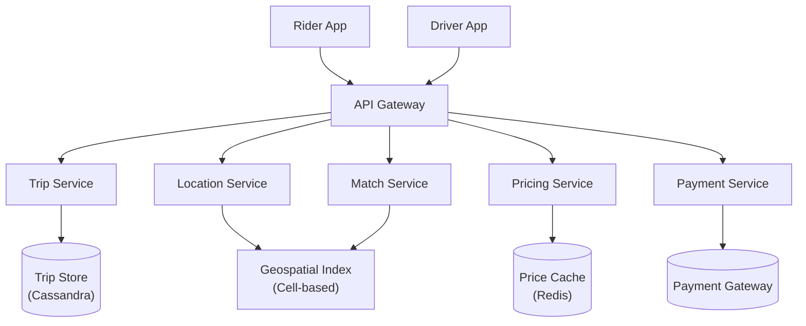
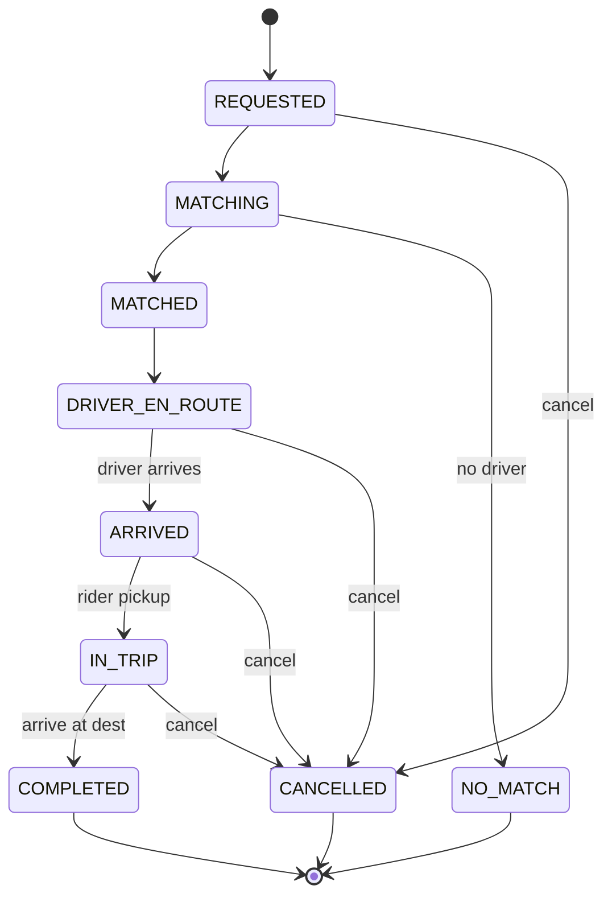

# Uber システム設計

> **注意:** この記事は英語版からの翻訳です。コードブロック、Mermaidダイアグラム、企業名、技術スタック名は原文のまま記載しています。

## TL;DR

Uberは、ライダーと近くのドライバーをリアルタイムでマッチングし、1秒あたり数百万の位置情報更新を処理しています。主な課題には、効率的な近接クエリのための地理空間インデックス、ダイナミックプライシング（サージ）、到着予定時刻（ETA）の計算、決済処理があります。アーキテクチャは、セルベースの位置情報サービス、イベント駆動ディスパッチ、堅牢なトリップステートマシンを使用しています。

---

## コア要件

### 機能要件
- 配車リクエスト（乗車地/降車地の指定）
- 近くのドライバーとのマッチング
- リアルタイムドライバー追跡
- 料金見積もりとダイナミックプライシング
- トリップ管理（開始、終了、キャンセル）
- 決済処理
- 評価システム
- ドライバー/ライダーの履歴

### 非機能要件
- 低レイテンシのマッチング（< 1秒）
- 100万人以上の同時接続ドライバーを処理
- 1分あたり1,000万以上の位置情報更新
- 高可用性（99.99%）
- 正確なETA推定
- 強い決済一貫性

---

## ハイレベルアーキテクチャ



---

## 位置情報サービス

### セルベースの地理空間インデックス

```
┌─────────────────────────────────────────────────────────────────────────┐
│                        Cell-Based Geolocation                           │
│                                                                         │
│   The world is divided into cells using Google S2 or Uber H3           │
│                                                                         │
│   ┌─────┬─────┬─────┬─────┬─────┬─────┬─────┬─────┐                    │
│   │     │     │     │     │     │     │     │     │                    │
│   │ C1  │ C2  │ C3  │ C4  │ C5  │ C6  │ C7  │ C8  │                    │
│   │     │     │  🚗 │     │     │     │     │     │                    │
│   ├─────┼─────┼─────┼─────┼─────┼─────┼─────┼─────┤                    │
│   │     │     │     │     │     │     │     │     │                    │
│   │ C9  │ C10 │ C11 │ C12 │ C13 │ C14 │ C15 │ C16 │                    │
│   │     │  🚗 │     │  📍 │  🚗 │     │     │     │                    │
│   ├─────┼─────┼─────┼─────┼─────┼─────┼─────┼─────┤                    │
│   │     │     │     │     │     │     │     │     │                    │
│   │ C17 │ C18 │ C19 │ C20 │ C21 │ C22 │ C23 │ C24 │                    │
│   │     │     │     │     │ 🚗  │     │     │     │                    │
│   └─────┴─────┴─────┴─────┴─────┴─────┴─────┴─────┘                    │
│                                                                         │
│   📍 = Rider requesting ride in cell C12                               │
│   🚗 = Available drivers                                                │
│                                                                         │
│   Search: C12 + neighbors (C3, C11, C13, C21, etc.)                    │
│   Find drivers: C3, C10, C13, C21                                      │
│                                                                         │
└─────────────────────────────────────────────────────────────────────────┘
```

```go
package main

import (
	"context"
	"fmt"
	"math"
	"sort"
	"strconv"
	"sync"
	"time"

	"github.com/go-redis/redis/v8"
	"github.com/uber/h3-go/v4"
)

// DriverLocation represents a driver's real-time position and status.
type DriverLocation struct {
	DriverID  string
	Lat       float64
	Lng       float64
	Heading   float64
	Speed     float64
	Timestamp float64
	Status    string  // "available", "on_trip", "offline"
	Distance  float64 // populated during nearby search
}

// LocationService manages driver locations using an H3 hexagonal grid backed by Redis.
type LocationService struct {
	rdb         *redis.Client
	resolution  int
	locationTTL time.Duration
	mu          sync.RWMutex
}

// NewLocationService creates a LocationService with resolution 9 (~174 m edge).
func NewLocationService(rdb *redis.Client) *LocationService {
	return &LocationService{
		rdb:         rdb,
		resolution:  9,
		locationTTL: 60 * time.Second,
	}
}

// cellID returns the H3 cell index for the given coordinates.
func (s *LocationService) cellID(lat, lng float64) h3.Cell {
	return h3.LatLngToCell(h3.NewLatLng(lat, lng), s.resolution)
}

// UpdateLocation stores a driver's position and manages cell membership.
func (s *LocationService) UpdateLocation(ctx context.Context, loc DriverLocation) error {
	ctx, cancel := context.WithTimeout(ctx, 2*time.Second)
	defer cancel()

	cell := s.cellID(loc.Lat, loc.Lng)
	cellStr := cell.String()

	// Get previous cell
	prevCell, _ := s.rdb.HGet(ctx, fmt.Sprintf("driver:%s", loc.DriverID), "cell").Result()

	pipe := s.rdb.TxPipeline()

	// Remove from old cell if changed
	if prevCell != "" && prevCell != cellStr {
		pipe.SRem(ctx, fmt.Sprintf("cell:%s", prevCell), loc.DriverID)
	}

	// Add to new cell
	pipe.SAdd(ctx, fmt.Sprintf("cell:%s", cellStr), loc.DriverID)

	// Store driver location data
	pipe.HSet(ctx, fmt.Sprintf("driver:%s", loc.DriverID), map[string]interface{}{
		"lat":       loc.Lat,
		"lng":       loc.Lng,
		"heading":   loc.Heading,
		"speed":     loc.Speed,
		"status":    loc.Status,
		"cell":      cellStr,
		"timestamp": loc.Timestamp,
	})

	// Set TTL (driver offline if no update)
	pipe.Expire(ctx, fmt.Sprintf("driver:%s", loc.DriverID), s.locationTTL)

	_, err := pipe.Exec(ctx)
	return err
}

// FindNearbyDrivers returns available drivers within radiusKm, sorted by distance.
func (s *LocationService) FindNearbyDrivers(ctx context.Context, lat, lng, radiusKm float64, limit int) ([]DriverLocation, error) {
	ctx, cancel := context.WithTimeout(ctx, 3*time.Second)
	defer cancel()

	center := s.cellID(lat, lng)
	ringSize := s.calculateRingSize(radiusKm)
	cells := h3.GridDisk(center, ringSize)

	// Collect unique driver IDs from all cells
	driverSet := make(map[string]struct{})
	for _, c := range cells {
		members, err := s.rdb.SMembers(ctx, fmt.Sprintf("cell:%s", c.String())).Result()
		if err != nil {
			continue
		}
		for _, id := range members {
			driverSet[id] = struct{}{}
		}
	}

	// Get driver details and filter by status
	var drivers []DriverLocation
	for driverID := range driverSet {
		data, err := s.rdb.HGetAll(ctx, fmt.Sprintf("driver:%s", driverID)).Result()
		if err != nil || len(data) == 0 {
			continue
		}
		if data["status"] != "available" {
			continue
		}
		dLat, _ := strconv.ParseFloat(data["lat"], 64)
		dLng, _ := strconv.ParseFloat(data["lng"], 64)
		heading, _ := strconv.ParseFloat(data["heading"], 64)
		speed, _ := strconv.ParseFloat(data["speed"], 64)
		ts, _ := strconv.ParseFloat(data["timestamp"], 64)

		dist := haversine(lat, lng, dLat, dLng)
		if dist > radiusKm {
			continue
		}
		drivers = append(drivers, DriverLocation{
			DriverID:  driverID,
			Lat:       dLat,
			Lng:       dLng,
			Heading:   heading,
			Speed:     speed,
			Timestamp: ts,
			Status:    "available",
			Distance:  dist,
		})
	}

	sort.Slice(drivers, func(i, j int) bool {
		return drivers[i].Distance < drivers[j].Distance
	})
	if len(drivers) > limit {
		drivers = drivers[:limit]
	}
	return drivers, nil
}

// calculateRingSize determines the H3 k-ring needed to cover the given radius.
func (s *LocationService) calculateRingSize(radiusKm float64) int {
	const hexEdgeKm = 0.174 // average edge at resolution 9
	k := int(radiusKm / hexEdgeKm / 2)
	if k < 1 {
		return 1
	}
	return k
}

// haversine returns the great-circle distance in km between two lat/lng pairs.
func haversine(lat1, lng1, lat2, lng2 float64) float64 {
	const R = 6371.0 // Earth's radius in km
	dLat := (lat2 - lat1) * math.Pi / 180
	dLng := (lng2 - lng1) * math.Pi / 180
	rLat1 := lat1 * math.Pi / 180
	rLat2 := lat2 * math.Pi / 180

	a := math.Sin(dLat/2)*math.Sin(dLat/2) +
		math.Cos(rLat1)*math.Cos(rLat2)*math.Sin(dLng/2)*math.Sin(dLng/2)
	c := 2 * math.Atan2(math.Sqrt(a), math.Sqrt(1-a))
	return R * c
}
```

---

## マッチングサービス

```go
package main

import (
	"context"
	"sort"
	"time"

	"golang.org/x/sync/errgroup"
)

// MatchStrategy determines how candidates are ranked.
type MatchStrategy int

const (
	MatchNearest    MatchStrategy = iota // sort by distance
	MatchFastestETA                      // sort by ETA
	MatchBestRated                       // sort by rating, then ETA
)

// RideRequest represents a rider's request for a trip.
type RideRequest struct {
	RequestID   string
	RiderID     string
	PickupLat   float64
	PickupLng   float64
	DropoffLat  float64
	DropoffLng  float64
	VehicleType string // "uberx", "uberxl", "black"
}

// MatchResult holds scoring information for a candidate driver.
type MatchResult struct {
	DriverID     string
	ETASeconds   int
	DistanceKm   float64
	DriverRating float64
}

// ETAServiceIface is the interface used by MatchingService for ETA lookups.
type ETAServiceIface interface {
	GetETA(ctx context.Context, oLat, oLng, dLat, dLng float64) (*ETAResult, error)
}

// DriverServiceIface provides driver metadata.
type DriverServiceIface interface {
	GetRating(ctx context.Context, driverID string) (float64, error)
	FilterByVehicle(ctx context.Context, drivers []DriverLocation, vehicleType string) ([]DriverLocation, error)
}

// DispatchServiceIface offers a trip to a driver and waits for acceptance.
type DispatchServiceIface interface {
	OfferTrip(ctx context.Context, driverID string, req RideRequest, etaSec int, timeout time.Duration) (bool, error)
}

// MatchingService matches riders with optimal drivers.
type MatchingService struct {
	location     *LocationService
	eta          ETAServiceIface
	driver       DriverServiceIface
	dispatch     DispatchServiceIface
	matchTimeout time.Duration
	maxETAMin    int
}

// NewMatchingService creates a MatchingService.
func NewMatchingService(loc *LocationService, eta ETAServiceIface, drv DriverServiceIface, disp DispatchServiceIface) *MatchingService {
	return &MatchingService{
		location:     loc,
		eta:          eta,
		driver:       drv,
		dispatch:     disp,
		matchTimeout: 30 * time.Second,
		maxETAMin:    15,
	}
}

// FindMatch finds and dispatches the best matching driver.
func (m *MatchingService) FindMatch(ctx context.Context, req RideRequest, strategy MatchStrategy) (*MatchResult, error) {
	ctx, cancel := context.WithTimeout(ctx, m.matchTimeout)
	defer cancel()

	// 1. Find nearby available drivers
	nearby, err := m.location.FindNearbyDrivers(ctx, req.PickupLat, req.PickupLng, 5.0, 20)
	if err != nil || len(nearby) == 0 {
		return nil, err
	}

	// 2. Filter by vehicle type
	eligible, err := m.driver.FilterByVehicle(ctx, nearby, req.VehicleType)
	if err != nil || len(eligible) == 0 {
		return nil, err
	}

	// 3. Calculate ETAs for all eligible drivers in parallel
	candidates, err := m.calculateETAs(ctx, eligible, req.PickupLat, req.PickupLng)
	if err != nil {
		return nil, err
	}

	// 4. Rank candidates
	rankCandidates(candidates, strategy)

	// 5. Try to dispatch to drivers in order
	for _, c := range candidates {
		if c.ETASeconds > m.maxETAMin*60 {
			continue
		}
		accepted, err := m.dispatch.OfferTrip(ctx, c.DriverID, req, c.ETASeconds, 15*time.Second)
		if err != nil {
			continue
		}
		if accepted {
			return &c, nil
		}
	}
	return nil, nil
}

// calculateETAs fetches ETAs for all drivers concurrently using errgroup.
func (m *MatchingService) calculateETAs(ctx context.Context, drivers []DriverLocation, destLat, destLng float64) ([]MatchResult, error) {
	type indexedResult struct {
		idx    int
		result MatchResult
	}

	g, gCtx := errgroup.WithContext(ctx)
	ch := make(chan indexedResult, len(drivers))

	for i, d := range drivers {
		i, d := i, d
		g.Go(func() error {
			eta, err := m.eta.GetETA(gCtx, d.Lat, d.Lng, destLat, destLng)
			if err != nil || eta == nil {
				return nil // skip this driver, not fatal
			}
			rating, _ := m.driver.GetRating(gCtx, d.DriverID)
			ch <- indexedResult{idx: i, result: MatchResult{
				DriverID:     d.DriverID,
				ETASeconds:   eta.DurationSeconds,
				DistanceKm:   eta.DistanceKm,
				DriverRating: rating,
			}}
			return nil
		})
	}
	_ = g.Wait()
	close(ch)

	results := make([]MatchResult, 0, len(drivers))
	for r := range ch {
		results = append(results, r.result)
	}
	return results, nil
}

// rankCandidates sorts candidates in place according to the given strategy.
func rankCandidates(candidates []MatchResult, strategy MatchStrategy) {
	switch strategy {
	case MatchNearest:
		sort.Slice(candidates, func(i, j int) bool {
			return candidates[i].DistanceKm < candidates[j].DistanceKm
		})
	case MatchFastestETA:
		sort.Slice(candidates, func(i, j int) bool {
			return candidates[i].ETASeconds < candidates[j].ETASeconds
		})
	case MatchBestRated:
		sort.Slice(candidates, func(i, j int) bool {
			if candidates[i].DriverRating != candidates[j].DriverRating {
				return candidates[i].DriverRating > candidates[j].DriverRating
			}
			return candidates[i].ETASeconds < candidates[j].ETASeconds
		})
	}
}
```

---

## トリップステートマシン



```go
package main

import (
	"context"
	"errors"
	"fmt"
	"time"

	"github.com/google/uuid"
)

// TripState represents the lifecycle state of a trip.
type TripState int

const (
	TripRequested    TripState = iota // initial request
	TripMatching                      // searching for driver
	TripMatched                       // driver assigned
	TripDriverEnRoute                 // driver heading to pickup
	TripArrived                       // driver at pickup
	TripInTrip                        // ride in progress
	TripCompleted                     // ride finished
	TripCancelled                     // rider or driver cancelled
	TripNoMatch                       // no driver found
)

// String returns the event-friendly name for a TripState.
func (s TripState) String() string {
	return [...]string{
		"requested", "matching", "matched", "driver_en_route",
		"arrived", "in_trip", "completed", "cancelled", "no_match",
	}[s]
}

// transitions is the explicit map of valid state transitions.
var transitions = map[TripState][]TripState{
	TripRequested:     {TripMatching, TripCancelled},
	TripMatching:      {TripMatched, TripNoMatch, TripCancelled},
	TripMatched:       {TripDriverEnRoute, TripCancelled},
	TripDriverEnRoute: {TripArrived, TripCancelled},
	TripArrived:       {TripInTrip, TripCancelled},
	TripInTrip:        {TripCompleted},
	TripCompleted:     {},
	TripCancelled:     {},
	TripNoMatch:       {TripRequested}, // retry
}

var (
	ErrTripNotFound      = errors.New("trip not found")
	ErrInvalidTransition = errors.New("invalid state transition")
)

// Trip holds the full trip record persisted in Cassandra.
type Trip struct {
	TripID      string
	RiderID     string
	DriverID    string
	State       TripState
	PickupLat   float64
	PickupLng   float64
	DropoffLat  float64
	DropoffLng  float64
	VehicleType string
	FareEstimate float64
	FareActual   float64
	CreatedAt    time.Time
	StartedAt    time.Time
	CompletedAt  time.Time
}

// TripStoreIface abstracts the persistence layer (Cassandra via gocql).
type TripStoreIface interface {
	Save(ctx context.Context, trip *Trip) error
	Get(ctx context.Context, tripID string) (*Trip, error)
}

// EventBusIface publishes domain events (Kafka via confluent-kafka-go).
type EventBusIface interface {
	Publish(ctx context.Context, topic string, payload interface{}) error
}

// PaymentServiceIface handles charges and cancellation fees.
type PaymentServiceIface interface {
	Charge(ctx context.Context, riderID string, amount float64) error
	ChargeCancellation(ctx context.Context, trip *Trip) error
}

// FareMeterIface starts metering for an active trip.
type FareMeterIface interface {
	Start(ctx context.Context, trip *Trip) error
	CalculateFinal(ctx context.Context, trip *Trip) (float64, error)
}

// TripService manages the trip lifecycle with an explicit state machine.
type TripService struct {
	store    TripStoreIface
	events   EventBusIface
	payment  PaymentServiceIface
	fare     FareMeterIface
}

// NewTripService creates a TripService.
func NewTripService(store TripStoreIface, events EventBusIface, pay PaymentServiceIface, fare FareMeterIface) *TripService {
	return &TripService{store: store, events: events, payment: pay, fare: fare}
}

// CreateTrip persists a new trip in the REQUESTED state.
func (s *TripService) CreateTrip(ctx context.Context, req RideRequest, fareEstimate float64) (*Trip, error) {
	trip := &Trip{
		TripID:       uuid.NewString(),
		RiderID:      req.RiderID,
		State:        TripRequested,
		PickupLat:    req.PickupLat,
		PickupLng:    req.PickupLng,
		DropoffLat:   req.DropoffLat,
		DropoffLng:   req.DropoffLng,
		VehicleType:  req.VehicleType,
		FareEstimate: fareEstimate,
		CreatedAt:    time.Now(),
	}
	if err := s.store.Save(ctx, trip); err != nil {
		return nil, err
	}
	_ = s.events.Publish(ctx, "trip.created", trip)
	return trip, nil
}

// Transition moves a trip to newState, enforcing the state machine.
func (s *TripService) Transition(ctx context.Context, tripID string, newState TripState, opts map[string]interface{}) (*Trip, error) {
	trip, err := s.store.Get(ctx, tripID)
	if err != nil {
		return nil, ErrTripNotFound
	}

	if !isValidTransition(trip.State, newState) {
		return nil, fmt.Errorf("%w: %s -> %s", ErrInvalidTransition, trip.State, newState)
	}

	oldState := trip.State
	trip.State = newState

	// Handle state-specific side effects
	if err := s.handleTransition(ctx, trip, oldState, newState, opts); err != nil {
		return nil, err
	}

	if err := s.store.Save(ctx, trip); err != nil {
		return nil, err
	}
	_ = s.events.Publish(ctx, fmt.Sprintf("trip.%s", newState), trip)
	return trip, nil
}

func isValidTransition(from, to TripState) bool {
	for _, allowed := range transitions[from] {
		if allowed == to {
			return true
		}
	}
	return false
}

func (s *TripService) handleTransition(ctx context.Context, trip *Trip, oldState, newState TripState, opts map[string]interface{}) error {
	switch newState {
	case TripMatched:
		if id, ok := opts["driver_id"].(string); ok {
			trip.DriverID = id
		}
	case TripInTrip:
		trip.StartedAt = time.Now()
		return s.fare.Start(ctx, trip)
	case TripCompleted:
		trip.CompletedAt = time.Now()
		actual, err := s.fare.CalculateFinal(ctx, trip)
		if err != nil {
			return err
		}
		trip.FareActual = actual
		return s.payment.Charge(ctx, trip.RiderID, trip.FareActual)
	case TripCancelled:
		if oldState == TripDriverEnRoute || oldState == TripArrived {
			return s.payment.ChargeCancellation(ctx, trip)
		}
	}
	return nil
}
```

---

## ダイナミックプライシング（サージ）

```go
package main

import (
	"context"
	"fmt"
	"strconv"
	"time"

	"github.com/go-redis/redis/v8"
	"github.com/uber/h3-go/v4"
)

// SurgeData captures a point-in-time surge calculation.
type SurgeData struct {
	Multiplier   float64
	DemandCount  int
	SupplyCount  int
	CalculatedAt time.Time
}

// SurgePricingService calculates dynamic surge multipliers based on local supply/demand.
type SurgePricingService struct {
	rdb            *redis.Client
	location       *LocationService
	minMultiplier  float64
	maxMultiplier  float64
	surgeThreshold float64
	cacheTTL       time.Duration
}

// NewSurgePricingService creates a SurgePricingService.
func NewSurgePricingService(rdb *redis.Client, loc *LocationService) *SurgePricingService {
	return &SurgePricingService{
		rdb:            rdb,
		location:       loc,
		minMultiplier:  1.0,
		maxMultiplier:  5.0,
		surgeThreshold: 1.5,
		cacheTTL:       60 * time.Second,
	}
}

// GetSurgeMultiplier returns the current surge multiplier for a location and vehicle type.
func (s *SurgePricingService) GetSurgeMultiplier(ctx context.Context, lat, lng float64, vehicleType string) (float64, error) {
	ctx, cancel := context.WithTimeout(ctx, 2*time.Second)
	defer cancel()

	cell := s.location.cellID(lat, lng)
	cacheKey := fmt.Sprintf("surge:%s:%s", cell, vehicleType)

	// Check cache
	if cached, err := s.rdb.Get(ctx, cacheKey).Result(); err == nil {
		if v, err := strconv.ParseFloat(cached, 64); err == nil {
			return v, nil
		}
	}

	// Calculate surge
	multiplier, err := s.calculateSurge(ctx, cell, vehicleType)
	if err != nil {
		return s.minMultiplier, err
	}

	// Cache result
	s.rdb.Set(ctx, cacheKey, strconv.FormatFloat(multiplier, 'f', 4, 64), s.cacheTTL)

	return multiplier, nil
}

func (s *SurgePricingService) calculateSurge(ctx context.Context, cell h3.Cell, vehicleType string) (float64, error) {
	demand, err := s.getDemand(ctx, cell.String(), vehicleType)
	if err != nil {
		return s.minMultiplier, err
	}

	supply, err := s.getSupply(ctx, cell, vehicleType)
	if err != nil {
		return s.minMultiplier, err
	}

	if supply == 0 {
		return s.maxMultiplier, nil
	}

	ratio := float64(demand) / float64(supply)
	if ratio < s.surgeThreshold {
		return s.minMultiplier, nil
	}

	// Linear scaling between threshold and max
	multiplier := 1.0 + (ratio-s.surgeThreshold)*0.5
	if multiplier > s.maxMultiplier {
		multiplier = s.maxMultiplier
	}
	if multiplier < s.minMultiplier {
		multiplier = s.minMultiplier
	}
	return multiplier, nil
}

func (s *SurgePricingService) getDemand(ctx context.Context, cellID, vehicleType string) (int64, error) {
	key := fmt.Sprintf("demand:%s:%s", cellID, vehicleType)
	now := time.Now().Unix()
	window := int64(300) // 5 minutes

	count, err := s.rdb.ZCount(ctx, key, strconv.FormatInt(now-window, 10), strconv.FormatInt(now, 10)).Result()
	return count, err
}

func (s *SurgePricingService) getSupply(ctx context.Context, cell h3.Cell, vehicleType string) (int, error) {
	cells := h3.GridDisk(cell, 1)
	total := 0

	for _, c := range cells {
		members, err := s.rdb.SMembers(ctx, fmt.Sprintf("cell:%s", c.String())).Result()
		if err != nil {
			continue
		}
		for _, driverID := range members {
			data, err := s.rdb.HGetAll(ctx, fmt.Sprintf("driver:%s", driverID)).Result()
			if err != nil || len(data) == 0 {
				continue
			}
			if data["status"] == "available" && data["vehicle_type"] == vehicleType {
				total++
			}
		}
	}
	return total, nil
}

// RecordRequest logs a ride request for demand tracking using a Redis sorted set.
func (s *SurgePricingService) RecordRequest(ctx context.Context, lat, lng float64, vehicleType string) error {
	cell := s.location.cellID(lat, lng)
	key := fmt.Sprintf("demand:%s:%s", cell, vehicleType)
	now := float64(time.Now().Unix())

	pipe := s.rdb.TxPipeline()
	pipe.ZAdd(ctx, key, &redis.Z{Score: now, Member: strconv.FormatFloat(now, 'f', 0, 64)})
	pipe.ZRemRangeByScore(ctx, key, "-inf", strconv.FormatFloat(now-600, 'f', 0, 64))
	pipe.Expire(ctx, key, 600*time.Second)
	_, err := pipe.Exec(ctx)
	return err
}
```

---

## ETAサービス

```go
package main

import (
	"context"
	"encoding/json"
	"fmt"
	"time"

	"github.com/go-redis/redis/v8"
	"golang.org/x/sync/singleflight"
)

// ETAResult holds the routing result returned by GetETA.
type ETAResult struct {
	DurationSeconds int     `json:"duration_seconds"`
	DistanceKm      float64 `json:"distance_km"`
	RoutePolyline   string  `json:"route_polyline"`
}

// RoutingClientIface abstracts the external routing engine.
type RoutingClientIface interface {
	GetRoute(ctx context.Context, oLat, oLng, dLat, dLng float64) (*ETAResult, error)
}

// TrafficServiceIface provides real-time traffic adjustment factors.
type TrafficServiceIface interface {
	GetFactor(ctx context.Context, oLat, oLng, dLat, dLng float64) (float64, error)
}

// ETAService calculates estimated time of arrival using a routing engine,
// traffic adjustments, and a Redis cache with coordinate rounding.
type ETAService struct {
	routing  RoutingClientIface
	traffic  TrafficServiceIface
	rdb      *redis.Client
	cacheTTL time.Duration
	sfGroup  singleflight.Group
}

// NewETAService creates an ETAService with a 30-second cache TTL.
func NewETAService(routing RoutingClientIface, traffic TrafficServiceIface, rdb *redis.Client) *ETAService {
	return &ETAService{
		routing:  routing,
		traffic:  traffic,
		rdb:      rdb,
		cacheTTL: 30 * time.Second,
	}
}

// GetETA returns the ETA between two points, using cache and singleflight
// to deduplicate concurrent requests for the same origin/destination pair.
func (s *ETAService) GetETA(ctx context.Context, oLat, oLng, dLat, dLng float64) (*ETAResult, error) {
	ctx, cancel := context.WithTimeout(ctx, 3*time.Second)
	defer cancel()

	key := s.cacheKey(oLat, oLng, dLat, dLng)

	// Check cache
	if cached, err := s.rdb.Get(ctx, key).Result(); err == nil {
		var result ETAResult
		if json.Unmarshal([]byte(cached), &result) == nil {
			return &result, nil
		}
	}

	// Deduplicate concurrent identical lookups with singleflight keyed by cache key
	v, err, _ := s.sfGroup.Do(key, func() (interface{}, error) {
		route, err := s.routing.GetRoute(ctx, oLat, oLng, dLat, dLng)
		if err != nil {
			return nil, err
		}

		factor, err := s.traffic.GetFactor(ctx, oLat, oLng, dLat, dLng)
		if err != nil {
			return nil, err
		}

		result := &ETAResult{
			DurationSeconds: int(float64(route.DurationSeconds) * factor),
			DistanceKm:      route.DistanceKm,
			RoutePolyline:   route.RoutePolyline,
		}

		// Cache result
		if data, err := json.Marshal(result); err == nil {
			s.rdb.Set(ctx, key, data, s.cacheTTL)
		}
		return result, nil
	})
	if err != nil {
		return nil, err
	}
	return v.(*ETAResult), nil
}

// cacheKey rounds coordinates to ~100 m precision for cache efficiency.
func (s *ETAService) cacheKey(oLat, oLng, dLat, dLng float64) string {
	return fmt.Sprintf("eta:%.3f,%.3f:%.3f,%.3f", oLat, oLng, dLat, dLng)
}
```

---

## 主要メトリクスとスケール

| メトリクス | 値 |
|--------|-------|
| アクティブライダー | 月間1億人以上 |
| アクティブドライバー | 500万人以上 |
| 1日あたりのトリップ数 | 1,500万以上 |
| 位置情報更新/秒 | 100万以上 |
| マッチングレイテンシ | < 1秒 |
| 展開都市数 | 10,000以上 |

---

## 主な学び

1. **セルベースの地理空間処理**: H3/S2の六角形グリッドにより、O(1)のセル検索とO(neighbors)の近接検索が可能です

2. **Redisでのドライバー位置管理**: 高速化のためにインメモリで管理し、TTLによりオフライン検出を自動的に処理します

3. **需要/供給ベースのダイナミックプライシング**: ローカルな需要/供給比に基づくリアルタイムサージ計算を行います

4. **トリップのステートマシン**: 明示的な状態遷移により一貫性を確保し、イベント駆動アーキテクチャを実現します

5. **丸め処理によるETAキャッシュ**: キャッシュ効率のために座標を丸め、読み取り時に交通状況の調整を適用します

6. **タイムアウト付きディスパッチ**: 受諾タイムアウト付きでドライバーに順次トリップを提案し、タイムアウト時は次のドライバーに移行します

---

## 本番環境での知見

### DISCOロケーションパイプライン

UberのDISCO（Dispatch Optimization）システムは、**WebSocket → Kafka → LocationStore** というマルチステージパイプラインを通じてドライバーの位置情報を取り込みます。ドライバーは最寄りのエッジPOPへの永続的なWebSocket接続を保持します。各位置情報更新はパーティション化されたKafkaトピック（順序保証のためにドライバーIDをキーとする）に発行され、その後LocationStoreのライターがセルごとのRedisセットにファンアウトして消費します。

ピーク時、このパイプラインはグローバルで**1秒あたり100万以上の位置情報更新**を維持します。バックプレッシャーはKafka層で処理されます。LocationStoreのコンシューマーが遅延した場合、Kafkaがイベントを保持し、接続を切断することなくコンシューマーが追いつきます。WebSocketゲートウェイはクライアントサイドのスロットリング（1秒に最大1回の更新）とサーバーサイドの重複排除（H3セルが変わらない場合は破棄）を実行します。

### ゴーストカー問題

よく知られた本番環境の問題です。ドライバーの携帯電話が接続を失うと、最後に確認された位置がRedisのキーTTL（デフォルト60秒）が期限切れになるまで残ります。その間、ライダーアプリは利用可能に見えるがディスパッチできない「ゴーストカー」を表示します。対策は以下の通りです。

- **ハートビートベースのTTL**: RedisキーのTTLをWebSocketのping/pong間隔（通常10秒）に合わせて短縮します。ハートビートが届かない場合、ドライバーキーはより早く期限切れになります。
- **ディスパッチ時の活性チェック**: トリップを提案する前に、ディスパッチサービスがドライバーのゲートウェイPOPに軽量RPCを送信します。POPがソケットが切断されていると報告した場合、ドライバーはセルセットから即座に削除されます。
- **クライアントサイドの陳腐化表示**: ライダーアプリは`timestamp`フィールドが15秒以上古い車両を暗く表示し、マッチング前にユーザーの期待値を設定します。

### GeofenceのR-Treeインデックス

Uberは数万のジオフェンス（空港、都市境界、サージゾーン、制限区域）を管理しています。これらのポリゴンはサービスインスタンスごとのインメモリR-treeにインデックス化され、起動時にKafkaのコンパクトトピックから再構築されます。配車リクエストが到着すると、サービスはR-treeに対してポイントインポリゴンクエリを実行し、適用されるルール（空港追加料金、規制上の上限など）を判定します。

R-treeの検索はO(log n)で、一般的なデータセットサイズ（約5万ポリゴン）ではサブマイクロ秒です。更新はKafkaを通じて伝播されるため、管理ツールでジオフェンスが変更されてから数秒以内にすべてのインスタンスが収束します。

### ETAの集約におけるSingleflight

人気のある乗車地点（例：コンサート会場、スタジアムの出口）で数十の同時配車リクエストが発生すると、各リクエストが同じ近隣ドライバーのセットに対してETA計算をファンアウトします。重複排除がなければ、N件のリクエスト x Mドライバー = N×M件のルーティング呼び出しとなり、その大部分は座標丸めの後に同一の出発地/目的地ペアを共有しています。

`singleflight.Group`がこれらの冗長な呼び出しを集約します。キーは丸められたキャッシュキー（Redisに使用するのと同じキー）であるため、ユニークな出発地/目的地ペアごとに1つのインフライトルーティングRPCのみが行われます。後続の呼び出し元はブロックして同じ結果を受け取ります。30秒のRedisキャッシュと組み合わせることで、需要スパイク時のルーティングバックエンド負荷を5〜10倍削減します。

実装上の重要な詳細として、singleflightグループは**グローバルではなく**、各ETAServiceインスタンス上に存在します。リクエストは多くのサービスインスタンスにロードバランスされるため、集約率はインスタンスごとです。Redisキャッシュ層がインスタンス間の重複排除を提供します。
