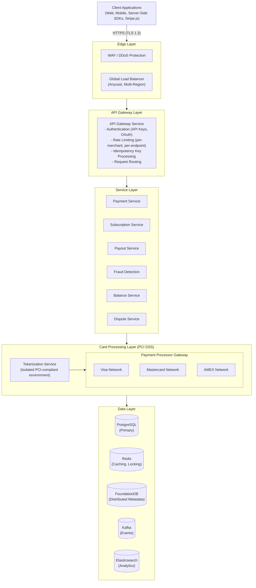
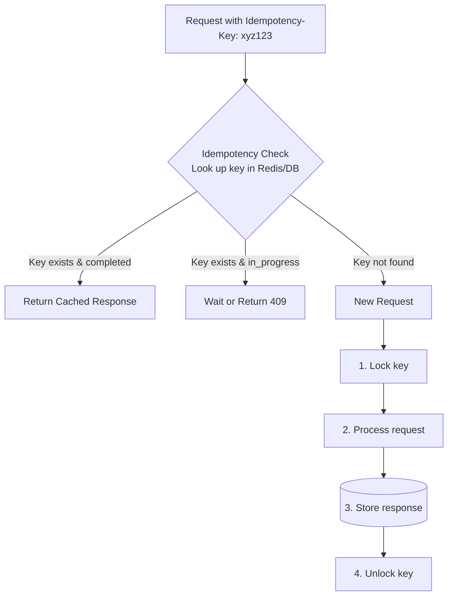
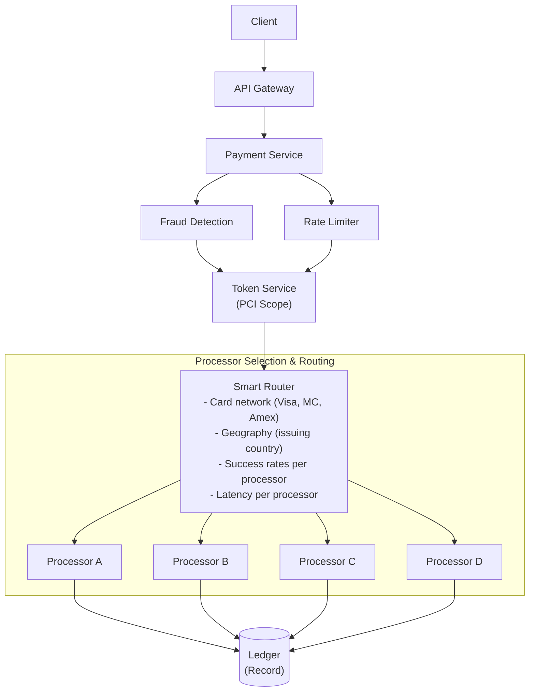

# Stripe システム設計

> **注意:** この記事は英語版からの翻訳です。コードブロック、Mermaidダイアグラム、企業名、技術スタック名は原文のまま記載しています。

## TL;DR

Stripeは年間数千億ドルを99.999%の稼働率で処理しています。アーキテクチャの中心には、厳密に1回の決済処理を実現する**べき等キー**、財務正確性のための**複式簿記**、複数プロバイダーにまたがる**リクエストヘッジング**、**PCI DSS準拠インフラ**の分離、そしてテナント公平性を備えた**レート制限**があります。重要な知見：金融システムは可用性よりも正確性を重視します。決済の失敗が二重請求や金銭の喪失につながることは決して許されません。

---

## コア要件

### 機能要件
1. **決済処理** - クレジットカード、銀行振込、デジタルウォレットの課金
2. **マルチ通貨** - 135以上の通貨と換算のサポート
3. **サブスクリプション** - 日割り計算付きの定期課金
4. **ペイアウト** - 加盟店への資金移動
5. **紛争処理** - チャージバックと返金の処理
6. **レポーティング** - リアルタイムダッシュボードと照合

### 非機能要件
1. **整合性** - 二重課金なし、金銭の喪失なし
2. **可用性** - 99.999%の稼働率（年間約5分のダウンタイム）
3. **レイテンシ** - 決済承認 < 2秒
4. **セキュリティ** - PCI DSS レベル1準拠
5. **監査可能性** - 完全な取引履歴

---

## 上位レベルアーキテクチャ



---

## べき等システム



### べき等性の実装

```python
from dataclasses import dataclass
from typing import Optional, Any
from enum import Enum
import hashlib
import json
import time

class IdempotencyStatus(Enum):
    STARTED = "started"
    COMPLETED = "completed"
    FAILED = "failed"

@dataclass
class IdempotencyRecord:
    key: str
    merchant_id: str
    status: IdempotencyStatus
    request_hash: str  # Hash of request params
    response: Optional[dict]
    created_at: float
    locked_until: Optional[float]


class IdempotencyService:
    """
    Ensures exactly-once processing for payment operations.
    Uses distributed locking with careful handling of edge cases.
    """

    def __init__(self, redis_client, db_client):
        self.redis = redis_client
        self.db = db_client

        # Configuration
        self.lock_timeout = 60  # seconds
        self.key_expiry = 24 * 60 * 60  # 24 hours

    async def process_with_idempotency(
        self,
        idempotency_key: str,
        merchant_id: str,
        request_params: dict,
        processor_fn
    ) -> dict:
        """
        Execute processor_fn with idempotency guarantees.
        Returns cached result if key was previously processed.
        """
        # Compute request hash for replay detection
        request_hash = self._compute_hash(request_params)

        # Check existing key
        existing = await self._get_idempotency_record(
            idempotency_key,
            merchant_id
        )

        if existing:
            return await self._handle_existing_key(
                existing,
                request_hash,
                processor_fn
            )

        # New request - acquire lock
        lock_acquired = await self._acquire_lock(
            idempotency_key,
            merchant_id,
            request_hash
        )

        if not lock_acquired:
            # Another request is processing
            raise ConcurrentRequestError(
                "Another request with this idempotency key is in progress"
            )

        try:
            # Process the request
            result = await processor_fn()

            # Store successful result
            await self._store_completed_result(
                idempotency_key,
                merchant_id,
                request_hash,
                result
            )

            return result

        except Exception as e:
            # Store failure (for some errors)
            if self._should_store_failure(e):
                await self._store_failed_result(
                    idempotency_key,
                    merchant_id,
                    request_hash,
                    e
                )
            else:
                # Release lock for retryable errors
                await self._release_lock(idempotency_key, merchant_id)

            raise

    async def _handle_existing_key(
        self,
        record: IdempotencyRecord,
        request_hash: str,
        processor_fn
    ) -> dict:
        """Handle request with existing idempotency key"""
        # Check if request params match
        if record.request_hash != request_hash:
            raise IdempotencyMismatchError(
                "Request parameters differ from original request"
            )

        if record.status == IdempotencyStatus.COMPLETED:
            # Return cached response
            return record.response

        if record.status == IdempotencyStatus.FAILED:
            # Re-raise cached error
            raise CachedFailureError(record.response["error"])

        if record.status == IdempotencyStatus.STARTED:
            # Check if lock expired
            if record.locked_until and time.time() > record.locked_until:
                # Lock expired, previous request may have crashed
                # Take over processing
                return await self._retry_processing(record, processor_fn)
            else:
                # Still processing
                raise ConcurrentRequestError(
                    "Request is still being processed"
                )

    async def _acquire_lock(
        self,
        key: str,
        merchant_id: str,
        request_hash: str
    ) -> bool:
        """Acquire distributed lock for idempotency key"""
        lock_key = f"idem_lock:{merchant_id}:{key}"
        locked_until = time.time() + self.lock_timeout

        # Use Redis SETNX for atomic lock
        acquired = await self.redis.set(
            lock_key,
            json.dumps({
                "locked_until": locked_until,
                "request_hash": request_hash
            }),
            nx=True,
            ex=self.lock_timeout
        )

        if acquired:
            # Store initial record in DB
            await self.db.execute(
                """
                INSERT INTO idempotency_keys (
                    key, merchant_id, status, request_hash,
                    locked_until, created_at
                ) VALUES ($1, $2, $3, $4, $5, NOW())
                """,
                key, merchant_id, IdempotencyStatus.STARTED.value,
                request_hash, locked_until
            )

        return acquired

    async def _store_completed_result(
        self,
        key: str,
        merchant_id: str,
        request_hash: str,
        result: dict
    ):
        """Store successful result for future idempotent requests"""
        await self.db.execute(
            """
            UPDATE idempotency_keys
            SET status = $1, response = $2, locked_until = NULL
            WHERE key = $3 AND merchant_id = $4
            """,
            IdempotencyStatus.COMPLETED.value,
            json.dumps(result),
            key, merchant_id
        )

        # Release Redis lock
        await self.redis.delete(f"idem_lock:{merchant_id}:{key}")

        # Cache in Redis for fast lookup
        await self.redis.setex(
            f"idem_result:{merchant_id}:{key}",
            self.key_expiry,
            json.dumps({
                "status": "completed",
                "request_hash": request_hash,
                "response": result
            })
        )

    def _compute_hash(self, params: dict) -> str:
        """Compute deterministic hash of request parameters"""
        # Sort keys for deterministic ordering
        canonical = json.dumps(params, sort_keys=True)
        return hashlib.sha256(canonical.encode()).hexdigest()

    def _should_store_failure(self, error: Exception) -> bool:
        """Determine if failure should be cached (non-retryable)"""
        non_retryable = (
            CardDeclinedError,
            InsufficientFundsError,
            InvalidCardError,
            FraudDetectedError
        )
        return isinstance(error, non_retryable)
```

---

## 複式簿記システム

```
┌─────────────────────────────────────────────────────────────────────────┐
│                    Double-Entry Bookkeeping                              │
│                                                                          │
│   Every transaction creates balanced debit and credit entries           │
│                                                                          │
│   Example: $100 payment from Customer → Merchant                        │
│                                                                          │
│   ┌─────────────────────────────────────────────────────────────────┐   │
│   │  Entry 1: Debit Customer Card Account         $100.00          │   │
│   │  Entry 2: Credit Stripe Pending Balance       $100.00          │   │
│   └─────────────────────────────────────────────────────────────────┘   │
│                              │                                          │
│                              ▼ (After settlement)                       │
│   ┌─────────────────────────────────────────────────────────────────┐   │
│   │  Entry 3: Debit Stripe Pending Balance        $100.00          │   │
│   │  Entry 4: Credit Stripe Revenue (2.9%)          $2.90          │   │
│   │  Entry 5: Credit Merchant Balance              $97.10          │   │
│   └─────────────────────────────────────────────────────────────────┘   │
│                                                                          │
│   Invariant: SUM(debits) = SUM(credits) = 0 always                      │
└─────────────────────────────────────────────────────────────────────────┘
```

### 台帳の実装

```python
from dataclasses import dataclass
from typing import List, Optional
from decimal import Decimal
from enum import Enum
import uuid
from datetime import datetime

class AccountType(Enum):
    ASSET = "asset"
    LIABILITY = "liability"
    EQUITY = "equity"
    REVENUE = "revenue"
    EXPENSE = "expense"

class EntryType(Enum):
    DEBIT = "debit"
    CREDIT = "credit"

@dataclass
class LedgerEntry:
    id: str
    transaction_id: str
    account_id: str
    entry_type: EntryType
    amount: Decimal  # Always positive
    currency: str
    created_at: datetime
    metadata: dict

@dataclass
class LedgerTransaction:
    id: str
    entries: List[LedgerEntry]
    description: str
    idempotency_key: Optional[str]
    created_at: datetime


class LedgerService:
    """
    Double-entry bookkeeping system for financial transactions.
    Guarantees that debits always equal credits.
    """

    def __init__(self, db_client, event_publisher):
        self.db = db_client
        self.events = event_publisher

    async def create_transaction(
        self,
        entries: List[dict],
        description: str,
        idempotency_key: Optional[str] = None
    ) -> LedgerTransaction:
        """
        Create a balanced transaction with multiple entries.
        All entries must sum to zero (debits = credits).
        """
        # Validate balance
        self._validate_balance(entries)

        # Create transaction in single DB transaction
        transaction_id = str(uuid.uuid4())

        async with self.db.transaction() as tx:
            # Check idempotency
            if idempotency_key:
                existing = await tx.fetchone(
                    """
                    SELECT id FROM ledger_transactions
                    WHERE idempotency_key = $1
                    """,
                    idempotency_key
                )
                if existing:
                    return await self._get_transaction(existing["id"])

            # Insert transaction
            await tx.execute(
                """
                INSERT INTO ledger_transactions (
                    id, description, idempotency_key, created_at
                ) VALUES ($1, $2, $3, NOW())
                """,
                transaction_id, description, idempotency_key
            )

            # Insert entries
            ledger_entries = []
            for entry in entries:
                entry_id = str(uuid.uuid4())

                # Validate account exists
                account = await self._get_account(tx, entry["account_id"])

                await tx.execute(
                    """
                    INSERT INTO ledger_entries (
                        id, transaction_id, account_id, entry_type,
                        amount, currency, metadata, created_at
                    ) VALUES ($1, $2, $3, $4, $5, $6, $7, NOW())
                    """,
                    entry_id, transaction_id, entry["account_id"],
                    entry["entry_type"].value, entry["amount"],
                    entry["currency"], json.dumps(entry.get("metadata", {}))
                )

                # Update account balance
                await self._update_account_balance(
                    tx,
                    entry["account_id"],
                    entry["entry_type"],
                    entry["amount"],
                    entry["currency"]
                )

                ledger_entries.append(LedgerEntry(
                    id=entry_id,
                    transaction_id=transaction_id,
                    account_id=entry["account_id"],
                    entry_type=entry["entry_type"],
                    amount=entry["amount"],
                    currency=entry["currency"],
                    created_at=datetime.utcnow(),
                    metadata=entry.get("metadata", {})
                ))

            transaction = LedgerTransaction(
                id=transaction_id,
                entries=ledger_entries,
                description=description,
                idempotency_key=idempotency_key,
                created_at=datetime.utcnow()
            )

        # Publish event
        await self.events.publish(
            "ledger.transaction.created",
            {
                "transaction_id": transaction_id,
                "entry_count": len(entries),
                "total_amount": str(sum(e["amount"] for e in entries if e["entry_type"] == EntryType.DEBIT))
            }
        )

        return transaction

    def _validate_balance(self, entries: List[dict]):
        """Ensure debits equal credits for each currency"""
        by_currency = {}

        for entry in entries:
            currency = entry["currency"]
            if currency not in by_currency:
                by_currency[currency] = {"debit": Decimal("0"), "credit": Decimal("0")}

            if entry["entry_type"] == EntryType.DEBIT:
                by_currency[currency]["debit"] += entry["amount"]
            else:
                by_currency[currency]["credit"] += entry["amount"]

        for currency, balances in by_currency.items():
            if balances["debit"] != balances["credit"]:
                raise UnbalancedTransactionError(
                    f"Transaction not balanced for {currency}: "
                    f"debit={balances['debit']}, credit={balances['credit']}"
                )

    async def _update_account_balance(
        self,
        tx,
        account_id: str,
        entry_type: EntryType,
        amount: Decimal,
        currency: str
    ):
        """Update account balance based on entry type and account type"""
        account = await self._get_account(tx, account_id)

        # Determine if this increases or decreases the balance
        # Assets/Expenses: Debit increases, Credit decreases
        # Liabilities/Equity/Revenue: Credit increases, Debit decreases

        if account.account_type in [AccountType.ASSET, AccountType.EXPENSE]:
            delta = amount if entry_type == EntryType.DEBIT else -amount
        else:
            delta = amount if entry_type == EntryType.CREDIT else -amount

        await tx.execute(
            """
            INSERT INTO account_balances (account_id, currency, balance)
            VALUES ($1, $2, $3)
            ON CONFLICT (account_id, currency)
            DO UPDATE SET balance = account_balances.balance + $3
            """,
            account_id, currency, delta
        )


class PaymentLedger:
    """High-level payment operations using double-entry ledger"""

    def __init__(self, ledger_service: LedgerService, account_service):
        self.ledger = ledger_service
        self.accounts = account_service

    async def record_successful_charge(
        self,
        payment_id: str,
        merchant_id: str,
        customer_id: str,
        amount: Decimal,
        currency: str,
        fee_amount: Decimal
    ):
        """Record a successful payment charge"""
        # Get account IDs
        customer_account = await self.accounts.get_customer_card_account(customer_id)
        merchant_account = await self.accounts.get_merchant_balance_account(merchant_id)
        stripe_pending = await self.accounts.get_stripe_pending_account()
        stripe_revenue = await self.accounts.get_stripe_revenue_account()

        net_amount = amount - fee_amount

        entries = [
            # Debit customer card (they owe money)
            {
                "account_id": customer_account.id,
                "entry_type": EntryType.DEBIT,
                "amount": amount,
                "currency": currency,
                "metadata": {"payment_id": payment_id}
            },
            # Credit pending balance (liability to merchant)
            {
                "account_id": stripe_pending.id,
                "entry_type": EntryType.CREDIT,
                "amount": net_amount,
                "currency": currency,
                "metadata": {"payment_id": payment_id, "merchant_id": merchant_id}
            },
            # Credit Stripe revenue for fees
            {
                "account_id": stripe_revenue.id,
                "entry_type": EntryType.CREDIT,
                "amount": fee_amount,
                "currency": currency,
                "metadata": {"payment_id": payment_id, "fee_type": "processing"}
            }
        ]

        return await self.ledger.create_transaction(
            entries=entries,
            description=f"Payment {payment_id} from customer {customer_id}",
            idempotency_key=f"charge:{payment_id}"
        )

    async def record_payout(
        self,
        payout_id: str,
        merchant_id: str,
        amount: Decimal,
        currency: str
    ):
        """Record payout from Stripe to merchant bank account"""
        merchant_balance = await self.accounts.get_merchant_balance_account(merchant_id)
        stripe_bank = await self.accounts.get_stripe_bank_account(currency)

        entries = [
            # Debit merchant balance (reduce liability)
            {
                "account_id": merchant_balance.id,
                "entry_type": EntryType.DEBIT,
                "amount": amount,
                "currency": currency,
                "metadata": {"payout_id": payout_id}
            },
            # Credit bank account (money goes out)
            {
                "account_id": stripe_bank.id,
                "entry_type": EntryType.CREDIT,
                "amount": amount,
                "currency": currency,
                "metadata": {"payout_id": payout_id}
            }
        ]

        return await self.ledger.create_transaction(
            entries=entries,
            description=f"Payout {payout_id} to merchant {merchant_id}",
            idempotency_key=f"payout:{payout_id}"
        )
```

---

## 決済処理フロー



### 決済サービス実装

```python
from dataclasses import dataclass
from typing import Optional, List
from decimal import Decimal
from enum import Enum
import asyncio

class PaymentStatus(Enum):
    PENDING = "pending"
    REQUIRES_ACTION = "requires_action"  # 3DS, etc.
    PROCESSING = "processing"
    SUCCEEDED = "succeeded"
    FAILED = "failed"
    CANCELED = "canceled"

@dataclass
class PaymentIntent:
    id: str
    merchant_id: str
    amount: Decimal
    currency: str
    status: PaymentStatus
    payment_method_id: Optional[str]
    customer_id: Optional[str]
    metadata: dict
    created_at: datetime

@dataclass
class ProcessorResponse:
    success: bool
    processor: str
    authorization_code: Optional[str]
    decline_code: Optional[str]
    error_message: Optional[str]
    latency_ms: int


class PaymentService:
    """
    Orchestrates payment processing with multiple processors.
    Implements hedging, retries, and smart routing.
    """

    def __init__(
        self,
        db_client,
        token_service,
        fraud_service,
        router,
        ledger,
        idempotency_service
    ):
        self.db = db_client
        self.tokens = token_service
        self.fraud = fraud_service
        self.router = router
        self.ledger = ledger
        self.idempotency = idempotency_service

    async def create_payment_intent(
        self,
        merchant_id: str,
        amount: Decimal,
        currency: str,
        payment_method_id: Optional[str] = None,
        customer_id: Optional[str] = None,
        metadata: dict = None,
        idempotency_key: Optional[str] = None
    ) -> PaymentIntent:
        """Create a new payment intent"""
        async def create():
            intent_id = f"pi_{uuid.uuid4().hex}"

            intent = PaymentIntent(
                id=intent_id,
                merchant_id=merchant_id,
                amount=amount,
                currency=currency,
                status=PaymentStatus.PENDING,
                payment_method_id=payment_method_id,
                customer_id=customer_id,
                metadata=metadata or {},
                created_at=datetime.utcnow()
            )

            await self._save_payment_intent(intent)

            return intent

        if idempotency_key:
            return await self.idempotency.process_with_idempotency(
                idempotency_key=idempotency_key,
                merchant_id=merchant_id,
                request_params={
                    "amount": str(amount),
                    "currency": currency,
                    "payment_method_id": payment_method_id
                },
                processor_fn=create
            )

        return await create()

    async def confirm_payment_intent(
        self,
        intent_id: str,
        payment_method_id: Optional[str] = None,
        idempotency_key: Optional[str] = None
    ) -> PaymentIntent:
        """Confirm and process a payment intent"""
        async def confirm():
            intent = await self._get_payment_intent(intent_id)

            if intent.status not in [PaymentStatus.PENDING, PaymentStatus.REQUIRES_ACTION]:
                raise InvalidStateError(f"Cannot confirm intent in {intent.status} state")

            pm_id = payment_method_id or intent.payment_method_id
            if not pm_id:
                raise ValidationError("Payment method required")

            # Update status
            await self._update_intent_status(intent_id, PaymentStatus.PROCESSING)

            try:
                # Run fraud check
                fraud_result = await self.fraud.evaluate(
                    merchant_id=intent.merchant_id,
                    amount=intent.amount,
                    currency=intent.currency,
                    payment_method_id=pm_id,
                    customer_id=intent.customer_id
                )

                if fraud_result.block:
                    await self._fail_payment(
                        intent_id,
                        "blocked_by_fraud_check"
                    )
                    raise FraudDetectedError("Payment blocked")

                # Get card details (detokenize in PCI scope)
                card_details = await self.tokens.get_card_details(pm_id)

                # Process with smart routing
                result = await self._process_payment(
                    intent=intent,
                    card_details=card_details,
                    fraud_score=fraud_result.score
                )

                if result.success:
                    # Record in ledger
                    fee = self._calculate_fee(intent.amount, intent.currency)
                    await self.ledger.record_successful_charge(
                        payment_id=intent_id,
                        merchant_id=intent.merchant_id,
                        customer_id=intent.customer_id,
                        amount=intent.amount,
                        currency=intent.currency,
                        fee_amount=fee
                    )

                    intent.status = PaymentStatus.SUCCEEDED
                    await self._update_intent_status(intent_id, PaymentStatus.SUCCEEDED)
                else:
                    intent.status = PaymentStatus.FAILED
                    await self._fail_payment(intent_id, result.decline_code)

                return intent

            except Exception as e:
                await self._fail_payment(intent_id, str(e))
                raise

        if idempotency_key:
            return await self.idempotency.process_with_idempotency(
                idempotency_key=idempotency_key,
                merchant_id=(await self._get_payment_intent(intent_id)).merchant_id,
                request_params={"intent_id": intent_id, "payment_method_id": payment_method_id},
                processor_fn=confirm
            )

        return await confirm()

    async def _process_payment(
        self,
        intent: PaymentIntent,
        card_details: dict,
        fraud_score: float
    ) -> ProcessorResponse:
        """
        Process payment with smart routing and hedging.
        May send to multiple processors for redundancy.
        """
        # Get ranked processors for this card
        processors = await self.router.get_processors(
            card_network=card_details["network"],
            issuing_country=card_details["issuing_country"],
            amount=intent.amount,
            currency=intent.currency
        )

        # Determine if we should hedge (send to multiple)
        should_hedge = (
            intent.amount > 1000 and  # High-value transaction
            fraud_score < 0.3 and  # Low fraud risk
            len(processors) >= 2  # Multiple processors available
        )

        if should_hedge:
            return await self._process_with_hedging(
                intent, card_details, processors[:2]
            )
        else:
            return await self._process_sequential(
                intent, card_details, processors
            )

    async def _process_with_hedging(
        self,
        intent: PaymentIntent,
        card_details: dict,
        processors: List
    ) -> ProcessorResponse:
        """
        Send to multiple processors simultaneously.
        Use first successful response, cancel others.
        """
        tasks = []
        for processor in processors:
            task = asyncio.create_task(
                self._call_processor(processor, intent, card_details)
            )
            tasks.append((processor, task))

        # Wait for first completion
        pending = {t for _, t in tasks}

        while pending:
            done, pending = await asyncio.wait(
                pending,
                return_when=asyncio.FIRST_COMPLETED
            )

            for completed in done:
                result = completed.result()

                if result.success:
                    # Cancel pending requests
                    for task in pending:
                        task.cancel()

                    # Void authorizations from other processors
                    # (handled async to not delay response)
                    asyncio.create_task(
                        self._void_other_authorizations(intent.id, result.processor)
                    )

                    return result

        # All failed - return last failure
        for _, task in tasks:
            result = task.result()
        return result

    async def _process_sequential(
        self,
        intent: PaymentIntent,
        card_details: dict,
        processors: List
    ) -> ProcessorResponse:
        """
        Try processors sequentially until one succeeds.
        Used for lower-value or higher-risk transactions.
        """
        last_result = None

        for processor in processors:
            result = await self._call_processor(processor, intent, card_details)

            if result.success:
                return result

            # Check if error is retryable
            if result.decline_code in ["do_not_retry", "fraud", "lost_card"]:
                return result  # Don't try other processors

            last_result = result

        return last_result


class SmartRouter:
    """
    Routes payments to optimal processor based on
    success rates, latency, and cost.
    """

    def __init__(self, metrics_client, redis_client):
        self.metrics = metrics_client
        self.redis = redis_client

    async def get_processors(
        self,
        card_network: str,
        issuing_country: str,
        amount: Decimal,
        currency: str
    ) -> List[str]:
        """Get ranked list of processors for this payment"""
        # Get all eligible processors
        all_processors = await self._get_eligible_processors(
            card_network, currency
        )

        # Score each processor
        scored = []
        for processor in all_processors:
            score = await self._score_processor(
                processor,
                card_network,
                issuing_country,
                currency
            )
            scored.append((processor, score))

        # Sort by score descending
        scored.sort(key=lambda x: x[1], reverse=True)

        return [p for p, _ in scored]

    async def _score_processor(
        self,
        processor: str,
        card_network: str,
        issuing_country: str,
        currency: str
    ) -> float:
        """
        Score processor based on:
        - Historical success rate
        - Recent success rate (last hour)
        - Latency
        - Cost
        """
        # Get metrics from last 24 hours
        key = f"processor_metrics:{processor}:{card_network}:{issuing_country}"
        metrics = await self.redis.hgetall(key)

        if not metrics:
            return 0.5  # Default score for unknown

        # Success rate (40% weight)
        success_rate = float(metrics.get("success_rate", 0.95))
        success_score = success_rate * 0.4

        # Recent success (30% weight) - more reactive to issues
        recent_rate = float(metrics.get("success_rate_1h", 0.95))
        recent_score = recent_rate * 0.3

        # Latency (20% weight) - lower is better
        avg_latency = float(metrics.get("avg_latency_ms", 500))
        latency_score = max(0, (1000 - avg_latency) / 1000) * 0.2

        # Cost (10% weight) - lower is better
        cost_basis_points = float(metrics.get("cost_bps", 20))
        cost_score = max(0, (50 - cost_basis_points) / 50) * 0.1

        return success_score + recent_score + latency_score + cost_score
```

---

## 公平性を備えたレート制限

```python
from dataclasses import dataclass
from typing import Dict, Optional, Tuple
import time
import asyncio

@dataclass
class RateLimitConfig:
    requests_per_second: int
    burst_size: int
    enforce_fairness: bool = True

@dataclass
class RateLimitResult:
    allowed: bool
    remaining: int
    reset_at: float
    retry_after: Optional[float]


class TokenBucketRateLimiter:
    """
    Token bucket rate limiter with tenant fairness.
    Prevents one merchant from consuming all capacity.
    """

    def __init__(self, redis_client, config: Dict[str, RateLimitConfig]):
        self.redis = redis_client
        self.config = config

        # Global rate limits
        self.global_limit = 100000  # requests per second

    async def check_rate_limit(
        self,
        merchant_id: str,
        endpoint: str,
        cost: int = 1
    ) -> RateLimitResult:
        """
        Check if request is allowed under rate limits.
        Uses multi-level limiting: global, per-merchant, per-endpoint.
        """
        now = time.time()

        # Get config for endpoint
        endpoint_config = self.config.get(
            endpoint,
            RateLimitConfig(requests_per_second=100, burst_size=200)
        )

        # Check global limit first
        global_result = await self._check_bucket(
            key=f"rate:global",
            max_tokens=self.global_limit,
            refill_rate=self.global_limit,
            cost=cost,
            now=now
        )

        if not global_result.allowed:
            return global_result

        # Check per-merchant limit
        merchant_result = await self._check_bucket(
            key=f"rate:merchant:{merchant_id}",
            max_tokens=endpoint_config.burst_size,
            refill_rate=endpoint_config.requests_per_second,
            cost=cost,
            now=now
        )

        if not merchant_result.allowed:
            return merchant_result

        # Check per-merchant-endpoint limit (more granular)
        endpoint_result = await self._check_bucket(
            key=f"rate:merchant:{merchant_id}:{endpoint}",
            max_tokens=endpoint_config.burst_size // 2,
            refill_rate=endpoint_config.requests_per_second // 2,
            cost=cost,
            now=now
        )

        return endpoint_result

    async def _check_bucket(
        self,
        key: str,
        max_tokens: int,
        refill_rate: int,
        cost: int,
        now: float
    ) -> RateLimitResult:
        """
        Atomic token bucket check using Redis Lua script.
        Refills tokens based on time elapsed.
        """
        script = """
        local key = KEYS[1]
        local max_tokens = tonumber(ARGV[1])
        local refill_rate = tonumber(ARGV[2])
        local cost = tonumber(ARGV[3])
        local now = tonumber(ARGV[4])

        local bucket = redis.call('HMGET', key, 'tokens', 'last_update')
        local tokens = tonumber(bucket[1]) or max_tokens
        local last_update = tonumber(bucket[2]) or now

        -- Refill based on time elapsed
        local elapsed = now - last_update
        local refill = elapsed * refill_rate
        tokens = math.min(max_tokens, tokens + refill)

        local allowed = 0
        local remaining = tokens

        if tokens >= cost then
            tokens = tokens - cost
            allowed = 1
            remaining = tokens
        end

        redis.call('HMSET', key, 'tokens', tokens, 'last_update', now)
        redis.call('EXPIRE', key, 3600)  -- Clean up after 1 hour

        return {allowed, remaining}
        """

        result = await self.redis.eval(
            script,
            keys=[key],
            args=[max_tokens, refill_rate, cost, now]
        )

        allowed = bool(result[0])
        remaining = int(result[1])

        if not allowed:
            # Calculate retry time
            tokens_needed = cost - remaining
            retry_after = tokens_needed / refill_rate
        else:
            retry_after = None

        return RateLimitResult(
            allowed=allowed,
            remaining=remaining,
            reset_at=now + (max_tokens - remaining) / refill_rate,
            retry_after=retry_after
        )


class AdaptiveRateLimiter:
    """
    Adaptive rate limiting that adjusts based on
    system load and error rates.
    """

    def __init__(self, base_limiter: TokenBucketRateLimiter, metrics_client):
        self.base = base_limiter
        self.metrics = metrics_client

        # Adaptive thresholds
        self.load_threshold = 0.8  # Start throttling at 80% capacity
        self.error_threshold = 0.05  # Start throttling at 5% error rate

    async def check_rate_limit(
        self,
        merchant_id: str,
        endpoint: str,
        cost: int = 1
    ) -> RateLimitResult:
        """Check rate limit with adaptive adjustments"""
        # Get current system metrics
        load = await self.metrics.get_current_load()
        error_rate = await self.metrics.get_error_rate_1m()

        # Calculate adjustment factor
        factor = self._calculate_factor(load, error_rate)

        # Adjust cost based on system state
        adjusted_cost = int(cost / factor) if factor < 1 else cost

        return await self.base.check_rate_limit(
            merchant_id,
            endpoint,
            adjusted_cost
        )

    def _calculate_factor(self, load: float, error_rate: float) -> float:
        """
        Calculate rate limit adjustment factor.
        < 1.0 means we're under stress, reduce limits.
        """
        if load > self.load_threshold:
            load_factor = 1 - ((load - self.load_threshold) / (1 - self.load_threshold))
        else:
            load_factor = 1.0

        if error_rate > self.error_threshold:
            error_factor = 1 - ((error_rate - self.error_threshold) / (1 - self.error_threshold))
        else:
            error_factor = 1.0

        return min(load_factor, error_factor)
```

---

## Webhook配信システム

```python
from dataclasses import dataclass
from typing import List, Optional
import asyncio
import hashlib
import hmac
import time

@dataclass
class WebhookEndpoint:
    id: str
    merchant_id: str
    url: str
    events: List[str]
    secret: str
    enabled: bool

@dataclass
class WebhookEvent:
    id: str
    type: str
    data: dict
    created_at: float

@dataclass
class WebhookDelivery:
    id: str
    endpoint_id: str
    event_id: str
    attempt: int
    status_code: Optional[int]
    response_body: Optional[str]
    delivered_at: Optional[float]


class WebhookService:
    """
    Reliable webhook delivery with retries and signatures.
    Guarantees at-least-once delivery.
    """

    def __init__(self, db_client, http_client, queue_client):
        self.db = db_client
        self.http = http_client
        self.queue = queue_client

        # Retry schedule (exponential backoff)
        self.retry_delays = [
            0,      # Immediate
            60,     # 1 minute
            300,    # 5 minutes
            3600,   # 1 hour
            7200,   # 2 hours
            14400,  # 4 hours
            28800,  # 8 hours
            43200,  # 12 hours
        ]
        self.max_attempts = len(self.retry_delays)

    async def trigger_event(
        self,
        event_type: str,
        data: dict,
        merchant_id: str
    ):
        """Trigger webhook event for a merchant"""
        event = WebhookEvent(
            id=f"evt_{uuid.uuid4().hex}",
            type=event_type,
            data=data,
            created_at=time.time()
        )

        # Store event
        await self._save_event(event, merchant_id)

        # Get relevant endpoints
        endpoints = await self._get_endpoints(merchant_id, event_type)

        # Queue deliveries
        for endpoint in endpoints:
            await self.queue.send(
                "webhook-deliveries",
                {
                    "event_id": event.id,
                    "endpoint_id": endpoint.id,
                    "attempt": 1,
                    "scheduled_at": time.time()
                }
            )

    async def deliver_webhook(self, delivery_msg: dict):
        """Attempt to deliver a webhook"""
        event = await self._get_event(delivery_msg["event_id"])
        endpoint = await self._get_endpoint(delivery_msg["endpoint_id"])
        attempt = delivery_msg["attempt"]

        if not endpoint.enabled:
            return  # Endpoint disabled

        # Build payload
        payload = {
            "id": event.id,
            "type": event.type,
            "data": event.data,
            "created": event.created_at,
            "api_version": "2023-10-16"
        }

        # Sign payload
        signature = self._sign_payload(payload, endpoint.secret)

        # Attempt delivery
        try:
            start_time = time.time()

            response = await self.http.post(
                endpoint.url,
                json=payload,
                headers={
                    "Content-Type": "application/json",
                    "Stripe-Signature": signature,
                    "User-Agent": "Stripe/1.0"
                },
                timeout=30
            )

            latency = time.time() - start_time

            # Record delivery
            delivery = WebhookDelivery(
                id=f"whd_{uuid.uuid4().hex}",
                endpoint_id=endpoint.id,
                event_id=event.id,
                attempt=attempt,
                status_code=response.status_code,
                response_body=response.text[:1000],  # Truncate
                delivered_at=time.time()
            )
            await self._save_delivery(delivery)

            # Check if successful (2xx)
            if 200 <= response.status_code < 300:
                return  # Success

            # Non-2xx - schedule retry
            await self._schedule_retry(
                event.id,
                endpoint.id,
                attempt + 1
            )

        except Exception as e:
            # Network error - schedule retry
            delivery = WebhookDelivery(
                id=f"whd_{uuid.uuid4().hex}",
                endpoint_id=endpoint.id,
                event_id=event.id,
                attempt=attempt,
                status_code=None,
                response_body=str(e)[:1000],
                delivered_at=None
            )
            await self._save_delivery(delivery)

            await self._schedule_retry(
                event.id,
                endpoint.id,
                attempt + 1
            )

    async def _schedule_retry(
        self,
        event_id: str,
        endpoint_id: str,
        attempt: int
    ):
        """Schedule retry with exponential backoff"""
        if attempt > self.max_attempts:
            # Max retries exceeded - mark as failed
            await self._mark_permanently_failed(event_id, endpoint_id)
            return

        delay = self.retry_delays[attempt - 1]
        scheduled_at = time.time() + delay

        await self.queue.send(
            "webhook-deliveries",
            {
                "event_id": event_id,
                "endpoint_id": endpoint_id,
                "attempt": attempt,
                "scheduled_at": scheduled_at
            },
            delay_seconds=delay
        )

    def _sign_payload(self, payload: dict, secret: str) -> str:
        """
        Generate Stripe signature for payload.
        Format: t={timestamp},v1={signature}
        """
        timestamp = int(time.time())
        payload_str = json.dumps(payload, separators=(",", ":"), sort_keys=True)

        signed_payload = f"{timestamp}.{payload_str}"

        signature = hmac.new(
            secret.encode(),
            signed_payload.encode(),
            hashlib.sha256
        ).hexdigest()

        return f"t={timestamp},v1={signature}"
```

---

## 主要メトリクスとスケール

| メトリクス | 値 |
|--------|-------|
| **取引量** | 年間数千億ドル |
| **APIリクエスト数** | 1日に数十億 |
| **稼働率** | 99.999%（5ナイン） |
| **決済承認** | < 2秒 |
| **加盟店数** | 世界中で数百万 |
| **対応通貨数** | 135以上 |
| **対応国数** | 46以上 |
| **Webhook配信成功率** | > 99.99% |
| **カードネットワーク数** | 20以上 |
| **不正検知精度** | > 99% |

---

## 重要なポイント

1. **べき等性が基盤** - すべての変更操作にべき等キーを使用します。リトライ、ネットワーク障害、バグによる二重課金を防止します。

2. **複式簿記** - すべての金融の動きを、均衡した借方/貸方のエントリとして記録します。監査可能性を提供し、金銭の「喪失」を防止します。

3. **ヘッジングを伴うスマートルーティング** - 成功率に基づいて最適なプロセッサーにルーティングします。高額決済では、信頼性のために複数のプロセッサーにヘッジングします。

4. **PCIの分離** - カードデータの処理は、厳重に監査されたPCI準拠の別インフラで行います。メインシステムは生のカード番号を決して見ません。

5. **マルチレベルのレート制限** - グローバル、加盟店ごと、エンドポイントごとの制限と公平性保証を提供します。システムの健全性に基づく適応的スロットリングを行います。

6. **一貫したWebhook** - 検証用の署名付きで最低1回の配信を保証します。数時間にわたる複数回のリトライで指数バックオフを使用します。

7. **残高の楽観的ロック** - 可能な限り、分散ロックではなくバージョンチェック付きのデータベーストランザクションを使用します。

8. **可用性よりも正確性** - 一般的なWebサービスとは異なり、金融システムは不正確な結果を決して生成してはなりません。二重課金するよりも失敗する方が良いです。
