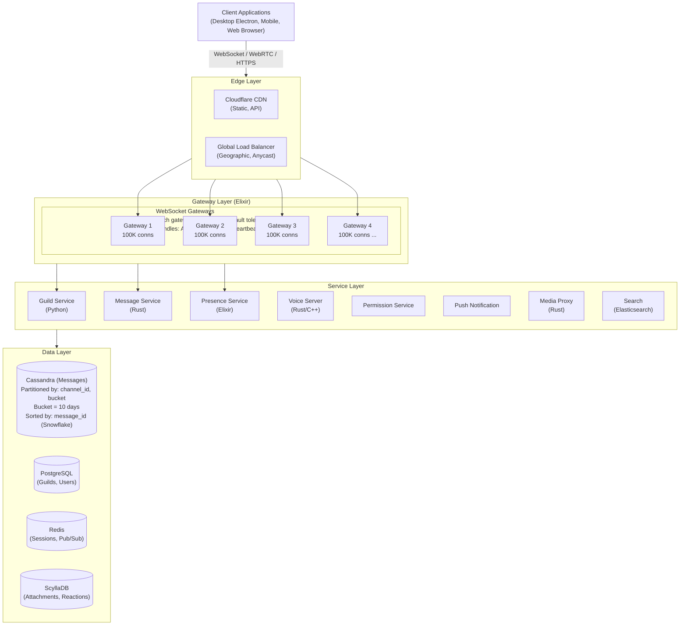
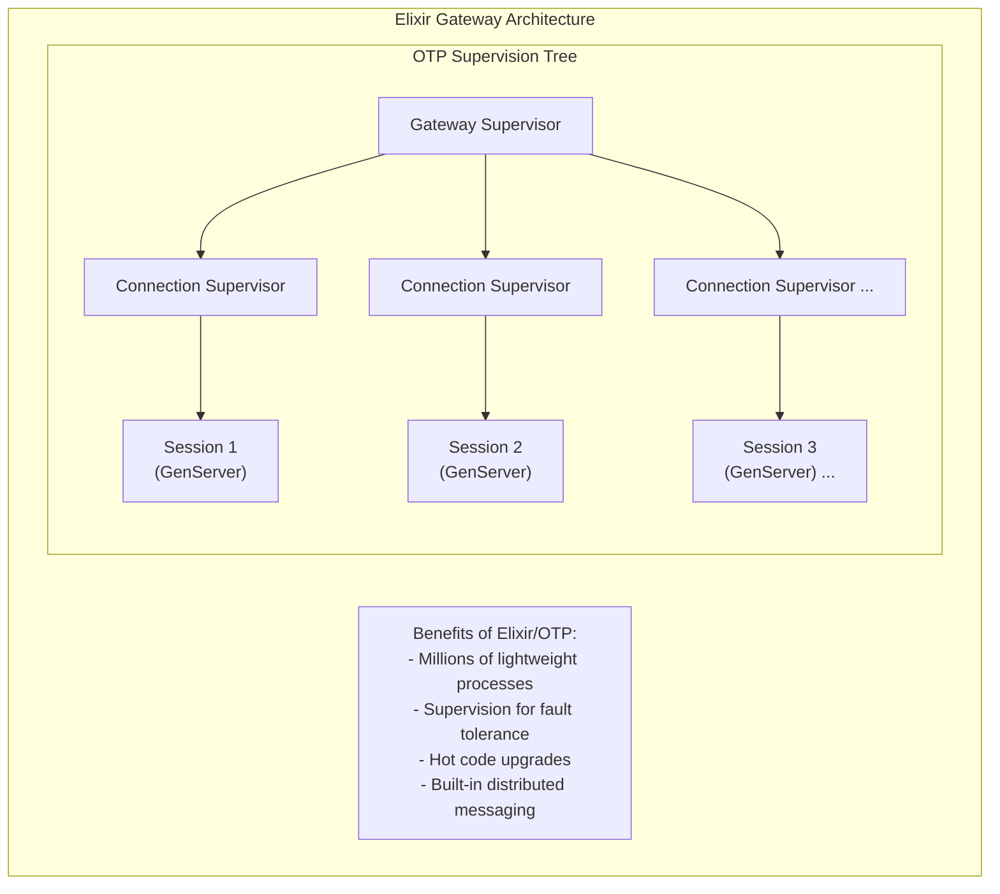
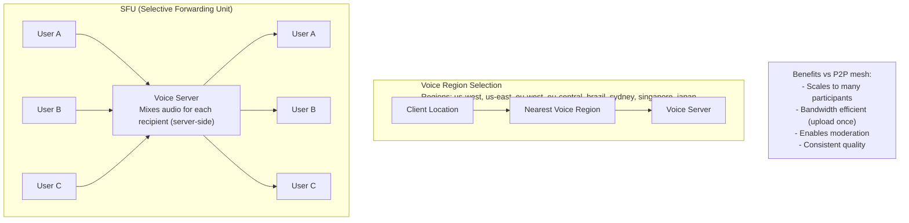

# Discord システム設計

> **注意:** この記事は英語版からの翻訳です。コードブロック、Mermaidダイアグラム、企業名、技術スタック名は原文のまま記載しています。

## TL;DR

Discordは1億5,000万人以上の月間アクティブユーザーにリアルタイムの音声、ビデオ、テキストを提供しています。アーキテクチャの中心には、数百万の同時接続を処理する**ElixirによるWebSocketゲートウェイ**、CPU集約型サービス（メッセージストレージ、音声）のための**Rust**、水平スケーリングのための**ギルドベースシャーディング**、時系列最適化を施した**Cassandraによるメッセージストレージ**、そして音声チャンネルのための**WebRTC SFU**があります。重要な知見：ゲーミングユーザーは超低レイテンシを要求します。100ms未満のメッセージ配信と50ms未満の音声レイテンシを最適化します。

---

## コア要件

### 機能要件
1. **リアルタイムメッセージング** - チャンネルとDMでのテキストチャット
2. **ボイスチャンネル** - 低レイテンシの音声通信
3. **ビデオストリーミング** - 画面共有とカメラ
4. **サーバー/ギルド管理** - コミュニティの作成と管理
5. **ロールと権限** - きめ細かなアクセス制御
6. **リッチプレゼンス** - ユーザーがプレイ/実行中の内容を表示

### 非機能要件
1. **レイテンシ** - メッセージ配信 < 100ms、音声 < 50ms
2. **スケール** - 数百万の同時ユーザー、毎秒1,000万以上のメッセージ
3. **信頼性** - 99.99%の稼働率
4. **整合性** - チャンネル内でメッセージが順序通りに表示される
5. **効率性** - 10万以上のメンバーを持つサーバー（「メガギルド」）の処理

---

## 上位レベルアーキテクチャ



---

## Gatewayアーキテクチャ（Elixir）



### Gateway実装

```elixir
defmodule Discord.Gateway.Session do
  @moduledoc """
  Handles a single WebSocket connection.
  Each user session is an Elixir process.
  """

  use GenServer
  require Logger

  @heartbeat_interval 41_250  # ~41 seconds
  @heartbeat_timeout 60_000   # 60 seconds

  defstruct [
    :user_id,
    :session_id,
    :websocket,
    :guilds,
    :subscribed_channels,
    :last_heartbeat,
    :sequence,
    :shard_id,
    :compress
  ]

  def start_link(websocket, opts) do
    GenServer.start_link(__MODULE__, {websocket, opts})
  end

  @impl true
  def init({websocket, opts}) do
    # Schedule heartbeat check
    Process.send_after(self(), :check_heartbeat, @heartbeat_interval)

    state = %__MODULE__{
      websocket: websocket,
      session_id: generate_session_id(),
      guilds: MapSet.new(),
      subscribed_channels: MapSet.new(),
      last_heartbeat: System.monotonic_time(:millisecond),
      sequence: 0,
      compress: opts[:compress] || false
    }

    # Send HELLO with heartbeat interval
    send_payload(state, %{
      op: 10,  # HELLO
      d: %{heartbeat_interval: @heartbeat_interval}
    })

    {:ok, state}
  end

  @impl true
  def handle_info({:websocket, payload}, state) do
    case Jason.decode(payload) do
      {:ok, %{"op" => op} = data} ->
        handle_opcode(op, data, state)
      {:error, _} ->
        {:noreply, state}
    end
  end

  def handle_info(:check_heartbeat, state) do
    now = System.monotonic_time(:millisecond)

    if now - state.last_heartbeat > @heartbeat_timeout do
      # Connection dead, close it
      Logger.warn("Session #{state.session_id} heartbeat timeout")
      send_close(state, 4009, "Session timed out")
      {:stop, :normal, state}
    else
      Process.send_after(self(), :check_heartbeat, @heartbeat_interval)
      {:noreply, state}
    end
  end

  def handle_info({:dispatch, event_type, payload}, state) do
    # Dispatch event to client
    new_seq = state.sequence + 1

    send_payload(state, %{
      op: 0,  # DISPATCH
      t: event_type,
      s: new_seq,
      d: payload
    })

    {:noreply, %{state | sequence: new_seq}}
  end

  # Handle IDENTIFY (op: 2)
  defp handle_opcode(2, %{"d" => identify_data}, state) do
    token = identify_data["token"]

    case Discord.Auth.validate_token(token) do
      {:ok, user} ->
        # Authenticate successful
        state = %{state | user_id: user.id}

        # Register session globally
        Discord.Sessions.register(user.id, state.session_id, self())

        # Subscribe to user's guilds
        guilds = Discord.Guilds.get_user_guilds(user.id)

        Enum.each(guilds, fn guild ->
          Discord.PubSub.subscribe("guild:#{guild.id}")
        end)

        # Send READY event
        ready_payload = %{
          v: 10,  # Gateway version
          user: serialize_user(user),
          guilds: Enum.map(guilds, &serialize_guild_stub/1),
          session_id: state.session_id,
          resume_gateway_url: get_resume_url()
        }

        send_dispatch(state, "READY", ready_payload)

        # Lazy load guild data
        Enum.each(guilds, fn guild ->
          send_dispatch(state, "GUILD_CREATE", serialize_guild(guild))
        end)

        {:noreply, %{state | guilds: MapSet.new(Enum.map(guilds, & &1.id))}}

      {:error, :invalid_token} ->
        send_close(state, 4004, "Authentication failed")
        {:stop, :normal, state}
    end
  end

  # Handle HEARTBEAT (op: 1)
  defp handle_opcode(1, %{"d" => seq}, state) do
    # Respond with HEARTBEAT_ACK
    send_payload(state, %{op: 11})

    {:noreply, %{state | last_heartbeat: System.monotonic_time(:millisecond)}}
  end

  # Handle RESUME (op: 6)
  defp handle_opcode(6, %{"d" => resume_data}, state) do
    session_id = resume_data["session_id"]
    seq = resume_data["seq"]

    case Discord.Sessions.get_missed_events(session_id, seq) do
      {:ok, events} ->
        # Replay missed events
        Enum.each(events, fn {event_type, payload, event_seq} ->
          send_payload(state, %{
            op: 0,
            t: event_type,
            s: event_seq,
            d: payload
          })
        end)

        send_dispatch(state, "RESUMED", %{})
        {:noreply, %{state | sequence: List.last(events) |> elem(2)}}

      {:error, :session_expired} ->
        # Force re-identify
        send_payload(state, %{op: 9, d: false})  # INVALID_SESSION
        {:noreply, state}
    end
  end

  defp send_payload(state, payload) do
    data = Jason.encode!(payload)

    data = if state.compress do
      :zlib.compress(data)
    else
      data
    end

    send(state.websocket, {:send, data})
  end

  defp send_dispatch(state, event_type, payload) do
    send(self(), {:dispatch, event_type, payload})
  end
end

defmodule Discord.Gateway.Dispatcher do
  @moduledoc """
  Routes events to connected sessions.
  Uses ETS for O(1) lookups and pub/sub for distribution.
  """

  def dispatch_to_guild(guild_id, event_type, payload) do
    # Publish to all gateways that have members in this guild
    Discord.PubSub.broadcast("guild:#{guild_id}", {event_type, payload})
  end

  def dispatch_to_channel(channel_id, event_type, payload) do
    Discord.PubSub.broadcast("channel:#{channel_id}", {event_type, payload})
  end

  def dispatch_to_user(user_id, event_type, payload) do
    # Get all sessions for user
    sessions = Discord.Sessions.get_user_sessions(user_id)

    Enum.each(sessions, fn {_session_id, pid} ->
      send(pid, {:dispatch, event_type, payload})
    end)
  end
end
```

---

## Cassandraによるメッセージストレージ

```
┌─────────────────────────────────────────────────────────────────────────┐
│                   Cassandra Message Schema                               │
│                                                                          │
│   Partition Key: (channel_id, bucket)                                   │
│   Clustering Key: message_id DESC                                       │
│                                                                          │
│   ┌──────────────────────────────────────────────────────────────────┐  │
│   │                    Partition: (#general, 2024-01)                 │  │
│   │                                                                   │  │
│   │   message_id          | author_id | content      | created_at    │  │
│   │   ────────────────────────────────────────────────────────────   │  │
│   │   123456789012345678  | user_1    | "Hello!"     | 2024-01-15    │  │
│   │   123456789012345677  | user_2    | "Hi there"   | 2024-01-15    │  │
│   │   123456789012345676  | user_1    | "How are you"| 2024-01-14    │  │
│   │   ...                                                             │  │
│   └──────────────────────────────────────────────────────────────────┘  │
│                                                                          │
│   Why Bucket by Time:                                                   │
│   - Prevents hot partitions (all writes to one channel)                │
│   - Enables efficient time-range queries                                │
│   - Automatic data aging (delete old buckets)                          │
│   - Bucket size: 10 days of messages                                   │
│                                                                          │
│   Snowflake ID Benefits:                                                │
│   - Globally unique                                                     │
│   - Time-sortable                                                       │
│   - Cluster column ordering = chronological                             │
└─────────────────────────────────────────────────────────────────────────┘
```

### メッセージサービス実装（Rust）

```rust
use std::time::{SystemTime, UNIX_EPOCH};
use cassandra_cpp::{Cluster, Session, Statement};
use serde::{Deserialize, Serialize};

/// Discord Snowflake ID generator
/// Format: timestamp (42 bits) | worker_id (5 bits) | process_id (5 bits) | increment (12 bits)
pub struct SnowflakeGenerator {
    worker_id: u64,
    process_id: u64,
    sequence: u64,
    last_timestamp: u64,
}

impl SnowflakeGenerator {
    const DISCORD_EPOCH: u64 = 1420070400000; // 2015-01-01

    pub fn new(worker_id: u64, process_id: u64) -> Self {
        Self {
            worker_id: worker_id & 0x1F,  // 5 bits
            process_id: process_id & 0x1F, // 5 bits
            sequence: 0,
            last_timestamp: 0,
        }
    }

    pub fn generate(&mut self) -> u64 {
        let mut timestamp = self.current_timestamp();

        if timestamp == self.last_timestamp {
            self.sequence = (self.sequence + 1) & 0xFFF; // 12 bits

            if self.sequence == 0 {
                // Wait for next millisecond
                while timestamp <= self.last_timestamp {
                    timestamp = self.current_timestamp();
                }
            }
        } else {
            self.sequence = 0;
        }

        self.last_timestamp = timestamp;

        ((timestamp - Self::DISCORD_EPOCH) << 22)
            | (self.worker_id << 17)
            | (self.process_id << 12)
            | self.sequence
    }

    fn current_timestamp(&self) -> u64 {
        SystemTime::now()
            .duration_since(UNIX_EPOCH)
            .unwrap()
            .as_millis() as u64
    }
}

#[derive(Debug, Serialize, Deserialize)]
pub struct Message {
    pub id: u64,
    pub channel_id: u64,
    pub author_id: u64,
    pub content: String,
    pub timestamp: i64,
    pub edited_timestamp: Option<i64>,
    pub tts: bool,
    pub mention_everyone: bool,
    pub mentions: Vec<u64>,
    pub attachments: Vec<Attachment>,
    pub embeds: Vec<Embed>,
    pub reactions: Vec<Reaction>,
    pub nonce: Option<String>,
    pub pinned: bool,
    pub message_type: i32,
}

pub struct MessageService {
    cassandra: Session,
    snowflake: SnowflakeGenerator,
    cache: redis::Client,
    bucket_size_days: i64,
}

impl MessageService {
    /// Calculate bucket for a given timestamp
    fn calculate_bucket(&self, timestamp: i64) -> i64 {
        let days_since_epoch = timestamp / (24 * 60 * 60 * 1000);
        (days_since_epoch / self.bucket_size_days) * self.bucket_size_days
    }

    /// Create a new message
    pub async fn create_message(
        &mut self,
        channel_id: u64,
        author_id: u64,
        content: String,
        attachments: Vec<Attachment>,
    ) -> Result<Message, Error> {
        let message_id = self.snowflake.generate();
        let timestamp = chrono::Utc::now().timestamp_millis();
        let bucket = self.calculate_bucket(timestamp);

        let message = Message {
            id: message_id,
            channel_id,
            author_id,
            content,
            timestamp,
            edited_timestamp: None,
            tts: false,
            mention_everyone: false,
            mentions: self.extract_mentions(&content),
            attachments,
            embeds: vec![],
            reactions: vec![],
            nonce: None,
            pinned: false,
            message_type: 0,
        };

        // Insert into Cassandra
        let query = r#"
            INSERT INTO messages (
                channel_id, bucket, message_id, author_id, content,
                timestamp, edited_timestamp, tts, mention_everyone,
                mentions, attachments, embeds, pinned, message_type
            ) VALUES (?, ?, ?, ?, ?, ?, ?, ?, ?, ?, ?, ?, ?, ?)
        "#;

        let mut statement = Statement::new(query, 14);
        statement.bind_int64(0, channel_id as i64)?;
        statement.bind_int64(1, bucket)?;
        statement.bind_int64(2, message_id as i64)?;
        statement.bind_int64(3, author_id as i64)?;
        statement.bind_string(4, &message.content)?;
        // ... bind remaining fields

        self.cassandra.execute(&statement).await?;

        // Update channel's last_message_id
        self.update_channel_last_message(channel_id, message_id).await?;

        // Invalidate cache
        self.cache.del(&format!("channel:{}:messages", channel_id)).await?;

        Ok(message)
    }

    /// Get messages from a channel with pagination
    pub async fn get_messages(
        &self,
        channel_id: u64,
        before: Option<u64>,
        after: Option<u64>,
        limit: i32,
    ) -> Result<Vec<Message>, Error> {
        // Check cache first
        let cache_key = format!("channel:{}:messages:latest", channel_id);
        if before.is_none() && after.is_none() {
            if let Some(cached) = self.cache.get(&cache_key).await? {
                return Ok(serde_json::from_str(&cached)?);
            }
        }

        // Determine which buckets to query
        let buckets = self.get_relevant_buckets(channel_id, before, after).await?;

        let mut messages = Vec::new();

        for bucket in buckets {
            let query = if let Some(before_id) = before {
                r#"
                    SELECT * FROM messages
                    WHERE channel_id = ? AND bucket = ? AND message_id < ?
                    ORDER BY message_id DESC
                    LIMIT ?
                "#
            } else if let Some(after_id) = after {
                r#"
                    SELECT * FROM messages
                    WHERE channel_id = ? AND bucket = ? AND message_id > ?
                    ORDER BY message_id ASC
                    LIMIT ?
                "#
            } else {
                r#"
                    SELECT * FROM messages
                    WHERE channel_id = ? AND bucket = ?
                    ORDER BY message_id DESC
                    LIMIT ?
                "#
            };

            let mut statement = Statement::new(query, 4);
            statement.bind_int64(0, channel_id as i64)?;
            statement.bind_int64(1, bucket)?;

            if let Some(id) = before.or(after) {
                statement.bind_int64(2, id as i64)?;
                statement.bind_int32(3, limit)?;
            } else {
                statement.bind_int32(2, limit)?;
            }

            let result = self.cassandra.execute(&statement).await?;

            for row in result.iter() {
                messages.push(self.row_to_message(&row)?);
            }

            if messages.len() >= limit as usize {
                break;
            }
        }

        messages.truncate(limit as usize);

        // Cache if fetching latest
        if before.is_none() && after.is_none() {
            let cached = serde_json::to_string(&messages)?;
            self.cache.setex(&cache_key, 60, &cached).await?;
        }

        Ok(messages)
    }

    /// Handle message deletion - Discord keeps tombstones for sync
    pub async fn delete_message(
        &self,
        channel_id: u64,
        message_id: u64,
    ) -> Result<(), Error> {
        // Get message to find bucket
        let message = self.get_message(channel_id, message_id).await?;
        let bucket = self.calculate_bucket(message.timestamp);

        // Soft delete - mark as deleted rather than removing
        let query = r#"
            UPDATE messages
            SET deleted = true, content = ''
            WHERE channel_id = ? AND bucket = ? AND message_id = ?
        "#;

        let mut statement = Statement::new(query, 3);
        statement.bind_int64(0, channel_id as i64)?;
        statement.bind_int64(1, bucket)?;
        statement.bind_int64(2, message_id as i64)?;

        self.cassandra.execute(&statement).await?;

        // Invalidate cache
        self.cache.del(&format!("channel:{}:messages", channel_id)).await?;

        Ok(())
    }
}
```

---

## 音声アーキテクチャ



**プロトコルスタック:**

- Application (Opus Audio / VP8 Video Codec)
- RTP/RTCP (Real-time Transport Protocol)
- DTLS-SRTP (Encryption)
- UDP/WebRTC

### ボイスサーバー実装

```rust
use std::collections::HashMap;
use std::sync::Arc;
use tokio::sync::RwLock;
use webrtc::peer_connection::RTCPeerConnection;
use webrtc::track::track_remote::TrackRemote;

/// Voice channel state
pub struct VoiceChannel {
    pub id: u64,
    pub guild_id: u64,
    pub participants: HashMap<u64, Participant>,
    pub speaking: HashMap<u64, bool>,
}

pub struct Participant {
    pub user_id: u64,
    pub session_id: String,
    pub peer_connection: Arc<RTCPeerConnection>,
    pub audio_track: Option<Arc<TrackRemote>>,
    pub video_track: Option<Arc<TrackRemote>>,
    pub muted: bool,
    pub deafened: bool,
    pub self_muted: bool,
    pub self_deafened: bool,
}

pub struct VoiceServer {
    channels: RwLock<HashMap<u64, VoiceChannel>>,
    region: String,
    opus_encoder: OpusEncoder,
}

impl VoiceServer {
    pub async fn join_channel(
        &self,
        channel_id: u64,
        user_id: u64,
        session_id: String,
    ) -> Result<VoiceConnectionInfo, Error> {
        let mut channels = self.channels.write().await;

        let channel = channels
            .entry(channel_id)
            .or_insert_with(|| VoiceChannel {
                id: channel_id,
                guild_id: 0, // Set from metadata
                participants: HashMap::new(),
                speaking: HashMap::new(),
            });

        // Create WebRTC peer connection
        let config = RTCConfiguration {
            ice_servers: vec![
                RTCIceServer {
                    urls: vec!["stun:stun.discord.com:3478".to_string()],
                    ..Default::default()
                },
            ],
            ..Default::default()
        };

        let peer_connection = Arc::new(
            RTCPeerConnection::new(&config).await?
        );

        // Set up audio/video receivers
        peer_connection.on_track(Box::new(move |track, receiver, transceiver| {
            let track = track.clone();
            Box::pin(async move {
                Self::handle_incoming_track(channel_id, user_id, track).await;
            })
        }));

        // Add participant
        channel.participants.insert(user_id, Participant {
            user_id,
            session_id: session_id.clone(),
            peer_connection: peer_connection.clone(),
            audio_track: None,
            video_track: None,
            muted: false,
            deafened: false,
            self_muted: false,
            self_deafened: false,
        });

        // Notify other participants
        self.broadcast_voice_state(channel_id, user_id, VoiceState::Joined).await;

        // Create offer for client
        let offer = peer_connection.create_offer(None).await?;
        peer_connection.set_local_description(offer.clone()).await?;

        Ok(VoiceConnectionInfo {
            endpoint: format!("wss://{}.discord.media:443", self.region),
            session_id,
            sdp: offer.sdp,
            user_id,
        })
    }

    async fn handle_incoming_track(
        channel_id: u64,
        user_id: u64,
        track: Arc<TrackRemote>,
    ) {
        // Read incoming audio/video
        tokio::spawn(async move {
            let mut buf = vec![0u8; 1500];

            while let Ok((n, _)) = track.read(&mut buf).await {
                let packet = &buf[..n];

                // Forward to other participants (SFU pattern)
                Self::forward_media(channel_id, user_id, packet).await;
            }
        });
    }

    async fn forward_media(channel_id: u64, sender_id: u64, packet: &[u8]) {
        let channels = VOICE_SERVER.channels.read().await;

        if let Some(channel) = channels.get(&channel_id) {
            for (user_id, participant) in &channel.participants {
                if *user_id != sender_id && !participant.deafened {
                    // Send packet to this participant
                    if let Some(ref track) = participant.audio_track {
                        // Write to participant's track
                        let _ = track.write(packet).await;
                    }
                }
            }
        }
    }

    pub async fn set_speaking(
        &self,
        channel_id: u64,
        user_id: u64,
        speaking: bool,
    ) {
        let mut channels = self.channels.write().await;

        if let Some(channel) = channels.get_mut(&channel_id) {
            channel.speaking.insert(user_id, speaking);

            // Broadcast speaking indicator
            self.broadcast_speaking(channel_id, user_id, speaking).await;
        }
    }

    async fn broadcast_speaking(&self, channel_id: u64, user_id: u64, speaking: bool) {
        // Send to all participants via WebSocket
        let payload = VoiceEvent::Speaking {
            user_id,
            speaking,
            ssrc: self.get_ssrc(user_id),
        };

        // Dispatch through gateway
        Gateway::dispatch_to_channel(channel_id, "SPEAKING", payload).await;
    }
}

/// Audio processing with Opus codec
pub struct AudioProcessor {
    encoder: opus::Encoder,
    decoder: opus::Decoder,
    jitter_buffer: JitterBuffer,
}

impl AudioProcessor {
    pub fn new() -> Result<Self, Error> {
        let encoder = opus::Encoder::new(
            48000,  // Sample rate
            opus::Channels::Stereo,
            opus::Application::Voip,
        )?;

        let decoder = opus::Decoder::new(48000, opus::Channels::Stereo)?;

        Ok(Self {
            encoder,
            decoder,
            jitter_buffer: JitterBuffer::new(200), // 200ms buffer
        })
    }

    pub fn encode(&mut self, pcm: &[i16]) -> Result<Vec<u8>, Error> {
        let mut output = vec![0u8; 4000];
        let len = self.encoder.encode(pcm, &mut output)?;
        output.truncate(len);
        Ok(output)
    }

    pub fn decode(&mut self, opus_data: &[u8]) -> Result<Vec<i16>, Error> {
        let mut output = vec![0i16; 5760]; // Max frame size
        let len = self.decoder.decode(opus_data, &mut output, false)?;
        output.truncate(len * 2); // Stereo
        Ok(output)
    }
}
```

---

## メガギルドの処理

### GuildService - メンバークエリとチャンキング（Python）

```python
# GuildService is Python in Discord's architecture
from dataclasses import dataclass
from typing import List, Dict, Set, Optional
import asyncio


@dataclass
class GuildMemberChunk:
    """Chunk of guild members for lazy loading"""
    guild_id: int
    members: List[dict]
    chunk_index: int
    chunk_count: int
    not_found: List[int]  # Requested but not found IDs
    nonce: Optional[str]


class MegaGuildHandler:
    """
    GuildService: DB queries and member chunking for guilds with 100k+ members.
    Lazy loading and chunking to avoid overwhelming clients.
    """

    MEGA_GUILD_THRESHOLD = 100_000
    CHUNK_SIZE = 1000

    def __init__(self, db_client, cache_client):
        self.db = db_client
        self.cache = cache_client

    async def on_guild_available(
        self,
        guild_id: int
    ) -> dict:
        """Called when client connects and guild becomes available"""
        member_count = await self._get_member_count(guild_id)

        if member_count >= self.MEGA_GUILD_THRESHOLD:
            # Don't send full member list
            # Client must request specific members
            return {
                "id": str(guild_id),
                "member_count": member_count,
                "large": True,
                "members": [],  # Empty - use request_guild_members
                "presences": [],
            }
        else:
            # Small guild - send full member list
            members = await self._get_all_members(guild_id)
            presences = await self._get_online_presences(guild_id)

            return {
                "id": str(guild_id),
                "member_count": member_count,
                "large": False,
                "members": members,
                "presences": presences,
            }

    async def request_guild_members(
        self,
        guild_id: int,
        query: Optional[str] = None,
        limit: int = 0,
        user_ids: Optional[List[int]] = None,
    ) -> dict:
        """
        Handle REQUEST_GUILD_MEMBERS (opcode 8).
        Returns members matching query or IDs, ready for chunking.
        """
        if user_ids:
            # Fetch specific users
            members = await self._get_members_by_ids(guild_id, user_ids)

            # Find which IDs weren't found
            found_ids = {m["user"]["id"] for m in members}
            not_found = [uid for uid in user_ids if uid not in found_ids]

        elif query is not None:
            # Search by username prefix
            members = await self._search_members(guild_id, query, limit or 100)
            not_found = []
        else:
            # Get all members (chunked)
            members = await self._get_all_members(guild_id)
            not_found = []

        return {"members": members, "not_found": not_found}

    async def get_channel_visible_members(
        self,
        guild_id: int,
        channel_id: int
    ) -> List[int]:
        """Get members who can see this channel based on permissions."""
        return await self._get_channel_visible_members(guild_id, channel_id)

    def chunk_members(
        self,
        members: List[dict],
        chunk_size: int
    ) -> List[List[dict]]:
        """Split members into chunks"""
        return [
            members[i:i + chunk_size]
            for i in range(0, len(members), chunk_size)
        ]
```

### メンバーリストサブスクリプション追跡（Elixir）

```elixir
defmodule Discord.Guild.MemberListSubscription do
  @moduledoc """
  Tracks member list subscriptions for mega-guilds.
  Each guild channel's member sidebar is managed by a GenServer process.
  Syncs only the visible portion of the member list to subscribed sessions.
  """

  use GenServer
  require Logger

  @chunk_size 1000
  @cache_ttl_ms 60_000

  defstruct [
    :guild_id,
    :channel_id,
    subscribed_sessions: %{},   # session_id => pid
    member_groups: [],           # [{group_id, count, items}]
    online_count: 0,
    member_count: 0,
    last_refreshed: 0
  ]

  # --- Public API ---

  def start_link({guild_id, channel_id}) do
    GenServer.start_link(
      __MODULE__,
      {guild_id, channel_id},
      name: via(guild_id, channel_id)
    )
  end

  def subscribe(guild_id, channel_id, session_id, session_pid) do
    GenServer.call(
      via(guild_id, channel_id),
      {:subscribe, session_id, session_pid}
    )
  end

  def unsubscribe(guild_id, channel_id, session_id) do
    GenServer.cast(
      via(guild_id, channel_id),
      {:unsubscribe, session_id}
    )
  end

  def sync_range(guild_id, channel_id, session_id, range_start, range_end) do
    GenServer.call(
      via(guild_id, channel_id),
      {:sync_range, session_id, range_start, range_end}
    )
  end

  # --- Callbacks ---

  @impl true
  def init({guild_id, channel_id}) do
    # Monitor subscribed sessions so we can clean up on disconnect
    state = %__MODULE__{
      guild_id: guild_id,
      channel_id: channel_id
    }

    {:ok, state, {:continue, :load_members}}
  end

  @impl true
  def handle_continue(:load_members, state) do
    {:noreply, refresh_member_groups(state)}
  end

  @impl true
  def handle_call({:subscribe, session_id, session_pid}, _from, state) do
    Process.monitor(session_pid)

    new_subs = Map.put(state.subscribed_sessions, session_id, session_pid)
    state = %{state | subscribed_sessions: new_subs}

    # Fetch visible members from GuildService (Python) via RPC
    visible_ids =
      Discord.GuildService.get_channel_visible_members(
        state.guild_id,
        state.channel_id
      )

    # Request initial chunk from GuildService and dispatch
    result =
      Discord.GuildService.request_guild_members(
        state.guild_id,
        user_ids: Enum.take(visible_ids, @chunk_size)
      )

    chunks = chunk_members(result.members, @chunk_size)

    Enum.with_index(chunks, fn chunk, i ->
      payload = %{
        guild_id: state.guild_id,
        members: chunk,
        chunk_index: i,
        chunk_count: length(chunks),
        not_found: if(i == 0, do: result.not_found, else: []),
        nonce: nil
      }

      send(session_pid, {:dispatch, "GUILD_MEMBERS_CHUNK", payload})
    end)

    {:reply, :ok, state}
  end

  @impl true
  def handle_call({:sync_range, _session_id, range_start, range_end}, _from, state) do
    state = maybe_refresh(state)

    ops =
      state.member_groups
      |> Enum.reduce({0, []}, fn {group_id, count, items}, {idx, acc} ->
        group_start = idx
        group_end = idx + count

        acc =
          if group_end > range_start and group_start < range_end do
            vis_start = max(0, range_start - group_start)
            vis_end = min(count, range_end - group_start)

            op = %{
              op: "SYNC",
              items: Enum.slice(items, vis_start, vis_end - vis_start),
              range: [group_start + vis_start, group_start + vis_end]
            }

            [op | acc]
          else
            acc
          end

        {group_end, acc}
      end)
      |> elem(1)
      |> Enum.reverse()

    reply = %{
      ops: ops,
      online_count: state.online_count,
      member_count: state.member_count
    }

    {:reply, reply, state}
  end

  @impl true
  def handle_cast({:unsubscribe, session_id}, state) do
    new_subs = Map.delete(state.subscribed_sessions, session_id)
    {:noreply, %{state | subscribed_sessions: new_subs}}
  end

  @impl true
  def handle_info({:DOWN, _ref, :process, pid, _reason}, state) do
    # Clean up when a session process exits
    new_subs =
      state.subscribed_sessions
      |> Enum.reject(fn {_sid, p} -> p == pid end)
      |> Map.new()

    {:noreply, %{state | subscribed_sessions: new_subs}}
  end

  # --- Internals ---

  defp maybe_refresh(state) do
    now = System.monotonic_time(:millisecond)

    if now - state.last_refreshed > @cache_ttl_ms do
      refresh_member_groups(state)
    else
      state
    end
  end

  defp refresh_member_groups(state) do
    members =
      Discord.GuildService.get_channel_members(state.guild_id, state.channel_id)

    groups =
      members
      |> Enum.group_by(&get_member_group/1)
      |> Enum.map(fn {group_id, items} ->
        {group_id, length(items), items}
      end)

    online = Enum.count(members, fn m -> m[:status] != "offline" end)

    %{state |
      member_groups: groups,
      online_count: online,
      member_count: length(members),
      last_refreshed: System.monotonic_time(:millisecond)
    }
  end

  defp get_member_group(member) do
    member[:highest_role_id] || "online"
  end

  defp chunk_members(members, size) do
    Enum.chunk_every(members, size)
  end

  defp via(guild_id, channel_id) do
    {:via, Registry, {Discord.MemberListRegistry, {guild_id, channel_id}}}
  end
end
```

---

## 主要メトリクスとスケール

| メトリクス | 値 |
|--------|-------|
| **月間アクティブユーザー** | 1億5,000万以上 |
| **同時ユーザー数** | 1,000万以上 |
| **毎秒のメッセージ数** | 1,000万以上 |
| **1日あたりの音声通話時間** | 40億分以上 |
| **ギルド（サーバー）数** | 1,900万以上 |
| **最大ギルドのメンバー数** | 100万以上 |
| **WebSocket接続数** | 数百万の同時接続 |
| **メッセージレイテンシ** | < 100ms |
| **音声レイテンシ** | < 50ms |
| **Gateway稼働率** | 99.99% |

---

## 重要なポイント

1. **WebSocketゲートウェイにElixir** - OTPスーパービジョンがフォールトトレランスを提供します。数百万の軽量プロセスで接続を処理します。ホットコードアップグレードでゼロダウンタイムデプロイを実現します。

2. **CPU集約型サービスにRust** - メッセージストレージ、音声ミキシング、メディア処理はパフォーマンスとメモリ安全性のためにRustを使用します。

3. **時間バケットパーティションを持つCassandra** - チャンネルメッセージは(channel_id, bucket)でパーティショニングされます。アクティブなチャンネルでのホットパーティションを防止します。

4. **Snowflake ID** - 時間ソート可能でグローバルに一意なIDです。クラスタリングキーとしての自然な時系列順序を提供します。

5. **音声のためのSFU** - Selective Forwarding UnitはP2Pメッシュよりもスケールします。一度アップロードすれば、サーバーが他に転送します。モデレーションが可能になります。

6. **メンバーの遅延読み込み** - 大規模ギルドは完全なメンバーリストを送信しません。クライアントはチャンキングでオンデマンドに可視メンバーをリクエストします。

7. **リージョン別の音声サーバー** - 音声は最低レイテンシのために最も近いリージョンにルーティングされます。APIゲートウェイインフラストラクチャとは分離されています。

8. **プレゼンスの最適化** - ユーザーが可視のチャンネルにのみプレゼンスをブロードキャストします。メガギルドのイベントボリュームを削減します。

---

## 本番環境での知見

### メガギルドの遅延プレゼンス

100万以上のメンバーを持つサーバーは、すべての接続クライアントにプレゼンス更新をファンアウトすることができません。Discordは**遅延プレゼンス**を使用しています。クライアントは現在のチャンネルのメンバーサイドバーに可視のメンバーのプレゼンス更新のみを受信します。ユーザーがメンバーリストをスクロールすると、クライアントは可視範囲を含む`LAZY_REQUEST`を送信し、ゲートウェイはそのスライスのみを同期します。

オンラインメンバーが約75,000を超えるギルドでは、ゲートウェイは`GUILD_CREATE`時の完全なプレゼンスディスパッチを完全にスキップします。代わりに、プレゼンスは`MemberListSubscription`を介してチャンネルごとにオンデマンドで取得されます。これにより、プレゼンスイベントのボリュームがO(n^2)からO(visible_range * active_channels)に削減されます。

```elixir
defmodule Discord.Presence.LazyFanOut do
  @moduledoc """
  Lazy presence fan-out for mega-guilds.
  Instead of broadcasting to all guild members, only notify
  sessions that have the target user in their visible member list range.
  """

  @lazy_threshold 75_000

  def broadcast_presence_update(guild_id, user_id, new_status) do
    online_count = Discord.Presence.online_count(guild_id)

    if online_count >= @lazy_threshold do
      # Only notify sessions subscribed to channels where this user is visible
      subscribed_sessions =
        Discord.MemberListRegistry
        |> Registry.select([{{:"$1", :"$2", :"$3"}, [], [{{:"$1", :"$2"}}]}])
        |> Enum.filter(fn {{gid, _cid}} -> gid == guild_id end)

      Enum.each(subscribed_sessions, fn {{_gid, channel_id}} ->
        Discord.Guild.MemberListSubscription.notify_presence(
          guild_id, channel_id, user_id, new_status
        )
      end)
    else
      # Small guild: broadcast to all subscribed sessions
      Discord.PubSub.broadcast("guild:#{guild_id}", {"PRESENCE_UPDATE", %{
        user: %{id: user_id},
        status: new_status,
        guild_id: guild_id
      }})
    end
  end
end
```

### ギルドシャーディング

すべてのギルドはコンシステントハッシュを使用してシャードに割り当てられます：`shard_id = guild_id % num_shards`。各ゲートウェイノードはシャードの範囲を所有するため、特定のギルドのすべてのイベントが同じノード（または少数のノードセット）で処理されます。これにより、権限チェックやメンバーリスト更新などのギルド内操作でのクロスノード連携が不要になります。

ギルドが単一シャードで処理できる範囲を超えた場合（例：100万以上のメンバー）、Discordはルーティングキーを安定させたまま、ホットな操作をサブシャードに分割します。クライアントは`IDENTIFY`レスポンスで`shard_id`と`num_shards`を受け取り、正しいゲートウェイに再接続します。

```elixir
defmodule Discord.Guild.ShardRouter do
  @moduledoc """
  Routes guild operations to the correct shard.
  Uses guild_id % num_shards for deterministic assignment.
  """

  def shard_for(guild_id, num_shards) do
    rem(guild_id, num_shards)
  end

  def route(guild_id, operation, payload) do
    shard_id = shard_for(guild_id, Discord.Config.num_shards())
    node = Discord.ShardMap.node_for_shard(shard_id)

    :rpc.call(node, Discord.Guild.Shard, :handle, [guild_id, operation, payload])
  end
end
```

### ScyllaDBへのCassandraからの移行（2023年）

Discordは2023年にメッセージストレージをCassandraからScyllaDBに移行しました。主な動機は**p99テールレイテンシ**でした。CassandraのJVMベースのガベージコレクションは、重いコンパクション時に数秒に及ぶ定期的なレイテンシスパイクを引き起こしていました。C++で書かれたScyllaDBは、GCポーズのないシャード・パー・コアアーキテクチャを使用しています。

移行の主な成果：
- **p99リードレイテンシ**: 約40-200ms（Cassandra、GC依存）から約15ms（ScyllaDB）に低下
- **p99ライトレイテンシ**: 約5-70msから約5msに低下し、外れ値が大幅に減少
- **コンパクション**: ScyllaDBのインクリメンタルコンパクションにより、Cassandraのサイズティアードコンパクションが引き起こす可能性のあった数秒間のストールが解消
- **運用コスト**: ScyllaDBのシャード・パー・コア効率により、同じスループットに必要なノード数が減少
- **スキーマ互換性**: ScyllaDBはCassandraのCQLとワイヤー互換であるため、パーティションキー設計`(channel_id, bucket)`とSnowflakeクラスタリングキーはそのまま引き継がれました

移行はデュアルライトによるライブ移行で実施されました。新しいメッセージは両方のクラスタに書き込まれ、リードはチェックサム検証とともに徐々にScyllaDBに移行されました。

### 500万以上の接続のためのBEAMスケジューラチューニング

各Elixirゲートウェイノードは約10万-20万のWebSocket接続を処理します。Discordの規模（約50以上のゲートウェイノード）では、BEAM VMスケジューラのチューニングが極めて重要です。

主要なチューニングパラメータ：
- **`+S`（スケジューラ）**: ハイパースレッドではなく物理コア数に固定します。ハイパースレッディングは高接続数でスケジューラスレッドの競合を引き起こします
- **`+SDcpu`**: ダーティCPUスケジューラを物理コア数と同数に設定します。NIF集約型操作（zlib圧縮、JSONエンコーディング）向けです
- **`+SDio`**: ダーティI/Oスケジューラをコア数の2倍に設定します。DNS解決や証明書検証などのブロッキング操作向けです
- **`+sbwt`（スケジューラビジーウェイト閾値）**: 本番環境では`none`に設定します。デフォルトのビジーウェイトは、20万のほぼアイドル状態の接続全体でCPUサイクルを浪費します
- **`+zdbbl`（ディストリビューションバッファビジーリミット）**: ノード間のErlangディストリビューショントラフィック用に32MBに増加します。デフォルトの1MBはプレゼンスファンアウトストーム時にバックプレッシャーを引き起こします
- **`+hms`（ヒープ最小サイズ）**: プロセスタイプごとにチューニングします。セッションプロセスは長寿命接続の早期GCサイクルを減らすために2586ワードで開始します
- **大規模ETSテーブル**: メンバールックアップテーブルは、スケジューラロック競合を避けるために`read_concurrency: true`と`write_concurrency: true`を使用します

```elixir
# vm.args tuning for a 200k-connection gateway node
# +P 5000000         Max processes (well above 200k connections + internal)
# +S 16:16           Schedulers pinned to 16 physical cores
# +SDcpu 16:16       Dirty CPU schedulers
# +SDio 32:32        Dirty I/O schedulers
# +sbwt none         Disable scheduler busy-wait
# +zdbbl 33554432    32MB distribution buffer
# +hms 2586          Min heap for session processes
```
