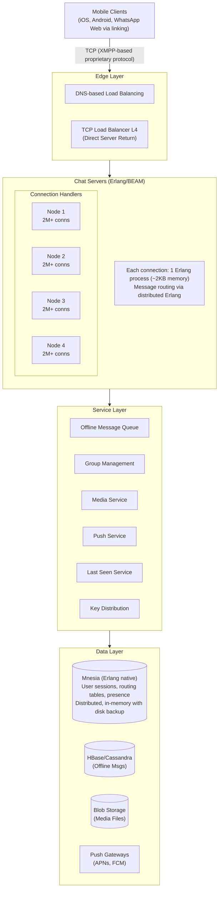
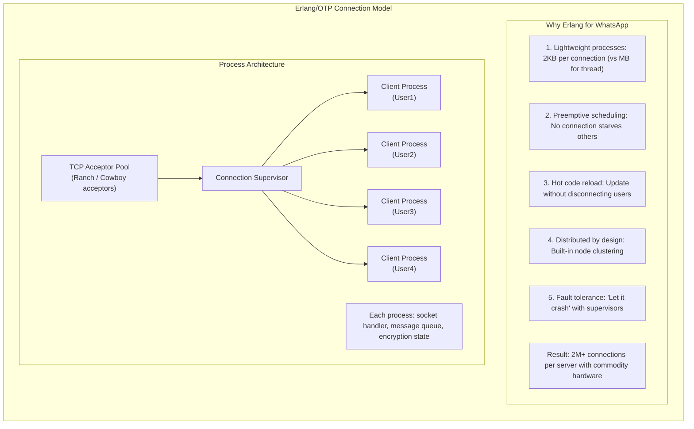
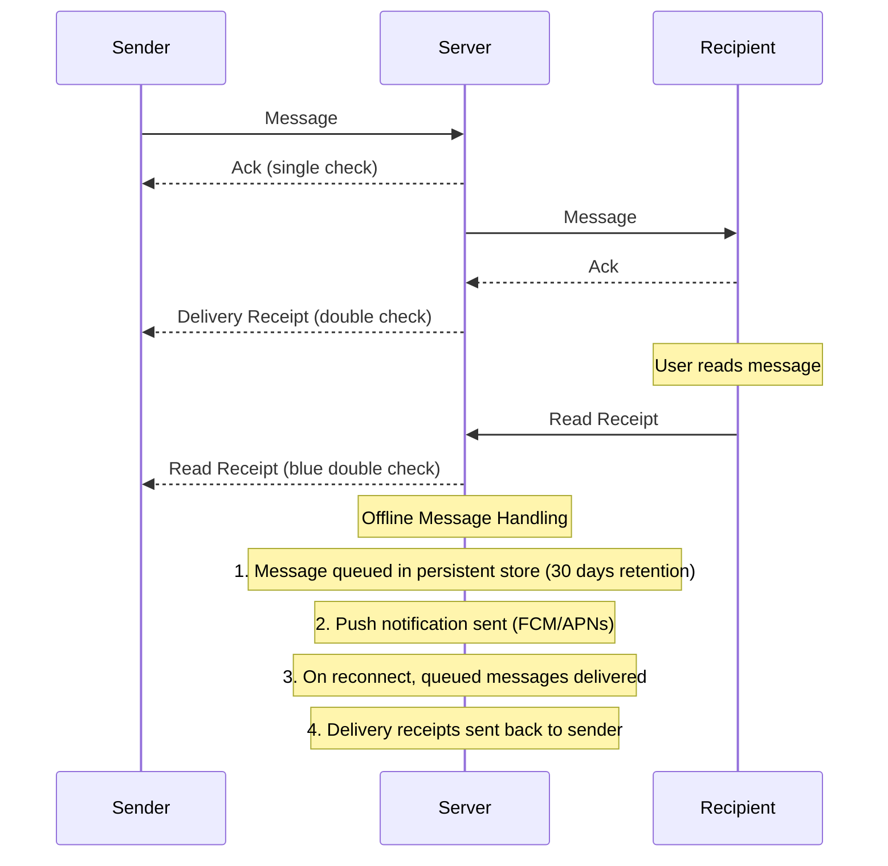

# WhatsApp システム設計

> **翻訳についての注記:** この記事は英語版からの翻訳です。コードブロック（Erlang）、Mermaidダイアグラム、およびツール名（Erlang, BEAM, OTP, Mnesia, HBase, FreeBSDなど）は原文のまま記載しています。

## TL;DR

WhatsAppは20億人以上のユーザーに1日1,000億以上のメッセージをエンドツーエンド暗号化で配信しています。アーキテクチャの中心には、サーバーあたり数百万接続を処理する**Erlang/BEAMによる接続管理**、メッセージングのための**XMPPベースプロトコル**、Signal Protocolを使用した**エンドツーエンド暗号化**、配信確認付きの**オフラインメッセージキューイング**、そして暗号化されたBlobによる**CDN経由のメディア配信**があります。重要な知見：慎重な技術選択と最小限の機能セットによるサーバーあたりの極端な効率性です（買収時に1エンジニア：1,400万ユーザー）。

---

## コア要件

### 機能要件
1. **1対1メッセージング** - テキスト、画像、動画、ドキュメントの送信
2. **グループメッセージング** - グループあたり最大1,024メンバー
3. **音声/ビデオ通話** - P2Pとサーバーリレーフォールバック
4. **ステータス更新** - 24時間で消える一時的なストーリー
5. **配信状態** - 送信済み、配信済み、既読の確認
6. **エンドツーエンド暗号化** - 参加者のみがメッセージを読める

### 非機能要件
1. **レイテンシ** - オンライン時のメッセージ配信 < 200ms
2. **信頼性** - メッセージを決して失わない、数日間のオフラインキュー
3. **スケール** - 20億以上のユーザー、1日1,000億以上のメッセージ
4. **効率性** - バッテリー、帯域幅、サーバーコストの最小化
5. **セキュリティ** - E2E暗号化、サーバー側でのメッセージ保存なし

---

## 上位レベルアーキテクチャ



---

## Erlang接続アーキテクチャ



### 接続ハンドラの実装

```erlang
-module(wa_connection).
-behaviour(gen_server).

-export([start_link/1, send_message/2, disconnect/1]).
-export([init/1, handle_call/3, handle_cast/2, handle_info/2, terminate/2]).

-record(state, {
    socket,
    user_id,
    session_key,
    last_seen,
    pending_acks = #{},      % message_id -> {timestamp, retries}
    message_queue = queue:new()
}).

%% Client connects
start_link(Socket) ->
    gen_server:start_link(?MODULE, [Socket], []).

init([Socket]) ->
    %% Set socket options for WhatsApp protocol
    ok = inet:setopts(Socket, [
        binary,
        {packet, 4},       % Length-prefixed frames
        {active, once},    % Flow control
        {nodelay, true},   % Disable Nagle for low latency
        {keepalive, true}
    ]),

    %% Wait for authentication
    {ok, #state{socket = Socket}, 30000}. % 30s auth timeout

handle_info({tcp, Socket, Data}, State) ->
    %% Reactivate socket for next message
    inet:setopts(Socket, [{active, once}]),

    %% Parse and handle message
    case wa_protocol:decode(Data) of
        {auth, AuthData} ->
            handle_auth(AuthData, State);
        {message, Msg} ->
            handle_incoming_message(Msg, State);
        {ack, MsgId} ->
            handle_ack(MsgId, State);
        {receipt, Receipt} ->
            handle_receipt(Receipt, State);
        {ping, _} ->
            send_pong(State),
            {noreply, State#state{last_seen = erlang:system_time(second)}};
        _ ->
            {noreply, State}
    end;

handle_info({tcp_closed, _Socket}, State) ->
    %% Client disconnected - cleanup
    cleanup_session(State),
    {stop, normal, State};

handle_info(check_pending_acks, State) ->
    %% Retry unacked messages
    NewState = retry_pending_messages(State),
    erlang:send_after(5000, self(), check_pending_acks),
    {noreply, NewState};

handle_info({deliver_message, From, Msg}, State) ->
    %% Message from another user for this connection
    case State#state.socket of
        undefined ->
            %% User offline - queue for later or push
            queue_offline_message(State#state.user_id, From, Msg),
            {noreply, State};
        Socket ->
            %% Deliver immediately
            Encoded = wa_protocol:encode({message, From, Msg}),
            gen_tcp:send(Socket, Encoded),

            %% Track for ack
            MsgId = maps:get(id, Msg),
            PendingAcks = maps:put(MsgId, {erlang:system_time(second), 0},
                                   State#state.pending_acks),
            {noreply, State#state{pending_acks = PendingAcks}}
    end.

handle_auth(AuthData, State) ->
    case wa_auth:verify(AuthData) of
        {ok, UserId, SessionKey} ->
            %% Register this process for the user
            wa_registry:register(UserId, self()),

            %% Load and deliver offline messages
            OfflineMsgs = wa_offline:get_messages(UserId),
            lists:foreach(fun(Msg) ->
                self() ! {deliver_message, maps:get(from, Msg), Msg}
            end, OfflineMsgs),
            wa_offline:clear(UserId),

            %% Start ack checker
            erlang:send_after(5000, self(), check_pending_acks),

            %% Send auth success
            send_auth_success(State#state.socket),

            {noreply, State#state{
                user_id = UserId,
                session_key = SessionKey,
                last_seen = erlang:system_time(second)
            }};
        {error, _Reason} ->
            gen_tcp:close(State#state.socket),
            {stop, auth_failed, State}
    end.

handle_incoming_message(Msg, State) ->
    %% Message from this client to another user
    ToUser = maps:get(to, Msg),
    MsgId = maps:get(id, Msg),

    %% Send ack to sender
    send_ack(State#state.socket, MsgId),

    %% Route to recipient
    case wa_registry:lookup(ToUser) of
        {ok, Pid} when is_pid(Pid) ->
            %% User online on this cluster
            Pid ! {deliver_message, State#state.user_id, Msg},
            send_delivery_receipt(State#state.socket, MsgId, delivered);
        {ok, {Node, Pid}} ->
            %% User on different node
            {wa_connection, Node} ! {deliver_message, ToUser, State#state.user_id, Msg};
        not_found ->
            %% User offline - queue message
            wa_offline:store(ToUser, State#state.user_id, Msg),
            %% Send push notification
            wa_push:send(ToUser, Msg)
    end,

    {noreply, State}.

%% Send message to a user (called from other processes)
send_message(Pid, Msg) when is_pid(Pid) ->
    Pid ! {deliver_message, maps:get(from, Msg), Msg}.

retry_pending_messages(State) ->
    Now = erlang:system_time(second),
    MaxRetries = 3,
    RetryInterval = 5,

    NewPending = maps:filtermap(fun(MsgId, {Timestamp, Retries}) ->
        case Now - Timestamp > RetryInterval of
            true when Retries < MaxRetries ->
                %% Retry
                resend_message(State#state.socket, MsgId),
                {true, {Now, Retries + 1}};
            true ->
                %% Max retries exceeded - message lost
                log_failed_delivery(MsgId),
                false;
            false ->
                {true, {Timestamp, Retries}}
        end
    end, State#state.pending_acks),

    State#state{pending_acks = NewPending}.
```

---

## エンドツーエンド暗号化（Signal Protocol）

```
┌─────────────────────────────────────────────────────────────────────────┐
│                    Signal Protocol Overview                              │
│                                                                          │
│   ┌──────────────────────────────────────────────────────────────────┐  │
│   │                    Key Types                                      │  │
│   │                                                                   │  │
│   │   Identity Key:     Long-term key pair (per device)              │  │
│   │   Signed Pre-Key:   Medium-term key, rotated periodically        │  │
│   │   One-Time Pre-Keys: Single-use keys for initial key exchange    │  │
│   │   Session Keys:     Derived keys for message encryption          │  │
│   └──────────────────────────────────────────────────────────────────┘  │
│                                                                          │
│   ┌──────────────────────────────────────────────────────────────────┐  │
│   │                    Initial Key Exchange (X3DH)                    │  │
│   │                                                                   │  │
│   │   Alice wants to message Bob (who may be offline):               │  │
│   │                                                                   │  │
│   │   1. Alice fetches from server:                                  │  │
│   │      - Bob's Identity Key (IKB)                                  │  │
│   │      - Bob's Signed Pre-Key (SPKB)                               │  │
│   │      - One of Bob's One-Time Pre-Keys (OPKB)                     │  │
│   │                                                                   │  │
│   │   2. Alice computes shared secret:                               │  │
│   │      DH1 = DH(IKA, SPKB)                                         │  │
│   │      DH2 = DH(EKA, IKB)                                          │  │
│   │      DH3 = DH(EKA, SPKB)                                         │  │
│   │      DH4 = DH(EKA, OPKB)                                         │  │
│   │      SK = KDF(DH1 || DH2 || DH3 || DH4)                          │  │
│   │                                                                   │  │
│   │   3. Alice sends first message + ephemeral key (EKA)             │  │
│   │                                                                   │  │
│   │   4. Bob can derive same SK using his private keys              │  │
│   └──────────────────────────────────────────────────────────────────┘  │
│                                                                          │
│   ┌──────────────────────────────────────────────────────────────────┐  │
│   │                    Double Ratchet (Per-Message)                   │  │
│   │                                                                   │  │
│   │   Each message uses new keys via two ratchets:                   │  │
│   │                                                                   │  │
│   │   DH Ratchet:     New DH exchange on each reply                  │  │
│   │                   (provides forward secrecy)                     │  │
│   │                                                                   │  │
│   │   Symmetric Ratchet: KDF chain for consecutive messages          │  │
│   │                      (allows async messaging)                    │  │
│   │                                                                   │  │
│   │   Result: Compromise of one key doesn't reveal past/future msgs  │  │
│   └──────────────────────────────────────────────────────────────────┘  │
└─────────────────────────────────────────────────────────────────────────┘
```

### 暗号化の実装

```erlang
-module(wa_signal).
-export([new/1, get_key_bundle/1, initiate_session/3, initiate_session/4,
         encrypt_message/3, decrypt_message/5]).

%% NIF stubs — actual X25519 / AES-GCM lives in a C library loaded via
%% erlang:load_nif/2.  The server only manages pre-key bundles; all
%% plaintext encryption happens on-device.  These stubs illustrate the
%% Erlang ↔ C boundary.
-on_load(init_nif/0).

init_nif() ->
    PrivDir = code:priv_dir(wa_signal),
    erlang:load_nif(filename:join(PrivDir, "wa_signal_nif"), 0).

%% --- NIF placeholders (replaced at load time) ---------------------
nif_x25519_keypair()           -> erlang:nif_error(not_loaded).
nif_x25519_dh(_Priv, _Pub)    -> erlang:nif_error(not_loaded).
nif_hkdf(_Salt, _Ikm, _Info, _Len) -> erlang:nif_error(not_loaded).
nif_aes_gcm_encrypt(_Key, _Nonce, _Plain, _Ad) -> erlang:nif_error(not_loaded).
nif_aes_gcm_decrypt(_Key, _Nonce, _Cipher, _Ad) -> erlang:nif_error(not_loaded).
nif_random_bytes(_N)           -> erlang:nif_error(not_loaded).
nif_sign_key(_IdentityPriv, _Data) -> erlang:nif_error(not_loaded).

%% --- Public API ---------------------------------------------------

%% Create a new protocol state with a long-term identity key.
new(IdentityPriv) ->
    SignedPreKey = nif_x25519_keypair(),
    OneTimePreKeys = [nif_x25519_keypair() || _ <- lists:seq(1, 100)],
    #{identity_key => IdentityPriv,
      signed_prekey => SignedPreKey,
      one_time_prekeys => OneTimePreKeys,
      sessions => #{}}.

%% Return the public key bundle to publish to the server.
get_key_bundle(#{identity_key := IK, signed_prekey := SPK,
                 one_time_prekeys := OTPs}) ->
    SPKPub = maps:get(public, SPK),
    Signature = nif_sign_key(maps:get(private, IK), SPKPub),
    #{identity_key   => maps:get(public, IK),
      signed_prekey  => SPKPub,
      signed_prekey_signature => Signature,
      one_time_prekeys =>
          [{I, maps:get(public, K)} || {I, K} <- lists:zip(
              lists:seq(0, length(OTPs) - 1), OTPs)]}.

%% Initiate session without a one-time pre-key.
initiate_session(PeerId, PeerBundle, State) ->
    initiate_session(PeerId, PeerBundle, undefined, State).

%% X3DH key exchange — returns {EphemeralPub, NewState}.
initiate_session(PeerId, PeerBundle, UsedOTPId, State) ->
    EK = nif_x25519_keypair(),
    EKPriv = maps:get(private, EK),
    IKPriv = maps:get(private, maps:get(identity_key, State)),

    PeerIK  = maps:get(identity_key, PeerBundle),
    PeerSPK = maps:get(signed_prekey, PeerBundle),

    DH1 = nif_x25519_dh(IKPriv, PeerSPK),
    DH2 = nif_x25519_dh(EKPriv, PeerIK),
    DH3 = nif_x25519_dh(EKPriv, PeerSPK),

    SharedSecret = case UsedOTPId of
        undefined ->
            <<DH1/binary, DH2/binary, DH3/binary>>;
        Id ->
            {_, PeerOTP} = lists:keyfind(Id, 1,
                maps:get(one_time_prekeys, PeerBundle)),
            DH4 = nif_x25519_dh(EKPriv, PeerOTP),
            <<DH1/binary, DH2/binary, DH3/binary, DH4/binary>>
    end,

    <<RootKey:32/binary, ChainKey:32/binary>> =
        nif_hkdf(<<>>, SharedSecret, <<"WhatsAppInitial">>, 64),

    Session = #{root_key => RootKey,
                sending_chain_key => ChainKey,
                receiving_chain_key => undefined,
                sending_ratchet_key => EK,
                receiving_ratchet_key => PeerSPK,
                msg_num_send => 0,
                msg_num_recv => 0,
                prev_counter => 0,
                skipped_keys => #{}},

    Sessions = maps:get(sessions, State),
    NewState = State#{sessions := Sessions#{PeerId => Session}},
    {maps:get(public, EK), NewState}.

%% Encrypt a message — returns {Ciphertext, RatchetPub, MsgNum, NewState}.
encrypt_message(PeerId, Plaintext, State) ->
    Sessions = maps:get(sessions, State),
    Session  = maps:get(PeerId, Sessions),

    ChainKey = maps:get(sending_chain_key, Session),
    {MessageKey, NewChainKey} = kdf_ck(ChainKey),

    Nonce = nif_random_bytes(12),
    RatchetPub = maps:get(public, maps:get(sending_ratchet_key, Session)),
    MsgNum = maps:get(msg_num_send, Session),
    AD = <<RatchetPub/binary, MsgNum:32/big>>,

    Ciphertext = <<Nonce/binary,
        (nif_aes_gcm_encrypt(MessageKey, Nonce, Plaintext, AD))/binary>>,

    Session2 = Session#{sending_chain_key := NewChainKey,
                        msg_num_send := MsgNum + 1},
    NewState = State#{sessions := Sessions#{PeerId := Session2}},
    {Ciphertext, RatchetPub, MsgNum, NewState}.

%% Decrypt a received message — returns {Plaintext, NewState}.
decrypt_message(PeerId, Ciphertext, RatchetKey, MsgNum, State) ->
    Sessions = maps:get(sessions, State),
    Session0 = maps:get(PeerId, Sessions),

    Session = case maps:get(receiving_ratchet_key, Session0) of
        RatchetKey -> Session0;
        _Other     -> dh_ratchet(Session0, RatchetKey)
    end,

    SkippedId = {RatchetKey, MsgNum},
    Skipped   = maps:get(skipped_keys, Session),

    {MessageKey, Session2} = case maps:find(SkippedId, Skipped) of
        {ok, MK} ->
            {MK, Session#{skipped_keys := maps:remove(SkippedId, Skipped)}};
        error ->
            skip_to(MsgNum, Session)
    end,

    <<Nonce:12/binary, CT/binary>> = Ciphertext,
    AD = <<RatchetKey/binary, MsgNum:32/big>>,
    Plaintext = nif_aes_gcm_decrypt(MessageKey, Nonce, CT, AD),

    NewState = State#{sessions := Sessions#{PeerId := Session2}},
    {Plaintext, NewState}.

%% --- Internal helpers ---------------------------------------------

dh_ratchet(Session, PeerRatchet) ->
    SendPriv = maps:get(private, maps:get(sending_ratchet_key, Session)),
    RootKey  = maps:get(root_key, Session),

    DHOut1 = nif_x25519_dh(SendPriv, PeerRatchet),
    <<RK1:32/binary, RecvChain:32/binary>> =
        nif_hkdf(RootKey, DHOut1, <<"WhatsAppRootKey">>, 64),

    NewSendKey = nif_x25519_keypair(),
    DHOut2 = nif_x25519_dh(maps:get(private, NewSendKey), PeerRatchet),
    <<RK2:32/binary, SendChain:32/binary>> =
        nif_hkdf(RK1, DHOut2, <<"WhatsAppRootKey">>, 64),

    Session#{root_key := RK2,
             receiving_chain_key := RecvChain,
             sending_chain_key := SendChain,
             sending_ratchet_key := NewSendKey,
             receiving_ratchet_key := PeerRatchet,
             msg_num_send := 0,
             msg_num_recv := 0,
             prev_counter := maps:get(msg_num_recv, Session)}.

skip_to(TargetNum, Session) ->
    skip_to(TargetNum, maps:get(msg_num_recv, Session),
            maps:get(receiving_chain_key, Session),
            maps:get(skipped_keys, Session),
            maps:get(receiving_ratchet_key, Session), Session).

skip_to(Target, Current, ChainKey, Skipped, RatchetKey, Session)
  when Current < Target ->
    {MK, NextChain} = kdf_ck(ChainKey),
    NewSkipped = Skipped#{{RatchetKey, Current} => MK},
    skip_to(Target, Current + 1, NextChain, NewSkipped, RatchetKey, Session);
skip_to(_Target, Current, ChainKey, Skipped, _RK, Session) ->
    {MK, NextChain} = kdf_ck(ChainKey),
    {MK, Session#{receiving_chain_key := NextChain,
                  msg_num_recv := Current + 1,
                  skipped_keys := Skipped}}.

kdf_ck(ChainKey) ->
    MessageKey  = nif_hkdf(<<>>, <<ChainKey/binary, 1>>,
                           <<"WhatsAppMessageKey">>, 32),
    NewChainKey = nif_hkdf(<<>>, <<ChainKey/binary, 2>>,
                           <<"WhatsAppChainKey">>, 32),
    {MessageKey, NewChainKey}.
```

---

## メッセージ配信フロー



### メッセージキューの実装

```erlang
-module(wa_offline_queue).
-behaviour(gen_server).

-export([start_link/1, queue_message/4, get_messages/1, get_messages/2,
         acknowledge_delivery/2]).
-export([init/1, handle_call/3, handle_cast/2, handle_info/2, terminate/2]).

-define(MAX_QUEUE_SIZE, 1000).
-define(RETENTION_DAYS, 30).
-define(RETENTION_MS, ?RETENTION_DAYS * 24 * 60 * 60 * 1000).

%%% ----------------------------------------------------------------
%%% API
%%% ----------------------------------------------------------------

start_link(Config) ->
    gen_server:start_link({local, ?MODULE}, ?MODULE, Config, []).

%% Queue a message for an offline user.
%% Hot path uses Mnesia dirty writes for speed; a background process
%% flushes cold messages to HBase after the retention window shrinks.
queue_message(FromUser, ToUser, Message, MsgType) ->
    gen_server:cast(?MODULE, {queue, FromUser, ToUser, Message, MsgType}).

get_messages(UserId) ->
    get_messages(UserId, 100).

get_messages(UserId, Limit) ->
    gen_server:call(?MODULE, {get, UserId, Limit}).

acknowledge_delivery(UserId, MessageIds) ->
    gen_server:cast(?MODULE, {ack, UserId, MessageIds}).

%%% ----------------------------------------------------------------
%%% gen_server callbacks
%%% ----------------------------------------------------------------

init(Config) ->
    %% Ensure Mnesia table exists (ram_copies for hot path)
    ok = ensure_table(),
    MaxQueue = maps:get(max_queue_size, Config, ?MAX_QUEUE_SIZE),
    RetDays  = maps:get(retention_days, Config, ?RETENTION_DAYS),
    {ok, #{max_queue => MaxQueue, retention_days => RetDays}}.

handle_cast({queue, FromUser, ToUser, Message, MsgType}, State) ->
    MsgId     = maps:get(id, Message),
    Timestamp = erlang:system_time(millisecond),
    Expiry    = Timestamp + ?RETENTION_MS,
    Priority  = get_priority(MsgType),

    Row = #{msg_id    => MsgId,
            from_user => FromUser,
            to_user   => ToUser,
            content   => maps:get(encrypted_content, Message),
            timestamp => Timestamp,
            priority  => Priority,
            expiry    => Expiry},

    %% Hot write — Mnesia dirty for minimal latency
    mnesia:dirty_write(offline_messages,
        {offline_messages, {ToUser, Timestamp, MsgId}, Row}),

    %% Prune if over limit
    MaxQueue = maps:get(max_queue, State),
    maybe_prune(ToUser, MaxQueue),

    %% Push notification (no preview — E2E encrypted)
    wa_push:notify(ToUser, #{from => FromUser, type => MsgType,
                             preview => undefined}),
    {noreply, State};

handle_cast({ack, UserId, MessageIds}, State) ->
    lists:foreach(fun(MsgId) ->
        Pattern = {offline_messages, {UserId, '_', MsgId}, '_'},
        case mnesia:dirty_match_object(Pattern) of
            [Rec | _] -> mnesia:dirty_delete_object(Rec);
            []        -> ok
        end
    end, MessageIds),
    {noreply, State}.

handle_call({get, UserId, Limit}, _From, State) ->
    %% Prefix scan via dirty_select
    MatchHead = {offline_messages, {UserId, '$1', '$2'}, '$3'},
    Guard     = [],
    Result    = ['$3'],
    Rows = mnesia:dirty_select(offline_messages, [{MatchHead, Guard, Result}]),

    %% Sort: highest priority first, then oldest timestamp first
    Sorted = lists:sort(fun(A, B) ->
        PA = maps:get(priority, A),
        PB = maps:get(priority, B),
        case PA =:= PB of
            true  -> maps:get(timestamp, A) =< maps:get(timestamp, B);
            false -> PA >= PB
        end
    end, Rows),

    Limited = lists:sublist(Sorted, Limit),
    {reply, {ok, Limited}, State}.

handle_info(_Info, State) ->
    {noreply, State}.

terminate(_Reason, _State) ->
    ok.

%%% ----------------------------------------------------------------
%%% Internal helpers
%%% ----------------------------------------------------------------

ensure_table() ->
    case mnesia:create_table(offline_messages, [
        {type, ordered_set},
        {ram_copies, [node()]},
        {disc_copies, []},
        {attributes, [key, value]}
    ]) of
        {atomic, ok}                        -> ok;
        {aborted, {already_exists, _}}      -> ok
    end.

get_priority(call)          -> 100;
get_priority(video_call)    -> 100;
get_priority(voice_message) -> 50;
get_priority(image)         -> 30;
get_priority(text)          -> 10;
get_priority(status)        -> 5;
get_priority(_)             -> 10.

maybe_prune(UserId, MaxQueue) ->
    MatchHead = {offline_messages, {UserId, '$1', '$2'}, '$3'},
    All = mnesia:dirty_select(offline_messages, [{MatchHead, [], ['$_']}]),
    case length(All) > MaxQueue of
        false -> ok;
        true  ->
            %% Sort: lowest priority first, oldest first — delete excess
            Sorted = lists:sort(fun({_, _, A}, {_, _, B}) ->
                PA = maps:get(priority, A),
                PB = maps:get(priority, B),
                case PA =:= PB of
                    true  -> maps:get(timestamp, A) =< maps:get(timestamp, B);
                    false -> PA =< PB
                end
            end, All),
            ToDelete = lists:sublist(Sorted, length(All) - MaxQueue),
            lists:foreach(fun(Rec) ->
                mnesia:dirty_delete_object(Rec)
            end, ToDelete)
    end.
```

---

## グループメッセージング

```erlang
-module(wa_group).
-behaviour(gen_server).

-export([start_link/1, send_group_message/3,
         add_members/3, remove_member/3]).
-export([init/1, handle_call/3, handle_cast/2, handle_info/2, terminate/2]).

-define(MAX_GROUP_SIZE, 1024).

%%% ----------------------------------------------------------------
%%% API
%%% ----------------------------------------------------------------

start_link(GroupId) ->
    gen_server:start_link(?MODULE, GroupId, []).

%% Send a group message — non-blocking fan-out via cast.
send_group_message(GroupPid, SenderId, Message) ->
    gen_server:cast(GroupPid, {send, SenderId, Message}).

add_members(GroupPid, AdminId, NewMemberIds) ->
    gen_server:call(GroupPid, {add_members, AdminId, NewMemberIds}).

remove_member(GroupPid, AdminId, MemberId) ->
    gen_server:call(GroupPid, {remove_member, AdminId, MemberId}).

%%% ----------------------------------------------------------------
%%% gen_server callbacks
%%% ----------------------------------------------------------------

init(GroupId) ->
    %% Load group metadata from Mnesia
    case mnesia:dirty_read(groups, GroupId) of
        [{groups, GroupId, GroupData}] ->
            {ok, GroupData};
        [] ->
            {stop, group_not_found}
    end.

handle_cast({send, SenderId, Message}, State) ->
    Members = maps:get(members, State),
    Admins  = maps:get(admins, State),
    Settings = maps:get(settings, State),
    GroupId  = maps:get(group_id, State),

    case {lists:member(SenderId, Members),
          maps:get(admins_only, Settings, false)} of
        {false, _} ->
            %% Not a member — drop silently
            {noreply, State};
        {true, true} when not lists:member(SenderId, Admins) ->
            {noreply, State};
        {true, _} ->
            %% Ensure sender key exists and distribute if needed
            SenderKey = ensure_sender_key(GroupId, SenderId, Members),

            %% Encrypt once with sender key
            Content   = maps:get(content, Message),
            Encrypted = wa_sender_key:encrypt(Content, SenderKey),

            %% Advance the chain
            wa_sender_key:advance(GroupId, SenderId),

            %% Non-blocking fan-out to every other member
            Recipients = lists:delete(SenderId, Members),
            lists:foreach(fun(RecipientId) ->
                gen_server:cast(self(), {deliver, GroupId, SenderId,
                                        RecipientId, Encrypted, Message})
            end, Recipients),

            {noreply, State}
    end;

handle_cast({deliver, GroupId, SenderId, RecipientId, Encrypted, Message},
            State) ->
    %% Ensure recipient has the sender's key
    ok = ensure_recipient_has_key(GroupId, SenderId, RecipientId),

    GroupMsg = #{type             => group_message,
                 group_id         => GroupId,
                 sender_id        => SenderId,
                 message_id       => maps:get(id, Message),
                 encrypted_content => Encrypted,
                 timestamp        => maps:get(timestamp, Message)},

    case wa_registry:lookup(RecipientId) of
        {ok, Pid} when is_pid(Pid) ->
            %% Online — deliver directly (non-blocking)
            gen_server:cast(Pid, {deliver_message, GroupMsg});
        _ ->
            %% Offline — queue
            wa_offline_queue:queue_message(
                SenderId, RecipientId, GroupMsg, group_message)
    end,
    {noreply, State}.

handle_call({add_members, AdminId, NewMemberIds}, _From, State) ->
    Members = maps:get(members, State),
    Admins  = maps:get(admins, State),
    GroupId = maps:get(group_id, State),

    case lists:member(AdminId, Admins) of
        false ->
            {reply, {error, not_admin}, State};
        true ->
            NewTotal = length(Members) + length(NewMemberIds),
            case NewTotal > ?MAX_GROUP_SIZE of
                true ->
                    {reply, {error, group_full}, State};
                false ->
                    UpdatedMembers = lists:usort(Members ++ NewMemberIds),
                    State2 = State#{members := UpdatedMembers},
                    save_group(State2),

                    %% Distribute existing sender keys to new members
                    ExistingMembers = Members -- NewMemberIds,
                    lists:foreach(fun(Existing) ->
                        case wa_sender_key:get(GroupId, Existing) of
                            {ok, _SK} ->
                                lists:foreach(fun(New) ->
                                    wa_sender_key:send_via_1to1(
                                        GroupId, Existing, New)
                                end, NewMemberIds);
                            not_found ->
                                ok
                        end
                    end, ExistingMembers),

                    send_system_message(GroupId,
                        iolib_format("~s added ~s",
                            [AdminId, string:join(NewMemberIds, ", ")])),
                    {reply, ok, State2}
            end
    end;

handle_call({remove_member, AdminId, MemberId}, _From, State) ->
    Admins  = maps:get(admins, State),
    GroupId = maps:get(group_id, State),

    case lists:member(AdminId, Admins) orelse AdminId =:= MemberId of
        false ->
            {reply, {error, not_admin}, State};
        true ->
            Members2 = lists:delete(MemberId, maps:get(members, State)),
            Admins2  = lists:delete(MemberId, Admins),
            State2 = State#{members := Members2, admins := Admins2},
            save_group(State2),

            %% Rotate all sender keys so removed member cannot decrypt
            lists:foreach(fun(Remaining) ->
                wa_sender_key:rotate(GroupId, Remaining)
            end, Members2),

            send_system_message(GroupId,
                iolib_format("~s left the group", [MemberId])),
            {reply, ok, State2}
    end.

handle_info(_Info, State) ->
    {noreply, State}.

terminate(_Reason, _State) ->
    ok.

%%% ----------------------------------------------------------------
%%% Group supervisor — one child per active group
%%% ----------------------------------------------------------------

-module(wa_group_sup).
-behaviour(supervisor).
-export([start_link/0, start_group/1, init/1]).

start_link() ->
    supervisor:start_link({local, ?MODULE}, ?MODULE, []).

start_group(GroupId) ->
    supervisor:start_child(?MODULE, [GroupId]).

init([]) ->
    ChildSpec = #{id       => wa_group,
                  start    => {wa_group, start_link, []},
                  restart  => transient,
                  shutdown => 5000,
                  type     => worker,
                  modules  => [wa_group]},
    {ok, {#{strategy => simple_one_for_one,
            intensity => 10,
            period    => 60}, [ChildSpec]}}.

%%% ----------------------------------------------------------------
%%% Internal helpers
%%% ----------------------------------------------------------------

ensure_sender_key(GroupId, SenderId, Members) ->
    case wa_sender_key:get(GroupId, SenderId) of
        {ok, SK} ->
            SK;
        not_found ->
            {ok, SK} = wa_sender_key:create(GroupId, SenderId),
            distribute_sender_key(GroupId, SenderId, SK, Members),
            SK
    end.

distribute_sender_key(GroupId, SenderId, SenderKey, Members) ->
    KeyMsg = #{type          => sender_key,
               group_id      => GroupId,
               sender_id     => SenderId,
               key_id        => maps:get(key_id, SenderKey),
               chain_key     => maps:get(chain_key, SenderKey),
               signature_key => maps:get(signature_key, SenderKey)},
    lists:foreach(fun(MemberId) ->
        case MemberId =/= SenderId of
            true  -> wa_signal:send_encrypted_1to1(SenderId, MemberId, KeyMsg);
            false -> ok
        end
    end, Members).

ensure_recipient_has_key(GroupId, SenderId, RecipientId) ->
    case wa_sender_key:member_has_key(GroupId, RecipientId, SenderId) of
        true  -> ok;
        false -> wa_sender_key:send_via_1to1(GroupId, SenderId, RecipientId)
    end.

save_group(State) ->
    GroupId = maps:get(group_id, State),
    mnesia:dirty_write(groups, {groups, GroupId, State}).

send_system_message(GroupId, Text) ->
    wa_group:send_group_message(self(), system,
        #{id => wa_util:generate_id(), content => Text,
          timestamp => erlang:system_time(millisecond)}).

iolib_format(Fmt, Args) ->
    lists:flatten(io_lib:format(Fmt, Args)).
```

---

## メディアの処理

```erlang
-module(wa_media).
-behaviour(gen_server).

-export([start_link/1, upload_media/3, download_media/3]).
-export([init/1, handle_call/3, handle_cast/2, handle_info/2, terminate/2]).

-define(MAX_SIZE_BYTES, 100 * 1024 * 1024).  %% 100 MB
-define(CDN_EXPIRY_HOURS, 336).               %% 2 weeks

%%% ----------------------------------------------------------------
%%% API
%%% ----------------------------------------------------------------

start_link(Config) ->
    gen_server:start_link({local, ?MODULE}, ?MODULE, Config, []).

%% Upload encrypted media.  Client encrypts with a random key before
%% uploading; the key travels inside the E2E-encrypted message, never
%% touches the server in plaintext.
upload_media(UserId, FileData, MimeType) ->
    gen_server:call(?MODULE, {upload, UserId, FileData, MimeType}, 30000).

%% Download and decrypt media.  Verifies SHA-256 before decrypting.
download_media(Url, EncryptionKey, ExpectedHash) ->
    gen_server:call(?MODULE, {download, Url, EncryptionKey, ExpectedHash}, 30000).

%%% ----------------------------------------------------------------
%%% gen_server callbacks
%%% ----------------------------------------------------------------

init(Config) ->
    MaxSize = maps:get(max_size_mb, Config, 100) * 1024 * 1024,
    {ok, #{max_size => MaxSize}}.

handle_call({upload, UserId, FileData, MimeType}, _From, State) ->
    MaxSize = maps:get(max_size, State),
    case byte_size(FileData) > MaxSize of
        true ->
            {reply, {error, file_too_large}, State};
        false ->
            %% Generate encryption key (client-side in production)
            EncryptionKey = crypto:strong_rand_bytes(32),

            %% Encrypt with AES-256-CBC
            Encrypted = encrypt_media(FileData, EncryptionKey),

            %% SHA-256 of encrypted content
            Sha256Hash = crypto:hash(sha256, Encrypted),

            %% Derive media ID
            Salt    = crypto:strong_rand_bytes(16),
            MediaId = binary:part(
                bin_to_hex(crypto:hash(sha256, <<Sha256Hash/binary, Salt/binary>>)),
                0, 24),

            %% Upload to blob storage
            BlobPath = <<"media/", (to_bin(UserId))/binary, "/",
                         MediaId/binary>>,
            ok = wa_blob:put(BlobPath, Encrypted,
                             <<"application/octet-stream">>),

            %% Get signed CDN URL
            {ok, CdnUrl} = wa_cdn:get_signed_url(BlobPath,
                                                  ?CDN_EXPIRY_HOURS),

            Result = #{media_id       => MediaId,
                       mime_type      => MimeType,
                       size_bytes     => byte_size(FileData),
                       encryption_key => EncryptionKey,
                       sha256_hash    => Sha256Hash,
                       url            => CdnUrl},
            {reply, {ok, Result}, State}
    end;

handle_call({download, Url, EncryptionKey, ExpectedHash}, _From, State) ->
    case wa_cdn:fetch(Url) of
        {ok, Encrypted} ->
            ActualHash = crypto:hash(sha256, Encrypted),
            case ActualHash =:= ExpectedHash of
                false ->
                    {reply, {error, hash_mismatch}, State};
                true ->
                    Plaintext = decrypt_media(Encrypted, EncryptionKey),
                    {reply, {ok, Plaintext}, State}
            end;
        {error, Reason} ->
            {reply, {error, Reason}, State}
    end.

handle_cast(_Msg, State) ->
    {noreply, State}.

handle_info(_Info, State) ->
    {noreply, State}.

terminate(_Reason, _State) ->
    ok.

%%% ----------------------------------------------------------------
%%% Internal — AES-256-CBC encrypt / decrypt
%%% ----------------------------------------------------------------

encrypt_media(Data, Key) ->
    IV = crypto:strong_rand_bytes(16),
    %% PKCS7 padding
    PadLen  = 16 - (byte_size(Data) rem 16),
    Padding = binary:copy(<<PadLen>>, PadLen),
    Padded  = <<Data/binary, Padding/binary>>,
    Cipher  = crypto:crypto_one_time(aes_256_cbc, Key, IV, Padded,
                                     [{encrypt, true}]),
    <<IV/binary, Cipher/binary>>.

decrypt_media(Encrypted, Key) ->
    <<IV:16/binary, Ciphertext/binary>> = Encrypted,
    Padded  = crypto:crypto_one_time(aes_256_cbc, Key, IV, Ciphertext,
                                     [{encrypt, false}]),
    %% Remove PKCS7 padding
    PadLen = binary:last(Padded),
    binary:part(Padded, 0, byte_size(Padded) - PadLen).

%%% ----------------------------------------------------------------
%%% Utility
%%% ----------------------------------------------------------------

to_bin(B) when is_binary(B) -> B;
to_bin(L) when is_list(L)   -> list_to_binary(L);
to_bin(A) when is_atom(A)   -> atom_to_binary(A, utf8).

bin_to_hex(Bin) ->
    <<<<(hex_char(H)), (hex_char(L))>> ||
        <<H:4, L:4>> <= Bin>>.

hex_char(N) when N < 10 -> $0 + N;
hex_char(N)             -> $a + N - 10.
```

---

## 主要メトリクスとスケール

| メトリクス | 値 |
|--------|-------|
| **月間アクティブユーザー** | 20億以上 |
| **1日のメッセージ数** | 1,000億以上 |
| **ピーク時のメッセージ/秒** | 6,000万以上 |
| **サーバーあたりの接続数** | 200万以上 |
| **サーバー数（買収時）** | 約550 |
| **エンジニア数（買収時）** | 約35 |
| **メッセージレイテンシ** | < 200ms |
| **グループサイズ上限** | 1,024メンバー |
| **メディアサイズ上限** | 100MB（動画）、16MB（画像） |
| **オフラインキュー保持期間** | 30日 |

---

## 重要なポイント

1. **Erlangによる大規模並行処理** - 軽量プロセス（各2KB）でサーバーあたり200万以上の接続を可能にします。スーパービジョンツリーがフォールトトレランスを提供します。

2. **最小限の機能セット** - コアメッセージングに集中します。各機能は複雑さを追加します。WhatsAppのシンプルさが極端な効率性を実現しました。

3. **E2E暗号化のためのSignal Protocol** - Double Ratchetが前方秘匿性を提供します。サーバーは平文を見ません。Sender Keysがグループメッセージングを最適化します。

4. **サーバーはメッセージを読めない** - すべてのコンテンツはクライアント側で暗号化されます。サーバーはダムリレーです。信頼モデルはエンドポイントに移行しました。

5. **オフラインメッセージキュー** - メッセージは配信されるまで保存されます（30日間）。プッシュ通知がアプリを起動させます。配信確認が配信を確認します。

6. **暗号化されたBlobとしてのメディア** - メディアはランダムキーで暗号化されます。キーはメッセージ内で送信され、サーバーには保存されません。CDNが暗号化されたバイトを配信します。

7. **電話番号によるアイデンティティ** - ユーザーネームなし、発見のフリクションなし。連絡先リストの同期でネットワーク効果を実現します。PSTNで認証します。

8. **極端な効率性** - 買収時に1エンジニアあたり1,400万ユーザーです。人員のスケーリングよりも慎重な技術選択を重視しました。

---

## 本番環境の知見

### FreeBSDカーネルチューニングによるサーバーあたり200万以上の接続

WhatsAppは極端な接続数におけるネットワークスタックの優位性から、LinuxではなくFreeBSDを選択しました。コモディティハードウェアで200万以上の同時TCP接続を実現した主要なsysctlおよびカーネル設定は以下の通りです。

- **`kqueue`** — FreeBSDのイベント通知インターフェースは接続数に対してO(1)でスケールし、古い`select`/`poll`パスとは異なります。各Erlangスケジューラスレッドは独自のkqueue fdを実行し、CPU間の競合を排除します。
- **`kern.ipc.somaxconn`** — デフォルトの128から65535以上に引き上げ、バースト再接続時（例：ネットワーク分断が回復し、数百万のクライアントが数秒以内に再接続する場合）にTCPリッスンバックログがSYNパケットをドロップしないようにします。
- **`kern.ipc.maxsockbuf` / `net.inet.tcp.recvbuf_max`** — ソケットあたりのバッファサイズを縮小します。200万ソケットでは、各16KBでも32GBのカーネルメモリを消費します。WhatsAppはXMPP由来のフレームが小さいため、約2-4KBの受信バッファで運用していました。
- **`net.inet.tcp.msl`** — TIME_WAITの持続時間を短縮し、ローリングリスタート時にポート/ソケットペアがより速くリサイクルされるようにします。
- **ファイルディスクリプタ制限** — `kern.maxfiles`およびプロセスごとの`ulimit`を200万以上に引き上げ、ソケットとMnesiaのファイルハンドルをカバーします。

### Mnesia vs HBase — ホット/コールドデータの境界

WhatsAppは明確なレイテンシ境界に沿ってストレージを分割しています。

| レイヤー | ストア | データ | アクセスパターン |
|-------|-------|------|----------------|
| **ホット** | Mnesia (ram_copies) | ユーザーセッション、ルーティングテーブル、プレゼンス、プリキーバンドル | サブミリ秒のダーティ読み書き、Erlangノード間でレプリケーション |
| **ウォーム** | Mnesia (disc_copies) | グループメタデータ、アカウント設定 | ノード再起動後も存続、読み取りはインメモリ |
| **コールド** | HBase (HDFSバックエンド) | オフラインメッセージキュー、メディアメタデータ、監査ログ | バッチフレンドリー、TTLベースの有効期限、行キープレフィックススキャン |

Mnesiaの最大の強みはBEAMとの緊密な統合です。シリアライズのオーバーヘッドもネットワークホップもありません。ローカルram_copyに対する`mnesia:dirty_read/2`は実質的にETSルックアップ（マイクロ秒オーダー）です。トレードオフはノードあたりのストレージ容量がRAMに制限されることであり、無制限に増大するデータ（メッセージ履歴、メディア）がHBaseに配置される理由です。

### ejabberdの系譜

WhatsAppのサーバーはejabberd（オープンソースのErlang XMPPサーバー）のフォークとして始まりました。時間の経過とともにチームはXMPP準拠の大部分を取り除き、よりタイトなバイナリプロトコルに移行しましたが、アーキテクチャのDNAは残っています。

- 接続クライアントごとに1つのErlangプロセス（ejabberdの`ejabberd_c2s`）
- セッション/ルーティングテーブルにMnesia（ejabberdの`session`バックエンド）
- 至る所で`gen_server`とスーパービジョンツリー
- `release_handler`によるホットコードアップグレード — 単一の接続もドロップせずに新しいbeamファイルをデプロイ

標準準拠のXMPPから独自プロトコルへの転換により、WhatsAppはメッセージあたりのオーバーヘッドを冗長なXMLスタンザ（フレーミング約200バイト以上）からコンパクトなバイナリフレーム（フレーミング約10-20バイト）に縮小しました。これは2Gネットワークにおいて非常に重要な10倍の帯域幅削減です。

### BEAMスケジューラのコアごとのピンニング

BEAM VMはデフォルトでCPUコアあたり1つのスケジューラスレッドを実行します。WhatsAppはコンテキストスイッチのジッターを排除するため、各スケジューラを専用のコアにピン留めしています。

```erlang
%% vm.args — passed to the BEAM at boot
+S 24:24            %% 24 schedulers on a 24-core box
+stbt db            %% bind schedulers to cores (default_bind)
+sbwt very_long     %% scheduler busy-wait threshold — keep hot
+swt very_low       %% scheduler wake-up threshold — wake fast
+sub true           %% enable scheduler utilization balancing
+Muacnl 0           %% disable carrier migration (reduce allocator lock contention)
```

コアごとのピンニング（`+stbt db`）により、各スケジューラは独自のランキューを所有し、その上のプロセスがCPU間で移行することはほとんどありません。これによりL1/L2キャッシュがウォームな状態に保たれ、ランキューのクロスコアロッキングのオーバーヘッドが回避されます。ビジーウェイトフラグ（`+sbwt very_long`）は、わずかなアイドルCPU消費と引き換えに、受信パケットに対するスケジューリングレイテンシをほぼゼロにします。これは200万の永続接続を処理し、そのいずれもが任意の瞬間にメッセージを受信し得るサーバーにとって、まさに正しいトレードオフです。
