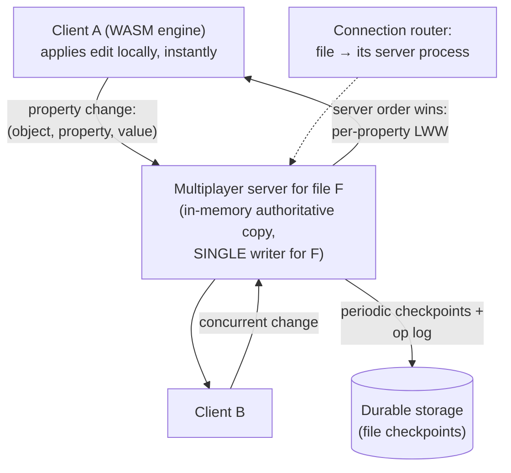

# Figmaのシステム設計

> **翻訳についての注記:** 本ドキュメントは英語原文 `08-case-studies/11-figma.md` を日本語に翻訳したものです。コードブロックおよびMermaidダイアグラムは原文のまま維持しています。

## TL;DR

Figmaはブラウザのタブを、チーム全体で共有するネイティブのデザインツールのように感じさせました。荷重を支える3つの決定: **WebAssemblyにコンパイルされたC++エンジン**がWebGLに描画する(ブラウザは流通経路であって、アーキテクチャではない)。**マルチプレイヤー同期は意図的にフルCRDTでは*ない*** — 開かれた各ファイルは正確に1つのステートフルなマルチプレイヤーサーバープロセスに所有され、サーバーが順序を裁定する**プロパティ単位のlast-writer-wins**を適用します。デザインファイルはプロパティレベルのLWWには耐えますが、テキスト型マージの異常には耐えないからです。そして**単一のPostgres中心のメタデータプレーン**が、今や正典となった順序 — 垂直分割、その後クエリプロキシ(`colos`、DBProxy)の背後でのアプリケーション協調の水平シャーディング — でハイパーグロースを生き延びました。アプリケーションのメンタルモデルは変えずに。全体の教訓: ドメインが本当に必要とする*最も弱い*整合性機構を選び、可能な限りシングルライターを置くこと。

---

## 中核要件

### 機能要件
1. **リアルタイム共同編集** — 1ファイルに多数のカーソル、すべての変更が約100msで全員に見える
2. **デザインツールの忠実度** — ベクター描画、巨大ドキュメント、ブラウザで60fpsのパン/ズーム
3. **オフライン耐性** — 切断中も編集を続け、再接続で照合
4. **ファイル組織** — チーム、プロジェクト、権限、コメント、バージョン履歴
5. **プラグインと埋め込み** — ライブドキュメントに対するサードパーティコード

### 非機能要件
1. **レイテンシ** — ローカル編集は即時適用(楽観的)。リモート伝播は約100ms
2. **収束** — 全参加者が常に同じドキュメント状態に到達
3. **耐久性** — 作業を失わない。復元可能な履歴([チェックポイント](../15-deployment/05-disaster-recovery.md))
4. **スケール** — 数百万ファイル。各ファイルのセッションは1サーバーに収まるが、ファイルは非常に多い

---

## マルチプレイヤー: 1ファイル、1サーバー、プロパティ単位LWW

決定的な選択です。Figmaのドキュメントは**オブジェクトの木**(フレーム、シェイプ、テキストノード)で、各オブジェクトはプロパティの袋です。並行編集はこう解決されます:

- **粒度こそが設計です。** 競合は*(オブジェクト, プロパティ)*単位で解決されます — 同じ長方形の `fill` を編集する2人のデザイナーは競争します(後勝ち、サーバー順)。一方が `fill`、他方が `width` を編集すれば完全にマージされます。デザインツールでは同一プロパティの同時編集は稀で、視覚的に自己修正されるため、LWWの「失われた更新」は事件になりません — 意識的に行われた[競合解決](../02-distributed-databases/04-conflict-resolution.md)のトレードです。
- **なぜフルCRDTではないのか?** Figmaのチームは研究の上で、必要な部分だけを残しました: CRDTは*中央権威なし*の収束を買いますが、Figmaには常に権威(ファイルのサーバー)があるので、より単純なモデルと全順序、はるかに少ないメタデータを取れます。LWWが破綻する場所では2つの本物のCRDT的技法が生きています: **オブジェクトの同一性**(配列インデックスではなくID。並行挿入が衝突しない)と、子の順序のための**fractional indexing** — 位置は隣同士の間の実数で、並行の並べ替えが番号の振り直しなしに収束します([CRDTと共同編集](../07-real-time/07-crdts-collaborative-editing.md)がこの点が位置するスペクトラムを扱います)。
- **木構造のエッジケース**はサーバーが裁定します: 親が同時に削除されたオブジェクトの再親付け、サイクル防止 — プロパティ別マージが意味的に誤りであり、シングルライターが単に決めるケースです。
- **オフライン** = クライアントは自分の操作ログを保持し、再接続時にサーバーの現在状態に対してリプレイします。サーバーの順序が真実で、クライアントが照合します([同期エンジンの形](../07-real-time/07-crdts-collaborative-editing.md))。undoは自分の操作に対して計算される**ローカル意図のundo**です。
- **ファイルサーバーは[シングルライターのパーティション](../01-foundations/09-distributed-locks.md)です:** ルーティングがファイル→プロセスを固定し([セルルーター思考](../06-scaling/11-cell-based-architecture.md)のファイル粒度版)、クラッシュ回復 = 最終チェックポイントのロード+末尾のリプレイ([WALの論理](../03-storage-engines/04-write-ahead-logging.md)のアプリケーション層版)。

## レンダリング: ブラウザはデプロイ先である

エディタはC++のシーングラフ+レンダラを**WebAssembly**にコンパイルし、WebGL/WebGPUで描画します — DOMでもSVGでもありません。ドキュメントはコンパクトなバイナリ形式でロードされ、レンダリングはカリング付きのタイルベースパイプラインで、Webアプリよりゲームエンジンに近い。システム上の帰結: DOM差分に依存しない決定的な性能。ブラウザ/デスクトップ(Electron)/モバイルで共有される1つのエンジン。そしてマルチプレイヤープロトコルはJSONの木ではなくエンジンのコンパクトなオブジェクトモデルを話します — 100MBのドキュメントでも帯域とGC圧が有界に保たれます。

## メタデータプレーン: Postgresを引き伸ばし、それからシャーディング

ファイルはブロブ+操作ログ。それ以外のすべて — ユーザー、チーム、ファイルメタデータ、権限、コメント — は、伝承が可能と言うよりはるかに長く**1つのPostgresインスタンス**に住んでいました。スケーリングの順序(Figmaの2023〜24年のエンジニアリング記事に語られる)は再利用可能なプレイブックです:

1. **まず余裕を買う:** より大きな箱、リードレプリカ、[PgBouncerプーリング](../04-caching/03-distributed-caching.md)的な接続規律、クエリチューニング — アーキテクチャを何年も先送りした退屈な手。
2. **垂直パーティショニング:** 高トラフィックのテーブルグループを自分のPostgresインスタンス(「colos」)へ剥がす。グループ間のジョイン/トランザクションが稀になるように選ぶ — データではなくドメインの分解。
3. **アプリケーション透過の水平シャーディング:** それでも1箱を超えたテーブルは少数のキーでシャーディングし、**DBProxy** — SQLを構文解析し、シャードキーでルーティングし、少数のクロスシャードクエリをscatter-gatherし、シャーディングが守れないパターンを拒否するクエリエンジン的プロキシ — を前置します。決定的に重要: **物理の前に論理シャーディング**(1箱上でシャード境界を模擬するビューでアプリケーションを検証)、それからテーブルグループごとの[二重書き込み/検証カットオーバー](../15-deployment/03-database-migrations.md)。
4. 彼らが明言した原則: 可能な限り少なくシャーディングする。リレーショナルモデルとシャードごとのトランザクション島を保つ([データベースシャーディング](../06-scaling/03-database-sharding.md))。ルーティングは500の呼び出し箇所ではなくプロキシに持たせる。

---

## 教訓

1. **整合性機構は流行ではなくドメインで選ぶ。** プロパティLWW+オブジェクト同一性+fractional indexingでデザインツールは足りる。フルのテキストCRDT機構は、プロダクトの利益なしにメタデータと異常クラスを足したでしょう。十分な中で最も弱いモデルが勝ちます。
2. **自然な単位(ファイル)ごとのシングルライターは問題クラスを丸ごと消します** — 競合解決、分散ロック、ファンインの順序付け — 代償はルーティング層と、監視すべき単位あたりの容量上限です。
3. **WASMは「Webアプリ」の境界を変えました:** *同じ*ネイティブエンジンをどこにでも出荷することでプラットフォームの分岐が潰れました — 性能の決定に見せかけたアーキテクチャの決定です。
4. **Postgresの物語は現代のデフォルトの道です:** 垂直分割 → 論理シャードのリハーサル → プロキシ媒介の水平シャード。各ステップは可逆。分散データベースへの書き直しは最後の手段の一手です。
5. **マルチプレイヤーはアーキテクチャの請求書を伴うプロダクト機能です:** プレゼンス、カーソル、即時フィードバック([プレゼンス](../07-real-time/06-presence.md)、[WebSocket](../07-real-time/04-websockets.md))は同じセッションサーバーに乗ります — ドキュメントの権威と同居させることが、それらを安価にするのです。

## 参考文献

- [How Figma's multiplayer technology works](https://www.figma.com/blog/how-figmas-multiplayer-technology-works/) — LWW/CRDTの推論、一次資料
- [Realtime editing of ordered sequences (fractional indexing)](https://www.figma.com/blog/realtime-editing-of-ordered-sequences/)
- [Building a professional design tool on the web (WebAssembly engine)](https://www.figma.com/blog/webassembly-cut-figmas-load-time-by-3x/)
- [The growing pains of database architecture (垂直分割)](https://www.figma.com/blog/how-figma-scaled-to-multiple-databases/) / [How Figma's databases team lived to tell the scale (DBProxyシャーディング)](https://www.figma.com/blog/how-figmas-databases-team-lived-to-tell-the-scale/)
- [CRDTと共同編集](../07-real-time/07-crdts-collaborative-editing.md) — このケーススタディが地に足を付けるパターン記事
