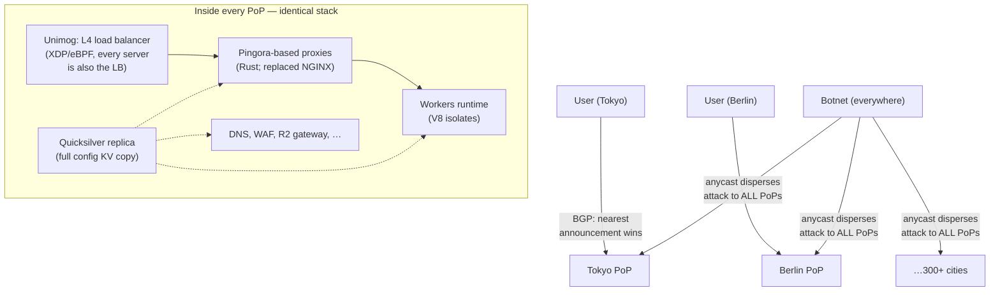

# Cloudflareのシステム設計

> **翻訳についての注記:** 本ドキュメントは英語原文 `08-case-studies/12-cloudflare.md` を日本語に翻訳したものです。コードブロックおよびMermaidダイアグラムは原文のまま維持しています。

## TL;DR

Cloudflareは地球最大級のエッジネットワーク(300超の都市、毎秒数千万リクエスト)を、逆張りのドクトリンで運用しています: **すべてのサーバーがすべてのサービスを動かす**。「CDN層」と「Workers層」は存在しません — 単一の均質なフリートがあり、**anycast**が各ユーザーを最寄りの都市へ誘導し、どのマシンも何にでも答えられます。帰結は連鎖します: DDoS吸収はアーキテクチャの副作用になり(攻撃トラフィックは一点に集中せず惑星全体へ分散)、エッジのコンピュートはコンテナより3桁軽いランタイム(**V8アイソレート** — Workers)を必要とし、数百万顧客の設定は数秒で全マシンに届かねばならず(**Quicksilver**、読み取り最適化されたレプリケートKV)、ステートフルな調整には意図的に*非*エッジ的な答え(**Durable Objects** — キーごとに1つのシングルライターアクター。一度配置され、必要に応じて移動)が与えられます。[セルなし](../06-scaling/11-cell-based-architecture.md)の水平一様性 — 分割ではなく分散による隔離 — の最も完全な公開例です。

---

## 中核要件

### 機能要件
1. Webのかなりの割合のための**リバースプロキシ/CDN** — キャッシング、TLS、HTTPルーティング
2. 人間の反応時間に頼らない、ラインレートの**DDoS緩和**
3. **プログラマブルなエッジ** — すべての都市で動く顧客コード
4. **エッジのデータ** — 設定は即座にどこへでも。アプリのためのKV/キュー/オブジェクト/状態
5. **DNS** — 最大級の権威+リカーシブ(1.1.1.1)の展開

### 非機能要件
1. **レイテンシ** — 地球上の大半の人間から約10〜50ms以内でTLSを終端
2. **吸収力** — 数Tbpsの攻撃をインシデントではなく日常として生き延びる
3. **一様性** — どのマシン・どの都市もどの顧客にも応える(特別な箱なし)
4. **変更速度** — 設定変更が約5秒未満でグローバルに見える

---

## Anycast+均質フリート: ドクトリン

- **どこでもanycast:** 同じIPプレフィックスをすべての都市から広告し、BGPが各ユーザーをトポロジー上最寄りのPoPへルーティングします([マルチリージョンのルーティング](../06-scaling/09-multi-region-architecture.md)の極限 — GeoDNSなし、TTLの古さなし、PoPのドレイン時はBGP収束速度で再ルーティング)。
- **DDoS防御はトポロジーそのもの。** ボットネットのトラフィックは*ボットの*最寄りPoPに入ります — 攻撃は自動的にフリート全体へシャーディングされ、単一サイトが総量を食らうことはありません。マシン単位のフィルタリングは**カーネルスタックの前のXDP/eBPF**で行われ(L4層とドロップのロジックはNICラインレートで走る)、「緩和」を手続きではなく性質に変えます。
- **すべてのサーバーがすべてのサービスを。** サービス専用のハードウェアプールなし: 利用率は平滑化し(容量はプロダクト別予測ではなく総需要に従う)、任意のマシン障害は同一の隣人が吸収し([静的安定性](../06-scaling/09-multi-region-architecture.md))、新プロダクトは初日から300都市を継承します。代償: すべてのサービスが共有マシン上の行儀よいマルチテナント市民でなければならないこと — 厳格なテナント別予算と、各マシン内部での[シャッフルシャード的](../06-scaling/11-cell-based-architecture.md)な爆発半径思考です。
- **Pingora:** NGINXベースのプロキシ層はRustで書き直されました — *全*トラフィックに触れるコードのためのメモリ安全性、接続再利用とカスタマイズの利得、そして(オープンソース化され)同社のプロキシ製品群の基盤になりました。

## Workers: コンテナではなくアイソレート

コンテナでのエッジコンピュートは算数で破綻します: 数千の顧客 × 数百のPoP × コールドスタート数秒 × コンテナのメモリ = 不可能。Workersは代わりに顧客コードを**V8アイソレート** — Chromeがタブごとに使うのと同じサンドボックス — として、プロセスあたり数千個動かします:

| | コンテナ/microVM | V8アイソレート (Workers) |
|---|---|---|
| コールドスタート | 100ms〜数秒 | **約ms以下**(HTTPハンドシェイク中にプリウォームされることも) |
| テナントあたりメモリ | 数十〜数百MB | 約数MB |
| マシンあたり密度 | 数十〜数百 | **数千** |
| 隔離境界 | カーネル/VM | V8サンドボックス+プロセスレベルの防御 |
| テナントコードモデル | 何でも | JS/WASM、CPU時間上限、生ソケットなし |

トレードは本物です: 制約されたランタイム(JS/WASM、ケイパビリティ型API)と引き換えに、「すべての都市のすべてのマシンで走る」を経済的に正気にする密度を得ます — ランタイム層で実行される[マルチテナンシーのアドミッション制御の物語](../06-scaling/12-multi-tenancy.md)です(ベストエフォートの公平性ではなく、リクエストごとのCPU時間上限)。プロセス共有テナンシーのSpectre級リスクには、緩和策に加えて、疑わしいテナントを別プロセスへ隔離するオプションで対処します。

## Quicksilver: レプリケートされた読み取りパスとしての設定

すべてのリクエストが顧客設定(WAFルール、ルーティング、証明書、Workersコード)を参照します。その参照は全マシンで**ローカルかつマイクロ秒級**でなければならず、同時に更新(1日数百万件)は数秒で惑星に届かなければなりません:

- コアの**書き込みパス**がひとつ、変更を受けてレプリケーションログに追記し、すべてのマシンがログを適用する**完全なローカルレプリカ**(LMDB型のメモリマップトストア)を保持します — 読み取りは決して箱を出ません(ミニチュアの[読み取りローカル/書き込みグローバル](../06-scaling/09-multi-region-architecture.md)。このファンアウトで座屈した先代のKyoto Tycoonを置き換えました)。
- 持ち帰る価値のある性質: 読み取り増幅は「全部をどこにでも複製」で処理(設定はトラフィックに比して小さい)。有界の伝播(約数秒)はプロダクトSLOとして*計測されアラートされる*([新鮮さSLI](../11-observability/05-slos-error-budgets.md))。そしてログがインターフェース — 新しい消費者(Workersコード配布)は同じパイプに乗ります([CDC型の思考](../13-data-pipelines/04-change-data-capture.md))。

## Durable Objects: エッジにも状態の家が要ると認める

ステートレスなエッジ+グローバルKV(結果整合、キャッシュ済み)は読み取りをカバーしますが、調整 — チャットルーム、カウンタ、予約 — には直列化ポイントが要ります。Cloudflareの答えはアクターモデルの製品化です: **Durable Object**は私有ストレージを持つ名前付きのシングルスレッドオブジェクトで、プラットフォームが**正確に1つのライブインスタンス**をどこかに配置し、そのIDへの全リクエストをそこへルーティングし、トラフィックの方へ移動させます。強整合は操作ごとのコンセンサスではなく[キーごとのシングルライター](../01-foundations/09-distributed-locks.md)から来ます。ストレージはジャーナリングされます(現在はレプリケートWAL付きのSQLiteベース)。正直な幾何学: あなたのオブジェクトは*1か所*に住みます — 近くではレイテンシは素晴らしく、大陸の反対では遠い — つまりエッジプラットフォームは、キーごとのホームを持つ[パーティション型アクティブ-アクティブ](../06-scaling/09-multi-region-architecture.md)へ収束して戻るのです。物理はエッジネットワークを免除しないからです。

---

## 教訓

1. **分散は隔離の戦略です。** anycast+均質性は、攻撃と負荷の集中をフリート全体の希釈へ変えます — セルの逆であり、リクエストが小さくステートレスでテナント混在のときに適します。
2. **密度がランタイムを決めます。** 「300都市でコードを」はサンドボックス経済学の問題でした。コンテナよりアイソレートは、プロダクトのカテゴリを生む種類の桁違いの一手です。
3. **小さいデータは全複製し、大きい状態は単独へルーティングする。** Quicksilver(全部をどこにでも)とDurable Objects(キーごとに1つの家)は2つの綺麗な極点です。「エッジの状態」の混乱の多くは、両方を同時に欲しがることから来ます。
4. **熱い板金は安全な言語で書き直す:** 全トラフィックを通るプロキシのRust書き直し(Pingora)は、可用性への投資としてのメモリ安全性の最強の公開事例です。
5. **危険な経路を速い経路にする:** XDPでのDDoSフィルタリング、ローカルメモリからの設定読み取り — アーキテクチャがストレス下で起きることを事前に決めており、ソフトウェアに反応を頼みません([静的安定性](../06-scaling/09-multi-region-architecture.md)、再び)。

## 参考文献

- [A Brief Primer on Anycast](https://blog.cloudflare.com/a-brief-anycast-primer/) / [Unimog: Cloudflare's edge load balancer](https://blog.cloudflare.com/unimog-cloudflares-edge-load-balancer/)
- [How Workers works: isolates](https://developers.cloudflare.com/workers/reference/how-workers-works/) / [Cloud Computing without Containers](https://blog.cloudflare.com/cloud-computing-without-containers/)
- [Introducing Quicksilver: configuration distribution at internet scale](https://blog.cloudflare.com/introducing-quicksilver-configuration-distribution-at-internet-scale/)
- [Durable Objects](https://blog.cloudflare.com/introducing-workers-durable-objects/) / [Zero-latency SQLite storage in every Durable Object](https://blog.cloudflare.com/sqlite-in-durable-objects/)
- [Introducing Pingora](https://blog.cloudflare.com/introducing-pingora/) — Rustプロキシの論拠
