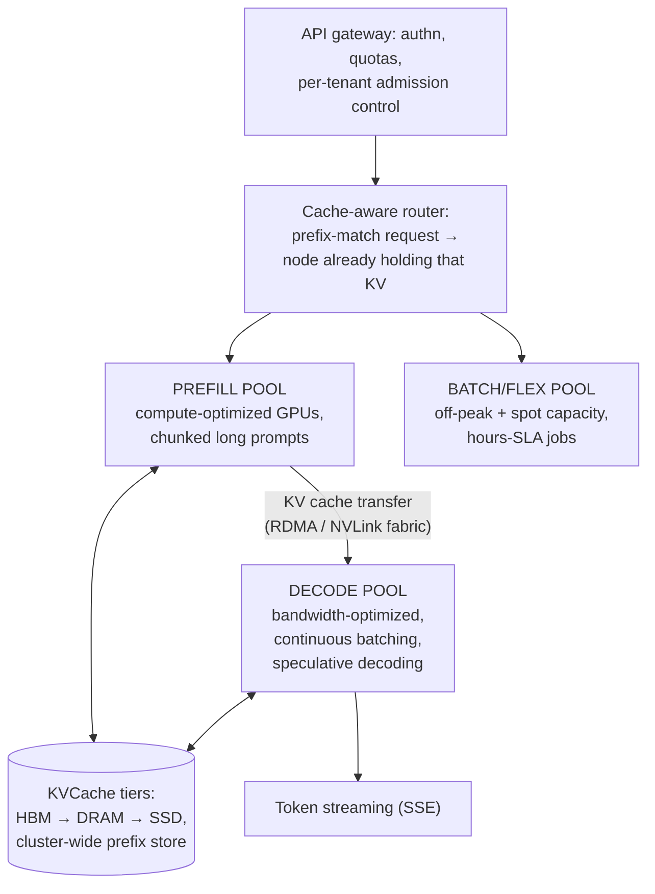

# LLM推論プラットフォーム: 惑星規模でトークンをサービングする

> **翻訳についての注記:** 本ドキュメントは英語原文 `08-case-studies/13-llm-inference-platforms.md` を日本語に翻訳したものです。コードブロックおよびMermaidダイアグラムは原文のまま維持しています。

## TL;DR

フロンティアモデルをサービングするシステムの複合ケーススタディです(公開資料から: MoonshotのMooncake論文、DeepSeekのV3/R1推論解説、vLLM/SGLangの本番デプロイ、プロバイダのエンジニアリング記事) — トークンサービングは、独自のアーキテクチャ学派を持つ一級のデータセンターワークロードになったからです。収束した形: **プリフィルとデコードを分離する**(正反対のハードウェアプロファイル、別々のプール、間でKVキャッシュを輸送)。**KVキャッシュをシステムの中心資産として扱う**(ヒット率が支配的なコストレバーである、多層・クラスタ全域のキャッシュ)。生スループットではなく**SLO下のグッドプット**(プリフィルはTTFT、デコードはトークン間レイテンシ)でスケジュールする。そしてフリートをワークロードクラス(対話/エージェント/バッチ)で分割し、[セル型の隔離](../06-scaling/11-cell-based-architecture.md)を敷く。経済は古典的サービングの直観を反転させました: 計算は注意のトークン単位で買われるため、キャッシュ再利用、バッチングの規律、ルーティングの知性 — より大きなGPUではなく — がマージンを決めます。

---

## 中核要件

### 機能要件
1. **チャット/補完API** — トークンのストリーミング、ツール呼び出し、構造化出力
2. **異質なトラフィック** — 対話チャット、長文書分析、巨大なトランスクリプトを再送するエージェントループ、オフラインバッチ
3. **多数のモデル** — フロンティア+小型高速ティア、ファインチューン/LoRA、顧客ごとのバージョン固定
4. **プロンプトキャッシング** — エージェントは毎ターン10万トークンのプレフィックスを再送する。価格設定は再利用を前提とする

### 非機能要件
1. **TTFT**(最初のトークンまでの時間) — 長いプロンプトでも対話のp95は約1秒を大きく下回る
2. **ITL**(トークン間レイテンシ) — 負荷下でも滑らかなストリーミング(数十ms)
3. **グッドプット** — GPU時間あたり、*両SLOを満たす*リクエストを最大化。トークン/秒ではない
4. **コスト** — トークンがユニットエコノミクス([FinOps](../11-observability/06-finops-cost-engineering.md))。キャッシュヒット率がマージン
5. **隔離** — あるテナントの100万トークンプロンプトが全員のストリームを凍らせてはならない([マルチテナンシー](../06-scaling/12-multi-tenancy.md))

---

## このワークロードの物理

自己回帰Transformer([アーキテクチャがワークロードです](../09-whitepapers/15-attention-transformers.md))は、すべてのリクエストを正反対のプロファイルを持つ2フェーズに分割します:

| | プリフィル(プロンプト処理) | デコード(トークン生成) |
|---|---|---|
| 計算の形 | 1回の巨大な並列パス — **計算律速** | *トークンごとに*モデル全体を1回 — **メモリ帯域律速** |
| レイテンシ指標 | TTFT | ITL |
| バッチングの挙動 | 少数のリクエストでFLOPsが飽和 | 重み読み出しを償却するため巨大なバッチを欲する |
| 圧迫する資源 | FLOPs | HBM帯域+**KVキャッシュ容量** |

両者を1つのGPUに同居させると喧嘩になります: 長いプリフィルが同バッチの全ストリームのITLを止め、デコードのバッチがプリフィルのFLOPsを飢えさせます。レプリカ内では**チャンクドプリフィル**が交互配置し、フリート規模での答えは構造的です:

## アーキテクチャ: 分離型・KV中心

- **プリフィル/デコード分離**(DistServeの議論。**Mooncake** — Kimiのサービング基盤 — が正典的な本番記録): それぞれのSLOに対して独立にサイズされる別プールで、KVブロックは高速ファブリックでストリームされます。Mooncakeの枠組みはさらに進みます: *クラスタの集約DRAM/SSD*が*KVCache中心*のストアとして組織され、スケジューリングはキャッシュ再利用と転送コストを同時最適化します — 過負荷時には、SLOを外すと予測される仕事をプリフィルを浪費する前に断る**早期拒否**ポリシー([ロードシェディング](../06-scaling/10-retries-timeouts-hedging.md)をコストモデル付きで適用)。
- **KV/プレフィックスキャッシュがこのプロダクトの経済です。** エージェントのトラフィックは毎ターン会話プレフィックスを再送し、システムプロンプトは数百万回の呼び出しで繰り返されます。エンジンはノード内でプレフィックスを共有し(PagedAttentionのブロック共有、SGLangのRadixAttention)、プラットフォームは階層化と**キャッシュを意識したルーティング**(プロンプトのプレフィックスをハッシュし、すでに温かいレプリカへ)でクラスタ全域へ拡張します — 「データ」が再計算可能だが高価な[コンシステントハッシュ](../02-distributed-databases/05-partitioning-strategies.md)の問題です。プロバイダ側のプロンプトキャッシュ割引(キャッシュ済み入力約90%引き)は、この内部機構に値段を付けたものです。
- **デコード側のスループットスタック:** 連続バッチング(トークン粒度のバッチ所属)、投機的デコーディング(draft/EAGLE型 — ターゲットモデル1パスで複数トークンを受理)、FP8/INT4量子化、そしてMoEフロンティアモデルには**ワイドなエキスパート並列**(DeepSeekの公開推論ノート: エキスパートを多数のGPUに展開、ファブリック上のall-to-allルーティング、プリフィルとデコードで異なる並列化)([LLMインフラ](../17-llm-systems/05-llm-infrastructure.md)が各機構を扱います)。
- **フリートの分割:** 対話、エージェント(長いプレフィックス、バースト的なターン)、バッチの各クラスは別プールか優先度バンドで走ります — バッチ/フレックスティア(50%引き、時間単位レイテンシ)はオフピーク容量を吸収するために存在します。コストが利用ではなく所有に支配されるハードウェアのための、古典的な稼働率の一手です([FinOps](../11-observability/06-finops-cost-engineering.md))。

## スケジューリング: スループットではなくグッドプット

実効的なダッシュボードは*SLO達成率*のダッシュボードです: トークン/秒を上げてもp95 TTFTを目標の外へ押し出すスケジューラ変更は負の価値です。具体的に:

- ゲートウェイでの**テナント別アドミッション制御**(トークンレート予算、同時ストリーム上限)。あるテナントのエージェントの群れが[ノイジーネイバー](../06-scaling/12-multi-tenancy.md)であり、GPUは優雅にオーバーサブスクライブできないからです。
- **クラス別のキュー規律:** 対話はバッチに割り込み、長いプロンプトはチャンク化されてレプリカを独占せず、スタック/放棄されたストリームは積極的にキャンセルされます(切断したクライアントのデコードは純粋な無駄 — トークンのための[デッドライン伝播](../06-scaling/10-retries-timeouts-hedging.md))。
- **熱の管理はあらゆるステートフルフリートと相似です:** ホットなプレフィックスキャッシュを持つレプリカは貴重で(キャッシュ親和性 vs 負荷分散は生きた緊張)、モデルの重み自体が配置問題です(どのモデルがどこに常駐するか — 100GBアーティファクトのCDNのようなビンパッキング層)。
- **障害処理:** 死んだデコードレプリカは実行中のKVを失います — セッションは他所で再プリフィルするか(レイテンシの瞬断。一般的な選択)、プレミアムティアではKVをレプリケート/チェックポイントします。[ヘッジングはプリフィルの読み取りに適用し、課金されるデコードには決して適用しません](../06-scaling/10-retries-timeouts-hedging.md)。

## 可観測性と安全性

リクエスト単位のトレースは、入出力/キャッシュのトークン、キュー時間、プリフィル時間、ITL分布、キャッシュヒット率、コストを運びます — [OTel GenAI規約](../17-llm-systems/10-llm-evaluation.md)がこれを移植可能にしました。品質は*統計的に*監視され(サンプリングされたオンライン評価、SLIとしての拒否/ガードレール率)、モデル/バージョンのロールアウトは評価スイート+ライブメトリクスの差分に対する[カナリアゲート付きデプロイ](../15-deployment/04-cicd-gitops.md)として走ります — あらゆるデプロイと同じ規律を、より曖昧な判定とともに。

---

## 教訓

1. **物理で分離する:** 1つのリクエストが正反対のハードウェアプロファイルを持つ2フェーズを含むなら、プールの分離は内輪の喧嘩を独立した容量計画に変換します — プリフィル/デコード分割はFLOPsのために生まれ変わった[読み書きパス分離](../06-scaling/09-multi-region-architecture.md)です。
2. **中心資産に名前を付け、その周りに設計する:** これらのプラットフォームは、たまたまモデルを動かしているKVキャッシュシステムです。ヒット率がコスト構造なので、ルーティング、階層化、価格設定、さらには上流のハーネス設計([追記のみのプロンプト](../17-llm-systems/09-harness-engineering.md))まで、すべてがそれに仕えます。
3. **SLO下のグッドプットが、レイテンシ形のマルチテナントサービングの唯一の正直な指標です** — 生スループットの数字は輻輳性崩壊を隠します。
4. **トークン経済がスタック全体を律します:** 解決リクエストあたりコストはキャッシュヒット、バッチティア、量子化の選択から流れます — インフラチームのダッシュボードが粗利モデル*そのもの*である稀な領域です。
5. **すべては先行技術の再結合です:** 連続バッチングは接続多重化、プレフィックスキャッシュはCDN、早期拒否はアドミッション制御、エキスパート並列はシャーディング — この本のパターンが、3年足らずで新しいワークロードのために再実体化されたのです。

## 参考文献

- [Mooncake: A KVCache-centric Disaggregated Architecture for LLM Serving](https://arxiv.org/abs/2407.00079) — Moonshot/Kimiの本番基盤。この学派を定義した論文
- [DistServe: Disaggregating Prefill and Decoding](https://arxiv.org/abs/2401.09670) — グッドプットの議論
- [DeepSeek-V3 Technical Report](https://arxiv.org/abs/2412.19437) とDeepSeekのオープンソース推論リリース — 公開の場でのワイドEP MoEサービング
- [vLLM](https://github.com/vllm-project/vllm) / [SGLang](https://github.com/sgl-project/sglang) — エンジン群。その本番ケーススタディがフリートのパターンを文書化
- [LLMインフラ](../17-llm-systems/05-llm-infrastructure.md) / [ハーネスエンジニアリング](../17-llm-systems/09-harness-engineering.md) — このケーススタディが実体化するパターン記事
- [GPU推論の内部構造](../17-llm-systems/11-gpu-inference-internals.md) — これらのプラットフォームの土台にあるルーフラインの数学、KVキャッシュの帯域台帳、並列化のトレードオフ
