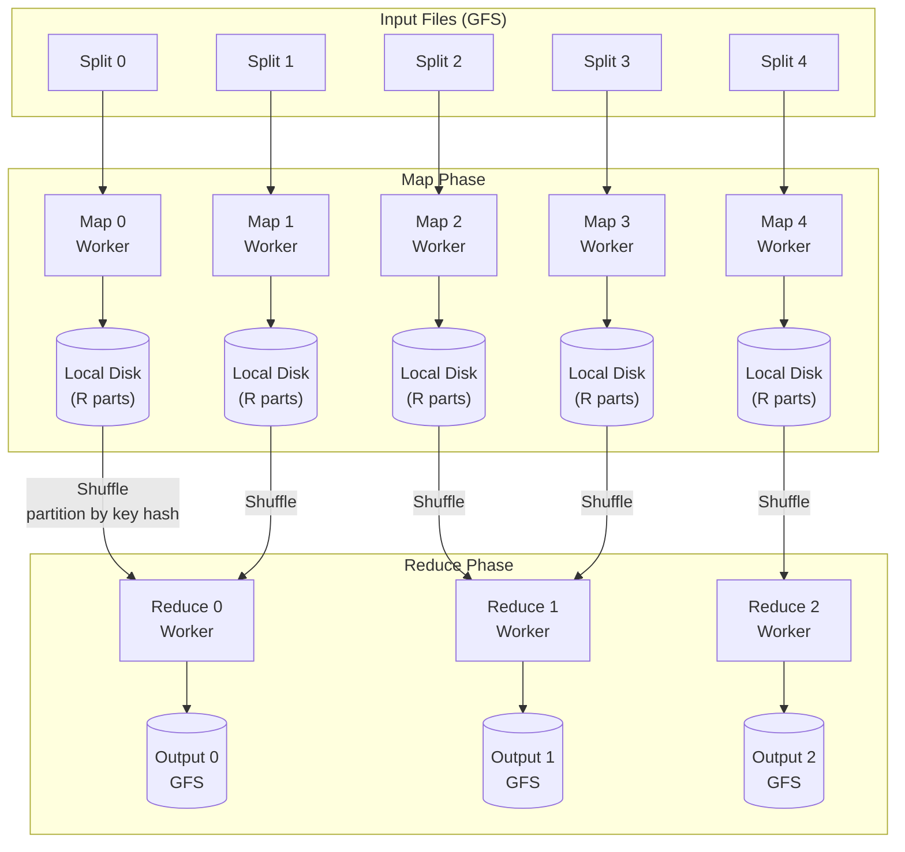

# MapReduce: Simplified Data Processing on Large Clusters

> **注:** この記事は英語の原文を日本語に翻訳したものです。コードブロック、Mermaidダイアグラム、論文タイトル、システム名、技術用語は原文のまま保持しています。

## 論文概要

**著者:** Jeffrey Dean, Sanjay Ghemawat (Google)
**発表:** OSDI 2004
**引用:** コンピュータサイエンスにおいて最も引用された論文の一つ

## TL;DR

MapReduceは、分散クラスタ上で大規模データセットを並列処理するためのプログラミングモデルです。ユーザーは、キーバリューペアを処理して中間ペアを生成する**map**関数と、同じキーを持つ中間値をマージする**reduce**関数を定義します。ランタイムが並列化、耐障害性、データ分散を自動的に処理します。この抽象化により、Googleは分散システムの複雑さを隠蔽しながら、コモディティハードウェア上で数千もの異なる計算を実行できるようになりました。

---

## 課題

MapReduce以前、Googleのエンジニアは各計算ごとにカスタム分散システムを構築する必要がありました：
- Webクロール
- 検索インデックスの構築
- ログ分析
- PageRankの計算

それぞれのシステムで以下を処理する必要がありました：
- 数百台のマシンにわたる並列化
- データ分散と負荷分散
- マシン障害に対する耐障害性
- ネットワーク最適化

これは複雑でエラーが起きやすく、作業の重複を招いていました。

---

## 中核的な抽象化

```
┌─────────────────────────────────────────────────────────────────────────┐
│                    MapReduce Programming Model                           │
│                                                                          │
│   map(key1, value1) → list(key2, value2)                                │
│   reduce(key2, list(value2)) → list(value2)                             │
│                                                                          │
│   ┌──────────────────────────────────────────────────────────────────┐  │
│   │                        Example: Word Count                        │  │
│   │                                                                   │  │
│   │   Input: "hello world hello"                                     │  │
│   │                                                                   │  │
│   │   map("doc1", "hello world hello"):                              │  │
│   │       emit("hello", 1)                                           │  │
│   │       emit("world", 1)                                           │  │
│   │       emit("hello", 1)                                           │  │
│   │                                                                   │  │
│   │   reduce("hello", [1, 1]):                                       │  │
│   │       emit("hello", 2)                                           │  │
│   │                                                                   │  │
│   │   reduce("world", [1]):                                          │  │
│   │       emit("world", 1)                                           │  │
│   └──────────────────────────────────────────────────────────────────┘  │
└─────────────────────────────────────────────────────────────────────────┘
```

---

## 実行フロー



### 実行ステップ

1. **入力の分割**: 入力をM個のスプリットに分割します（通常16～64MB）
2. **プロセスのフォーク**: マスターがワーカーにmap/reduceタスクを割り当てます
3. **Mapフェーズ**: ワーカーがスプリットを読み取り、map関数を適用し、出力をメモリにバッファリングします
4. **パーティション**: バッファリングされた出力をhash(key) mod Rによって R個の領域に分割します
5. **ローカルへの書き込み**: パーティション化されたデータをローカルディスクに書き込みます
6. **シャッフル**: Reduceワーカーが全Mapワーカーから自分のパーティションをフェッチします
7. **ソート**: Reduceワーカーがキーでソートします（必要に応じて外部ソート）
8. **Reduceフェーズ**: ソートされたデータを反復処理し、reduce関数を適用します
9. **出力**: Reduceの出力をGFSに書き込みます

---

## 実装の詳細

### マスターのデータ構造

```python
from dataclasses import dataclass, field
from typing import Dict, List, Optional, Set
from enum import Enum
import time

class TaskState(Enum):
    IDLE = "idle"
    IN_PROGRESS = "in_progress"
    COMPLETED = "completed"

class TaskType(Enum):
    MAP = "map"
    REDUCE = "reduce"

@dataclass
class MapTask:
    task_id: int
    input_split: str  # GFS file path
    state: TaskState = TaskState.IDLE
    worker_id: Optional[str] = None
    start_time: Optional[float] = None
    output_locations: List[str] = field(default_factory=list)  # R locations

@dataclass
class ReduceTask:
    task_id: int
    partition: int  # Partition number (0 to R-1)
    state: TaskState = TaskState.IDLE
    worker_id: Optional[str] = None
    start_time: Optional[float] = None
    input_locations: List[str] = field(default_factory=list)  # From all mappers


class MapReduceMaster:
    """
    Master coordinates the entire MapReduce job.
    Tracks task states, handles failures, and manages workers.
    """

    def __init__(self, input_files: List[str], num_reducers: int):
        self.num_mappers = len(input_files)
        self.num_reducers = num_reducers

        # Initialize map tasks
        self.map_tasks: Dict[int, MapTask] = {
            i: MapTask(task_id=i, input_split=f)
            for i, f in enumerate(input_files)
        }

        # Initialize reduce tasks
        self.reduce_tasks: Dict[int, ReduceTask] = {
            i: ReduceTask(task_id=i, partition=i)
            for i in range(num_reducers)
        }

        # Worker tracking
        self.workers: Dict[str, float] = {}  # worker_id -> last_heartbeat
        self.worker_timeout = 10.0  # seconds

    def get_task(self, worker_id: str) -> Optional[Dict]:
        """Assign a task to a worker"""
        self.workers[worker_id] = time.time()

        # Prefer map tasks first (reduce can't start until maps complete)
        for task_id, task in self.map_tasks.items():
            if task.state == TaskState.IDLE:
                task.state = TaskState.IN_PROGRESS
                task.worker_id = worker_id
                task.start_time = time.time()

                return {
                    "type": TaskType.MAP,
                    "task_id": task_id,
                    "input_split": task.input_split,
                    "num_reducers": self.num_reducers
                }

        # All maps done? Assign reduce tasks
        if self._all_maps_complete():
            for task_id, task in self.reduce_tasks.items():
                if task.state == TaskState.IDLE:
                    task.state = TaskState.IN_PROGRESS
                    task.worker_id = worker_id
                    task.start_time = time.time()

                    # Collect input locations from all mappers
                    input_locations = []
                    for map_task in self.map_tasks.values():
                        input_locations.append(
                            map_task.output_locations[task_id]
                        )

                    return {
                        "type": TaskType.REDUCE,
                        "task_id": task_id,
                        "partition": task.partition,
                        "input_locations": input_locations
                    }

        return None  # No tasks available

    def task_completed(
        self,
        worker_id: str,
        task_type: TaskType,
        task_id: int,
        output_locations: List[str]
    ):
        """Handle task completion notification"""
        if task_type == TaskType.MAP:
            task = self.map_tasks[task_id]
            if task.worker_id == worker_id:
                task.state = TaskState.COMPLETED
                task.output_locations = output_locations
        else:
            task = self.reduce_tasks[task_id]
            if task.worker_id == worker_id:
                task.state = TaskState.COMPLETED

    def check_timeouts(self):
        """Re-assign tasks from failed workers"""
        now = time.time()

        # Check for worker timeouts
        failed_workers = set()
        for worker_id, last_heartbeat in self.workers.items():
            if now - last_heartbeat > self.worker_timeout:
                failed_workers.add(worker_id)

        # Re-assign map tasks
        for task in self.map_tasks.values():
            if task.state == TaskState.IN_PROGRESS:
                if task.worker_id in failed_workers:
                    task.state = TaskState.IDLE
                    task.worker_id = None

        # Re-assign reduce tasks
        for task in self.reduce_tasks.values():
            if task.state == TaskState.IN_PROGRESS:
                if task.worker_id in failed_workers:
                    task.state = TaskState.IDLE
                    task.worker_id = None

        # Also re-run completed map tasks if worker failed
        # (reduce workers may not have fetched data yet)
        for task in self.map_tasks.values():
            if task.state == TaskState.COMPLETED:
                if task.worker_id in failed_workers:
                    task.state = TaskState.IDLE
                    task.worker_id = None

    def _all_maps_complete(self) -> bool:
        return all(t.state == TaskState.COMPLETED for t in self.map_tasks.values())

    def is_done(self) -> bool:
        return all(t.state == TaskState.COMPLETED for t in self.reduce_tasks.values())
```

### ワーカーの実装

```python
class MapReduceWorker:
    """
    Worker executes map and reduce tasks.
    """

    def __init__(self, worker_id: str, master_address: str):
        self.worker_id = worker_id
        self.master = master_address
        self.map_fn = None
        self.reduce_fn = None

    def run(self):
        """Main worker loop"""
        while True:
            # Request task from master
            task = self.request_task()

            if task is None:
                # No tasks available, sleep and retry
                time.sleep(1)
                continue

            if task["type"] == TaskType.MAP:
                self.execute_map(task)
            else:
                self.execute_reduce(task)

    def execute_map(self, task: Dict):
        """Execute a map task"""
        task_id = task["task_id"]
        input_file = task["input_split"]
        num_reducers = task["num_reducers"]

        # Read input
        content = self.read_gfs(input_file)

        # Apply map function
        intermediate = []
        for key, value in self.parse_input(content):
            for output_key, output_value in self.map_fn(key, value):
                intermediate.append((output_key, output_value))

        # Partition by reduce task
        partitions = [[] for _ in range(num_reducers)]
        for key, value in intermediate:
            partition = hash(key) % num_reducers
            partitions[partition].append((key, value))

        # Write partitions to local disk
        output_locations = []
        for partition_id, partition_data in enumerate(partitions):
            location = f"/tmp/mr-{task_id}-{partition_id}"
            self.write_local(location, partition_data)
            output_locations.append(f"{self.worker_id}:{location}")

        # Notify master
        self.notify_complete(TaskType.MAP, task_id, output_locations)

    def execute_reduce(self, task: Dict):
        """Execute a reduce task"""
        task_id = task["task_id"]
        input_locations = task["input_locations"]

        # Fetch all intermediate data for this partition
        intermediate = []
        for location in input_locations:
            worker, path = location.split(":")
            data = self.fetch_from_worker(worker, path)
            intermediate.extend(data)

        # Sort by key
        intermediate.sort(key=lambda x: x[0])

        # Group by key and apply reduce
        output = []
        i = 0
        while i < len(intermediate):
            key = intermediate[i][0]
            values = []

            # Collect all values for this key
            while i < len(intermediate) and intermediate[i][0] == key:
                values.append(intermediate[i][1])
                i += 1

            # Apply reduce function
            for output_value in self.reduce_fn(key, values):
                output.append((key, output_value))

        # Write output to GFS
        output_file = f"/output/part-{task_id:05d}"
        self.write_gfs(output_file, output)

        # Notify master
        self.notify_complete(TaskType.REDUCE, task_id, [output_file])
```

---

## 耐障害性

### ワーカー障害

```
┌─────────────────────────────────────────────────────────────────────────┐
│                    Handling Worker Failures                              │
│                                                                          │
│   Map Worker Fails:                                                     │
│   ┌──────────────────────────────────────────────────────────────────┐  │
│   │   1. Master detects via missing heartbeats                       │  │
│   │   2. All map tasks on that worker reset to IDLE                  │  │
│   │   3. Tasks re-assigned to other workers                          │  │
│   │   4. Reduce workers notified of new intermediate locations       │  │
│   │                                                                   │  │
│   │   Note: Completed map tasks ALSO re-executed because output      │  │
│   │         is on local disk (inaccessible if worker dead)           │  │
│   └──────────────────────────────────────────────────────────────────┘  │
│                                                                          │
│   Reduce Worker Fails:                                                  │
│   ┌──────────────────────────────────────────────────────────────────┐  │
│   │   1. Master detects via missing heartbeats                       │  │
│   │   2. Only IN_PROGRESS reduce tasks reset to IDLE                │  │
│   │   3. Tasks re-assigned to other workers                          │  │
│   │                                                                   │  │
│   │   Note: Completed reduce tasks NOT re-executed because output   │  │
│   │         is on GFS (globally accessible)                          │  │
│   └──────────────────────────────────────────────────────────────────┘  │
│                                                                          │
│   Master Failure:                                                       │
│   ┌──────────────────────────────────────────────────────────────────┐  │
│   │   Original paper: Abort job, user restarts                       │  │
│   │   Later systems: Checkpointing, standby master                   │  │
│   └──────────────────────────────────────────────────────────────────┘  │
└─────────────────────────────────────────────────────────────────────────┘
```

### 決定論的実行

耐障害性が正しく動作するためには以下が必要です：
- MapとReduce関数は**決定論的**でなければなりません
- 同じ入力から常に同じ出力が生成される必要があります
- 再実行により同一の結果が得られます
- 非決定論的な関数は不整合を引き起こす可能性があります

---

## 最適化

### データ局所性の最適化

```
┌─────────────────────────────────────────────────────────────────────────┐
│                    Data Locality Optimization                            │
│                                                                          │
│   GFS stores data in 64MB chunks, replicated 3x                         │
│                                                                          │
│   ┌────────────────────────────────────────────────────────────────┐    │
│   │   GFS Chunk Locations for Input Split                          │    │
│   │                                                                 │    │
│   │   Split "input-0": replicas on [Machine A, Machine B, Machine C]│    │
│   │                                                                 │    │
│   │   Master scheduling priority:                                   │    │
│   │   1. Schedule map task on machine with replica (local read)    │    │
│   │   2. Schedule on machine on same rack (rack-local)             │    │
│   │   3. Schedule anywhere (remote read)                            │    │
│   │                                                                 │    │
│   │   Result: Most reads are local, minimizing network bandwidth   │    │
│   └────────────────────────────────────────────────────────────────┘    │
└─────────────────────────────────────────────────────────────────────────┘
```

### Combiner関数

```python
# Without combiner: Each mapper emits ("the", 1) thousands of times
# Lots of network traffic during shuffle

def word_count_map(key, value):
    for word in value.split():
        emit(word, 1)

def word_count_reduce(key, values):
    emit(key, sum(values))

# With combiner: Partial aggregation on mapper before shuffle
def word_count_combiner(key, values):
    # Same as reduce, runs locally on mapper
    emit(key, sum(values))

# Mapper output: ("the", 4523) instead of thousands of ("the", 1)
# Much less data transferred during shuffle
```

### バックアップタスク

```
┌─────────────────────────────────────────────────────────────────────────┐
│                    Handling Stragglers                                   │
│                                                                          │
│   問題: 1台の遅いマシンがジョブ全体を遅延させる可能性があります       │
│   - ディスク不良                                                        │
│   - 競合するワークロード                                                │
│   - CPUスロットリング                                                   │
│                                                                          │
│   解決策: バックアップタスク                                            │
│   ┌──────────────────────────────────────────────────────────────────┐  │
│   │   ジョブがほぼ完了したとき（例：タスクの90%が完了）：             │  │
│   │   1. まだ実行中のタスクを特定する                                │  │
│   │   2. 他のマシンでバックアップ実行をスケジュールする              │  │
│   │   3. 最初に完了したものが採用され、他は終了する                  │  │
│   │                                                                   │  │
│   │   コスト: リソースの数パーセント増加                             │  │
│   │   効果: テールレイテンシの大幅な削減                             │  │
│   └──────────────────────────────────────────────────────────────────┘  │
│                                                                          │
│   論文からの例:                                                         │
│   - バックアップタスクなしの1TBソート: 1283秒                          │
│   - バックアップタスクありの1TBソート: 891秒（44%高速化）              │
└─────────────────────────────────────────────────────────────────────────┘
```

---

## アプリケーション例

### 分散Grep

```python
def grep_map(key, value):
    # key: filename, value: file contents
    for line in value.split('\n'):
        if re.search(pattern, line):
            emit(line, "1")

def grep_reduce(key, values):
    emit(key, None)  # Just output matching lines
```

### URLアクセスカウント

```python
def url_map(key, value):
    # key: log line number, value: log entry
    parsed = parse_log_entry(value)
    emit(parsed.url, 1)

def url_reduce(key, values):
    emit(key, sum(values))
```

### 転置インデックス

```python
def index_map(key, value):
    # key: document ID, value: document content
    for word in value.split():
        emit(word, key)

def index_reduce(key, values):
    # key: word, values: list of document IDs
    emit(key, sorted(set(values)))
```

### PageRankイテレーション

```python
def pagerank_map(key, value):
    # key: page URL, value: (current_rank, outlinks)
    current_rank, outlinks = value

    # Distribute rank to outlinks
    contribution = current_rank / len(outlinks)
    for outlink in outlinks:
        emit(outlink, contribution)

    # Emit graph structure
    emit(key, outlinks)

def pagerank_reduce(key, values):
    # Separate contributions from graph structure
    outlinks = None
    total_contribution = 0

    for value in values:
        if isinstance(value, list):
            outlinks = value
        else:
            total_contribution += value

    # PageRank formula
    new_rank = 0.15 + 0.85 * total_contribution
    emit(key, (new_rank, outlinks))
```

---

## パフォーマンス結果（論文より）

### Grep

- 10^10個の100バイトレコード（1 TB）
- パターンは92,337レコードで出現
- M = 15,000 Mapタスク、R = 1 Reduceタスク
- 1,764台のマシン
- **所要時間: 150秒**（約60秒の起動オーバーヘッドを含む）
- ピーク: 30 GB/sの集約読み取り速度

### Sort

- 10^10個の100バイトレコード（1 TB）
- M = 15,000 Mapタスク、R = 4,000 Reduceタスク
- 1,764台のマシン
- **所要時間: 891秒**（バックアップタスクあり）
- 3つのフェーズが確認可能: Map（約200秒）、Shuffle（約600秒）、Reduce（約100秒）

---

## 制限事項

1. **バッチ処理のみ** - リアルタイムやインタラクティブなクエリには適していません
2. **ディスクベースのシャッフル** - フェーズ間のI/Oコストが高い
3. **map + reduceに限定** - 複雑なアルゴリズムは複数のジョブが必要
4. **イテレーションのサポートなし** - 各イテレーション = ジョブの完全な再起動
5. **高レイテンシ** - 起動オーバーヘッド、フェーズ間のマテリアライゼーション

---

## レガシーと影響

### 直接的な後継システム
- **Hadoop MapReduce** - オープンソース実装
- **Apache Spark** - インメモリ、DAGベース（多くの制限に対処）
- **Apache Flink** - バッチ機能を備えたストリーム処理

### 広範な影響
- データ処理における関数型プログラミングパターンを普及させました
- コモディティハードウェアによるビッグデータ処理の実現可能性を実証しました
- クラウドコンピューティングモデル（EMR、Dataproc）に影響を与えました
- SQL-on-Hadoopシステム（Hive、Pig）に影響を与えました

---

## 主な学び

1. **シンプルな抽象化で強力な結果** - 2つの関数（map、reduce）で驚くほど多くの計算を表現できます。

2. **自動並列化** - ユーザーは逐次コードを書くだけで、フレームワークが分散を処理します。

3. **再実行による耐障害性** - 決定論的な関数 + リネージ追跡 = 作業の損失なし。

4. **データ局所性が重要** - ネットワークI/Oを最小化するために、データの近くで計算をスケジュールします。

5. **ストラグラー対策のバックアップタスク** - わずかなリソースコストで大きなレイテンシ改善が得られます。

6. **コモディティハードウェアで十分** - 障害を想定し、それに対応した設計を行い、スケールアウトします。

7. **中間データはローカルディスクに** - ネットワークトラフィックを削減し、パイプライン全体の再実行なしにリカバリを可能にします。
