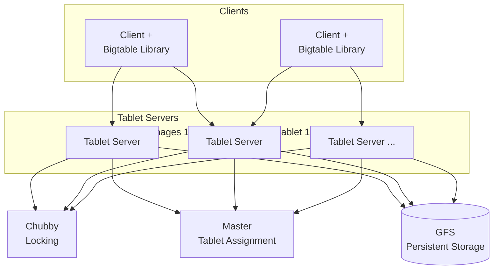
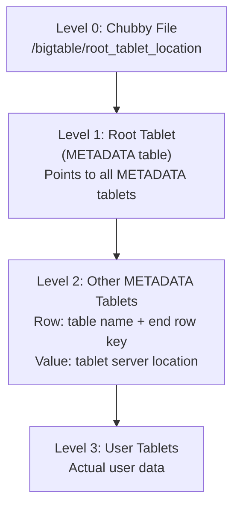
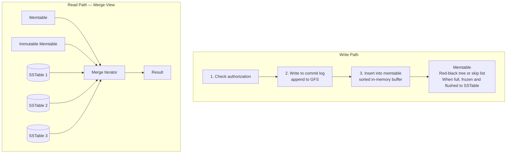

# Bigtable: A Distributed Storage System for Structured Data

> **注:** この記事は英語の原文を日本語に翻訳したものです。コードブロック、Mermaidダイアグラム、論文タイトル、システム名、技術用語は原文のまま保持しています。

## 論文概要

**著者:** Fay Chang他 (Google)
**発表:** OSDI 2006
**背景:** Webインデックス、Google Earth、Google Finance向けのGoogle社内ストレージ

## TL;DR

Bigtableは、ペタバイト規模の構造化データを管理する分散ストレージシステムです。`(row, column, timestamp)`でインデックス付けされた**疎で、分散された、永続的な多次元ソート済みマップ**を提供します。主なイノベーションには、水平スケーリングのための**Tablet**、インメモリバッファリングを備えた**SSTableベースのストレージ**、完全なACIDなしの**単一行トランザクション**、ストレージと調整のための**GFSおよびChubby**との統合があります。Bigtableは、事実上すべての現代のNoSQLデータベースに影響を与えました。

---

## 課題

Googleが必要としたストレージ：
- **Webインデックス**: クロールしたページ、リンク、アンカーテキスト（ペタバイト）
- **Google Earth**: 複数の解像度の衛星画像
- **Google Finance**: 時系列の株式データ
- **パーソナライズ**: 製品間のユーザー設定

要件：
- ペタバイト規模、数十億行
- バッチ処理のための高スループット
- インタラクティブ配信のための低レイテンシ
- 自己管理、自動スケーリング
- MapReduceとの統合

---

## データモデル

```
┌─────────────────────────────────────────────────────────────────────────┐
│                    Bigtable Data Model                                   │
│                                                                          │
│   (row_key, column_key, timestamp) → value                              │
│                                                                          │
│   ┌──────────────────────────────────────────────────────────────────┐  │
│   │   例: Web Table                                                  │  │
│   │                                                                   │  │
│   │   Row Key: 逆転URL (com.google.www)                             │  │
│   │                                                                   │  │
│   │   ┌────────────────┬──────────────────┬──────────────────────┐   │  │
│   │   │    Row Key     │   contents:html  │   anchor:cnn.com     │   │  │
│   │   │                │                  │   anchor:nyt.com     │   │  │
│   │   ├────────────────┼──────────────────┼──────────────────────┤   │  │
│   │   │                │ t=5: "<html>..." │ t=9: "CNN"           │   │  │
│   │   │ com.google.www │ t=3: "<html>..." │ t=8: "click here"    │   │  │
│   │   │                │ t=1: "<html>..." │                      │   │  │
│   │   ├────────────────┼──────────────────┼──────────────────────┤   │  │
│   │   │ com.cnn.www    │ t=6: "<html>..." │ t=5: "CNN Home"      │   │  │
│   │   └────────────────┴──────────────────┴──────────────────────┘   │  │
│   │                                                                   │  │
│   │   主な特性:                                                      │  │
│   │   - 行は辞書順にソート                                          │  │
│   │   - Column Family: contents, anchor                             │  │
│   │   - カラム: contents:html, anchor:cnn.com                       │  │
│   │   - セルごとに複数バージョン（タイムスタンプ付き）              │  │
│   │   - 疎: 空のセルにはストレージを消費しない                      │  │
│   └──────────────────────────────────────────────────────────────────┘  │
└─────────────────────────────────────────────────────────────────────────┘
```

### 主要な設計判断

```
┌─────────────────────────────────────────────────────────────────────────┐
│   行:                                                                   │
│   - 任意の文字列（最大64KB）                                           │
│   - 単一行トランザクション（アトミックなread-modify-write）           │
│   - 行キーでソート（範囲スキャンの局所性）                            │
│                                                                          │
│   Column Family:                                                        │
│   - 共通の性質を持つカラムのグループ                                   │
│   - アクセス制御の単位                                                 │
│   - スキーマ時に作成（動的ではない）                                   │
│   - 例: "anchor"ファミリ、"contents"ファミリ                          │
│                                                                          │
│   カラム:                                                               │
│   - 形式: family:qualifier                                             │
│   - Qualifierは動的に作成可能                                          │
│   - 例: anchor:cnn.com, anchor:nytimes.com                             │
│                                                                          │
│   タイムスタンプ:                                                       │
│   - 64ビット整数（マイクロ秒またはユーザー定義）                      │
│   - セルごとに複数バージョン                                           │
│   - ガベージコレクション: 最新N件保持またはT以降のバージョンを保持   │
└─────────────────────────────────────────────────────────────────────────┘
```

---

## アーキテクチャ



---

## Tablet

```
┌─────────────────────────────────────────────────────────────────────────┐
│                    Tablet: 分散の単位                                    │
│                                                                          │
│   Tabletは連続した行の範囲です                                         │
│                                                                          │
│   ┌──────────────────────────────────────────────────────────────────┐  │
│   │   テーブル: webtable                                              │  │
│   │                                                                   │  │
│   │   ┌────────────────────────────────────────────────────────────┐ │  │
│   │   │ Tablet 1: rows [aaa...] to [com.facebook...]              │ │  │
│   │   │ Tablet 2: rows [com.google...] to [com.yahoo...]          │ │  │
│   │   │ Tablet 3: rows [com.youtube...] to [org.apache...]        │ │  │
│   │   │ Tablet 4: rows [org.wikipedia...] to [zzz...]             │ │  │
│   │   └────────────────────────────────────────────────────────────┘ │  │
│   │                                                                   │  │
│   │   Tabletが成長すると分割されます:                                 │  │
│   │   Tablet 2 → Tablet 2a [com.google...] to [com.twitter...]      │  │
│   │              Tablet 2b [com.uber...] to [com.yahoo...]          │  │
│   │                                                                   │  │
│   └──────────────────────────────────────────────────────────────────┘  │
│                                                                          │
│   利点:                                                                 │
│   - 細粒度の負荷分散（サーバー間でTabletを移動）                      │
│   - 効率的なリカバリ（テーブル全体ではなく障害のあるTabletのみ復元） │
│   - 並列処理（クラスタ全体にTabletを分散）                            │
└─────────────────────────────────────────────────────────────────────────┘
```

### Tabletの位置検索



> クライアントはTabletの位置をキャッシュします。キャッシュミス時に無効化されます。
> コールドキャッシュで3回のネットワークラウンドトリップ、ウォームキャッシュで0回です。

---

## SSTableストレージフォーマット

```
┌─────────────────────────────────────────────────────────────────────────┐
│                    SSTable (Sorted String Table)                         │
│                                                                          │
│   不変でソート済みのキーバリューペアファイル                            │
│                                                                          │
│   ┌──────────────────────────────────────────────────────────────────┐  │
│   │                     SSTable File                                  │  │
│   │                                                                   │  │
│   │   ┌─────────────────────────────────────────────────────────┐    │  │
│   │   │                   Data Blocks                            │    │  │
│   │   │   ┌───────────┐ ┌───────────┐ ┌───────────┐             │    │  │
│   │   │   │  Block 0  │ │  Block 1  │ │  Block 2  │ ...         │    │  │
│   │   │   │  64KB     │ │  64KB     │ │  64KB     │             │    │  │
│   │   │   │ (sorted   │ │ (sorted   │ │ (sorted   │             │    │  │
│   │   │   │  k-v pairs)│ │  k-v pairs)│ │  k-v pairs)│            │    │  │
│   │   │   └───────────┘ └───────────┘ └───────────┘             │    │  │
│   │   └─────────────────────────────────────────────────────────┘    │  │
│   │                                                                   │  │
│   │   ┌─────────────────────────────────────────────────────────┐    │  │
│   │   │                   Index Block                            │    │  │
│   │   │   Block 0: key "aaa" at offset 0                        │    │  │
│   │   │   Block 1: key "bbb" at offset 65536                    │    │  │
│   │   │   Block 2: key "ccc" at offset 131072                   │    │  │
│   │   │   ...                                                    │    │  │
│   │   └─────────────────────────────────────────────────────────┘    │  │
│   │                                                                   │  │
│   │   ┌─────────────────────────────────────────────────────────┐    │  │
│   │   │                   Bloom Filter                           │    │  │
│   │   │   「キーが存在するかも」/「キーは確実に存在しない」の高速判定│  │
│   │   └─────────────────────────────────────────────────────────┘    │  │
│   │                                                                   │  │
│   │   ┌─────────────────────────────────────────────────────────┐    │  │
│   │   │                   Footer                                 │    │  │
│   │   │   Index BlockとBloom Filterへのオフセット                │    │  │
│   │   └─────────────────────────────────────────────────────────┘    │  │
│   └──────────────────────────────────────────────────────────────────┘  │
│                                                                          │
│   読み取りパス:                                                         │
│   1. インデックスをメモリにロード（小さい）                            │
│   2. キーを含むブロックをインデックスのバイナリサーチで特定            │
│   3. そのブロックをロードして検索                                      │
└─────────────────────────────────────────────────────────────────────────┘
```

---

## Tabletの提供



### 実装

```python
from dataclasses import dataclass, field
from typing import Dict, List, Optional, Iterator, Tuple
import time
from sortedcontainers import SortedDict

@dataclass
class Cell:
    value: bytes
    timestamp: int

@dataclass
class ColumnFamily:
    name: str
    columns: Dict[str, List[Cell]] = field(default_factory=dict)
    max_versions: int = 3


class Memtable:
    """
    In-memory sorted buffer for recent writes.
    Implemented as sorted map.
    """

    def __init__(self, max_size_bytes: int = 64 * 1024 * 1024):
        self.data: SortedDict = SortedDict()  # row_key -> {cf -> {col -> [cells]}}
        self.size_bytes = 0
        self.max_size = max_size_bytes
        self.frozen = False

    def put(
        self,
        row_key: str,
        column_family: str,
        column: str,
        value: bytes,
        timestamp: Optional[int] = None
    ):
        """Insert or update a cell"""
        if self.frozen:
            raise Exception("Memtable is frozen")

        if timestamp is None:
            timestamp = int(time.time() * 1000000)

        if row_key not in self.data:
            self.data[row_key] = {}

        if column_family not in self.data[row_key]:
            self.data[row_key][column_family] = {}

        if column not in self.data[row_key][column_family]:
            self.data[row_key][column_family][column] = []

        cell = Cell(value=value, timestamp=timestamp)
        self.data[row_key][column_family][column].append(cell)

        # Sort by timestamp descending (newest first)
        self.data[row_key][column_family][column].sort(
            key=lambda c: c.timestamp,
            reverse=True
        )

        self.size_bytes += len(row_key) + len(column_family) + len(column) + len(value) + 8

    def get(
        self,
        row_key: str,
        column_family: Optional[str] = None,
        column: Optional[str] = None,
        max_versions: int = 1
    ) -> Optional[Dict]:
        """Get cells for a row"""
        if row_key not in self.data:
            return None

        row_data = self.data[row_key]

        if column_family and column_family in row_data:
            if column and column in row_data[column_family]:
                return {column_family: {column: row_data[column_family][column][:max_versions]}}
            return {column_family: row_data[column_family]}

        return row_data

    def scan(
        self,
        start_row: str,
        end_row: str
    ) -> Iterator[Tuple[str, Dict]]:
        """Scan rows in range"""
        for row_key in self.data.irange(start_row, end_row, inclusive=(True, False)):
            yield row_key, self.data[row_key]

    def is_full(self) -> bool:
        return self.size_bytes >= self.max_size

    def freeze(self):
        """Freeze memtable for flushing"""
        self.frozen = True


class SSTableWriter:
    """Writes memtable to SSTable file format"""

    def __init__(self, file_path: str, block_size: int = 64 * 1024):
        self.file_path = file_path
        self.block_size = block_size
        self.index_entries = []
        self.bloom_filter = BloomFilter(expected_items=100000)

    def write(self, memtable: Memtable):
        """Write memtable to SSTable file"""
        with open(self.file_path, 'wb') as f:
            current_block = []
            current_block_size = 0
            block_offset = 0
            first_key_in_block = None

            for row_key, row_data in memtable.data.items():
                # Serialize row
                row_bytes = self._serialize_row(row_key, row_data)

                # Add to bloom filter
                self.bloom_filter.add(row_key)

                # Check if we need new block
                if current_block_size + len(row_bytes) > self.block_size and current_block:
                    # Write current block
                    block_data = b''.join(current_block)
                    f.write(block_data)

                    # Record in index
                    self.index_entries.append((first_key_in_block, block_offset))

                    block_offset += len(block_data)
                    current_block = []
                    current_block_size = 0
                    first_key_in_block = None

                if first_key_in_block is None:
                    first_key_in_block = row_key

                current_block.append(row_bytes)
                current_block_size += len(row_bytes)

            # Write last block
            if current_block:
                block_data = b''.join(current_block)
                f.write(block_data)
                self.index_entries.append((first_key_in_block, block_offset))
                block_offset += len(block_data)

            # Write index
            index_offset = block_offset
            f.write(self._serialize_index())

            # Write bloom filter
            bloom_offset = f.tell()
            f.write(self.bloom_filter.serialize())

            # Write footer
            f.write(self._serialize_footer(index_offset, bloom_offset))


class SSTableReader:
    """Reads from SSTable file"""

    def __init__(self, file_path: str):
        self.file_path = file_path
        self.index = []
        self.bloom_filter = None
        self._load_metadata()

    def _load_metadata(self):
        """Load index and bloom filter into memory"""
        with open(self.file_path, 'rb') as f:
            # Read footer
            f.seek(-16, 2)  # Last 16 bytes
            footer = f.read(16)
            index_offset, bloom_offset = struct.unpack('QQ', footer)

            # Load index
            f.seek(index_offset)
            index_data = f.read(bloom_offset - index_offset)
            self.index = self._parse_index(index_data)

            # Load bloom filter
            f.seek(bloom_offset)
            bloom_data = f.read()
            bloom_data = bloom_data[:-16]  # Exclude footer
            self.bloom_filter = BloomFilter.deserialize(bloom_data)

    def get(self, row_key: str) -> Optional[Dict]:
        """Get a row from SSTable"""
        # Check bloom filter first
        if not self.bloom_filter.might_contain(row_key):
            return None

        # Binary search index for block
        block_idx = self._find_block(row_key)
        if block_idx < 0:
            return None

        # Read and search block
        block = self._read_block(block_idx)
        return self._search_block(block, row_key)

    def _find_block(self, row_key: str) -> int:
        """Binary search to find block containing key"""
        left, right = 0, len(self.index) - 1
        result = -1

        while left <= right:
            mid = (left + right) // 2
            if self.index[mid][0] <= row_key:
                result = mid
                left = mid + 1
            else:
                right = mid - 1

        return result


class TabletServer:
    """
    Manages multiple tablets.
    Handles reads, writes, and compaction.
    """

    def __init__(self, server_id: str, gfs_client, chubby_client):
        self.server_id = server_id
        self.gfs = gfs_client
        self.chubby = chubby_client
        self.tablets: Dict[str, Tablet] = {}

    def load_tablet(self, tablet_id: str, metadata: dict):
        """Load a tablet from GFS"""
        tablet = Tablet(
            tablet_id=tablet_id,
            start_row=metadata['start_row'],
            end_row=metadata['end_row'],
            sstable_files=metadata['sstables'],
            gfs_client=self.gfs
        )

        # Replay commit log
        tablet.replay_log(metadata['commit_log'])

        self.tablets[tablet_id] = tablet

    def write(
        self,
        tablet_id: str,
        row_key: str,
        mutations: List[dict]
    ):
        """Write to a tablet"""
        tablet = self.tablets[tablet_id]

        # Write to commit log first (durability)
        log_entry = self._create_log_entry(row_key, mutations)
        tablet.commit_log.append(log_entry)

        # Apply to memtable
        for mutation in mutations:
            tablet.memtable.put(
                row_key=row_key,
                column_family=mutation['cf'],
                column=mutation['column'],
                value=mutation['value'],
                timestamp=mutation.get('timestamp')
            )

        # Check if memtable needs flushing
        if tablet.memtable.is_full():
            self._flush_memtable(tablet)

    def read(
        self,
        tablet_id: str,
        row_key: str,
        columns: Optional[List[str]] = None
    ) -> Optional[Dict]:
        """Read from a tablet"""
        tablet = self.tablets[tablet_id]

        # Merge from all sources
        result = {}

        # Check memtable (newest)
        mem_result = tablet.memtable.get(row_key)
        if mem_result:
            result = self._merge_results(result, mem_result)

        # Check immutable memtable
        if tablet.immutable_memtable:
            imm_result = tablet.immutable_memtable.get(row_key)
            if imm_result:
                result = self._merge_results(result, imm_result)

        # Check SSTables (oldest to newest)
        for sstable in tablet.sstables:
            sst_result = sstable.get(row_key)
            if sst_result:
                result = self._merge_results(result, sst_result)

        return result if result else None

    def _flush_memtable(self, tablet: 'Tablet'):
        """Flush memtable to SSTable"""
        # Freeze current memtable
        tablet.memtable.freeze()
        tablet.immutable_memtable = tablet.memtable
        tablet.memtable = Memtable()

        # Write to SSTable in background
        sstable_path = f"{tablet.tablet_id}_{time.time()}.sst"
        writer = SSTableWriter(sstable_path)
        writer.write(tablet.immutable_memtable)

        # Add to tablet's SSTables
        tablet.sstables.append(SSTableReader(sstable_path))
        tablet.immutable_memtable = None

        # Clear commit log
        tablet.commit_log.clear()
```

---

## Compaction

```
┌─────────────────────────────────────────────────────────────────────────┐
│                    Compactionの種類                                      │
│                                                                          │
│   Minor Compaction:                                                     │
│   - MemtableをSSTableに変換                                            │
│   - メモリを解放                                                       │
│   - Commit Logを削減                                                   │
│                                                                          │
│   Merging Compaction:                                                   │
│   - 複数のSSTableを1つにマージ                                        │
│   - 読み取り時にチェックするファイル数を削減                           │
│   - 削除による領域を回収                                               │
│                                                                          │
│   Major Compaction:                                                     │
│   - すべてのSSTableを単一のSSTableにマージ                            │
│   - 削除されたデータと古いバージョンをすべて除去                      │
│   - 最もコストが高く、定期的に実行                                     │
│                                                                          │
│   ┌──────────────────────────────────────────────────────────────────┐  │
│   │   マージ前:                                                       │  │
│   │   SST1: [(a,1), (b,1), (c,1)]                                    │  │
│   │   SST2: [(a,2), (d,1)]         aはSST2に新しいバージョンあり     │  │
│   │   SST3: [(b, DELETE), (e,1)]   bは削除済み                       │  │
│   │                                                                   │  │
│   │   Major Compaction後:                                             │  │
│   │   SST: [(a,2), (c,1), (d,1), (e,1)]                              │  │
│   │                                                                   │  │
│   │   - 古いバージョンの'a'が削除                                    │  │
│   │   - 'b'が完全に削除                                              │  │
│   │   - 領域が回収                                                   │  │
│   └──────────────────────────────────────────────────────────────────┘  │
└─────────────────────────────────────────────────────────────────────────┘
```

---

## Locality Group

```
┌─────────────────────────────────────────────────────────────────────────┐
│                    Locality Group                                       │
│                                                                          │
│   Column FamilyをLocality Groupにグループ化できます                    │
│   各Locality Groupは別々のSSTableに格納されます                        │
│                                                                          │
│   ┌──────────────────────────────────────────────────────────────────┐  │
│   │   例: Webクロールテーブル                                         │  │
│   │                                                                   │  │
│   │   Locality Group 1: "contents"                                   │  │
│   │   - Column Family: contents                                      │  │
│   │   - 大きく、読み取り頻度は低い                                   │  │
│   │   - ディスクに格納                                               │  │
│   │                                                                   │  │
│   │   Locality Group 2: "metadata"                                   │  │
│   │   - Column Family: language, checksum, links                     │  │
│   │   - 小さく、読み取り頻度は高い                                   │  │
│   │   - メモリにキャッシュ                                           │  │
│   │                                                                   │  │
│   │   利点:                                                          │  │
│   │   - contentsをロードせずにlanguageを読み取れる                   │  │
│   │   - キャッシュ利用率の向上                                       │  │
│   │   - タイプごとに異なる圧縮                                       │  │
│   │                                                                   │  │
│   └──────────────────────────────────────────────────────────────────┘  │
│                                                                          │
│   Locality Groupごとのオプション:                                      │
│   - インメモリ（小さく頻繁にアクセスされるデータ向け）                │
│   - 圧縮アルゴリズム（none, gzip, snappy）                            │
│   - Bloom Filterの設定                                                 │
└─────────────────────────────────────────────────────────────────────────┘
```

---

## Masterの操作

```python
class BigtableMaster:
    """
    Master server responsibilities:
    - Tablet assignment to servers
    - Detecting tablet server failures
    - Load balancing tablets
    - Schema changes
    """

    def __init__(self, chubby_client):
        self.chubby = chubby_client
        self.tablet_servers: Dict[str, TabletServerInfo] = {}
        self.tablet_assignments: Dict[str, str] = {}  # tablet_id -> server_id

        # Acquire master lock in Chubby
        self.master_lock = self.chubby.acquire("/bigtable/master")

    def assign_tablet(self, tablet_id: str):
        """Assign an unassigned tablet to a server"""
        # Find server with least load
        target_server = self._find_least_loaded_server()

        # Update METADATA table
        self._update_metadata(tablet_id, target_server)

        # Notify tablet server
        self._send_assignment(target_server, tablet_id)

        self.tablet_assignments[tablet_id] = target_server

    def monitor_tablet_servers(self):
        """Monitor tablet server health via Chubby"""
        # Each tablet server holds exclusive lock on file in Chubby
        # Lock directory: /bigtable/servers/{server_id}

        while True:
            for server_id, info in list(self.tablet_servers.items()):
                lock_path = f"/bigtable/servers/{server_id}"

                if not self.chubby.file_exists(lock_path):
                    # Server lost its lock - it's dead
                    self._handle_server_failure(server_id)

            time.sleep(1)

    def _handle_server_failure(self, server_id: str):
        """Reassign tablets from failed server"""
        # Find tablets assigned to failed server
        tablets_to_reassign = [
            tid for tid, sid in self.tablet_assignments.items()
            if sid == server_id
        ]

        # Remove server from active set
        del self.tablet_servers[server_id]

        # Reassign each tablet
        for tablet_id in tablets_to_reassign:
            del self.tablet_assignments[tablet_id]
            self.assign_tablet(tablet_id)

    def split_tablet(self, tablet_id: str, split_key: str):
        """Split a tablet that has grown too large"""
        current_server = self.tablet_assignments[tablet_id]

        # Create two new tablet entries in METADATA
        new_tablet_id_1 = f"{tablet_id}_a"
        new_tablet_id_2 = f"{tablet_id}_b"

        # Old tablet: [start, end) → [start, split_key) and [split_key, end)

        # Update METADATA
        self._create_tablet_metadata(new_tablet_id_1, start_row, split_key)
        self._create_tablet_metadata(new_tablet_id_2, split_key, end_row)

        # Assign tablets (may go to different servers for load balance)
        self.assign_tablet(new_tablet_id_1)
        self.assign_tablet(new_tablet_id_2)
```

---

## 最適化

### Bloom Filter

```
存在しないキーへのディスク読み取りを回避

┌──────────────────────────────────────────────────────────────────┐
│ 導入前:                                                          │
│   "xyz"の読み取り → すべてのSSTableを確認 → 見つからない        │
│   コスト: 複数のディスク読み取り                                  │
│                                                                  │
│ 導入後:                                                          │
│   "xyz"の読み取り → Bloom Filterが「確実に存在しない」 → スキップ│
│   コスト: インメモリのビットチェック                              │
│                                                                  │
│ キーあたり10ビットで偽陽性率約1%                                 │
└──────────────────────────────────────────────────────────────────┘
```

### Block Cache

```
2レベルのキャッシング:
1. Scan Cache: シーケンシャル読み取り用（MapReduce）
2. Block Cache: ランダム読み取り用（サービング）

ワークロードに基づいてテーブルごとに設定可能なトレードオフ
```

### Commit Logの最適化

```
┌──────────────────────────────────────────────────────────────────┐
│ 問題:                                                            │
│   Tabletごとに個別のログ → GFSへの多数の並行書き込み            │
│                                                                  │
│ 解決策:                                                          │
│   Tablet Serverごとに単一のログ、エントリをインターリーブ       │
│                                                                  │
│ リカバリの複雑さ:                                                │
│   ログを(tablet, sequence)でソート → Tabletごとに並列リプレイ   │
└──────────────────────────────────────────────────────────────────┘
```

---

## Googleにおける実際の利用状況

| アプリケーション | データサイズ | 備考 |
|-------------|-----------|-------|
| Google Analytics | 200 TB | クリックストリームデータ |
| Google Earth | 70 TB | 衛星画像 |
| Personalized Search | 4 PB | ユーザーインデックス |
| Crawl | 800 TB | Webページ |
| Orkut | 9 TB | ソーシャルグラフ |

---

## 影響とレガシー

### 直接的な後継システム
- **Apache HBase** - Bigtableのオープンソース実装
- **Apache Cassandra** - BigtableのデータモデルとDynamoの分散方式を組み合わせ

### 採用されたコンセプト
- SSTableフォーマット（RocksDB、LevelDB）
- LSM-treeストレージ（ほとんどの現代データベース）
- Tabletベースのシャーディング
- Column Family
- マルチバージョンタイムスタンプ

---

## 主な学び

1. **シンプルなデータモデル、複雑な実装** - タイムスタンプ付きの疎なマップは理解しやすく、実際に強力です。

2. **単一行トランザクションで十分** - ほとんどのアプリケーションは行間のACIDを必要としません。

3. **SSTable + Memtable = LSM Tree** - 良好な読み取りパフォーマンスを持つ書き込み最適化ストレージです。

4. **Locality Groupがアクセスパターンを最適化** - 異なるColumn Familyに対する分離ストレージです。

5. **Tabletが細粒度のスケーリングを可能にする** - Tablet粒度での移動、分割、レプリケーションが可能です。

6. **疎なデータにはBloom Filterが不可欠** - 存在しないキーへのディスク読み取りを回避します。

7. **信頼性の高いコンポーネント上に構築** - ストレージにGFS、調整にChubbyを使用します。

8. **圧縮とキャッシングが重要** - この規模ではCPUをI/Oと交換します。
