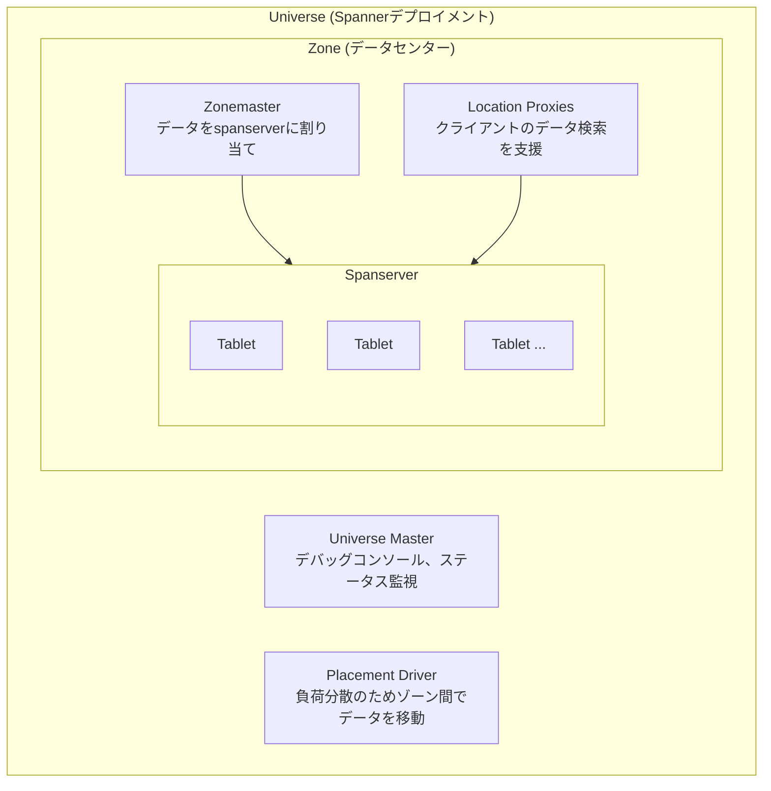
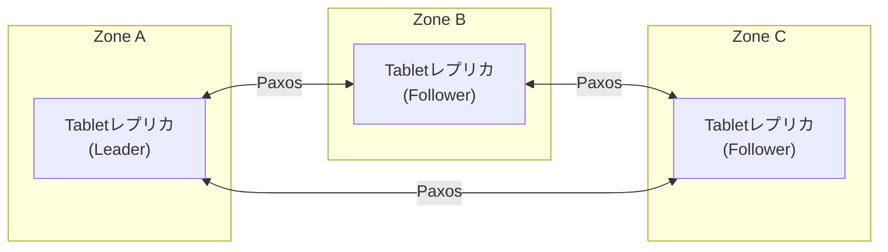
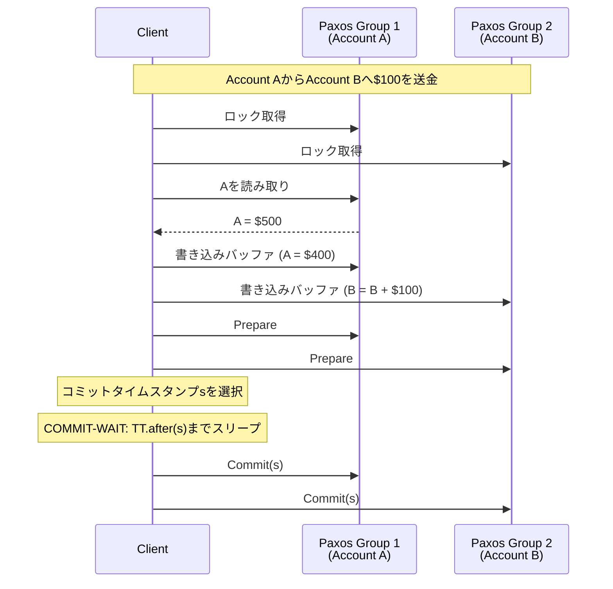

# Spanner: Google's Globally Distributed Database

> **注:** この記事は英語の原文を日本語に翻訳したものです。コードブロック、Mermaidダイアグラム、論文タイトル、システム名、技術用語は原文のまま保持しています。

## 論文概要

**著者:** James C. Corbett et al. (Google)
**発表:** OSDI 2012
**背景:** GoogleのAdWords広告バックエンド「F1」を支えるシステム

## TL;DR

Spannerは、分散トランザクションに対して**外部整合性**（最も強力な整合性保証）を提供するグローバル分散データベースです。その主要なイノベーションは**TrueTime**で、制限された不確実性を持つグローバル同期クロックAPIです。これにより、**ロックフリーの読み取り専用トランザクション**とグローバルに整合性のあるスナップショットが可能になります。Spannerは従来のデータベースのスキーマとSQLを、NoSQLシステムのスケーラビリティと組み合わせています。

---

## 課題

以前のGoogleシステムにはトレードオフがありました：
- **Bigtable**: スケーラブルだが、行間トランザクションなし
- **Megastore**: トランザクションはあるが、書き込みスループットが低い
- **MySQLシャード**: スケーラブルでもなく、グローバル分散でもない

アプリケーションが必要としていたもの：
- レイテンシと可用性のためのグローバル分散
- 正確性のための強い整合性
- 開発者の生産性のためのSQLとスキーマ
- 水平スケーラビリティ

---

## 主要イノベーション: TrueTime

```
┌─────────────────────────────────────────────────────────────────────────┐
│                    TrueTime API                                          │
│                                                                          │
│   従来のクロックは単一のタイムスタンプを返します:                       │
│   now() → 1234567890                                                    │
│                                                                          │
│   TrueTimeは制限された不確実性を持つ区間を返します:                     │
│   TT.now() → [earliest, latest]                                        │
│                                                                          │
│   ┌──────────────────────────────────────────────────────────────────┐  │
│   │   保証: 実際の時刻は [earliest, latest] の範囲内にあります       │  │
│   │                                                                   │  │
│   │   ──────────────┬──────────────────────┬────────────────────────│  │
│   │                 │      不確実性        │                        │  │
│   │             earliest                 latest                      │  │
│   │                 │◀────── ε ──────────▶│                         │  │
│   │                         │                                        │  │
│   │                    実際の時刻                                     │  │
│   │                    (この範囲内のどこか)                           │  │
│   │                                                                   │  │
│   │   一般的なε (epsilon): 1-7ms                                     │  │
│   └──────────────────────────────────────────────────────────────────┘  │
│                                                                          │
│   仕組み:                                                               │
│   - データセンター内のGPS受信機（マイクロ秒精度）                       │
│   - バックアップとしての原子時計                                        │
│   - 各データセンターのタイムマスター                                    │
│   - 各マシンのデーモンがタイムマスターにポーリング                      │
│   - 不確実性はポーリング間で増加し、同期後に縮小                       │
└─────────────────────────────────────────────────────────────────────────┘
```

### TrueTimeの実装

```python
from dataclasses import dataclass
from typing import Tuple
import time

@dataclass
class TTInterval:
    """TrueTime interval representing bounded uncertainty"""
    earliest: float  # Microseconds since epoch
    latest: float

    @property
    def uncertainty(self) -> float:
        """Uncertainty epsilon in microseconds"""
        return (self.latest - self.earliest) / 2


class TrueTime:
    """
    TrueTime API simulation.
    In real Spanner, backed by GPS/atomic clock infrastructure.
    """

    def __init__(self, max_clock_drift_us: float = 200):
        self.max_drift = max_clock_drift_us
        self.last_sync = time.time()
        self.sync_interval = 30.0  # Sync every 30 seconds

    def now(self) -> TTInterval:
        """
        Get current time as interval.
        Uncertainty grows between syncs.
        """
        current = time.time()

        # Calculate uncertainty based on time since last sync
        time_since_sync = current - self.last_sync
        uncertainty = self.max_drift * (time_since_sync / self.sync_interval)

        # Bound uncertainty
        uncertainty = min(uncertainty, 7000)  # Max 7ms

        current_us = current * 1_000_000

        return TTInterval(
            earliest=current_us - uncertainty,
            latest=current_us + uncertainty
        )

    def after(self, t: float) -> bool:
        """Returns true if t is definitely in the past"""
        return self.now().earliest > t

    def before(self, t: float) -> bool:
        """Returns true if t is definitely in the future"""
        return self.now().latest < t
```

---

## アーキテクチャ



---

## データモデル

```
┌─────────────────────────────────────────────────────────────────────────┐
│                    Spannerデータモデル                                    │
│                                                                          │
│   ディレクトリ（シャーディング単位）:                                    │
│   ┌──────────────────────────────────────────────────────────────────┐  │
│   │   ディレクトリ = 共通プレフィックスを共有する連続行のセット       │  │
│   │                                                                   │  │
│   │   テーブル: Users                                                │  │
│   │   ┌────────────────────────────────────────────────────────────┐ │  │
│   │   │ user_id  │ name      │ email              │ created_at     │ │  │
│   │   ├──────────┼───────────┼────────────────────┼────────────────┤ │  │
│   │   │ 1001     │ Alice     │ alice@example.com  │ 2024-01-01     │ │  │
│   │   │ 1002     │ Bob       │ bob@example.com    │ 2024-01-02     │ │  │
│   │   └────────────────────────────────────────────────────────────┘ │  │
│   │                                                                   │  │
│   │   テーブル: Albums（Usersにインターリーブ）                       │  │
│   │   ┌────────────────────────────────────────────────────────────┐ │  │
│   │   │ user_id  │ album_id │ title              │ created_at      │ │  │
│   │   ├──────────┼──────────┼────────────────────┼─────────────────┤ │  │
│   │   │ 1001     │ 1        │ "Vacation 2024"    │ 2024-01-15      │ │  │
│   │   │ 1001     │ 2        │ "Family"           │ 2024-02-01      │ │  │
│   │   │ 1002     │ 1        │ "Pets"             │ 2024-01-10      │ │  │
│   │   └────────────────────────────────────────────────────────────┘ │  │
│   │                                                                   │  │
│   │   インターリーブ（関連データの同一配置）:                         │  │
│   │                                                                   │  │
│   │   物理ストレージ:                                                │  │
│   │   ┌────────────────────────────────────────────────────────────┐ │  │
│   │   │ user:1001                                                  │ │  │
│   │   │ user:1001/album:1                                          │ │  │
│   │   │ user:1001/album:2                                          │ │  │
│   │   │ user:1002                                                  │ │  │
│   │   │ user:1002/album:1                                          │ │  │
│   │   └────────────────────────────────────────────────────────────┘ │  │
│   │                                                                   │  │
│   │   ディレクトリ = 同じuser_idプレフィックスを持つ全行              │  │
│   │   → 一緒に移動・レプリケーション可能                              │  │
│   └──────────────────────────────────────────────────────────────────┘  │
└─────────────────────────────────────────────────────────────────────────┘
```

---

## Paxosによるレプリケーション



> **Leaderの責務:** Paxosの調整、トランザクションへのタイムスタンプ割り当て、悲観的並行性制御のためのロックテーブルの管理。
> **Leader選出:** 10秒のリース（Paxosで更新）。新しいLeaderが就任する前にリースの期限切れを待つ必要があります。
> Tablet単位のPaxosグループ = レプリケーションの単位。通常3または5レプリカ。書き込みには過半数の合意が必要です。

---

## トランザクション

### 読み書きトランザクション



### Commit Wait

```
┌─────────────────────────────────────────────────────────────────────────┐
│                    Commit Wait: 外部整合性の鍵                           │
│                                                                          │
│   課題: 異なるマシン上の2つのトランザクション                           │
│   - T1がタイムスタンプs1でコミット                                      │
│   - T2がT1のコミット後に開始（壁時計の観点から）                        │
│   - T2はT1の効果を見なければならない（外部整合性）                      │
│                                                                          │
│   TrueTimeなしの場合:                                                   │
│   - クロックが順序について不一致になる可能性                            │
│   - T2が後で開始されたにもかかわらず、s1より小さいタイムスタンプを       │
│     取得する可能性                                                       │
│                                                                          │
│   TrueTimeとCommit Waitを使用した場合:                                  │
│   ┌──────────────────────────────────────────────────────────────────┐  │
│   │                                                                   │  │
│   │   T1はTT.now().latestでs1を選択                                  │  │
│   │   T1はTT.after(s1) = trueになるまで待機                          │  │
│   │   T1はコミットしてクライアントに通知                              │  │
│   │                                                                   │  │
│   │   ───────┬─────────────────────────┬──────────────────────────   │  │
│   │          │    commit-wait期間      │                            │  │
│   │          │                         │                             │  │
│   │          s1                    TT.after(s1)                      │  │
│   │          │                         │                             │  │
│   │          ▼                         ▼                             │  │
│   │      [s1はここかも]          [s1は確実に過去]                    │  │
│   │                                                                   │  │
│   │   T2が開始された時（T1コミット後）:                               │  │
│   │   - T1のコミットは過去のこと                                      │  │
│   │   - T2のタイムスタンプは > s1                                    │  │
│   │   - T2はT1の効果を見ることができる                                │  │
│   │                                                                   │  │
│   └──────────────────────────────────────────────────────────────────┘  │
│                                                                          │
│   Commit-wait時間 = 2ε（不確実性の2倍）                                 │
│   一般的: 2-14ms（正確性のための代償として価値がある）                   │
└─────────────────────────────────────────────────────────────────────────┘
```

### 読み取り専用トランザクション（ロックフリー）

```
┌─────────────────────────────────────────────────────────────────────────┐
│                    ロックフリー読み取り専用トランザクション               │
│                                                                          │
│   読み取り専用トランザクションにはロックが不要です！                     │
│                                                                          │
│   アルゴリズム:                                                         │
│   1. タイムスタンプ sread = TT.now().latest を割り当て                  │
│   2. 任意のレプリカからタイムスタンプsreadでデータを読み取り            │
│   3. レプリカがsreadまでのデータを持つまで待機（安全時刻）              │
│                                                                          │
│   ┌──────────────────────────────────────────────────────────────────┐  │
│   │   これが機能する理由:                                             │  │
│   │                                                                   │  │
│   │   - sread = TT.now().latest は実際の時刻 <= sread を保証         │  │
│   │   - sreadより前の全コミットが可視（commit-waitが保証）            │  │
│   │   - 将来のコミットはタイムスタンプ <= sread にならない            │  │
│   │   - したがって: sreadのスナップショットは整合性がある！           │  │
│   │                                                                   │  │
│   │   メリット:                                                      │  │
│   │   - 調整不要                                                     │  │
│   │   - 任意のレプリカから読み取り可能（ローカリティ）                │  │
│   │   - 書き込みトランザクションをブロックしない                      │  │
│   │   - リードレプリカで水平スケール可能                              │  │
│   └──────────────────────────────────────────────────────────────────┘  │
│                                                                          │
│   安全時刻:                                                             │
│   - 各レプリカが安全時刻tsafeを追跡                                    │
│   - tsafe = min(Paxos安全時刻, preparedトランザクション時刻)           │
│   - sreadでの読み取りはtsafe >= sreadまで待機                          │
│   - 通常、Paxosの追いつきのみを待機                                    │
└─────────────────────────────────────────────────────────────────────────┘
```

---

## 実装

```python
from dataclasses import dataclass, field
from typing import Dict, List, Optional, Set, Tuple
from enum import Enum
import threading
import time

class TransactionState(Enum):
    ACTIVE = "active"
    PREPARED = "prepared"
    COMMITTED = "committed"
    ABORTED = "aborted"

@dataclass
class Lock:
    key: str
    mode: str  # "shared" or "exclusive"
    holder: str  # Transaction ID

@dataclass
class Transaction:
    txn_id: str
    state: TransactionState
    start_time: float
    commit_time: Optional[float] = None
    read_set: Set[str] = field(default_factory=set)
    write_buffer: Dict[str, bytes] = field(default_factory=dict)
    participants: Set[str] = field(default_factory=set)  # Paxos group IDs


class SpannerCoordinator:
    """
    Transaction coordinator for Spanner.
    Handles 2PC with Paxos participants.
    """

    def __init__(self, true_time: TrueTime):
        self.tt = true_time
        self.transactions: Dict[str, Transaction] = {}
        self.lock_table: Dict[str, Lock] = {}
        self.lock = threading.Lock()

    def begin_transaction(self, txn_id: str) -> Transaction:
        """Start a new read-write transaction"""
        txn = Transaction(
            txn_id=txn_id,
            state=TransactionState.ACTIVE,
            start_time=self.tt.now().latest
        )
        self.transactions[txn_id] = txn
        return txn

    def acquire_lock(
        self,
        txn_id: str,
        key: str,
        mode: str
    ) -> bool:
        """Acquire lock using two-phase locking"""
        with self.lock:
            existing = self.lock_table.get(key)

            if existing is None:
                # No lock held
                self.lock_table[key] = Lock(key=key, mode=mode, holder=txn_id)
                return True

            if existing.holder == txn_id:
                # Already hold lock, maybe upgrade
                if mode == "exclusive" and existing.mode == "shared":
                    existing.mode = "exclusive"
                return True

            if mode == "shared" and existing.mode == "shared":
                # Shared locks compatible
                return True

            # Conflict - would need to wait or abort
            return False

    def read(
        self,
        txn_id: str,
        key: str,
        paxos_group: 'PaxosGroup'
    ) -> Optional[bytes]:
        """Read a key within transaction"""
        txn = self.transactions[txn_id]

        # Check write buffer first
        if key in txn.write_buffer:
            return txn.write_buffer[key]

        # Acquire shared lock
        if not self.acquire_lock(txn_id, key, "shared"):
            raise LockConflictError(f"Cannot acquire lock on {key}")

        txn.read_set.add(key)
        txn.participants.add(paxos_group.group_id)

        # Read from Paxos group
        return paxos_group.read(key)

    def write(
        self,
        txn_id: str,
        key: str,
        value: bytes,
        paxos_group: 'PaxosGroup'
    ):
        """Buffer a write within transaction"""
        txn = self.transactions[txn_id]

        # Acquire exclusive lock
        if not self.acquire_lock(txn_id, key, "exclusive"):
            raise LockConflictError(f"Cannot acquire lock on {key}")

        txn.write_buffer[key] = value
        txn.participants.add(paxos_group.group_id)

    def commit(self, txn_id: str, paxos_groups: Dict[str, 'PaxosGroup']) -> float:
        """
        Commit transaction using 2PC over Paxos groups.
        Returns commit timestamp.
        """
        txn = self.transactions[txn_id]

        # Phase 1: Prepare all participants
        prepare_timestamps = []

        for group_id in txn.participants:
            group = paxos_groups[group_id]

            # Get writes for this group
            group_writes = {
                k: v for k, v in txn.write_buffer.items()
                if self._key_belongs_to_group(k, group_id)
            }

            # Prepare returns prepare timestamp
            prepare_ts = group.prepare(txn_id, group_writes)
            prepare_timestamps.append(prepare_ts)

        # Choose commit timestamp: max of all prepare timestamps
        # and at least TT.now().latest
        commit_ts = max(
            max(prepare_timestamps) if prepare_timestamps else 0,
            self.tt.now().latest
        )

        txn.commit_time = commit_ts
        txn.state = TransactionState.PREPARED

        # COMMIT-WAIT: Wait until commit timestamp is definitely in the past
        self._commit_wait(commit_ts)

        # Phase 2: Commit all participants
        for group_id in txn.participants:
            group = paxos_groups[group_id]
            group.commit(txn_id, commit_ts)

        txn.state = TransactionState.COMMITTED

        # Release locks
        self._release_locks(txn_id)

        return commit_ts

    def _commit_wait(self, commit_ts: float):
        """Wait until commit timestamp is definitely in the past"""
        while not self.tt.after(commit_ts):
            time.sleep(0.001)  # 1ms sleep

    def _release_locks(self, txn_id: str):
        """Release all locks held by transaction"""
        with self.lock:
            keys_to_release = [
                k for k, lock in self.lock_table.items()
                if lock.holder == txn_id
            ]
            for key in keys_to_release:
                del self.lock_table[key]


class ReadOnlyTransaction:
    """
    Lock-free read-only transaction.
    Uses snapshot isolation with TrueTime.
    """

    def __init__(self, true_time: TrueTime):
        self.tt = true_time
        self.read_timestamp = self.tt.now().latest

    def read(
        self,
        key: str,
        paxos_group: 'PaxosGroup'
    ) -> Optional[bytes]:
        """
        Read at snapshot timestamp.
        No locks needed - reads are consistent.
        """
        # Wait for safe time
        paxos_group.wait_for_safe_time(self.read_timestamp)

        # Read at snapshot
        return paxos_group.read_at(key, self.read_timestamp)


class PaxosGroup:
    """
    A Paxos replication group managing a set of tablets.
    """

    def __init__(self, group_id: str, replicas: List[str]):
        self.group_id = group_id
        self.replicas = replicas
        self.leader: Optional[str] = None
        self.data: Dict[str, List[Tuple[float, bytes]]] = {}  # key -> [(ts, value)]
        self.safe_time = 0.0
        self.prepared_txns: Dict[str, Tuple[float, Dict]] = {}  # txn_id -> (ts, writes)

    def prepare(self, txn_id: str, writes: Dict[str, bytes]) -> float:
        """
        Prepare phase of 2PC.
        Returns prepare timestamp.
        """
        prepare_ts = time.time() * 1_000_000

        # Log prepare to Paxos
        self._paxos_log({
            "type": "prepare",
            "txn_id": txn_id,
            "timestamp": prepare_ts,
            "writes": writes
        })

        self.prepared_txns[txn_id] = (prepare_ts, writes)

        return prepare_ts

    def commit(self, txn_id: str, commit_ts: float):
        """
        Commit phase of 2PC.
        Applies writes at commit timestamp.
        """
        _, writes = self.prepared_txns.pop(txn_id)

        # Log commit to Paxos
        self._paxos_log({
            "type": "commit",
            "txn_id": txn_id,
            "timestamp": commit_ts
        })

        # Apply writes
        for key, value in writes.items():
            if key not in self.data:
                self.data[key] = []
            self.data[key].append((commit_ts, value))
            # Keep sorted by timestamp
            self.data[key].sort(key=lambda x: x[0])

        # Advance safe time
        self._update_safe_time()

    def read_at(self, key: str, timestamp: float) -> Optional[bytes]:
        """Read value at specific timestamp (snapshot read)"""
        if key not in self.data:
            return None

        # Find latest version <= timestamp
        for ts, value in reversed(self.data[key]):
            if ts <= timestamp:
                return value

        return None

    def wait_for_safe_time(self, timestamp: float):
        """Wait until safe time >= timestamp"""
        while self.safe_time < timestamp:
            time.sleep(0.001)

    def _update_safe_time(self):
        """
        Update safe time.
        Safe time = min of Paxos safe time and minimum prepared timestamp.
        """
        paxos_safe = self._get_paxos_safe_time()

        if self.prepared_txns:
            min_prepared = min(ts for ts, _ in self.prepared_txns.values())
            self.safe_time = min(paxos_safe, min_prepared)
        else:
            self.safe_time = paxos_safe

    def _get_paxos_safe_time(self) -> float:
        """Get safe time from Paxos (simplified)"""
        # In real implementation, this comes from Paxos replication lag
        return time.time() * 1_000_000 - 1000  # 1ms behind

    def _paxos_log(self, entry: dict):
        """Log entry through Paxos consensus (simplified)"""
        # In real implementation, this would replicate to Paxos followers
        pass
```

---

## スキーマ変更

```
┌─────────────────────────────────────────────────────────────────────────┐
│                    無停止スキーマ変更                                     │
│                                                                          │
│   従来のアプローチ: DDLのためにテーブルをオフラインにする                │
│   Spannerのアプローチ: マルチフェーズ、分散、無ブロッキング             │
│                                                                          │
│   ┌──────────────────────────────────────────────────────────────────┐  │
│   │   例: デフォルト値を持つカラムの追加                              │  │
│   │                                                                   │  │
│   │   Phase 1: 準備                                                  │  │
│   │   - スキーマ変更がタイムスタンプt1で登録                         │  │
│   │   - すべてのサーバーに通知                                       │  │
│   │                                                                   │  │
│   │   Phase 2: 移行（t1時点）                                        │  │
│   │   - 新しい書き込みに新カラムを含める                             │  │
│   │   - 読み取り時に欠損値にはデフォルトを返す                       │  │
│   │                                                                   │  │
│   │   Phase 3: バックフィル（バックグラウンドで）                     │  │
│   │   - 既存の行をデフォルト値で更新                                 │  │
│   │   - 内部トランザクションを使用                                   │  │
│   │                                                                   │  │
│   │   Phase 4: 完了                                                  │  │
│   │   - スキーマ変更が完全にアクティブ                               │  │
│   │   - 古いスキーマは無効                                           │  │
│   │                                                                   │  │
│   └──────────────────────────────────────────────────────────────────┘  │
│                                                                          │
│   変更中のダウンタイムなし、読み書きのロックなし！                       │
└─────────────────────────────────────────────────────────────────────────┘
```

---

## パフォーマンス結果

### レイテンシ（論文より）

| 操作 | 平均 | 99パーセンタイル |
|------|------|-----------------|
| 読み取り専用トランザクション（1回の読み取り） | 8.7ms | 31.5ms |
| 読み取り専用トランザクション（DC間） | 14.4ms | 52.4ms |
| 読み書きトランザクション（1回の書き込み） | 17.0ms | 75.0ms |
| Commit-waitの寄与 | ~2-4ms | ~8ms |

### スケーラビリティ

- Paxosグループによる線形書き込みスケーリング
- レプリカによる線形読み取りスケーリング
- F1（AdWords）: 2+ PB、数百万QPS

---

## 影響とレガシー

### 直接的な影響
- **CockroachDB** - オープンソースのSpannerライクなデータベース
- **TiDB** - 類似設計の分散SQL
- **YugabyteDB** - Spannerにインスパイアされた分散SQL
- **Cloud Spanner** - Googleのマネージドサービス

### 採用された主要イノベーション
- 順序付けのためのTrueTime/HLC
- ロックフリーの読み取り専用トランザクション
- ローカリティのためのインターリーブテーブル
- 無停止スキーマ変更

---

## 重要なポイント

1. **TrueTimeが外部整合性を実現** - 制限されたクロック不確実性 + commit-waitがグローバルな順序付けを保証します。

2. **ロックフリーの読み取りは無限にスケール** - 読み取り専用トランザクションは調整不要で、任意のレプリカから読み取ります。

3. **Commit-waitは正確性の代償** - 数ミリ秒のレイテンシで整合性を保証します。

4. **インターリーブが関連データを同一配置** - 一般的なアクセスパターンの分散トランザクションを削減します。

5. **シャード単位のPaxos、シャード間の2PC** - レプリケーションとトランザクションは異なるレベルで処理されます。

6. **ダウンタイムなしのスキーマ変更** - マルチフェーズアプローチでデータベースの可用性を維持します。

7. **GPS + 原子時計が重要** - インフラへの投資がよりシンプルなアルゴリズムを可能にします。

8. **強い整合性はグローバルに達成可能** - 必要がなければ結果整合性で妥協しないでください。
