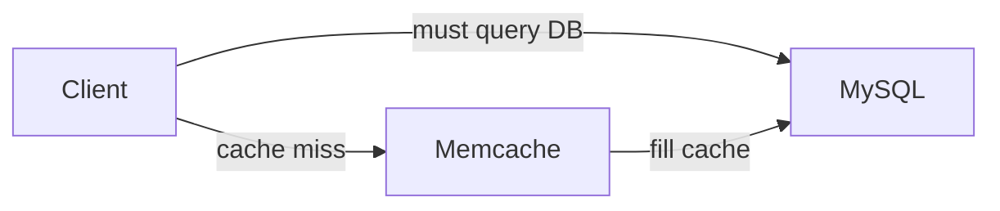
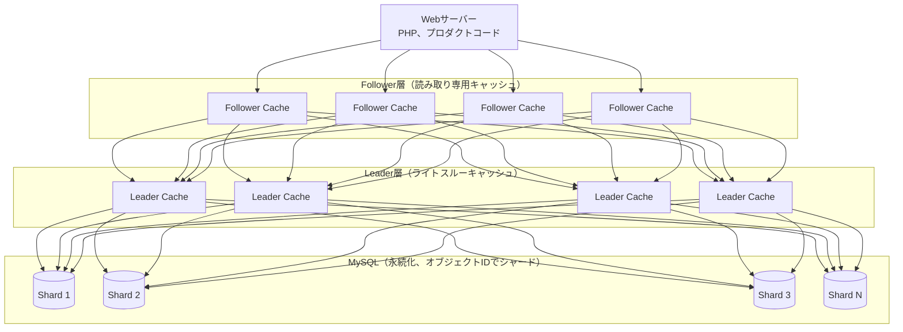
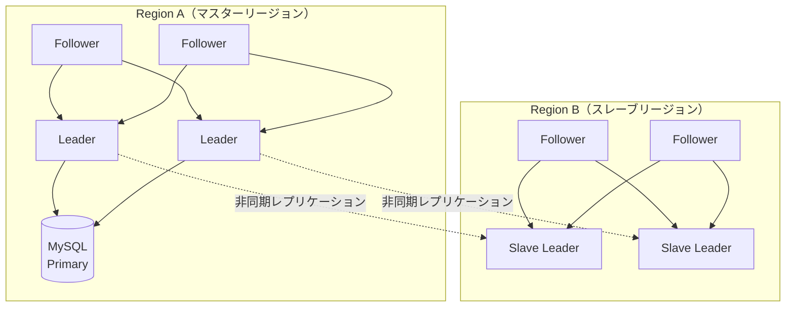

# TAO: Facebook's Distributed Data Store for the Social Graph

> **注:** この記事は英語の原文を日本語に翻訳したものです。コードブロック、Mermaidダイアグラム、論文タイトル、システム名、技術用語は原文のまま保持しています。

## 論文概要

- **タイトル**: TAO: Facebook's Distributed Data Store for the Social Graph
- **著者**: Nathan Bronson, Zach Amsden, George Cabrera, et al.
- **発表**: USENIX ATC 2013
- **背景**: Facebookはソーシャルグラフデータの効率的な読み取り重視のストレージを必要としていました

## TL;DR

TAOは地理的に分散された読み取り最適化データストアで、以下を提供します：
- オブジェクトとアソシエーションのための**グラフネイティブAPI**
- 効率性のための**リードスルー/ライトスルーキャッシング**
- オブジェクト単位の整合性を持つ**結果整合性**
- 最小レイテンシで**毎秒数十億の読み取り**を処理

## 課題

### 既存ソリューションの課題

```
┌─────────────────────────────────────────────────────────────────┐
│                     Facebookの要件                                │
├─────────────────────────────────────────────────────────────────┤
│                                                                  │
│  1. 読み取り優位のワークロード                                   │
│     - 99.8%が読み取り、0.2%が書き込み                            │
│     - Memcachedだけではグラフクエリを処理できない                 │
│                                                                  │
│  2. グラフデータモデル                                           │
│     - オブジェクト: ユーザー、投稿、写真など                     │
│     - アソシエーション: 友人関係、いいね、コメント                │
│                                                                  │
│  3. グローバルスケール                                           │
│     - 数十億のユーザー                                           │
│     - 数千億のオブジェクト/アソシエーション                       │
│     - 世界中の複数のデータセンター                               │
│                                                                  │
│  4. 整合性の要件                                                 │
│     - ユーザーは自身の書き込みを即座に確認すべき                 │
│     - 他のユーザーには結果整合性で十分                            │
│                                                                  │
└─────────────────────────────────────────────────────────────────┘
```

### なぜMemcached + MySQLだけではだめなのか？



> **Lookaside Cacheの問題点:**
> 1. クライアントがキャッシュミスを処理する必要がある
> 2. 人気アイテムでのThundering Herd問題
> 3. グラフ対応の操作がない
> 4. 書き込み後のデータ陳腐化

## TAOデータモデル

### オブジェクトとアソシエーション

```
┌─────────────────────────────────────────────────────────────────┐
│                        TAOデータモデル                            │
├─────────────────────────────────────────────────────────────────┤
│                                                                  │
│  オブジェクト（ノード）                                          │
│  ┌──────────────────────────────────────────────┐               │
│  │  (id) ─────> (otype, data)                   │               │
│  │                                               │               │
│  │  例:                                          │               │
│  │  id: 12345                                    │               │
│  │  otype: USER                                  │               │
│  │  data: {name: "Alice", ...}                  │               │
│  └──────────────────────────────────────────────┘               │
│                                                                  │
│  アソシエーション（エッジ）                                      │
│  ┌──────────────────────────────────────────────┐               │
│  │  (id1, atype, id2) ─────> (time, data)       │               │
│  │                                               │               │
│  │  例:                                          │               │
│  │  id1: 12345 (Alice)                          │               │
│  │  atype: FRIEND                                │               │
│  │  id2: 67890 (Bob)                            │               │
│  │  time: 1609459200                             │               │
│  │  data: {}                                     │               │
│  └──────────────────────────────────────────────┘               │
│                                                                  │
│  アソシエーションリスト（時間降順でソート）                       │
│  ┌──────────────────────────────────────────────┐               │
│  │  (id1, atype) ─────> [(id2, time, data), ...]│               │
│  │                                               │               │
│  │  例: Aliceの友達                              │               │
│  │  (12345, FRIEND) -> [(67890, t1), (11111, t2)]│               │
│  └──────────────────────────────────────────────┘               │
│                                                                  │
└─────────────────────────────────────────────────────────────────┘
```

### TAO API

```python
class TaoAPI:
    """TAO's graph-native API."""

    # Object operations
    def object_get(self, id: int) -> dict:
        """Get object by ID."""
        pass

    def object_create(self, otype: str, data: dict) -> int:
        """Create new object, return ID."""
        pass

    def object_update(self, id: int, data: dict) -> bool:
        """Update object data."""
        pass

    def object_delete(self, id: int) -> bool:
        """Delete object."""
        pass

    # Association operations
    def assoc_add(self, id1: int, atype: str, id2: int,
                  time: int, data: dict) -> bool:
        """Add association between objects."""
        pass

    def assoc_delete(self, id1: int, atype: str, id2: int) -> bool:
        """Delete association."""
        pass

    def assoc_get(self, id1: int, atype: str,
                  id2_set: set) -> list:
        """Get specific associations."""
        pass

    def assoc_count(self, id1: int, atype: str) -> int:
        """Count associations of type."""
        pass

    def assoc_range(self, id1: int, atype: str,
                    offset: int, limit: int) -> list:
        """Get range of associations (time-ordered)."""
        pass

    def assoc_time_range(self, id1: int, atype: str,
                         high: int, low: int, limit: int) -> list:
        """Get associations in time range."""
        pass
```

## アーキテクチャ

### 2階層キャッシング



### 読み取りパス

```python
class TaoCache:
    """TAO caching layer implementation."""

    def __init__(self, is_leader: bool):
        self.cache = {}  # In-memory cache
        self.is_leader = is_leader
        self.leader = None  # Reference to leader (if follower)
        self.storage = None  # MySQL connection (if leader)
        self.followers = []  # List of followers (if leader)

    def get_object(self, id: int) -> dict:
        """Read-through cache for objects."""
        # Check local cache first
        cache_key = f"obj:{id}"
        if cache_key in self.cache:
            return self.cache[cache_key]

        if self.is_leader:
            # Leader: fetch from MySQL
            result = self.storage.query_object(id)
            if result:
                self.cache[cache_key] = result
            return result
        else:
            # Follower: ask leader
            result = self.leader.get_object(id)
            if result:
                self.cache[cache_key] = result
            return result

    def get_assoc_range(self, id1: int, atype: str,
                        offset: int, limit: int) -> list:
        """Get association list with range query."""
        cache_key = f"assoc:{id1}:{atype}"

        if cache_key in self.cache:
            assoc_list = self.cache[cache_key]
            return assoc_list[offset:offset + limit]

        if self.is_leader:
            # Fetch full association list from MySQL
            assoc_list = self.storage.query_assoc_list(id1, atype)
            self.cache[cache_key] = assoc_list
            return assoc_list[offset:offset + limit]
        else:
            # Ask leader
            assoc_list = self.leader.get_assoc_range(
                id1, atype, 0, float('inf')
            )
            self.cache[cache_key] = assoc_list
            return assoc_list[offset:offset + limit]
```

### 書き込みパス

```python
class TaoLeader(TaoCache):
    """TAO leader with write-through caching."""

    def __init__(self):
        super().__init__(is_leader=True)
        self.version_counter = 0

    def write_object(self, id: int, data: dict) -> bool:
        """Write-through for object updates."""
        # 1. Write to MySQL first (synchronous)
        success = self.storage.update_object(id, data)
        if not success:
            return False

        # 2. Update local cache
        cache_key = f"obj:{id}"
        self.cache[cache_key] = data
        self.version_counter += 1

        # 3. Invalidate follower caches (async)
        self._send_invalidation(cache_key)

        return True

    def add_association(self, id1: int, atype: str,
                        id2: int, time: int, data: dict) -> bool:
        """Write-through for association adds."""
        # 1. Write to MySQL
        success = self.storage.insert_assoc(id1, atype, id2, time, data)
        if not success:
            return False

        # 2. Update local association list cache
        cache_key = f"assoc:{id1}:{atype}"
        if cache_key in self.cache:
            # Insert in sorted order by time (descending)
            assoc_list = self.cache[cache_key]
            new_entry = (id2, time, data)
            self._insert_sorted(assoc_list, new_entry)

        # 3. Update association count
        count_key = f"count:{id1}:{atype}"
        if count_key in self.cache:
            self.cache[count_key] += 1

        # 4. Invalidate followers
        self._send_invalidation(cache_key)
        self._send_invalidation(count_key)

        return True

    def _send_invalidation(self, cache_key: str):
        """Send async invalidation to all followers."""
        for follower in self.followers:
            # Async message
            follower.invalidate(cache_key)

    def _insert_sorted(self, assoc_list: list, entry: tuple):
        """Insert entry in time-sorted order."""
        time = entry[1]
        for i, existing in enumerate(assoc_list):
            if time > existing[1]:
                assoc_list.insert(i, entry)
                return
        assoc_list.append(entry)
```

## マルチリージョンアーキテクチャ

### 地理的分散



> **書き込み:** 常にマスターリージョンのLeaderに送信されます。
> **読み取り:** ローカルのFollower/Slave Leaderから提供されます。

### Read-After-Write整合性

```python
class TaoClient:
    """Client-side TAO operations with read-after-write consistency."""

    def __init__(self, local_cache: TaoCache, master_leader: TaoLeader):
        self.local_cache = local_cache
        self.master_leader = master_leader
        self.recent_writes = {}  # Key -> (value, timestamp)
        self.write_window = 20  # seconds

    def write_object(self, id: int, data: dict) -> bool:
        """Write always goes to master leader."""
        success = self.master_leader.write_object(id, data)
        if success:
            # Track recent write for read-after-write consistency
            cache_key = f"obj:{id}"
            self.recent_writes[cache_key] = (data, time.time())
        return success

    def read_object(self, id: int) -> dict:
        """Read from local cache with write-tracking."""
        cache_key = f"obj:{id}"

        # Check if we recently wrote this object
        if cache_key in self.recent_writes:
            data, write_time = self.recent_writes[cache_key]
            if time.time() - write_time < self.write_window:
                # Return our recent write, not possibly stale cache
                return data
            else:
                # Write is old enough, cache should be consistent
                del self.recent_writes[cache_key]

        # Read from local cache
        return self.local_cache.get_object(id)

    def _cleanup_old_writes(self):
        """Periodically clean up old write tracking."""
        now = time.time()
        expired = [
            key for key, (_, ts) in self.recent_writes.items()
            if now - ts > self.write_window
        ]
        for key in expired:
            del self.recent_writes[key]
```

## 整合性モデル

### オブジェクト単位の整合性

```
┌─────────────────────────────────────────────────────────────────┐
│                   TAO整合性モデル                                 │
├─────────────────────────────────────────────────────────────────┤
│                                                                  │
│  保証:                                                          │
│                                                                  │
│  1. Read-after-write（同一クライアント）                         │
│     - クライアントは自身の書き込みを即座に確認                   │
│     - クライアント側の書き込み追跡で実現                         │
│                                                                  │
│  2. 結果整合性（クライアント間）                                 │
│     - 他のクライアントは最終的に更新を確認                       │
│     - 通常、数秒以内                                             │
│                                                                  │
│  3. オブジェクト単位のシリアライゼーション                        │
│     - オブジェクトへの全書き込みは1つのLeaderを経由               │
│     - 書き込み競合を防止                                         │
│                                                                  │
│  保証されないもの:                                               │
│                                                                  │
│  1. オブジェクト間の整合性                                       │
│     - 複数オブジェクトにまたがるトランザクションなし             │
│     - アプリケーションが部分更新を処理する必要がある             │
│                                                                  │
│  2. オブジェクト間の順序付け                                     │
│     - 異なるオブジェクトへの更新が順序通りに到着しない場合がある │
│                                                                  │
└─────────────────────────────────────────────────────────────────┘
```

### 逆方向アソシエーションの処理

```python
class TaoInverseAssociations:
    """Handle bidirectional associations in TAO."""

    def add_bidirectional_assoc(self, id1: int, id2: int,
                                 atype: str, inverse_atype: str,
                                 time: int, data: dict) -> bool:
        """
        Add association in both directions.

        Example: FRIEND relationship
        - Alice (id1) FRIEND Bob (id2)
        - Bob (id2) FRIEND Alice (id1)
        """
        # Get leaders for both objects
        leader1 = self.get_leader_for_object(id1)
        leader2 = self.get_leader_for_object(id2)

        # Add forward association
        success1 = leader1.add_association(
            id1, atype, id2, time, data
        )

        # Add inverse association
        success2 = leader2.add_association(
            id2, inverse_atype, id1, time, data
        )

        # Note: These are NOT atomic!
        # If one fails, we have inconsistency
        # TAO accepts this trade-off for performance

        if not success1 or not success2:
            # Log for async repair
            self.log_partial_failure(id1, id2, atype)

        return success1 and success2

    def repair_inverse_inconsistency(self, id1: int, id2: int,
                                      atype: str):
        """Background job to repair inverse association mismatches."""
        # Check both directions
        forward = self.assoc_get(id1, atype, {id2})
        inverse = self.assoc_get(id2, self.get_inverse(atype), {id1})

        if forward and not inverse:
            # Add missing inverse
            self.add_association(id2, self.get_inverse(atype), id1,
                               forward[0]['time'], forward[0]['data'])
        elif inverse and not forward:
            # Add missing forward
            self.add_association(id1, atype, id2,
                               inverse[0]['time'], inverse[0]['data'])
```

## パフォーマンス最適化

### キャッシュ効率

```python
class TaoOptimizations:
    """Performance optimizations in TAO."""

    def __init__(self):
        self.cache = {}
        self.hot_objects = LRUCache(max_size=10_000_000)
        self.assoc_count_cache = {}

    def cache_association_list(self, id1: int, atype: str,
                               assoc_list: list):
        """
        Cache full association list.

        Key insight: Cache entire lists, not individual edges.
        This enables efficient range queries.
        """
        cache_key = f"assoc:{id1}:{atype}"
        self.cache[cache_key] = assoc_list

        # Also cache count
        count_key = f"count:{id1}:{atype}"
        self.assoc_count_cache[count_key] = len(assoc_list)

    def handle_high_degree_nodes(self, id1: int, atype: str) -> list:
        """
        Handle nodes with millions of edges (celebrities).

        Strategy: Only cache recent subset.
        """
        cache_key = f"assoc:{id1}:{atype}"

        # Check if this is a high-degree node
        count = self.get_assoc_count(id1, atype)

        if count > 10000:
            # Only cache most recent 10K associations
            # Older ones require DB lookup
            return self.storage.query_assoc_range(
                id1, atype, offset=0, limit=10000
            )
        else:
            # Cache entire list
            return self.storage.query_assoc_list(id1, atype)

    def batch_get_objects(self, ids: list) -> dict:
        """
        Batch fetch multiple objects.

        Reduces round trips for common access patterns.
        """
        results = {}
        missing = []

        # Check cache first
        for id in ids:
            cache_key = f"obj:{id}"
            if cache_key in self.cache:
                results[id] = self.cache[cache_key]
            else:
                missing.append(id)

        # Batch fetch missing from storage
        if missing:
            fetched = self.storage.batch_query_objects(missing)
            for id, data in fetched.items():
                results[id] = data
                self.cache[f"obj:{id}"] = data

        return results
```

### Thundering Herd防止

```python
class ThunderingHerdProtection:
    """Prevent cache stampedes on popular items."""

    def __init__(self):
        self.cache = {}
        self.pending_fetches = {}  # Key -> Future
        self.locks = defaultdict(threading.Lock)

    def get_with_protection(self, key: str,
                            fetch_func: callable) -> any:
        """
        Single-flight pattern for cache misses.

        Only one request fetches from DB; others wait.
        """
        # Fast path: cache hit
        if key in self.cache:
            return self.cache[key]

        with self.locks[key]:
            # Double-check after acquiring lock
            if key in self.cache:
                return self.cache[key]

            # Check if another request is already fetching
            if key in self.pending_fetches:
                future = self.pending_fetches[key]
            else:
                # We're the first - start the fetch
                future = Future()
                self.pending_fetches[key] = future

                try:
                    result = fetch_func()
                    self.cache[key] = result
                    future.set_result(result)
                except Exception as e:
                    future.set_exception(e)
                finally:
                    del self.pending_fetches[key]

        # Wait for result (either we fetched or someone else did)
        return future.result()
```

## 障害処理

### キャッシュ障害

```
┌─────────────────────────────────────────────────────────────────┐
│                   TAO障害シナリオ                                 │
├─────────────────────────────────────────────────────────────────┤
│                                                                  │
│  シナリオ1: Follower障害                                         │
│  ┌──────────────────────────────────────────────┐               │
│  │  Followers    ┌───┐ ┌─X─┐ ┌───┐              │               │
│  │               │ F │ │ F │ │ F │              │               │
│  │               └─┬─┘ └───┘ └─┬─┘              │               │
│  │                 │     │     │                │               │
│  │  影響: トラフィックが他のFollowerにリダイレクト│               │
│  │  復旧: 再起動、コールドキャッシュの再充填     │               │
│  └──────────────────────────────────────────────┘               │
│                                                                  │
│  シナリオ2: Leader障害                                           │
│  ┌──────────────────────────────────────────────┐               │
│  │  Leaders      ┌───┐ ┌─X─┐ ┌───┐              │               │
│  │               │ L │ │ L │ │ L │              │               │
│  │               └─┬─┘ └───┘ └─┬─┘              │               │
│  │                 │     │     │                │               │
│  │  影響: 書き込み失敗、古いキャッシュから読み取り│               │
│  │  復旧: バックアップLeaderへのフェイルオーバー │               │
│  └──────────────────────────────────────────────┘               │
│                                                                  │
│  シナリオ3: MySQLシャード障害                                    │
│  ┌──────────────────────────────────────────────┐               │
│  │  MySQL       ┌───┐ ┌─X─┐ ┌───┐               │               │
│  │              │ S │ │ S │ │ S │               │               │
│  │              └───┘ └───┘ └───┘               │               │
│  │                                               │               │
│  │  影響: 影響を受けたオブジェクトが利用不可     │               │
│  │  軽減策: 古いキャッシュデータを提供           │               │
│  └──────────────────────────────────────────────┘               │
│                                                                  │
└─────────────────────────────────────────────────────────────────┘
```

### グレースフルデグラデーション

```python
class TaoResilience:
    """Graceful degradation strategies."""

    def __init__(self):
        self.cache = {}
        self.stale_on_error = True
        self.max_stale_time = 3600  # 1 hour

    def get_with_fallback(self, key: str) -> tuple:
        """
        Return cached data even if stale during outages.

        Returns: (data, is_stale)
        """
        cached = self.cache.get(key)

        try:
            # Try to get fresh data
            fresh_data = self.fetch_from_leader(key)
            self.cache[key] = {
                'data': fresh_data,
                'timestamp': time.time()
            }
            return (fresh_data, False)

        except LeaderUnavailable:
            if cached:
                # Return stale data
                age = time.time() - cached['timestamp']
                if age < self.max_stale_time:
                    return (cached['data'], True)

            # No cached data or too stale
            raise

    def mark_data_stale(self, key: str):
        """Mark cached data as stale after invalidation failure."""
        if key in self.cache:
            self.cache[key]['stale'] = True
            # Don't delete - better to serve stale than nothing
```

## 主要な結果

### 本番パフォーマンス

```
┌─────────────────────────────────────────────────────────────────┐
│                     TAOパフォーマンス                              │
├─────────────────────────────────────────────────────────────────┤
│                                                                  │
│  スループット:                                                   │
│  ┌─────────────────────────────────────────────┐                │
│  │  毎秒数十億の読み取り                       │                │
│  │  毎秒数百万の書き込み                       │                │
│  └─────────────────────────────────────────────┘                │
│                                                                  │
│  レイテンシ:                                                     │
│  ┌─────────────────────────────────────────────┐                │
│  │  読み取り（キャッシュヒット）:  < 1ms       │                │
│  │  読み取り（キャッシュミス）:    ~10ms       │                │
│  │  書き込み:                      ~10-50ms    │                │
│  └─────────────────────────────────────────────┘                │
│                                                                  │
│  キャッシュヒット率:                                             │
│  ┌─────────────────────────────────────────────┐                │
│  │  オブジェクト:      ~96%ヒット率            │                │
│  │  アソシエーション:  ~92%ヒット率            │                │
│  │  カウント:          ~98%ヒット率            │                │
│  └─────────────────────────────────────────────┘                │
│                                                                  │
│  スケール:                                                       │
│  ┌─────────────────────────────────────────────┐                │
│  │  数千億のオブジェクト                       │                │
│  │  数兆のアソシエーション                     │                │
│  │  数千のキャッシュサーバー                   │                │
│  └─────────────────────────────────────────────┘                │
│                                                                  │
└─────────────────────────────────────────────────────────────────┘
```

## 影響とレガシー

### 業界への影響

1. **グラフネイティブAPI**: 他のソーシャルグラフストアに影響を与えました
2. **リードスルーキャッシング**: 広く採用されたパターンです
3. **2階層キャッシング**: スケールのためのLeader/Followerモデルです
4. **結果整合性**: ソーシャルデータには許容可能です

### TAO vs. 代替手段

```
┌──────────────────────────────────────────────────────────────┐
│                    TAO vs. 代替手段                            │
├──────────────────────────────────────────────────────────────┤
│                                                               │
│  TAO vs. Memcached + MySQL:                                  │
│  - グラフ対応API（キーバリューではない）                      │
│  - 管理されたキャッシュ整合性                                 │
│  - Thundering Herd保護が組み込み                              │
│                                                               │
│  TAO vs. グラフデータベース（Neo4jなど）:                     │
│  - よりシンプルなモデル（オブジェクト + エッジのみ）          │
│  - 極端な読み取り最適化                                       │
│  - 複雑なトラバーサルなし（アプリケーション側で実行）         │
│                                                               │
│  TAO vs. 分散KVストア:                                       │
│  - アソシエーションリストがファーストクラスの市民              │
│  - 時間順のエッジストレージ                                   │
│  - カウントキャッシング                                       │
│                                                               │
└──────────────────────────────────────────────────────────────┘
```

## 重要なポイント

1. **読み取り最適化が重要**: 99.8%の読み取りが複雑なキャッシングを正当化します
2. **ドメイン固有API**: グラフ操作 > 汎用キーバリュー
3. **2階層キャッシング**: Followerは読み取り用、Leaderは整合性用
4. **結果整合性を受け入れる**: ソーシャルデータには正しいトレードオフです
5. **Thundering Herdを防ぐ**: Facebookのスケールでは不可欠です
6. **オブジェクト単位の整合性**: 分散トランザクションよりシンプルです
7. **何も返さないより古いデータを返す**: グレースフルデグラデーションは極めて重要です
