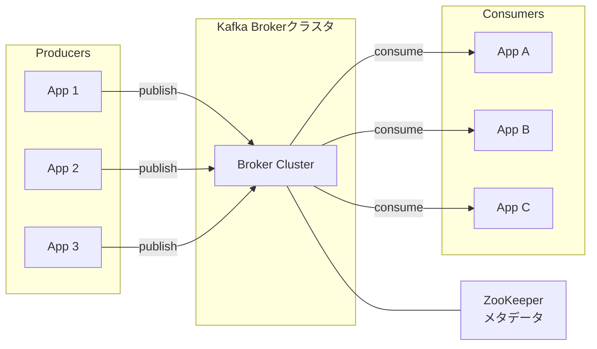

# Kafka: A Distributed Messaging System for Log Processing

> **注:** この記事は英語の原文を日本語に翻訳したものです。コードブロック、Mermaidダイアグラム、論文タイトル、システム名、技術用語は原文のまま保持しています。

## 論文概要

- **タイトル**: Kafka: a Distributed Messaging System for Log Processing
- **著者**: Jay Kreps, Neha Narkhede, Jun Rao (LinkedIn)
- **発表**: NetDB Workshop 2011
- **背景**: LinkedInは高スループット・低レイテンシのログ処理を必要としていました

## TL;DR

Kafkaは分散コミットログで、以下を提供します：
- シーケンシャルディスクI/Oとバッチングによる**高スループット**
- パーティション化されたトピックによる**スケーラビリティ**
- レプリケーションによる**耐久性**
- オフセットベースの追跡による**シンプルなコンシューマモデル**

## 課題

### ログ処理の課題

```
┌─────────────────────────────────────────────────────────────────┐
│                   LinkedInの要件                                  │
├─────────────────────────────────────────────────────────────────┤
│                                                                  │
│  アクティビティデータ:                                           │
│  ┌─────────────────────────────────────────────┐                │
│  │  - ページビュー: 1日あたり数十億             │                │
│  │  - ユーザーアクション: クリック、検索など     │                │
│  │  - システムメトリクス: CPU、メモリ、レイテンシ│                │
│  └─────────────────────────────────────────────┘                │
│                                                                  │
│  ユースケース:                                                   │
│  ┌─────────────────────────────────────────────┐                │
│  │  - リアルタイム分析ダッシュボード           │                │
│  │  - オフラインバッチ処理（Hadoop）            │                │
│  │  - 検索インデックス作成                      │                │
│  │  - レコメンデーションシステム                │                │
│  └─────────────────────────────────────────────┘                │
│                                                                  │
│  既存ソリューションの限界:                                       │
│  ┌─────────────────────────────────────────────┐                │
│  │  - 従来のMQ: 遅すぎる、スケーラブルでない   │                │
│  │  - ログファイル: リアルタイム性なし、管理困難│                │
│  │  - カスタムソリューション: 複雑で脆弱       │                │
│  └─────────────────────────────────────────────┘                │
│                                                                  │
└─────────────────────────────────────────────────────────────────┘
```

## Kafkaアーキテクチャ

### コアコンセプト

```
┌─────────────────────────────────────────────────────────────────┐
│                    Kafkaアーキテクチャ                            │
├─────────────────────────────────────────────────────────────────┤
│                                                                  │
│  TOPIC: メッセージの名前付きフィード                             │
│  ┌──────────────────────────────────────────────────────────┐   │
│  │                        Topic "clicks"                     │   │
│  │  ┌────────────────────────────────────────────────────┐  │   │
│  │  │ Partition 0:  [M0][M1][M2][M3][M4][M5]...          │  │   │
│  │  └────────────────────────────────────────────────────┘  │   │
│  │  ┌────────────────────────────────────────────────────┐  │   │
│  │  │ Partition 1:  [M0][M1][M2][M3][M4]...              │  │   │
│  │  └────────────────────────────────────────────────────┘  │   │
│  │  ┌────────────────────────────────────────────────────┐  │   │
│  │  │ Partition 2:  [M0][M1][M2][M3][M4][M5][M6]...      │  │   │
│  │  └────────────────────────────────────────────────────┘  │   │
│  └──────────────────────────────────────────────────────────┘   │
│                                                                  │
│  PARTITION: 順序付けされた不変のメッセージシーケンス              │
│  ┌──────────────────────────────────────────────────────────┐   │
│  │                                                           │   │
│  │   Offset:  0    1    2    3    4    5    6    7          │   │
│  │          ┌────┬────┬────┬────┬────┬────┬────┬────┐       │   │
│  │          │ M0 │ M1 │ M2 │ M3 │ M4 │ M5 │ M6 │ M7 │       │   │
│  │          └────┴────┴────┴────┴────┴────┴────┴────┘       │   │
│  │                                              ▲            │   │
│  │                                          追記のみ         │   │
│  └──────────────────────────────────────────────────────────┘   │
│                                                                  │
│  BROKER: パーティションを格納するサーバー                        │
│  ┌──────────────────────────────────────────────────────────┐   │
│  │  Broker 1        Broker 2        Broker 3                │   │
│  │  ┌──────────┐   ┌──────────┐   ┌──────────┐              │   │
│  │  │ P0, P3   │   │ P1, P4   │   │ P2, P5   │              │   │
│  │  └──────────┘   └──────────┘   └──────────┘              │   │
│  └──────────────────────────────────────────────────────────┘   │
│                                                                  │
└─────────────────────────────────────────────────────────────────┘
```

### メッセージフロー



## ログベースストレージ

### 追記専用ログ

```properties
# server.properties — ログベースストレージのブローカー主要設定
#
# Kafkaのストレージはディスク上の追記専用コミットログです。
# 重要な知見: シーケンシャル書き込みは高速です（ディスクあたり~600 MB/s）。

# ── セグメントとリテンション ──────────────────────────────────────────
# 各パーティションはこのサイズのセグメントファイルに分割されます（デフォルト1 GB）。
# アクティブセグメントがこの制限に達すると、Kafkaは新しいセグメントに切り替えます。
log.segment.bytes=1073741824

# 削除前のデータ保持期間（デフォルト7日）。
log.retention.hours=168

# 代替: パーティションの合計サイズがこれを超えたときにセグメントを削除。
# log.retention.bytes=-1  # -1 = 無制限

# ログクリーナーが削除対象のセグメントをチェックする頻度。
log.retention.check.interval.ms=300000

# ── フラッシュポリシー（通常はOSページキャッシュに委任） ────────────────
# ディスクへの強制フラッシュ前のメッセージ数。
# デフォルト: 最良のスループットのためOSページキャッシュに依存。
# log.flush.interval.messages=10000
# log.flush.interval.ms=1000

# ── ディレクトリ ──────────────────────────────────────────────────
# ログデータのカンマ区切りディレクトリリスト。
# 複数ディスクに分散するとスループットが向上します。
log.dirs=/var/kafka-logs
```

```shell
# パーティションのディスク上のログ構造を検査
ls -l /var/kafka-logs/clicks-0/

# 出力例:
# 00000000000000000000.index   <- スパースオフセットインデックス
# 00000000000000000000.log     <- セグメントファイル（メッセージ）
# 00000000000000000000.timeindex
# 00000000000052428800.index   <- 次のセグメント（オフセット52428800でロール）
# 00000000000052428800.log

# セグメントファイルからメッセージをダンプ
kafka-dump-log.sh \
  --files /var/kafka-logs/clicks-0/00000000000000000000.log \
  --print-data-log
```

### 効率的なI/O

```
Kafka I/O最適化

ゼロコピー転送（sendfileシステムコール）:
  従来のパス:                 ゼロコピーパス:
  1. ファイル → カーネルバッファ   1. ファイル → カーネルバッファ
  2. カーネルバッファ → ユーザーバッファ  2. カーネルバッファ → NIC（直接）
  3. ユーザーバッファ → ソケットバッファ
  4. ソケットバッファ → NIC           2回のコピーと
                                2回のコンテキストスイッチを排除！

バッチ圧縮:
  メッセージは個別ではなくバッチで圧縮されます。
  類似メッセージが冗長なバイトパターンを共有するため、
  はるかに良い圧縮率が得られます。

ページキャッシュフレンドリーな書き込み:
  1. プロデューサーがメモリマップされたセグメントファイルに追記。
  2. OSページキャッシュが書き込みを吸収し、非同期でフラッシュ。
  3. コンシューマーが最新データをページキャッシュから直接読み取り。
  結果: 最新（末尾）データに対してメモリに近い速度。
```

## プロデューサー

### メッセージの発行

```shell
# ── トピック作成 ────────────────────────────────────────────────
kafka-topics.sh --bootstrap-server localhost:9092 \
  --create \
  --topic clicks \
  --partitions 6 \
  --replication-factor 3

# トピック設定の確認
kafka-topics.sh --bootstrap-server localhost:9092 \
  --describe --topic clicks

# ── メッセージの生成 ────────────────────────────────────────────
# インタラクティブプロデューサー（キーセパレータ付きkey:value）
kafka-console-producer.sh --bootstrap-server localhost:9092 \
  --topic clicks \
  --property parse.key=true \
  --property key.separator=:
# > user-123:{"page":"/home","ts":1700000000}
# > user-456:{"page":"/cart","ts":1700000001}

# ファイルからの生成
kafka-console-producer.sh --bootstrap-server localhost:9092 \
  --topic clicks < clickstream.jsonl

# ── パーティショニング動作 ───────────────────────────────────────
# キーが提供された場合:
#   partition = murmur2(key) % num_partitions
#   → 同じキーのメッセージは常に同じパーティションに格納
#     （キー単位の順序を保証）。
#
# キーが提供されない場合:
#   デフォルトパーティショナーはスティッキーラウンドロビン（バッチ対応）
#   を使用して均等な負荷分散を行います。
#
# カスタムパーティショニングはJavaプロデューサーで設定:
#   props.put("partitioner.class",
#             "com.example.RegionPartitioner");
```

## コンシューマー

### コンシューマーグループ

```
┌─────────────────────────────────────────────────────────────────┐
│                    コンシューマーグループ                         │
├─────────────────────────────────────────────────────────────────┤
│                                                                  │
│  Topic "orders"（4パーティション）                               │
│  ┌────────────────────────────────────────────────────────┐     │
│  │  P0          P1          P2          P3                │     │
│  └──┬───────────┬───────────┬───────────┬─────────────────┘     │
│     │           │           │           │                       │
│     │           │           │           │                       │
│  Consumer Group A                                               │
│  （3コンシューマー）                                             │
│  ┌─────────────────────────────────────────────┐                │
│  │  Consumer A1    Consumer A2    Consumer A3  │                │
│  │    (P0, P1)       (P2)          (P3)        │                │
│  └─────────────────────────────────────────────┘                │
│                                                                  │
│  Consumer Group B                                               │
│  （2コンシューマー）                                             │
│  ┌────────────────────────────────────┐                         │
│  │  Consumer B1        Consumer B2    │                         │
│  │    (P0, P1)          (P2, P3)      │                         │
│  └────────────────────────────────────┘                         │
│                                                                  │
│  重要なポイント:                                                │
│  - 各パーティションはグループ内の1つのコンシューマーに割り当て   │
│  - コンシューマーは複数パーティションを処理可能                  │
│  - 異なるグループは全メッセージを独立して受信                    │
│                                                                  │
└─────────────────────────────────────────────────────────────────┘
```

### コンシューマー実装

```java
import org.apache.kafka.clients.consumer.*;
import org.apache.kafka.common.serialization.StringDeserializer;
import java.time.Duration;
import java.util.*;

/**
 * Kafka consumer with manual offset commit (at-least-once).
 *
 * Partition assignment strategies (set via partition.assignment.strategy):
 *   - RangeAssignor:           consecutive partitions per consumer
 *                              (good for co-partitioned joins)
 *   - RoundRobinAssignor:      even spread across consumers
 *   - CooperativeStickyAssignor: incremental rebalance, minimal partition moves
 */
public class ClickConsumer {

    public static void main(String[] args) {
        Properties props = new Properties();
        props.put(ConsumerConfig.BOOTSTRAP_SERVERS_CONFIG, "localhost:9092");
        props.put(ConsumerConfig.GROUP_ID_CONFIG, "click-analytics");
        props.put(ConsumerConfig.KEY_DESERIALIZER_CLASS_CONFIG,
                  StringDeserializer.class.getName());
        props.put(ConsumerConfig.VALUE_DESERIALIZER_CLASS_CONFIG,
                  StringDeserializer.class.getName());
        props.put(ConsumerConfig.ENABLE_AUTO_COMMIT_CONFIG, "false");
        props.put(ConsumerConfig.AUTO_OFFSET_RESET_CONFIG, "earliest");
        // Use cooperative rebalancing to avoid stop-the-world pauses
        props.put(ConsumerConfig.PARTITION_ASSIGNMENT_STRATEGY_CONFIG,
                  "org.apache.kafka.clients.consumer.CooperativeStickyAssignor");

        try (KafkaConsumer<String, String> consumer = new KafkaConsumer<>(props)) {
            consumer.subscribe(List.of("clicks"));

            while (true) {
                ConsumerRecords<String, String> records =
                    consumer.poll(Duration.ofMillis(1000));

                for (ConsumerRecord<String, String> record : records) {
                    System.out.printf("partition=%d offset=%d key=%s value=%s%n",
                        record.partition(), record.offset(),
                        record.key(), record.value());
                    // ... process record ...
                }

                // Manual synchronous commit after processing
                // If crash between process and commit → messages reprocessed (at-least-once)
                consumer.commitSync();
            }
        }
    }
}
```

```shell
# ── コンソールコンシューマーでの簡易消費 ──────────────────────
kafka-console-consumer.sh --bootstrap-server localhost:9092 \
  --topic clicks \
  --group click-analytics \
  --from-beginning \
  --property print.key=true \
  --property print.timestamp=true

# ── コンシューマーグループ管理 ────────────────────────────────
# 全コンシューマーグループの一覧
kafka-consumer-groups.sh --bootstrap-server localhost:9092 --list

# グループの詳細: パーティション割り当て、ラグ、現在のオフセットを確認
kafka-consumer-groups.sh --bootstrap-server localhost:9092 \
  --describe --group click-analytics

# オフセットを最初にリセット（グループは非アクティブである必要あり）
kafka-consumer-groups.sh --bootstrap-server localhost:9092 \
  --group click-analytics \
  --topic clicks \
  --reset-offsets --to-earliest --execute

# 特定のタイムスタンプにオフセットをリセット
kafka-consumer-groups.sh --bootstrap-server localhost:9092 \
  --group click-analytics \
  --topic clicks \
  --reset-offsets --to-datetime 2024-01-01T00:00:00.000 --execute
```

### オフセット管理

```java
import org.apache.kafka.clients.consumer.*;
import org.apache.kafka.common.TopicPartition;
import java.time.Duration;
import java.util.*;

/**
 * Offset management strategies.
 *
 * Offsets are stored in the internal __consumer_offsets topic.
 */
public class OffsetManagementExamples {

    /** Auto-commit: simplest but may lose messages on crash. */
    static Properties autoCommitConfig() {
        Properties props = new Properties();
        props.put(ConsumerConfig.ENABLE_AUTO_COMMIT_CONFIG, "true");
        props.put(ConsumerConfig.AUTO_COMMIT_INTERVAL_MS_CONFIG, "5000");
        // Risk: crash between poll and next auto-commit → message loss
        return props;
    }

    /** Manual sync commit: at-least-once guarantee. */
    static void manualSyncCommit(KafkaConsumer<String, String> consumer) {
        while (true) {
            ConsumerRecords<String, String> records =
                consumer.poll(Duration.ofMillis(1000));      // 1. poll
            for (ConsumerRecord<String, String> r : records) {
                process(r);                                   // 2. process
            }
            consumer.commitSync();                            // 3. commit
            // If crash between 2 and 3 → messages reprocessed (at-least-once)
        }
    }

    /** Manual async commit: higher throughput, harder error handling. */
    static void manualAsyncCommit(KafkaConsumer<String, String> consumer) {
        while (true) {
            ConsumerRecords<String, String> records =
                consumer.poll(Duration.ofMillis(1000));
            for (ConsumerRecord<String, String> r : records) {
                process(r);
            }
            consumer.commitAsync((offsets, exception) -> {
                if (exception != null) {
                    System.err.println("Commit failed: " + exception.getMessage());
                }
            });
        }
    }

    /**
     * auto.offset.reset strategies (when no committed offset exists):
     *   "earliest" — start from the beginning of the partition
     *   "latest"   — start from the end (new messages only)
     */
    static void resetOffsetConfig(Properties props, String strategy) {
        props.put(ConsumerConfig.AUTO_OFFSET_RESET_CONFIG, strategy);
    }

    private static void process(ConsumerRecord<String, String> r) { /* ... */ }
}
```

## レプリケーション

### Leader-Followerレプリケーション

```
┌─────────────────────────────────────────────────────────────────┐
│                   パーティションレプリケーション                  │
├─────────────────────────────────────────────────────────────────┤
│                                                                  │
│  Partition 0（レプリケーションファクター = 3）                    │
│                                                                  │
│  Broker 1                Broker 2                Broker 3       │
│  ┌─────────────┐        ┌─────────────┐        ┌─────────────┐ │
│  │   LEADER    │        │  FOLLOWER   │        │  FOLLOWER   │ │
│  │             │        │             │        │             │ │
│  │  [0][1][2]  │───────>│  [0][1][2]  │        │  [0][1][2]  │ │
│  │  [3][4][5]  │        │  [3][4][5]  │<───────│  [3][4]     │ │
│  │  [6][7]     │        │  [6]        │        │             │ │
│  │      ▲      │        │             │        │             │ │
│  └──────┼──────┘        └─────────────┘        └─────────────┘ │
│         │                                                       │
│    プロデューサーは                                              │
│    Leaderにのみ書き込み                                         │
│                                                                  │
│  ISR（同期レプリカ）: {Broker 1, Broker 2}                      │
│  - Broker 3は遅れており、ISRに含まれない                        │
│                                                                  │
└─────────────────────────────────────────────────────────────────┘
```

### レプリケーションプロトコル

```properties
# server.properties — レプリケーションと耐久性の設定
#
# acks動作（プロデューサー側で設定）:
#   acks=0    Fire and forget（最速、データ損失の可能性あり）
#   acks=1    Leaderの書き込みのみを待機（バランス型）
#   acks=all  全同期レプリカの応答を待機（最も安全）

# ── レプリケーションファクター（トピックレベルのデフォルト）─────────────────────
default.replication.factor=3

# ── 同期レプリカ（ISR）制御 ──────────────────────────────────
# acks=allでの生成が成功する前に応答が必要な最小レプリカ数。
# replication.factor=3で2に設定すると、書き込みをブロックせずに
# 1つのブローカー障害を許容できます。
min.insync.replicas=2

# FollowerがISRから除外されるまでの許容遅延。
replica.lag.time.max.ms=30000

# ── アンクリーンリーダー選出 ─────────────────────────────────
# trueの場合、同期していないレプリカがLeaderになれます（データ損失のリスク）。
# 強い耐久性のためにはfalseを維持。
unclean.leader.election.enable=false
```

```
High Watermark (HWM)

  Leader       Follower-1   Follower-2
  [0–7]        [0–7]        [0–5]      ← Log End Offset (LEO)
       ▲
       HWM = min(全ISRレプリカのLEO) = 5

  - コンシューマーはHWMまでしか読み取れません（offset < 5）。
  - これにより、コンシューマーがコミットされていないデータを読まないことが保証されます。
  - Follower-2は遅れており、replica.lag.time.max.msを超えると
    ISRから除外されます。
```

```shell
# トピックのISRとLeader割り当てを検査
kafka-topics.sh --bootstrap-server localhost:9092 \
  --describe --topic clicks

# 出力例:
# Topic: clicks  Partition: 0  Leader: 1  Replicas: 1,2,3  Isr: 1,2

# トピックレベルでmin.insync.replicasを変更
kafka-configs.sh --bootstrap-server localhost:9092 \
  --alter --entity-type topics --entity-name clicks \
  --add-config min.insync.replicas=2
```

## ZooKeeper連携

### メタデータ管理

```shell
# ── ZooKeeperベースのメタデータ（KRaft以前、Kafka < 3.3）───────────

# 登録済みブローカーの一覧
zookeeper-shell.sh localhost:2181 ls /brokers/ids

# ブローカー詳細の取得
zookeeper-shell.sh localhost:2181 get /brokers/ids/0

# パーティション状態の取得（Leader、ISR）
zookeeper-shell.sh localhost:2181 \
  get /brokers/topics/clicks/partitions/0/state

# 現在のコントローラーの取得
zookeeper-shell.sh localhost:2181 get /controller

# ── KRaftモード（Kafka 3.3+、ZooKeeper不要）────────────────────

# クラスターIDの生成
kafka-storage.sh random-uuid

# KRaft用のストレージディレクトリをフォーマット
kafka-storage.sh format \
  --config server.properties \
  --cluster-id <generated-uuid>

# クラスターメタデータの確認（KRaft）
kafka-metadata.sh --snapshot /var/kafka-logs/__cluster_metadata-0/00000000000000000000.log \
  --cluster-id <cluster-id>

# KRaftモードでのブローカー一覧
kafka-broker-api-versions.sh --bootstrap-server localhost:9092
```

## パフォーマンス最適化

### バッチングと圧縮

```shell
# ── プロデューサーバッチングと圧縮のチューニング ───────────────────
# プロデューサープロパティとして設定（またはコマンドラインでオーバーライド）。

kafka-console-producer.sh --bootstrap-server localhost:9092 \
  --topic clicks \
  --producer-property batch.size=16384 \
  --producer-property linger.ms=5 \
  --producer-property compression.type=lz4

# バッチングの利点:
#   - ネットワークラウンドトリップの削減
#   - より良い圧縮率（類似メッセージがパターンを共有）
#   - より効率的なシーケンシャルディスク書き込み

# ── 圧縮コーデック比較 ─────────────────────────────────────────
#   コーデック| 圧縮率    | CPU負荷  | メモ
#   ---------|-----------|----------|------------------------------
#   gzip     | 最良      | 最高     | コールド/アーカイブデータに最適
#   snappy   | 中程度    | 低       | 汎用デフォルトとして良好
#   lz4      | 良好      | 最低     | レイテンシ重視に最適
#   zstd     | 非常に良好| 中程度   | 圧縮率と速度の最良バランス

# ── Kafkaが高速な理由: シーケンシャルI/O ────────────────────────
#   ランダムI/O:     ~100 ops/sec（ディスクシーク時間が支配的）
#   シーケンシャルI/O: ~600 MB/sec（シークなし、フルディスク帯域幅）
#
#   Kafkaは追記のみ — 既存データを変更しません。
#   これにより、コモディティハードウェアでの持続的な高スループットが可能になります。
```

## Exactly-Onceセマンティクス

### 冪等プロデューサー

```java
import org.apache.kafka.clients.producer.*;
import org.apache.kafka.common.serialization.StringSerializer;
import java.util.Properties;

/**
 * Idempotent producer (Kafka 0.11+).
 *
 * The broker tracks (producer_id, partition, sequence_number).
 * Duplicate records from retries are detected and deduplicated automatically.
 * Setting enable.idempotence=true is the only change needed.
 */
public class IdempotentProducerExample {

    public static void main(String[] args) {
        Properties props = new Properties();
        props.put(ProducerConfig.BOOTSTRAP_SERVERS_CONFIG, "localhost:9092");
        props.put(ProducerConfig.KEY_SERIALIZER_CLASS_CONFIG,
                  StringSerializer.class.getName());
        props.put(ProducerConfig.VALUE_SERIALIZER_CLASS_CONFIG,
                  StringSerializer.class.getName());
        // Enable idempotent writes (implied by enable.idempotence=true):
        //   acks=all, retries=Integer.MAX_VALUE, max.in.flight.requests.per.connection<=5
        props.put(ProducerConfig.ENABLE_IDEMPOTENCE_CONFIG, "true");

        try (KafkaProducer<String, String> producer = new KafkaProducer<>(props)) {
            ProducerRecord<String, String> record =
                new ProducerRecord<>("clicks", "user-123", "{\"page\":\"/home\"}");

            // The broker deduplicates any retried send with the same sequence number.
            producer.send(record, (metadata, exception) -> {
                if (exception == null) {
                    System.out.printf("Sent to partition=%d offset=%d%n",
                        metadata.partition(), metadata.offset());
                } else {
                    exception.printStackTrace();
                }
            });
        }
    }
}
```

```java
import org.apache.kafka.clients.consumer.*;
import org.apache.kafka.clients.producer.*;
import org.apache.kafka.common.serialization.*;
import java.time.Duration;
import java.util.*;

/**
 * Transactional producer for atomic writes across multiple partitions.
 *
 * Enables exactly-once semantics in consume-transform-produce patterns.
 */
public class TransactionalProducerExample {

    public static void main(String[] args) {
        // ── Producer with transactions ──────────────────────────
        Properties producerProps = new Properties();
        producerProps.put(ProducerConfig.BOOTSTRAP_SERVERS_CONFIG, "localhost:9092");
        producerProps.put(ProducerConfig.KEY_SERIALIZER_CLASS_CONFIG,
                         StringSerializer.class.getName());
        producerProps.put(ProducerConfig.VALUE_SERIALIZER_CLASS_CONFIG,
                         StringSerializer.class.getName());
        producerProps.put(ProducerConfig.TRANSACTIONAL_ID_CONFIG, "order-processor-1");
        // enable.idempotence is automatically true when transactional.id is set

        KafkaProducer<String, String> producer = new KafkaProducer<>(producerProps);
        producer.initTransactions();

        // ── Consumer (read-committed isolation) ─────────────────
        Properties consumerProps = new Properties();
        consumerProps.put(ConsumerConfig.BOOTSTRAP_SERVERS_CONFIG, "localhost:9092");
        consumerProps.put(ConsumerConfig.GROUP_ID_CONFIG, "order-processor");
        consumerProps.put(ConsumerConfig.KEY_DESERIALIZER_CLASS_CONFIG,
                         StringDeserializer.class.getName());
        consumerProps.put(ConsumerConfig.VALUE_DESERIALIZER_CLASS_CONFIG,
                         StringDeserializer.class.getName());
        consumerProps.put(ConsumerConfig.ENABLE_AUTO_COMMIT_CONFIG, "false");
        consumerProps.put(ConsumerConfig.ISOLATION_LEVEL_CONFIG, "read_committed");

        KafkaConsumer<String, String> consumer = new KafkaConsumer<>(consumerProps);
        consumer.subscribe(List.of("orders"));

        // ── Consume-transform-produce loop ──────────────────────
        while (true) {
            ConsumerRecords<String, String> records =
                consumer.poll(Duration.ofMillis(1000));
            if (records.isEmpty()) continue;

            producer.beginTransaction();
            try {
                for (ConsumerRecord<String, String> r : records) {
                    // Transform and produce to output topic
                    String enriched = enrich(r.value());
                    producer.send(new ProducerRecord<>(
                        "enriched-orders", r.key(), enriched));
                }
                // Commit consumer offsets within the same transaction
                producer.sendOffsetsToTransaction(
                    currentOffsets(records), consumer.groupMetadata());
                producer.commitTransaction();
            } catch (Exception e) {
                producer.abortTransaction();
            }
        }
    }

    private static String enrich(String value) { return value; /* ... */ }

    private static Map<org.apache.kafka.common.TopicPartition, OffsetAndMetadata>
            currentOffsets(ConsumerRecords<String, String> records) {
        Map<org.apache.kafka.common.TopicPartition, OffsetAndMetadata> offsets = new HashMap<>();
        records.partitions().forEach(tp ->
            offsets.put(tp, new OffsetAndMetadata(
                records.records(tp).get(records.records(tp).size() - 1).offset() + 1)));
        return offsets;
    }
}
```

## 主要な結果

### 本番パフォーマンス

```
┌─────────────────────────────────────────────────────────────────┐
│                    Kafkaパフォーマンス                            │
├─────────────────────────────────────────────────────────────────┤
│                                                                  │
│  スループット（ブローカーあたり）:                               │
│  ┌─────────────────────────────────────────────┐                │
│  │  プロデューサー: 200,000+メッセージ/秒      │                │
│  │  コンシューマー: 400,000+メッセージ/秒      │                │
│  │  合計: 2,000,000+メッセージ/秒（クラスタ）  │                │
│  └─────────────────────────────────────────────┘                │
│                                                                  │
│  レイテンシ:                                                     │
│  ┌─────────────────────────────────────────────┐                │
│  │  生成（acks=1）: 2-5ms                      │                │
│  │  生成（acks=all）: 5-15ms                   │                │
│  │  消費: 1-2ms                                │                │
│  └─────────────────────────────────────────────┘                │
│                                                                  │
│  ストレージ効率:                                                 │
│  ┌─────────────────────────────────────────────┐                │
│  │  圧縮あり: 5-10倍の削減                     │                │
│  │  シーケンシャル書き込み: ディスクあたり~600 MB/秒│            │
│  └─────────────────────────────────────────────┘                │
│                                                                  │
│  LinkedInでの実績（2011年）:                                     │
│  ┌─────────────────────────────────────────────┐                │
│  │  1日あたり100億以上のメッセージ             │                │
│  │  1日あたり1TB以上のデータ                   │                │
│  └─────────────────────────────────────────────┘                │
│                                                                  │
└─────────────────────────────────────────────────────────────────┘
```

## 影響とレガシー

### 業界への影響

1. **ログ中心アーキテクチャ**: 追記専用ログを主流にしました
2. **ストリーム処理**: Kafka Streams、ksqlDBを実現しました
3. **イベントソーシング**: イベント駆動システムの基盤です
4. **マイクロサービス**: サービス間通信の標準です

### 進化

```
┌──────────────────────────────────────────────────────────────┐
│                    Kafkaの進化                                │
├──────────────────────────────────────────────────────────────┤
│                                                               │
│  2011: 初期論文                                              │
│  - 基本的なpub/sub                                           │
│  - シンプルなコンシューマモデル                               │
│                                                               │
│  2015: Kafka 0.9                                             │
│  - 新コンシューマAPI                                         │
│  - セキュリティ（SSL、SASL）                                 │
│                                                               │
│  2017: Kafka 0.11                                            │
│  - Exactly-onceセマンティクス                                 │
│  - 冪等プロデューサー                                         │
│  - トランザクション                                           │
│                                                               │
│  2022: Kafka 3.3 (KRaft)                                     │
│  - ZooKeeper依存性の除去                                      │
│  - 自己管理メタデータ                                         │
│  - 運用の簡素化                                               │
│                                                               │
└──────────────────────────────────────────────────────────────┘
```

## 重要なポイント

1. **シーケンシャルI/Oは高速**: 追記専用が高スループットを実現します
2. **すべてをバッチ化**: メッセージ、圧縮、ネットワークI/O
3. **シンプルなコンシューマモデル**: オフセットベースはエレガントで効率的です
4. **スケールのためのパーティショニング**: パーティションによる水平スケーリング
5. **耐久性のためのレプリケーション**: ISRがデータ損失を防止します
6. **並列性のためのコンシューマーグループ**: 消費のスケーリングが容易です
7. **ログが真実**: すべてのデータはログにあり、その他はすべて派生物です
