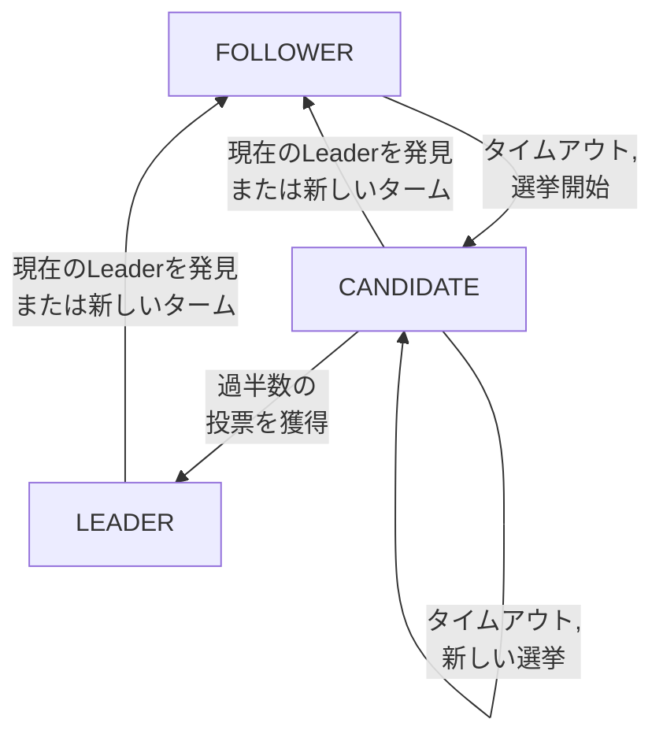

# Raft: In Search of an Understandable Consensus Algorithm

> **注:** この記事は英語の原文を日本語に翻訳したものです。コードブロック、Mermaidダイアグラム、論文タイトル、システム名、技術用語は原文のまま保持しています。

## 論文概要

- **タイトル**: In Search of an Understandable Consensus Algorithm
- **著者**: Diego Ongaro, John Ousterhout (Stanford)
- **発表**: USENIX ATC 2014
- **背景**: Paxosは理解と正しい実装が困難すぎました

## TL;DR

Raftは理解しやすさを重視して設計されたコンセンサスアルゴリズムで、以下を提供します：
- ランダム化タイムアウトによる**Leader選出**
- LeaderからFollowerへの**ログレプリケーション**
- Paxosと同等の**安全性保証**
- 分解による**実装の容易さ**

## 課題

### なぜPaxosではないのか？

```
┌─────────────────────────────────────────────────────────────────┐
│                    Paxosの問題点                                  │
├─────────────────────────────────────────────────────────────────┤
│                                                                  │
│  1. 理解が極めて困難                                            │
│     ┌─────────────────────────────────────────────┐             │
│     │  "Paxosファミリーの汚い秘密は、              │             │
│     │   基本アルゴリズムは最初の一歩に過ぎず、     │             │
│     │   完全なシステムを構築するところに             │             │
│     │   本当の仕事がすべてある、ということだ。"     │             │
│     │                           - Chubbyの著者     │             │
│     └─────────────────────────────────────────────┘             │
│                                                                  │
│  2. 正しい実装が困難                                            │
│     ┌─────────────────────────────────────────────┐             │
│     │  - 元の論文はsingle-decreeを記述             │             │
│     │  - Multi-Paxosは正式に仕様化されていない     │             │
│     │  - 多くの微妙なコーナーケース                │             │
│     │  - プロダクション実装は大きく異なる           │             │
│     └─────────────────────────────────────────────┘             │
│                                                                  │
│  3. Raftの解決策: 分解                                           │
│     ┌─────────────────────────────────────────────┐             │
│     │  - Leader選出（誰がリードするか？）          │             │
│     │  - ログレプリケーション（どうレプリケートするか？）│         │
│     │  - 安全性（何を保証するか？）                │             │
│     └─────────────────────────────────────────────┘             │
│                                                                  │
└─────────────────────────────────────────────────────────────────┘
```

## Raftの基本

### サーバー状態



> すべてのサーバーはFollowerとして開始します。各タームにつきLeaderは最大1つです。

### ターム

```
┌─────────────────────────────────────────────────────────────────┐
│                       Raftのターム                                │
├─────────────────────────────────────────────────────────────────┤
│                                                                  │
│  時間は任意の長さのタームに分割されます                          │
│                                                                  │
│  Term 1        Term 2        Term 3        Term 4               │
│  ┌──────────┐  ┌──────────┐  ┌───┐  ┌────────────────────────┐  │
│  │ 選挙     │  │ 選挙     │  │選挙│  │      選挙              │  │
│  │   +      │  │   +      │  │   │  │       +                │  │
│  │ 通常     │  │ 通常     │  │   │  │     通常               │  │
│  │ 動作     │  │ 動作     │  │   │  │     動作               │  │
│  └──────────┘  └──────────┘  └───┘  └────────────────────────┘  │
│                              │                                   │
│                              └── 投票分裂、Leaderが選出されず、  │
│                                  新しいタームが開始              │
│                                                                  │
│  タームは論理クロックとして機能します:                            │
│  - 各サーバーがcurrentTermを保存                                 │
│  - すべてのRPCでタームを交換                                     │
│  - 古いタームが検出されたらFollowerに変換                        │
│  - 古いタームのリクエストを拒否                                  │
│                                                                  │
└─────────────────────────────────────────────────────────────────┘
```

## Leader選出

### 選出プロセス

```python
class RaftNode:
    """Raft consensus node implementation."""

    def __init__(self, node_id: int, peers: list):
        self.node_id = node_id
        self.peers = peers

        # Persistent state
        self.current_term = 0
        self.voted_for = None
        self.log = []

        # Volatile state
        self.state = 'follower'
        self.commit_index = 0
        self.last_applied = 0

        # Leader state
        self.next_index = {}   # For each peer
        self.match_index = {}  # For each peer

        # Timing
        self.election_timeout = self._random_timeout()
        self.last_heartbeat = time.time()

    def _random_timeout(self) -> float:
        """
        Randomized election timeout.

        Key insight: Randomization prevents split votes.
        Typical range: 150-300ms
        """
        import random
        return random.uniform(0.15, 0.3)

    def check_election_timeout(self):
        """Check if election timeout has elapsed."""
        if self.state == 'leader':
            return

        if time.time() - self.last_heartbeat > self.election_timeout:
            self.start_election()

    def start_election(self):
        """
        Start leader election.

        1. Increment term
        2. Vote for self
        3. Request votes from all peers
        """
        self.current_term += 1
        self.state = 'candidate'
        self.voted_for = self.node_id
        self.election_timeout = self._random_timeout()

        votes_received = 1  # Self-vote

        # Request votes in parallel
        for peer in self.peers:
            vote_granted = self._request_vote(peer)
            if vote_granted:
                votes_received += 1

        # Check if won election
        if votes_received > len(self.peers) // 2:
            self.become_leader()
        else:
            # Election failed, return to follower
            self.state = 'follower'

    def _request_vote(self, peer) -> bool:
        """Send RequestVote RPC to peer."""
        last_log_index = len(self.log) - 1
        last_log_term = self.log[last_log_index].term if self.log else 0

        request = RequestVoteRPC(
            term=self.current_term,
            candidate_id=self.node_id,
            last_log_index=last_log_index,
            last_log_term=last_log_term
        )

        response = peer.send(request)

        # Update term if stale
        if response.term > self.current_term:
            self.current_term = response.term
            self.state = 'follower'
            self.voted_for = None
            return False

        return response.vote_granted

    def handle_request_vote(self, request) -> RequestVoteResponse:
        """
        Handle incoming RequestVote RPC.

        Grant vote if:
        1. Candidate's term >= our term
        2. We haven't voted for someone else this term
        3. Candidate's log is at least as up-to-date as ours
        """
        # Reject if stale term
        if request.term < self.current_term:
            return RequestVoteResponse(
                term=self.current_term,
                vote_granted=False
            )

        # Update term if newer
        if request.term > self.current_term:
            self.current_term = request.term
            self.state = 'follower'
            self.voted_for = None

        # Check if we can vote for this candidate
        log_ok = self._is_log_up_to_date(
            request.last_log_index,
            request.last_log_term
        )

        vote_granted = (
            (self.voted_for is None or
             self.voted_for == request.candidate_id) and
            log_ok
        )

        if vote_granted:
            self.voted_for = request.candidate_id
            self.last_heartbeat = time.time()

        return RequestVoteResponse(
            term=self.current_term,
            vote_granted=vote_granted
        )

    def _is_log_up_to_date(self, last_index: int, last_term: int) -> bool:
        """
        Check if candidate's log is at least as up-to-date.

        Comparison:
        1. Higher last term wins
        2. If same term, longer log wins
        """
        my_last_index = len(self.log) - 1
        my_last_term = self.log[my_last_index].term if self.log else 0

        if last_term != my_last_term:
            return last_term > my_last_term
        return last_index >= my_last_index
```

### 選出の可視化

```
┌─────────────────────────────────────────────────────────────────┐
│                   選出の例                                        │
├─────────────────────────────────────────────────────────────────┤
│                                                                  │
│  5ノードクラスタ、S1がLeader、その後クラッシュ                   │
│                                                                  │
│  時間 ──────────────────────────────────────────────────►       │
│                                                                  │
│  S1: [Leader]──────────X (クラッシュ)                            │
│                                                                  │
│  S2: [Follower]────────────[タイムアウト]─[Candidate T2]─[Leader]│
│                                           │                      │
│  S3: [Follower]────────────────────────[投票]──[Follower]        │
│                                           │                      │
│  S4: [Follower]────────────────────────[投票]──[Follower]        │
│                                           │                      │
│  S5: [Follower]────────────────────────[投票]──[Follower]        │
│                                                                  │
│  S2が最初にタイムアウト（ランダムタイムアウト）                  │
│  S2がTerm 2の選挙を開始                                         │
│  S2が4票を獲得（自分を含む）= 過半数                             │
│  S2がLeaderに就任                                               │
│                                                                  │
└─────────────────────────────────────────────────────────────────┘
```

## ログレプリケーション

### ログ構造

```
┌─────────────────────────────────────────────────────────────────┐
│                      Raftログ                                    │
├─────────────────────────────────────────────────────────────────┤
│                                                                  │
│  ログエントリ = (term, index, command)                           │
│                                                                  │
│  Index:    1     2     3     4     5     6     7                │
│          ┌─────┬─────┬─────┬─────┬─────┬─────┬─────┐            │
│  Leader: │ T1  │ T1  │ T1  │ T2  │ T3  │ T3  │ T3  │            │
│          │x←3  │y←1  │x←2  │y←9  │x←1  │y←5  │z←2  │            │
│          └─────┴─────┴─────┴─────┴─────┴─────┴─────┘            │
│                                                                  │
│          ┌─────┬─────┬─────┬─────┬─────┬─────┬─────┐            │
│  Foll 1: │ T1  │ T1  │ T1  │ T2  │ T3  │ T3  │     │  (遅れ)    │
│          │x←3  │y←1  │x←2  │y←9  │x←1  │y←5  │     │            │
│          └─────┴─────┴─────┴─────┴─────┴─────┴─────┘            │
│                                                                  │
│          ┌─────┬─────┬─────┬─────┬─────┬─────┬─────┐            │
│  Foll 2: │ T1  │ T1  │ T1  │ T2  │ T3  │ T3  │ T3  │  (同期済)  │
│          │x←3  │y←1  │x←2  │y←9  │x←1  │y←5  │z←2  │            │
│          └─────┴─────┴─────┴─────┴─────┴─────┴─────┘            │
│                                                                  │
│  Commit Index: 6（過半数がエントリ6まで保持）                    │
│                                                                  │
└─────────────────────────────────────────────────────────────────┘
```

### AppendEntries RPC

```python
class RaftLeader(RaftNode):
    """Leader-specific Raft operations."""

    def become_leader(self):
        """Initialize leader state."""
        self.state = 'leader'

        # Initialize next_index to end of log
        for peer in self.peers:
            self.next_index[peer] = len(self.log)
            self.match_index[peer] = 0

        # Send initial heartbeat
        self.send_heartbeats()

    def append_entry(self, command) -> bool:
        """
        Client request to append entry.

        1. Append to local log
        2. Replicate to followers
        3. Commit when majority replicated
        """
        # Append to local log
        entry = LogEntry(
            term=self.current_term,
            index=len(self.log),
            command=command
        )
        self.log.append(entry)

        # Replicate to followers
        success_count = 1  # Self

        for peer in self.peers:
            if self.replicate_to_peer(peer):
                success_count += 1

        # Commit if majority
        if success_count > (len(self.peers) + 1) // 2:
            self.commit_index = len(self.log) - 1
            self.apply_committed_entries()
            return True

        return False

    def replicate_to_peer(self, peer) -> bool:
        """Send AppendEntries to single peer."""
        prev_log_index = self.next_index[peer] - 1
        prev_log_term = (
            self.log[prev_log_index].term
            if prev_log_index >= 0 else 0
        )

        # Entries to send
        entries = self.log[self.next_index[peer]:]

        request = AppendEntriesRPC(
            term=self.current_term,
            leader_id=self.node_id,
            prev_log_index=prev_log_index,
            prev_log_term=prev_log_term,
            entries=entries,
            leader_commit=self.commit_index
        )

        response = peer.send(request)

        if response.term > self.current_term:
            # Stale leader, step down
            self.current_term = response.term
            self.state = 'follower'
            return False

        if response.success:
            # Update next_index and match_index
            self.next_index[peer] = len(self.log)
            self.match_index[peer] = len(self.log) - 1
            return True
        else:
            # Decrement next_index and retry
            self.next_index[peer] -= 1
            return self.replicate_to_peer(peer)

    def send_heartbeats(self):
        """Send periodic heartbeats to prevent elections."""
        while self.state == 'leader':
            for peer in self.peers:
                self.replicate_to_peer(peer)
            time.sleep(0.05)  # 50ms heartbeat interval


class RaftFollower(RaftNode):
    """Follower-specific operations."""

    def handle_append_entries(self, request) -> AppendEntriesResponse:
        """
        Handle AppendEntries from leader.

        1. Check term
        2. Check log consistency
        3. Append new entries
        4. Update commit index
        """
        # Reject if stale term
        if request.term < self.current_term:
            return AppendEntriesResponse(
                term=self.current_term,
                success=False
            )

        # Update term and reset timeout
        self.current_term = request.term
        self.state = 'follower'
        self.last_heartbeat = time.time()

        # Check log consistency
        if request.prev_log_index >= 0:
            if len(self.log) <= request.prev_log_index:
                return AppendEntriesResponse(
                    term=self.current_term,
                    success=False
                )
            if self.log[request.prev_log_index].term != request.prev_log_term:
                # Delete conflicting entries
                self.log = self.log[:request.prev_log_index]
                return AppendEntriesResponse(
                    term=self.current_term,
                    success=False
                )

        # Append new entries
        for entry in request.entries:
            if entry.index < len(self.log):
                if self.log[entry.index].term != entry.term:
                    # Conflict: delete from here onwards
                    self.log = self.log[:entry.index]
                    self.log.append(entry)
            else:
                self.log.append(entry)

        # Update commit index
        if request.leader_commit > self.commit_index:
            self.commit_index = min(
                request.leader_commit,
                len(self.log) - 1
            )
            self.apply_committed_entries()

        return AppendEntriesResponse(
            term=self.current_term,
            success=True
        )
```

## 安全性プロパティ

### 選出の安全性

```
┌─────────────────────────────────────────────────────────────────┐
│                   安全性プロパティ                                │
├─────────────────────────────────────────────────────────────────┤
│                                                                  │
│  1. 選出の安全性                                                │
│     ┌─────────────────────────────────────────────┐             │
│     │  各タームにつき最大1つのLeader              │             │
│     │                                              │             │
│     │  証明: 各サーバーはタームごとに最大1票      │             │
│     │  投票。勝利には過半数が必要。               │             │
│     │  2つの過半数は必ず重複する。                │             │
│     └─────────────────────────────────────────────┘             │
│                                                                  │
│  2. Leader追記のみ                                               │
│     ┌─────────────────────────────────────────────┐             │
│     │  Leaderはログエントリを上書きまたは          │             │
│     │  削除せず、新しいエントリのみ追加            │             │
│     └─────────────────────────────────────────────┘             │
│                                                                  │
│  3. ログマッチング                                               │
│     ┌─────────────────────────────────────────────┐             │
│     │  2つのログが同じインデックスとタームの       │             │
│     │  エントリを持つ場合、その時点までの          │             │
│     │  ログは同一                                  │             │
│     └─────────────────────────────────────────────┘             │
│                                                                  │
│  4. Leader完全性                                                 │
│     ┌─────────────────────────────────────────────┐             │
│     │  ターンTでコミットされたエントリは、         │             │
│     │  T以降の全Leaderのログに                     │             │
│     │  存在する                                    │             │
│     └─────────────────────────────────────────────┘             │
│                                                                  │
│  5. ステートマシン安全性                                         │
│     ┌─────────────────────────────────────────────┐             │
│     │  サーバーがインデックスiのエントリを          │             │
│     │  適用した場合、他のサーバーは同じ             │             │
│     │  インデックスに異なるエントリを適用しない     │             │
│     └─────────────────────────────────────────────┘             │
│                                                                  │
└─────────────────────────────────────────────────────────────────┘
```

### コミットルール

```python
class CommitmentRules:
    """Raft commitment safety rules."""

    def can_commit_entry(self, leader, entry_index: int) -> bool:
        """
        Check if entry can be committed.

        Rule: Only commit entries from current term.
        Entries from previous terms are committed indirectly.

        This prevents the "Figure 8" problem where
        an entry appears committed but gets overwritten.
        """
        entry = leader.log[entry_index]

        # Must be from current term
        if entry.term != leader.current_term:
            return False

        # Must be replicated to majority
        replication_count = 1  # Leader has it
        for peer in leader.peers:
            if leader.match_index[peer] >= entry_index:
                replication_count += 1

        majority = (len(leader.peers) + 1) // 2 + 1
        return replication_count >= majority

    def update_commit_index(self, leader):
        """
        Update commit index based on replication.

        Find highest N where:
        1. N > commitIndex
        2. Majority of matchIndex[i] >= N
        3. log[N].term == currentTerm
        """
        for n in range(len(leader.log) - 1, leader.commit_index, -1):
            if leader.log[n].term != leader.current_term:
                continue

            count = 1
            for peer in leader.peers:
                if leader.match_index.get(peer, 0) >= n:
                    count += 1

            if count > (len(leader.peers) + 1) // 2:
                leader.commit_index = n
                break
```

## クラスタメンバーシップ変更

### Joint Consensus

```
┌─────────────────────────────────────────────────────────────────┐
│               クラスタメンバーシップ変更                          │
├─────────────────────────────────────────────────────────────────┤
│                                                                  │
│  問題: ColdからCnewへの直接切り替えは                            │
│  2つのLeader（重複しない過半数）を引き起こす可能性がある        │
│                                                                  │
│  Cold = {S1, S2, S3}                                            │
│  Cnew = {S1, S2, S3, S4, S5}                                    │
│                                                                  │
│  時間 ─────────────────────────────────────────────►            │
│                                                                  │
│  間違い（直接変更）:                                             │
│  ┌───────────────────┬───────────────────────────┐              │
│  │    Coldアクティブ │      Cnewアクティブ       │              │
│  └───────────────────┴───────────────────────────┘              │
│           │                     │                                │
│           ▼                     ▼                                │
│     S1, S2 = Coldの過半数  S3, S4, S5 = Cnewの過半数            │
│     (2/3)                  (3/5)                                 │
│     （2つのLeaderが可能！）                                      │
│                                                                  │
│  正解（joint consensus）:                                       │
│  ┌─────────────┬─────────────────┬─────────────────┐            │
│  │    Cold     │  Cold,new       │      Cnew       │            │
│  │  アクティブ │  (joint)        │   アクティブ    │            │
│  └─────────────┴─────────────────┴─────────────────┘            │
│                                                                  │
│  Joint consensusは両方の構成からの過半数を要求                    │
│                                                                  │
└─────────────────────────────────────────────────────────────────┘
```

### 単一サーバー変更

```python
class MembershipChange:
    """
    Single-server membership changes.

    Simpler alternative to joint consensus.
    Only add/remove one server at a time.
    """

    def add_server(self, leader, new_server):
        """
        Add server to cluster.

        1. Catch up new server's log
        2. Append configuration entry
        3. New config takes effect immediately
        """
        # Phase 1: Catch up
        while not self._is_caught_up(leader, new_server):
            leader.replicate_to_peer(new_server)

        # Phase 2: Add to config
        new_config = leader.config.copy()
        new_config.servers.append(new_server)

        # Append config entry (special type)
        config_entry = LogEntry(
            term=leader.current_term,
            index=len(leader.log),
            command=ConfigChange(new_config),
            config=True
        )
        leader.log.append(config_entry)

        # Replicate to all (including new server)
        leader.peers.append(new_server)
        leader.replicate_all()

    def remove_server(self, leader, old_server):
        """
        Remove server from cluster.

        If leader is removed, it steps down after
        committing the config change.
        """
        new_config = leader.config.copy()
        new_config.servers.remove(old_server)

        config_entry = LogEntry(
            term=leader.current_term,
            index=len(leader.log),
            command=ConfigChange(new_config),
            config=True
        )
        leader.log.append(config_entry)

        # Replicate (not to removed server)
        leader.peers.remove(old_server)
        leader.replicate_all()

        # Step down if we were removed
        if old_server == leader.node_id:
            leader.state = 'follower'

    def _is_caught_up(self, leader, new_server) -> bool:
        """Check if new server has caught up."""
        return (
            leader.match_index.get(new_server, 0) >=
            len(leader.log) - 1
        )
```

## ログコンパクション

### スナップショット

```
┌─────────────────────────────────────────────────────────────────┐
│                    ログコンパクション                             │
├─────────────────────────────────────────────────────────────────┤
│                                                                  │
│  スナップショット前:                                             │
│  ┌─────┬─────┬─────┬─────┬─────┬─────┬─────┬─────┬─────┐       │
│  │  1  │  2  │  3  │  4  │  5  │  6  │  7  │  8  │  9  │       │
│  │x←3  │y←1  │y←9  │x←2  │x←0  │y←7  │x←5  │z←1  │y←2  │       │
│  └─────┴─────┴─────┴─────┴─────┴─────┴─────┴─────┴─────┘       │
│                                  ▲                              │
│                            コミット済み                          │
│                                                                  │
│  スナップショット後（インデックス5時点）:                        │
│  ┌───────────────────┐  ┌─────┬─────┬─────┬─────┐              │
│  │   スナップショット │  │  6  │  7  │  8  │  9  │              │
│  │   lastIncluded    │  │y←7  │x←5  │z←1  │y←2  │              │
│  │   Index=5, Term=3 │  └─────┴─────┴─────┴─────┘              │
│  │   状態:           │                                          │
│  │     x=0, y=9, z=0 │                                          │
│  └───────────────────┘                                          │
│                                                                  │
│  スナップショットに含まれるもの:                                 │
│  - 最後に含まれたインデックスとターム                            │
│  - その時点のステートマシンの状態                                │
│                                                                  │
└─────────────────────────────────────────────────────────────────┘
```

### InstallSnapshot RPC

```python
class Snapshotting:
    """Raft log compaction via snapshots."""

    def __init__(self, node: RaftNode):
        self.node = node
        self.snapshot = None
        self.last_included_index = 0
        self.last_included_term = 0

    def take_snapshot(self):
        """
        Take snapshot of current state.

        Called when log exceeds threshold.
        """
        # Get state machine state
        state = self.node.state_machine.serialize()

        self.snapshot = Snapshot(
            last_included_index=self.node.commit_index,
            last_included_term=self.node.log[self.node.commit_index].term,
            state=state
        )

        # Discard log entries before snapshot
        self.node.log = self.node.log[self.node.commit_index + 1:]

        self.last_included_index = self.snapshot.last_included_index
        self.last_included_term = self.snapshot.last_included_term

    def install_snapshot(self, request) -> InstallSnapshotResponse:
        """
        Handle InstallSnapshot from leader.

        Used when follower is far behind.
        """
        if request.term < self.node.current_term:
            return InstallSnapshotResponse(term=self.node.current_term)

        # Reset timeout
        self.node.last_heartbeat = time.time()

        # Save snapshot
        self.snapshot = Snapshot(
            last_included_index=request.last_included_index,
            last_included_term=request.last_included_term,
            state=request.data
        )

        # Discard entire log (snapshot is more recent)
        if (request.last_included_index >= len(self.node.log) or
            self.node.log[request.last_included_index].term !=
            request.last_included_term):
            self.node.log = []
        else:
            # Keep entries after snapshot
            self.node.log = self.node.log[request.last_included_index + 1:]

        # Apply snapshot to state machine
        self.node.state_machine.restore(request.data)

        self.last_included_index = request.last_included_index
        self.last_included_term = request.last_included_term

        return InstallSnapshotResponse(term=self.node.current_term)

    def send_snapshot_to_follower(self, leader, follower):
        """
        Leader sends snapshot to lagging follower.

        Used when follower's next_index points to
        compacted portion of log.
        """
        request = InstallSnapshotRPC(
            term=leader.current_term,
            leader_id=leader.node_id,
            last_included_index=self.last_included_index,
            last_included_term=self.last_included_term,
            offset=0,
            data=self.snapshot.state,
            done=True
        )

        response = follower.send(request)

        if response.term > leader.current_term:
            leader.state = 'follower'
            leader.current_term = response.term
        else:
            # Update next_index
            leader.next_index[follower] = self.last_included_index + 1
            leader.match_index[follower] = self.last_included_index
```

## クライアントインタラクション

### 線形化可能な読み取り

```python
class RaftClient:
    """Client interaction with Raft cluster."""

    def __init__(self, cluster: list):
        self.cluster = cluster
        self.leader = None
        self.client_id = uuid.uuid4()
        self.sequence_num = 0

    def write(self, command) -> Result:
        """
        Submit write command.

        1. Find leader
        2. Send command
        3. Wait for commit
        4. Retry if leader fails
        """
        while True:
            try:
                leader = self._find_leader()

                # Include client ID and sequence for dedup
                request = ClientRequest(
                    client_id=self.client_id,
                    sequence_num=self.sequence_num,
                    command=command
                )

                response = leader.submit(request)

                if response.success:
                    self.sequence_num += 1
                    return response.result
                elif response.not_leader:
                    self.leader = response.leader_hint

            except TimeoutError:
                self.leader = None

    def read(self, query) -> Result:
        """
        Read with linearizability.

        Options:
        1. Go through log (slow but simple)
        2. Read-index protocol (faster)
        3. Lease-based reads (fastest but more complex)
        """
        return self._read_with_read_index(query)

    def _read_with_read_index(self, query) -> Result:
        """
        Read-index protocol for linearizable reads.

        1. Leader records current commit index
        2. Leader confirms it's still leader (heartbeat)
        3. Wait for state machine to apply to commit index
        4. Execute read
        """
        leader = self._find_leader()

        # Get read index from leader
        read_index = leader.get_read_index()

        # Wait for apply
        while leader.last_applied < read_index:
            time.sleep(0.001)

        # Execute read on state machine
        return leader.state_machine.query(query)


class LeaderReadProtocol:
    """Leader-side read protocols."""

    def __init__(self, leader: RaftLeader):
        self.leader = leader
        self.read_index = 0

    def get_read_index(self) -> int:
        """
        Get read index for linearizable read.

        Must confirm leadership before returning.
        """
        # Record current commit index
        read_index = self.leader.commit_index

        # Confirm leadership with heartbeat round
        if not self._confirm_leadership():
            raise NotLeaderError()

        return read_index

    def _confirm_leadership(self) -> bool:
        """Confirm still leader via heartbeat majority."""
        responses = 1  # Self

        for peer in self.leader.peers:
            try:
                response = peer.heartbeat()
                if response.term == self.leader.current_term:
                    responses += 1
            except:
                pass

        return responses > (len(self.leader.peers) + 1) // 2

    def lease_based_read(self, query) -> Result:
        """
        Lease-based reads (optimization).

        After successful heartbeat, leader has a "lease"
        during which it can serve reads without checking.

        Lease duration < election timeout
        """
        if time.time() < self.lease_expiry:
            # Serve directly
            return self.leader.state_machine.query(query)
        else:
            # Refresh lease
            if self._confirm_leadership():
                self.lease_expiry = time.time() + 0.1  # 100ms lease
                return self.leader.state_machine.query(query)
            else:
                raise NotLeaderError()
```

## 実装上の考慮事項

### 永続化

```python
class RaftPersistence:
    """Raft persistent state management."""

    def __init__(self, path: str):
        self.path = path
        self.wal = WriteAheadLog(f"{path}/wal")

    def save_state(self, current_term: int, voted_for: int):
        """
        Save persistent state before responding.

        Must persist before:
        - Granting vote
        - Accepting AppendEntries
        """
        state = {
            'current_term': current_term,
            'voted_for': voted_for
        }
        self.wal.write(state)
        self.wal.sync()  # fsync!

    def save_log_entries(self, entries: list):
        """Persist log entries."""
        for entry in entries:
            self.wal.write(entry.serialize())
        self.wal.sync()

    def recover(self) -> tuple:
        """Recover state after crash."""
        state = self.wal.recover_state()
        log = self.wal.recover_log()
        return state.current_term, state.voted_for, log
```

## 主要な結果

### 理解しやすさの調査

```
┌─────────────────────────────────────────────────────────────────┐
│                   Raft vs Paxos調査                              │
├─────────────────────────────────────────────────────────────────┤
│                                                                  │
│  43名のStanford学生が両方のアルゴリズムを学習                   │
│                                                                  │
│  クイズスコア（高い = 理解度が高い）:                            │
│  ┌─────────────────────────────────────────────┐                │
│  │  Raft:  25.7 / 30 平均                      │                │
│  │  Paxos: 20.8 / 30 平均                      │                │
│  └─────────────────────────────────────────────┘                │
│                                                                  │
│  43名中33名がRaftの方が理解しやすいと回答                       │
│                                                                  │
│  主な要因:                                                      │
│  - サブ問題への分解                                              │
│  - 強いLeader（推論がシンプル）                                  │
│  - ランダム化タイムアウト（シンプルな選出）                      │
│                                                                  │
└─────────────────────────────────────────────────────────────────┘
```

## 影響とレガシー

### 実世界での採用

```
┌──────────────────────────────────────────────────────────────┐
│                    Raftの実装                                  │
├──────────────────────────────────────────────────────────────┤
│                                                               │
│  プロダクションシステム:                                      │
│  - etcd (Kubernetes)                                         │
│  - Consul (HashiCorp)                                        │
│  - CockroachDB                                               │
│  - TiKV (TiDBストレージ)                                     │
│  - RethinkDB                                                 │
│  - InfluxDB                                                  │
│                                                               │
│  Raftが勝利した理由:                                         │
│  - 正しく実装しやすい                                         │
│  - デバッグしやすい                                           │
│  - チームに説明しやすい                                       │
│  - Paxosと同じ保証                                           │
│                                                               │
└──────────────────────────────────────────────────────────────┘
```

## 重要なポイント

1. **理解しやすさが重要**: 正しい実装には理解が必要です
2. **分解が助けになる**: 選出、レプリケーション、安全性に分割
3. **強いLeaderが簡素化**: 1つの意思決定者の方が推論しやすいです
4. **ランダム化が機能する**: 複雑なタイブレイクプロトコルを回避します
5. **ログマッチングプロパティ**: 整合性を確保する鍵です
6. **現在のタームのみコミット**: 微妙な安全性バグを防止します
7. **コンパクションにスナップショット**: 実際にはログサイズが制限されます
