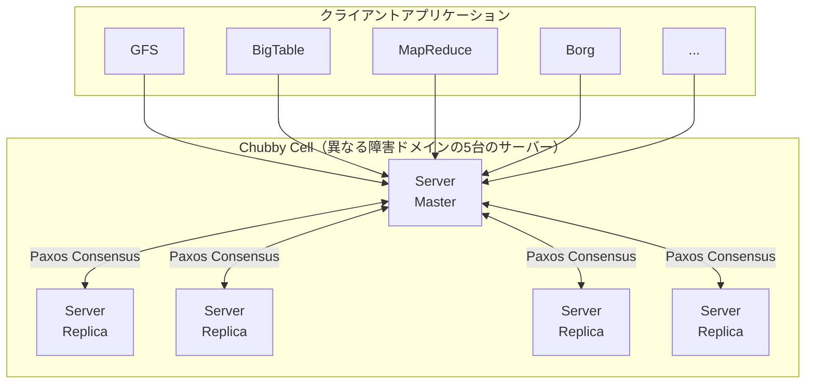
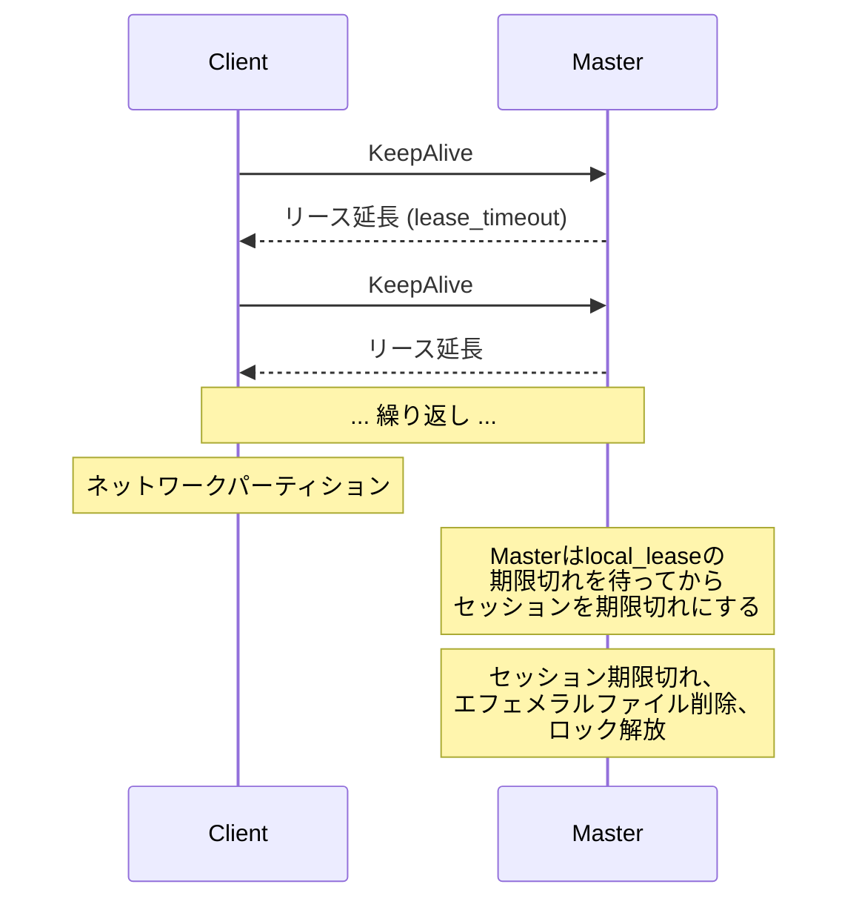
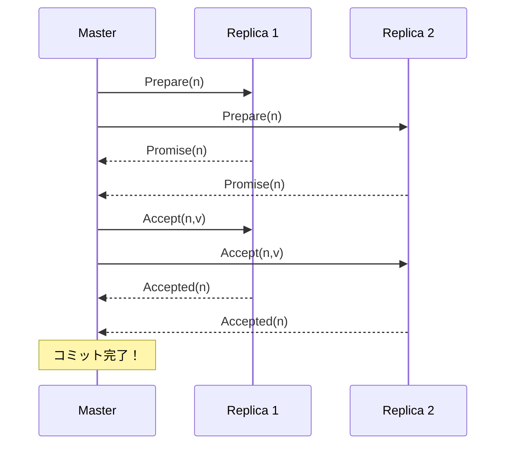
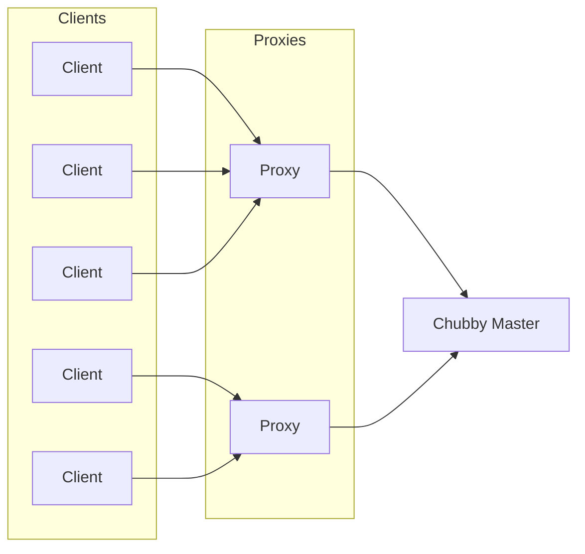

# The Chubby Lock Service for Loosely-Coupled Distributed Systems

> **注:** この記事は英語の原文を日本語に翻訳したものです。コードブロック、Mermaidダイアグラム、論文タイトル、システム名、技術用語は原文のまま保持しています。

## 論文概要

- **タイトル**: The Chubby Lock Service for Loosely-Coupled Distributed Systems
- **著者**: Mike Burrows (Google)
- **発表**: OSDI 2006
- **背景**: Googleは信頼性の高い分散ロッキングと設定ストレージを必要としていました

## TL;DR

Chubbyは分散ロックサービスで、以下を提供します：
- 分散コーディネーションのための**粗粒度ロッキング**
- 小さな設定ファイルのための**信頼性の高いストレージ**
- Leader選択のための**プライマリ選出**サポート
- Paxosレプリケーションによる**強い整合性**

## 課題

### なぜロックサービスなのか？

```
┌─────────────────────────────────────────────────────────────────┐
│                    コーディネーションの課題                       │
├─────────────────────────────────────────────────────────────────┤
│                                                                  │
│  Googleでのユースケース:                                        │
│                                                                  │
│  1. GFSマスター選出                                             │
│     ┌─────────────────────────────────────────────┐             │
│     │  複数の候補者、マスターは1つだけ            │             │
│     │  全クライアントが現在のマスターを見つける必要│             │
│     └─────────────────────────────────────────────┘             │
│                                                                  │
│  2. Bigtable Tabletサーバー登録                                  │
│     ┌─────────────────────────────────────────────┐             │
│     │  サーバーが自身を登録                       │             │
│     │  マスターがライブサーバーを追跡             │             │
│     └─────────────────────────────────────────────┘             │
│                                                                  │
│  3. 設定ストレージ                                               │
│     ┌─────────────────────────────────────────────┐             │
│     │  ACL、メタデータ、小さな設定ファイル        │             │
│     │  強い整合性が必要                           │             │
│     └─────────────────────────────────────────────┘             │
│                                                                  │
│  なぜPaxosライブラリではなくロックサービスなのか？               │
│  ┌─────────────────────────────────────────────────┐            │
│  │  - 生のコンセンサスプロトコルより使いやすい     │            │
│  │  - 必要なサーバー数が少ない（5つのChubbyレプリカ│            │
│  │    vs. サービスごとに5つ以上のレプリカ）        │            │
│  │  - ネームサービス機能を提供                     │            │
│  │  - 馴染みのあるロック/ファイルインターフェース  │            │
│  └─────────────────────────────────────────────────┘            │
│                                                                  │
└─────────────────────────────────────────────────────────────────┘
```

## アーキテクチャ

### システム概要



> 1つのMasterがPaxosで選出され、全ての読み書きを処理します。

### クライアントライブラリ

```python
class ChubbyClient:
    """Chubby client library."""

    def __init__(self, cell_name: str):
        self.cell = cell_name
        self.master = None
        self.session = None
        self.handles = {}
        self.cache = {}

    def find_master(self):
        """
        Locate the current master.

        1. Contact any replica
        2. Get master location from DNS
        3. Cache for future use
        """
        # DNS lookup for cell
        replicas = dns_lookup(f"{self.cell}.chubby.google.com")

        # Ask any replica for master
        for replica in replicas:
            try:
                response = replica.get_master()
                if response.is_master:
                    self.master = replica
                else:
                    self.master = response.master_location
                return
            except:
                continue

        raise NoMasterError()

    def open(self, path: str, mode: str) -> Handle:
        """
        Open a Chubby file/directory.

        Returns a handle for subsequent operations.
        """
        if not self.session:
            self._create_session()

        request = OpenRequest(
            path=path,
            mode=mode,
            events=self._default_events()
        )

        response = self.master.open(request)

        handle = Handle(
            id=response.handle_id,
            path=path,
            mode=mode
        )
        self.handles[path] = handle

        return handle

    def acquire_lock(self, handle: Handle,
                     lock_type: str = 'exclusive') -> bool:
        """
        Acquire lock on file.

        Lock types:
        - exclusive: Only one holder
        - shared: Multiple readers
        """
        request = AcquireLockRequest(
            handle_id=handle.id,
            lock_type=lock_type
        )

        response = self.master.acquire_lock(request)
        return response.acquired

    def release_lock(self, handle: Handle):
        """Release lock on file."""
        request = ReleaseLockRequest(handle_id=handle.id)
        self.master.release_lock(request)
```

## ファイルシステムインターフェース

### 名前空間

```
┌─────────────────────────────────────────────────────────────────┐
│                   Chubby名前空間                                 │
├─────────────────────────────────────────────────────────────────┤
│                                                                  │
│  /ls/cell/...                                                   │
│                                                                  │
│  パスの例:                                                      │
│  ┌─────────────────────────────────────────────────────────┐    │
│  │  /ls/foo/gfs/master     - GFSマスターの位置             │    │
│  │  /ls/foo/bigtable/root  - Bigtableルートタブレットの位置 │    │
│  │  /ls/foo/mapreduce/job1 - MapReduceジョブロック          │    │
│  │  /ls/foo/acl/users      - ACL設定                       │    │
│  └─────────────────────────────────────────────────────────┘    │
│                                                                  │
│  ノードタイプ:                                                  │
│  ┌─────────────────────────────────────────────────────────┐    │
│  │  Permanent: 明示的に削除                                │    │
│  │  Ephemeral: セッション終了時に削除                      │    │
│  └─────────────────────────────────────────────────────────┘    │
│                                                                  │
│  ノードメタデータ:                                              │
│  ┌─────────────────────────────────────────────────────────┐    │
│  │  - インスタンス番号（バージョン/世代）                  │    │
│  │  - コンテンツ世代番号                                   │    │
│  │  - ロック世代番号                                       │    │
│  │  - ACL世代番号                                          │    │
│  │  - ACL名                                               │    │
│  └─────────────────────────────────────────────────────────┘    │
│                                                                  │
└─────────────────────────────────────────────────────────────────┘
```

### ファイル操作

```python
class ChubbyServer:
    """Chubby server-side operations."""

    def __init__(self):
        self.namespace = {}  # path -> Node
        self.locks = {}      # path -> LockState
        self.sessions = {}   # session_id -> Session

    def open(self, request) -> OpenResponse:
        """
        Open or create a node.

        Modes:
        - READ: Read-only access
        - WRITE: Read-write access
        - CREATE: Create if not exists
        - EXCLUSIVE_CREATE: Fail if exists
        """
        path = request.path

        # Check if node exists
        if path not in self.namespace:
            if 'CREATE' not in request.mode:
                raise NodeNotFoundError()
            self._create_node(path, request)
        elif 'EXCLUSIVE_CREATE' in request.mode:
            raise NodeExistsError()

        # Create handle
        handle = self._create_handle(path, request)

        # Register event subscriptions
        for event_type in request.events:
            self._subscribe_event(handle, event_type)

        return OpenResponse(handle_id=handle.id)

    def get_contents(self, handle_id: int) -> bytes:
        """Read file contents."""
        handle = self._get_handle(handle_id)
        node = self.namespace[handle.path]
        return node.contents

    def set_contents(self, handle_id: int, contents: bytes):
        """
        Write file contents.

        Must hold lock for write.
        """
        handle = self._get_handle(handle_id)

        # Check lock
        if not self._has_write_lock(handle):
            raise NoLockError()

        node = self.namespace[handle.path]
        node.contents = contents
        node.content_generation += 1

        # Notify subscribers
        self._send_event(handle.path, 'CONTENT_MODIFIED')

    def _create_node(self, path: str, request):
        """Create new node."""
        node = Node(
            path=path,
            ephemeral=request.ephemeral,
            instance_number=self._next_instance_number(),
            contents=b'',
            acls=request.acls or self._default_acls()
        )
        self.namespace[path] = node

        # Log to Paxos
        self.paxos.propose(CreateNode(node))
```

## ロッキング

### ロックセマンティクス

```
┌─────────────────────────────────────────────────────────────────┐
│                    Chubbyロッキング                               │
├─────────────────────────────────────────────────────────────────┤
│                                                                  │
│  粗粒度ロック:                                                  │
│  ┌─────────────────────────────────────────────────────────┐    │
│  │  数秒ではなく、数時間または数日間保持                    │    │
│  │  細粒度同期ではなく、Leader選出に使用                    │    │
│  └─────────────────────────────────────────────────────────┘    │
│                                                                  │
│  ロックタイプ:                                                  │
│  ┌─────────────────────────────────────────────────────────┐    │
│  │  EXCLUSIVE: 保持者1人のみ（ライターロック）             │    │
│  │  SHARED: 複数の保持者（リーダーロック）                  │    │
│  └─────────────────────────────────────────────────────────┘    │
│                                                                  │
│  アドバイザリーロック:                                          │
│  ┌─────────────────────────────────────────────────────────┐    │
│  │  ロックはファイルアクセスを防止しない                    │    │
│  │  クライアントがアクセス前にロックを確認する必要がある    │    │
│  │  よりシンプルで、Googleのユースケースには十分             │    │
│  └─────────────────────────────────────────────────────────┘    │
│                                                                  │
│  シーケンサー（ロックトークン）:                                │
│  ┌─────────────────────────────────────────────────────────┐    │
│  │  ロック状態を記述する不透明なバイト文字列:               │    │
│  │  - ロック名                                             │    │
│  │  - ロックモード（shared/exclusive）                      │    │
│  │  - ロック世代番号                                       │    │
│  │                                                          │    │
│  │  ロック保持者が変更されていないことの検証に使用          │    │
│  └─────────────────────────────────────────────────────────┘    │
│                                                                  │
└─────────────────────────────────────────────────────────────────┘
```

### ロック実装

```python
class LockManager:
    """Chubby lock management."""

    def __init__(self):
        self.locks = {}  # path -> Lock

    def acquire(self, path: str, session_id: str,
                lock_type: str) -> tuple:
        """
        Acquire lock.

        Returns (success, sequencer).
        """
        if path not in self.locks:
            self.locks[path] = Lock(path)

        lock = self.locks[path]

        if lock_type == 'exclusive':
            if lock.exclusive_holder is not None:
                return (False, None)
            if lock.shared_holders:
                return (False, None)

            lock.exclusive_holder = session_id
            lock.generation += 1

            sequencer = self._make_sequencer(lock, 'exclusive')
            return (True, sequencer)

        elif lock_type == 'shared':
            if lock.exclusive_holder is not None:
                return (False, None)

            lock.shared_holders.add(session_id)

            sequencer = self._make_sequencer(lock, 'shared')
            return (True, sequencer)

    def release(self, path: str, session_id: str):
        """Release lock."""
        if path not in self.locks:
            return

        lock = self.locks[path]

        if lock.exclusive_holder == session_id:
            lock.exclusive_holder = None
        else:
            lock.shared_holders.discard(session_id)

    def _make_sequencer(self, lock, mode: str) -> bytes:
        """
        Create sequencer (lock token).

        Allows servers to verify lock is still valid.
        """
        return Sequencer(
            path=lock.path,
            mode=mode,
            generation=lock.generation
        ).encode()

    def verify_sequencer(self, sequencer: bytes,
                         path: str) -> bool:
        """
        Verify sequencer is still valid.

        Called by resource servers to check lock.
        """
        seq = Sequencer.decode(sequencer)

        if seq.path != path:
            return False

        lock = self.locks.get(path)
        if not lock:
            return False

        return seq.generation == lock.generation


class Lock:
    """Lock state."""

    def __init__(self, path: str):
        self.path = path
        self.generation = 0
        self.exclusive_holder = None
        self.shared_holders = set()
```

## セッションとKeepAlive

### セッション管理



> **リースタイミング:** デフォルトのセッションリースは12秒です。クライアントは期限切れの前にKeepAliveを送信します。Masterは別のリース期間分延長します。

### KeepAliveプロトコル

```python
class SessionManager:
    """Manage client sessions."""

    def __init__(self, lease_duration: float = 12.0):
        self.sessions = {}
        self.lease_duration = lease_duration

    def create_session(self, client_id: str) -> Session:
        """Create new session."""
        session = Session(
            id=uuid.uuid4(),
            client_id=client_id,
            lease_expiry=time.time() + self.lease_duration,
            handles=[],
            ephemeral_nodes=[]
        )
        self.sessions[session.id] = session
        return session

    def keep_alive(self, session_id: str) -> KeepAliveResponse:
        """
        Process KeepAlive request.

        1. Extend lease
        2. Return pending events
        3. Block if no events (long polling)
        """
        session = self.sessions.get(session_id)
        if not session:
            return KeepAliveResponse(valid=False)

        # Extend lease
        session.lease_expiry = time.time() + self.lease_duration

        # Get pending events
        events = session.pending_events
        session.pending_events = []

        return KeepAliveResponse(
            valid=True,
            lease_timeout=self.lease_duration,
            events=events
        )

    def expire_sessions(self):
        """
        Background task to expire sessions.

        Called periodically.
        """
        now = time.time()

        for session_id, session in list(self.sessions.items()):
            if session.lease_expiry < now:
                self._expire_session(session)

    def _expire_session(self, session: Session):
        """
        Handle session expiry.

        1. Release all locks
        2. Delete ephemeral nodes
        3. Close all handles
        """
        # Release locks
        for handle in session.handles:
            self.lock_manager.release_for_session(session.id)

        # Delete ephemeral nodes
        for node_path in session.ephemeral_nodes:
            self.namespace.delete(node_path)

        # Remove session
        del self.sessions[session.id]


class GracePeriod:
    """
    Handle master failover without breaking sessions.

    When master changes, sessions get grace period
    to reconnect to new master.
    """

    def __init__(self, duration: float = 45.0):
        self.duration = duration

    def client_side_handling(self, client):
        """
        Client behavior during failover.

        1. Jeopardy: Can't reach master, may be down
        2. Keep trying until grace period expires
        3. If reconnect succeeds, continue normally
        4. If grace period expires, invalidate session
        """
        client.in_jeopardy = True
        grace_end = time.time() + self.duration

        while time.time() < grace_end:
            try:
                client.find_master()
                # Reconnect session
                response = client.master.reconnect_session(
                    client.session.id
                )
                if response.valid:
                    client.in_jeopardy = False
                    return True
            except:
                time.sleep(1)

        # Grace period expired
        client.invalidate_session()
        return False
```

## イベントとキャッシング

### イベントシステム

```
┌─────────────────────────────────────────────────────────────────┐
│                    Chubbyイベント                                 │
├─────────────────────────────────────────────────────────────────┤
│                                                                  │
│  イベントタイプ:                                                │
│  ┌─────────────────────────────────────────────────────────┐    │
│  │  FILE_CONTENTS_MODIFIED  - コンテンツが変更された        │    │
│  │  CHILD_NODE_ADDED        - ディレクトリに新しい子ノード  │    │
│  │  CHILD_NODE_REMOVED      - 子ノードが削除された          │    │
│  │  CHILD_NODE_MODIFIED     - 子ノードのメタデータが変更    │    │
│  │  MASTER_FAILOVER         - 新しいMasterが選出された      │    │
│  │  HANDLE_INVALID          - ハンドルが期限切れ/取り消し    │    │
│  │  LOCK_ACQUIRED           - ロックを取得した              │    │
│  │  CONFLICTING_LOCK        - ロック競合                    │    │
│  └─────────────────────────────────────────────────────────┘    │
│                                                                  │
│  配信:                                                          │
│  ┌─────────────────────────────────────────────────────────┐    │
│  │  イベントはKeepAliveレスポンスで配信                     │    │
│  │  配信保証あり（セッションに格納）                        │    │
│  │  イベントは順序通りに配信                                │    │
│  └─────────────────────────────────────────────────────────┘    │
│                                                                  │
└─────────────────────────────────────────────────────────────────┘
```

### クライアント側キャッシング

```python
class ChubbyCache:
    """Client-side cache with invalidation."""

    def __init__(self, client):
        self.client = client
        self.cache = {}  # path -> CachedData
        self.subscriptions = set()

    def get(self, path: str) -> bytes:
        """
        Get file contents with caching.

        Cache is consistent via events.
        """
        if path in self.cache:
            cached = self.cache[path]
            if cached.valid:
                return cached.contents

        # Cache miss or invalidated
        contents = self.client.get_contents(path)

        # Subscribe to changes
        if path not in self.subscriptions:
            self._subscribe(path)

        self.cache[path] = CachedData(
            contents=contents,
            valid=True
        )

        return contents

    def _subscribe(self, path: str):
        """Subscribe to content change events."""
        self.subscriptions.add(path)
        # Events subscribed when opening handle

    def handle_event(self, event):
        """
        Handle cache invalidation event.

        Called when KeepAlive returns events.
        """
        if event.type == 'FILE_CONTENTS_MODIFIED':
            path = event.path
            if path in self.cache:
                self.cache[path].valid = False

        elif event.type == 'HANDLE_INVALID':
            # Handle revoked, clear cache
            path = event.path
            if path in self.cache:
                del self.cache[path]

    def invalidate_all(self):
        """
        Invalidate entire cache.

        Called on master failover.
        """
        for cached in self.cache.values():
            cached.valid = False


class CacheConsistency:
    """
    Cache consistency via invalidation.

    Key insight: Chubby guarantees that clients
    see a consistent view (may be stale, but
    never inconsistent).
    """

    def write_with_invalidation(self, server, path: str,
                                 contents: bytes):
        """
        Server-side write with cache invalidation.

        1. Block write until all caches invalidated
        2. Then apply write
        """
        # Get all sessions with cached handles
        sessions = server.get_caching_sessions(path)

        # Send invalidation to all
        for session in sessions:
            session.pending_events.append(
                Event('FILE_CONTENTS_MODIFIED', path)
            )

        # Wait for acknowledgment (via next KeepAlive)
        for session in sessions:
            server.wait_for_keepalive(session)

        # Now safe to write
        server.namespace[path].contents = contents
```

## マスター選出パターン

### Chubbyを使ったプライマリ選出

```python
class PrimaryElection:
    """
    Use Chubby for leader election.

    Pattern used by GFS, Bigtable, etc.
    """

    def __init__(self, chubby: ChubbyClient, service_name: str):
        self.chubby = chubby
        self.lock_path = f"/ls/cell/{service_name}/primary"
        self.is_primary = False

    def run_election(self) -> bool:
        """
        Attempt to become primary.

        1. Open lock file
        2. Attempt to acquire lock
        3. If successful, write our address
        """
        # Open lock file
        handle = self.chubby.open(
            self.lock_path,
            mode='WRITE|CREATE'
        )

        # Try to acquire exclusive lock
        acquired = self.chubby.acquire_lock(
            handle,
            lock_type='exclusive'
        )

        if acquired:
            self.is_primary = True

            # Write our address so others can find us
            self.chubby.set_contents(
                handle,
                self._my_address().encode()
            )

            return True
        else:
            return False

    def find_primary(self) -> str:
        """
        Find current primary.

        Read lock file contents.
        """
        handle = self.chubby.open(self.lock_path, mode='READ')
        contents = self.chubby.get_contents(handle)
        return contents.decode()

    def watch_primary(self, callback):
        """
        Watch for primary changes.

        Subscribe to events on lock file.
        """
        def on_event(event):
            if event.type == 'FILE_CONTENTS_MODIFIED':
                new_primary = self.find_primary()
                callback(new_primary)

        handle = self.chubby.open(
            self.lock_path,
            mode='READ',
            events=['FILE_CONTENTS_MODIFIED']
        )

        self.chubby.register_callback(handle, on_event)


class ServiceRegistry:
    """
    Use Chubby as service registry.

    Pattern used by Bigtable tablet servers.
    """

    def __init__(self, chubby: ChubbyClient, service_name: str):
        self.chubby = chubby
        self.service_dir = f"/ls/cell/{service_name}/servers"

    def register(self, server_address: str):
        """
        Register server in Chubby.

        Create ephemeral file with server address.
        """
        path = f"{self.service_dir}/{server_address}"

        handle = self.chubby.open(
            path,
            mode='WRITE|CREATE|EPHEMERAL'
        )

        # Acquire lock to indicate "alive"
        self.chubby.acquire_lock(handle, 'exclusive')

        # Keep session alive to maintain registration
        # Session death = server death

    def get_servers(self) -> list:
        """Get list of live servers."""
        handle = self.chubby.open(
            self.service_dir,
            mode='READ'
        )

        children = self.chubby.get_children(handle)
        return children

    def watch_servers(self, callback):
        """Watch for server changes."""
        handle = self.chubby.open(
            self.service_dir,
            mode='READ',
            events=['CHILD_NODE_ADDED', 'CHILD_NODE_REMOVED']
        )

        self.chubby.register_callback(handle, callback)
```

## Paxosレプリケーション

### コンセンサス層



> **最適化:** 安定したMasterはPrepareフェーズをスキップします。操作のバッチング。ログエントリのパイプライニング。

### レプリケーション実装

```python
class ChubbyPaxos:
    """Chubby's Paxos replication layer."""

    def __init__(self, replicas: list, my_id: int):
        self.replicas = replicas
        self.my_id = my_id
        self.log = []
        self.commit_index = 0
        self.is_master = False
        self.master_lease = None

    def propose(self, operation) -> bool:
        """
        Propose operation through Paxos.

        Only master can propose.
        """
        if not self.is_master:
            raise NotMasterError()

        # Create log entry
        entry = LogEntry(
            index=len(self.log),
            operation=operation
        )

        # Multi-Paxos: Master already has promise
        # Skip Prepare phase

        # Accept phase
        accept_count = 1  # Self
        for replica in self.replicas:
            if replica.id == self.my_id:
                continue
            try:
                response = replica.accept(entry)
                if response.accepted:
                    accept_count += 1
            except:
                pass

        # Check majority
        if accept_count > len(self.replicas) // 2:
            self.log.append(entry)
            self.commit_index = entry.index

            # Notify replicas of commit
            for replica in self.replicas:
                replica.commit(entry.index)

            return True

        return False

    def master_election(self):
        """
        Elect new master via Paxos.

        Highest-numbered replica usually wins.
        """
        # Prepare phase with our proposal number
        proposal_num = self._next_proposal_number()

        promises = 0
        for replica in self.replicas:
            try:
                response = replica.prepare(proposal_num, self.my_id)
                if response.promised:
                    promises += 1
            except:
                pass

        if promises > len(self.replicas) // 2:
            self.is_master = True
            self.master_lease = time.time() + 10  # 10s lease

            # Become master
            self._initialize_master()

    def _initialize_master(self):
        """
        Initialize as new master.

        1. Recover any uncommitted entries
        2. Start serving requests
        3. Maintain master lease
        """
        # Catch up log from replicas
        for replica in self.replicas:
            entries = replica.get_log_suffix(self.commit_index)
            for entry in entries:
                if entry.index >= len(self.log):
                    self.log.append(entry)

        # Re-commit any in-progress entries
        for i in range(self.commit_index + 1, len(self.log)):
            self.propose(self.log[i].operation)
```

## スケーリングの考慮事項

### プロキシサーバー



> **プロキシの機能:** 多数のクライアントからのKeepAliveを集約。頻繁にアクセスされるデータのキャッシュ。読み取りリクエストのローカル処理。書き込みのMasterへの転送。

### パーティショニング

```python
class ChubbyPartitioning:
    """
    Partitioning strategies for large deployments.

    (Mentioned in paper but not deeply explored)
    """

    def partition_by_path_prefix(self, path: str) -> str:
        """
        Partition namespace by prefix.

        /ls/cell-a/* -> Chubby Cell A
        /ls/cell-b/* -> Chubby Cell B
        """
        prefix = path.split('/')[2]  # cell name
        return self.cell_mapping.get(prefix)

    def multiple_cells(self):
        """
        Deploy multiple independent Chubby cells.

        Each cell:
        - Serves different namespace prefix
        - Independent Paxos group
        - Can fail independently
        """
        pass
```

## 主要な結果

### 本番使用状況

```
┌─────────────────────────────────────────────────────────────────┐
│                   GoogleでのChubby                               │
├─────────────────────────────────────────────────────────────────┤
│                                                                  │
│  スケール（2006年頃）:                                          │
│  ┌─────────────────────────────────────────────────────────┐    │
│  │  - データセンター全体で複数のChubbyセル                  │    │
│  │  - セルあたり数万のクライアント                          │    │
│  │  - 数十万のファイル                                     │    │
│  └─────────────────────────────────────────────────────────┘    │
│                                                                  │
│  リクエストレート:                                              │
│  ┌─────────────────────────────────────────────────────────┐    │
│  │  - セルあたり毎秒90,000以上のKeepAlive                  │    │
│  │  - 読み取りが圧倒的に多い（キャッシングが有効）          │    │
│  └─────────────────────────────────────────────────────────┘    │
│                                                                  │
│  障害の影響:                                                    │
│  ┌─────────────────────────────────────────────────────────┐    │
│  │  「Chubbyの短い障害でもGoogle全体の多数の                │    │
│  │   サーバーに影響を与える可能性がある」                    │    │
│  │                                                          │    │
│  │  Chubbyはクリティカルインフラストラクチャです！          │    │
│  └─────────────────────────────────────────────────────────┘    │
│                                                                  │
└─────────────────────────────────────────────────────────────────┘
```

## 影響とレガシー

### 業界への影響

```
┌──────────────────────────────────────────────────────────────┐
│                    Chubbyのレガシー                            │
├──────────────────────────────────────────────────────────────┤
│                                                               │
│  インスパイアしたプロジェクト:                                │
│  ┌─────────────────────────────────────────────────────┐     │
│  │  Apache ZooKeeper - オープンソース、広く利用         │     │
│  │  etcd - Kubernetesの設定ストア                      │     │
│  │  Consul - HashiCorp サービスメッシュ                 │     │
│  └─────────────────────────────────────────────────────┘     │
│                                                               │
│  主要な貢献:                                                 │
│  ┌─────────────────────────────────────────────────────┐     │
│  │  - ロックサービス > コンセンサスライブラリ          │     │
│  │  - 粗粒度ロックパターン                             │     │
│  │  - セッション/リースモデル                           │     │
│  │  - イベントベースのキャッシュ無効化                  │     │
│  │  - プライマリ選出パターン                            │     │
│  │  - サービスディスカバリパターン                      │     │
│  └─────────────────────────────────────────────────────┘     │
│                                                               │
└──────────────────────────────────────────────────────────────┘
```

## 重要なポイント

1. **ライブラリよりロックサービス**: 生のPaxosより使いやすいです
2. **粗粒度ロック**: 細粒度同期ではなく、Leader選出用に設計されています
3. **リース付きセッション**: クリーンな障害検出セマンティクスです
4. **アドバイザリーロック**: よりシンプルで、ほとんどのユースケースに十分です
5. **無効化付きキャッシュ**: 良好なパフォーマンスと強い整合性です
6. **シーケンサー**: 取得後のロック所有権を検証します
7. **クリティカルインフラストラクチャ**: 可用性が最優先です
