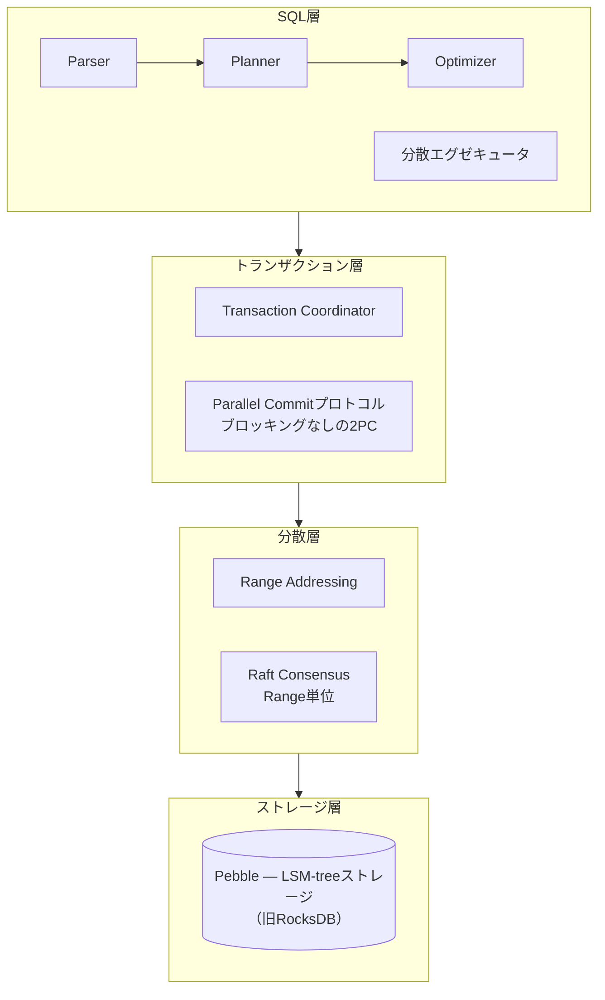
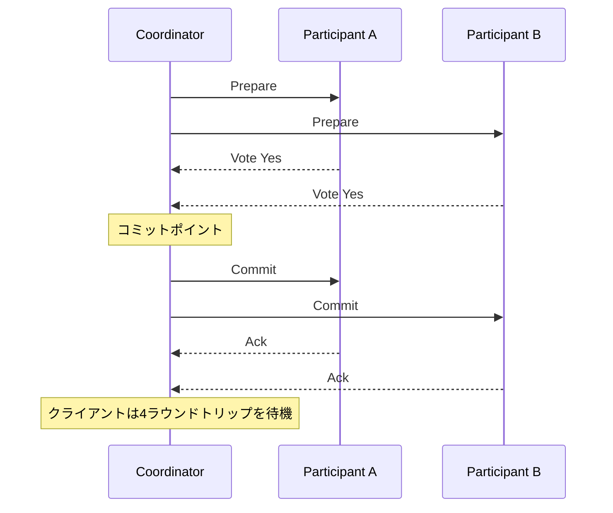
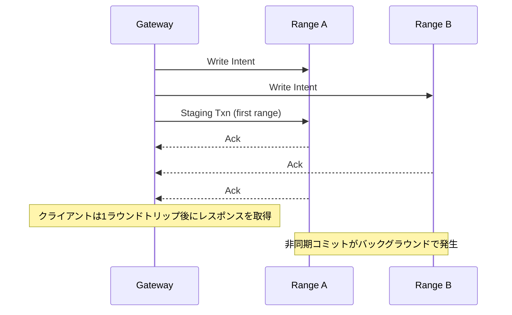
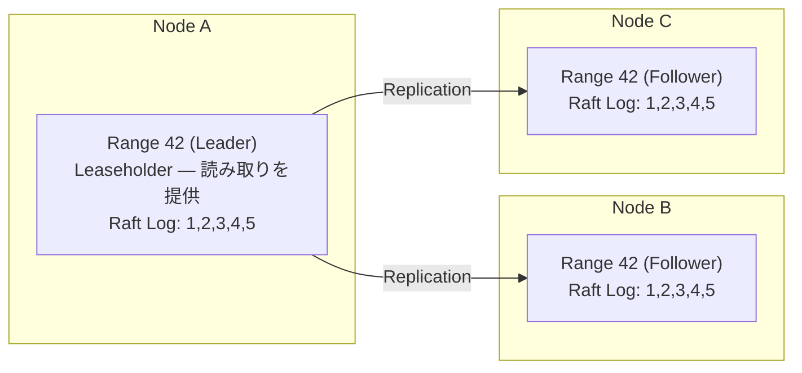
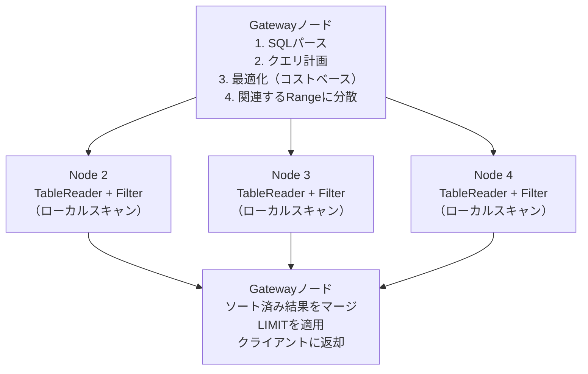

# CockroachDB: The Resilient Geo-Distributed SQL Database

> **注:** この記事は英語の原文を日本語に翻訳したものです。コードブロック、Mermaidダイアグラム、論文タイトル、システム名、技術用語は原文のまま保持しています。

## 論文概要

- **タイトル**: CockroachDB: The Resilient Geo-Distributed SQL Database
- **著者**: Rebecca Taft et al. (Cockroach Labs)
- **発表**: SIGMOD 2020
- **背景**: Spannerにインスパイアされた地理分散SQLデータベースの構築

## TL;DR

CockroachDBはオープンソースの分散SQLデータベースで、以下を提供します：
- グローバルデプロイメント全体での**シリアライザブルACIDトランザクション**
- データローカリティコンプライアンスのための**ジオパーティショニング**
- 手動介入なしの**自動シャーディングとリバランシング**
- 単一Leaderなしの**マルチアクティブ可用性**

## 課題

### クラウドデータベースの要件

```
┌─────────────────────────────────────────────────────────────────┐
│               最新アプリケーションの要件                          │
├─────────────────────────────────────────────────────────────────┤
│                                                                  │
│  1. SQL + ACIDトランザクション                                   │
│     ┌─────────────────────────────────────────────┐             │
│     │  開発者はSQLを知っている                     │             │
│     │  ビジネスロジックにはトランザクションが必要  │             │
│     │  正確性のための強い整合性                    │             │
│     └─────────────────────────────────────────────┘             │
│                                                                  │
│  2. 水平スケーラビリティ                                        │
│     ┌─────────────────────────────────────────────┐             │
│     │  ノード追加で容量を拡大                     │             │
│     │  単一障害点なし                              │             │
│     │  自動データ分散                              │             │
│     └─────────────────────────────────────────────┘             │
│                                                                  │
│  3. 地理的分散                                                  │
│     ┌─────────────────────────────────────────────┐             │
│     │  グローバルユーザーへの低レイテンシ          │             │
│     │  データレジデンシコンプライアンス（GDPR）     │             │
│     │  リージョン障害からの生存                    │             │
│     └─────────────────────────────────────────────┘             │
│                                                                  │
│  4. クラウドネイティブ                                          │
│     ┌─────────────────────────────────────────────┐             │
│     │  任意のクラウドまたはオンプレミスで実行       │             │
│     │  Kubernetesネイティブデプロイメント           │             │
│     │  成長に応じた従量課金                        │             │
│     └─────────────────────────────────────────────┘             │
│                                                                  │
└─────────────────────────────────────────────────────────────────┘
```

### なぜ既存ソリューションではだめなのか？

```
┌─────────────────────────────────────────────────────────────────┐
│               既存ソリューションの限界                            │
├─────────────────────────────────────────────────────────────────┤
│                                                                  │
│  従来のRDBMS（MySQL、PostgreSQL）:                              │
│  ┌─────────────────────────────────────────────────┐            │
│  │  ✗ 単一ノードまたはプライマリ-レプリカのみ      │            │
│  │  ✗ 手動シャーディングが複雑                     │            │
│  │  ✗ シャード間トランザクションが困難              │            │
│  └─────────────────────────────────────────────────┘            │
│                                                                  │
│  NoSQL（Cassandra、MongoDB）:                                   │
│  ┌─────────────────────────────────────────────────┐            │
│  │  ✗ 限定的なトランザクションサポート              │            │
│  │  ✗ 結果整合性の問題                             │            │
│  │  ✗ SQLなし（または限定的なSQL）                  │            │
│  └─────────────────────────────────────────────────┘            │
│                                                                  │
│  Google Spanner:                                                │
│  ┌─────────────────────────────────────────────────┐            │
│  │  ✓ 優秀、しかし...                              │            │
│  │  ✗ プロプライエタリ（GCPのみ）                   │            │
│  │  ✗ 専用ハードウェアが必要（TrueTime）            │            │
│  │  ✗ 高コスト                                     │            │
│  └─────────────────────────────────────────────────┘            │
│                                                                  │
│  CockroachDBの目標:                                             │
│  ┌─────────────────────────────────────────────────┐            │
│  │  オープンソースのSpannerライク機能               │            │
│  │  コモディティハードウェアで動作                  │            │
│  │  どこでも実行可能（任意のクラウド、オンプレミス） │            │
│  └─────────────────────────────────────────────────┘            │
│                                                                  │
└─────────────────────────────────────────────────────────────────┘
```

## アーキテクチャ

### システム概要



### データ分散

```
┌─────────────────────────────────────────────────────────────────┐
│                     レンジベースシャーディング                    │
├─────────────────────────────────────────────────────────────────┤
│                                                                  │
│  テーブル: users（プライマリキーでソート）                       │
│                                                                  │
│  ┌──────────────────────────────────────────────────────────┐   │
│  │  キースペース                                            │   │
│  │                                                           │   │
│  │  [A───────F]  [G───────L]  [M───────R]  [S───────Z]      │   │
│  │     Range 1      Range 2      Range 3      Range 4       │   │
│  │                                                           │   │
│  │  各Range: ~512MB（設定可能）                              │   │
│  │  各Range: Raftで3レプリカ                                 │   │
│  │                                                           │   │
│  └──────────────────────────────────────────────────────────┘   │
│                                                                  │
│  Rangeレプリカ配置:                                             │
│  ┌──────────────────────────────────────────────────────────┐   │
│  │                                                           │   │
│  │  Node 1          Node 2          Node 3          Node 4  │   │
│  │  ┌─────────┐    ┌─────────┐    ┌─────────┐    ┌────────┐│   │
│  │  │ R1(L)   │    │ R1(F)   │    │ R1(F)   │    │        ││   │
│  │  │ R2(F)   │    │ R2(L)   │    │         │    │ R2(F)  ││   │
│  │  │ R3(F)   │    │         │    │ R3(L)   │    │ R3(F)  ││   │
│  │  │         │    │ R4(F)   │    │ R4(F)   │    │ R4(L)  ││   │
│  │  └─────────┘    └─────────┘    └─────────┘    └────────┘│   │
│  │                                                           │   │
│  │  L = Leaseholder（読み取りを提供）                        │   │
│  │  F = Follower（Raftレプリカ）                             │   │
│  │                                                           │   │
│  └──────────────────────────────────────────────────────────┘   │
│                                                                  │
└─────────────────────────────────────────────────────────────────┘
```

## トランザクションプロトコル

### MVCCとタイムスタンプ

```python
class CockroachMVCC:
    """
    CockroachDB's Multi-Version Concurrency Control.

    Every value is versioned with a hybrid logical clock (HLC)
    timestamp, enabling lock-free reads and serializable isolation.
    """

    def __init__(self):
        self.hlc = HybridLogicalClock()

    def write(self, key: bytes, value: bytes, txn: Transaction):
        """
        Write a value with MVCC versioning.

        Format: key@timestamp -> value
        """
        # Allocate write timestamp
        timestamp = self.hlc.now()

        # Check for write-write conflicts
        latest = self.get_latest_version(key)
        if latest and latest.timestamp > txn.read_timestamp:
            # Another transaction wrote after we started
            # Must retry with higher timestamp
            raise WriteTooOldError(latest.timestamp)

        # Write intent (uncommitted version)
        intent = WriteIntent(
            key=key,
            value=value,
            timestamp=timestamp,
            txn_id=txn.id,
            txn_record=txn.record_key
        )

        self.storage.put(intent)
        return timestamp

    def read(self, key: bytes, timestamp: Timestamp) -> bytes:
        """
        Read value at or before given timestamp.

        MVCC enables reads without blocking writes.
        """
        # Find latest version <= timestamp
        version = self.get_version_at(key, timestamp)

        if version is None:
            return None

        # Check if it's an intent (uncommitted)
        if version.is_intent:
            return self._handle_intent_on_read(version, timestamp)

        return version.value

    def _handle_intent_on_read(self, intent, read_timestamp):
        """
        Handle encountering an uncommitted write intent.

        Options:
        1. Wait for transaction to complete
        2. Push the transaction's timestamp
        3. Abort the blocking transaction
        """
        blocking_txn = self.get_transaction_record(intent.txn_id)

        if blocking_txn.status == 'COMMITTED':
            # Transaction committed, intent is valid
            return intent.value
        elif blocking_txn.status == 'ABORTED':
            # Transaction aborted, ignore intent
            return self.read(intent.key, read_timestamp)
        else:
            # Transaction pending - try to push
            success = self.push_transaction(
                blocking_txn,
                push_to=read_timestamp
            )
            if success:
                return intent.value
            else:
                raise IntentError("Cannot resolve intent")


class HybridLogicalClock:
    """
    Hybrid Logical Clock for CockroachDB.

    Combines physical time with logical counter
    to provide causality without TrueTime.
    """

    def __init__(self):
        self.physical_time = 0
        self.logical_counter = 0
        self.max_offset = 500  # 500ms max clock skew

    def now(self) -> Timestamp:
        """
        Get current HLC timestamp.

        HLC = (physical_time, logical_counter)
        """
        wall_time = self._get_wall_time()

        if wall_time > self.physical_time:
            self.physical_time = wall_time
            self.logical_counter = 0
        else:
            self.logical_counter += 1

        return Timestamp(self.physical_time, self.logical_counter)

    def update(self, received: Timestamp):
        """
        Update clock based on received timestamp.

        Ensures causality: if A -> B, then ts(A) < ts(B)
        """
        wall_time = self._get_wall_time()

        if wall_time > self.physical_time and wall_time > received.physical:
            self.physical_time = wall_time
            self.logical_counter = 0
        elif received.physical > self.physical_time:
            self.physical_time = received.physical
            self.logical_counter = received.logical + 1
        elif received.physical == self.physical_time:
            self.logical_counter = max(
                self.logical_counter,
                received.logical
            ) + 1
        else:
            self.logical_counter += 1

        return Timestamp(self.physical_time, self.logical_counter)
```

### Parallel Commitプロトコル

**従来の2PC:**



**CockroachDB Parallel Commit:**



### トランザクション実装

```python
class CockroachTransaction:
    """CockroachDB transaction implementation."""

    def __init__(self, gateway):
        self.gateway = gateway
        self.id = uuid.uuid4()
        self.status = 'PENDING'
        self.read_timestamp = gateway.hlc.now()
        self.write_timestamp = None
        self.intents = []  # Written keys
        self.in_flight_writes = []

    def begin(self):
        """Begin transaction."""
        # Create transaction record
        self.record = TransactionRecord(
            id=self.id,
            status='PENDING',
            timestamp=self.read_timestamp,
            in_flight_writes=[]
        )
        # Record stored on first write's range

    def read(self, key: bytes) -> bytes:
        """
        Read key within transaction.

        Uses read timestamp for consistent snapshot.
        """
        range_desc = self.gateway.lookup_range(key)
        leaseholder = range_desc.leaseholder

        # Read at transaction's read timestamp
        result = leaseholder.mvcc_read(key, self.read_timestamp)

        # Handle write-read conflict
        if result.uncertain:
            # Value written in our uncertainty window
            # Must refresh read timestamp
            self._refresh_timestamp(result.write_timestamp)
            return self.read(key)

        return result.value

    def write(self, key: bytes, value: bytes):
        """
        Write key within transaction.

        Creates write intent, not committed value.
        """
        range_desc = self.gateway.lookup_range(key)
        leaseholder = range_desc.leaseholder

        # Write intent through Raft
        intent = WriteIntent(
            key=key,
            value=value,
            txn_id=self.id,
            timestamp=self.read_timestamp
        )

        leaseholder.raft_propose(intent)
        self.intents.append(intent)

    def commit(self) -> bool:
        """
        Commit transaction using parallel commit.

        1. Stage transaction (mark as STAGING)
        2. Write intents in parallel
        3. Return to client after all acks
        4. Async: Mark COMMITTED, resolve intents
        """
        # Stage transaction record
        self.record.status = 'STAGING'
        self.record.in_flight_writes = [i.key for i in self.intents]

        first_range = self.gateway.lookup_range(self.intents[0].key)
        first_range.leaseholder.update_txn_record(self.record)

        # All intents already written, just need acks
        # Client can return after staging is durable

        # Async: Finalize commit
        self._async_finalize_commit()

        return True

    def _async_finalize_commit(self):
        """
        Finalize commit in background.

        1. Mark transaction COMMITTED
        2. Resolve all intents to committed values
        """
        # Mark committed
        self.record.status = 'COMMITTED'
        self._update_txn_record()

        # Resolve intents
        for intent in self.intents:
            range_desc = self.gateway.lookup_range(intent.key)
            range_desc.leaseholder.resolve_intent(
                intent.key,
                self.id,
                'COMMITTED'
            )

    def _refresh_timestamp(self, new_timestamp):
        """
        Refresh read timestamp to handle write-read conflicts.

        Only possible if no writes yet, or reads can be re-validated.
        """
        if self.intents:
            raise TransactionRetryError(
                "Cannot refresh with outstanding writes"
            )

        self.read_timestamp = new_timestamp + 1
```

## Raftコンセンサス

### Range単位のRaftグループ



> 各Rangeは独立したRaftグループです。数千のRange = 数千のRaftグループ。

### Leaseholder最適化

```python
class RangeLeaseholder:
    """
    Leaseholder optimization for reads.

    One replica per range holds the lease and
    serves reads without Raft consensus.
    """

    def __init__(self, range_id: int):
        self.range_id = range_id
        self.lease = None
        self.raft_log = []
        self.state_machine = {}

    def acquire_lease(self) -> bool:
        """
        Acquire range lease via Raft.

        Lease is a time-bounded lock on serving reads.
        """
        lease = Lease(
            holder=self.node_id,
            start=self.hlc.now(),
            expiration=self.hlc.now() + LEASE_DURATION
        )

        # Propose lease acquisition through Raft
        success = self.raft_propose(LeaseRequest(lease))

        if success:
            self.lease = lease
            return True
        return False

    def serve_read(self, key: bytes, timestamp: Timestamp) -> bytes:
        """
        Serve read request as leaseholder.

        No Raft required - just check local state!
        """
        # Verify we still hold lease
        if not self._is_lease_valid():
            raise NotLeaseholderError()

        # Ensure timestamp is within lease period
        if timestamp > self.lease.expiration:
            # Need to extend lease
            self._extend_lease()

        # Read from local state machine
        return self.state_machine.get(key, timestamp)

    def serve_write(self, key: bytes, value: bytes,
                    txn: Transaction) -> bool:
        """
        Serve write request.

        Writes always go through Raft.
        """
        # Propose write intent through Raft
        proposal = WriteIntentProposal(
            key=key,
            value=value,
            txn_id=txn.id,
            timestamp=txn.write_timestamp
        )

        return self.raft_propose(proposal)

    def _is_lease_valid(self) -> bool:
        """Check if our lease is still valid."""
        return (
            self.lease is not None and
            self.hlc.now() < self.lease.expiration
        )


class LeaseTransfer:
    """
    Transfer lease to optimize for locality.

    Move lease closer to where queries originate.
    """

    def transfer_lease(self, from_node, to_node, range_id):
        """
        Transfer lease from one node to another.

        Used for:
        - Follow-the-workload (move lease to query source)
        - Geo-partitioning (keep lease in correct region)
        - Load balancing
        """
        # Current leaseholder proposes transfer
        proposal = LeaseTransferProposal(
            range_id=range_id,
            from_node=from_node,
            to_node=to_node,
            new_lease=Lease(
                holder=to_node,
                start=self.hlc.now(),
                expiration=self.hlc.now() + LEASE_DURATION
            )
        )

        return from_node.raft_propose(proposal)
```

## SQL層

### 分散SQL実行



### クエリオプティマイザ

```python
class CockroachOptimizer:
    """CockroachDB's cost-based query optimizer."""

    def __init__(self):
        self.stats = TableStatistics()

    def optimize(self, query) -> PhysicalPlan:
        """
        Optimize query using cost-based optimization.

        1. Generate logical plan
        2. Explore equivalent plans
        3. Estimate costs
        4. Choose lowest cost plan
        """
        # Parse to AST
        ast = self.parse(query)

        # Build logical plan
        logical_plan = self.build_logical_plan(ast)

        # Explore equivalent plans (Cascades-style)
        memo = self.explore(logical_plan)

        # Extract best physical plan
        best_plan = self.extract_best(memo)

        return best_plan

    def estimate_cost(self, plan) -> Cost:
        """
        Estimate plan cost.

        Considers:
        - Row counts from statistics
        - Data distribution (which ranges)
        - Network hops
        - I/O costs
        """
        cost = Cost()

        for operator in plan.operators:
            if isinstance(operator, TableScan):
                rows = self.stats.estimate_rows(
                    operator.table,
                    operator.filter
                )
                cost.rows += rows
                cost.io += rows * self.COST_PER_ROW

            elif isinstance(operator, IndexScan):
                rows = self.stats.estimate_index_rows(
                    operator.index,
                    operator.bounds
                )
                cost.rows += rows
                cost.io += rows * self.COST_PER_INDEX_ROW

            elif isinstance(operator, DistributedJoin):
                # Add network cost for cross-node joins
                cost.network += self.estimate_join_shuffle(operator)

        return cost

    def locality_aware_planning(self, query) -> PhysicalPlan:
        """
        Optimize for data locality.

        - Push filters to range leaseholders
        - Minimize cross-region data movement
        - Use local indexes when possible
        """
        plan = self.optimize(query)

        # For each scan, determine which ranges
        for scan in plan.get_scans():
            ranges = self.lookup_ranges(scan.table, scan.span)

            # Group by locality (region/zone)
            by_locality = self.group_by_locality(ranges)

            # Assign scan processors close to data
            for locality, local_ranges in by_locality.items():
                processor = self.allocate_processor(locality)
                scan.assign_ranges(processor, local_ranges)

        return plan
```

## ジオパーティショニング

### リージョン別データ配置

```
┌─────────────────────────────────────────────────────────────────┐
│                   ジオパーティショニング                          │
├─────────────────────────────────────────────────────────────────┤
│                                                                  │
│  CREATE TABLE users (                                           │
│      id UUID PRIMARY KEY,                                       │
│      region STRING NOT NULL,                                    │
│      name STRING,                                               │
│      email STRING                                               │
│  ) PARTITION BY LIST (region) (                                 │
│      PARTITION us VALUES IN ('us-east', 'us-west'),             │
│      PARTITION eu VALUES IN ('eu-west', 'eu-central'),          │
│      PARTITION asia VALUES IN ('asia-east', 'asia-south')       │
│  );                                                             │
│                                                                  │
│  ALTER PARTITION us OF TABLE users                              │
│      CONFIGURE ZONE USING constraints='[+region=us]';           │
│  ALTER PARTITION eu OF TABLE users                              │
│      CONFIGURE ZONE USING constraints='[+region=eu]';           │
│  ALTER PARTITION asia OF TABLE users                            │
│      CONFIGURE ZONE USING constraints='[+region=asia]';         │
│                                                                  │
│  ┌─────────────────────────────────────────────────────────┐    │
│  │                                                          │    │
│  │   USリージョン       EUリージョン       Asiaリージョン   │    │
│  │   ┌─────────┐       ┌─────────┐       ┌─────────┐       │    │
│  │   │  users  │       │  users  │       │  users  │       │    │
│  │   │ (us-*)  │       │ (eu-*)  │       │(asia-*) │       │    │
│  │   │         │       │         │       │         │       │    │
│  │   │ 3レプ   │       │ 3レプ   │       │ 3レプ   │       │    │
│  │   │ US内    │       │ EU内    │       │ Asia内  │       │    │
│  │   └─────────┘       └─────────┘       └─────────┘       │    │
│  │                                                          │    │
│  │   GDPR準拠: EUデータはEU内に保持                         │    │
│  │   低レイテンシ: ユーザーに近いデータ                      │    │
│  │                                                          │    │
│  └─────────────────────────────────────────────────────────┘    │
│                                                                  │
└─────────────────────────────────────────────────────────────────┘
```

### ローカリティ最適化読み取り

```python
class GeoPartitioning:
    """Geo-partitioning for data locality and compliance."""

    def configure_partition(self, table: str, partition: str,
                           constraints: list):
        """
        Configure partition placement constraints.

        Constraints like [+region=us] ensure all
        replicas are in US region.
        """
        zone_config = ZoneConfig(
            constraints=constraints,
            num_replicas=3,
            lease_preferences=[['+region=us']]  # Prefer US leaseholder
        )

        self.apply_zone_config(table, partition, zone_config)

    def route_query(self, query, user_region: str) -> str:
        """
        Route query to appropriate region.

        For partitioned tables, queries on partition
        key go directly to correct region.
        """
        # Extract partition key from query
        partition_key = self.extract_partition_key(query)

        if partition_key:
            # Route to partition's region
            target_region = self.get_partition_region(partition_key)
            return self.get_gateway(target_region)
        else:
            # Global query - use closest gateway
            return self.get_closest_gateway(user_region)

    def follow_the_workload(self, range_id: int):
        """
        Automatically move leaseholder to where queries originate.

        Reduces cross-region latency for reads.
        """
        # Track query origins for this range
        query_origins = self.get_query_origins(range_id)

        # Find dominant region
        dominant_region = max(
            query_origins.items(),
            key=lambda x: x[1]
        )[0]

        # Transfer lease if not already there
        current_leaseholder = self.get_leaseholder(range_id)
        if current_leaseholder.region != dominant_region:
            target = self.find_replica_in_region(
                range_id,
                dominant_region
            )
            self.transfer_lease(range_id, target)
```

## クロックスキュー処理

### 不確実性区間

```python
class ClockSkewHandling:
    """
    CockroachDB's approach to clock skew without TrueTime.

    Key insight: Use uncertainty intervals instead of
    guaranteed clock bounds.
    """

    def __init__(self):
        self.max_offset = timedelta(milliseconds=500)

    def read_with_uncertainty(self, key: bytes,
                               read_timestamp: Timestamp) -> Result:
        """
        Read handling clock uncertainty.

        If a value was written in our uncertainty window,
        we can't be sure if it happened before or after us.
        """
        # Uncertainty window: [read_ts, read_ts + max_offset]
        uncertainty_limit = read_timestamp + self.max_offset

        # Get value at read timestamp
        value = self.mvcc_get(key, read_timestamp)

        # Check for uncertain values
        uncertain_value = self.mvcc_get_in_range(
            key,
            read_timestamp,
            uncertainty_limit
        )

        if uncertain_value:
            # Value written during uncertainty window
            # Must restart transaction with higher timestamp
            return Result(
                uncertain=True,
                write_timestamp=uncertain_value.timestamp
            )

        return Result(value=value, uncertain=False)

    def restart_on_uncertainty(self, txn: Transaction,
                               uncertain_timestamp: Timestamp):
        """
        Restart transaction after uncertainty error.

        Move read timestamp forward to clear uncertainty.
        """
        # New read timestamp is after uncertain write
        txn.read_timestamp = uncertain_timestamp + 1

        # Clear read set (must re-read everything)
        txn.read_set.clear()

        # Re-execute transaction
        return self.execute_transaction(txn)


class ClockSynchronization:
    """
    Clock synchronization strategies.

    CockroachDB relies on well-synchronized clocks.
    """

    def configure_clock_sync(self):
        """
        Configure clock synchronization.

        Options:
        1. NTP with tight tolerances
        2. PTP (Precision Time Protocol)
        3. Cloud provider time services
        """
        # Cloud providers offer synchronized clocks:
        # - AWS: Amazon Time Sync Service
        # - GCP: Compute Engine NTP
        # - Azure: Virtual Machine time sync

        # Configure max offset based on sync quality
        self.max_offset = self.measure_clock_offset()

    def adjust_for_clock_skew(self, cluster_max_offset: float):
        """
        Trade-off: lower offset = less uncertainty,
        but requires better synchronization.

        Default: 500ms (safe for most deployments)
        With good sync: 100-250ms
        """
        self.max_offset = cluster_max_offset
```

## 自動運用

### Rangeの分割とマージ

```python
class RangeManagement:
    """Automatic range splitting and merging."""

    def __init__(self):
        self.max_range_size = 512 * 1024 * 1024  # 512MB
        self.min_range_size = 128 * 1024 * 1024  # 128MB

    def check_and_split(self, range_id: int):
        """
        Split range if too large.

        Automatic - no manual intervention needed.
        """
        range_size = self.get_range_size(range_id)

        if range_size > self.max_range_size:
            # Find split point (middle key)
            split_key = self.find_split_key(range_id)

            # Propose split through Raft
            self.raft_propose_split(range_id, split_key)

    def check_and_merge(self, range_id: int):
        """
        Merge adjacent ranges if too small.

        Reduces overhead of many small ranges.
        """
        range_size = self.get_range_size(range_id)

        if range_size < self.min_range_size:
            # Find adjacent range
            adjacent = self.get_adjacent_range(range_id)

            if adjacent and self.can_merge(range_id, adjacent):
                self.raft_propose_merge(range_id, adjacent)


class RebalancingScheduler:
    """Automatic replica rebalancing."""

    def rebalance(self):
        """
        Continuously rebalance replicas across nodes.

        Goals:
        - Even distribution of ranges per node
        - Even distribution of leaseholders
        - Respect zone constraints
        - Minimize rebalancing traffic
        """
        while True:
            # Find imbalanced nodes
            node_loads = self.get_node_loads()

            overloaded = [n for n in node_loads if n.load > self.avg_load * 1.1]
            underloaded = [n for n in node_loads if n.load < self.avg_load * 0.9]

            for src in overloaded:
                if not underloaded:
                    break

                dst = underloaded.pop()

                # Find range to move
                range_to_move = self.select_range_to_move(src)

                # Move replica
                self.move_replica(range_to_move, src, dst)

            time.sleep(60)  # Check every minute

    def respect_constraints(self, range_id: int, target: Node) -> bool:
        """
        Check if target respects zone constraints.

        Cannot move replica to node that violates
        locality constraints.
        """
        zone_config = self.get_zone_config(range_id)

        for constraint in zone_config.constraints:
            if not target.matches(constraint):
                return False

        return True
```

## 主要な結果

### パフォーマンス

```
┌─────────────────────────────────────────────────────────────────┐
│                   CockroachDBパフォーマンス                       │
├─────────────────────────────────────────────────────────────────┤
│                                                                  │
│  スループット（YCSBベンチマーク）:                               │
│  ┌─────────────────────────────────────────────────────────┐    │
│  │  - 読み取り重視（95%読み取り）: ~120K ops/sec（3ノード）│    │
│  │  - 書き込み重視（50%書き込み）: ~50K ops/sec（3ノード） │    │
│  │  - ノード数に比例して線形スケール                       │    │
│  └─────────────────────────────────────────────────────────┘    │
│                                                                  │
│  レイテンシ:                                                     │
│  ┌─────────────────────────────────────────────────────────┐    │
│  │  - 単一リージョン読み取り:  1-2ms                       │    │
│  │  - 単一リージョン書き込み:  5-10ms                      │    │
│  │  - リージョン間書き込み:    ~RTT + 10ms                 │    │
│  │  - Parallel Commit:         ~50%レイテンシ削減           │    │
│  └─────────────────────────────────────────────────────────┘    │
│                                                                  │
│  可用性:                                                         │
│  ┌─────────────────────────────────────────────────────────┐    │
│  │  - 単一ノード障害からの生存:  はい                       │    │
│  │  - AZ障害からの生存:          はい（3+ AZの場合）       │    │
│  │  - リージョン障害からの生存:  はい（3+リージョンの場合） │    │
│  │  - リカバリ時間:              秒単位（Raftリーダー選出）  │    │
│  └─────────────────────────────────────────────────────────┘    │
│                                                                  │
└─────────────────────────────────────────────────────────────────┘
```

## 影響とレガシー

### インパクト

```
┌──────────────────────────────────────────────────────────────┐
│                   CockroachDBのインパクト                      │
├──────────────────────────────────────────────────────────────┤
│                                                               │
│  Spannerの民主化:                                            │
│  ┌─────────────────────────────────────────────────────┐     │
│  │  - オープンソース（BSL、オープンに移行中）          │     │
│  │  - コモディティハードウェアで動作（TrueTime不要）   │     │
│  │  - クラウド非依存（任意のクラウド、オンプレミス）   │     │
│  └─────────────────────────────────────────────────────┘     │
│                                                               │
│  主要イノベーション:                                         │
│  ┌─────────────────────────────────────────────────────┐     │
│  │  - Parallel Commit（2PCレイテンシの削減）            │     │
│  │  - TrueTimeなしの因果関係のためのHLC                │     │
│  │  - 自動Range管理                                    │     │
│  │  - SQL互換性（PostgreSQLワイヤプロトコル）          │     │
│  └─────────────────────────────────────────────────────┘     │
│                                                               │
│  採用:                                                       │
│  ┌─────────────────────────────────────────────────────┐     │
│  │  - DoorDash、Netflix、Boseなど                      │     │
│  │  - クラウドオファリング（CockroachDB Serverless）   │     │
│  │  - 成長するNewSQLカテゴリー                         │     │
│  └─────────────────────────────────────────────────────┘     │
│                                                               │
└──────────────────────────────────────────────────────────────┘
```

## 重要なポイント

1. **すべての人のためのSpanner**: TrueTimeなしのシリアライザブルな地理分散SQLです
2. **レンジベースシャーディング**: シンプルなモデル、自動分割/マージです
3. **Range単位のRaft**: 独立したコンセンサスグループが水平にスケールします
4. **Leaseholder最適化**: Raftラウンドトリップなしで読み取りを提供します
5. **Parallel Commit**: パイプラインにより2PCレイテンシを削減します
6. **因果関係のためのHLC**: 論理クロックは専用ハードウェアなしで動作します
7. **ジオパーティショニング**: データレジデンシコンプライアンスが組み込みです
