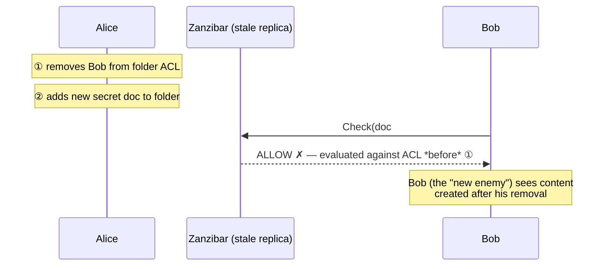
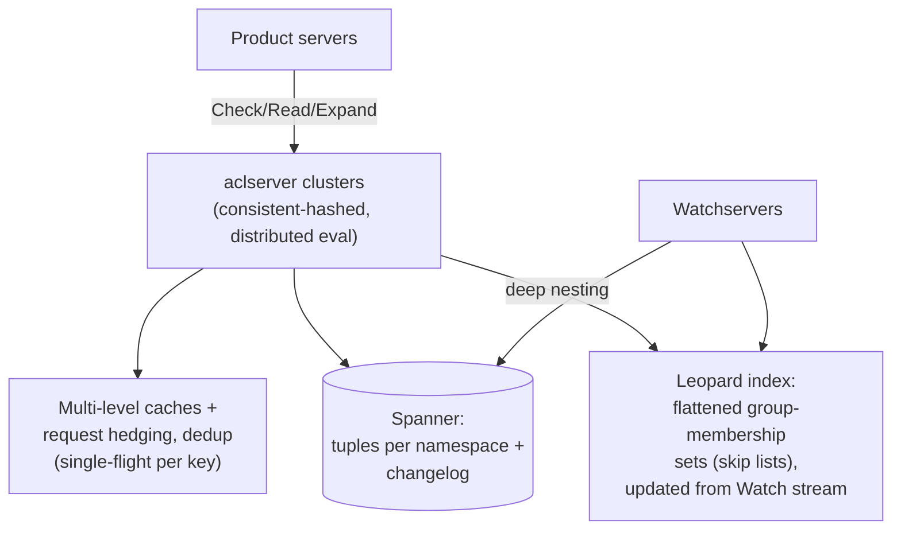

# Zanzibar: Googleの一貫したグローバル認可システム

> **翻訳についての注記:** 本ドキュメントは英語原文 `09-whitepapers/11-zanzibar.md` を日本語に翻訳したものです。コードブロックおよびMermaidダイアグラムは原文のまま維持しています。

## 論文概要

- **タイトル**: Zanzibar: Google's Consistent, Global Authorization System
- **著者**: Ruoming Pang, Ramón Cáceres, Mike Burrows, et al. (Google)
- **発表**: USENIX ATC 2019
- **背景**: Calendar、Cloud、Drive、Maps、Photos、YouTubeのための単一の認可システム — 数兆のACL、数百万QPS、そしてどのキャッシュも破ってはならない正しさの要件

## TL;DR

Zanzibarは権限を**関係タプル**(`object#relation@user`)としてSpannerに保存し、「ユーザーUはオブジェクトOに対してRできるか?」をグラフ到達可能性問題として答えます。アプリケーションごとの設定は**userset書き換えルール**(owner ⊆ editor ⊆ viewer、親フォルダ継承)です。最も深い貢献は整合性です: **new-enemy問題** — 古いACLの読み取りにより、直前に剥奪されたユーザーが新しいコンテンツを見られてしまう — を、SpannerのTrueTime順序を利用してコンテンツのバージョンをACLのバージョンに固定するスナップショットトークン、**zookie**で防ぎます。サービングアーキテクチャ(積極的なキャッシング+深くネストしたグループのための**Leopard**インデックス)は数百万QPSでp95約10ms、3年間で99.999%の可用性を達成しました。現代のすべてのReBACシステム — SpiceDB、OpenFGA、Ory Keto — はこの論文の実装です。

---

## 問題

すべてのGoogleプロダクトが同じプリミティブ — *このプリンシパルはこのリソースに対してこの操作を許可されているか?* — を**すべてのリクエストで**評価する必要があります。権限はユーザーが絶えず編集し、共有の意味論はプロダクト境界をまたぎます(Drive経由でGroupに共有されたDocがCalendarに埋め込まれる)。プロダクトごとの認可はN個の一貫しないエンジンと相互運用性ゼロを生みます。統一サービスを難しくする要件:

1. **順序保証を伴う正しさ** — 権限変更の因果順序の尊重(核心。後述)。
2. **柔軟性** — Driveのフォルダ継承、YouTubeのpublic/unlisted/private、Cloud IAMのロール、すべてをひとつのデータモデルで。
3. **高スケールでの低レイテンシ** — 認可は*すべて*のクリティカルパスに座ります。論文は2兆超のタプルとピーク約1,000万QPSを報告(トラフィックの約99%は読み取りのチェック)。
4. **可用性** — 認可が落ちればすべてが落ちる: 3年間の観測で99.999%。

---

## データモデル: タプル+書き換え

```
⟨tuple⟩ ::= ⟨object⟩ '#' ⟨relation⟩ '@' ⟨user⟩
object  ::= namespace ':' object_id
user    ::= user_id | userset            (userset = object#relation — the nesting trick)

doc:readme#owner@user:10
doc:readme#parent@folder:specs
folder:specs#viewer@group:eng#member     ← "members of group:eng", not a single user
```

タプルのuserフィールドに別の**userset**を許すことが、グループのネストとフォルダツリーを自然にします — ACLグラフが自己参照するのです。名前空間ごとの**userset書き換えルール**が計算される関係を定義します:

```yaml
relation: viewer
rewrite:
  union:
    - this: {}                                  # direct viewer tuples
    - computed_userset: {relation: editor}      # editors are viewers
    - tuple_to_userset:                         # inherit from parent folder
        tupleset: {relation: parent}
        computed_userset: {relation: viewer}
```

`Check(doc:readme#viewer@user:bob)` はこの式木の再帰評価です — 直接の参照 ∪ editorチェック ∪ (親を見つけ → そのviewerをチェック) — つまり分散グラフのポインタ追跡です。APIの表面は小さく、事実上のReBAC標準になりました: **Check**、**Read/Write**(タプル。オブジェクト単位の楽観的並行性制御付き)、**Expand**(監査のための完全な実効userset)、**Watch**(下流インデックスのための変更ストリーム — 権限のための[CDC](../13-data-pipelines/04-change-data-capture.md))。

---

## new-enemy問題とzookie

論文で最も鋭いアイデア。レプリケート・キャッシュされたACLでは、2つの古い読み取りの交錯がセキュリティを破ります:



(鏡像のケース: コンテンツを保存してからACLを*狭める* — 新しいACLが古いコンテンツを支配しなければならない。)修正は「常に新鮮に読む」ではありません(それはキャッシングとレイテンシ予算を放棄します)。**有界の、*コンテンツを認識した*古さ**です:

- すべてのACL書き込みはSpannerでTrueTimeタイムスタンプ付きでコミットされます([Spanner](./04-spanner.md)が外部整合性を提供 — Aliceの2つの行為の因果順序はタイムスタンプに保存されます)。
- クライアントはコンテンツを保存するとき、Zanzibarに**zookie** — 現在のスナップショットを符号化した不透明トークン — を要求し、*コンテンツと一緒に*永続化します。
- そのコンテンツへのすべての `Check` はzookieを運びます: *このタイムスタンプ以上のスナップショットで評価せよ*。レプリカは、スナップショットが十分新しければキャッシュから応答**してよく**、そうでなければ読み通します。

結果: キャッシュとレプリカはどこにでも、しかしどのチェックも、それが守るコンテンツより古いACLを決して使いません。あらゆる認可(あるいはキャッシュ)設計に一般化する教訓: **剥奪に敏感な読み取りには新鮮さの床が必要で、その床は守るデータとともに旅をするべきです**([スケールする認可](../10-security/07-authorization-patterns.md)、[整合性モデル](../01-foundations/04-consistency-models.md))。

---

## サービングアーキテクチャ



読み取り過多で正しさが致命的なあらゆるサービスに持ち帰れる詳細:

- **キャッシュを意識したルーティング付きの分散評価:** Checkはサブ問題を(object, relation)でコンシステントハッシュされたaclserverへファンアウトします。ホットなサブ問題(「Uはgroup:engのメンバーか?」)は同じサーバーのキャッシュに当たり、実行中の同一サブチェックは重複排除されます(single-flight)。ホットスポット緩和、遅いSpannerレプリカへの[ヘッジドリード](../06-scaling/10-retries-timeouts-hedging.md)、thundering herdへのロックテーブルが残りを担います。
- **Leopard**は病的なケースを扱います: 深くネストしたグループは無制限の再帰ファンアウトを意味するため、グループメンバーシップの到達可能性を平坦化された集合へ**事前計算**し(推移閉包。Watchストリームから数秒以内に増分更新)、クエリ時に交差します — [リストフィルタリングの逆引きインデックス](../10-security/07-authorization-patterns.md)と同じ「高価な経路を実体化する」一手です。
- **ホットスタンバイ読み取り:** レイテンシが致命的なチェックは短い遅延の後に別レプリカへ第二のリクエストを発行します — [The Tail at Scale](../06-scaling/10-retries-timeouts-hedging.md)直系のテールレイテンシ工学です。
- 報告された性能: ピーク約1,000万QPS、チェックのp50約3ms / p95約10ms、99.999%可用性 — zookieの整合性保証*込み*で達成された数字であることが要点です。

---

## システム設計への影響

- **ReBACは共有形の権限のデフォルトモデルになり**、オープンソースエコシステム(SpiceDB、OpenFGA、Ory Keto、Permify)はこの論文のAPIをほぼ逐語的に実装しています — タプル、書き換え、zookie相当(SpiceDBのZedToken)、Watchストリーム。
- **インフラとしての認可:** N個のアプリケーションから、一貫し観測可能でレイテンシSLOを持つひとつのサービスへ認可を引き抜くことを、この論文が正当化しました — 惑星規模の[PDP/PEPアーキテクチャ](../10-security/07-authorization-patterns.md)です。
- **パターンとしての整合性トークン:** 「データを支配するスナップショットトークンをデータとともに運ぶ」は認可を超えて一般化します — read-your-writesのセッショントークン、[CDC](../13-data-pipelines/04-change-data-capture.md)のウォーターマーク、キャッシュ新鮮さの床は同じ形です。
- 順序を再導出せずSpannerのTrueTimeの**上に**構築した — 外部整合なストレージは、他の保証を安価に築ける基盤であるという想起です([Spanner](./04-spanner.md))。

## 参考文献

- [Zanzibar: Google's Consistent, Global Authorization System (USENIX ATC '19)](https://www.usenix.org/conference/atc19/presentation/pang)
- [Spanner: Google's Globally-Distributed Database](./04-spanner.md) — ストレージとTrueTimeの基盤
- [SpiceDB](https://authzed.com/docs) / [OpenFGA](https://openfga.dev/docs) — オープンソース実装。注釈付き論文解説あり
- [スケールする認可](../10-security/07-authorization-patterns.md) — この論文の実務者向けコンパニオン
