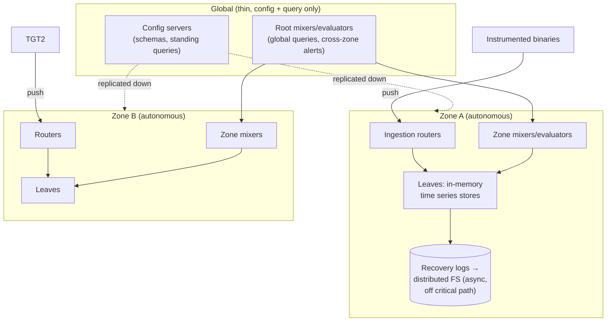

# Monarch: Googleの惑星規模インメモリ時系列データベース

> **翻訳についての注記:** 本ドキュメントは英語原文 `09-whitepapers/12-monarch.md` を日本語に翻訳したものです。コードブロックおよびMermaidダイアグラムは原文のまま維持しています。

## 論文概要

- **タイトル**: Monarch: Google's Planet-Scale In-Memory Time Series Database
- **著者**: Colin Adams, Luis Alonso, Benjamin Atkin, et al. (Google)
- **発表**: VLDB 2020
- **背景**: Borgmon(Prometheusが再実装したシステム)の後継。Google全体のモニタリング — モニタリング自身の依存先のモニタリングを含む

## TL;DR

Monarchは、**意図的に整合性より可用性を、永続ストレージよりメモリを選ぶ**珍しいデータベースです。ワークロードがモニタリングだからです: メトリクスが必要なのはまさに障害の最中であり、監視対象のインフラ(永続ストレージ、グローバルコンセンサス)に依存するモニタリングシステムは、それと*一緒に*落ちます。設計: **リージョン化されたアーキテクチャ**(孤立しても動き続ける自律的なゾーン)+薄いグローバルなクエリ/設定プレーン。インメモリのリーフストアへの**プッシュ型**収集。一級の**分布(ヒストグラム)値**とexemplarを持つ**リッチな型付きデータモデル**。そしてクエリはデータの在処へ**プッシュダウン**される木として実行され、全レベルで集約されます。報告された規模: 約40万タスクにまたがるRAM約950TB、毎秒テラバイト級の取り込み — そして教訓(ゾーンの自律、プッシュダウン、事前集約、値としてのヒストグラム)は以後のすべての本格的なメトリクス基盤を形づくりました。

---

## 問題: モニタリングは運命を共有できない

Borgmon(Googleの第一世代メトリクスシステム、2003年頃)はプル型収集、メトリクスクエリ言語、アラートルールを開拓しました — Prometheusが公開した系譜です。しかし運用負担を各チームに押し付け(自分のBorgmonを自分で運用・シャーディング)、後継にはスケールより難しい制約がありました:

> モニタリングシステムは、**監視対象のシステムより少ない依存**を持たねばならず、それらが故障しているまさにそのときに有用であり続けなければならない。

このひとつの要件が論文のすべての異例な選択を駆動します:

| 従来のDBの本能 | Monarchの選択 | 理由 |
|---|---|---|
| 永続書き込み(WAL、レプリケートされたディスク) | **インメモリ**。ログはリカバリ用にクリティカルパスの*外*へ | (それ自体Monarchに監視される)ストレージスタックを書き込み依存にできない([WAL](../03-storage-engines/04-write-ahead-logging.md)の反転) |
| 強整合、グローバル協調 | **ゾーンごとの自律**、結果整合なグローバルビュー | 分断がリージョンのモニタリングを盲目にしてはならない([CAP](../01-foundations/03-cap-theorem.md): 意図的なAPシステム) |
| 正規化し、生で保存し、クエリ時に集約 | **収集時・取り込み時に集約** | 惑星規模の生データへのクエリ時集約は支払い不能 |
| プル型スクレイプ(Borgmon/Prometheus) | 計装対象からの**プッシュ** | プルはモニターが全ターゲットを追跡し到達することを要求する — インシデント中に壊れる発見とネットワークの依存 |

---

## アーキテクチャ: 自律的なゾーン、薄いグローバルプレーン

- **リーフ**は時系列をRAMに保持し、ターゲットキー(cluster/job/task…)の**辞書順レンジパーティション**でシャーディングされます — レンジシャーディングはジョブのタスク群を同居させ、支配的なクエリ形(「このゾーンのこのサービス」)をローカルで安価にします([パーティショニング戦略](../02-distributed-databases/05-partitioning-strategies.md))。
- **ゾーンの自律:** 各ゾーンは独立に取り込み、保存し、アラートを評価し、クエリに応えます。グローバル層はゾーン横断クエリと設定配布を加えるだけで、到達不能でもゾーンはモニタリングとアラートを続けます。これは可観測性に適用された[セル思考](../06-scaling/11-cell-based-architecture.md)です — ゾーンの爆発半径、そしてモニタリング特有のひねりとして、*アラート経路がゾーン内に留まる*こと。
- **WALではなくリカバリログ:** 書き込みはメモリからACKされ、ログは再起動リカバリのためだけに非同期で分散ストレージへ流れ、システムはログの不可用に耐えます。耐久性は知っていて犠牲にされています — 数秒のメトリクス喪失は許容でき、ストレージインシデント中に取り込めないことは許容できないのです。

## データモデル: 型付き系列と一級のヒストグラム

Monarchの系列は**スキーマ化**されています: ターゲットスキーマ(発信主体 — job、task、cluster)とメトリクススキーマの結合、型付きの値カラム。論文を生き延びた2つの帰結:

1. **分布型の値。** 系列の1点が*ヒストグラム*(バケット化された分布+count+sum、バケットをトレース/RPCの実例に結ぶ**exemplar**付き)でありえます。レイテンシを(job, region)ごとの分布として記録する — 事前計算されたパーセンタイルゲージではなく — ことがパーセンタイル計算を合成可能にします: タスク横断でヒストグラムを集約して*から*p99を計算できます。タスクごとのp99の平均は統計的に無意味です。すべての現代スタック(Prometheusのネイティブヒストグラム、OpenTelemetryの指数ヒストグラム)がこれを採用しました([メトリクスとモニタリング](../11-observability/02-metrics-monitoring.md))。
2. **カーディナリティは希望ではなくスキーマと集約で管理。** 高カーディナリティのキー(ユーザーID)は設定されたロールアップで収集時に集約除去されます。システムは[カーディナリティ爆発](../11-observability/02-metrics-monitoring.md)を、宣言され予算化された決定にします。

## クエリ実行: 末端までプッシュダウン

クエリ(リレーショナル風のパイプライン: filter → align → join → group)は**ストレージ階層を鏡映する木**として実行されます: ルートmixerがゾーンmixerへ、ゾーンmixerがリーフへファンアウトし、**各レベルが評価できる限りのクエリを評価します** — フィルタと部分集約は*リーフで*起き、ネットワークを渡るものは事前縮約済みです。**field hintsインデックス**(どのフィールド/値がどこに存在するかのコンパクトなブルーム風インデックス)でファンアウトを枝刈りすれば、惑星規模のクエリは関係するリーフにしか触れません。**standingクエリ**(アラートのワークロード — N秒ごとの同じクエリ)はさらに強くプッシュダウンされます: ゾーンまたはリーフレベルで継続評価され、アラートのレイテンシと可用性はグローバルプレーンにまったく依存しません。

メトリクスをはるかに超えて適用できる一般教訓: *計算をデータへ動かす*([MapReduceと同じ議論](./01-mapreduce.md))、*走ると分かっているクエリは事前集約する*、*常時稼働のワークロード(アラート)をアドホックなものより構造的に安くする*。

---

## システム設計への影響

- **APモニタリング論は今や正統です:** 結果整合なグローバルビューを伴うリージョン自律は、本格的な可観測性プラットフォームの構造であり、「モニタリングはサービングスタックと運命を共有してはならない」はこの論文が武装させた設計レビューの質問です([SLOとエラーバジェット](../11-observability/05-slos-error-budgets.md)はメトリクスパイプラインがインシデントを生き延びることに依存します)。
- **プッシュvsプルは宗教でなくなった:** Monarchは惑星規模+運命共有の懸念がインプロセスバッファ付きプッシュを支持する*理由*を文書化し、プルはクラスタ規模では優秀であり続けます(Prometheus)。OTelのコレクタープッシュパイプラインは業界の中道です。
- **exemplar付きヒストグラム**は標準のレイテンシ表現になり、ついにメトリクスをトレースに接続しました([分散トレーシング](../11-observability/01-distributed-tracing.md))。
- リーフ/mixerのプッシュダウン木は、すべての現代メトリクス/OLAPフェデレーション層(Thanos/Mimir/M3はどれもこれと韻を踏む)の祖先だと分かります。

## 参考文献

- [Monarch: Google's Planet-Scale In-Memory Time Series Database (VLDB 2020)](https://www.vldb.org/pvldb/vol13/p3181-adams.pdf)
- [SRE Book, ch. 10: Practical Alerting from Time-Series Data](https://sre.google/sre-book/practical-alerting/) — Borgmonの祖先史
- [Prometheus](https://prometheus.io/docs/introduction/overview/) — 対比のための、オープンソースのBorgmon系譜
- [メトリクスとモニタリング](../11-observability/02-metrics-monitoring.md) / [アラート](../11-observability/04-alerting.md) — 実務者向けコンパニオン
