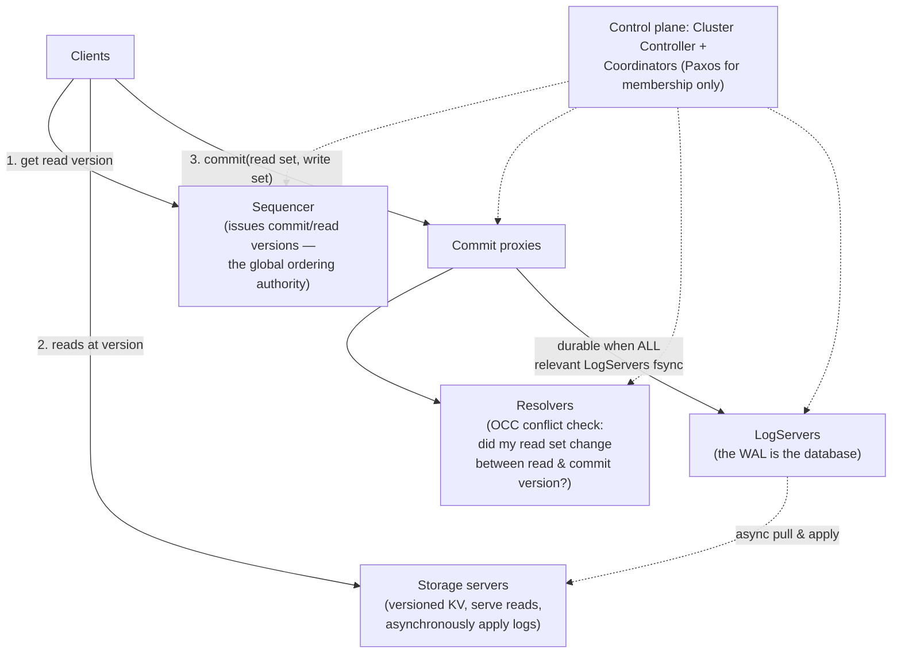
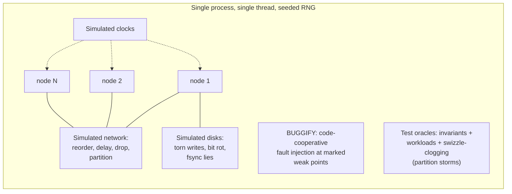

# FoundationDB: 分散・アンバンドル・トランザクショナルKVストア

> **翻訳についての注記:** 本ドキュメントは英語原文 `09-whitepapers/13-foundationdb.md` を日本語に翻訳したものです。コードブロックおよびMermaidダイアグラムは原文のまま維持しています。

## 論文概要

- **タイトル**: FoundationDB: A Distributed Unbundled Transactional Key Value Store
- **著者**: Jingyu Zhou, Meng Xu, Alexander Shraer, et al. (Apple、Snowflake、FoundationDBコミュニティ)
- **発表**: ACM SIGMOD 2021 (システム自体は2009年から。2018年オープンソース化)
- **背景**: AppleのCloudKit、Snowflakeのメタデータを支える厳密直列化可能なKVコア — データモデルより*テストのやり方*で有名

## TL;DR

FoundationDBは2つの賭けをし、どちらも当たりました。**アーキテクチャ:** トランザクションシステム(インメモリMVCC+楽観的並行性制御)、ログシステム(耐久性の真実)、ストレージシステム(ログの非同期レプリカ)を分離する*アンバンドル*設計 — それぞれが独立にスケール・復旧し、「データベース」は実のところ、**レイヤー**(レコード、ドキュメント、キュー、グラフ)がより豊かなモデルを築くトランザクショナルな基盤です。**方法論:** 分散システム全体が**シミュレーション**の中で決定的に動きます — 単一プロセス、模擬されたネットワーク/ディスク/クロック、容赦ない障害注入 — 何週間分もの集中的な災害テストが毎晩走り、バグはシードから再現し、チームは有名にも、その下の機械よりデータベースを信頼しています。シミュレーションのアイデアは少なくともデータベースと同じくらい影響力がありました: 決定論的シミュレーションテスト運動(Antithesis、TigerBeetleのVOPR、分野としての「DST」)の種です。

---

## アーキテクチャ: データベースをアンバンドルする

モノリシックなデータベースは、クエリ処理・並行性制御・ロギング・ストレージをひとつのプロセスに結合します。FDBはそれらを独立にスケール可能な役割に引き離します:

- **トランザクション:** MVCC読み取り+OCC書き込みによる厳密直列化可能性。クライアントはスナップショットバージョンで読み、read+writeセットを提出します。**リゾルバ**は、読んだキーのどれかがreadバージョン以降に変更されていればコミットを拒否します(ロックフリー、abort-and-retry — [楽観派](../01-foundations/02-isolation-levels.md))。正直に受け入れられたコスト: トランザクションには上限(約5秒、10MB)があります。長いトランザクションはOCCの競合窓とMVCCの保持を爆発させるからです。
- **コンセンサスは隔離されている。** Paxosはコントロールプレーン(メンバーシップ/調整)にだけ現れます。*データパス*は順序付けにシーケンサーを、耐久性に同期ログレプリケーションを使います — コミットごとのコンセンサスより少ない往復で、その代償はより込み入ったリカバリの舞です([コンセンサスアルゴリズム](../02-distributed-databases/08-consensus-algorithms.md)を外科的に使い、どこにでも使わない)。
- **速く失敗し、速く回復する:** トランザクションシステムのどの障害も、トランザクションサブシステム全体の完全だが*安価な*再構築(新しいsequencer/proxies/resolvers、ログ復旧)を数秒でトリガーします — リカバリは例外ハンドラではなく、一級の設計された経路です。その間、ストレージサーバーは読み取りを提供し続けます。この「だましだまし動くよりクラッシュして再構成」の直観は、後に[メタステーブル障害の文献](../06-scaling/10-retries-timeouts-hedging.md)が形式化したあらゆる場所に現れます。
- **レイヤー:** コアは順序付きKV+トランザクションだけを公開します — クエリ言語なし、スキーマなし。より豊かなモデル(protobufスキーマとインデックスを持つAppleのRecord Layer。ドキュメント、キュー、グラフのレイヤー)は、すべての操作がトランザクションにコンパイルされる*ステートレスなライブラリ*です。データモデルをトランザクショナル基盤からアンバンドルすることは、[レイクハウス](../13-data-pipelines/05-lakehouse-table-formats.md)が分析に対して行ったのと同じ一手です — そして、猛烈にテストされたひとつのコアが多くのプロダクトを安全に支えられる理由です。

---

## 本当の貢献: 決定論的シミュレーションテスト

FDBは*シミュレーションファースト*で作られました: データベースが存在する前に、チームは**Flow**(async/actorプリミティブで拡張されたC++)を作り、システム全体 — すべてのノード、その間のネットワーク、ディスク、クロック — が**1つのOSプロセス**の中で決定的なコルーチンとして動くようにしました:

これが買うもの、そしてなぜ考えを変えたか:

- **再現性:** すべての実行はランダムシードの関数です。10億の模擬イベントの後に見つかった失敗が*正確に*リプレイされます — 分散システムデバッグの最も痛い性質が、構造によって解決されます。
- **時間圧縮:** 模擬時間はCPUの許す限り速く進み、静かな待機はコストゼロです。論文の言い方: 何年分もの「不運な」本番シナリオ — ディスク破損中のリカバリ中のカスケード分断 — が毎晩行使されます。
- **協調的障害注入(`BUGGIFY`):** コード自身が怖い隅をマークし(「このバッファが早くフラッシュされたら?」)、シミュレーションが確率的にそれを発火させます — 内部知識を持つ敵対的テストで、ブラックボックスのカオスよりはるかに鋭い([カオスエンジニアリング](../15-deployment/05-disaster-recovery.md)の精密誘導の親戚)。
- **文化:** 新しいエンジニアは本番に触れる前にシミュレータを壊します。プロトコル変更は新しいテストオラクルとともに出荷されます。チームの述べた経験 — ユーザーが見つける本番バグは*稀*で、「データベースのバグ」の多くは嘘をつくハードウェアだった — は通常の信頼関係を反転させ、機械そのものに対するエンドツーエンドのチェックサムを動機づけました。

正直な限界も文書化されています: シミュレーションは性能のリグレッションを捕まえられず(正しさのみ)、障害モデルの忠実度に依存し、*すべて*の非決定性がシミュレータを通る規律(裸のスレッドなし、生のシステムコールなし)を要求します — Flowを形づくった制約であり、後継者(TigerBeetleのZig製VOPR、Antithesisのハイパーバイザレベル決定性、各種DSTスイート)がそれぞれの方法で解いている制約です。

---

## システム設計への影響

- **DSTは運動になりました。** 「あなたの分散システムは任意の失敗をシードからリプレイできますか?」は今やインフラチームの本気の面接質問であり、Antithesisはシミュレーションファーストで書かれなかったシステムのためにこのアイデアを製品化しました。
- **テンプレートとしてのアンバンドル:** ログを真実の源とするcompute/log/storage分離は、クラウドネイティブデータベースの至る所に再登場します([Aurora](./09-aurora.md)は別方向から同じ賭けをしました: 「ログがデータベースである」)。
- **限界に正直な、スケールするOCC:** FDBは有界トランザクションと明示的なホットキー/競合トレードオフ付きの厳密直列化可能性を実証しました — 後続システムが*自分の*選択を説明するのに使う設計語彙です([分散トランザクション](../02-distributed-databases/07-distributed-transactions.md))。
- **レイヤーが「基盤としてのデータベース」を正当化:** CloudKit、Snowflakeメタデータ、Record Layerは、猛烈にテストされた1つのトランザクショナルコア+ステートレスなモデルレイヤーがN個の特注ストレージエンジンに勝つことを示しました — 技術と同じくらい組織の教訓です。

## 参考文献

- [FoundationDB: A Distributed Unbundled Transactional Key Value Store (SIGMOD '21)](https://www.foundationdb.org/files/fdb-paper.pdf)
- [FoundationDB testing documentation & Flow](https://apple.github.io/foundationdb/testing.html) — シミュレーションフレームワーク一次資料
- [FoundationDB Record Layer (SIGMOD '19)](https://www.foundationdb.org/files/record-layer-paper.pdf) — CloudKit規模でのレイヤー実践
- ["Testing Distributed Systems w/ Deterministic Simulation" (Will Wilson, Strange Loop)](https://www.youtube.com/watch?v=4fFDFbi3toc) — アイデアを広めたトーク
- [Aurora](./09-aurora.md) / [Spanner](./04-spanner.md) — 「ログとクロックはどこに住むべきか?」への兄弟解
