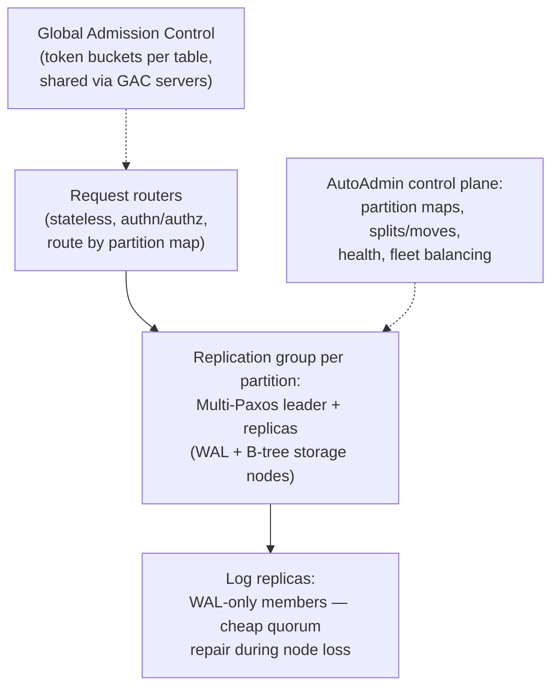

# Amazon DynamoDB (2022): プロダクトとしての予測可能性

> **翻訳についての注記:** 本ドキュメントは英語原文 `09-whitepapers/14-dynamodb-2022.md` を日本語に翻訳したものです。コードブロックおよびMermaidダイアグラムは原文のまま維持しています。

## 論文概要

- **タイトル**: Amazon DynamoDB: A Scalable, Predictably Performant, and Fully Managed NoSQL Database Service
- **著者**: Mostafa Elhemali, Niall Gallagher, et al. (Amazon)
- **発表**: USENIX ATC 2022
- **背景**: 2007年のDynamo論文から15年 — そしてほぼ全面的な哲学の反転。Amazon小売、Alexa、数十万の顧客テーブルを動かすサービスが、10年のマルチテナント運用の教訓を語る

## TL;DR

2022年論文の静かな爆弾: **DynamoDBはDynamoではありません**。[2007年論文](./02-dynamo.md)のリーダーレス・結果整合・ゴシップベースの設計は — 運用上あまりに鋭利で — 放棄され、**パーティションごとのMulti-Paxosリーダー付きレプリケーショングループ**、選択可能な強整合、そして難しい仕事を担うコントロールプレーンに置き換えられました。論文の実際のテーゼは一語です: **予測可能性**。マルチテナントデータベースのプロダクトはピーク性能ではなく、*どんな規模でも一貫した1桁ミリ秒レイテンシ*であり、それは次を要求します: パーティション別割り当てから**グローバルアドミッション制御**へ進化した流入制御(静的なパーティション分割は偏りを罰するから)、観測された熱で駆動される自動的な**消費量ベースの分割**、容量計算を顧客から完全に取り除く**オンデマンド**モード、そして耐久性を継続的な*検証*の問題として扱うこと(全域のチェックサム、継続的なリストアテスト、プロトコルへの形式手法 — TLA+)。「フルマネージド」が管理する側に何を要求するかの、最良の公開記録です。

---

## Dynamo (2007) から DynamoDB (2022) へ

| | Dynamo 2007 | DynamoDB 2022 |
|---|---|---|
| レプリケーション | リーダーレス、sloppy quorum、hinted handoff | **レプリケーショングループごとのMulti-Paxosリーダー** |
| 整合性 | 結果整合。ベクタークロック、アプリ側マージ | リクエストフラグで強整合か結果整合か選択。マージすべき競合なし |
| メンバーシップ | ゴシップ、ピアツーピア | 中央コントロールプレーン(AutoAdmin) |
| 運用性 | 各チームが自分のリングを運用 | フルマネージドの単一マルチテナントフリート |
| 競合の物語 | ショッピングカートのマージ([競合解決](../02-distributed-databases/04-conflict-resolution.md)) | パーティションごとのシングルライター([リーダー選出](../02-distributed-databases/09-leader-election.md)) |

リーダーレスからの撤退が教訓です: 結果整合性はマージの複雑さをすべてのアプリケーションチームに押し付け、サービスごとのゴシップベースのリング運用は*組織的に*スケールしませんでした。パーティショングループごとのリーダー+本物のコントロールプレーンは、理論上のピーク可用性を、顧客がより価値を置くもの — 理解可能性と一様な挙動 — と交換しました([シングルリーダーレプリケーション](../02-distributed-databases/01-single-leader-replication.md)が運用の理由で勝つ)。

### 一枚のアーキテクチャ

盗む価値のある2つの詳細: **ログレプリカ**(B-treeを持たず直近のWALだけを保存するアクセプタ)により、レプリケーショングループはフルコピーに分かかる耐久性クォーラムの回復を数秒で行えます — *耐久性の修復*(緊急、安価)と*容量の修復*(遅い、バックグラウンド)の区別です。そしてリクエストルーターはコントロールプレーンの**パーティションマップ**を引きます — データベース規模の[薄いルーターのパターン](../06-scaling/11-cell-based-architecture.md)です。

---

## 論文の心臓部: アドミッション制御 vs 偏り

DynamoDBはプロビジョンドスループット(RCU/WCU)を売ります。素朴な実装 — テーブルの容量をパーティション間で静的に分割 — がサービス最悪の顧客痛点を生み、論文はその修正を段階で語ります:

1. **静的なパーティション別割り当て**(当初): 10パーティションの10K WCUテーブルは各1K。現実のトラフィックは偏り、時間で変動するため([ホットキー](../02-distributed-databases/05-partitioning-strategies.md))、顧客は支払った容量*未満*でスロットルされ — ホットパーティションの分割は事態を悪化させました(容量がさらに割られる: **スループット希釈**)。
2. **バースト+適応容量:** パーティションにノード上の未使用余裕を使わせ(バースト)、テーブルの予算をホットなパーティションへ反応的に再配分。改善、だが遅延あり。
3. **グローバルアドミッション制御(GAC):** テーブルの予算は*論理的に中央の*トークンバケット(GACサービス)に住み、リクエストルーターはそこから補充されるローカルなサブバケットを保持します。流入制御はテーブルレベルかつ即時になり — パーティションはもはや容量の単位ではなく、配置の単位にすぎません。ノードレベルのトークンバケットは同居テナントを守るバックストップとして残ります。
4. **消費量ベースの分割:** パーティションは(サイズだけでなく)*観測されたアクセス熱*で分割され、キー分布を考慮した分割点を選びます — そして分割が役立たないとき(単一ホットアイテム、既にキースペース全体に広がるアクセス)はシステムが分割を*辞退*します。
5. **オンデマンド:** GAC+熱駆動分割が揃えば、容量計画自体が顧客にとって削除可能になります — システムが観測し、余裕を事前確保し、リクエスト単位で課金します。

この弧はすべてのマルチテナントシステムに一般化します: **静的に分割された予算は常に偏りに負ける。アドミッション制御はグローバルでありたく、強制はローカルでありたい**([レートリミット](../06-scaling/05-rate-limiting.md)、[マルチテナンシー](../06-scaling/12-multi-tenancy.md) — AWS規模で解かれたノイジーネイバー問題です)。

## 継続的プロセスとしての耐久性と正しさ

- **すべてにチェックサム**(全ログエントリ、メッセージ、アーカイブオブジェクト)。WALは切り詰め前にS3へアーカイブ([3-2-1思考](../15-deployment/05-disaster-recovery.md))。
- **継続的検証:** アーカイブ済みデータは常時バックグラウンドプロセスとして*再読・再検証*され、ライブレプリカと突き合わされます — 耐久性は持つ性質ではなく行う活動である、というのが論文の立場です([リストアテスト](../15-deployment/05-disaster-recovery.md)の制度化)。
- **形式手法:** 中核のレプリケーション/リカバリプロトコルはTLA+で仕様化されモデル検査されます。著者らは、本番前の微妙なバグの捕捉と — 同じくらい重要なことに — 変更を*安全に進化*させられることをその功績に挙げます。仕様が見られない実装の隙間には障害注入テストを併用。
- **グレー障害への対処:** ルーターとレプリカは「リーダーが落ちた」という疑念に基づいて行動する前に互いの接続性をクロスチェックし、[グレー障害](../01-foundations/06-failure-modes.md)が引き起こす偽フェイルオーバーの乱流を減衰させます。
- **静的安定性:** アベイラビリティゾーン障害の間、データプレーンはコントロールプレーンを必要とせず、キャッシュ済みパーティションマップと既存リースで継続します — AWSが説く[静的安定性のドクトリン](../06-scaling/09-multi-region-architecture.md)を、旗艦データベースが実践しています。

---

## システム設計への影響

- **「ピークより予測可能性」**は本格的なマルチテナントプラットフォームの公言された設計目標になりました — どんな規模でもp99の*一様性*がプロダクトであり、バースト→適応→グローバルアドミッション制御はこの論文が文書化した標準のエスカレーション経路です。
- **リーダーレスからの撤退**は2007年論文を再構成しました: Dynamoのアイデア(コンシステントハッシュ、クォーラム、マージ意味論)は基礎的な*概念*であり続けますが、運用の判決 — リーダー+強いコントロールプレーンによる調整のほうが正直に運用しやすい — は今やマネージドデータベースのデフォルトです。
- **検証としての耐久性**(継続的チェックサム監査、リストア訓練、形式仕様)は、インフラ工学文化でエキゾチックから期待値へ移りました。
- [Aurora](./09-aurora.md)と[FoundationDB](./13-foundationdb.md)とともに、現代の三連画を完成させます: ログを分離し、コンセンサスを隔離し、賢さはデータプレーンではなくコントロールプレーンに担わせること。

## 参考文献

- [Amazon DynamoDB: A Scalable, Predictably Performant, and Fully Managed NoSQL Database Service (USENIX ATC '22)](https://www.usenix.org/conference/atc22/presentation/elhemali)
- [Dynamo: Amazon's Highly Available Key-value Store (2007)](./02-dynamo.md) — 祖先、そしてこの論文を面白くする対比
- [How Amazon web services uses formal methods (CACM 2015)](https://cacm.acm.org/research/how-amazon-web-services-uses-formal-methods/) — §6の背後のTLA+実践
- [セルベースアーキテクチャ](../06-scaling/11-cell-based-architecture.md) / [マルチテナンシー](../06-scaling/12-multi-tenancy.md) — この論文のアドミッション制御の物語が体現するパターン
