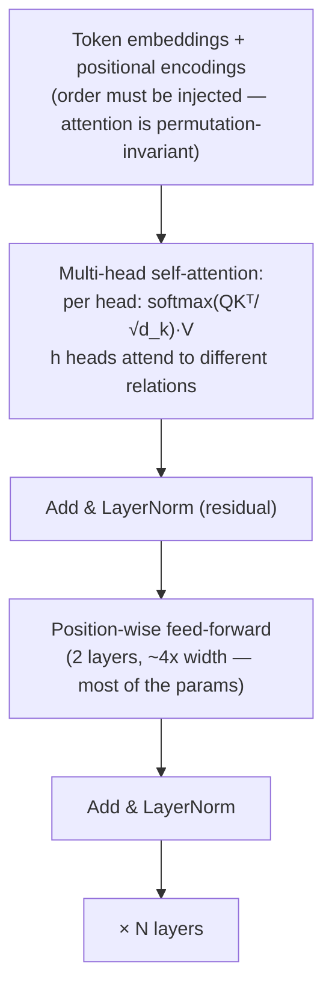

# Attention Is All You Need: Transformer

> **翻訳についての注記:** 本ドキュメントは英語原文 `09-whitepapers/15-attention-transformers.md` を日本語に翻訳したものです。コードブロックおよびMermaidダイアグラムは原文のまま維持しています。

## 論文概要

- **タイトル**: Attention Is All You Need
- **著者**: Ashish Vaswani, Noam Shazeer, Niki Parmar, Jakob Uszkoreit, Llion Jones, Aidan Gomez, Łukasz Kaiser, Illia Polosukhin (Google Brain / Research)
- **発表**: NeurIPS 2017
- **背景**: 機械翻訳のために提案され、実質的にすべての現代AIの基盤になった — それゆえこのフィールドブックの2つのセクションの基盤でもある

## TL;DR

Transformerはシーケンスモデルから再帰を取り除き、**自己注意(self-attention)**で置き換えました: すべてのトークンが他のすべてのトークンに直接注意を向けて自分の表現を計算し、それを並列に行います。この一手は、O(n)の*逐次的*依存をO(n²)の*並列化可能な*計算と交換しました — まさにGPUが望んでいた取引です — そしてスケーリングの時代を解錠しました: より大きなモデル、より大きなデータ、予測可能なリターン(スケーリング則)。システムの読者にとってこの論文が重要なのは、このアーキテクチャが今日のワークロード*そのもの*だからです: 注意のn²項とトークンごとの**KVキャッシュ**が、[LLMサービング](../17-llm-systems/05-llm-infrastructure.md)がなぜメモリ帯域律速なのか、なぜプリフィルとデコードが別のレジームなのか、コンテキストウィンドウのコストがなぜああなのか、そして10年のシステム研究(FlashAttention、PagedAttention、MQA/GQA、MoE)がなぜ本質的にこの論文の2つのコスト項への戦役なのかを決めています。

---

## 何を置き換えたか、それがなぜハードウェアに重要だったか

2017年以前のシーケンスモデル(RNN/LSTM)はトークンを**一度に1つ**処理しました — ステップtはステップt−1の隠れ状態を必要とします。この逐次の鎖はモデルサイズにかかわらずGPU利用率に蓋をし、遠いトークンの情報は長い状態更新の鎖を生き延びなければなりません(消えていく文脈)。Transformerの賭け:

| | RNN/LSTM | Transformer |
|---|---|---|
| 長距離依存の経路 | O(n)ステップの状態減衰 | O(1) — 直接の注意エッジ |
| 系列方向の学習並列性 | なし(逐次) | 完全(全位置を同時に) |
| 層あたりコスト | O(n·d²) | O(n²·d)の注意 + O(n·d²)のFFN |
| ハードウェア適合 | 悪い(依存演算) | 優秀(密な行列積) |

論文の最も深い洞察は**ハードウェアの形をしています**: 漸近的に*悪い*系列コスト(n²)が勝ったのは、それがアクセラレータを飽和させる密な行列積に変換されるからです。アーキテクチャとハードウェアの相互適合はFLOP勘定に勝ちます — アクセラレータ時代を通して繰り返されてきた教訓です。

## 一周で分かる機構

各トークンは**クエリ**(何を探しているか?)、**キー**(何を含むか?)、**バリュー**(何を提供するか?)に射影されます。注意の重み = 全クエリ·キー類似度のsoftmax。出力はそれに従ってバリューを混合します。複数の**ヘッド**がこれを並列の部分空間で走らせ(こちらは統語、あちらは照応)、残差接続と正規化が100層超のスタックを学習可能にします。原型は翻訳のためのエンコーダ・デコーダでした。すべてを征服した系譜は**デコーダのみ**の変種(GPT型)です: 因果マスク付き注意で次トークンを予測する — すべての位置が学習例になり、目的関数は恥ずかしいほど自己教師ありです。

## なぜこの論文は2026年において*システム*の論文なのか

LLMインフラのすべての運用特性がこのアーキテクチャに遡ります:

- **プリフィルとデコードの非対称性。** プロンプトの処理は1回の大きな並列行列積のパス(計算律速)。生成は*出力トークンごとにスタック全体を1回*走らせます(メモリ帯域律速で、再び逐次 — 自己回帰が逐次の鎖を再導入しました。ただし推論時だけ)。これが[分離型サービング](../17-llm-systems/05-llm-infrastructure.md)が利用するために存在する2レジーム分割です。
- **KVキャッシュは、この論文のデータ構造の運用化です。** 因果注意により、生成された各トークンは過去のすべてのキー/バリューを再利用できます — それらのキャッシュは二次の再計算を避けますが、シーケンスあたり `layers × heads × d × 2 × seq_len` を費やします: PagedAttentionが仮想化し、プレフィックスキャッシングが共有し、MQA/GQAが縮め(K/Vヘッドを減らす)、[コンテキスト管理](../17-llm-systems/08-context-management.md)の予算が抑えるために存在する、あのメモリオブジェクトです。
- **コンテキスト長の価格はn²+キャッシュ項です。** 長文コンテキスト機能、プロンプトキャッシュの割引、「lost in the middle」の挙動はすべて、注意のコストとメモリが系列長でどうスケールするかの下流です。FlashAttentionの貢献はIOを意識した*厳密な*注意(タイル化でn²の中間結果をHBMの外に保つ)でした — モデルの変更ではなくシステムの修正です。
- **スケーリング則が容量計画を可能にしました。** アーキテクチャが滑らかにスケールするため、損失 vs (パラメータ、データ、計算)が予測可能になり(Kaplanらのスケーリング則、次いでChinchillaの計算最適補正) — モデル学習は予算を持つ工学の規律に、推論フリートは[ユニットエコノミクスの問題](../11-observability/06-finops-cost-engineering.md)になりました。
- **パラメータはFFNに住んでいます。** だからこそMixture-of-Experts(Shazeerのもうひとつの2017年のアイデア)は*そこ*を疎にします — 現代のMoEサービング(エキスパート並列、all-to-allルーティング)は注意の兄弟のコスト戦です。
- **エージェントスタック**さえその形を継承します: トークン入力/トークン出力の自己回帰こそ、[ハーネスエンジニアリング](../17-llm-systems/09-harness-engineering.md)がコンテキスト予算、追記のみのプロンプト、キャッシュに優しいプレフィックスに執着する理由です。

---

## システム設計への影響

- **ひとつのアーキテクチャ、すべてのモダリティ:** 言語(GPT/Claude/Geminiの系譜)、視覚(ViT)、音声、コード、タンパク質折りたたみ — 単一ワークロードへの収斂こそが、ハードウェア・ソフトウェアスタック全体(アクセラレータ、サービングエンジン、注意カーネル)がその周りで共進化できた*理由*です。
- **この本の[LLMシステム](../17-llm-systems/01-agent-fundamentals.md)セクションが扱うワークロードクラスを作りました** — Webサービングと MapReduce型分析以来の、独自のストレージ階層(HBM/KV/プレフィックスキャッシュ)、スケジューラ(連続バッチング)、障害モードを持つ最初の新しい一級データセンターワークロードです。
- **苦い教訓(bitter lesson)の立証:** 汎用アーキテクチャ+スケール+データがタスク特化の賢さに勝つ。この論文は、計算曲線と戦うのではなく*乗る*システムを設計することの、今世紀最強の単一データポイントです。
- 著者8人、引用数は今世紀の他の何をも超え — そして最も重大な一文は、それまで補助的だった機構が単独で*十分*だというタイトルの主張のままです。

## 参考文献

- [Attention Is All You Need (NeurIPS 2017)](https://arxiv.org/abs/1706.03762)
- [The Illustrated Transformer](https://jalammar.github.io/illustrated-transformer/) — Jay Alammar; 正典的なビジュアル解説
- [FlashAttention](https://arxiv.org/abs/2205.14135) / [Efficient Memory Management for LLM Serving with PagedAttention](https://arxiv.org/abs/2309.06180) — n²項とKV項へのシステムの戦役
- [Scaling Laws for Neural Language Models](https://arxiv.org/abs/2001.08361) / [Training Compute-Optimal LLMs (Chinchilla)](https://arxiv.org/abs/2203.15556)
- [LLMインフラ](../17-llm-systems/05-llm-infrastructure.md) — この論文のコスト項があなたのポケベルになる場所
