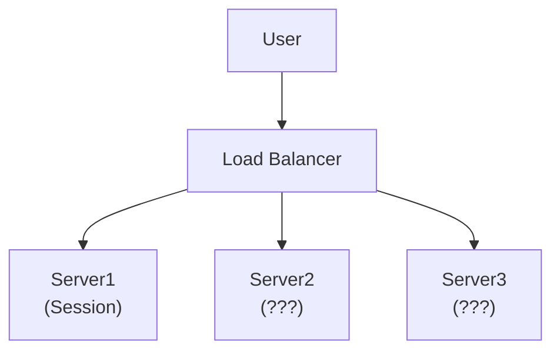
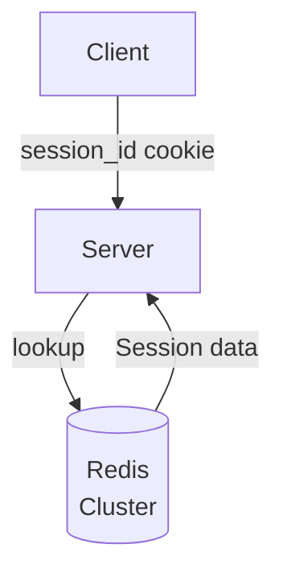
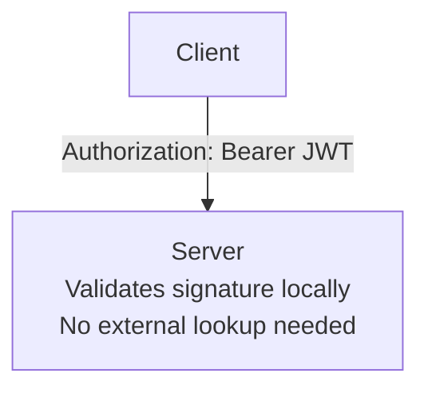
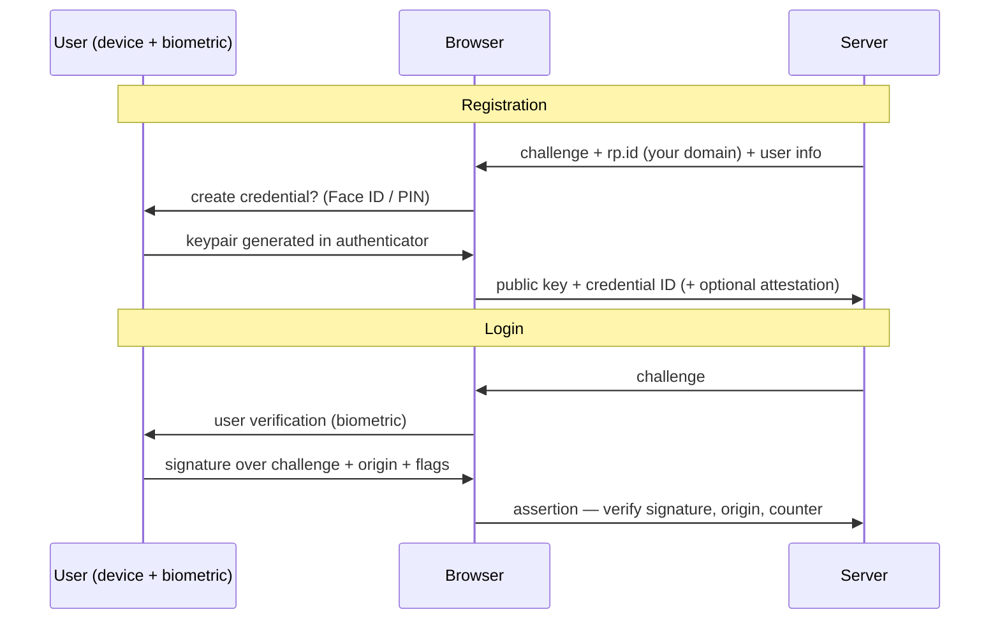
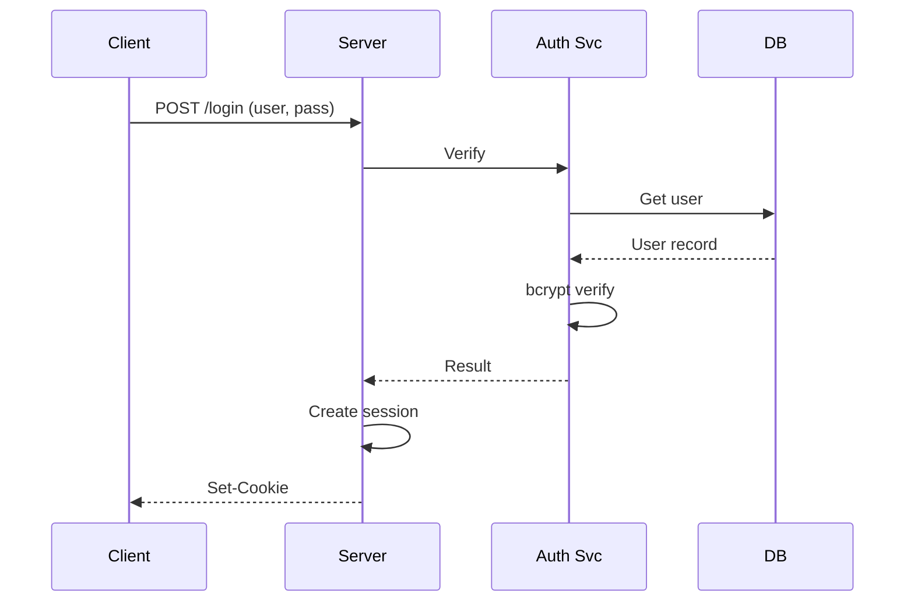
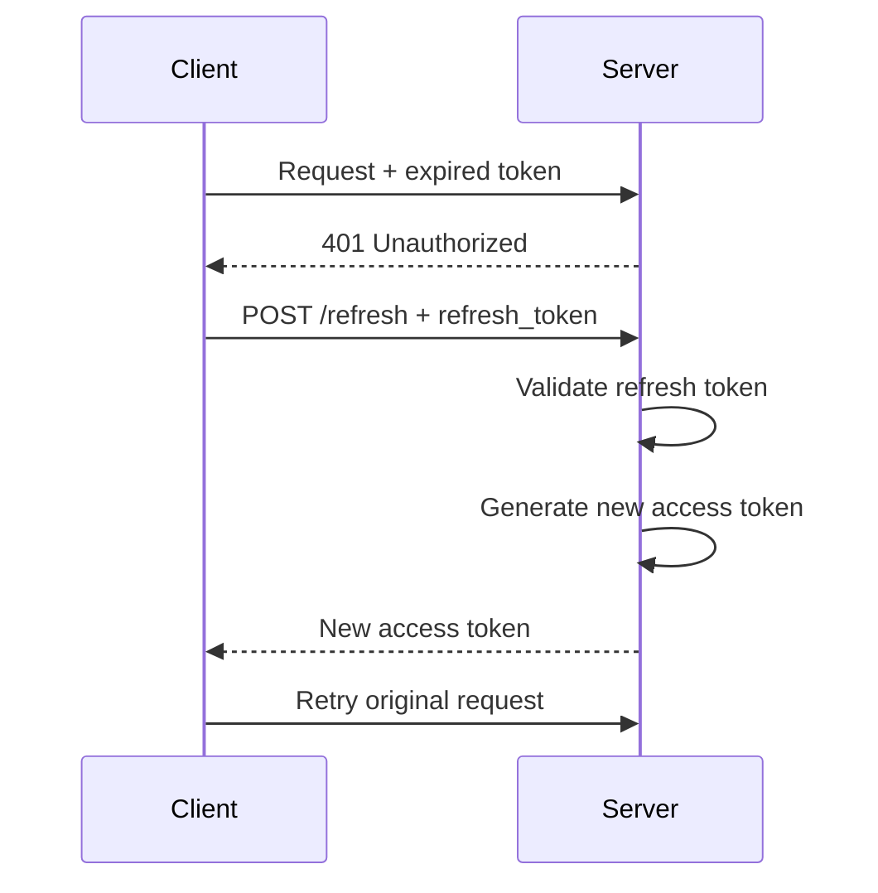

# 認証の基礎

> **Note:** This article was translated from English to Japanese. The original version is available at [`10-security/01-authentication-fundamentals.md`](../../10-security/01-authentication-fundamentals.md).

## TL;DR

認証はアイデンティティを検証します（「あなたは誰ですか？」）。分散システムにおける課題は、クレデンシャルをあらゆる場所で共有せずに安全にこれを行い、大規模なセッション管理を処理することです。

---

## 認証が解決する問題

モノリシックアプリケーションでは、認証はシンプルです：

```
1. User sends username + password
2. Server checks against database
3. Server creates session, stores in memory
4. Server returns session cookie
5. Subsequent requests include cookie
```

分散システムでは、これが破綻します：



```
Problem: Session created on Server1, but next
request goes to Server2 which has no session
```

---

## セッション管理戦略

### 戦略1：スティッキーセッション

ロードバランサーが同一ユーザーからのリクエストをすべて同じサーバーにルーティングします。

```
Implementation: Hash(user_id) → server

Pros:
- Simple implementation
- No shared state needed

Cons:
- Uneven load distribution
- Server failure loses all sessions
- Horizontal scaling is difficult
```

### 戦略2：集中型セッションストア

すべてのサーバーがセッションストア（Redis、Memcached）を共有します。



```python
# Session lookup on every request
def authenticate_request(request):
    session_id = request.cookies.get('session_id')
    if not session_id:
        return None

    # Hit Redis for every authenticated request
    session_data = redis.get(f"session:{session_id}")
    if not session_data:
        return None

    return json.loads(session_data)
```

**トレードオフ：**
- 利点：どのサーバーでもどのリクエストを処理可能
- 欠点：Redisが単一障害点になる
- 欠点：リクエストごとにレイテンシが追加される
- 欠点：Redisはユーザー数ではなくリクエストレートに応じてスケールする必要がある

### 戦略3：ステートレストークン（JWT）

トークン自体にセッションデータをエンコードします。サーバーはストレージ参照なしで検証します。



**トレードオフ：**
- 利点：セッションストレージが不要
- 利点：無限にスケール可能
- 欠点：有効期限前にトークンを無効化できない
- 欠点：クレームの増加に伴いトークンサイズが増大

---

## パスワード保存

### 平文パスワードは絶対に保存しない

```python
# WRONG - attacker dumps database, gets all passwords
password_hash = hashlib.sha256(password).hexdigest()

# WRONG - rainbow table attack
password_hash = hashlib.sha256(password + "static_salt").hexdigest()

# CORRECT - unique salt per user, slow hash function
import bcrypt
password_hash = bcrypt.hashpw(password.encode(), bcrypt.gensalt(rounds=12))
```

### なぜBcrypt/Argon2なのか？

1. **ソルト付き**：各ハッシュにランダムソルトを含む
2. **低速**：設定可能なワークファクター
3. **CPU集約型**：GPU攻撃に耐性がある（Argon2はメモリハードでもある）

```python
# Verification
def verify_password(stored_hash, provided_password):
    return bcrypt.checkpw(
        provided_password.encode(),
        stored_hash.encode()
    )
```

### ワークファクターの選択

| ワークファクター | ハッシュあたりの時間 | 攻撃者の試行回数/秒 |
|-------------|---------------|-------------------------|
| 10          | 約100ms        | 10                      |
| 12          | 約400ms        | 2.5                     |
| 14          | 約1.6s         | 0.6                     |

ハードウェアで250〜500msかかるファクターを選択してください。

---

## 多要素認証（MFA）

### 知識 + 所持

```
Factor 1: Password (knowledge)
Factor 2: One of:
  - TOTP code from authenticator app (possession)
  - SMS code (possession) - weaker, SIM swap attacks
  - Hardware key like YubiKey (possession)
  - Biometric (inherence)
```

### TOTPの実装

```python
import pyotp
import time

# Setup: Generate secret, show QR code to user
secret = pyotp.random_base32()  # Store encrypted in DB
totp = pyotp.TOTP(secret)
provisioning_uri = totp.provisioning_uri(
    name="user@example.com",
    issuer_name="MyApp"
)
# Convert provisioning_uri to QR code for user to scan

# Verification
def verify_totp(user_secret, provided_code):
    totp = pyotp.TOTP(user_secret)
    # valid_window allows for clock drift
    return totp.verify(provided_code, valid_window=1)
```

### TOTPの内部構造

```
TOTP = HMAC-SHA1(secret, floor(time / 30))

Time:    1704067200  1704067230  1704067260
Code:    847293      159462      738291
         ◄─── 30s ──►◄─── 30s ──►
```

---

## パスキー (WebAuthn / FIDO2)

パスキーは新しい認証システムの現代的なデフォルトです: オリジンに束縛された公開鍵クレデンシャルを、デバイスの生体認証/PINで解錠します。**構造的にフィッシング耐性があります** — 盗める共有シークレットが存在せず(サーバーは公開鍵のみ保存)、ブラウザは間違ったオリジンに対してクレデンシャルを行使しないため、偽ドメインのフィッシングとクレデンシャルスタッフィングを一手で殺します。



本番で重要になる設計判断:

- **同期型 vs デバイス束縛型。** コンシューマ向けパスキーはプラットフォームのキーチェーン(iCloudキーチェーン、Googleパスワードマネージャー)で同期されます — リカバリはプラットフォームアカウントに乗り、それがコンシューマでパスワードレスを成立させるものです。デバイス束縛キー(セキュリティキー、エンタープライズポリシー)はその利便性とより厳格な来歴を交換します。対象ごとに選び、**アテステーション**は認証器のモデル検証が本当に必要なとき(エンタープライズ/規制業種)だけ要求すること — コンシューマフローでは省略します。
- **Discoverableクレデンシャル**はユーザー名なしログインを可能にします(認証器が一致するアカウントを列挙)。`autocomplete="webauthn"` のconditional UIと組み合わせ、ユーザー名欄にパスキーをインライン提示します。
- **サーバー側の検査は少ないが必須:** 保存済み公開鍵での署名検証、`origin`/`rpId`、チャレンジの新鮮さ(単回使用、短TTL)、要求するならuser-verificationフラグ、提供される場合は署名カウンタの保存。
- **ロールアウトの現実:** まずパスワードと*並走*でパスキーを出荷し(ログイン成功時に登録を促す)、採用率を計測し、アカウントリカバリこそ本当の攻撃面として扱うこと — メールリセットにフォールバックするパスキー保護アカウントは、リセットフローの強度しかありません。移行期間中、パスワード利用者には[MFA](#多要素認証mfa)を維持します。パスキーは第二要素を包含します(所持+生体認証がひとつの儀式に)。

---

## ブルートフォース対策

### レート制限

```python
from redis import Redis
import time

def check_login_rate_limit(username, ip_address):
    redis = Redis()

    # Rate limit by username (prevents credential stuffing)
    user_key = f"login_attempts:user:{username}"
    user_attempts = redis.incr(user_key)
    redis.expire(user_key, 900)  # 15 minute window

    # Rate limit by IP (prevents distributed attacks)
    ip_key = f"login_attempts:ip:{ip_address}"
    ip_attempts = redis.incr(ip_key)
    redis.expire(ip_key, 3600)  # 1 hour window

    if user_attempts > 5:
        return False, "Too many attempts for this account"
    if ip_attempts > 20:
        return False, "Too many attempts from this IP"

    return True, None
```

### プログレッシブ遅延

```python
def get_delay_after_failures(failure_count):
    """Exponential backoff with jitter"""
    if failure_count < 3:
        return 0

    base_delay = min(2 ** (failure_count - 2), 300)  # Max 5 minutes
    jitter = random.uniform(0, base_delay * 0.1)
    return base_delay + jitter
```

### アカウントロックアウト

```
Attempt 1-3: Normal
Attempt 4-5: CAPTCHA required
Attempt 6-10: 15-minute soft lock
Attempt 11+: Account locked, email notification
```

---

## クレデンシャルスタッフィング防御

攻撃者は漏洩したパスワードデータベースを使用して、他のサイトでクレデンシャルを試行します。

### 検知シグナル

```python
def calculate_risk_score(request, user):
    score = 0

    # New device
    if not is_known_device(user, request.device_fingerprint):
        score += 30

    # Unusual location
    if not is_usual_location(user, request.ip_address):
        score += 25

    # Unusual time
    if not is_usual_time(user, datetime.now()):
        score += 15

    # Failed attempts recently
    score += min(get_recent_failures(user) * 10, 30)

    return score

def handle_login(request, user, password_valid):
    risk_score = calculate_risk_score(request, user)

    if password_valid:
        if risk_score > 50:
            # Require step-up authentication
            return require_mfa(user)
        return success()
    else:
        if risk_score > 70:
            # Likely automated attack
            return temporary_block()
        return invalid_credentials()
```

### Have I Been Pwned連携

```python
import hashlib
import requests

def is_password_breached(password):
    """Check against Have I Been Pwned API (k-anonymity)"""
    sha1 = hashlib.sha1(password.encode()).hexdigest().upper()
    prefix, suffix = sha1[:5], sha1[5:]

    # Send only prefix to API
    response = requests.get(
        f"https://api.pwnedpasswords.com/range/{prefix}"
    )

    # Check if our suffix is in results
    for line in response.text.splitlines():
        hash_suffix, count = line.split(':')
        if hash_suffix == suffix:
            return True, int(count)

    return False, 0
```

---

## セッションセキュリティ

### セキュアなCookie属性

```python
response.set_cookie(
    'session_id',
    value=session_id,
    httponly=True,     # Not accessible via JavaScript
    secure=True,       # Only sent over HTTPS
    samesite='Lax',    # CSRF protection
    max_age=86400,     # 24 hours
    domain='.example.com',
    path='/'
)
```

### セッション固定攻撃の防止

```python
def login(user, password):
    if not verify_password(user, password):
        return error()

    # CRITICAL: Generate new session ID after authentication
    # Prevents attacker from setting session ID before login
    old_session_id = request.cookies.get('session_id')
    new_session_id = generate_secure_session_id()

    if old_session_id:
        redis.delete(f"session:{old_session_id}")

    redis.setex(
        f"session:{new_session_id}",
        86400,
        json.dumps({'user_id': user.id})
    )

    return response.set_cookie('session_id', new_session_id)
```

### セッションハイジャックの防止

```python
def validate_session(request):
    session = get_session(request)
    if not session:
        return None

    # Validate fingerprint hasn't changed
    current_fingerprint = generate_fingerprint(request)
    if session['fingerprint'] != current_fingerprint:
        # Possible session hijacking
        invalidate_session(session['id'])
        log_security_event('session_fingerprint_mismatch', session)
        return None

    return session

def generate_fingerprint(request):
    """Create fingerprint from stable request attributes"""
    components = [
        request.headers.get('User-Agent', ''),
        request.headers.get('Accept-Language', ''),
        # Don't include IP - changes with mobile/VPN
    ]
    return hashlib.sha256('|'.join(components).encode()).hexdigest()[:16]
```

---

## 認証フロー

### 標準ログインフロー



### トークンリフレッシュフロー

```
Access Token:  Short-lived (15 min)
Refresh Token: Long-lived (7 days), stored securely
```



---

## シングルサインオン（SSO）概要

### なぜSSOなのか？

```
Without SSO:
User has credentials for: Email, CRM, HR System, Wiki, etc.
- Password fatigue → weak passwords
- Admin nightmare → provision/deprovision everywhere

With SSO:
User has one identity, accesses all systems
- One strong password + MFA
- Central access control
- Single audit log
```

### SSOプロトコル

| プロトコル | ユースケース | トークン形式 |
|----------|----------|--------------|
| SAML 2.0 | エンタープライズ、レガシー | XML |
| OAuth 2.0 | API認可 | JSON (JWT) |
| OpenID Connect | モダンな認証 | JWT |
| LDAP/Kerberos | 内部/オンプレミス | Tickets |

---

## トレードオフまとめ

| アプローチ | スケーラビリティ | 無効化 | 複雑さ |
|----------|-------------|------------|------------|
| サーバーセッション | 低（スティッキー） | 即時 | 低 |
| 集中型ストア | 中 | 即時 | 中 |
| ステートレストークン | 高 | 困難 | 中 |
| ハイブリッド（短期JWT + リフレッシュ） | 高 | ほぼ即時 | 高 |

---

## セキュリティチェックリスト

```
□ Passwords hashed with bcrypt/Argon2 (cost factor ≥ 12)
□ HTTPS everywhere (HSTS enabled)
□ Secure cookie attributes (HttpOnly, Secure, SameSite)
□ Session regeneration on authentication state change
□ Rate limiting on authentication endpoints
□ Account lockout after failed attempts
□ MFA available (ideally required)
□ Breached password detection
□ Session timeout and absolute expiry
□ Audit logging of authentication events
```

---

## 大規模セッション管理

上記の戦略は基本をカバーしていますが、本番システムは数百万の同時セッションを分散インフラ全体で管理する際に、より深い課題に直面します。

### ステートフルセッション：サーバーサイドセッションストア

ステートフルモデルでは、サーバーがすべてのセッションデータを保持します。クライアントは不透明なセッションID（通常はCookie内）のみを持ちます。これにより、サーバーがセッションのライフサイクルを完全に制御できます。

**Redisをセッションストアとして使用 — キー設計：**

```
Key:    session:{session_id}
Value:  {"user_id": "u_abc", "roles": ["admin"], "ip": "10.0.1.5", "created_at": 1710000000}
TTL:    1800  (30 minutes — sliding expiration)
```

認証済みリクエストごとに、サーバーは `GET session:{session_id}` を実行し、セッションがまだ有効であればTTLをリセットします。このスライディングウィンドウにより、アイドルセッションは期限切れになりますが、アクティブセッションは維持されます。

**ロードバランサーによるスティッキーセッション**はCookieまたはIPをハッシュして、ユーザーを特定のバックエンドに固定します。AWS ALBは `AWSALB` Cookieを使用し、NGINXは `ip_hash` または `hash $cookie_session_id` を使用します。リスク：そのバックエンドがダウンすると、セッションが失われます。スティッキーセッションは一時的な解決策です — 共有ストアが望ましいです。

**Redis Clusterを使用した分散セッションストア：**

- Redis Clusterノード間でハッシュスロットを使用してセッションを分散
- キー形式 `session:{session_id}` は自然にスロット間に分散
- セッションタイムアウトと同じTTLを設定（例：30分の場合1800秒）
- `SET ... EX`（アトミックなset-with-expiry）を使用して孤立キーを回避
- メモリ使用量を監視：約1KBのセッション100万件 ≈ 1GB

### ステートレスセッション：JWTベース

ステートレスモデルでは、トークン自体がすべてのクレームを保持します。サーバーサイドのストレージもRedis参照も不要です。サーバーは署名を検証し `exp` をチェックするだけです。

**無効化の問題：** JWTは有効期限前に無効化できません。ユーザーがログアウトしたり管理者がアクセスを取り消しても、トークンは `exp` まで有効なままです。緩和策として、短い有効期限ウィンドウやトークン拒否リスト（ステートを再導入する）があります。

### ハイブリッド：短期JWT + DBのリフレッシュトークン

これは、ほとんどのチームが最終的に収束する本番グレードのパターンです：

```
Access Token (JWT):   15-minute expiry, stateless validation
Refresh Token:        7-day expiry, stored in database, revocable
```

- アクセストークンはローカルで検証（リクエストごとのDBアクセス不要）
- リフレッシュトークンはリフレッシュ時にのみDBで確認（低頻度）
- 無効化：リフレッシュトークンの行を削除 — アクセストークンは15分以内に失効
- リフレッシュトークンローテーション：使用ごとに新しいリフレッシュトークンを発行し、古いものを無効化（古いトークンが再利用された場合にトークン盗難を検知）

### セッション固定攻撃

**攻撃フロー：** 攻撃者が有効なセッションID（例：URLパラメータやサブドメインでのCookie設定）を取得し、被害者にそのセッションIDで認証させ、認証済みセッションをハイジャックします。

**防止策：** 認証成功直後にセッションIDを必ず再生成します。古いセッションを破棄します。これは攻撃クラス全体を防止する1行の修正です。ほとんどのフレームワークは正しく設定されていれば自動的にこれを行います — 確認してください。

**追加の防御：**
- サーバーが発行していないセッションIDを拒否
- セッションをクライアントフィンガープリント（User-Agent + Accept-Language）にバインド
- セッションCookieに `SameSite=Lax` または `Strict` を設定してクロスオリジン攻撃を制限

---

## パスワード保存

> このセクションでは、上記のハッシュの基礎を本番システム向けの運用ガイダンスで拡張します。

### ハッシュアルゴリズムの選択

| アルゴリズム | 種類 | メモリハード | 推奨 |
|-----------|------|-------------|-------------|
| MD5 | 高速ハッシュ | いいえ | **絶対に不可** — GPUで毎秒約100億ハッシュ |
| SHA-256 | 高速ハッシュ | いいえ | **絶対に不可** — 速度のために設計されており、パスワード向けではない |
| bcrypt | 適応型 | いいえ | **はい** — コストファクター12以上（約400ms） |
| scrypt | 適応型 | はい | **はい** — 調整可能なCPU + メモリコスト |
| Argon2id | 適応型 | はい | **推奨** — Password Hashing Competitionの優勝者 |

**なぜMD5/SHA-256ではダメなのか？** 高速であるように設計されています。最新のGPUは毎秒数十億のSHA-256ハッシュを計算できます。パスワードハッシュはブルートフォースを非現実的にするために意図的に低速でなければなりません。

### ソルトとペッパー

**ソルト** — ユーザーごとに生成される一意のランダム値で、データベースのハッシュとともに保存されます。レインボーテーブル攻撃を防ぎ、同一のパスワードが異なるハッシュを生成することを保証します。

```
stored = "$argon2id$v=19$m=65536,t=3,p=4$<salt>$<hash>"
         ──────── algorithm params ──────  salt   hash
```

**ペッパー** — アプリケーションレベルの秘密（例：環境変数やHSMから取得）、ハッシュ前に適用：`hash(pepper + password, salt)`。ペッパーはデータベースに保存されません。DBが侵害されてもアプリサーバーが侵害されていなければ、攻撃者はペッパーなしでハッシュを解読できません。

### ハッシュアルゴリズムの移行

bcryptからArgon2id（またはコストファクターの増加）にアップグレードする際、既存のパスワードを再ハッシュすることはできません。戦略：

1. 次回のログイン成功時に、平文パスワードを新しいアルゴリズムで再ハッシュ
2. 新しいハッシュを保存し、ユーザーレコードにアルゴリズムバージョンをマーク
3. 再ログインしないユーザーの古いハッシュはそのまま（安全ですが最適ではない）

### タイミング攻撃と定数時間比較

単純な文字列比較（`==`）はタイミングの差異を通じて情報を漏洩します — 一致するプレフィックスほど時間がかかります。攻撃者はバイトごとにハッシュを推測できます。

**ハッシュ検証には常に定数時間比較を使用してください：**
- Python: `hmac.compare_digest(a, b)`
- Node.js: `crypto.timingSafeEqual(a, b)`
- Go: `subtle.ConstantTimeCompare(a, b)`

確立されたライブラリ（bcrypt、Argon2）はこれを内部で処理しますが、トークンやハッシュを手動で比較する場合は、定数時間のバリアントを使用してください。

---

## 多要素認証（MFA）

> このセクションでは、上記のMFAの基礎をプロトコルの詳細、要素の比較、リカバリーの考慮事項で拡張します。

### 3つの要素カテゴリ

| 要素 | 種類 | 例 |
|--------|------|----------|
| **知っている**もの | 知識 | パスワード、PIN、セキュリティ質問 |
| **持っている**もの | 所持 | 電話（TOTP）、ハードウェアキー（FIDO2）、スマートカード |
| **自分自身**であるもの | 固有性 | 指紋、顔認証、虹彩スキャン |

真のMFAは、少なくとも**2つの異なるカテゴリ**の要素を必要とします。2つのパスワードはMFAではありません。パスワード + TOTPコードはMFAです。

### TOTPの詳細（RFC 6238）

TOTPは共有秘密と現在時刻から6桁のコードを生成します：

```
code = HMAC-SHA1(shared_secret, floor(unix_time / 30)) mod 10^6
```

- **共有秘密**：登録時に生成され、暗号化してDBに保存、QRコードとしてユーザーに表示
- **タイムステップ**：30秒（設定可能ですが、30秒が標準）
- **クロックドリフト許容**：`T-1`、`T`、`T+1` のコードを受け入れ（±30秒ウィンドウ）
- **リプレイ防止**：ユーザーごとに最後に使用されたタイムステップを追跡。同じまたはそれ以前のステップからのコードを拒否

**弱点：** TOTPはフィッシング可能です。リアルタイムプロキシを実行する攻撃者は、コードの有効期限が切れる前にキャプチャしてリプレイできます。

### FIDO2 / WebAuthn

FIDO2（WebAuthn + CTAP2）は**公開鍵暗号方式**を使用します — クライアントとサーバー間に共有秘密はありません。

```
Registration:  Browser generates key pair → public key sent to server
Authentication: Server sends challenge → device signs with private key → server verifies
```

- **フィッシング耐性**：署名はオリジン（ドメイン）にバインドされているため、別ドメインのフィッシングサイトはリプレイできない
- **共有秘密なし**：サーバーが侵害されても、盗むものがない
- **デバイスバインド**：秘密鍵は認証器（YubiKey、Touch ID、Windows Hello）から出ることがない

### SMS OTP：最も弱い要素

SMSベースのOTPは以下に脆弱です：
- **SIMスワップ攻撃**：攻撃者がキャリアをソーシャルエンジニアリングして被害者の番号をポート
- **SS7傍受**：SMSメッセージのプロトコルレベルでの傍受
- **マルウェア**：デバイス上のSMS窃取マルウェア

より強力な要素が利用できない場合のフォールバックとしてのみSMS OTPを使用してください。NIST SP 800-63BはSMSを推奨認証器として非推奨としました。

### バックアップコードとリカバリー

バックアップコードは、MFA登録時にユーザーに表示される、事前生成された使い捨てコード（通常8〜10コード、各8文字以上）です。

**保存：** 各バックアップコードを保存前にハッシュ（bcrypt）します。ユーザーが送信したら、ハッシュして比較します。使用済みコードを消費済みとしてマークします。

**リカバリーフローは最も弱いリンクです。** 攻撃者がリカバリーフロー（例：サポートへの電話、セキュリティ質問への回答）を通じてMFAをバイパスできる場合、MFAはセキュリティを提供しません。リカバリーを強化してください：
- MFAリセットには政府発行のID確認を要求
- 必須の待機期間（24〜48時間）をメール通知付きで適用
- すべてのMFAリセットリクエストをログに記録してアラート
- 身元確認なしでサポートスタッフがMFAを電話で無効化できないようにする

---

## 認証アンチパターン

本番システムで認証セキュリティを損なう最も一般的な間違いです。

### 独自の暗号の実装

パスワードハッシュ、トークン署名、セッション管理をゼロから実装しないでください。確立された監査済みライブラリを使用してください：
- **Node.js**: passport.js, bcrypt, jose
- **Python**: Djangoの認証モジュール, Flask-Login, passlib
- **Java**: Spring Security, JJWT
- **Go**: golang.org/x/crypto/bcrypt, gorilla/sessions

カスタム実装にはほとんどの場合、微妙なバグがあります：タイミングリーク、弱い乱数性、不正なパディング。

### ローカルメモリにセッションを保存

```python
# Anti-pattern: in-process session store
sessions = {}  # Lost on restart, not shared across instances
```

マルチインスタンスデプロイメントでは失敗します。セッションはデプロイ時に消え、別のインスタンスにルーティングされたリクエストは401を受け取ります。Redis、Memcached、またはデータベースバックのセッションストアを使用してください。

### 長期間有効なアクセストークン

30日間有効なアクセストークンは、盗まれたトークンが攻撃者に30日間のアクセスを与えることを意味します。アクセストークンは短期間（15分以下）にしてください。セッション継続にはリフレッシュトークンを使用します。

### ログインエンドポイントのレート制限なし

レート制限がなければ、攻撃者は数百万のクレデンシャルの組み合わせを試行できます。これにより以下が可能になります：
- **クレデンシャルスタッフィング**：漏洩したユーザー名/パスワードのペアを大規模に試行
- **ブルートフォース**：既知のユーザー名に対してパスワードを網羅的に試行

ユーザー名とIPアドレスの両方でレート制限してください。上記の[ブルートフォース対策](#ブルートフォース対策)セクションを参照してください。

### クライアントサイド検証への信頼

クライアントサイドのチェック（JavaScriptフォームバリデーション、無効化されたボタン、隠しフィールド）は簡単にバイパスされます。すべての認証判断はサーバーで検証する必要があります：
- パスワードの複雑さ → サーバーサイドで強制
- MFAコード検証 → 常にサーバーサイド
- ロール/パーミッションチェック → クライアント状態に依存しない
- セッションの有効性 → すべてのリクエストでサーバーサイドで検証

### エラーメッセージでの情報漏洩

```
# Anti-pattern: reveals whether the username exists
"No account found with email user@example.com"
"Incorrect password for user@example.com"

# Correct: generic message regardless of failure reason
"Invalid email or password"
```

具体的なエラーメッセージにより、攻撃者は有効なユーザー名を列挙できます。無効なユーザー名と無効なパスワードに対して常に同じエラーを返してください。

---

## 参考文献

- [OWASP Authentication Cheat Sheet](https://cheatsheetseries.owasp.org/cheatsheets/Authentication_Cheat_Sheet.html)
- [NIST Digital Identity Guidelines (SP 800-63)](https://pages.nist.gov/800-63-3/)
- [Have I Been Pwned API](https://haveibeenpwned.com/API/v3)
- [RFC 6238: TOTP](https://datatracker.ietf.org/doc/html/rfc6238)
