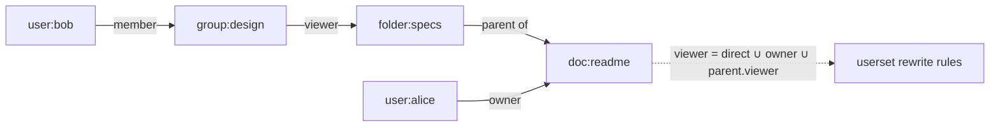
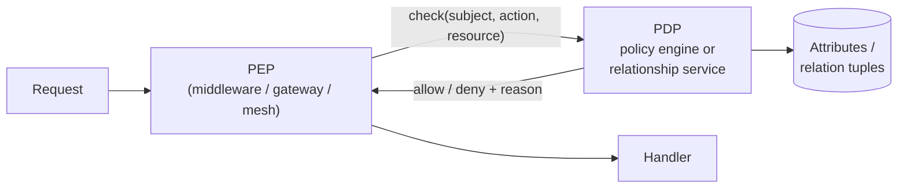

# スケールする認可

> **翻訳についての注記:** 本ドキュメントは英語原文 `10-security/07-authorization-patterns.md` を日本語に翻訳したものです。コードブロックおよびMermaidダイアグラムは原文のまま維持しています。

## TL;DR

認証は*あなたが誰か*に、認可は*あなたが何をしてよいか*に答えます — そして認可はすべてのリクエストで実行されるため、それ自体がレイテンシクリティカルかつ正しさクリティカルな分散システムです。モデルの進化: ロール爆発までは**RBAC**(ロール→権限)、文脈が重要になれば**ABAC**(属性に対するポリシー)、共有と階層がアクセスを定義するなら**ReBAC**(グラフ上の関係としての権限。GoogleのZanzibar) — 現実のシステムの多くは3つを混ぜます。アーキテクチャ的には: *判断*を集中させ(ポリシーエンジンまたは関係サービス)、*強制*を分散させ(インプロセスまたはサイドカーのPDP)、2つの難問に早期に向き合うこと — 認可データとアプリケーションデータの同期([二重書き込み問題](../05-messaging/07-outbox-pattern.md))、そして**リストフィルタリング**(「私が見られるもの全部を見せて」)。後者はクエリ整形の問題であり、リクエスト単位のcheck APIでは解決しません。

---

## モデル

### RBAC: ロールが権限を束ねる

ユーザーにロールを、ロールに権限を。理解しやすく、監査に優しく、誰もが正しくここから始めます。

```sql
-- The entire model in three joins
SELECT 1 FROM user_roles ur
JOIN role_permissions rp ON ur.role_id = rp.role_id
WHERE ur.user_id = :user AND rp.permission = 'invoice:approve';
```

RBACは**ロール爆発**で壊れます: アクセスが職務以外の何か — 地域、プロジェクト、金額、テナント — に依存し始めると、`invoice_approver_emea_under_10k` 式のロールを組み合わせ的に鋳造することになります。数百ロール後、「なぜAliceにこの権限が?」に誰も答えられません。RBACの天井は、ロールが*属性*をエンコードし始めたときです。

### ABAC: 属性に対するポリシー

判断は、主体・リソース・アクション・環境の属性に対する述語になります:

```rego
# OPA / Rego
allow if {
    input.action == "approve"
    input.resource.type == "invoice"
    input.subject.department == input.resource.department
    input.resource.amount <= input.subject.approval_limit
    time.clock(time.now_ns())[0] >= 9   # business hours, if you must
}
```

表現力が高く、集中管理できます — ポリシーはコードと独立に出荷されます。コスト: 関連するすべての属性が**判断時点で利用可能**でなければならず(レイテンシを支配するのは属性取得です)、「誰がXにアクセスできるか?」が難問になります — ポリシーは前向きには評価できても、任意の述語を監査のために反転することは一般には決定不能です。モダンなポリシー言語(形式的に解析可能なセマンティクスを持つCedar)は、監査可能性を保つために表現力を意図的に制約しています。

### ReBAC: 関係としての権限

アクセスが構造から導かれるとき — *Aliceが編集できるのは、designグループに属し、そのグループがプロジェクトのeditorで、プロジェクトがドキュメントを含むから* — それをグラフとしてモデル化します。これが**Zanzibar**、Google Drive/Docs/Cloud共有の背後にあるシステムです:

```
# Relation tuples: object#relation@subject
doc:readme#owner@user:alice
doc:readme#parent@folder:specs
folder:specs#viewer@group:design#member
group:design#member@user:bob
```



チェック(`bobはdoc:readmeをviewできるか?`)は、オブジェクト型ごとの**userset書き換えルール**(例: `viewer = 直接のviewer ∪ editor ∪ 親フォルダのviewer`)に導かれたグラフ到達可能性クエリです。継承、グループのネスト、「チームと共有」が自然に出てきます — RBACとABACが不器用にエンコードするものです。

**new-enemy問題。** Zanzibarの最も深い貢献はグラフではなく整合性です。2つの順序は決して破られてはなりません: Bobを*削除してから*フォルダに機密を追加したなら、Bobは古いACLレプリカ経由でその機密を見てはならない。コンテンツを保存してからACLを狭めたなら、新しいACLがそのコンテンツに適用されなければならない。Zanzibarはスナップショットトークン — **zookie** — で解決します: コンテンツ書き込みは現在のACLスナップショットトークンを保存し、チェックはそのトークン以上の新しさで評価されます(SpannerのTrueTime上に構築 — [Spanner](../09-whitepapers/04-spanner.md)参照)。この教訓はあなたが作るあらゆる認可キャッシュに一般化します: 有界の古さは権限の*追加*には許容でき、*剥奪*には危険です — 剥奪に敏感なチェックは新鮮さトークンに紐付けるか、古さの窓を文書化して受け入れること。

**オープンソースの後継:** SpiceDB、OpenFGA、Ory KetoがZanzibarモデルをzookie相当とともに実装しています。プライマリデータベースの中に独自の権限グラフを育てるのではなく、これらを採用してください。

### 選択(実際には: 重ね合わせ)

| | RBAC | ABAC | ReBAC |
|---|---|---|---|
| 判断基準 | ロール所属 | 属性述語 | グラフ到達可能性 |
| 適所 | 社内ツール、粗い階級 | 文脈ルール、コンプライアンス(「EUからのみ、$10k未満のみ」) | ユーザー生成の共有、階層、マルチテナントリソース |
| 壊れ方 | ロール爆発 | 属性スプロール、監査の不透明さ | 新しいステートフルサービスの運用複雑性 |
| 「なぜ許可?」 | 自明 | 難しい | グラフ上のパス(良い) |
| 「誰がXを見られる?」 | 容易 | 難しい | 逆展開(サポートあり) |

本番での典型的な混合: リソースの所有/共有はReBAC、文脈的制約はABAC述語を重ね、便利なロール形の関係(`org:acme#admin@user:alice`)としてRBACが生き残る。

---

## アーキテクチャ: PDP・PEPとレイテンシ予算

標準的な分解 — **PEP**(強制点: リクエストを許可/拒否する場所)、**PDP**(判断点: ポリシー/グラフを評価)、**PAP/PIP**(ポリシーと属性データの管理場所):



配置の選択肢をレイテンシ昇順で:

1. **インプロセスライブラリ**(組み込みOPA/Cedar、ローカルタプルキャッシュ): マイクロ秒。ただしポリシー/データの配布があなたの問題になります。
2. **サイドカーPDP**: 1ミリ秒未満のlocalhostホップ。ポリシーはコントロールプレーンが配布。サービスメッシュネイティブの選択([サイドカーパターン](../12-service-mesh/03-sidecar-pattern.md))。
3. **中央認可サービス**: *すべてのリクエスト*に1ネットワークホップ(約1〜5ms) — tier-0依存として設計しなければなりません: 積極的なキャッシュ、水平スケール、ルートごとの明示的なfail-open/fail-closedセマンティクス(アクションはfail-closed、低リスクの読み取りはしばしばログ付きfail-open — 意図的に、文書で決めること)。

実務のデフォルト: 粗いチェックは早期に(ゲートウェイ: 「このユーザーはそもそもこのテナントの一員か?」 — [APIゲートウェイ](../12-service-mesh/02-api-gateway.md))、細粒度チェックはサービスで(リソースの文脈がある場所で)。そして生の権限SQLをN個のサービスに散らばらせることは**決してしない** — それこそ認可システムが置き換えるべき監査不能なアンチパターンです。

### 認可データの同期

関係タプルはアプリケーション状態を鏡映します(`project_members` テーブル ↔ `project#member` タプル) — 古典的な二重書き込みです。アプリDBと認可サービスを別々に書けば*必ず*乖離します。[アウトボックスパターン](../05-messaging/07-outbox-pattern.md)か[CDC](../13-data-pipelines/04-change-data-capture.md)でコミット済みのアプリ変更からタプル書き込みを導出し、エンドツーエンドの遅延を監視し、new-enemyルールを忘れないこと: **剥奪こそ、遅延にアラートを張る書き込みです。**

### リストフィルタリング: 難しいクエリ

オブジェクト単位の `check()` は「このドキュメントを開く」には機能します。「4,000万件の中からAliceが見られる40件の受信箱を描画する」には機能しません。実行可能な3戦略:

| 戦略 | 方法 | トレードオフ |
|---|---|---|
| **事前展開(逆引きインデックス)** | `ユーザー → 可読オブジェクト` を実体化(ZanzibarのLeopardインデックス。SpiceDB/OpenFGAの `lookup-resources`) | 新鮮さの遅延、インデックス保守 |
| **クエリ書き換え** | PDPがDBに適用する*フィルタ*(ID集合またはSQL述語)を返す — OPAの部分評価、PostgresのRLS | 述語サイズの限界、エンジンの対応が必要 |
| **後段フィルタ** | 取得してから各件チェック | 小さい結果集合のみ。ページネーションが壊れる(1ページ目が3件に濾過されうる) |

リストフィルタリング戦略は、認可サービスを確定する**前に**決めてください — 生のcheckレイテンシよりも選択を制約します。

---

## マルチテナンシ・監査・運用

- **テナント分離は最外殻の関係。** テナンシを明示的にモデル化し(すべてのオブジェクトのグラフのルートとしての `org:acme`)、冗長に強制します — 認可層*と*データ層(行レベルセキュリティ/テナントスコープのクエリ)の両方で。クロステナント漏えいのコストは多層防御を正当化します。
- **判断ログはプロダクト要件。** すべてのdeny(とサンプリングしたallow)を主体/アクション/リソース/ポリシーバージョン/レイテンシ付きで: それが監査証跡、デバッグツール(「なぜ見えないの?」チケット)、異常検知のフィードです。
- **ポリシーはコード:** バージョン管理、レビュー、テスト(ポリシーごとの表駆動allow/denyケース。剥奪の*負*のテストを含む)、シャドーモード付きの漸進ロールアウト — 新ポリシーを旧と並走評価し、判断を差分してから切り替える。
- **キャッシュの剥奪窓を見張る。** 「剥奪された権限がまだ成功しうる最大秒数」を計測してSLOとして公開すること。セキュリティレビューは必ず聞いてきます。

---

## 参考文献

- [Zanzibar: Google's Consistent, Global Authorization System](https://research.google/pubs/pub48190/) — タプル、userset書き換え、zookie、Leopard
- [Open Policy Agent](https://www.openpolicyagent.org/docs/latest/) / [Cedar](https://www.cedarpolicy.com/) — policy-as-codeエンジン(ABAC)
- [SpiceDB](https://authzed.com/docs) / [OpenFGA](https://openfga.dev/docs) — 本番品質のZanzibarモデル実装
- [NIST RBAC](https://csrc.nist.gov/projects/role-based-access-control) / [NIST SP 800-162 (ABAC)](https://csrc.nist.gov/publications/detail/sp/800-162/final) — 形式モデル
- [Postgres Row-Level Security](https://www.postgresql.org/docs/current/ddl-rowsecurity.html) — データベース内のクエリ書き換え強制
