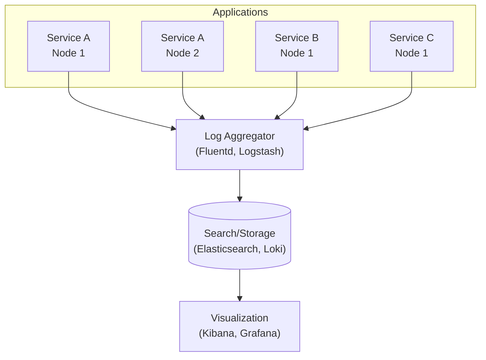
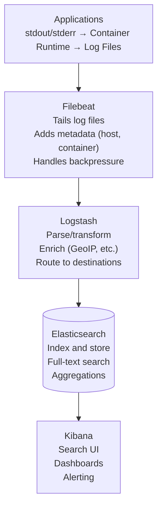
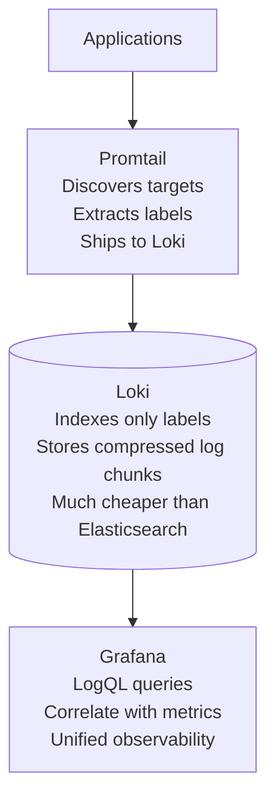
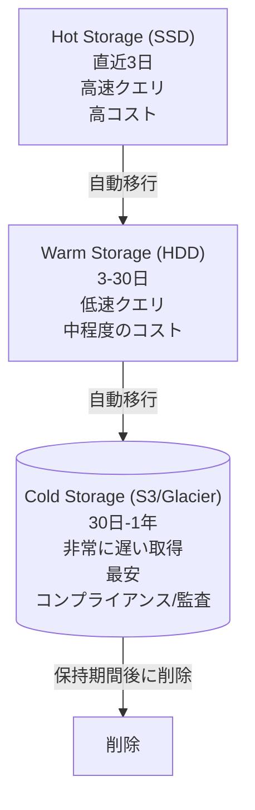

# ロギング

> **注記:** このドキュメントは英語版からの翻訳です。最新の内容や正確な情報については、[英語版オリジナル](../../11-observability/03-logging.md)を参照してください。

## 要約

ログは、イベントの不変でタイムスタンプ付きの記録です。分散システムでは、構造化データ（JSON）による集中ロギングにより、サービス横断での検索が可能になります。ログレベル、相関 ID、そして思慮深い内容が、ログをノイズではなく有用なものにします。

---

## 従来のロギングの問題

### 以前: 散在するログ

```
Service A (Node 1): app.log
Service A (Node 2): app.log
Service B (Node 1): app.log
Service B (Node 2): app.log
...

デバッグするには:
1. 各サーバーに SSH
2. ログを grep で検索
3. タイムスタンプを手動で照合
4. クラッシュしたコンテナのログを見逃す

問題: スケールしない、コンテナが死ぬとログが失われる
```

### 以後: 集中ロギング



```
現在: すべてのログを一元的に閲覧可能
```

---

## 構造化ロギング

### 非構造化 vs. 構造化

```
非構造化:
2024-01-01 10:00:00 INFO Processing order 12345 for user john@example.com, total: $99.99

問題: パースに正規表現が必要、フォーマットが不統一

構造化 (JSON):
{
    "timestamp": "2024-01-01T10:00:00.000Z",
    "level": "INFO",
    "message": "Processing order",
    "service": "order-service",
    "order_id": "12345",
    "user_email": "john@example.com",
    "total": 99.99,
    "currency": "USD",
    "trace_id": "abc123",
    "span_id": "def456"
}

メリット:
- クエリ可能なフィールド (order_id=12345)
- 一貫したパース
- 相関 (trace_id)
- 集約（合計金額の算出など）
```

### Python による構造化ロギング

```python
import structlog
import logging

# Configure structlog
structlog.configure(
    processors=[
        structlog.stdlib.filter_by_level,
        structlog.stdlib.add_logger_name,
        structlog.stdlib.add_log_level,
        structlog.stdlib.PositionalArgumentsFormatter(),
        structlog.processors.TimeStamper(fmt="iso"),
        structlog.processors.StackInfoRenderer(),
        structlog.processors.format_exc_info,
        structlog.processors.UnicodeDecoder(),
        structlog.processors.JSONRenderer()
    ],
    wrapper_class=structlog.stdlib.BoundLogger,
    context_class=dict,
    logger_factory=structlog.stdlib.LoggerFactory(),
)

logger = structlog.get_logger()

# Usage
logger.info(
    "order_processed",
    order_id="12345",
    user_id="user_789",
    total=99.99,
    items_count=3
)

# Output:
# {"event": "order_processed", "order_id": "12345", "user_id": "user_789",
#  "total": 99.99, "items_count": 3, "level": "info",
#  "timestamp": "2024-01-01T10:00:00.000000Z"}
```

### コンテキストバインディング

```python
# 以降のすべてのログに適用されるコンテキストをバインド
logger = logger.bind(
    service="order-service",
    environment="production",
    version="1.2.3"
)

# リクエストスコープのコンテキスト
def handle_request(request):
    request_logger = logger.bind(
        request_id=request.id,
        user_id=request.user.id,
        trace_id=get_trace_id()
    )

    request_logger.info("request_started", path=request.path)

    try:
        result = process(request)
        request_logger.info("request_completed", status="success")
    except Exception as e:
        request_logger.error("request_failed", error=str(e), exc_info=True)
        raise
```

---

## ログレベル

### 標準レベル

```
TRACE   非常に詳細、通常は本番環境では無効
DEBUG   開発者向けの診断情報
INFO    正常な動作イベント
WARN    潜在的に問題のある状況
ERROR   アプリケーションを停止させないエラー
FATAL   重大なエラー、アプリケーションが終了する可能性

本番環境: 通常 INFO 以上
開発環境: DEBUG 以上
トラブルシューティング: 動的に DEBUG/TRACE を有効化可能
```

### 各レベルの使い分け

```python
# TRACE: 非常に冗長、通常は無効
logger.trace("entering_function", function="calculate_price", args=args)

# DEBUG: 開発者に有用、本番環境ではノイズが多い
logger.debug("cache_lookup", key="user_123", hit=True)

# INFO: 通常のビジネスイベント
logger.info("order_created", order_id="123", total=99.99)
logger.info("user_logged_in", user_id="456")

# WARN: 予期しないが処理された事象
logger.warn("retry_attempt", attempt=2, max_attempts=3, reason="timeout")
logger.warn("deprecated_api_used", endpoint="/v1/users", suggested="/v2/users")

# ERROR: 何かが失敗した
logger.error("payment_failed", order_id="123", error="card_declined")
logger.error("database_connection_failed", host="db.example.com", exc_info=True)

# FATAL: アプリケーションが続行できない
logger.fatal("configuration_missing", required_key="DATABASE_URL")
```

### 動的ログレベル

```python
import os
import logging

def configure_logging():
    # 環境変数からデフォルトレベルを取得
    default_level = os.environ.get('LOG_LEVEL', 'INFO')

    # ロガーごとのオーバーライド
    logging.getLogger('sqlalchemy').setLevel('WARNING')  # ORM を静かに
    logging.getLogger('urllib3').setLevel('WARNING')     # HTTP クライアントを静かに
    logging.getLogger('myapp.payments').setLevel('DEBUG') # デバッグ用に詳細表示

# ランタイムでのレベル変更（本番環境のデバッグに有用）
def set_log_level(logger_name: str, level: str):
    logging.getLogger(logger_name).setLevel(level)
    logger.info("log_level_changed", logger=logger_name, new_level=level)
```

---

## 相関とコンテキスト

### リクエスト相関

```python
import uuid
from contextvars import ContextVar

# リクエストスコープのコンテキスト
request_id_var: ContextVar[str] = ContextVar('request_id', default='')
user_id_var: ContextVar[str] = ContextVar('user_id', default='')

class CorrelationMiddleware:
    def __init__(self, app):
        self.app = app

    async def __call__(self, scope, receive, send):
        # リクエスト ID を取得または生成
        request_id = scope.get('headers', {}).get(
            b'x-request-id',
            str(uuid.uuid4()).encode()
        ).decode()

        # コンテキストに設定
        request_id_var.set(request_id)

        # レスポンスヘッダーに追加
        async def send_wrapper(message):
            if message['type'] == 'http.response.start':
                headers = list(message.get('headers', []))
                headers.append((b'x-request-id', request_id.encode()))
                message['headers'] = headers
            await send(message)

        await self.app(scope, receive, send_wrapper)

# 相関情報を追加するロギングプロセッサー
def add_correlation(logger, method_name, event_dict):
    event_dict['request_id'] = request_id_var.get()
    event_dict['user_id'] = user_id_var.get()
    return event_dict
```

### トレース相関

```python
from opentelemetry import trace

def add_trace_context(logger, method_name, event_dict):
    span = trace.get_current_span()
    if span:
        ctx = span.get_span_context()
        event_dict['trace_id'] = format(ctx.trace_id, '032x')
        event_dict['span_id'] = format(ctx.span_id, '016x')
    return event_dict

# これにより、ログをトレースと相関させることができます:
# {"message": "Processing order", "trace_id": "abc123...", "span_id": "def456..."}
# Kibana で trace_id をクリック → Jaeger のトレースビューにジャンプ
```

---

## ログに記録すべき内容

### 記録すべきもの

```python
# ビジネスイベント
logger.info("order_created", order_id=order.id, total=order.total)
logger.info("payment_processed", order_id=order.id, method="card")
logger.info("user_registered", user_id=user.id, source="organic")

# 状態変化
logger.info("order_status_changed", order_id=order.id,
            from_status="pending", to_status="shipped")

# 外部呼び出し（レイテンシのデバッグ用）
logger.info("external_api_call",
            service="payment-gateway",
            endpoint="/charge",
            duration_ms=245,
            status_code=200)

# コンテキスト付きエラー
logger.error("order_failed",
             order_id=order.id,
             user_id=user.id,
             error_code="INSUFFICIENT_FUNDS",
             error_message=str(e))

# セキュリティイベント
logger.info("login_success", user_id=user.id, ip=request.ip)
logger.warn("login_failed", username=username, ip=request.ip, reason="invalid_password")
logger.warn("permission_denied", user_id=user.id, resource="/admin", action="read")
```

### 記録すべきでないもの

```python
# 機密データ
logger.info("user_created", password=user.password)  # 絶対にダメ
logger.info("payment", credit_card=card_number)      # 絶対にダメ
logger.info("request", authorization_header=token)   # 絶対にダメ

# 高頻度のノイズ
for item in items:  # ホットループ内でログを出さない
    logger.debug("processing_item", item_id=item.id)

# 冗長な情報
logger.info("Starting to process order")
logger.info("About to call payment service")
logger.info("Payment service responded")
logger.info("Finished processing order")
# 改善: 所要時間付きの単一ログ
logger.info("order_processed", order_id=order.id, duration_ms=150)
```

### 機密データの取り扱い

```python
import re

def redact_sensitive(event_dict):
    """ログから機密フィールドをマスクする"""
    sensitive_patterns = {
        'password': '***REDACTED***',
        'credit_card': lambda v: f"****{str(v)[-4:]}",
        'ssn': '***-**-****',
        'api_key': lambda v: f"{str(v)[:4]}...{str(v)[-4:]}",
    }

    for key, redactor in sensitive_patterns.items():
        if key in event_dict:
            if callable(redactor):
                event_dict[key] = redactor(event_dict[key])
            else:
                event_dict[key] = redactor

    # ネストされた辞書やリストも確認
    return event_dict

# プロセッサーとして設定
structlog.configure(
    processors=[
        redact_sensitive,
        # ... その他のプロセッサー
    ]
)
```

---

## ログ集約アーキテクチャ

### ELK スタック (Elasticsearch, Logstash, Kibana)



### Grafana Loki（軽量な代替手段）



```
Loki vs Elasticsearch:
- Loki: 低コスト、シンプル、ラベルベースのクエリ
- Elasticsearch: 全文検索、より強力なクエリ
```

---

## ログの保持とストレージ

### 階層型ストレージ



### 保持ポリシー

```yaml
# Elasticsearch ILM (Index Lifecycle Management)
{
  "policy": {
    "phases": {
      "hot": {
        "actions": {
          "rollover": {
            "max_size": "50GB",
            "max_age": "1d"
          }
        }
      },
      "warm": {
        "min_age": "3d",
        "actions": {
          "shrink": {"number_of_shards": 1},
          "forcemerge": {"max_num_segments": 1}
        }
      },
      "cold": {
        "min_age": "30d",
        "actions": {
          "freeze": {}
        }
      },
      "delete": {
        "min_age": "90d",
        "actions": {
          "delete": {}
        }
      }
    }
  }
}
```

---

## ログのクエリ

### Elasticsearch クエリの例

```json
// 特定の注文のエラーを検索
{
  "query": {
    "bool": {
      "must": [
        {"term": {"order_id": "12345"}},
        {"term": {"level": "error"}}
      ],
      "filter": {
        "range": {
          "@timestamp": {
            "gte": "now-1h"
          }
        }
      }
    }
  }
}

// サービス別のエラー件数を集約
{
  "aggs": {
    "errors_by_service": {
      "terms": {"field": "service.keyword"},
      "aggs": {
        "error_count": {
          "filter": {"term": {"level": "error"}}
        }
      }
    }
  }
}
```

### LogQL (Loki) の例

```logql
# order-service の全ログ
{service="order-service"}

# エラーのみ
{service="order-service"} |= "error"

# JSON パースとフィルタリング
{service="order-service"} | json | level="error" | order_id="12345"

# エラーのレート
rate({service="order-service"} |= "error" [5m])

# 上位エラーメッセージ
{service="order-service"} | json | level="error"
| line_format "{{.error_message}}"
| topk(10, sum by (error_message) (count_over_time([1h])))
```

---

## ベストプラクティス

### ロギングチェックリスト

```
構造:
□ 構造化ロギング（JSON）を使用
□ サービス間で一貫したフィールド名
□ ISO 8601 形式のタイムスタンプを含む
□ ログレベルを含む

コンテキスト:
□ リクエスト/相関 ID を含む
□ 分散トレーシング用のトレース ID を含む
□ サービス名とバージョンを含む
□ 関連するビジネスコンテキストを含む

内容:
□ ビジネスイベントを記録（エラーだけではない）
□ 外部サービス呼び出しを所要時間付きで記録
□ 機密データを記録しない
□ 適切なログレベルを使用

運用:
□ 集中ログ集約
□ ログ保持ポリシーを定義
□ エラーパターンに対するアラート
□ 定期的なログレビュー/分析
```

### パフォーマンスの考慮事項

```python
# ログが出力されない場合の文字列フォーマットを避ける
# 悪い例: レベルに関係なく文字列フォーマットが実行される
logger.debug(f"Processing {len(items)} items: {items}")

# 良い例: 遅延評価
logger.debug("Processing items", count=len(items), items=items)

# ホットパスでのロギングを避ける
# 悪い例
for i in range(1000000):
    logger.debug("iteration", i=i)

# 良い例: 集約値をログに記録
logger.info("batch_completed", items_processed=1000000, duration_ms=500)

# 高スループット向けの非同期ロギング
import logging.handlers

handler = logging.handlers.QueueHandler(queue)
listener = logging.handlers.QueueListener(queue, actual_handler)
listener.start()
```

---

## 参考文献

- [The Twelve-Factor App - Logs](https://12factor.net/logs)
- [Structured Logging](https://www.structlog.org/)
- [ELK Stack Documentation](https://www.elastic.co/guide/index.html)
- [Grafana Loki](https://grafana.com/docs/loki/latest/)
- [Google SRE - Practical Alerting](https://sre.google/sre-book/practical-alerting/)
