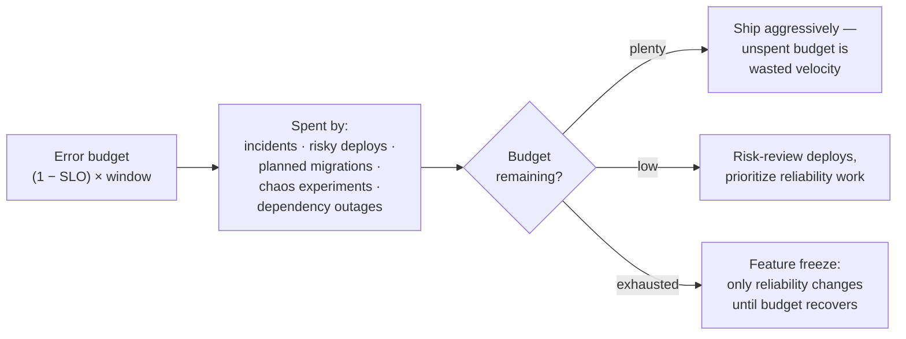

# SLOとエラーバジェット

> **翻訳についての注記:** 本ドキュメントは英語原文 `11-observability/05-slos-error-budgets.md` を日本語に翻訳したものです。コードブロックおよびMermaidダイアグラムは原文のまま維持しています。

## TL;DR

**SLI**は良いイベントと総イベントの比率、**SLO**はその比率がウィンドウ内で満たすべき目標(「チェックアウトリクエストの99.9%が30日間で500ms未満で成功」)、**エラーバジェット**はその補数 — 許容される失敗の量(0.1% ≈ 月43分) — であり、信頼性を口論から使用可能な資源に変換します: バジェットが残っていれば速く出荷し、使い切ったら安定化します。静的しきい値ではなく、マルチウィンドウの**バーンレート**(バジェットの消費速度)でアラートし、SLOはマイクロサービス単位ではなく*ユーザージャーニー*単位で定義し、バジェットポリシーは必要になる前に文書化します。失敗モードはSLO劇場: 誰も強制しない目標を、ユーザーのいない場所で測ること。

---

## SLI: ユーザーの体験を測る

スケールするSLIの形式は**比率**です: `良いイベント / 有効なイベント` をウィンドウで。設計は3つの決定です:

**1. イベントは何か?** リクエスト、パイプライン実行、書き込まれたレコード、セッション。ユーザーが関心を持つイベントを — 「チェックアウトが完了した」であって「Podがhealthy」ではなく。

**2. 何が「良い」か?** 可用性: 非5xx(クライアントエラーは除外 — 間違ったURLへの404はあなたの非信頼性ではありません)。レイテンシ: *良い = しきい値未満*とすればレイテンシも比率になります — 「500ms未満のリクエストの%」 — 可用性と合成でき、パーセンタイルのパーセンタイルという罠を避けられます。有用な改良は二重しきい値: 90% < 500ms *かつ* 99% < 2s で、典型とテールの両方の体験を捉えます。

**3. どこで測るか?** 各地点は忠実度とノイズを交換します:

| 計測点 | 見えるもの | 見えないもの | ノイズ |
|---|---|---|---|
| クライアント/RUM | 真のユーザー体験 | — | ユーザーの回線、端末(高) |
| CDN/ロードバランサのログ | あなたに届いたすべて | DNS、クライアント網 | 低 — **デフォルトの選択** |
| サービス側メトリクス | アプリの挙動 | LBの失敗、アプリ手前の接続エラー | 低いが楽観的 |
| 合成プローブ | 制御された全経路 | 実ペイロードの多様性 | 極小。*補完*に使う |

ロードバランサのログが標準的な第一情報源です: ユーザーに十分近く、ノイズが少なく、クラッシュしたサービスが数えなかったリクエストも見えます([メトリクスとモニタリング](./02-metrics-monitoring.md))。

```promql
# Availability SLI over 30d, from LB metrics
sum(rate(lb_requests_total{route="checkout",code!~"5.."}[30d]))
/
sum(rate(lb_requests_total{route="checkout"}[30d]))

# Latency SLI: fraction of requests under 500ms
sum(rate(lb_request_duration_bucket{route="checkout",le="0.5"}[30d]))
/
sum(rate(lb_request_duration_count{route="checkout"}[30d]))
```

**リクエスト型でないシステムのSLI。** パイプラインと非同期処理には別の形が要ります: **新鮮さ**(データ年齢 < Xのウィンドウの% — 例「ダッシュボードのデータは30分以内」)、**完全性**(期待レコードのうち到着した%)、**正確性**(カナリアレコードが無傷で往復する%)、キューには**処理所要時間**のしきい値未満比率([データパイプライン](../13-data-pipelines/01-batch-processing.md))。LLM時代のシステムは品質SLI — 自動評価に合格する応答の% — を加えます。機構は同じで、「良い」の定義が曖昧なだけです([LLMインフラ](../16-llm-systems/05-llm-infrastructure.md))。

---

## SLO: 目標を選ぶ

ユーザーから逆算し、コストから順算します:

- **逆算:** どの失敗率でユーザーは気づくか? 解約するか? 無料ダッシュボードと決済APIでは答えが違います。過去の実績が正直な出発点です — 最初のSLOは現在の性能の少し*下*に設定して意図的に締めていくこと。達成したことのない99.99%を宣言しないこと。
- **順算:** 9がひとつ増えるごとにコストは掛け算されます。定番の表:

| 目標 | 月間停止許容 | 年間停止許容 | 含意 |
|---|---|---|---|
| 99% | 7.3 時間 | 3.65 日 | 単一リージョン、営業時間運用 |
| 99.9% | 43.8 分 | 8.77 時間 | 冗長化、オンコール、高速ロールバック |
| 99.95% | 21.9 分 | 4.38 時間 | マルチAZ、自動フェイルオーバー |
| 99.99% | 4.4 分 | 52.6 分 | 復旧ループに人間なし([マルチリージョン](../06-scaling/09-multi-region-architecture.md)) |
| 99.999% | 26 秒 | 5.3 分 | キャリアグレード。本当に必要な組織はほぼ皆無 |

構造的なルールが2つ。**SLOはマイクロサービス単位ではなくユーザージャーニー単位** — ユーザーが体験するのはチェックアウトであって `cart-service` ではありません。各99.9%のサービス30個は、全部に触れるジャーニーでは約97%に複利します。3〜7個のジャーニーSLOを定義し、内部サービスの目標はそこから*導出*させます(各依存先は、それが支えるジャーニー目標よりおよそ10倍良い必要があります)。**SLOは依存先で頭打ちになる** — 99.9%のデータベースの上で99.99%を約束するのはフィクションです。依存を回避する設計をするか、約束を下げるか。

そして100%は決して約束しないこと。暗黙にもです: 100%目標はあらゆる単一エラーをインシデントにし、変更のためのバジェットを消し、合理的な工学的応答は「デプロイをやめる」になります。SLO < 100%こそが、速度を闘争ではなく*交渉*にするものです。(外部の**SLA** — 返金を伴う契約 — は内部SLOより緩く置きます: SLOでアラートして行動するから、顧客はSLA違反を見ないのです。)

---

## エラーバジェット: 通貨としての信頼性

バジェット = `(1 − SLO) × ウィンドウ内のボリューム`。99.9%で月1,000万リクエストなら: 許容される失敗は10,000件。バジェットはすべての信頼性の会話を再構成します:



**ポリシーこそが本体です。** 合意された帰結のないSLOはダッシュボードに過ぎません。最初の違反の*前に*、エンジニアリングとプロダクトの署名付きで文書化すること: 50%消費で何が起きるか(リスクレビュー)、100%で何が起きるか(機能凍結、ポストモーテム必須)、誰が例外を許可できるか、何がリセットするか(ローリング30日なら凍結は徐々に解除される — カレンダーの崖より望ましい)。対称に: バジェットを*まったく*使わないチームは、信頼性に過剰投資しているか出荷不足です — 未使用のバジェットはカオス訓練、依存のアップグレード、リージョン避難テストの原資になります。

---

## バーンレートアラート

SLOアラートの間違ったやり方: 30日SLIが目標を割ったらページする — その時点でバジェットは消えており、そのページはポストモーテムへの招待状です。正しいやり方: **バーンレート** — 持続可能な消費速度の倍率 — でアラートします。バーンレート1はウィンドウでちょうどバジェットを使い切り、14.4は30日のバジェットを2日で使い切ります。

マルチウィンドウ・マルチバーンレートのレシピ(SRE Workbook)は速度とフラッピングを両立させます:

| 重大度 | バーンレート | 長ウィンドウ | 短ウィンドウ | バジェット枯渇まで |
|---|---|---|---|---|
| ページ | 14.4× | 1時間 | 5分 | 約2日 |
| ページ | 6× | 6時間 | 30分 | 約5日 |
| チケット | 1× | 3日 | 6時間 | 30日 |

短ウィンドウは出血が止まった後のアラートを止め(古いページなし)、長ウィンドウは1分の悪化でのページを止めます(フラップなし):

```promql
# Page: 14.4x burn over 1h, still burning over 5m  (SLO 99.9 → error budget 0.001)
(
  1 - (sum(rate(req_total{route="checkout",code!~"5.."}[1h]))
       / sum(rate(req_total{route="checkout"}[1h])))
) > 14.4 * 0.001
and
(
  1 - (sum(rate(req_total{route="checkout",code!~"5.."}[5m]))
       / sum(rate(req_total{route="checkout"}[5m])))
) > 14.4 * 0.001
```

これは通常、症状別しきい値アラートの動物園(「CPU > 80%」「エラー率 > 1%」)を、構造上ユーザーが測定可能に傷ついたときだけ鳴る少数のページに置き換えます — 原因ベースのダッシュボードは診断のために残り、症状ベースのSLOアラートが*誰かを起こすかどうか*を決めます([アラート](./04-alerting.md))。SlothやPyrraは宣言的なSLO仕様からこれらのルール一式を生成します。ダッシュボードが乱立する前にOpenSLO(ベンダー中立フォーマット)の採用も検討に値します。

---

## ロールアウトとアンチパターン

機能する導入順序: (1) プロダクトを定義する2〜3のジャーニーを選ぶ。(2) 目標*なし*で1か月SLIを測る — ベースラインを知る。(3) ベースライン少し下にSLOを置き、バーンレートアラートを配線する。(4) プロダクトの署名付きでバジェットポリシーを採択する。(5) SLOを四半期ごとに見直す — 目標はユーザーの期待に従い、期待は動く。(6) その後でようやく、ジャーニーSLOが正当化する内部サービスへ拡張する。

予期すべき失敗モード:

- **SLO劇場** — 目標はあるが、違反しても何も変わらない。根因: バジェットポリシーの不在か、プロダクトの不参加。歯のないSLOはゼロより悪い — 信頼性の数字は飾りだと組織に教えてしまいます。
- **サービス単位の乱立** — 200個のSLO、すべて緑、ユーザーは不幸。ジャーニーが先です。
- **SLIのゲーミング** — 不都合なトラフィックの除外、LBがドロップした後での計測、劣化応答を「良い」と数える。SLI定義はコードレビューと監査の対象に。
- **平均ベース・稼働時間ベースのSLI** — 30秒レイテンシを返しながら「サービスは稼働していた」は古典的な嘘です。良い*イベント*の比率にはその隙間がありません。
- **借り物の99.99%** — 大企業のブログから写した目標。必要なアーキテクチャはどこにもない。上の表は請求書です。支払う意思を確認してください。

---

## 参考文献

- [SRE Book, ch. 4: Service Level Objectives](https://sre.google/sre-book/service-level-objectives/) — 正典
- [SRE Workbook, ch. 2 & 5](https://sre.google/workbook/implementing-slos/) — SLOの実装、マルチウィンドウ・マルチバーンレートアラート
- [OpenSLO](https://openslo.com/) — 宣言的SLO仕様
- [Sloth](https://sloth.dev/) / [Pyrra](https://github.com/pyrra-dev/pyrra) — PrometheusのSLO/バーンレートルール生成
- [Implementing Service Level Objectives](https://www.oreilly.com/library/view/implementing-service-level/9781492076803/) — Hidalgo; 実務家向けの書籍水準の扱い
