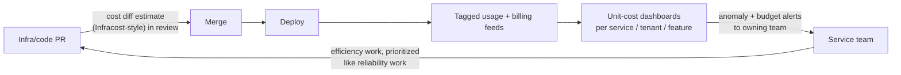

# FinOpsとコスト工学

> **翻訳についての注記:** 本ドキュメントは英語原文 `11-observability/06-finops-cost-engineering.md` を日本語に翻訳したものです。コードブロックおよびMermaidダイアグラムは原文のまま維持しています。

## TL;DR

クラウドはインフラ支出を、調達の決定から、コードを書く誰かが1日に何千回も暗黙に行うエンジニアリングの決定に変えました — FinOpsはその決定を可視で意図的なものにする規律です。実践: 総額の請求書を眺めるのではなく**ユニットエコノミクス**(リクエストあたり、テナントあたり、機能あたりのコスト)を測る。強制されたタグ付けで支出を**帰属**させ、すべてのドルにオーナーを与える。レバーは効率の順に攻める — 止める、適正サイズにする、ストレージを階層化する、egressに気を配り、*それから*コミットメントとスポットで単価を最適化する。そしてレイテンシを配線したのと同じやり方でコストをエンジニアリングのループに配線する: インフラPRへのコスト差分見積もり、月末ではなく数時間以内の異常アラート、価格決定に食い込むテナント別帰属。コストはもうひとつの運用シグナルにすぎません — [SLO](./05-slos-error-budgets.md)と同じ機構で扱うこと。そしてゴールは支出の最小化ではなく*マージン*の最大化です: 使わない効率は、使わないエラーバジェットと同じく、捨てられた速度です。

---

## ユニットエコノミクスは請求書監視に勝る

月額48万ドルの請求書は解釈不能です — 売上が横ばいなら恐怖、利用が3倍なら上出来。シグナルは比率に宿ります:

```
unit cost   = spend attributable to a workload / units of value it produced
            = $ / 1K requests · $ / active tenant · $ / GB ingested ·
              $ / model training run · $ / 1M tokens served
```

ユニットコストは**成長**(請求額は増、ユニットコストは横ばい — それは成功)と**リグレッション**(ユニットコスト増 — 何かが非効率になった)を分離し、エンジニアリングのトレードオフを通約可能にします: 「このキャッシュ層は月8千ドルで、リクエストあたりコストを22%削り、p99を半分にする」は、財務とエンジニアリングの両方が評価できる文です([キャッシング](../04-caching/01-cache-strategies.md)の決定はFinOpsの決定です)。[ジャーニー単位のSLO](./05-slos-error-budgets.md)を鏡映する3〜5個のユニットメトリクスを選び、サービスごとにトレンドを取り、その微分にアラートを張ること。

### 帰属: すべてのドルにオーナーを

ユニットエコノミクスは、*どの*支出が*どの*ワークロードのものかを知ることを要求します — 地味な土台です:

- **作成時にタグ付けし、CIで強制する:** すべてのリソースにチーム・サービス・環境・テナントティアを、IaCポリシーで検証(タグなし = plan時にブロック。月末に嘆かない)。[GitOps](../15-deployment/04-cicd-gitops.md)がこれを強制可能にします。すべてのリソースがレビューされたコードを流れるからです。
- **共有プラットフォームには計量を:** Kubernetesクラスタ、データ基盤、社内MLサービングは請求書の1行ですが消費者は多数です — *要求(requests)*リソースで配分し(requestsは使われなくても容量を予約します。OpenCost型の配分)、マルチテナントサービスはテナント別に計量します([ノイジーネイバー分析](../06-scaling/12-multi-tenancy.md)のために作ったテナントタグ付きメトリクスがそのままコストメーターになります。クジラテナントの粗利は価格チームが必要とする数字です)。
- **不完全さを構造的に受け入れる:** 共有コスト(NAT、可観測性、サポートプラン)には公表された分配ルールを(直課比例で十分)。誰も信じない100%配分より、所有が明確な85%配分。
- **フィードバックの遅延に注意:** 課金データは数時間〜1日遅れます。*プロバイダのコストAPI+自前の利用メトリクス*での異常検知が、暴走した訓練ジョブを請求書ではなく今日捕まえます([アラート](./04-alerting.md): コスト異常はバーンレートに応じて当該チームをページします — 平常の10倍の時間あたり消費はインシデントです)。

---

## レバー、効く順に

単価の前に効率を: 無駄の価格を最適化しても無駄は無駄です。

| # | レバー | 機構 | 典型的な効果 |
|---|---|---|---|
| 1 | **止める** | dev/stagingの夜間週末停止、ゾンビリソース(未接続ボリューム、遊休LB、忘れられたスナップショット)、スパイクの激しい社内ツールのscale-to-zero | 多くの請求書の10〜30%は*何もしていない* |
| 2 | **適正サイズ** | インスタンス/requestsを創業期の勘ではなく実測p95に合わせる。1サイズ下 ≈ そのフリートで−30〜50% | 継続的、自動化可能 |
| 3 | **ストレージライフサイクル** | ホット → 低頻度 → アーカイブのポリシー。スナップショット/ログ保持の上限。圧縮+列指向([Parquet](../13-data-pipelines/05-lakehouse-table-formats.md)) | ストレージは命じない限り単調増加 |
| 4 | **Egressとトポロジー** | クロスAZ・クロスリージョン通信、NAT処理、インターネットegress — 静かな費目。お喋りなサービスは同居させ、エッジでキャッシュし([CDN](../06-scaling/04-cdn-architecture.md))、データをコンピュートへではなくコンピュートをデータへ | しばしば監査で最も衝撃的な発見 |
| 5 | **コミットメント** | 実測ベースラインへのリザーブド/Savings Plans(カバレッジ約60〜80%。四半期ごとに見直し) | コミット対象コンピュートで−30〜60%、コード変更ゼロ |
| 6 | **スポット/プリエンプティブル** | 中断耐性のある仕事: バッチ、CI、余裕のあるステートレスフリート、チェックポイント付き訓練 — つまりすでに[冪等で再開可能](../01-foundations/08-idempotency.md)にした仕事 | 対象コンピュートで−60〜90% |
| 7 | **アーキテクチャ** | ティア型テナンシー([ロングテールをプール](../06-scaling/12-multi-tenancy.md))、レイテンシが許す所はイベント単位よりバッチ、同期チェーンより非同期、ARM/省電力シリコン | 複利の効く、遅いレバー |

表への注釈を2つ。**コミットメントは予測の賭け**です — 確信のある床にだけコミットし、スパイクはオンデマンド/スポットで。過剰コミットは割引をロックインに変換します。**スポットはアーキテクチャのテスト**です: 2分前警告つきの中断で壊れるワークロードなら、その脆さは最初から信頼性のバグでした([リトライ](../06-scaling/10-retries-timeouts-hedging.md)、チェックポイント)。スポットはそれに値段を付けただけです。

### LLM時代の補遺

トークン支出は2026年の多くの請求書で最も成長の速い行であり、ユーティリティのように振る舞います: ユニットメトリクスは**解決タスクあたりコスト**([LLM評価](../16-llm-systems/10-llm-evaluation.md))で、レバーには独自の順位があります — まずプロンプトキャッシュのヒット率、次にモデル階層化、非同期処理のバッチティアへのルーティング、出力長の規律、それからプロバイダ交渉([LLMインフラ](../16-llm-systems/05-llm-infrastructure.md)と[ハーネスエンジニアリング](../16-llm-systems/09-harness-engineering.md)が機構を扱います)。FinOps FoundationのスコープがSaaS/AI支出へ拡張されたのは同じシフトの反映です: エンジニアリングできる請求書はもはやIaaSの請求書だけではありません。

---

## コストをエンジニアリングのループへ配線する

文化的な失敗モードは「四半期ごとの大掃除としてのコスト」です: 英雄的な監査、25%削減、2四半期での再成長。修正は品質や信頼性と同じです — シグナルを意思決定の現場へ動かすこと:



- **PRにコスト差分を:** インフラ変更はレビューで月額の増減を示します。バンドルサイズやカバレッジのチェックと同じように。「+$4,200/月」を見たレビュアーは、月末レポートが決して引き出さない質問をします。
- **予算をSLOとして:** 各サービスにユニットコスト目標と絶対値のガードレールを。違反は財務のメールスレッドではなく、通常のインシデント/エラーバジェット機構でチケットになります。(対称に — 目標を恒常的に下回りながらレイテンシSLOが滑っているなら、過剰最適化です。使うこと。)
- **チャージバックの前にショーバックを:** まずチーム別ダッシュボードを公開する(可視化だけで行動は変わります)。社内課金は、インセンティブに本当に歯が必要な場所だけに — 配分ルールを巡るチャージバック戦争は、節約する金より多くの注意を浪費しえます。
- **トレンドだけでなくアーキテクチャを予測する:** 大きなコストイベントは階段関数です — 新機能、中央値の10倍のテナント、リージョン追加([マルチリージョン](../06-scaling/09-multi-region-architecture.md)はインフラをおよそ倍にします。驚きではなく*計画された*費目として)。
- **効率的な道をデフォルトの道に:** ライフサイクルポリシー、オートスケーリング、適正サイズのデフォルトを焼き込んだゴールデンIaCモジュールは、事後の取り締まりのどんな量にも勝ります — プラットフォームエンジニアリングこそFinOpsが複利になる場所です。

---

## チェックリスト

- [ ] 3〜5個のユニットコストメトリクスを定義し、サービス別にトレンドを取り、微分にアラート
- [ ] タグ付けをIaCのplan時に強制。共有プラットフォームは計量(K8sはrequestsで、マルチテナントサービスはテナントで)
- [ ] 数時間遅延のデータでのコスト異常検知が、当該チームをページする
- [ ] 遊休/ゾンビの掃除を自動化。適正サイズの推奨を定期適用
- [ ] すべてのバケット・ロググループ・スナップショット連鎖にライフサイクル+保持ポリシー
- [ ] Egress/クロスAZトポロジーをレビュー済み。お喋りなサービスは同居
- [ ] コミットメントは実測ベースラインのみをカバー。カバレッジは四半期レビュー
- [ ] 中断耐性ティアにスポットを採用(その中断耐性を実際にテスト済み)
- [ ] インフラPRにコスト差分が見える。ユニットコスト予算はインシデントプロセスに配線
- [ ] テナント別コスト帰属が価格/マージン決定に供給される。LLMの解決タスクあたりコストを追跡

---

## 参考文献

- [FinOps Foundation Framework](https://www.finops.org/framework/) — フェーズ(inform/optimize/operate)、ペルソナ、FOCUS課金データ標準
- [AWS Well-Architected: Cost Optimization Pillar](https://docs.aws.amazon.com/wellarchitected/latest/cost-optimization-pillar/welcome.html) — プロバイダ味のレバーカタログ
- [The Frugal Architect](https://thefrugalarchitect.com/) — Werner Vogels; 非機能要件としてのコスト
- [OpenCost](https://opencost.io/) — Kubernetesのコスト配分(requests-vs-usageモデル)
- [Infracost](https://www.infracost.io/) — プルリクエスト内のコスト差分
