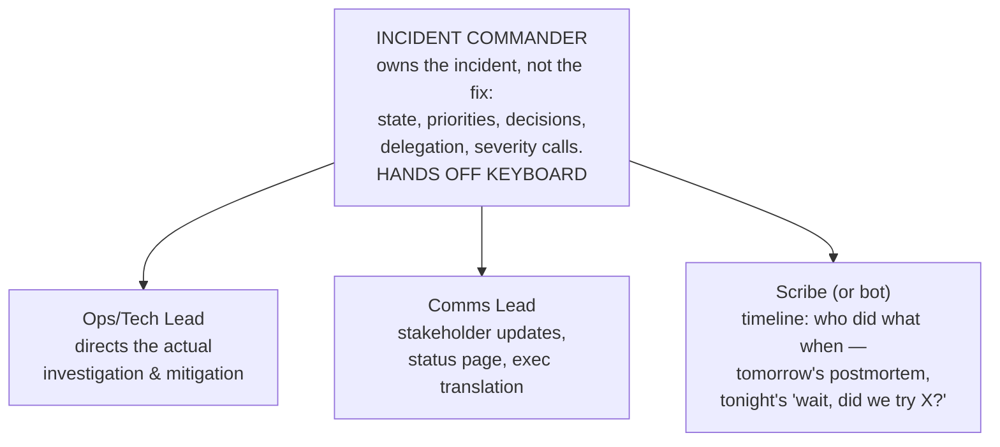

# インシデント管理とポストモーテム

> **翻訳についての注記:** 本ドキュメントは英語原文 `11-observability/07-incident-management.md` を日本語に翻訳したものです。コードブロックおよびMermaidダイアグラムは原文のまま維持しています。

## TL;DR

インシデントはシステムの中断ではありません — それはシステム*そのもの*が、もうひとつのモードで動いている姿であり、対応とは平時に設計してアドレナリンの中で実行するものです。荷重を支える部品: 誰でも10秒で適用できる**重大度マトリクス**(早く宣言し、安く格下げする)。調整とデバッグを分離する**役割** — キーボードに*触れない*ことを明示されたインシデントコマンダー。**緩和ファーストの教義**(ロールバック、フラグ停止、負荷削減、フェイルオーバー — 傷を理解する*前に*出血を止める)。エンジニアに静寂を買い与える**コミュニケーションのリズム**(ステークホルダーに予測可能性を与えることで)。そして**非難なきポストモーテム** — その成果物は文書ではなく、追跡されるエンジニアリング作業です。アクションアイテムの墓場は、インシデントを授業料から純損失に変えてしまうからです。オンコールは慢性側の相棒です: アラートの品質、ポケベル負荷の予算、訓練が、午前3時にこの急性期の機構を機能させます。この記事は[SLOとエラーバジェット](./05-slos-error-budgets.md)の人間側の半分です。それなしの機構の半分は、劇場です。

---

## 重大度: 10秒で決める

重大度マトリクスの存在意義は、最悪の瞬間から1つの意思決定を取り除くことです。粗く、曖昧さなく:

| Sev | 基準(どれか1つで十分) | 対応 |
|---|---|---|
| **SEV1** | 中核のユーザージャーニー停止、または[エラーバジェット](./05-slos-error-budgets.md)が14倍以上で燃焼 · データ喪失/破損の疑い · セキュリティ侵害 · 売上停止 | 今すぐIC+対応者をページ、24/7。経営層への連絡。総力戦を許可 |
| **SEV2** | 多数のユーザーでジャーニー劣化 · 燃焼6倍以上 · 1リージョン停止だがフェイルオーバーが持ちこたえている | 今すぐオンコールをページ。ICを任命。ユーザーに見えるならステータスページ |
| **SEV3** | 軽微な劣化、回避策あり · 単一テナントへの影響 · 冗長性の喪失(もう1障害でSEV1) | 営業時間内。チケット+オーナー |
| **SEV4** | 見た目だけ、社内のみ | バックログ |

表の中身より重要な3つのルール: **早く宣言する** — 誤ったSEV2は2人の20分を費やすだけ。遅れたSEV1は障害の左裾を丸ごと費やします(「インシデントを宣言します」を称賛される行為にし、決して罰しない)。**格下げは無料で正常。** そして**重大度は影響であって労力ではない** — サイト全停止の1行設定修正は依然SEV1です。しきい値をSLOバーンレートに結びつければ、「これはインシデントか?」に数値の答えが付きます。

## 役割: 調整は副作用ではなく仕事

約30分または約3人を超えると、ヒーローモデルは崩壊します: デバッグの最深部にいる人が、同時に「進捗は?」のピンを捌き、広報を判断し、ロールバックを試すのを忘れています。分割します:

- **ICは調整し決定する。デバッグはしない。** ICがログを読み始めた瞬間、誰もインシデントを運営していません。小さいチームでは同じ人が複数の帽子をかぶってもよい — 要点は帽子が*存在*し、明示的に割り当てられることです(「ICは私」)。
- **インシデントチャネルは1つ、真実の源は1つ。** 決定・状態変化・試行したアクションはチャネル内へ(書記/ボットが捕捉)。サイドチャネルのデバッグは、緩和が二度試され、矛盾する変更が衝突する場所です。
- **引き継ぎは形式的に。** 長いインシデントは人を交代させます(数時間で認知は激しく劣化します)。引き継ぎは書かれた要約 — 現状、試したこと、保留中 — であり、「あとは頼んだ」ではありません。
- エスカレーションは失敗ではなくICの道具です: データベースチームを引き込む、ディレクターを起こす、は低い閾値のルーチンの一手です。

## まず緩和、診断は後

圧力下の本能は問題を*理解する*ことです。規律は、**痛みを止めて**から、落ち着いて理解することです。対応者が原因を知る前に試す汎用緩和リストを保持します:

1. **直近の変更をロールバック** — デプロイ、設定、フラグ(訓練済みの[1アクションのロールバック](../15-deployment/04-cicd-gitops.md))。インシデントの過半は変更起因です。「この1時間で何が変わった?」というタイムラインの問いは元が取れます。
2. **キルスイッチを倒す** — [フィーチャーフラグ](../15-deployment/02-feature-flags.md)、[リトライのキルスイッチ](../06-scaling/10-retries-timeouts-hedging.md)、高価な機能の縮退モード。
3. **負荷を削る/ブラウンアウトに入る** — 周辺を犠牲にして中核ジャーニーを守る([レートリミット](../06-scaling/05-rate-limiting.md)、[バックプレッシャー](../06-scaling/07-backpressure.md))。
4. **フェイルオーバー** — インスタンス、AZ、[リージョン](../06-scaling/09-multi-region-architecture.md) — 訓練済みのRunbookに従って。
5. **スケールアップ/アウト** — 形が容量問題に見えるなら、考える時間をハードウェアで買う([稼働率曲線](../01-foundations/10-capacity-planning.md)が、小さな過負荷が大惨事に見える理由を説明します)。

教義に組み込まれた2つの注意: **フォレンジックを破壊しない**(数秒でできるなら、再起動の前に病んだノードのスナップショットを — ただし証拠保全がユーザーより上位に来てはならない)。そして**第二のインシデントに気をつける** — 圧力下の性急な緩和(一斉再起動、[スタンピード](../04-caching/04-cache-stampede.md)を起こすキャッシュフラッシュ、容量不足側へのフェイルオーバー)が複合障害のかなりの割合を引き起こします。Runbookの仕事は、各緩和の安全な版を簡単な版にすることです。

## コミュニケーション: 予測可能性が静寂を買う

伝えられないインシデントは自前のメタインシデントを生みます: 経営層がエンジニアに直接ピンし、サポートが回答を即興し、顧客はソーシャルメディアで先に知ります。

- **内容よりリズム。** 「次の更新は:30」 — そして:30には*何かを*届ける。「まだ調査中、有力線は2つ」でもよい。信頼できるリズムはピンを止め、落とした更新はそれを再開させます。
- **2つの聴衆、2つの言語。** 社内: 正確、技術的、非難なしの省略形。社外/ステータスページ: ユーザーの言葉での影響(「14:05 UTCから約20%のユーザーでアップロードが失敗」)、対応中の内容、次の更新時刻 — 後で撤回する根本原因の推測はなし。正直なステータスページは信頼を複利させます。目に見える障害の最中の「全システム正常」は、その逆を複利させます。
- **テンプレートは即興に勝る。** 宣言、更新、解決、「認知しています」のマクロを、平時に書いておく。広報担当は午前3時に散文を起草する代わりに、空欄を埋めます。

## ポストモーテム: インシデントが家賃を払う場所

インシデントの代金はもう払いました。ポストモーテムは回収です。文化の要石は**非難なき(blameless)**であること — 優しさとしてではなく、認識論として: 人々は知っていたことを所与として合理的に行動した(*局所合理性*)のだから、「なぜAliceはあのコマンドを実行したのか?」は袋小路で、「なぜシステムはあのコマンドを安全に見せ、危険な状態を不可視にしたのか?」がエンジニアリングを生むのです。ポストモーテムが責任を割り当てた瞬間、インシデント報告はフィクションになります。自己保存が記憶を編集するからです。

会議の元が取れるポストモーテム:

- **タイムライン**(書記/ボットから): 検知 → 宣言 → 緩和の試行 → 解決、タイムスタンプ付き。空白こそ発見です — アラートから宣言まで40分はアクションアイテムであり、「:15に緩和が判明、承認待ちで実行は:55」も同様です。
- **ユーザーと予算の言葉での影響:** 影響ユーザー数、時間、失敗リクエスト数、[消費したエラーバジェット](./05-slos-error-budgets.md)、見積もれるなら売上。これが重大度しきい値を較正し、修正を正当化します。
- **寄与要因、複数形** — 複雑なシステムは単一の根本原因ではなく、整列した弱点を通って壊れます。「根本原因: ヒューマンエラー」は禁句です。テンプレートは*何がその誤りを可能にし、起きやすくし、爆発半径を大きくしたか*を問うべきです。
- **うまくいったこと/運が良かったこと。** 運のリストは隠れた金脈です: 「システムを知る唯一のエンジニアがたまたま起きていた」は、後日に予定されたSEV1です。
- **オーナー・期限・追跡レビュー付きのアクションアイテム。** ほとんどのプログラムが死ぬのはここです: アクションアイテムの墓場。対抗策: 項目数の上限(実際に実行される3〜5は、されない20に勝つ)、通常のスプリントプロセスへの組み込み(別リストにしない)、エラーバジェットポリシーへの紐付け(未実施アイテムを抱えた再発インシデント=凍結の根拠)、月次の完了率レビューを一級メトリクスに。
- **広く共有し、検索可能に保管する。** 著者しか読まないポストモーテムは1チームに教えただけです。その蓄積こそ組織の本当の信頼性カリキュラムであり、あなたが持つ最良のオンボーディング読本です。

## 慢性側: オンコールと練習

急性期の機構は、休めて、練習済みで、本物のためだけにページされる人間を前提にします:

- **アラートの品質は常設レビュー。** すべてのページはSLOに関わる症状とRunbookに対応し、すべての*対応不能な*ページは週次レビューで削除か格下げされます([バーンレートアラート](./05-slos-error-budgets.md)が構造的に大半を片付けました)。ポケベル疲れは、本物のSEV1が寝過ごされる経路です。
- **ポケベル負荷は予算化されたメトリクス** — シフトあたりのページ数を追跡し上限を設け、恒常的な超過は気合いの問題ではなくエンジニアリングの優先順位の問題です。ローテーションはオンコールが持続可能な人数を必要とし(床として6〜8人)、シフト間に引き継ぎノートを。
- **本番になる前に練習する:** ゲームデーとカオス訓練は*システム*を行使し([DR](../15-deployment/05-disaster-recovery.md))、**Wheel of Misfortune** — 過去のインシデントを机上シナリオとして再演し、若手の対応者に運転させる — は*人間*を行使します。新しいオンコールはソロの前にシャドーを。誰かが初めてICを演じるのがSEV1であってはなりません。
- **本番準備レビュー(production readiness review)**が前向きにループを閉じます: サービスは出荷前に、この記事が前提とするチェックリスト — Runbook、ダッシュボード、SLOに配線されたアラート、訓練済みロールバック、割り当て済みオンコール — を実証します。インシデントは午前3時に管理するより、レビュー時に予防するほうが安い。

### プログラムを正直に保つメトリクス

MTTRを分解すること — 集計はすべてを隠します: **検知までの時間**(モニタリングの品質)、**宣言までの時間**(文化)、**緩和までの時間**(最重要の数字 — Runbook、キルスイッチ、ロールバック速度)、解決までの時間。インシデントの*寄与要因クラス別頻度*(変更起因? 容量? 依存先? — 投資先を教えてくれます)、アクションアイテム完了率、シフトあたりページ数を追跡。「宣言されるインシデントを減らす」ことへのインセンティブには疑いを — まさにそれが手に入りますが、それは報告の変化であって信頼性の変化ではありません。

---

## チェックリスト

- [ ] 重大度マトリクスを公開し、SLOバーンレートに紐付け。宣言は1コマンド/ボタンで、社会的に称賛される
- [ ] IC/ops/広報/書記の役割を定義。IC-don't-debugを強制。引き継ぎは文書で
- [ ] 汎用緩和リスト+キルスイッチが存在し訓練済み。ロールバックは1アクション
- [ ] 社内とステータスページのコミュニケーションのリズム+テンプレート。方針としての正直さ
- [ ] ポストモーテム: 非難なきテンプレート、寄与要因の枠組み、運のリスト、スプリントプロセス内の追跡されたアクションアイテム5つ以下、月次完了レビュー
- [ ] アラートレビューは週次。ポケベル負荷は予算化。ローテーションは人間的なサイズ
- [ ] Wheel of Misfortune / ゲームデーをカレンダーに。新オンコールはまずシャドー。新サービスにはPRRゲート
- [ ] MTTD/宣言/緩和を分解してトレンド化。インシデントのクラスが投資を駆動

---

## 参考文献

- [Google SRE Book, ch. 12–15](https://sre.google/sre-book/effective-troubleshooting/) — 緊急対応、インシデント管理、ポストモーテム文化の章
- [SRE Workbook: Incident Response](https://sre.google/workbook/incident-response/) — 実例で歩くICシステム
- [PagerDuty Incident Response Guide](https://response.pagerduty.com/) — 役割と広報の最も完全な公開Runbook。オープンソース化済み
- [Blameless PostMortems and a Just Culture](https://www.etsy.com/codeascraft/blameless-postmortems/) — Allspaw; 創設の議論
- [Howie: The Post-Incident Guide](https://www.jeli.io/howie/welcome) — テンプレートを超えた現代のインシデント分析の実践
- [incident.io's Incident Management Guide](https://incident.io/guide) — 実利的で現代的な運用の詳細
