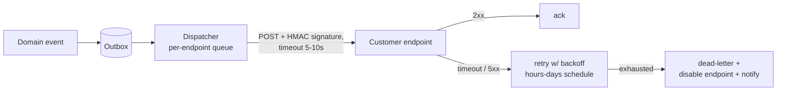

# API設計パターン

> **翻訳についての注記:** 本ドキュメントは英語原文 `12-service-mesh/04-api-design-patterns.md` を日本語に翻訳したものです。コードブロックおよびMermaidダイアグラムは原文のまま維持しています。

## TL;DR

APIは何年も守り続ける契約であり、制御できないクライアントに消費されます — データベースの投影ではなく、プロダクトとして設計してください。支柱となるパターン: アクションではなく**リソース**(ライフサイクルを持つ名詞)をモデル化する。機械が分岐できる**構造化エラー**(RFC 9457 problem details)を返す。**不透明なカーソル**でページネーションし、オフセットは決して使わない。すべての非安全な操作で**冪等性キー**を受け付ける。バージョニングは**追加優先**で、壊すのは明示的な廃止期間を経てのみ。両端を自分が所有する場面(内部のサービス間通信、ストリーミング、コード生成)では**gRPC**を、そうでない場面ではHTTP+JSONを。そして**Webhook**は署名・リトライ・順序の注意を伴う配信システムとして扱うこと — fire-and-forgetなHTTPではありません。すべてを貫く統一原理: ここにあるルールはどれも、誰かのクライアントが午前3時に壊れたから存在します。

---

## リソースモデリング

ドメインをリソース(同一性とライフサイクルを持つ名詞)としてモデル化し、その操作には統一インターフェースを使います。カスタム動詞は、CRUDに写像できない本物の状態遷移のために取っておきます:

```
GET    /invoices                 list (filterable, paginated)
POST   /invoices                 create
GET    /invoices/{id}            fetch
PATCH  /invoices/{id}            partial update
DELETE /invoices/{id}            delete (or cancel — see below)

POST   /invoices/{id}:finalize   controlled state transition (custom method)
POST   /invoices/{id}:void       — better than PATCH {status: "void"} because
                                   transitions have rules, side effects, and auth
                                   that field-edits shouldn't smuggle past
```

長持ちする慣習(おおむねGoogleのAIPsとStripeのAPIに成文化されています):

- **IDは型プレフィックス付きの不透明な文字列**(`inv_8a3f…`) — ログでgrepでき、サポートチケットで自己記述的で、クライアントに数値や連番と仮定されません。
- **booleanの山より柔らかい状態機械を:** `status: draft|open|paid|void` は相互に矛盾しうる4つのフラグに勝ります。遷移図を公開し、不正な遷移は固有のエラーコードで拒否します。
- **関係は参照+展開で:** `customer: "cus_123"` を返し、埋め込み形には `?expand=customer` を許す — デフォルトは有界なペイロード、要求時にジョイン。
- **タイムスタンプはRFC 3339のUTC。金額は整数の最小単位+通貨。** 永遠に。
- **テーブルを鏡写しにしない。** APIは、自由にリファクタリングし続けるべきスキーマの上の安定したファサードです([データベースマイグレーション](../15-deployment/03-database-migrations.md)はAPIが列を漏らさないことを前提にします)。

## エラー: 失敗をプログラム可能に

クライアントは成功よりエラーで分岐します。散文ではなく構造(RFC 9457 *Problem Details*)を渡すこと:

```json
HTTP/1.1 422 Unprocessable Entity
Content-Type: application/problem+json

{
  "type": "https://api.example.com/errors/insufficient-funds",
  "title": "Insufficient funds",
  "status": 422,
  "detail": "Balance 4210 is less than requested amount 5000.",
  "instance": "/transfers/tr_9f2c",
  "balance": 4210,
  "request_id": "req_b1a8e0"
}
```

- **`type` が機械の契約** — エラークラスごとに安定したURI。クライアントはそれで分岐し、ドキュメントはその先に住みます。`detail` は人間向けで自由に変えてよい。
- ステータスコードのファミリーを誠実に: 400 不正形式、401 未認証、403 未認可、404 不在または秘匿、409 競合(状態機械が拒否)、422 意味的に不正、**429 + `Retry-After`**、503 + `Retry-After` — 呼び出し側の[リトライポリシー](../06-scaling/10-retries-timeouts-hedging.md)はまさにこれらをキーにします。
- **常に `request_id` をエコー**し、両側でログすること。それがこの先のあらゆるサポート会話のジョインキーです。
- バリデーションエラーは1往復に1件ではなく、**すべて**の違反を1レスポンスで返します。

## ページネーション・フィルタ・長時間操作

**並行書き込みを生き延びるのはカーソルページネーションだけです。** オフセット(`?page=7`)はリクエストごとにゼロから数え直し — 集合の深部でO(n) — その上、行がクライアントの足元でずれて、スクロール中に項目が重複したり飛んだりします:

```
GET /invoices?limit=100&starting_after=inv_8a3f
→ { "data": [...], "has_more": true, "next_cursor": "djE6aW52Xzhi..." }
```

カーソルは位置(最終行の `(created_at, id)` → インデックスに対するキーセット `WHERE (created_at, id) > (…)`)を符号化しますが、**クライアントには不透明**です — base64してバージョンを付ければ、後で内部のソート戦略を自由に変えられます。**全順序**を保証すること(タイムスタンプ単独はタイになります。常に一意なidを連結する)。

フィルタ: インデックスのある文書化された少数のパラメータが、後悔する汎用クエリ言語に勝ります。ソート: 明示的な許可リスト(`?sort=-created_at`)。

**長時間操作**は `202 Accepted` + ポーリング用のoperationリソース(`GET /operations/{id}` → `running|succeeded|failed` + 結果リンク)を返します — または完了Webhookの登録を許します。HTTP接続をプログレスバーとして開けっ放しにしないこと。

## 冪等性と並行性

すべての非安全な操作は**冪等性キー**を受け付けます。すべてのクライアントはリトライし([リトライ](../06-scaling/10-retries-timeouts-hedging.md))、「レスポンスが失われた」が「二重課金」を意味してはならないからです:

```
POST /transfers
Idempotency-Key: 3c0a7e1b-...     ← client-generated per logical operation

server: first time  → execute, store (key → response)
        replay      → return stored response verbatim
        same key, different body → 422 (catches client bugs)
```

完全な仕組み — キー保存の原子性、TTL、エンドポイント別スコープ — は[冪等性](../01-foundations/08-idempotency.md)にあります。書き込みのlost update防止には**楽観的並行性制御**を: 読み取りで `ETag`/version を返し、書き込みで `If-Match` を要求し、古ければ `412 Precondition Failed` — 共有リソースのlast-writer-winsよりはるかに良い。

## バージョニングと進化

最も安いバージョンは、出荷しなくて済んだバージョンです。**追加的な進化** — 新しい任意フィールド、新しいエンドポイント、新しいenum値 — は、頑健性のルールで作られたクライアントを要求します: *未知のフィールドは無視し、未知のenum値に耐える*。そのルールを契約に明記し、クライアントをそれに対してテストすること。

壊さざるを得ないとき:

- **バージョニングの面を1つ選ぶ** — URL(`/v2/`。可視でキャッシュ可能)かヘッダ(Stripeのような日付ピン。小さな破壊的変更を多数、アカウント単位にゲートして出荷できる) — そして混ぜない。
- **廃止はプロセスであり、一斉切替日ではない:** 告知し、旧バージョンのレスポンスに `Deprecation` + `Sunset` ヘッダを付け、*誰がまだ呼んでいるかを測り*(キー別バージョンメトリクス — [APIゲートウェイ](./02-api-gateway.md)で取れます)、ロングテールを督促し、それから止める。公表した期間が契約です。6〜18か月が典型。
- **フォークせず、エッジで翻訳する:** 内部モデルは1つに保ち、旧バージョンはその上のアダプタにする(Stripeのバージョンモジュール方式)。N個の並行実装はN通りに腐ります。

## gRPC: 両端を所有するとき

内部のサービス間トラフィックでは、gRPC + protobufは持ち場を稼ぎます: 全言語でコード生成される型付き契約、HTTP/2多重化、組み込みのデッドライン伝播、ネイティブなストリーミング(サーバー・クライアント・双方向 — サービス間で[WebSocket](../07-real-time/04-websockets.md)が担う大半をカバー)。負荷分散とリトライはメッシュが宣言的に扱います([サイドカーパターン](./03-sidecar-pattern.md))。

契約の規律はprotoの**フィールド番号衛生**です:

```protobuf
message Invoice {
  string id = 1;
  int64 amount_minor = 2;
  Status status = 3;
  reserved 4;  reserved "legacy_total";   // field 4 retired: never reuse the number

  enum Status {
    STATUS_UNSPECIFIED = 0;               // always define 0 = unknown
    DRAFT = 1; OPEN = 2; PAID = 3;
  }
}
```

安全: フィールド追加、enum値追加(受信側は未知を処理)、リネーム(名前はワイヤ上にない)。破壊的: フィールドの番号や型の変更、引退した番号の再利用 — だから `reserved`。CIで `buf breaking` により強制します。スキーマレジストリが[CDCイベント](../13-data-pipelines/04-change-data-capture.md)をゲートするのと同型です。ブラウザとサードパーティとの境界では、gRPCにJSONトランスコーディングを前置するか、素直にRESTを出すこと — 公開gRPCはまだ例外です。

## Webhook: 逆向きのAPI

Webhookは関係を反転させます — 今度は*あなた*が、*相手の*不安定なサーバーを呼ぶ信頼できないクライアントです。上記のすべてを鏡像で適用します:



- **すべての配信に署名する**(タイムスタンプ+ペイロードのHMAC。例: `t=...,v1=hex`)。受信側は共有シークレットで検証し、古いタイムスタンプを拒否します(リプレイ防御)。受信側のサンプルコードを公開すること — 検証されないWebhookは、待機中のアカウント乗っ取りベクタです。
- **配信はat-least-onceで、いずれ順序が乱れます。** 数時間に及ぶバックオフ付きリトライは、リトライされたNよりN+1が先に着くことを意味します。だから: イベント `id`(受信側が重複排除)と `created` タイムスタンプを含め、受信側はイベントを状態の転送ではなく*現在状態を取得する合図*として扱う — **薄いペイロード**パターン(`{"type": "invoice.paid", "id": "evt_...", "object": "inv_123"}` → 受信側が請求書をGET)は、順序とデータ鮮度のバグを両方回避します。
- **受信側は速くackする**(数秒以内に2xx、処理は非同期) — そして送信側はタイムアウトを強制し、リトライに上限を設け、デッドレターし、恒常的に失敗するエンドポイントは通知付きで自動無効化します([デッドレターキュー](../05-messaging/08-dead-letter-queues.md))。
- イベントは[アウトボックス](../05-messaging/07-outbox-pattern.md)から発行し、ロールバックされたトランザクションのWebhookが決して飛ばないようにします。
- **リプレイ/イベント一覧API**を提供すること — 受信側は自分たちのインシデント中にイベントを*必ず*失います。`GET /events?after=...` はそれをサポートチケットからセルフサービスに変えます。(Standard Webhooks仕様がこれらの慣習の大半をパッケージ化しています。)

---

## チェックリスト

- [ ] リソース+明示的な状態遷移。不透明な型付きID。テーブルの鏡写しなし
- [ ] RFC 9457のエラー: 安定した `type`、`request_id`、完全なバリデーション結果
- [ ] 全順序の上のカーソルページネーション。不透明でバージョン付きのカーソル
- [ ] 全非安全メソッドに冪等性キー。lost update防止にETag/If-Match
- [ ] 追加優先の進化。バージョニング面は1つ。turn-downの前にDeprecation/Sunset+キー別バージョン計測
- [ ] 内部はgRPC + CIの `buf breaking` ゲート。公開エッジはREST/JSON
- [ ] Webhook: HMAC署名、アウトボックス起点、バックオフ付きリトライ、重複排除ID、薄いペイロード、リプレイAPI、自動無効化+DLQ
- [ ] レートリミットを可視に(`429` + `Retry-After` + 残量ヘッダ)([レートリミット](../06-scaling/05-rate-limiting.md))

---

## 参考文献

- [RFC 9457: Problem Details for HTTP APIs](https://www.rfc-editor.org/rfc/rfc9457) — 構造化エラー
- [Google API Improvement Proposals (AIPs)](https://google.aip.dev/) — 公開されている中で最も完全なリソース設計ルールブック
- [Stripe: API versioning](https://stripe.com/blog/api-versioning) / [Designing robust and predictable APIs with idempotency](https://stripe.com/blog/idempotency)
- [Buf: breaking-change detection](https://buf.build/docs/breaking/overview) / [protobuf language guide](https://protobuf.dev/programming-guides/proto3/) — フィールド番号衛生
- [Standard Webhooks](https://www.standardwebhooks.com/) — 署名・リトライ・メタデータ慣習の仕様化
- [GraphQLセクション](../17-graphql/01-graphql-fundamentals.md) — クライアントが柔軟な射影を必要とするときのクエリ言語という選択肢
