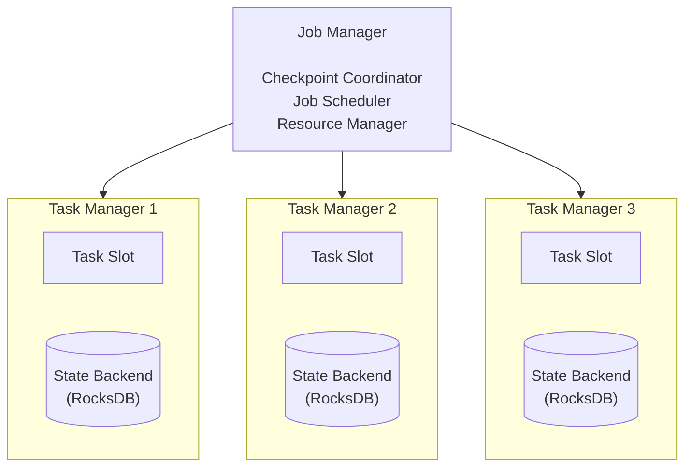
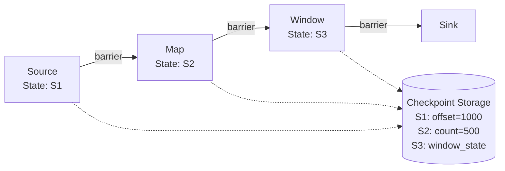
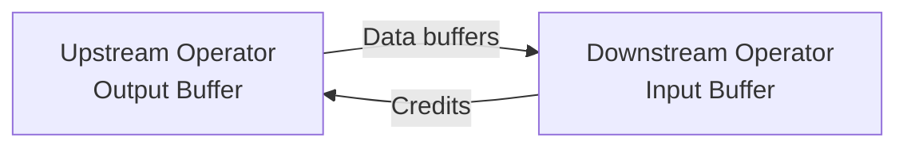
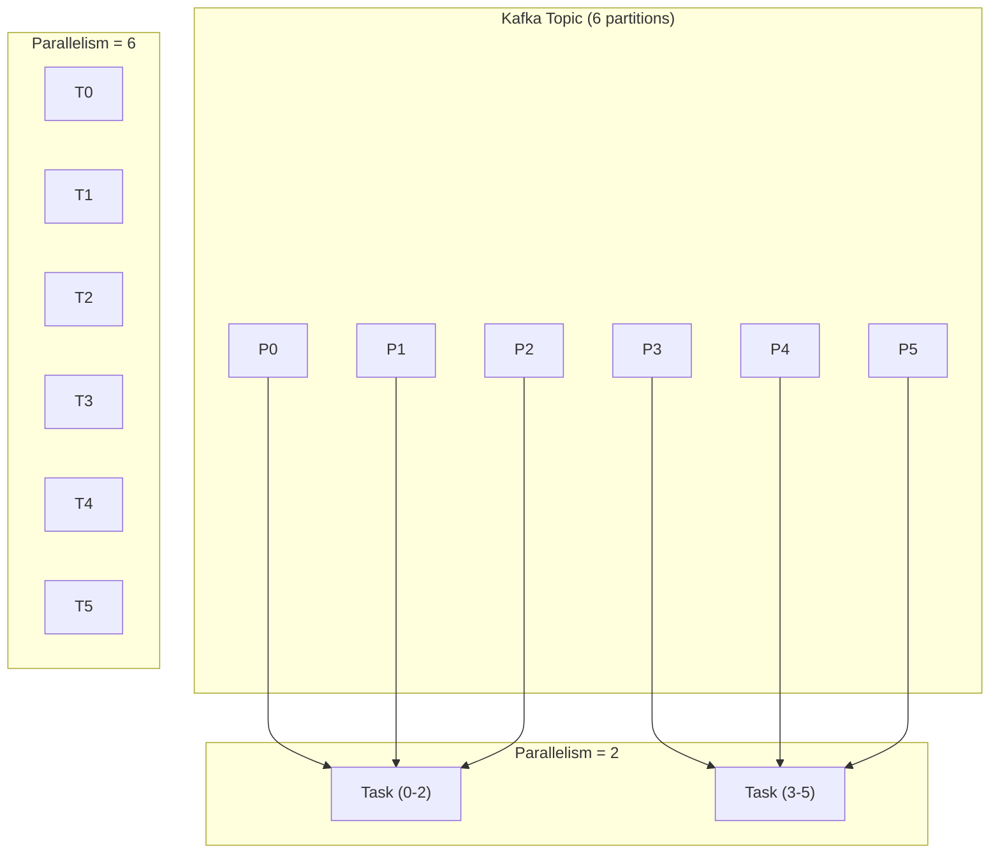

# ストリーム処理

> **注:** この記事は英語版からの翻訳です。コードブロックおよびMermaidダイアグラムは原文のまま保持しています。

## TL;DR

ストリーム処理は、無限のデータをリアルタイムで処理し、完全な正確性よりも低レイテンシを優先します。主な課題は、遅延データや順序が乱れたデータの処理、状態管理、正確に1回のセマンティクスの実現です。Apache KafkaとApache Flinkが主要な技術です。

---

## バッチ処理とストリーム処理の比較

```
Batch Processing:
─────────────────
Input:    [████████████████████]  Bounded dataset
Process:  Wait for all data, then process
Latency:  Minutes to hours
Accuracy: Complete, consistent
Example:  Daily reports, ETL

Stream Processing:
──────────────────
Input:    ──►──►──►──►──►──►──►  Unbounded events
Process:  Process each event as it arrives
Latency:  Milliseconds to seconds
Accuracy: Approximate, eventually consistent
Example:  Fraud detection, live dashboards
```

---

## ストリーム処理の概念

### イベント時間と処理時間

```
Event Time:    When the event actually occurred
Processing Time: When the event is processed by the system

Reality:
┌─────────────────────────────────────────────────────────────────┐
│ Event Time  │  00:01  │  00:02  │  00:03  │  00:04  │  00:05   │
│─────────────┼─────────┼─────────┼─────────┼─────────┼──────────│
│ Event A     │    ●    │         │         │         │          │
│ Event B     │         │    ●    │         │         │          │
│ Event C     │         │         │    ●    │         │          │
│─────────────┼─────────┼─────────┼─────────┼─────────┼──────────│
│ Processing  │         │         │         │  A,C    │    B     │
│ Time        │         │         │         │ (00:04) │  (00:05) │
└─────────────────────────────────────────────────────────────────┘

注意: イベントBはイベントCの後に到着（順序の乱れ）
      イベントAとCは同時に到着（ネットワークバッチング）

重要な理由:
- イベント時間で集約する場合（正しい方法）、遅延到着を処理する必要がある
- 処理時間で集約する場合（シンプルな方法）、結果が誤る可能性がある
```

### ウィンドウ処理

```
Event Stream: ──A──B──C──D──E──F──G──H──I──J──►

Tumbling Windows (fixed, non-overlapping):
┌─────────┐ ┌─────────┐ ┌─────────┐
│ A  B  C │ │ D  E  F │ │ G  H  I │ ...
└─────────┘ └─────────┘ └─────────┘
   Window 1    Window 2    Window 3

Sliding Windows (overlapping):
┌─────────────────┐
│   A  B  C  D    │ Window 1
└─────────────────┘
      ┌─────────────────┐
      │   B  C  D  E    │ Window 2
      └─────────────────┘
            ┌─────────────────┐
            │   C  D  E  F    │ Window 3
            └─────────────────┘

Session Windows (activity-based):
┌───────────────────┐     ┌─────────────┐     ┌───────────┐
│  A  B  C  D       │     │  E  F       │     │  G  H  I  │
└───────────────────┘     └─────────────┘     └───────────┘
    Session 1                Session 2           Session 3
(events close together)   (gap > threshold)   (new session)
```

### ウォーターマーク

```
Watermark = "No more events with timestamp < W will arrive"

目的: ウィンドウをいつクローズできるかをシステムに伝える

Stream with watermark:
Time:    │00:01│00:02│00:03│00:04│00:05│00:06│00:07│
Events:  │  A  │  B  │     │  C  │  D  │  E  │     │
         │     │     │     │     │     │     │     │
Watermark:─────────────────────► W=00:03
                                 │
                                 └── "Safe to compute results
                                      for windows ending at 00:03"

遅延データの処理方法（ウォーターマーク後）:
- 破棄: 遅延イベントを捨てる（最もシンプル）
- 更新: 再計算して更新結果を出力
- サイドアウトプット: 別の遅延データストリームに送信
```

---

## Apache Kafka Streams

### Streams DSL

```java
StreamsBuilder builder = new StreamsBuilder();

// Source: Read from topic
KStream<String, Order> orders = builder.stream("orders");

// Stateless transformation
KStream<String, Order> validOrders = orders
    .filter((key, order) -> order.getAmount() > 0)
    .mapValues(order -> enrichOrder(order));

// Windowed aggregation
KTable<Windowed<String>, Long> ordersPerMinute = validOrders
    .groupBy((key, order) -> order.getCustomerId())
    .windowedBy(TimeWindows.of(Duration.ofMinutes(1)))
    .count();

// Join streams
KStream<String, EnrichedOrder> enriched = orders.join(
    customers,  // KTable
    (order, customer) -> new EnrichedOrder(order, customer),
    Joined.with(Serdes.String(), orderSerde, customerSerde)
);

// Sink: Write to topic
enriched.to("enriched-orders");

// Build and start
KafkaStreams streams = new KafkaStreams(builder.build(), config);
streams.start();
```

### ステートフル処理

```java
// State store for deduplication
StoreBuilder<KeyValueStore<String, Long>> storeBuilder =
    Stores.keyValueStoreBuilder(
        Stores.persistentKeyValueStore("seen-events"),
        Serdes.String(),
        Serdes.Long()
    );

builder.addStateStore(storeBuilder);

// Processor with state access
KStream<String, Event> deduplicated = events.transform(
    () -> new Transformer<String, Event, KeyValue<String, Event>>() {
        private KeyValueStore<String, Long> store;

        @Override
        public void init(ProcessorContext context) {
            store = context.getStateStore("seen-events");
        }

        @Override
        public KeyValue<String, Event> transform(String key, Event event) {
            String eventId = event.getId();

            if (store.get(eventId) != null) {
                return null;  // Duplicate, skip
            }

            store.put(eventId, System.currentTimeMillis());
            return KeyValue.pair(key, event);
        }

        @Override
        public void close() {}
    },
    "seen-events"
);
```

---

## Apache Flink

### DataStream API

```java
StreamExecutionEnvironment env = StreamExecutionEnvironment.getExecutionEnvironment();

// Enable checkpointing for exactly-once
env.enableCheckpointing(60000);
env.getCheckpointConfig().setCheckpointingMode(CheckpointingMode.EXACTLY_ONCE);

// Source
DataStream<Event> events = env
    .addSource(new FlinkKafkaConsumer<>("events", new EventDeserializer(), properties))
    .assignTimestampsAndWatermarks(
        WatermarkStrategy
            .<Event>forBoundedOutOfOrderness(Duration.ofSeconds(10))
            .withTimestampAssigner((event, timestamp) -> event.getTimestamp())
    );

// Process with event time windows
DataStream<Result> results = events
    .keyBy(Event::getUserId)
    .window(TumblingEventTimeWindows.of(Time.minutes(5)))
    .aggregate(new CountAggregate());

// Handle late data
OutputTag<Event> lateDataTag = new OutputTag<Event>("late-data"){};

SingleOutputStreamOperator<Result> mainStream = events
    .keyBy(Event::getUserId)
    .window(TumblingEventTimeWindows.of(Time.minutes(5)))
    .allowedLateness(Time.minutes(1))
    .sideOutputLateData(lateDataTag)
    .aggregate(new CountAggregate());

DataStream<Event> lateData = mainStream.getSideOutput(lateDataTag);
lateData.addSink(new LateDataSink());

env.execute("Stream Processing Job");
```

### Flinkアーキテクチャ



---

## 正確に1回のセマンティクス

### 課題

```
At-most-once（最大1回）:
  各イベントを0回または1回処理
  障害時にイベントを失う可能性
  シンプルだが重要なデータには不向き

At-least-once（最低1回）:
  各イベントを1回以上処理
  データ損失なし、ただし重複の可能性
  べき等処理または重複排除が必要

Exactly-once（正確に1回）:
  各イベントをちょうど1回処理
  損失なし、重複なし
  分散システムで実現が困難
```

### チェックポイント（Flink）



```
チェックポイント:
1. ストリームにバリアを注入
2. バリアが通過するとオペレータが状態を保存
3. 状態が永続ストレージに保存

リカバリ:
1. チェックポイントからすべてのオペレータ状態を復元
2. チェックポイントのオフセットからイベントを再生
3. 処理を続行
→ イベントの損失なし、重複なし
```

### トランザクショナルシンク

```java
// Kafka transactional producer for exactly-once sink
FlinkKafkaProducer<String> producer = new FlinkKafkaProducer<>(
    "output-topic",
    new SimpleStringSchema(),
    properties,
    FlinkKafkaProducer.Semantic.EXACTLY_ONCE  // Enable transactions
);

// Two-phase commit:
// 1. Pre-commit: Write to Kafka (uncommitted)
// 2. Checkpoint: Save state
// 3. Commit: Mark Kafka writes as committed

// If failure after pre-commit but before commit:
// → Kafka transaction times out
// → Events not visible to consumers
// → Replay from checkpoint (events re-written)
```

---

## 一般的なパターン

### イベント重複排除

```python
# Flink example with keyed state
class DeduplicationFunction(KeyedProcessFunction):
    def __init__(self, ttl_seconds):
        self.ttl = ttl_seconds
        self.seen_ids = None

    def open(self, runtime_context):
        descriptor = ValueStateDescriptor(
            "seen-ids",
            Types.BOOLEAN()
        )
        # Set TTL to auto-cleanup old entries
        ttl_config = StateTtlConfig.builder(Time.seconds(self.ttl)) \
            .setUpdateType(StateTtlConfig.UpdateType.OnCreateAndWrite) \
            .build()
        descriptor.enable_time_to_live(ttl_config)
        self.seen_ids = self.get_runtime_context().get_state(descriptor)

    def process_element(self, event, ctx, out):
        if self.seen_ids.value() is None:
            self.seen_ids.update(True)
            out.collect(event)
        # else: duplicate, skip
```

### セッション化

```python
# Group events into user sessions
class SessionWindowFunction(ProcessWindowFunction):
    def process(self, key, context, events, out):
        session = {
            'user_id': key,
            'start_time': min(e.timestamp for e in events),
            'end_time': max(e.timestamp for e in events),
            'event_count': len(events),
            'events': list(events)
        }
        out.collect(session)

# Apply session windows (gap-based)
events \
    .key_by(lambda e: e.user_id) \
    .window(EventTimeSessionWindows.with_gap(Time.minutes(30))) \
    .process(SessionWindowFunction())
```

### リアルタイム集約

```java
// Running count of events per category
DataStream<CategoryCount> counts = events
    .keyBy(Event::getCategory)
    .process(new KeyedProcessFunction<String, Event, CategoryCount>() {
        private ValueState<Long> countState;

        @Override
        public void open(Configuration parameters) {
            countState = getRuntimeContext().getState(
                new ValueStateDescriptor<>("count", Long.class)
            );
        }

        @Override
        public void processElement(Event event, Context ctx, Collector<CategoryCount> out) {
            Long currentCount = countState.value();
            if (currentCount == null) {
                currentCount = 0L;
            }
            currentCount++;
            countState.update(currentCount);

            out.collect(new CategoryCount(event.getCategory(), currentCount));
        }
    });
```

### ストリーム・テーブル結合

```java
// Enrich events with static reference data
DataStream<Event> events = ...;

// Broadcast small reference table to all workers
MapStateDescriptor<String, Product> descriptor = new MapStateDescriptor<>(
    "products",
    BasicTypeInfo.STRING_TYPE_INFO,
    TypeInformation.of(Product.class)
);

BroadcastStream<Product> productsBroadcast = products.broadcast(descriptor);

DataStream<EnrichedEvent> enriched = events
    .connect(productsBroadcast)
    .process(new BroadcastProcessFunction<Event, Product, EnrichedEvent>() {
        @Override
        public void processElement(Event event, ReadOnlyContext ctx, Collector<EnrichedEvent> out) {
            ReadOnlyBroadcastState<String, Product> state =
                ctx.getBroadcastState(descriptor);
            Product product = state.get(event.getProductId());
            out.collect(new EnrichedEvent(event, product));
        }

        @Override
        public void processBroadcastElement(Product product, Context ctx, Collector<EnrichedEvent> out) {
            BroadcastState<String, Product> state = ctx.getBroadcastState(descriptor);
            state.put(product.getId(), product);
        }
    });
```

---

## バックプレッシャー処理

### 課題

```
Producer (fast) ──────────► Consumer (slow)
    100 msg/s                   50 msg/s
         │
         └── 余分な50 msg/sはどこへ？

選択肢:
1. バッファリング（メモリ枯渇）
2. ドロップ（データ損失）
3. バックプレッシャー（プロデューサーを減速）
```

### Flinkのクレジットベースフロー制御



```
クレジット = ダウンストリームが受け入れ可能なバッファ数
- ダウンストリームのバッファに空きがある → クレジットを送信
- アップストリームがクレジットを受信 → その数のバッファを送信可能
- クレジットなし → アップストリームがブロック（バックプレッシャー）

効果は上流に伝播:
Sinkが遅い → Operator 3がブロック → Operator 2がブロック → Sourceが減速
```

### Kafkaコンシューマーのバックプレッシャー

```python
# Control consumption rate
consumer = KafkaConsumer(
    'topic',
    max_poll_records=100,  # Limit batch size
    max_poll_interval_ms=300000  # Time to process batch
)

# Manual flow control
def consume_with_backpressure():
    while True:
        records = consumer.poll(timeout_ms=1000)

        if len(processing_queue) > MAX_QUEUE_SIZE:
            consumer.pause(consumer.assignment())
            time.sleep(1)
            consumer.resume(consumer.assignment())
        else:
            for record in records:
                processing_queue.put(record)
```

---

## デプロイパターン

### Kubernetesでのストリーム処理

```yaml
apiVersion: flink.apache.org/v1beta1
kind: FlinkDeployment
metadata:
  name: stream-processor
spec:
  image: flink:1.17
  flinkVersion: v1_17
  flinkConfiguration:
    taskmanager.numberOfTaskSlots: "2"
    state.backend: rocksdb
    state.checkpoints.dir: s3://bucket/checkpoints
    execution.checkpointing.interval: "60000"
  serviceAccount: flink
  jobManager:
    resource:
      memory: "2048m"
      cpu: 1
  taskManager:
    replicas: 3
    resource:
      memory: "4096m"
      cpu: 2
  job:
    jarURI: s3://bucket/jobs/stream-processor.jar
    parallelism: 6
    upgradeMode: savepoint
```

### スケーリング戦略



```
注意: 最大並列度 = パーティション数
      それ以上にスケールするには、トピックを再パーティショニングする
```

---

## ベストプラクティス

### 設計原則

```
1. 障害に備えた設計
   - チェックポイントを有効化
   - 可能な限りべき等な操作
   - グレースフルデグラデーション

2. 順序が乱れたデータの処理
   - 処理時間ではなくイベント時間を使用
   - 適切なウォーターマークを設定
   - 遅延データの戦略を定義

3. 状態の慎重な管理
   - 大きな状態にはインクリメンタルチェックポイントを使用
   - 有効期限のある状態にはTTLを設定
   - 状態サイズを監視

4. 徹底的なテスト
   - 変換のユニットテスト
   - 組み込みKafka/Flinkでの統合テスト
   - 障害回復のためのカオステスト
```

### モニタリング

```yaml
# 追跡すべき主要メトリクス
Stream Processing Metrics:
  - Records processed per second
  - Processing latency (event time - processing time)
  - Checkpoint duration
  - Checkpoint size
  - Backpressure indicators
  - Consumer lag (Kafka)

Alerts:
  - Consumer lag > threshold
  - Checkpoint failing
  - Backpressure sustained > 5 minutes
  - Processing latency > SLA
```

---

## 参考資料

- [Streaming Systems](https://www.oreilly.com/library/view/streaming-systems/9781491983867/)
- [Apache Flink Documentation](https://flink.apache.org/docs/stable/)
- [Kafka Streams Documentation](https://kafka.apache.org/documentation/streams/)
- [The Dataflow Model Paper](https://research.google/pubs/pub43864/)
- [Exactly-Once Semantics in Flink](https://flink.apache.org/features/2018/03/01/end-to-end-exactly-once-apache-flink.html)
