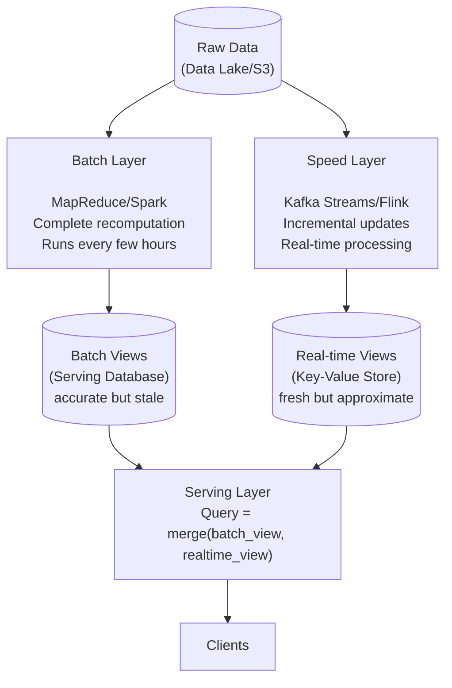
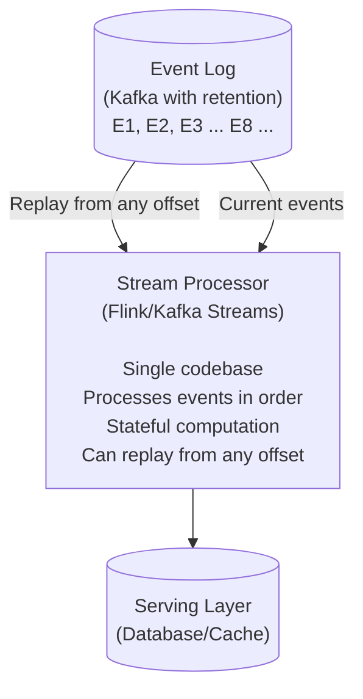
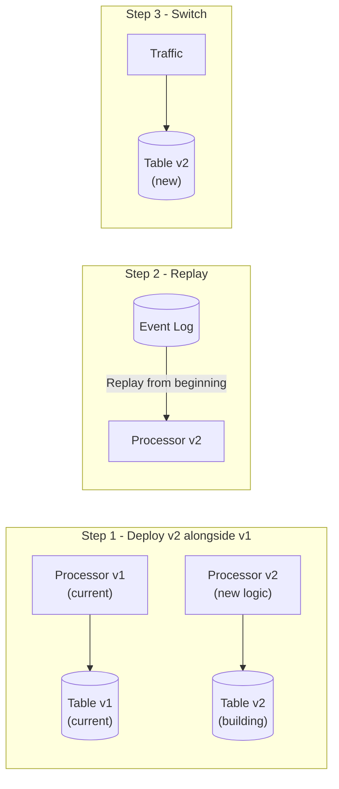

# Lambda アーキテクチャと Kappa アーキテクチャ

> **注記:** このドキュメントは英語版からの翻訳です。最新の内容や正確な情報については、[英語版オリジナル](../../13-data-pipelines/03-lambda-kappa-architecture.md)を参照してください。

## 要約

Lambda アーキテクチャは、バッチ処理とストリーム処理を組み合わせて、正確性と低レイテンシの両方を実現しますが、2つのコードベースを維持するコストが発生します。Kappa アーキテクチャは、ストリームのみに簡素化し、再処理にはリプレイを使用します。正確性の要件、運用能力、ロジックを統一できるかどうかに基づいて選択してください。

---

## Lambda アーキテクチャ

### 問題

```
バッチ処理:
✓ 正確（完全なデータ）
✓ 複雑な計算
✗ 高レイテンシ（数時間）

ストリーム処理:
✓ 低レイテンシ（数秒）
✗ 近似的（不完全なデータ）
✗ 限定的な計算

疑問: 正確性と低レイテンシの両方を実現できるか？
回答: Lambda アーキテクチャ - 両方を並列実行
```

### アーキテクチャ概要



### 実装例

```python
# Batch Layer (Spark)
class BatchProcessor:
    def run_daily(self, date):
        # Read all historical data
        events = spark.read.parquet(f"s3://data/events/")

        # Complete recomputation
        user_stats = (
            events
            .filter(col("date") <= date)
            .groupBy("user_id")
            .agg(
                count("*").alias("total_events"),
                sum("revenue").alias("total_revenue"),
                countDistinct("session_id").alias("total_sessions")
            )
        )

        # Write to batch serving layer
        user_stats.write.mode("overwrite").parquet(
            f"s3://batch-views/user_stats/date={date}/"
        )

# Speed Layer (Kafka Streams)
class SpeedProcessor:
    def process(self):
        events_stream = builder.stream("events")

        # Incremental updates (since last batch)
        user_stats = (
            events_stream
            .groupBy(lambda e: e.user_id)
            .aggregate(
                initializer=lambda: UserStats(),
                aggregator=lambda key, event, stats: stats.update(event)
            )
        )

        # Write to real-time serving layer
        user_stats.toStream().to("realtime-user-stats")

# Serving Layer
class QueryHandler:
    def get_user_stats(self, user_id):
        # Get batch view (accurate but stale)
        batch_stats = self.batch_store.get(user_id)

        # Get real-time view (fresh but incremental)
        realtime_stats = self.realtime_store.get(user_id)

        # Merge: batch provides base, real-time provides updates
        return self.merge(batch_stats, realtime_stats)

    def merge(self, batch, realtime):
        if realtime is None:
            return batch

        return UserStats(
            total_events=batch.total_events + realtime.events_since_batch,
            total_revenue=batch.total_revenue + realtime.revenue_since_batch,
            total_sessions=batch.total_sessions + realtime.sessions_since_batch
        )
```

### Lambda アーキテクチャのトレードオフ

```
メリット:
✓ 正確な結果（バッチレイヤーが信頼の源泉）
✓ 低レイテンシ（スピードレイヤーがリアルタイムを提供）
✓ 耐障害性（バッチは生データから再計算可能）
✓ 遅延データの処理（バッチがすべてを取り込む）

デメリット:
✗ 2つのコードベース（バッチ + ストリームロジック）
✗ 保守が複雑
✗ バッチウィンドウ中に結果が不整合になる可能性
✗ 運用オーバーヘッド（2つのシステムの監視が必要）
✗ コード乖離のリスク（バッチとストリームのロジックのずれ）
```

---

## Kappa アーキテクチャ

### 簡素化

```
重要な洞察: ストリーム処理ですべてが可能なら、
             なぜ2つのシステムを維持するのか？

Lambda:  Raw Data ──► Batch Layer  ──► Batch Views ──┐
                 └──► Speed Layer ──► RT Views ─────┼──► Serving
                                                    │
Kappa:   Raw Data ──► Stream Layer ──► Views ───────┴──► Serving

Kappa での再処理:
バッチ再計算の代わりに、ストリームを最初からリプレイ
```

### アーキテクチャ概要



### 再処理戦略



### 実装例

```python
# Single stream processor for all computation
class KappaProcessor:
    def __init__(self, kafka_bootstrap, starting_offset='earliest'):
        self.consumer = KafkaConsumer(
            'events',
            bootstrap_servers=kafka_bootstrap,
            auto_offset_reset=starting_offset
        )

    def process(self):
        state = {}  # In real system, use Flink state or RocksDB

        for message in self.consumer:
            event = deserialize(message.value)

            # Update state
            user_id = event['user_id']
            if user_id not in state:
                state[user_id] = UserStats()

            state[user_id].update(event)

            # Emit to output
            self.emit_to_serving(user_id, state[user_id])

    def reprocess(self):
        """Replay from beginning with new logic"""
        # Seek to beginning
        self.consumer.seek_to_beginning()

        # Clear output
        self.clear_serving_layer()

        # Reprocess all events
        self.process()

# Deployment for reprocessing
class KappaDeployment:
    def deploy_new_version(self, new_processor):
        # 1. Start new processor reading from beginning
        new_output = f"serving_v{new_version}"
        new_processor.start(output_table=new_output)

        # 2. Wait for catch-up
        while not new_processor.is_caught_up():
            time.sleep(60)

        # 3. Switch traffic
        self.update_routing(new_output)

        # 4. Cleanup old version
        old_processor.stop()
        self.delete_table(old_output)
```

### Kappa アーキテクチャのトレードオフ

```
メリット:
✓ 単一コードベース（保守が簡単）
✓ リアルタイムと再処理で同じロジック
✓ 運用オーバーヘッドが少ない
✓ 推論しやすい

デメリット:
✗ ログ保持が必要（ストレージコスト）
✗ 再処理時間がログサイズに依存
✗ ストリーム処理がすべてのユースケースに対応する必要
✗ 非常に複雑なバッチ計算には適さない場合がある
✗ 再処理中に複数バージョンの管理が必要
```

---

## Lambda と Kappa の選択

### 判断マトリクス

| 考慮事項 | Lambda | Kappa |
|---|---|---|
| チームにバッチとストリーム両方の専門知識がある | はい | |
| チームは主にストリーミングに精通 | | はい |
| 複雑な集約（ML 特徴量） | はい | |
| 単純な集約（カウント、合計） | | はい |
| 100% の正確性が必要 | はい | |
| 結果整合性が許容可能 | | はい |
| 運用のシンプルさを優先 | | はい |
| すべてのデータをログに保持可能 | | はい |
| データ量が大きく保持コストが高い | はい | |
| 頻繁な再処理が必要 | はい | |
| 再処理はまれ | | はい |

### ユースケース例

```
Lambda アーキテクチャが適している場合:
─────────────────────────────
• 機械学習の特徴量ストア
  - 複雑な特徴量エンジニアリング
  - トレーニング用の正確な過去の特徴量が必要

• 金融の照合処理
  - 日次の正確な合計が必要
  - モニタリング用のリアルタイムダッシュボード

• 調査付き不正検出
  - リアルタイムアラート（スピードレイヤー）
  - 詳細な履歴分析（バッチレイヤー）


Kappa アーキテクチャが適している場合:
─────────────────────────────
• リアルタイム分析ダッシュボード
  - カウント、合計、平均
  - 結果整合性で OK

• イベント駆動マイクロサービス
  - イベントソーシング
  - CQRS リードモデル

• IoT データ処理
  - センサー集約
  - 閾値アラート

• ユーザーアクティビティ追跡
  - セッション分析
  - リアルタイムパーソナライゼーション
```

---

## 現代の代替手段

### 統合バッチ・ストリーム (Apache Beam/Flink)

```python
# Apache Beam - same code for batch and stream
import apache_beam as beam

class CountEvents(beam.PTransform):
    def expand(self, events):
        return (
            events
            | 'Window' >> beam.WindowInto(beam.window.FixedWindows(60))
            | 'ExtractUser' >> beam.Map(lambda e: (e['user_id'], 1))
            | 'CountPerUser' >> beam.CombinePerKey(sum)
        )

# Run as batch
with beam.Pipeline(runner='DataflowRunner') as p:
    events = p | 'ReadBatch' >> beam.io.ReadFromParquet('gs://data/*.parquet')
    counts = events | CountEvents()
    counts | 'WriteBatch' >> beam.io.WriteToBigQuery('table')

# Run as stream - SAME TRANSFORM
with beam.Pipeline(runner='DataflowRunner', options=streaming_options) as p:
    events = p | 'ReadStream' >> beam.io.ReadFromPubSub(topic='events')
    counts = events | CountEvents()
    counts | 'WriteStream' >> beam.io.WriteToBigQuery('table')
```

### Delta Lake / Apache Iceberg

```python
# Delta Lake - unified batch and streaming
from delta.tables import DeltaTable

# Streaming writes
(
    spark.readStream
    .format("kafka")
    .load()
    .writeStream
    .format("delta")
    .outputMode("append")
    .start("s3://bucket/events")
)

# Batch reads (same table)
events = spark.read.format("delta").load("s3://bucket/events")

# Time travel (replay/reprocess)
events_yesterday = (
    spark.read
    .format("delta")
    .option("timestampAsOf", "2024-01-01")
    .load("s3://bucket/events")
)

# ACID transactions
# Updates, deletes, schema evolution
# No separate batch/speed layer needed
```

### Materialize / ストリーミングデータベース

```sql
-- Materialize: Streaming SQL database
-- Define sources
CREATE SOURCE events FROM KAFKA BROKER 'localhost:9092' TOPIC 'events'
FORMAT AVRO USING SCHEMA REGISTRY 'http://localhost:8081';

-- Define materialized views (continuously updated)
CREATE MATERIALIZED VIEW user_stats AS
SELECT
    user_id,
    COUNT(*) as total_events,
    SUM(revenue) as total_revenue,
    COUNT(DISTINCT session_id) as total_sessions
FROM events
GROUP BY user_id;

-- Query like a regular table (always fresh)
SELECT * FROM user_stats WHERE user_id = '123';

-- Indexes for fast lookups
CREATE INDEX user_stats_idx ON user_stats (user_id);
```

---

## 実装パターン

### サービングレイヤーの設計

```python
class HybridServingLayer:
    """
    Lambda の場合: バッチビューとリアルタイムビューをマージ
    Kappa の場合: ストリーム出力から直接サービング
    """

    def __init__(self, architecture='kappa'):
        self.architecture = architecture
        self.batch_store = BatchStore()      # e.g., Cassandra
        self.realtime_store = RealtimeStore() # e.g., Redis

    def get(self, key):
        if self.architecture == 'kappa':
            # Single source of truth
            return self.realtime_store.get(key)

        # Lambda: merge views
        batch_value = self.batch_store.get(key)
        realtime_value = self.realtime_store.get(key)

        return self.merge(batch_value, realtime_value)

    def merge(self, batch, realtime):
        """
        Merge strategy depends on your data model:
        - Additive: Sum values (counts, totals)
        - Replacement: Take latest (current state)
        - Complex: Custom merge logic
        """
        if batch is None:
            return realtime
        if realtime is None:
            return batch

        # Example: additive merge
        return {
            'count': batch['count'] + realtime.get('count_delta', 0),
            'total': batch['total'] + realtime.get('total_delta', 0),
            'batch_timestamp': batch['timestamp'],
            'realtime_timestamp': realtime.get('timestamp')
        }
```

### 再処理の調整

```python
class ReprocessingCoordinator:
    """Coordinate reprocessing in Kappa architecture"""

    def __init__(self, kafka_admin, serving_layer):
        self.kafka = kafka_admin
        self.serving = serving_layer

    def reprocess(self, new_processor_image):
        version = self.get_next_version()

        # 1. Create new consumer group
        new_group = f"processor-v{version}"

        # 2. Create new output table
        new_table = f"output_v{version}"
        self.serving.create_table(new_table)

        # 3. Deploy new processor
        processor = self.deploy(
            image=new_processor_image,
            consumer_group=new_group,
            output_table=new_table,
            starting_offset='earliest'
        )

        # 4. Monitor progress
        while True:
            lag = self.get_consumer_lag(new_group)
            if lag < LAG_THRESHOLD:
                break
            time.sleep(60)

        # 5. Switch traffic
        self.update_serving_pointer(new_table)

        # 6. Cleanup old version
        old_version = version - 1
        self.stop_processor(f"processor-v{old_version}")
        self.serving.drop_table(f"output_v{old_version}")
```

---

## 参考文献

- [Nathan Marz - Lambda Architecture](http://nathanmarz.com/blog/how-to-beat-the-cap-theorem.html)
- [Jay Kreps - Questioning the Lambda Architecture](https://www.oreilly.com/radar/questioning-the-lambda-architecture/)
- [Apache Kafka - Log Compaction](https://kafka.apache.org/documentation/#compaction)
- [Delta Lake Documentation](https://docs.delta.io/)
- [Materialize Documentation](https://materialize.com/docs/)
