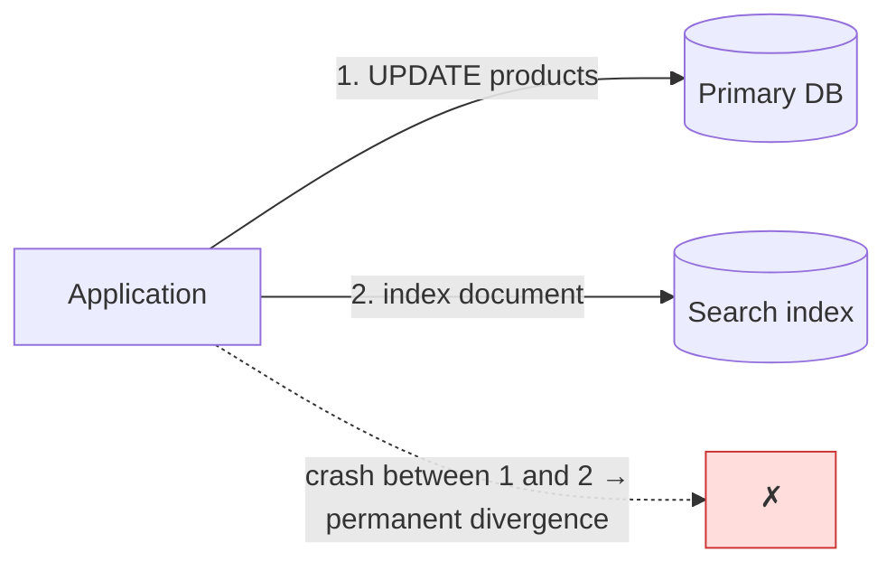
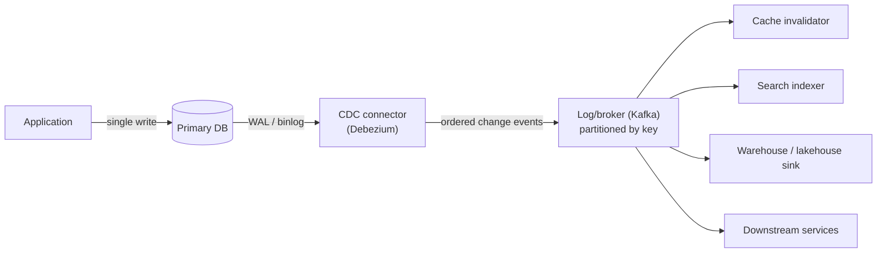

# チェンジデータキャプチャ (CDC)

> **翻訳についての注記:** 本ドキュメントは英語原文 `13-data-pipelines/04-change-data-capture.md` を日本語に翻訳したものです。コードブロックおよびMermaidダイアグラムは原文のまま維持しています。

## TL;DR

チェンジデータキャプチャ(CDC)は、データベースのレプリケーションログ — MySQLのbinlog、PostgresのWAL、Mongoのoplog — を、下流システムが消費する行変更イベントの順序付きストリームに変換します: キャッシュは無効化され、検索インデックスは更新され、ウェアハウスは同期し、サービスは二重書き込みなしに統合されます。ログベースCDCはポーリングやトリガーより厳密に優れています: 完全(削除も含む)、低オーバーヘッド、順序保証。得られるセマンティクスは**at-least-once配信、キー単位の順序、下流は結果整合** — よってコンシューマは冪等でなければなりません。運用上の鋭い角は現実です: 初期スナップショット、スキーマ進化、そして(Postgresでは)プライマリのディスクを埋めうるレプリケーションスロットの肥大化。CDCは*状態変化*の発行に使い、*意図*の発行にはその上に[アウトボックスパターン](../05-messaging/07-outbox-pattern.md)を重ねます。

---

## 問題: 二重書き込み

どんなシステムもいずれ、データベースの変更を他所 — キャッシュ、検索インデックス、ウェアハウス、別サービス — に反映する必要に直面します。素朴な方法はアプリケーションコードから両方に書くことです:



両ターゲットにまたがるトランザクションは存在しないので、書き込みの間のクラッシュ・デプロイ・部分障害は両者を乖離させます — 静かに、恒久的に。リトライロジックはハッピーパスを助け、失敗パスを悪化させます(今度は二重適用できる)。修正は構造的です: **一度だけ、データベースに書く。他のすべてはそのログから導出する。** ログはすでに順序付きで、すでに永続で、コミットされたものを正確に記録しています — CDCはそれを消費可能にするだけです。



これがKleppmannの「データベースを裏返す」です: アプリケーションのデータベースは導出パイプラインの権威ある先頭になり、すべての下流コピーはストリームから再構築可能なマテリアライズドビューになります。

---

## キャプチャ機構

| 機構 | 方法 | 削除? | オーバーヘッド | 順序 | 評価 |
|---|---|---|---|---|---|
| **ポーリング** (`WHERE updated_at > ?`) | 周期クエリ | ✗ (見逃す) | クエリ負荷。インデックス付きタイムスタンプが必要 | 弱い(クロック依存) | 小さな追記主体のテーブルのみ |
| **トリガー** | DBトリガーが監査テーブルへ書く | ✓ | *すべての*書き込みTxにインラインコスト | ✓ | 運用上脆い。プライマリを遅くする |
| **ログベース** | レプリケーションログを追尾 | ✓ | 書き込みにほぼゼロ | ✓ キー単位 | **デフォルト** |

ログベースCDCは、データベースがレプリケーションのためにすでに生成しているものを読みます([シングルリーダーレプリケーション](../02-distributed-databases/01-single-leader-replication.md)):

- **Postgres:** **レプリケーションスロット**経由のWAL論理デコード(プラグイン: `pgoutput`)。位置 = LSN。
- **MySQL:** 行ベースbinlog。位置 = GTID / binlogオフセット。
- **MongoDB:** oplog上のchange streams。

変更イベントはbefore/afterイメージと来歴を運びます:

```json
{
  "op": "u",
  "before": {"id": 42, "price": 1999, "status": "active"},
  "after":  {"id": 42, "price": 1799, "status": "active"},
  "source": {"table": "products", "lsn": 901234567, "ts_ms": 1750000000000},
  "ts_ms": 1750000000123
}
```

Debeziumがデファクトのオープンソース実装です(Postgres/MySQL/Mongo/SQL Server/Oracleのコネクタ、Kafka Connect上で稼働)。クラウド版(DynamoDB Streams、Spanner change streams、BigQueryのCDC取り込み)も同じモデルを公開しています。NetflixのDBLogとLinkedInのDatabus論文がこのアーキテクチャの系譜を記録しています。

---

## セマンティクス: コンシューマが前提すべきこと

1. **At-least-once。** コネクタの再起動は最後にコミットしたオフセットからイベントを再配信します。コンシューマは冪等にするか重複排除します — 主キーでのupsert適用は自然に冪等で、「イベントごとにカウンタを加算」はそうではありません([配信保証](../05-messaging/04-delivery-guarantees.md)、[冪等性](../01-foundations/08-idempotency.md))。
2. **順序はキー単位、グローバルではない。** ストリームを主キーでパーティションすれば行42への変更は順序通りに届きます。異なる行の変更は任意に交錯します。行をまたぐ不変条件(「注文とその明細」)には、一時的な不整合に耐えるコンシューマか、集約ルートでキー付けされたイベントが必要です。
3. **結果整合。** 下流はキャプチャ+転送+適用の分だけ遅れます — 通常はサブ秒、インシデント時は際限なく。CDCの背後のすべてのコンシューマはこう答えなければなりません: *遅延10分で何が壊れるか?* 遅延を一級のSLIとして監視します([SLO](../11-observability/05-slos-error-budgets.md): 新鮮さSLO)。
4. **トランザクションは平坦化される。** 50行のトランザクションは(共有のトランザクションメタデータ付きの)50イベントになります。トランザクション境界が必要なコンシューマはそのメタデータで再組み立てします — ほとんどは必要としないはずです。

### 初期スナップショットとストリーミングへの引き継ぎ

新しいコンシューマには現在の状態*と*変更の両方が必要です — そして引き継ぎで窓を失っても重複してもいけません。標準的な方法: ログ位置を記録し、テーブルを(チャンクで)スキャンし、記録した位置からストリームを開始し、重なりをキーで重複排除します(スナップショット行に対するキー単位の行変更の適用は冪等なので整合します)。モダンなコネクタ(Debeziumのインクリメンタルスナップショット / DBLogのインターリーブされたチャンク)はスナップショットのチャンクをストリーミングと*並行*して実行するので、2TBのテーブルの再スナップショットが変更配信を何時間も止めません。Kafkaでは、変更トピックの**ログコンパクション**との組み合わせが新規コンシューマにセルフサービスのブートストラップを与えます: コンパクト化されたトピックが*そのまま*スナップショット(キーごとの最新値)+ライブの末尾です。

---

## スキーマ進化

あなたを呼び出す部分です。コネクタはテーブルが*今*持つ形でイベントを発行し、下流のすべてのコンシューマはその形に意見を持っています。

- スキーマは**レジストリ**(Avro/Protobuf + 互換性ルール)を通すこと。非互換な変更は発行時に拒否され、午前3時のウェアハウスローダーで発見されません。
- サービスAPIと同じ規律を: その場では**追加的変更のみ**(新しいnullable列)。リネームと型変更はexpand → migrate → contractで([データベースマイグレーション](../15-deployment/03-database-migrations.md))。コンシューマは不連続を見ません。
- DDLイベント自体もキャプチャされます(Debeziumはスキーマ変更トピックを発行)。ウェアハウスローダーのようなシンクは追加的ケースをターゲットテーブルに自動反映できます。非追加的なものはコンシューマのオーナーと調整する変更として扱うこと。
- **削除には表現が必要:** 削除イベント(`before` イメージ付き)と、コンパクト化されたKafkaトピックでは**トゥームストーン**(null値) — これがあって初めてコンパクションがキーを実際に消します。削除を無視するコンシューマは不死のキャッシュを作ります。

---

## CDC vs アウトボックス: 状態 vs 意図

CDCは*テーブルで何が変わったか*を発行します — `orders.status: 'pending' → 'paid'`。*なぜ*かは語りません。ビジネスイベント(「PaymentCompleted, method=card, attempt=2」)は複数行に散っているか、そもそも保存されていないかもしれません。生のCDCはまた、コンシューマをあなたの**テーブルスキーマ**に結合します — テーブルをリファクタリングしたら、3チームが壊れます。

解決は選択ではなく重ね合わせです:

| | 生のCDC | アウトボックス経由のCDC |
|---|---|---|
| イベントの意味 | 行の状態が変わった | ビジネス上の事実が起きた |
| 契約 | テーブルスキーマ(漏れる) | 明示的なイベントスキーマ(設計物) |
| 生産者の手間 | ゼロ — テーブルは既にある | 同一Txでアウトボックステーブルにイベントを書く |
| 適所 | データ複製: キャッシュ、インデックス、ウェアハウス同期 | サービス間統合、Saga、通知 |

自分の境界内(自分のキャッシュ、検索インデックス、ウェアハウス)では生のCDCを自由に消費してください。チーム境界を越えるなら、状態変更と同一トランザクションでアウトボックステーブルに明示的なイベントを書き、CDCに*それ*を運ばせます — トランザクションから原子性を、ログから配信を、そして自分で設計した契約を得ます([アウトボックスパターン](../05-messaging/07-outbox-pattern.md)、[Sagaパターン](../05-messaging/09-saga-pattern.md))。

---

## 運用

- **Postgresのレプリケーションスロットはディスク満杯インシデントの待機列です。** スロットはコンシューマが確認するまでWALを保持します。停止したコネクタはWALを*永遠に*保持し、プライマリのディスクが埋まります。`pg_replication_slots` の保持バイトにハードな上限でアラートを(エアバッグとして `max_slot_wal_keep_size` — データベースより先にスロットが壊れるように)。
- **フェイルオーバーはゴールポストを動かします。** ログ位置はプライマリ固有で、昇格はスロット状態を無効化しえます(Postgresの論理スロットは歴史的にフェイルオーバーを生き延びませんでした。新しいバージョンはスタンバイへスロットを同期します — *自分の*バージョンで確認を)。テスト済みの再スナップショット手順を持つこと。それがCDCの災害復旧です。
- **監視で見るもの:** コネクタ遅延(秒とバイト)、テーブル別イベントスループット、スナップショット進捗、スキーマレジストリの互換性失敗、トゥームストーン率。*orders*トピックの遅延はビジネスメトリクスです。
- **上流の書き込み増幅に注意:** 意味のある変更がなくてもすべてのUPDATEがイベントになります(行全体を書き直すORM)。no-op更新はコネクタで濾過すること。さもなくばコンシューマが永遠に支払います。
- **バックフィル:** コンシューマのロジックが変わったら、コンパクト化トピックの再消費/再スナップショットでビューを再構築します — 派生ストアを手でパッチしては決していけません。ストリームから再構築できない派生データは派生ではなく、第二の真実の源です。

---

## 参考文献

- [Debezium documentation](https://debezium.io/documentation/) — コネクタ、インクリメンタルスナップショット、アウトボックスルーティング
- [Turning the database inside-out](https://martin.kleppmann.com/2015/03/04/turning-the-database-inside-out.html) — Kleppmann; アーキテクチャ論
- [DBLog: A watermark-based change-data-capture framework](https://netflixtechblog.com/dblog-a-generic-change-data-capture-framework-69351fb9099b) — Netflix; インターリーブされたスナップショット
- [All Aboard the Databus!](https://dl.acm.org/doi/10.1145/2391229.2391247) — LinkedIn; 系譜の論文
- [Postgres logical decoding](https://www.postgresql.org/docs/current/logicaldecoding.html) — スロット、プラグイン、その失敗モード
- *Designing Data-Intensive Applications*, ch. 11 — 派生データとストリーム-テーブル双対性
